# 函数重载和函数模板

## 函数重载

```c++
int add(int x, int y)
{
    return x + y;
}
```

这个简单的函数将两个整数相加并返回一个整数结果。但是，如果我们还想要一个可以添加两个浮点数的函数怎么办？这个`add()`函数不合适，因为任何浮点参数都会转换为整数，导致浮点参数丢失其小数值。

一直方法是重新写一个函数，例如

```c++
int addInteger(int x, int y)
{
    return x + y;
}

double addDouble(double x, double y)
{
    return x + y;
}
```

但也有其他方法——函数重载，能达到最佳效果，求您为具有不同类型参数的类似函数定义一致的函数命名标准，记住这些函数的名称，并实际调用正确的函数。

**函数重载**允许我们创建多个同名函数，只要每个同名函数具有不同的参数类型（或者可以通过其他方式区分函数）。每个共享名称（在同一范围内）的函数称为**重载函数**（有时简称为**重载**）。

为了重载我们的`add()`函数，我们可以简单地声明另一个`add()`接受双参数的函数：

```c++
double add(double x, double y)
{
    return x + y;
}
```

`add()`我们现在在同一范围内有两个版本：

```c++
int add(int x, int y) // integer version
{
    return x + y;
}

double add(double x, double y) // floating point version
{
    return x + y;
}

int main()
{
    return 0;
}
```

上述程序将编译通过。尽管您可能认为这些函数会导致命名冲突，但这里的情况并非如此。由于这些函数的参数类型不同，因此编译器能够区分这些函数，并将它们视为恰好共享名称的独立函数。

**关键见解**：函数可以重载，只要每个重载函数能够被编译器区分即可。如果无法区分重载函数，则会导致编译错误。

此外，当对已重载的函数进行函数调用时，编译器将根据函数调用中使用的参数尝试将函数调用与适当的重载相匹配。 这称为**重载解析**。

```c++
#include <iostream>

int add(int x, int y)
{
    return x + y;
}

double add(double x, double y)
{
    return x + y;
}

int main()
{
    std::cout << add(1, 2); // calls add(int, int)
    std::cout << '\n';
    std::cout << add(1.2, 3.4); // calls add(double, double)，根据参数不同调用对应的函数

    return 0;
}
```

重载函数编译的条件：

1、每个重载函数都必须与其他函数区分开来。

2、对重载函数的每个调用都必须解析为重载函数。后续讨论

如果没有区分重载函数，或者对重载函数的函数调用不能解析为重载函数，那么就会导致编译错误。

## 函数重载区分

### 如何区分函数重载

| 函数属性 | 用于区分 | Note                                                      |
| -------- | -------- | --------------------------------------------------------- |
| 参数数量 | 是的     |                                                           |
| 参数类型 | 是的     | 不包括typedef、类型别名和值参数上的const限定符.包括省略号 |
| 返回类型 | 不是     |                                                           |

请注意，函数的返回类型不用于区分重载函数。

对于成员函数，还会考虑附加的函数级限定符：

| 函数级限定符    | 用于超载 |
| --------------- | -------- |
| const或volatile | 是的     |
| 引用限定符      | 是的     |

举例来说，const 成员函数可以与其他相同的非 const 成员函数区分开来

### **根据参数数量进行重载**

只要每个重载函数的参数数量不同，重载函数就是有区别的。例如：

```c++
int add(int x, int y)
{
    return x + y;
}

int add(int x, int y, int z)
{
    return x + y + z;
}
```

编译器可以很容易地分辨出具有两个整数参数的函数调用应该转到`add(int, int)`，而具有三个整数参数的函数调用应该转到`add(int, int, int)`。

### **根据参数类型重载**

只要每个重载函数的参数类型列表不同，函数也可以区分。例如，以下所有重载都是有区别的：

```c++
int add(int x, int y); // integer version
double add(double x, double y); // floating point version
double add(int x, double y); // mixed version
double add(double x, int y); // mixed version
```

由于类型别名（或 typedef）不是不同的类型，因此使用类型别名的重载函数与使用别名类型的重载没有区别。例如，以下所有重载都没有区别（并且会导致编译错误）：

```c++
typedef int Height; // typedef
using Age = int; // type alias

void print(int value);
void print(Age value); // not differentiated from print(int)
void print(Height value); // not differentiated from print(int)
```

对于按值传递的参数，也不会考虑 const 限定符。因此，以下函数不被视为有区别：

```c++
void print(int);
void print(const int); // not differentiated from print(int)
```

省略号参数被认为是一种独特类型的参数：

```
void foo(int x, int y);
void foo(int x, ...); // differentiated from foo(int, int)
```

对 调用`foo(4, 5)`将匹配到`foo(int, int)`，而不是`foo(int, ...)`。

### **函数的返回类型不用于区分**

区分重载函数时不考虑函数的返回类型。

考虑一下这种情况：你想编写一个返回随机数的函数，但需要一个返回 int 的版本，以及另一个返回 double 的版本。你可能会想这样做：

```c++
int getRandomValue();
double getRandomValue();
```

在 Visual Studio 2019 上，这会导致以下编译器错误：

```c++
错误 C2556：'double getRandomValue(void)'：重载函数仅在返回类型上与'int getRandomValue(void)'不同
```

如果你是编译器，将会看到这个语句：

```c++
getRandomValue();
```

会调用这两个重载函数中的哪一个？目前还不清楚。

这是一个有意为之的选择，因为它确保函数调用的行为可以独立于表达式的其余部分来确定，从而使理解复杂表达式变得更加简单。换句话说，我们总是可以仅根据函数调用中的参数来确定将调用哪个版本的函数。如果使用返回值进行区分，那么我们就没有一种简单的语法方法来判断正在调用哪个函数重载——我们还必须了解返回值的使用方式，这需要进行更多的分析。

解决这个问题的最佳方法是赋予函数不同的名称：

```c++
int getRandomInt();
double getRandomDouble();
```

**类型签名**

函数的**类型签名**（通常称为**签名**）定义为函数头中用于区分函数的部分。在 C++ 中，这包括函数名称、参数数量、参数类型和函数级限定符。值得注意的是，它不*包括*返回类型。

**名称混乱**

当编译器编译一个函数时，它会执行**名称修改**，这意味着函数的编译名称会根据各种标准（例如参数的数量和类型）进行改变（“修改”），以便链接器具有唯一的名称可供使用。

例如，某些具有原型的函数`int fcn()`可能编译为 name `__fcn_v`，而`int fcn(int)`可能编译为 name `__fcn_i`。因此，虽然在源代码中，两个重载函数共享一个名称，但在编译后的代码中，名称实际上是唯一的。

对于如何对名称进行重组，并没有标准化，因此不同的编译器会产生不同的重组名称。

## 函数重载解析和模糊匹配

拥有一组有区别的重载函数只是成功的一半。当进行任何函数调用时，编译器还必须确保能够找到匹配的函数声明。

对于非重载函数（具有唯一名称的函数），只有一个函数可能匹配函数调用。该函数要么匹配（或者可以在应用类型转换后使其匹配），要么不匹配（并导致编译错误）。对于重载函数，可能有许多函数可能匹配函数调用。由于函数调用只能解析为其中一个，因此编译器必须确定哪个重载函数是最佳匹配。将函数调用与特定重载函数匹配的过程称为**重载解析**。

在函数参数的类型和函数参数的类型完全匹配的简单情况下，这（通常）很简单：

```c++
#include <iostream>

void print(int x)
{
     std::cout << x << '\n';
}

void print(double d)
{
     std::cout << d << '\n';
}

int main()
{
     print(5); // 5 is an int, so this matches print(int)
     print(6.7); // 6.7 is a double, so this matches print(double)

     return 0;
}
```

但是，如果函数调用中的参数类型与任何重载函数中的参数类型不完全匹配，会发生什么情况？例如：

```c++
#include <iostream>

void print(int x)
{
     std::cout << x << '\n';
}

void print(double d)
{
     std::cout << d << '\n';
}

int main()
{
     print('a'); // char does not match int or double, so what happens?字符类型不匹配，会发生什么
     print(5L); // long does not match int or double, so what happens?

     return 0;
}
```

输出：


仅仅因为这里没有完全匹配并不意味着找不到匹配项——毕竟， `char`或者`long`可以隐式转换为`int`or a `double`。 但在每种情况下，哪种转换最好？

### **解决函数调用重载**

当对重载函数进行函数调用时，编译器会逐步执行一系列规则来确定哪个重载函数（如果有）是最佳匹配

在每个步骤中，编译器都会对函数调用中的参数应用一系列不同的类型转换。对于应用的每个转换，编译器都会检查是否有任何重载函数现在匹配。在应用了所有不同类型的转换并检查匹配后，该步骤就完成了。结果将是以下三种可能结果之一：

- 未找到匹配的函数。编译器将移至序列中的下一步。
- 找到一个匹配函数。该函数被视为最佳匹配。匹配过程现已完成，后续步骤不再执行。
- 发现不止一个匹配函数。编译器将发出模糊匹配编译错误。我们稍后会进一步讨论这种情况。

如果编译器到达整个序列的末尾却没有找到匹配项，它将生成一个编译错误，提示无法为该函数调用找到匹配的重载函数。

#### **参数匹配序列**

步骤 1) 编译器尝试找到完全匹配。这分为两个阶段。首先，编译器将查看是否存在重载函数，其中函数调用中的参数类型与重载函数中的参数类型完全匹配。例如：

```c++
void foo(int)
{
}

void foo(double)
{
}

int main()
{
    foo(0);   // exact match with foo(int)
    foo(3.4); // exact match with foo(double)

    return 0;
}
```

由于`0`函数调用中的`foo(0)`是 int，因此编译器将查看是否`foo(int)`已声明过载。如果已声明过，则编译器确定为`foo(int)`完全匹配。

其次，编译器将对函数调用中的参数应用一些简单的转换。**简单的转换**是一组特定的转换规则，它们将修改类型（而不修改值）以找到匹配项。这些包括：

- 左值到右值的转换
- 资格转换（例如，非常量到常量）
- 非引用到引用的转换

例如：

```c++
void foo(const int)
{
}

void foo(const double&)
{
}

int main()
{
    int x { 1 };
    foo(x); // x trivially converted from int to const int

    double d { 2.3 };
    foo(d); // d trivially converted from double to const double&

    return 0;
}
```

在上面的例子中，我们调用了`foo(x)`，其中`x`是`int`。编译器会简单地将 转换`x`为`int`，`const int`然后匹配`foo(const int)`。我们还调用了`foo(d)`，其中`d`是`double`。编译器会简单地将 转换`d`为`double`，`const double&`然后匹配`foo(const double&)`。

通过简单转换进行的匹配被视为精确匹配。这意味着以下程序会导致**模糊匹配**：

```c++
void foo(int)
{
}

void foo(const int&)
{
}

int main()
{
    int x { 1 };
    foo(x); // ambiguous match with foo(int) and foo(const int&)

    return 0;
}
```

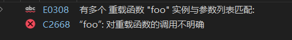

步骤 2）如果没有找到精确匹配，编译器会尝试通过对参数应用数字提升来找到匹配项。在课程 **隐式类型转换**中，我们介绍了如何将某些窄整数和浮点类型自动提升为更宽的类型，例如`int`或`double`。如果在数字提升后找到匹配项，则解析函数调用。

例如：

```c++
void foo(int)
{
}

void foo(double)
{
}

int main()
{
    foo('a');  // promoted to match foo(int)
    foo(true); // promoted to match foo(int)
    foo(4.5f); // promoted to match foo(double)

    return 0;
}
```

对于`foo('a')`，由于在上一步找不到精确的匹配项`foo(char)`，因此这个编译器会将字符 `a`转换为int，然后寻找最佳匹配项，找到 `foo(int)`，因此函数调用解析为`foo(int)`

步骤 3）如果通过数字提升未找到匹配项，则编译器尝试通过对参数应用数字转换

```c++
#include <string> // for std::string

void foo(double)
{
}

void foo(std::string)
{
}

int main()
{
    foo('a'); // 'a' converted to match foo(double)

    return 0;
}
```

在这种情况下，由于没有`foo(char)`（完全匹配）并且没有`foo(int)`（提升匹配），因此`'a'`被数值转换为双精度并与 匹配`foo(double)`。

**关键见解**：通过应用数字提升而产生的匹配优先于通过应用数字转换而产生的任何匹配。

步骤 4) 如果通过数字转换未找到匹配项，则编译器会尝试通过任何用户定义的转换来查找匹配项。虽然我们还没有介绍用户定义的转换，但某些类型（如类）可以定义到可以隐式调用的其他类型的转换。下面是一个例子，只是为了说明这一点：

```c++
// We haven't covered classes yet, so don't worry if this doesn't make sense
class X // this defines a new type called X
{
public:
    operator int() { return 0; } // Here's a user-defined conversion from X to int
};

void foo(int)
{
}

void foo(double)
{
}

int main()
{
    X x; // Here, we're creating an object of type X (named x)
    foo(x); // x is converted to type int using the user-defined conversion from X to int

    return 0;
}
```

在这个例子中，编译器首先会检查是否`foo(X)`存在 到 的精确匹配。我们还没有定义。接下来，编译器会检查 是否`x`可以进行数值提升，但不能。然后，编译器会检查 是否可以进行数值转换，但同样不能。最后，编译器会查找任何用户定义的转换。因为我们已经定义了从到 的`x`用户定义转换，所以编译器会将其转换为 到匹配。`X``int``X``int``foo(int)`

应用用户定义转换后，编译器可能会应用其他隐式提升或转换来查找匹配项。因此，如果我们的用户定义转换是`char`而不是类型`int`，则编译器将使用用户定义转换`char`然后将结果提升为`int`匹配项。

**Note**：类的构造函数也充当从其他类型到该类类型的用户定义转换，并且可以在此步骤中使用来查找匹配的函数。

步骤5）如果通过用户定义转换没有找到匹配，编译器将寻找使用省略号的匹配函数。

步骤6）如果此时还没有找到匹配项，编译器将放弃并发出有关无法找到匹配函数的编译错误。

#### 不明确的匹配

对于非重载函数，每个函数调用要么解析为一个函数，要么找不到匹配项，并且编译器将发出编译错误：

```c++
void foo()
{
}

int main()
{
     foo(); // okay: match found
     goo(); // compile error: no match found

     return 0;
}
```

对于重载函数，还有第三种可能的结果：`ambiguous match`可能会找到一个。当编译器发现两个或多个可以在同一步骤中匹配的函数时，就会发生**模糊匹配**。发生这种情况时，编译器将停止匹配并发出编译错误，指出它发现了模糊的函数调用。

由于每个重载函数都必须区分才能进行编译，因此您可能想知道函数调用如何可能导致多个匹配。让我们看一个示例来说明这一点：

```c++
void foo(int)
{
}

void foo(double)
{
}

int main()
{
    foo(5L); // 5L is type long

    return 0;
}
```

由于 literal`5L`的类型为`long`，编译器将首先查看是否能找到 的精确匹配`foo(long)`，但找不到。接下来，编译器将尝试数字提升，但 类型的值`long`无法提升，因此这里也没有匹配。

随后，编译器将尝试通过对`long`参数应用数字转换来找到匹配项。在检查所有数字转换规则的过程中，编译器将找到两个潜在匹配项。如果参数`long`被数字转换为`int`，则函数调用将匹配`foo(int)`。如果`long`参数被转换为`double`，则它将匹配`foo(double)`。由于已经找到了两个通过数字转换可能匹配的函数调用，因此该函数调用被视为不明确。

在 Visual Studio 2022 上，这会导致以下错误消息：


#### 关键见解

如果编译器在给定步骤中找到多个匹配项，则会导致函数调用不明确。这意味着给定步骤中的任何匹配项都不会被认为比同一步骤中的任何其他匹配项更好。

这是另一个产生模糊匹配的示例：

```c++
void foo(unsigned int)
{
}

void foo(float)
{
}

int main()
{
    foo(0); // int can be numerically converted to unsigned int or to float
    foo(3.14159); // double can be numerically converted to unsigned int or to float

    return 0;
}
```

尽管您可能希望`0`解析为`foo(unsigned int)`并`3.14159`解析为`foo(float)`，但这两个调用都会导致不明确的匹配。该`int`值`0`可以数字转换为`unsigned int`或`float`，因此两个重载都同样匹配，结果是一个不明确的函数调用。

这同样适用于将 a 转换`double`为 a`float`或`unsigned int`。两者都是数字转换，因此两种重载都同样匹配，结果再次不明确。

#### **解决模糊匹配**

由于歧义匹配是编译时错误，因此在程序编译之前需要消除歧义匹配。有几种方法可以解决歧义匹配：

1. 通常，最好的方法是简单地定义一个新的重载函数，该函数采用与您尝试调用该函数的类型完全相同的参数。然后 C++ 将能够找到函数调用的精确匹配。
2. 或者，显式转换模糊参数以匹配要调用的函数的类型。例如，要在上述示例中使用`foo(0)`匹配，您可以执行以下操作：`foo(unsigned int)`

```c++
int x{ 0 };
foo(static_cast<unsigned int>(x)); // will call foo(unsigned int)
```

3.如果您的参数是文字，则可以使用文字后缀来确保您的文字被解释为正确的类型：

```c++
foo(0u); // will call foo(unsigned int) since 'u' suffix is unsigned int, so this is now an exact match
```

#### **匹配具有多个参数的函数**

如果有多个参数，编译器会依次将匹配规则应用于每个参数。所选函数是每个参数至少与所有其他函数匹配的函数，并且至少一个参数的匹配度高于所有其他函数。换句话说，所选函数必须为至少一个参数提供比所有其他候选函数更好的匹配度，并且不为所有其他参数提供更差的匹配度。

如果找到这样的函数，则它显然是最佳选择。如果找不到这样的函数，则调用将被视为不明确的（或不匹配）。

例如：

```c++
#include <iostream>

void print(char, int)
{
	std::cout << 'a' << '\n';
}

void print(char, double)
{
	std::cout << 'b' << '\n';
}

void print(char, float)
{
	std::cout << 'c' << '\n';
}

int main()
{
	print('x', 'a');

	return 0;
}
```

在上面的程序中，所有函数都与第一个参数完全匹配。但是，顶部函数通过提升匹配第二个参数，而其他函数则需要转换。因此，`print(char, int)`毫无疑问是最佳匹配。

## 删除函数

在某些情况下，编写的函数在使用某些类型的值调用时可能无法按预期运行。

```c++
#include <iostream>

void printInt(int x)
{
    std::cout << x << '\n';
}

int main()
{
    printInt(5);    // okay: prints 5
    printInt('a');  // prints 97 -- does this make sense?
    printInt(true); // print 1 -- does this make sense?

    return 0;
}
```

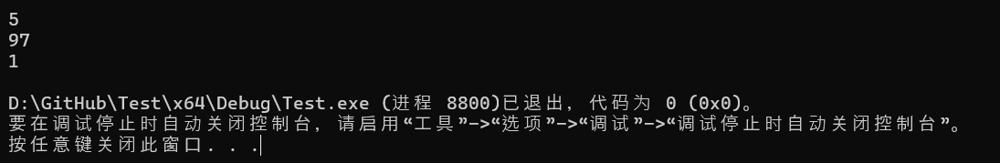

虽然`printInt(5)`显然没问题，但对 的另外两个调用`printInt()`就比较成问题了。使用`printInt('a')`，编译器将确定它可以提升`'a'`为 int 值`97`，以便将函数调用与函数定义相匹配。并且它将提升`true`为 int 值`1`。而且它会毫无怨言地这样做。

假设我们认为使用`charbool`对``printInt()`类型的值进行调用是没有意义的。我们该怎么办？

### =`delete`使用说明符删除函数

如果我们明确不希望某个函数可调用，则可以使用**= delete**说明符将该函数定义为已删除。如果编译器将函数调用与已删除的函数匹配，则编译将因编译错误而停止。

以下是使用该语法的上述内容的更新版本：

```c++
#include <iostream>

void printInt(int x)
{
    std::cout << x << '\n';
}

void printInt(char) = delete; // calls to this function will halt compilation表面函数删除了
void printInt(bool) = delete; // calls to this function will halt compilation

int main()
{
    printInt(97);   // okay

    printInt('a');  // compile error: function deleted
    printInt(true); // compile error: function deleted

    printInt(5.0);  // compile error: ambiguous match

    return 0;
}
```

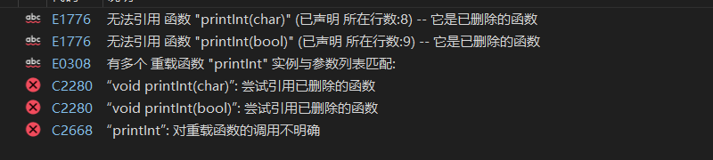

让我们快速看一下其中的一些。首先，`printInt('a')`是 的直接匹配`printInt(char)`，它被删除。因此，编译器会产生编译错误。`printInt(true)`是 的直接匹配`printInt(bool)`，它被删除，因此也会产生编译错误。

`printInt(5.0)`是一个有趣的案例，可能会产生意想不到的结果。首先，编译器检查是否`printInt(double)`存在精确匹配。不存在。接下来，编译器尝试找到最佳匹配。尽管`printInt(int)`是唯一未被删除的函数，但已删除的函数仍被视为函数重载解析中的候选函数。由于这些函数中没有一个是明确的最佳匹配，因此编译器将发出模糊匹配编译错误。

#### 关键见解

`= delete`意思是“我禁止这个”，而不是“这个不存在”。

删除函数参与函数重载解析的所有阶段（而不仅仅是精确匹配阶段）。如果选择了删除函数，则会导致编译错误。

其他类型的函数也可以类似地删除

### **删除所有不匹配的重载**

删除一堆单独的函数重载可以正常工作，但可能会很冗长。有时我们可能希望仅使用类型与函数参数完全匹配的参数来调用某个函数。我们可以通过使用函数模板（在即将到来的 **函数模板** 中介绍）来实现这一点，如下所示：

```c++
#include <iostream>

// This function will take precedence for arguments of type int
void printInt(int x)
{
    std::cout << x << '\n';
}

// This function template will take precedence for arguments of other types
// Since this function template is deleted, calls to it will halt compilation
template <typename T>
void printInt(T x) = delete;

int main()
{
    printInt(97);   // okay
    printInt('a');  // compile error
    printInt(true); // compile error

    return 0;
}
```

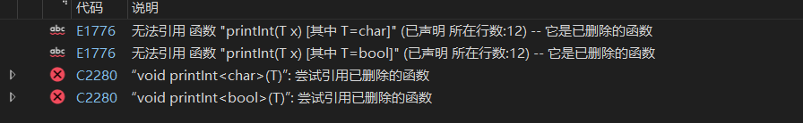

## 默认参数

**默认参数**是为函数参数提供的默认值。例如：

```c++
void print(int x, int y=10) // 10 is the default argument
{
    std::cout << "x: " << x << '\n';
    std::cout << "y: " << y << '\n';
}
```

在进行函数调用时，调用者可以选择为具有默认参数的任何函数参数提供参数。如果调用者提供了参数，则使用函数调用中参数的值。如果调用者未提供参数，则使用默认参数的值。

考虑以下程序：

```c++
#include <iostream>

void print(int x, int y=4) // 4 is the default argument
{
    std::cout << "x: " << x << '\n';
    std::cout << "y: " << y << '\n';
}

int main()
{
    print(1, 2); // y will use user-supplied argument 2
    print(3); // y will use default argument 4, as if we had called print(3, 4)

    return 0;
}
```

该程序产生以下输出：

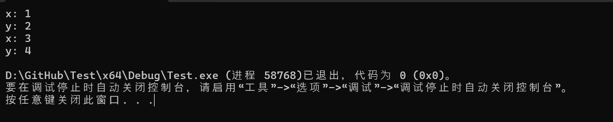

`4`在第一个函数调用中，调用者为两个参数提供了显式参数，因此使用这些参数值。在第二个函数调用中，调用者省略了第二个参数，因此使用了默认值。

请注意，必须使用等号来指定默认参数。使用括号或大括号初始化不起作用：

```c++
void foo(int x = 5);   // ok
void goo(int x ( 5 )); // compile error
void boo(int x { 5 }); // compile error
```

可能令人惊讶的是，默认参数由编译器在调用点处理。在上面的例子中，当编译器看到时`print(3)`，它会将此函数调用重写为`print(3, 4)`，以便参数的数量与参数的数量相匹配。重写的函数调用然后照常工作。

**关键见解** 默认参数由编译器在函数调用处插入。

### **何时使用默认参数**

当函数需要一个具有合理默认值的值，但您希望让调用者根据需要覆盖该值时，默认参数是一个很好的选择。

例如，下面是一些通常使用默认参数的函数原型：

```c++
int rollDie(int sides=6);
void openLogFile(std::string filename="default.log");
```

**Note**：由于用户可以选择是否提供特定参数值或使用默认值，因此提供默认值的参数有时被称为**可选参数**。但是，术语*可选参数*也用于指代其他几种类型的参数（包括通过地址传递的参数和使用 的参数`std::optional`），因此我们建议避免使用此术语。

### 多个默认参数

一个函数可以有多个带有默认参数的参数：

```c++
#include <iostream>

void print(int x=10, int y=20, int z=30)
{
    std::cout << "Values: " << x << " " << y << " " << z << '\n';
}

int main()
{
    print(1, 2, 3); // all explicit arguments
    print(1, 2); // rightmost argument defaulted
    print(1); // two rightmost arguments defaulted
    print(); // all arguments defaulted

    return 0;
}
```

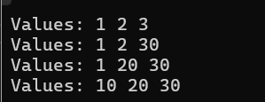

C++（从 C++23 开始）不再支持诸如 之类的函数调用语法（作为在使用和 的默认参数时`print(,,3)`为 提供显式值的一种方式）。这有三个主要后果：`z``x``y`

1. 在函数调用中，任何明确提供的参数必须是最左边的参数（不能跳过具有默认值的参数）。

例如：

```c++
void print(std::string_view sv="Hello", double d=10.0);

int main()
{
    print();           // okay: both arguments defaulted
    print("Macaroni"); // okay: d defaults to 10.0
    print(20.0);       // error: does not match above function (cannot skip argument for sv)

    return 0;
}
```

2.如果为某个参数赋予了默认参数，则所有后续参数（右侧）也必须赋予默认参数。

不允许以下行为

```c++
void print(int x=10, int y); // not allowed
```

**规则**：如果为某个参数赋予了默认参数，则所有后续参数（右侧）也必须赋予默认参数。

3.如果多个参数具有默认参数，则最左边的参数应该是最有可能由用户明确设置的参数。

**默认参数不能重新声明，必须在使用前声明**

一旦声明，默认参数就不能在同一个翻译单元中重新声明。这意味着对于具有前向声明和函数定义的函数，默认参数可以在前向声明或函数定义中声明，但不能同时在两者中声明。

```c++
#include <iostream>

void print(int x, int y=4); // forward declaration

void print(int x, int y=4) // compile error: redefinition of default argument
{
    std::cout << "x: " << x << '\n';
    std::cout << "y: " << y << '\n';
}
```


默认参数还必须在翻译单元中声明后才能使用：

```c++
#include <iostream>

void print(int x, int y); // forward declaration, no default argument

int main()
{
    print(3); // compile error: default argument for y hasn't been defined yet

    return 0;
}

void print(int x, int y=4)
{
    std::cout << "x: " << x << '\n';
    std::cout << "y: " << y << '\n';
}
```


最佳做法是在前向声明中声明默认参数而不是在函数定义中，因为前向声明更有可能被其他文件看到并在使用前包含在内（特别是如果它在头文件中）。

在 foo.h 中：

```c++
#ifndef FOO_H
#define FOO_H
void print(int x, int y=4);
#endif
```

在main.cpp中：

```c++
#include "foo.h"
#include <iostream>

void print(int x, int y)
{
    std::cout << "x: " << x << '\n';
    std::cout << "y: " << y << '\n';
}

int main()
{
    print(5);

    return 0;
}
```

请注意，在上面的例子中，我们能够使用函数的默认参数，`print()`因为*main.cpp* #includes *foo.h*，它具有定义默认参数的前向声明。

**最佳实践**：如果函数有前向声明（尤其是头文件中的声明），则将默认参数放在那里。否则，将默认参数放在函数定义中。

### **默认参数和函数重载**

具有默认参数的函数可能会被重载。例如，允许以下内容：

```c++
#include <iostream>
#include <string_view>

void print(std::string_view s)
{
    std::cout << s << '\n';
}

void print(char c = ' ')
{
    std::cout << c << '\n';
}

int main()
{
    print("Hello, world"); // resolves to print(std::string_view)
    print('a');            // resolves to print(char)
    print();               // resolves to print(char)

    return 0;
}
```

函数调用`print()`就像用户明确调用了一样`print(' ')`，解析为`print(char)`。

现在考虑这种情况

```c++
void print(int x);                  // signature print(int)
void print(int x, int y = 10);      // signature print(int, int)
void print(int x, double y = 20.5); // signature print(int, double)
```

在最后一种情况下，编译器无法判断是否`print(1)`应该解析为`print(int)`第二个参数具有默认值的两个函数之一。结果是一个模糊的函数调用。

## 函数模板

假设你想编写一个函数来计算两个数字中的最大值。你可以这样做：

```c++
int max(int x, int y)
{
    return (x < y) ? y : x;
    // Note: we use < instead of > because std::max uses <
}
```

虽然调用者可以将不同的值传递给函数，但参数的类型是固定的，因此调用者只能传入`int`值。这意味着此函数实际上仅适用于整数（以及可以提升为的类型`int`）。

那么，当你想找到两个`double`值中的最大值时会发生什么？因为 C++ 要求我们指定所有函数参数的类型，所以解决方案是创建一个新的重载版本，`max`其参数类型为`double`：

```c++
double max(double x, double y)
{
    return (x < y) ? y: x;
}
```

请注意，double 版本的实现代码`max`与的 int 版本的实现代码完全相同`max`！事实上，此实现适用于许多不同类型：包括`int``double``long``long double`，甚至您自己创建的新类型（我们将在以后的课程中介绍如何创建）。

必须为我们要支持的每组参数类型创建具有相同实现的重载函数，这是一件令人头疼的事情，也容易导致错误，而且明显违反了 DRY（不要重复自己）原则。这里还有一个不太明显的挑战：希望使用该`max`函数的程序员可能希望使用作者`max`未预料到的参数类型来调用它（因此没有为其编写重载函数）。

`max`我们真正缺少的是编写一个可以处理任何类型的参数（甚至是编写代码时可能未预料到的类型）的单一版本的方法`max`。普通函数在这里根本无法胜任这项任务。幸运的是，C++ 支持另一个专门为解决此类问题而设计的功能。

### **C++ 模板简介**

在 C++ 中，模板系统旨在简化创建能够处理不同数据类型的函数（或类）的过程。

我们无需手动创建一堆几乎相同的函数或类（每个不同类型的集合一个），而是创建一个*模板*。就像普通定义一样，**模板**描述了函数或类的样子。与普通定义（必须指定所有类型）不同，在模板中，我们可以使用一个或多个占位符类型。占位符类型表示在编写模板时未知但稍后会提供的某种类型。

一旦定义了模板，编译器就可以使用该模板生成所需数量的重载函数（或类），每个函数使用不同的实际类型！

最终结果是一样的——我们最终得到了一堆几乎相同的函数或类（每组不同类型的函数或类各一个）。但我们只需创建和维护一个模板，编译器会为我们完成所有艰苦的工作。

**关键见解**：编译器可以使用单个模板来生成一系列相关的函数或类，每个函数或类使用一组不同的类型。

**Note**：

<u>因为模板背后的概念很难用语言描述，所以让我们尝试一个类比。</u>

<u>如果您在字典中查找“模板”这个词，您会发现类似如下的定义：“模板是一种模型，可作为创建类似对象的模式”。一种非常容易理解的模板是模板。模板是一块薄薄的材料（例如一块纸板或塑料），上面切出一个形状（例如一张笑脸）。通过将模板放在另一个物体上，然后通过孔喷漆，您可以非常快速地复制切出的形状。模板本身只需创建一次，然后可以根据需要重复使用多次，以创建任意多种不同颜色的切出形状。更好的是，用模板制作的形状的颜色不必在实际使用模板时确定。</u>

<u>模板本质上是用于创建函数或类的模板。我们创建模板（我们的模板）一次，然后可以根据需要多次使用它，以模板化出特定实际类型的函数或类。这些实际类型在实际使用模板之前不需要确定。</u>

因为实际类型直到模板在程序中使用时才确定（而不是在编写模板时），所以模板的作者不必尝试预测可能使用的所有实际类型。这意味着模板代码可以用于编写模板时甚至不存在的类型！稍后，当我们开始探索 C++ 标准库时，我们将看到这如何派上用场，该库绝对充满了模板代码！

**关键见解**：模板可以处理编写模板时甚至不存在的类型。这有助于使模板代码既灵活又面向未来！

### **函数模板**

**函数模板**是一种类似于函数的定义，用于生成一个或多个重载函数，每个重载函数都有一组不同的实际类型。这样我们就可以创建可以处理多种不同类型的函数。

当我们创建函数模板时，我们使用占位符类型（也称为**类型模板参数**，或非正式的**模板类型**）来表示任何参数类型、返回类型或我们想要稍后指定的函数体中使用的类型。

**Note**：

<u>C++ 支持 3 种不同类型的模板参数：</u>

- <u>类型模板参数（其中模板参数代表一种类型）。</u>
- <u>非类型模板参数（其中模板参数表示 constexpr 值）。</u>
- <u>模板模板参数（其中模板参数代表一个模板）。</u>

函数模板最好通过示例来教授，因此让我们将`max(int, int)`上面示例中的普通函数转换为函数模板。这非常简单，我们将在此过程中解释发生的事情。

### 创建max函数模板

以下是 再一次的 int 版本`max`：

```c++
int max(int x, int y)
{
    return (x < y) ? y : x;
}
```

`int`请注意，我们在此函数中使用了三次类型：一次用于参数`x`，一次用于参数`y`，一次用于函数的返回类型。

要创建函数模板，我们要做两件事。首先，我们将用类型模板参数替换特定类型。在本例中，因为我们只有一种需要替换的类型（`int`），所以我们只需要一个类型模板参数（我们将其称为`T`）：

这是我们使用单一模板类型的新功能：

```c++
T max(T x, T y) // won't compile because we haven't defined T
{
    return (x < y) ? y : x;
}
```

这是一个好的开始——但是，它无法编译，因为编译器不知道它`T`是什么！而且这仍然是一个普通函数，而不是函数模板。

其次，我们要告诉编译器这是一个函数模板，而这`T`是一个类型模板参数，它是任何类型的占位符。这是通过所谓的**模板参数声明**来完成的。模板参数声明的范围仅限于其后的函数模板（或类模板）。因此，每个函数模板（或类）都需要自己的模板参数声明。

```c++
template <typename T> // this is the template parameter declaration
T max(T x, T y) // this is the function template definition for max<T>
{
    return (x < y) ? y : x;
}
```

在模板参数声明中，我们以关键字 开头`template`，它告诉编译器我们正在创建一个模板。接下来，我们在尖括号 ( `<>`) 内指定模板将使用的所有模板参数。对于每个类型模板参数，我们使用关键字`typename`或`class`，后跟类型模板参数的名称（例如`T`）。

**Note**：

<u>`typename`在此上下文中，和关键字之间没有区别`class`。您经常会看到人们使用`class`关键字，因为它是较早引入该语言的。但是，我们更喜欢较新的关键字`typename`，因为它可以更清楚地表明类型模板参数可以被任何类型（例如基本类型）替换，而不仅仅是类类型。</u>

创建了`max`函数的模板版本，现在可以接受不同类型的参数。

因为此函数模板有一个名为 的模板类型`T`，所以我们将其称为`max<T>`。在下一课中，我们将了解如何使用`max<T>`函数模板生成一个或多个`max()`具有不同类型参数的函数。

### **命名模板参数**

就像我们经常在平凡的情况下使用单个字母来表示变量名（例如`x`），当模板参数以平凡或明显的方式使用时，习惯上也使用单个大写字母（以 开头`T`）。例如，在我们的`max`函数模板中：

```c++
template <typename T>
T max(T x, T y)
{
    return (x < y) ? y : x;
}
```

我们不需要给出`T`一个复杂的名称，因为它显然只是被比较的值的占位符类型，并且`T`可以是任何可以比较的类型（例如`int`、`double`或`char`，但不是`nullptr`）。

我们的函数模板一般都会使用这种命名约定。

如果类型模板参数具有不明显的用法或必须满足的特定要求，则此类名称有两种常见的约定：

- 以大写字母开头（例如`Allocator`）。标准库使用此命名约定。
- 以 为前缀`T`，然后以大写字母开头（例如`TAllocator`）。这使得更容易看出该类型是类型模板参数。

选择哪一个取决于个人喜好。

**Note：**

例如，标准库有一个重载，`std::max`其声明如下：

```c++
template< class T, class Compare >
const T& max( const T& a, const T& b, Compare comp ); // ignore the & for now, we'll cover these in a future lesson
```

因为`a`和`b`的类型为`T`，我们知道我们不在乎`a`和的类型`b`——它们可以是任何类型。因为`comp`类型为`Compare`，我们知道`comp`一定是符合要求的类型`Compare`。

当函数模板被实例化时，编译器会用模板实参替换模板形参，然后编译生成的实例化函数。函数是否能通过编译取决于函数中每种类型的对象的使用方式。因此，给定模板形参的要求本质上是隐式定义的。

由于很难根据该类型的对象的使用方式推断出要求，因此这是控制台技术文档非常有用的领域之一，这些文档应明确说明要求。例如，如果我们想知道 a 的要求`Compare`是什么，我们可以查找文档`std::max`（例如参见https://en.cppreference.com/w/cpp/algorithm/max），它应该列在那里。

### 最佳实践

使用以 开头的单个大写字母`T`（例如`T`，，，等等……）来命名以琐碎或明显的方式使用并表示“任何合理类型”的类型模板参数`U`。`V`

如果类型模板参数具有非明显的用法或必须满足的特定要求，则需要更具描述性的名称（例如`Allocator`或`TAllocator`）。

## 函数模板实例化

把一个普通`max()`函数转换成`max<T>`函数模板：

```c++
template <typename T>
T max(T x, T y)
{
    return (x < y) ? y : x;
}
```

将重点介绍如何使用函数模板。

### **使用函数模板**

函数模板实际上不是函数——其代码不会被直接编译或执行。相反，函数模板只有一个任务：生成函数（会被编译和执行）。

要使用我们的`max<T>`函数模板，我们可以使用以下语法进行函数调用：

```c++
max<actual_type>(arg1, arg2); // actual_type 是某种实际类型，例如 int 或 double
```

这看起来很像一个正常的函数调用——主要的区别是在尖括号中增加了类型（称为**模板参数**），它指定了将用来代替模板类型的实际类型`T`。

我们通过一个简单的例子来看一下：

```c++
#include <iostream>

template <typename T>
T max(T x, T y)
{
    return (x < y) ? y : x;
}

int main()
{
    std::cout << max<int>(1, 2) << '\n'; // instantiates and calls function max<int>(int, int)

    return 0;
}
```

当编译器遇到函数调用时`max<int>(1, 2)`，它会确定的函数定义`max<int>(int, int)`尚不存在。因此，编译器将隐式使用我们的`max<T>`函数模板来创建一个。

从函数模板（具有模板类型）创建函数（具有特定类型）的过程称为**函数模板实例化**（或简称**实例化**）。当函数由于函数调用而实例化时，这称为**隐式实例化**。从模板实例化的函数在技术上称为**特化**，但在普通语言中通常称为**函数实例**。产生特化的模板称为**主模板**。函数实例在各方面都是普通函数。

**命名法**

术语“特化”更常用于指显式特化，它允许我们显式定义特化（而不是从主模板隐式实例化）。我们将在**函数模板特化**中介绍显式特化。

实例化函数的过程很简单：编译器本质上克隆主模板并`T`用我们指定的实际类型（）替换模板类型（ `int`）。

因此，当我们调用时`max<int>(1, 2)`，实例化的函数特化看起来像这样：

```c++
template<> // ignore this for now
int max<int>(int x, int y) // the generated function max<int>(int, int)
{
    return (x < y) ? y : x;
}
```

这是与上面相同的例子，展示了所有实例完成之后编译器实际编译的内容：


```c++
#include <iostream>

// a declaration for our function template (we don't need the definition any more)
template <typename T>
T max(T x, T y);

template<>
int max<int>(int x, int y) // the generated function max<int>(int, int)
{
    return (x < y) ? y : x;
}

int main()
{
    std::cout << max<int>(1, 2) << '\n'; // instantiates and calls function max<int>(int, int)

    return 0;
}
```

您可以自己编译它并查看它是否有效。函数模板仅在每个翻译单元中第一次进行函数调用时实例化。对该函数的进一步调用将被路由到已实例化的函数。

相反，如果没有对函数模板进行函数调用，则函数模板将不会在该翻译单元中实例化。

我们再举一个例子：

```c++
#include <iostream>

template <typename T>
T max(T x, T y) // function template for max(T, T)
{
    return (x < y) ? y : x;
}

int main()
{
    std::cout << max<int>(1, 2) << '\n';    // instantiates and calls function max<int>(int, int)
    std::cout << max<int>(4, 3) << '\n';    // calls already instantiated function max<int>(int, int)
    std::cout << max<double>(1, 2) << '\n'; // instantiates and calls function max<double>(double, double)

    return 0;
}
```

这与前面的示例类似，但这次我们的函数模板将用于生成两个函数：一次用 替换`T`，`int`另一次用 替换`T`。`double`在所有实例化之后，程序将如下所示：

```c++
#include <iostream>

// a declaration for our function template (we don't need the definition any more)
template <typename T>
T max(T x, T y);

template<>
int max<int>(int x, int y) // the generated function max<int>(int, int)
{
    return (x < y) ? y : x;
}

template<>
double max<double>(double x, double y) // the generated function max<double>(double, double)
{
    return (x < y) ? y : x;
}

int main()
{
    std::cout << max<int>(1, 2) << '\n';    // instantiates and calls function max<int>(int, int)
    std::cout << max<int>(4, 3) << '\n';    // calls already instantiated function max<int>(int, int)
    std::cout << max<double>(1, 2) << '\n'; // instantiates and calls function max<double>(double, double)

    return 0;
}
```

这里还要注意一点：当我们实例化 时`max<double>`，实例化的函数具有 类型的参数`double`。因为我们提供了`int`参数，所以这些参数将被隐式转换为`double`。

### **模板参数推导**

在大多数情况下，我们想要用于实例化的实际类型将与函数参数的类型相匹配。例如：

```c++
std::cout << max<int>(1, 2) << '\n'; // specifying we want to call max<int>
```

在这个函数调用中，我们指定了我们要用`int` 替换`T`，但我们也使用`int`参数调用该函数。

如果参数的类型与我们想要的实际类型匹配，我们不需要指定实际类型——相反，我们可以使用**模板参数推导**让编译器从函数调用中的参数类型中推断出应该使用的实际类型。

例如，不要像这样进行函数调用：

```c++
std::cout << max<int>(1, 2) << '\n'; // specifying we want to call max<int>
```

我们可以改为执行下列操作之一：

```c++
std::cout << max<>(1, 2) << '\n';
std::cout << max(1, 2) << '\n';
```

在任何一种情况下，编译器都会发现我们没有提供实际类型，因此它将尝试从函数参数中推断出实际类型，这将允许它生成一个`max()`函数，其中所有模板参数都与所提供参数的类型匹配。在此示例中，编译器将推断使用`max<T>`具有实际类型的函数模板`int`可以实例化函数`max<int>(int, int)`，以便两个函数参数的类型（`int`）与所提供参数的类型（`int`）匹配。

两种情况的区别在于编译器如何解析一组重载函数中的函数调用。在上例中（带有空尖括号），编译器`max<int>`在确定要调用哪个重载函数时将仅考虑模板函数重载。在下例中（没有尖括号），编译器将同时考虑`max<int>`模板函数重载和`max`非模板函数重载。当下例结果为模板函数和非模板函数同样可行时，将优先考虑非模板函数。

**关键见解**：正常的函数调用语法将优先选择非模板函数，而不是从模板实例化的同样可行的函数。

例如：

```c++
#include <iostream>

template <typename T>
T max(T x, T y)
{
    std::cout << "called max<int>(int, int)\n";
    return (x < y) ? y : x;
}

int max(int x, int y)
{
    std::cout << "called max(int, int)\n";
    return (x < y) ? y : x;
}

int main()
{
    std::cout << max<int>(1, 2) << '\n'; // calls max<int>(int, int)
    std::cout << max<>(1, 2) << '\n';    // deduces max<int>(int, int) (non-template functions not considered)
    std::cout << max(1, 2) << '\n';      // calls max(int, int)

    return 0;
}
```

请注意，底部的语法与普通函数调用完全相同！在大多数情况下，这种普通函数调用语法将是我们用来调用从函数模板实例化的函数的语法。

造成这种情况的原因如下：

- 语法更加简洁。
- 我们很少会同时拥有匹配的非模板函数和函数模板。
- 如果我们确实有一个匹配的非模板函数和一个匹配的函数模板，我们通常会更喜欢调用非模板函数。

最后一点可能不太明显。函数模板具有适用于多种类型的实现 - 但因此，它必须是通用的。非模板函数仅处理特定的类型组合。它可以具有比函数模板版本更优化或更专门针对这些特定类型的实现。例如：

```c++
#include <iostream>

// This function template can handle many types, so its implementation is generic
template <typename T>
void print(T x)
{
    std::cout << x; // print T however it normally prints
}

// This function only needs to consider how to print a bool, so it can specialize how it handles
// printing of a bool
void print(bool x)
{
    std::cout << std::boolalpha << x; // print bool as true or false, not 1 or 0
}

int main()
{
    print<bool>(true); // calls print<bool>(bool) -- prints 1
    std::cout << '\n';

    print<>(true);     // deduces print<bool>(bool) (non-template functions not considered) -- prints 1
    std::cout << '\n';

    print(true);       // calls print(bool) -- prints true
    std::cout << '\n';

    return 0;
}
```

**最佳实践**：调用从函数模板实例化的函数时，请优先使用正常的函数调用语法（除非您需要函数模板版本优先于匹配的非模板函数）。

### 具有非模板参数的函数模板

可以创建同时具有模板参数和非模板参数的函数模板。类型模板参数可以匹配任何类型，非模板参数的工作方式与普通函数的参数相同。

例如：

```c++
// T is a type template parameter
// double is a non-template parameter
// We don't need to provide names for these parameters since they aren't used
template <typename T>
int someFcn(T, double)
{
    return 5;
}

int main()
{
    someFcn(1, 3.4); // matches someFcn(int, double)
    someFcn(1, 3.4f); // matches someFcn(int, double) -- the float is promoted to a double
    someFcn(1.2, 3.4); // matches someFcn(double, double)
    someFcn(1.2f, 3.4); // matches someFcn(float, double)
    someFcn(1.2f, 3.4f); // matches someFcn(float, double) -- the float is promoted to a double

    return 0;
}
```

这个函数模板的第一个参数是模板化的，但是第二个参数的类型是固定的`double`。注意，返回类型也可以是任意类型。在这种情况下，我们的函数将始终返回一个`int`值。

### **实例化的函数可能并不总是能编译**

考虑以下程序：

```c++
#include <iostream>

template <typename T>
T addOne(T x)
{
    return x + 1;
}

int main()
{
    std::cout << addOne(1) << '\n';
    std::cout << addOne(2.3) << '\n';

    return 0;
}
```

编译器将有效地编译并执行该代码：

```c++
#include <iostream>

template <typename T>
T addOne(T x);

template<>
int addOne<int>(int x)
{
    return x + 1;
}

template<>
double addOne<double>(double x)
{
    return x + 1;
}

int main()
{
    std::cout << addOne(1) << '\n';   // calls addOne<int>(int)
    std::cout << addOne(2.3) << '\n'; // calls addOne<double>(double)

    return 0;
}
```

但如果我们尝试这样的事情会怎样？

```c++
#include <iostream>
#include <string>

template <typename T>
T addOne(T x)
{
    return x + 1;
}

int main()
{
    std::string hello { "Hello, world!" };
    std::cout << addOne(hello) << '\n';

    return 0;
}
```

当编译器尝试解析时`addOne(hello)`，它不会找到与 匹配的非模板函数`addOne(std::string)`，但它会找到 的函数模板`addOne(T)`，并确定它可以`addOne(std::string)`从中生成一个函数。因此，编译器将生成并编译以下内容：

```c++
#include <iostream>
#include <string>

template <typename T>
T addOne(T x);

template<>
std::string addOne<std::string>(std::string x)
{
    return x + 1;
}

int main()
{
    std::string hello{ "Hello, world!" };
    std::cout << addOne(hello) << '\n';

    return 0;
}
```

但是，这将产生编译错误，因为当是 时`x + 1`没有意义。这里显而易见的解决方案就是不要使用 类型的参数进行调用。

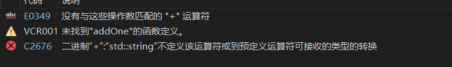

### **实例化的函数在语义上可能并不总是有意义的**

只要实例化的函数模板在语法上有意义，编译器就会成功编译它。但是，编译器无法检查此类函数在语义上是否有意义。

例如：

```c++
#include <iostream>

template <typename T>
T addOne(T x)
{
    return x + 1;
}

int main()
{
    std::cout << addOne("Hello, world!") << '\n';

    return 0;
}
```

在此示例中，我们调用`addOne()`的是 C 样式的字符串文字。这在语义上究竟意味着什么？谁知道呢！

也许令人惊讶的是，因为 C++ 在语法上允许将整数值添加到字符串文字中（我们将在以后的课程**[17.9-指针算法和下标]**中介绍这一点），上面的例子编译并产生以下结果：

**警告**：只要函数模板在语法上有效，编译器就会实例化并编译语义上无意义的函数模板。您有责任确保使用有意义的参数调用此类函数模板。

我们可以告诉编译器，禁止实例化带有某些参数的函数模板。这是通过使用函数模板特化来实现的，它允许我们为特定的一组模板参数重载函数模板，同时`= delete`，它告诉编译器任何使用该函数的行为都应引发编译错误。

```c++
#include <iostream>
#include <string>

template <typename T>
T addOne(T x)
{
    return x + 1;
}

// Use function template specialization to tell the compiler that addOne(const char*) should emit a compilation error
// const char* will match a string literal
template <>
const char* addOne(const char* x) = delete;

int main()
{
    std::cout << addOne("Hello, world!") << '\n'; // compile error

    return 0;
}
```

### 函数模板和非模板参数的默认参数

和普通函数一样，函数模板可以为非模板参数设置默认参数。从模板实例化的每个函数都将使用相同的默认参数。

例如：

```c++
#include <iostream>

template <typename T>
void print(T val, int times=1)
{
    while (times--)
    {
        std::cout << val;
    }
}

int main()
{
    print(5);      // print 5 1 time
    print('a', 3); // print 'a' 3 times

    return 0;
}
```

小心带有可修改静态局部变量的函数模板

在课程[**7.10——静态局部变量**](https://www.learncpp.com/cpp-tutorial/static-local-variables/)中，我们讨论了静态局部变量，它是具有静态持续时间的局部变量（它们在程序的整个生命周期内持续存在）。

当在函数模板中使用静态局部变量时，从该模板实例化的每个函数都将具有静态局部变量的单独版本。如果静态局部变量是 const，则这很少会成为问题。但如果静态局部变量是经过修改的变量，则结果可能与预期不符。

例如：

```c++
#include <iostream>

// Here's a function template with a static local variable that is modified
template <typename T>
void printIDAndValue(T value)
{
    static int id{ 0 };
    std::cout << ++id << ") " << value << '\n';
}

int main()
{
    printIDAndValue(12);
    printIDAndValue(13);

    printIDAndValue(14.5);

    return 0;
}
```

你可能期望最后一行打印`3) 14.5`。然而，编译器实际上编译并执行的是：

```c++
#include <iostream>

template <typename T>
void printIDAndValue(T value);

template <>
void printIDAndValue<int>(int value)
{
    static int id{ 0 };
    std::cout << ++id << ") " << value << '\n';
}

template <>
void printIDAndValue<double>(double value)
{
    static int id{ 0 };
    std::cout << ++id << ") " << value << '\n';
}

int main()
{
    printIDAndValue(12);   // calls printIDAndValue<int>()
    printIDAndValue(13);   // calls printIDAndValue<int>()

    printIDAndValue(14.5); // calls printIDAndValue<double>()

    return 0;
}
```

请注意，`printIDAndValue<int>`和`printIDAndValue<double>`各自都有自己独立的静态局部变量，名为`id`，而不是它们之间共享的变量。

### **通用编程**

由于模板类型可以替换为任何实际类型，因此模板类型有时也称为**泛型类型**。由于模板可以与特定类型无关地编写，因此使用模板进行编程有时称为**泛型编程**。与 C++ 通常侧重于类型和类型检查不同，泛型编程让我们专注于算法逻辑和数据结构设计，而不必过多担心类型信息。

### **结论**

一旦你习惯了编写函数模板，你就会发现编写它们实际上并不比编写具有实际类型的函数花费更多时间。函数模板可以最大限度地减少需要编写和维护的代码量，从而显著减少代码维护和错误。

函数模板确实有一些缺点，如果不提它们，那就太失礼了。首先，编译器将为每个函数调用创建（并编译）一个函数，该函数具有一组唯一的参数类型。因此，尽管函数模板编写起来很紧凑，但它们可能会扩展为大量的代码，这会导致代码膨胀和编译时间变长。函数模板更大的缺点是它们往往会产生看起来疯狂、几乎不可读的错误消息，这些错误消息比常规函数的错误消息更难解读。这些错误消息可能相当吓人，但一旦你明白了它们试图告诉你什么，它们指出的问题通常很容易解决。

与模板为您的编程工具包带来的功能和安全性相比，这些缺点相当小，因此请在需要类型灵活性的任何地方自由使用模板！一个好的经验法则是首先创建普通函数，然后如果您发现需要不同参数类型的重载，则将它们转换为函数模板。

## 在多个文件中使用函数模板

考虑以下不能正常工作的程序：

主程序：

```c++
#include <iostream>

template <typename T>
T addOne(T x); // function template forward declaration

int main()
{
    std::cout << addOne(1) << '\n';
    std::cout << addOne(2.3) << '\n';

    return 0;
}
```

添加.cpp：

```c++
template <typename T>
T addOne(T x) // function template definition
{
    return x + 1;
}
```

如果`addOne`是非模板函数，则该程序可以正常工作：在*main.cpp*中，编译器会对 的前向声明感到满意，并且链接器会将*main.cpp*中`addOne`的调用连接到*add.cpp*中的函数定义。

但是由于`addOne`它是一个模板，这个程序无法运行，并且我们得到一个链接器错误：

```c++
1>Project6.obj：错误 LNK2019：无法解析的外部符号“int __cdecl addOne<int>(int)”(??$addOne@H@@YAHH@Z)，该符号在函数 _main 中被引用
1>Project6.obj：错误 LNK2019：无法解析的外部符号“double __cdecl addOne<double>(double)”(??$addOne@N@@YANN@Z)，该符号在函数 _main 中被引用
```

在*main.cpp*中，我们调用`addOne<int>`和`addOne<double>`。但是，由于编译器看不到函数模板的定义`addOne`，因此它无法在*main.cpp*中实例化这些函数。但它确实看到了前向声明`addOne`，并会假定这些函数存在于其他地方并将在稍后链接。

当编译器开始编译*add.cpp*时，它将看到函数模板的定义。但是， *add.cpp*`addOne`中没有使用此模板，因此编译器不会实例化任何内容。最终结果是链接器无法将*main.cpp*中对和 的调用连接到实际函数，因为这些函数从未被实例化。

如果*add.cpp*实例化了这些函数，程序就可以顺利编译和链接。但这种解决方案很脆弱，应该避免：如果后来更改了*add.cpp*中的代码，导致不再实例化这些函数，程序将再次无法链接。或者，如果*main.cpp*调用了未在*add.cpp*中实例化的不同版本`addOne<float>`（例如） ，我们就会遇到同样的问题。

解决此问题的最常规方法是将所有模板代码放在头文件（.h）中，而不是源文件（.cpp）中：

添加.h：

```c++
#ifndef ADD_H
#define ADD_H

template <typename T>
T addOne(T x) // function template definition
{
    return x + 1;
}

#endif
```

主程序：

```c++
#include "add.h" // import the function template definition
#include <iostream>

int main()
{
    std::cout << addOne(1) << '\n';
    std::cout << addOne(2.3) << '\n';

    return 0;
}
```

这样，任何需要访问模板的文件都可以 #include 相关头文件，模板定义将由预处理器复制到源文件中。然后编译器将能够实例化所需的任何函数。

您可能想知道为什么这不会违反单一定义规则 (ODR)。ODR 规定，类型、模板、内联函数和内联变量可以在不同的文件中具有相同的定义。因此，如果将模板定义复制到多个文件中（只要每个定义相同），则不会出现问题。

但是实例化的函数本身呢？如果一个函数在多个文件中实例化，那怎么不违反 ODR 呢？答案是从模板隐式实例化的函数是隐式内联的。而且如您所知，内联函数可以在多个文件中定义，只要每个文件中的定义相同即可。

**关键见解**：

模板定义不受“一次定义规则”的限制，该规则要求每个程序只能有一个定义，因此将同一个模板定义 #include 到多个源文件中是没有问题的。从函数模板隐式实例化的函数是隐式内联的，因此它们可以在多个文件中定义，只要每个定义都相同即可。

模板本身不是内联的，因为内联的概念仅适用于变量和函数。

下面是将函数模板放在头文件中的另一个示例，因此它可以包含到多个源文件中：

max.h：

```c++
#ifndef MAX_H
#define MAX_H

template <typename T>
T max(T x, T y)
{
    return (x < y) ? y : x;
}

#endif
```

foo.cpp：

```c++
#include "max.h" // import template definition for max<T>(T, T)
#include <iostream>

void foo()
{
	std::cout << max(3, 2) << '\n';
}
```

主程序：

```c++
#include "max.h" // import template definition for max<T>(T, T)
#include <iostream>

void foo(); // forward declaration for function foo

int main()
{
    std::cout << max(3, 5) << '\n';
    foo();

    return 0;
}
```

在上面的例子中，main.cpp 和 foo.cpp`#include "max.h"`这两个文件中的代码都可以使用`max<T>(T, T)`函数模板。

**最佳实践**:多个文件中需要的模板应该在头文件中定义，然后在需要的地方使用 #included。这样编译器就可以查看完整的模板定义，并在需要时实例化模板。

## 具有多种模板类型的函数模板

我们编写了一个函数模板来计算两个值的最大值：

```c++
#include <iostream>

template <typename T>
T max(T x, T y)
{
    return (x < y) ? y : x;
}

int main()
{
    std::cout << max(1, 2) << '\n';   // will instantiate max(int, int)
    std::cout << max(1.5, 2.5) << '\n'; // will instantiate max(double, double)

    return 0;
}
```

现在考虑以下类似的程序：

```c++
#include <iostream>

template <typename T>
T max(T x, T y)
{
    return (x < y) ? y : x;
}

int main()
{
    std::cout << max(2, 3.5) << '\n';  // compile error

    return 0;
}
```

您可能会惊讶地发现该程序无法编译。相反，编译器会发出一堆（可能看起来很疯狂的）错误消息。在 Visual Studio 上，作者得到了以下信息：


在函数调用中`max(2, 3.5)`，我们传递了两种不同类型的参数：one`int`和 one `double`。由于我们在函数调用时没有使用尖括号来指定实际类型，因此编译器将首先查看是否存在非模板匹配`max(int, double)`。但它找不到。

接下来，编译器将查看是否可以找到函数模板匹配项（使用模板参数推导，我们在第[11.7 课——函数模板实例化](https://www.learncpp.com/cpp-tutorial/function-template-instantiation/)中介绍过）。但是，这也会失败，原因很简单：`T`只能表示一种类型。没有 的类型`T`可以让编译器将函数模板实例化为`max<T>(T, T)`具有两种不同参数类型的函数。换句话说，因为函数模板中的两个参数都是 类型`T`，所以它们必须解析为相同的实际类型。

由于找不到非模板匹配和模板匹配，函数调用无法解析，并且我们收到编译错误。

您可能想知道为什么编译器不生成函数`max<double>(double, double)`，然后使用数字转换将参数类型转换`int`为 a `double`。答案很简单：仅在解析函数重载时进行类型转换，而不是在执行模板参数推导时进行类型转换。

缺少类型转换是故意的，至少有两个原因。首先，它有助于使事情变得简单：我们要么找到函数调用参数和模板类型参数之间的精确匹配，要么找不到。其次，它允许我们创建函数模板，用于我们想要确保两个或多个参数具有相同类型的情况（如上例所示）。

我们必须找到另一种解决方案。幸运的是，我们可以用（至少）三种方法解决这个问题。

### **使用 static_cast 将参数转换为匹配类型**

第一个解决方案是让调用者承担将参数转换为匹配类型的负担。例如：

```c++
#include <iostream>

template <typename T>
T max(T x, T y)
{
    return (x < y) ? y : x;
}

int main()
{
    std::cout << max(static_cast<double>(2), 3.5) << '\n'; // convert our int to a double so we can call max(double, double)

    return 0;
}
```

现在两个参数都是类型`double`，编译器将能够实例化`max(double, double)`以满足此函数调用。

但是，这种解决方案比较笨拙并且难以阅读。

### 提供显式类型模板参数

如果我们编写了一个非模板`max(double, double)`函数，那么我们将能够调用`max(int, double)`并让隐式类型转换规则将我们的`int`参数转换为，`double`以便可以解析函数调用:

```c++
#include <iostream>

double max(double x, double y)
{
    return (x < y) ? y : x;
}

int main()
{
    std::cout << max(2, 3.5) << '\n'; // the int argument will be converted to a double

    return 0;
}
```

但是，当编译器进行模板参数推导时，它不会进行任何类型转换。幸运的是，如果我们指定要使用的显式类型模板参数，则不必使用模板参数推导：

```c++
#include <iostream>

template <typename T>
T max(T x, T y)
{
    return (x < y) ? y : x;
}

int main()
{
    // we've explicitly specified type double, so the compiler won't use template argument deduction
    std::cout << max<double>(2, 3.5) << '\n';

    return 0;
}
```

在上面的例子中，我们调用`max<double>(2, 3.5)`。由于我们明确指定了`T`应该替换为`double`，因此编译器不会使用模板参数推导。相反，它只会实例化函数`max<double>(double, double)`，然后对任何不匹配的参数进行类型转换。我们的`int`参数将隐式转换为`double`。

虽然这比使用更具可读性`static_cast`，但如果我们在进行函数调用时根本不必考虑类型，那就更好了`max`。

### **具有多个模板类型参数的函数模板**

我们问题的根源在于我们只`T`为函数模板定义了单一模板类型（），然后指定两个参数必须是相同的类型。

解决这个问题的最好方法是重写我们的函数模板，使我们的参数可以解析为不同的类型。`T`我们现在不再使用一个模板类型参数，而是使用两个（`T`和`U`）：

```c++
#include <iostream>

template <typename T, typename U> // We're using two template type parameters named T and U
T max(T x, U y) // x can resolve to type T, and y can resolve to type U
{
    return (x < y) ? y : x; // uh oh, we have a narrowing conversion problem here
}

int main()
{
    std::cout << max(2, 3.5) << '\n'; // resolves to max<int, double>

    return 0;
}
```

因为我们已经定义`x`了 模板类型`T`，和`y`模板类型`U`，现在`x`可以`y`独立解析它们的类型。当我们调用 时`max(2, 3.5)`，`T`可以是`int`， 也`U`可以是`double`。编译器会很乐意`max<int, double>(int, double)`为我们实例化。

**关键见解**:由于`T`和`U`是独立的模板参数，因此它们可以独立地解析其类型。这意味着`T`和`U`可以解析为不同类型，也可以解析为相同类型。

但是，这个例子不能正常工作。如果你编译并运行这个程序（关闭“将警告视为错误”），它将产生以下结果：

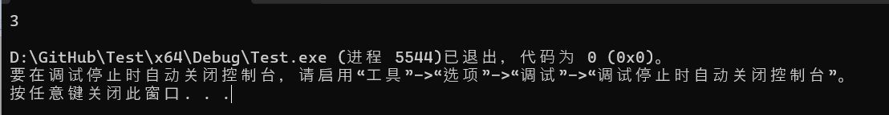

这是怎么回事？`2`和的最大值怎么会`3.5`是`3`？

条件运算符 (?:) 要求其 (非条件) 操作数具有相同的通用类型。通常的算术规则 ( [10.5 -- 算术转换](https://www.learncpp.com/cpp-tutorial/arithmetic-conversions/)`int`) 用于确定通用类型，并且条件运算符的结果也将使用此通用类型。例如，和`double`的通用类型为`double`，因此当我们的条件运算符的 (非条件) 操作数为 an`int`和 a时`double`，条件运算符生成的值将为 类型`double`。在本例中，这就是值`3.5`，这是正确的。

但是，我们函数的声明返回类型是`T`。当`T`是 并且是 时`int`，函数的返回类型是。我们的值正在经历向值的窄化转换，导致数据丢失（并且可能出现编译器警告）。`U``double``int``3.5``int``3`

那么我们该如何解决这个问题呢？将返回类型改为 a`U`并不能解决问题，因为`max(3.5, 2)`has `U`as an`int`会出现同样的问题。

这对于返回类型来说是一个很好的用途`auto`——我们将让编译器从返回语句中推断出返回类型应该是什么：

```c++
#include <iostream>

template <typename T, typename U>
auto max(T x, U y)#自动转化
{
    return (x < y) ? y : x;
}

int main()
{
    std::cout << max(2, 3.5) << '\n';

    return 0;
}
```

此版本现在`max`可以很好地处理不同类型的操作数。请注意，具有返回类型的函数`auto`需要完全定义才能使用（前向声明是不够的），因为编译器必须检查函数实现才能确定返回类型。

**Note**：如果我们需要一个可以前向声明的函数，我们必须明确返回类型。由于我们的返回类型需要是 和 的通用类型`T`，`U`我们可以使用`std::common_type_t`（在课程[10.5 -- 算术转换](https://www.learncpp.com/cpp-tutorial/arithmetic-conversions/)中讨论）来获取 和 的通用类型，`T`并将`U`其用作我们的显式返回类型：

```c++
#include <iostream>

template <typename T, typename U>
auto max(T x, U y) -> std::common_type_t<T, U>; // returns the common type of T and U

int main()
{
    std::cout << max(2, 3.5) << '\n';

    return 0;
}

template <typename T, typename U>
auto max(T x, U y) -> std::common_type_t<T, U>
{
    return (x < y) ? y : x;
}
```

### **缩写函数模板**

C++20 引入了关键字的新用法`auto`：当`auto`关键字在普通函数中用作参数类型时，编译器会自动将该函数转换为函数模板，每个自动参数都将成为独立的模板类型参数。这种创建函数模板的方法称为**缩写函数模板**。

例如：

```c++
auto max(auto x, auto y)
{
    return (x < y) ? y : x;
}
```

在 C++20 中是以下内容的简写：

```c++
template <typename T, typename U>
auto max(T x, U y)
{
    return (x < y) ? y : x;
}
```

和我们上面写的函数模板是一样的`max`。

如果您希望每个模板类型参数都是独立的类型，则最好使用此形式，因为删除模板参数声明行可以使您的代码更简洁、更易读。

当您希望多个自动参数为同一类型时，没有简洁的方法使用缩写函数模板。也就是说，对于以下情况，没有简单的缩写函数模板：

```c++
template <typename T>
T max(T x, T y) // two parameters of the same type
{
    return (x < y) ? y : x;
}
```

**最佳实践**：可以随意使用具有单个自动参数的缩写函数模板，或者每个自动参数应该是独立类型（并且您的语言标准设置为 C++20 或更新版本）。

### 函数模板可以重载

就像函数可以重载一样，函数模板也可以重载。此类重载可以具有不同数量的模板类型和/或不同数量或类型的函数参数：

```c++
#include <iostream>

// Add two values with matching types
template <typename T>
auto add(T x, T y)
{
    return x + y;
}

// Add two values with non-matching types
// As of C++20 we could also use auto add(auto x, auto y)
template <typename T, typename U>
auto add(T x, U y)
{
    return x + y;
}

// Add three values with any type
// As of C++20 we could also use auto add(auto x, auto y, auto z)
template <typename T, typename U, typename V>
auto add(T x, U y, V z)
{
    return x + y + z;
}

int main()
{
    std::cout << add(1.2, 3.4) << '\n'; // instantiates and calls add<double>()
    std::cout << add(5.6, 7) << '\n';   // instantiates and calls add<double, int>()
    std::cout << add(8, 9, 10) << '\n'; // instantiates and calls add<int, int, int>()

    return 0;
}
```

这里有趣的一点是，对于对的调用，尽管两者都可能匹配，但`add(1.2, 3.4)`编译器会优先选择`add<T>(T, T)`。`add<T, U>(T, U)`

确定多个匹配函数模板中哪个是首选的规则称为“函数模板的部分排序”。简而言之，哪个函数模板限制性更强/更特殊，哪个就是首选。`add<T>(T, T)`在这种情况下是限制性更强的函数模板（因为它只有一个模板参数），所以它是首选。

如果多个函数模板可以匹配一个调用，而编译器无法确定哪个更具限制性，则编译器将出现匹配不明确的错误。

## 非类型模板参数

虽然类型模板参数是迄今为止最常用的模板参数类型，但还有另一种值得了解的模板参数：非类型模板参数。

### 非类型模板参数

**非类型模板参数**是具有固定类型的模板参数，它作为模板参数传入的 constexpr 值的占位符。

非类型模板参数可以是以下任意类型：

- 整数类型
- 枚举类型
- `std::nullptr_t`
- 浮点类型（自 C++20 起）
- 指向对象的指针或引用
- 指向函数的指针或引用
- 指向成员函数的指针或引用
- 文字类类型（自 C++20 起）

`std::bitset`当我们在课程O.1 中讨论时，看到了非类型模板参数的第一个示例[--通过 std::bitset 进行位标志和位操作](https://www.learncpp.com/cpp-tutorial/bit-flags-and-bit-manipulation-via-stdbitset/)：

```c++
#include <bitset>

int main()
{
    std::bitset<8> bits{ 0b0000'0101 }; // The <8> is a non-type template parameter

    return 0;
}
```

在 的情况下`std::bitset`，非类型模板参数用于告诉`std::bitset`我们希望它存储多少位。

### **定义我们自己的非类型模板参数**

这是一个使用 int 非类型模板参数的函数的简单示例：

```c++
#include <iostream>

template <int N> // declare a non-type template parameter of type int named N
void print()
{
    std::cout << N << '\n'; // use value of N here
}

int main()
{
    print<5>(); // 5 is our non-type template argument

    return 0;
}
```

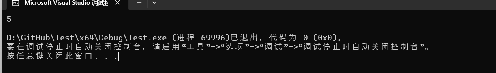

在第 3 行，我们有模板参数声明。在尖括号内，我们定义了一个名为 的非类型模板参数`N`，它将是 类型值的占位符`int`。在`print()`函数内部，我们使用 的值`N`。

在第 11 行，我们调用了 function `print()`，它使用 int 值`5`作为非类型模板参数。当编译器看到此调用时，它将实例化一个如下所示的函数：

```c++
template <>
void print<5>()
{
    std::cout << 5 << '\n';
}
```

### 非类型模板参数有什么用处？

从 C++20 开始，函数参数不能是 constexpr。这对于普通函数、constexpr 函数（这是有道理的，因为它们必须能够在运行时运行）以及可能令人惊讶的，甚至 consteval 函数都是如此。

假设我们有一个像这样的函数：

```c++
#include <cassert>
#include <cmath> // for std::sqrt
#include <iostream>

double getSqrt(double d)
{
    assert(d >= 0.0 && "getSqrt(): d must be non-negative");

    // The assert above will probably be compiled out in non-debug builds
    if (d >= 0)
        return std::sqrt(d);

    return 0.0;
}

int main()
{
    std::cout << getSqrt(5.0) << '\n';
    std::cout << getSqrt(-5.0) << '\n';

    return 0;
}
```

运行时，对的调用`getSqrt(-5.0)`将在运行时断言。虽然这比没有好，因为`-5.0`是文字（并且隐式 constexpr），但如果我们可以 static_assert 以便在编译时捕获此类错误会更好。但是，static_assert 需要常量表达式，并且函数参数不能是 constexpr…

但是，如果我们将函数参数改为非类型模板参数，那么我们就可以按照我们想要的方式去做：

```c++
#include <cmath> // for std::sqrt
#include <iostream>

template <double D> // requires C++20 for floating point non-type parameters
double getSqrt()
{
    static_assert(D >= 0.0, "getSqrt(): D must be non-negative");

    if constexpr (D >= 0) // ignore the constexpr here for this example
        return std::sqrt(D); // strangely, std::sqrt isn't a constexpr function (until C++26)

    return 0.0;
}

int main()
{
    std::cout << getSqrt<5.0>() << '\n';
    std::cout << getSqrt<-5.0>() << '\n';

    return 0;
}
```

此版本编译失败。当编译器遇到时`getSqrt<-5.0>()`，它将实例化并调用如下所示的函数：

```c++
template <>
double getSqrt<-5.0>()
{
    static_assert(-5.0 >= 0.0, "getSqrt(): D must be non-negative");

    if constexpr (-5.0 >= 0) // ignore the constexpr here for this example
        return std::sqrt(-5.0);

    return 0.0;
}
```

static_assert 条件为假，因此编译器断言。

**关键见解**

非类型模板参数主要用于当我们需要将 constexpr 值传递给函数（或类类型）时，以便它们可以在需要常量表达式的上下文中使用。

类类型`std::bitset`使用非类型模板参数来定义要存储的位数，因为位数必须是 constexpr 值。

必须使用非类型模板参数来规避函数参数不能为 constexpr 的限制，这不是一个好主意。目前有相当多的提案正在评估中，以帮助解决此类情况。我预计，在未来的 C++ 语言标准中，我们可能会看到更好的解决方案。

### **非类型模板参数的隐式转换**

某些非类型模板参数可以隐式转换，以便匹配不同类型的非类型模板参数。例如：

```c++
#include <iostream>

template <int N> // int non-type template parameter
void print()
{
    std::cout << N << '\n';
}

int main()
{
    print<5>();   // no conversion necessary
    print<'c'>(); // 'c' converted to type int, prints 99

    return 0;
}
```

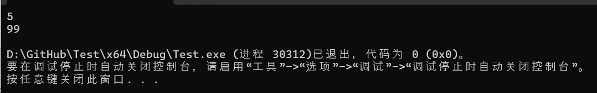

在上面的例子中，为了匹配函数模板的非类型模板参数，`'c'`被转换为，然后将该值打印为。`int``print()``int`

在此上下文中，仅允许某些类型的 constexpr 转换。最常见的允许转换类型包括：

- 积分促销（`char`例如`int`）
- 积分转换（例如`char`到`long`或`int`到`char`）
- 用户定义的转换（例如某些程序定义的类`int`）
- 左值到右值的转换（例如某个变量`x`到的值`x`）

请注意，此列表的许可程度低于列表初始化允许的隐式转换类型。例如，您可以`double`使用列表初始化类型变量`constexpr int`，但`constexpr int`非类型模板实参不会转换`double`为非类型模板形参。

[允许的转换的完整列表可以在这里的](https://en.cppreference.com/w/cpp/language/constant_expression)“转换常量表达式”小节下找到。

与普通函数不同，将函数模板调用与函数模板定义进行匹配的算法并不复杂，并且根据所需转换的类型（或缺乏转换），某些匹配不会优先于其他匹配。这意味着，如果函数模板针对不同类型的非类型模板参数进行重载，则很容易导致模糊匹配：

```c++
#include <iostream>

template <int N> // int non-type template parameter
void print()
{
    std::cout << N << '\n';
}

template <char N> // char non-type template parameter
void print()
{
    std::cout << N << '\n';
}

int main()
{
    print<5>();   // ambiguous match with int N = 5 and char N = 5
    print<'c'>(); // ambiguous match with int N = 99 and char N = 'c'

    return 0;
}
```

也许令人惊讶的是，这两次调用都`print()`导致了模棱两可的匹配。

### 使用C++17对非类型模板参数进行类型推断`auto`

从 C++17 开始，非类型模板参数可用于`auto`让编译器从模板参数中推断出非类型模板参数：

```c++
#include <iostream>

template <auto N> // deduce non-type template parameter from template argument
void print()
{
    std::cout << N << '\n';
}

int main()
{
    print<5>();   // N deduced as int `5`
    print<'c'>(); // N deduced as char `c`

    return 0;
}
```

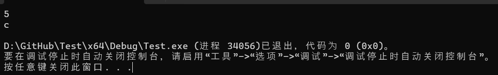

您可能想知道为什么此示例不会像上一节中的示例那样产生歧义匹配。编译器首先查找歧义匹配，然后如果不存在歧义匹配，则实例化函数模板。在这种情况下，只有一个函数模板，因此不存在可能的歧义。

在实例化上述示例的函数模板后，程序看起来像这样：

```c++
#include <iostream>

template <auto N>
void print()
{
    std::cout << N << '\n';
}

template <>
void print<5>() // note that this is print<5> and not print<int>
{
    std::cout << 5 << '\n';
}

template <>
void print<'c'>() // note that this is print<`c`> and not print<char>
{
    std::cout << 'c' << '\n';
}

int main()
{
    print<5>();   // calls print<5>
    print<'c'>(); // calls print<'c'>

    return 0;
}
```

## 总结和测验

**函数重载**允许我们创建多个同名函数，只要每个同名函数具有不同的参数类型集（或者可以通过其他方式区分）。这样的函数称为**重载函数**（或简称为**重载**）。不考虑返回类型进行区分。

在解析重载函数时，如果找不到精确匹配，则编译器将优先选择可以通过数字提升匹配的重载函数，而不是需要数字转换的重载函数。当对已重载的函数进行函数调用时，编译器将尝试根据函数调用中使用的参数将函数调用与适当的重载进行匹配。这称为**重载解析**。

当编译器发现两个或多个函数可以将函数调用与重载函数匹配，但无法确定哪一个是最佳函数时，就会出现**歧义匹配**。

**默认参数**是为函数参数提供的默认值。具有默认参数的参数必须始终是最右边的参数，并且在解析重载函数时不会使用它们来区分函数。

**函数模板**允许我们创建类似函数的定义，作为创建相关函数的模式。在函数模板中，我们使用**类型模板参数**作为我们稍后想要指定的任何类型的占位符。告诉编译器我们正在定义模板并声明模板类型的语法称为**模板参数声明**。

从函数模板（具有模板类型）创建函数（具有特定类型）的过程称为**函数模板实例化**（或简称**实例化**）。当此过程由于函数调用而发生时，它称为**隐式实例化**。实例化的函数称为**函数实例**（或简称**实例，有时也称为****模板函数**）。

**模板参数推导**允许编译器从函数调用的参数中推导实例化函数时应使用的实际类型。模板参数推导不进行类型转换。

模板类型有时也称为**泛型类型**，使用模板进行编程有时也称为**泛型编程**。

在 C++20 中，当在普通函数中使用 auto 关键字作为参数类型时，编译器会自动将该函数转换为函数模板，每个 auto 参数都会变成一个独立的模板类型参数。这种创建函数模板的方法被称为**缩写函数模板**。

**非类型模板参数**是具有固定类型的模板参数，它作为模板参数传入的 constexpr 值的占位符。

### **测验**

1) 该程序的输出是什么？为什么？

   ```c++
   #include <iostream>
   
   void print(int x)
   {
       std::cout << "int " << x << '\n';
   }
   
   void print(double x)
   {
       std::cout << "double " << x << '\n';
   }
   
   int main()
   {
       short s { 5 };
       print(s);
   
       return 0;
   }
   ```

   输出为`int 5`。将 a 转换`short`为 an`int`是数值提升，而将 a 转换`short`为 a`double`是数值转换。编译器将优先选择数值提升选项，而不是数值转换选项。

2. 为什么下面的代码无法编译？

   ```c++
   #include <iostream>
   
   void print()
   {
       std::cout << "void\n";
   }
   
   void print(int x=0)
   {
       std::cout << "int " << x << '\n';
   }
   
   void print(double x)
   {
       std::cout << "double " << x << '\n';
   }
   
   int main()
   {
       print(5.0f);
       print();
   
       return 0;
   }
   ```

   由于具有默认参数的参数不计入解析重载函数，因此编译器无法判断对的调用是否`print()`应该解析为`print()`或`print(int x=0)`。

3.为什么下面的代码无法编译？

```c++
#include <iostream>

void print(long x)
{
    std::cout << "long " << x << '\n';
}

void print(double x)
{
    std::cout << "double " << x << '\n';
}

int main()
{
    print(5);

    return 0;
}
```

文字 5 是`int`。将 an 转换`int`为 a`long`或 a`double`是数字转换，编译器将无法确定哪个函数更匹配。

4.编写一个名为的函数模板`add()`，允许用户添加 2 个相同类型的值。以下程序应运行：

```c++
#include <iostream>

// write your add function template here

int main()
{
	std::cout << add(2, 3) << '\n';
	std::cout << add(1.2, 3.4) << '\n';

	return 0;
}
```

```c++
#include <iostream>

template <typename T>
T add(T x, T y)
{
	return x + y;
}

int main()
{
	std::cout << add(2, 3) << '\n';
	std::cout << add(1.2, 3.4) << '\n';

	return 0;
}
```

5.编写一个名为的函数模板`mult()`，允许用户将任意类型的一个值（第一个参数）与一个整数（第二个参数）相乘。第二个参数不应是模板类型。该函数应返回与第一个参数相同的类型。以下程序应运行：

```c++
#include <iostream>

// write your mult function template here

int main()
{
	std::cout << mult(2, 3) << '\n';
	std::cout << mult(1.2, 3) << '\n';

	return 0;
}
```

```c++
#include <iostream>

template <typename T>
T mult(T x, int y)
{
	return x * y;
}

int main()
{
	std::cout << mult(2, 3) << '\n';
	std::cout << mult(1.2, 3) << '\n';

	return 0;
}
```

写一个名为的函数模板`sub()`，允许用户减去两个不同类型的值。以下程序应运行：

```c++
#include <iostream>

// write your sub function template here

int main()
{
	std::cout << sub(3, 2) << '\n';
	std::cout << sub(3.5, 2) << '\n';
	std::cout << sub(4, 1.5) << '\n';

	return 0;
}
```

```c++
#include <iostream>

template <typename T, typename U>
auto sub(T x, U y)
{
	return x - y;
}

/*
//If C++20 capable, you can use an abbreviated function template instead
auto sub(auto x, auto y)
{
	return x - y;
}
*/

int main()
{
	std::cout << sub(3, 2) << '\n';
	std::cout << sub(3.5, 2) << '\n';
	std::cout << sub(4, 1.5) << '\n';

	return 0;
}
```

该程序的输出是什么？为什么？

```c++
#include <iostream>

template <typename T>
int count(T) // This is the same as int count(T x), except we're not giving the parameter a name since we don't use the parameter
{
    static int c { 0 };
    return ++c;
}

int main()
{
    std::cout << count(1) << '\n';
    std::cout << count(1) << '\n';
    std::cout << count(2.3) << '\n';
    std::cout << count<double>(1) << '\n';

    return 0;
}
```

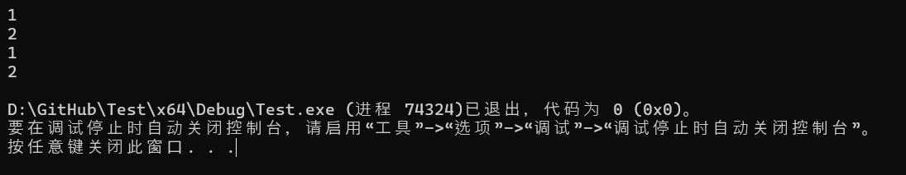

当`count(1)`被调用时，编译器将实例化该函数`count<int>(int)`并调用它。这将返回值`1`。

当`count(1)`再次调用时，编译器将看到`count<int>(int)`已经存在，并再次调用它。这将返回值`2`。

当`count(2.3)`被调用时，编译器会用原型实例化该函数`count<double>(double)`并调用它。这是一个有自己`static c`变量的新函数，因此它将返回值`1`。

当`count<double>(1)`被调用时，编译器将看到我们明确请求 的双精度版本`count()`。由于前面的语句，此函数已经存在，因此`count<double>(double)`将被调用，并且`int`参数将隐式转换为`double`。此函数将返回值`2`。

5.这个程序的输出是什么？

```c++
#include <iostream>

int foo(int n)
{
    return n + 10;
}

template <typename T>
int foo(T n)
{
    return n;
}

int main()
{
    std::cout << foo(1) << '\n'; // #1

    short s { 2 };
    std::cout << foo(s) << '\n'; // #2

    std::cout << foo<int>(4) << '\n'; // #3

    std::cout << foo<int>(s) << '\n'; // #4

    std::cout << foo<>(6) << '\n'; // #5

    return 0;
}
```

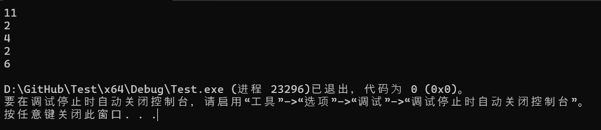

在情况 1 中，完全`foo(1)`匹配，因此调用`foo(int)`非模板函数。`foo(int)`

在情况 2 中，`foo(s)`与非模板函数不`foo(int)`完全匹配，但参数`s`可以转换为，`int`因此`foo(int)`是候选。但是，编译器将更倾向于使用函数模板`foo<T>(T)`来模板化完全匹配`foo<short>(short)`。因此这将调用`foo<short>(short)`。

在情况 3 中，`foo<int>(4)`是 的显式调用`foo<int>`，因此`foo(int)`不予考虑。编译器会将其模板化`foo<int>(int)`并调用它。

在情况 4 中，这也是对 的显式调用`foo<int>`。编译器将参数提升`s`为`int`以匹配参数。

在情况 5 中，此语法只会匹配函数模板，因此`foo(int)`不予考虑。`foo<int>(int)`被称为。