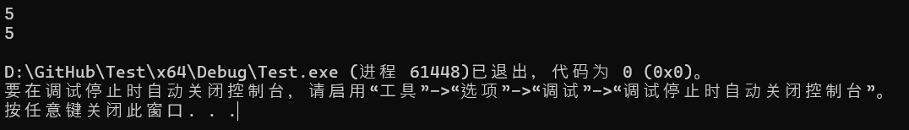

# **12复合类型：引用和指针**

## 12.1复合数据类型简介

到目前为止，我们在程序中已经大量使用了这些基本类型，尤其是`int`数据类型。虽然这些基本类型对于直接使用非常有用，但当我们开始做更复杂的事情时，它们并不能满足我们的全部需求。

例如，假设你正在编写一个数学程序来将两个分数相乘。你将如何在程序中表示分数？你可能会使用一对整数（一个表示分子，一个表示分母），如下所示：

```c++
#include <iostream>

int main()
{
    // Our first fraction
    int num1 {};
    int den1 {};

    // Our second fraction
    int num2 {};
    int den2 {};

    // Used to eat (remove) the slash between the numerator and denominator
    char ignore {};

    std::cout << "Enter a fraction: ";
    std::cin >> num1 >> ignore >> den1;

    std::cout << "Enter a fraction: ";
    std::cin >> num2 >> ignore >> den2;

    std::cout << "The two fractions multiplied: "
        << num1 * num2 << '/' << den1 * den2 << '\n';

    return 0;
}
```

虽然这个程序可以运行，但它也给我们带来了一些需要改进的挑战。首先，每对整数之间的联系都很松散——除了注释和它们在代码中的使用情况之外，几乎没有迹象表明每对分子和分母是相关的。其次，遵循 DRY（不要重复自己）原则，我们应该创建一个函数来处理用户输入分数（以及一些错误处理）。但是，函数只能返回一个值，那么我们如何将分子和分母返回给调用者呢？

现在想象一下另一种情况，您正在编写一个需要保存员工 ID 列表的程序。您将如何做？您可以尝试以下方法

```c++
int main()
{
    int id1 { 42 };
    int id2 { 57 };
    int id3 { 162 };
    // and so on
}
```

但是如果你有 100 名员工怎么办？首先，你需要输入 100 个变量名。如果你需要打印所有变量名怎么办？或者将它们传递给函数怎么办？我们需要输入大量数据。这根本无法扩展。

显然，基本类型只能帮助我们走这么远。

### **复合数据类型**

幸运的是，C++ 支持第二组数据类型，称为`compound data types`。**复合数据类型**（有时也称为**复合数据类型**）是可以从基本数据类型（或其他复合数据类型）构造的数据类型。每种复合数据类型也有自己独特的属性。

正如我们将在本章和后续章节中展示的那样，我们可以使用复合数据类型来优雅地解决我们上面提出的所有挑战。

C++ 支持以下复合类型：

- 功能
- 数组
- 指针类型：
  - 指向对象的指针
  - 指向函数的指针
- 指向成员类型的指针：
  - 指向数据成员的指针
  - 指向成员函数的指针
- 引用类型：
  - L 值引用
  - R 值引用
- 枚举类型：
  - 无作用域枚举
  - 范围枚举
- 课程类型：
  - 结构
  - 课程
  - 工会

您已经经常使用一种复合类型：函数。例如，考虑这个函数：

```c++
void doSomething(int x, double y)
{
}
```

此函数的类型为`void(int, double)`。请注意，此类型由基本类型组成，因此是复合类型。当然，函数也有自己的特殊行为（例如可调用）。

因为这里要讲的内容很多，所以我们会用多个章节来讲。在本章中，我们将介绍一些更简单的复合类型，包括`l-value references`、 和`pointers`。下一章，我们将介绍`unscoped enumerations`、`scoped enumerations`和我们的第一个类类型：`structs`。然后，在那之后的章节中，我们将介绍类并深入研究一些更有用的`array`类型。这包括`std::string`（在课程[5.9 中介绍—— std::string 简介](https://www.learncpp.com/cpp-tutorial/introduction-to-stdstring/)），它实际上是一种类类型！

**命名法**：**类类型**是一种结构、类或联合的类型。我们将在以后的课程中多次使用这个术语。

## 12.2值类别（左值和右值）

在我们讨论第一个复合类型（左值引用）之前，我们要稍微绕个弯，先讨论一下什么`lvalue`是 an。

在课程[1.10——表达式介绍](https://www.learncpp.com/cpp-tutorial/introduction-to-expressions/)中，我们将表达式定义为“可以执行以产生奇异值的文字、变量、运算符和函数调用的组合”。

例如：

```c++
#include <iostream>

int main()
{
    std::cout << 2 + 3 << '\n'; // The expression 2 + 3 produces the value 5

    return 0;
}
```

在上面的程序中，表达式`2 + 3`被求值得出值 5，然后将其打印到控制台。

在课程[6.4 -- 增量/减量运算符和副作用](https://www.learncpp.com/cpp-tutorial/increment-decrement-operators-and-side-effects/)中，我们还注意到表达式可以产生比表达式寿命更长的副作用：

```c++
#include <iostream>

int main()
{
    int x { 5 };
    ++x; // This expression statement has the side-effect of incrementing x
    std::cout << x << '\n'; // prints 6

    return 0;
}
```

在上面的程序中，表达式`++x`增加了的值`x`，并且即使表达式完成计算后，该值仍然保持不变。

除了产生值和副作用之外，表达式还可以做另一件事：它们可以求值为对象或函数。稍后我们将进一步探讨这一点。

### 表达式的属性

为了帮助确定表达式应如何评估以及在何处使用它们，C++ 中的所有表达式都具有两个属性：类型和值类别。

### 表达式的类型

表达式的类型相当于表达式求值后的值、对象或函数的类型。例如：

```c++
int main()
{
    auto v1 { 12 / 4 }; // int / int => int
    auto v2 { 12.0 / 4 }; // double / int => double

    return 0;
}
```

对于`v1`，编译器将在编译时确定两个操作数的除法`int`将产生`int`结果，因此`int`此表达式的类型也是如此。通过类型推断，`int`将用作 的类型`v1`。

对于`v2`，编译器将（在编译时）确定一个`double`操作数和一个`int`操作数的除法将产生`double`结果。请记住，算术运算符必须具有匹配类型的操作数，因此在这种情况下，`int`操作数将转换为`double`，并执行浮点除法。`double`此表达式的类型也是如此。

编译器可以使用表达式的类型来确定表达式在给定上下文中是否有效。例如：

```c++
#include <iostream>

void print(int x)
{
    std::cout << x << '\n';
}

int main()
{
    print("foo"); // error: print() was expecting an int argument, we tried to pass in a string literal

    return 0;
}
```

在上面的程序中，`print(int)`函数需要一个`int`参数。但是，我们传入的表达式（字符串文字`"foo"`）的类型不匹配，并且找不到转换。因此导致编译错误。

请注意，表达式的类型必须在编译时可确定（否则类型检查和类型推断将不起作用） - 但是，表达式的值可以在编译时（如果表达式是 constexpr）或运行时（如果表达式不是 constexpr）确定。

### **表达式的值类别**

现在考虑以下程序：

```c++
int main()
{
    int x{};

    x = 5; // valid: we can assign 5 to x
    5 = x; // error: can not assign value of x to literal value 5

    return 0;
}
```

其中一个赋值语句是有效的（将5值赋给`x`变量），另一个则无效（将`x`的值赋给文字值5意味着什么？）。那么编译器如何知道哪些表达式可以合法地出现在赋值语句的两侧？

答案在于表达式的第二个属性：`value category`。表达式（或子表达式）的**值类别**指示表达式是否解析为值、函数或某种对象。

在 C++11 之前，只有两种可能的值类别：`lvalue`和`rvalue`。

在 C++11 中，添加了三个附加值类别（`glvalue`、`prvalue`和`xvalue`）来支持称为 的新功能`move semantics`。

### **左值和右值表达式**

**左值**（发音为“ell-value”，是“left value”或“locator value”的缩写，有时写为“l-value”）是一个计算结果为可识别对象或函数（或位域）的表达式。

C++ 标准使用了“身份”一词，但定义不明确。具有身份的实体（如对象或函数）可以与其他类似实体区分开来（通常通过比较实体的地址）。

具有身份的实体可以通过标识符、引用或指针进行访问，并且其生命周期通常比单个表达式或语句更长。

```c++
int main()
{
    int x { 5 };
    int y { x }; // x is an lvalue expression

    return 0;
}
```

在上面的程序中，表达式`x`是一个左值表达式，因为它计算的是变量`x`（有一个标识符）。

自从语言中引入常量以来，左值就分为两种子类型：**可修改左值**是其值可以修改的左值。**不可修改左值**是其值不能修改的左值（因为左值是 const 或 constexpr）。

```c++
int main()
{
    int x{};
    const double d{};

    int y { x }; // x is a modifiable lvalue expression
    const double e { d }; // d is a non-modifiable lvalue expression

    return 0;
}
```

**右值**（发音为“arr-value”，是“right value”的缩写，有时写作`r-value`）是一种非左值的表达式。右值表达式求值为一个值。常见的右值包括文字（C 样式字符串文字除外，它们是左值）以及按值返回的函数和运算符的返回值。右值不可识别（意味着必须立即使用），并且仅存在于使用它们的表达式的范围内。

```c++
int return5()
{
    return 5;
}

int main()
{
    int x{ 5 }; // 5 is an rvalue expression
    const double d{ 1.2 }; // 1.2 is an rvalue expression

    int y { x }; // x is a modifiable lvalue expression
    const double e { d }; // d is a non-modifiable lvalue expression
    int z { return5() }; // return5() is an rvalue expression (since the result is returned by value)

    int w { x + 1 }; // x + 1 is an rvalue expression
    int q { static_cast<int>(d) }; // the result of static casting d to an int is an rvalue expression

    return 0;
}
```

您可能想知道为什么`return5()`、`x + 1`和`static_cast<int>(d)`是右值：答案是因为这些表达式产生的临时值不是可识别的对象。

**关键见解**左值表达式计算结果为可识别的对象。右值表达式计算结果为一个值。

`x = 5`现在我们可以回答为什么有效但无效的问题`5 = x`：赋值运算要求赋值的左操作数是可修改的左值表达式，右操作数是右值表达式。后者赋值（`5 = x`）失败，因为左操作数表达式`5`不是左值。

```c++
int main()
{
    int x{};

    // Assignment requires the left operand to be a modifiable lvalue expression and the right operand to be an rvalue expression
    x = 5; // valid: x is a modifiable lvalue expression and 5 is an rvalue expression
    5 = x; // error: 5 is an rvalue expression and x is a modifiable lvalue expression

    return 0;
}
```

**相关内容**：[左值和右值表达式的完整列表可在此处](https://en.cppreference.com/w/cpp/language/value_category)找到。在 C++11 中，右值分为两个子类型：prvalues 和 xvalues，因此我们在此处讨论的右值是这两个类别的总和。

**提示**：下面的代码演示了判断表达式是左值还是右值的方法：

```c++
#include <iostream>
#include <string>

// T& is an lvalue reference, so this overload will be preferred for lvalues
template <typename T>
constexpr bool is_lvalue(T&)
{
    return true;
}

// T&& is an rvalue reference, so this overload will be preferred for rvalues
template <typename T>
constexpr bool is_lvalue(T&&)
{
    return false;
}

// A helper macro (#expr prints whatever is passed in for expr as text)
#define PRINTVCAT(expr) { std::cout << #expr << " is an " << (is_lvalue(expr) ? "lvalue\n" : "rvalue\n"); }

int getint() { return 5; }

int main()
{
    PRINTVCAT(5);
    PRINTVCAT(getint());
    int x { 5 };
    PRINTVCAT(x);
    PRINTVCAT(std::string {"Hello"});
    PRINTVCAT("Hello");
}
```


此方法依赖于两个重载函数：一个带有左值引用参数，另一个带有右值引用参数。左值引用版本将优先用于左值参数，右值引用版本将优先用于右值参数。因此，我们可以根据所选函数来确定参数是左值还是右值。

**关键见解**：C 样式字符串文字是左值，因为 C 样式字符串（即 C 样式数组）会衰减为指针。衰减过程仅在数组是左值（因此具有可存储在指针中的地址）时才有效。C++ 继承了这一点以实现向后兼容。

### **左值到右值的转换**

再看一下这个例子：

```c++
int main()
{
    int x { 5 };
    int y { x }; // x is an lvalue expression

    return 0;
}
```

如果`x`是一个计算结果为变量的左值表达式，那么最终`y`如何得到值5？

答案是，在需要右值但提供了左值的上下文中，左值表达式将隐式转换为右值表达式`int`。变量的初始化器应为右值表达式。因此，左值表达式会`x`经历左值到右值的转换，其计算结果为值`5`，然后用于初始化`y`。

我们上面说过，赋值运算符期望右操作数是一个右值表达式，那么为什么这样的代码可以工作呢？

```c++
int main()
{
    int x{ 1 };
    int y{ 2 };

    x = y; // y is a modifiable lvalue, not an rvalue, but this is legal

    return 0;
}
```

在这种情况下，`y`是一个左值表达式，但它经历了左值到右值的转换，其计算结果为 (2) 的值`y`，然后将其赋值给`x`。

现在考虑这个例子：

```c++
int main()
{
    int x { 2 };

    x = x + 1;

    return 0;
}
```

在此语句中，变量`x`在两个不同的上下文中使用。赋值运算符的左侧`x`是一个左值表达式，其计算结果为变量`x`。赋值运算符的右侧`x + 1`是一个右值表达式，其计算结果为值`3`。

**关键见解**

识别左值和右值表达式的经验法则：

- 左值表达式是那些计算结果为函数或可识别对象（包括变量）且在表达式结束后仍然存在的表达式。
- 右值表达式是那些计算结果为值的表达式，包括在表达式结束后不再存在的文字和临时对象。

## 12.3 — 左值引用

在 C++ 中，**引用**是现有对象的别名。一旦定义了引用，对引用的任何操作都会应用于被引用的对象。这意味着我们可以使用引用来读取或修改被引用的对象。

尽管引用一开始可能看起来很愚蠢、无用或多余，但引用在 C++ 中随处可见

**关键见解**：引用本质上与被引用的对象相同。

您还可以创建对函数的引用，尽管这种情况不常见。

现代 C++ 包含两种类型的引用：左值引用和右值引用。在本章中，我们将讨论左值引用。

**相关内容**：因为我们将在本课中讨论左值和右值，所以如果您在继续学习之前需要复习这些术语，请复习[12.2 -- 值类别（左值和右值） 。右值引用在移动语义一章（](https://www.learncpp.com/cpp-tutorial/value-categories-lvalues-and-rvalues/)[第 22 章](https://www.learncpp.com/#Chapter22)）中介绍。

### 左值引用类型

**左值引用**（通常称为“引用”，因为在 C++11 之前只有一种引用类型）充当现有左值（例如变量）的别名。

就像对象的类型决定了它可以保存什么类型的值一样，引用的类型决定了它可以引用什么类型的对象。左值引用类型可以通过在类型说明符中使用单个与号 (&) 来识别：

```c++
// regular types
int        // a normal int type (not an reference)
int&       // an lvalue reference to an int object
double&    // an lvalue reference to a double object
const int& // an lvalue reference to a const int object
```

例如，`int&`是对象的左值引用的类型`int`，并且`const int&`是对象的左值引用的类型`const int`。

指定引用的类型（例如`int&`）称为**引用类型**。可以被引用的类型（例如`int`）称为**被引用类型**。

**命名法**：有两种左值引用：

- 对非常量左值引用通常被称为“左值引用”，但也可以称为**对非常量左值引用**或**非常量左值引用**（因为它不是使用`const`关键字定义的）。
- 对 const 的左值引用通常称为**对 const 的左值引用**或**const 左值引用**。

### **左值引用变量**

我们可以用左值引用类型做的事情之一是创建一个左值引用变量。**左值引用变量**是充当对左值（通常是另一个变量）的引用的变量。

要创建左值引用变量，我们只需定义一个具有左值引用类型的变量：

```c++
#include <iostream>

int main()
{
    int x { 5 };    // x is a normal integer variable
    int& ref { x }; // ref is an lvalue reference variable that can now be used as an alias for variable x

    std::cout << x << '\n';  // print the value of x (5)
    std::cout << ref << '\n'; // print the value of x via ref (5)

    return 0;
}
```

在上面的例子中，类型`int&`定义`ref`为对 int 的左值引用，然后我们用左值表达式初始化它`x`。此后，`ref`和`x`可以同义使用。因此，此程序打印：



`int& ref`从编译器的角度来看，将“与”号“附加”到类型名称 ( ) 还是变量名称 ( )并不重要`int &ref`，选择哪个只是风格问题。现代 C++ 程序员倾向于将“与”号附加到类型，因为这样可以更清楚地表明引用是类型信息的一部分，而不是标识符。

**最佳实践**：定义引用时，将“与”符号放在类型（而不是引用变量的名称）旁边。

### 通过非常量左值引用修改值

在上面的例子中，我们展示了我们可以使用引用来读取被引用对象的值。我们还可以使用非常量引用来修改被引用对象的值：

```c++
#include <iostream>

int main()
{
    int x { 5 }; // normal integer variable
    int& ref { x }; // ref is now an alias for variable x

    std::cout << x << ref << '\n'; // print 55

    x = 6; // x now has value 6

    std::cout << x << ref << '\n'; // prints 66

    ref = 7; // the object being referenced (x) now has value 7

    std::cout << x << ref << '\n'; // prints 77

    return 0;
}
```

在上面的例子中，`ref`是的别名`x`，因此我们可以`x`通过`x`或来改变的值`ref`。

### 引用初始化

**与常量非常相似，所有引用都必须初始化。引用使用一种称为引用初始化**的初始化形式进行初始化。

```c++
int main()
{
    int& invalidRef;   // error: references must be initialized

    int x { 5 };
    int& ref { x }; // okay: reference to int is bound to int variable

    return 0;
}
```

当引用用对象（或函数）初始化时，我们称它与该对象（或函数）**绑定**。绑定此类引用的过程称为**引用绑定**。被引用的对象（或函数）有时称为**引用对象**。

非常量左值引用只能绑定到*可修改的*左值。

```c++
int main()
{
    int x { 5 };
    int& ref { x };         // okay: non-const lvalue reference bound to a modifiable lvalue

    const int y { 5 };
    int& invalidRef { y };  // invalid: non-const lvalue reference can't bind to a non-modifiable lvalue
    int& invalidRef2 { 0 }; // invalid: non-const lvalue reference can't bind to an rvalue

    return 0;
}
```

**关键见解**：如果非常量左值引用可以绑定到不可修改（const）左值或右值，那么您将能够通过引用更改这些值，这将违反它们的 const 性。

不允许使用左值引用`void`（这有什么意义？）。

### **引用通常只绑定到与其引用类型匹配的对象**

在大多数情况下，引用只会绑定到类型与引用类型匹配的对象（此规则有一些例外，我们将在讨论继承时讨论）。如果您尝试将引用绑定到与其引用类型不匹配的对象，则编译器将尝试隐式将该对象转换为引用类型，然后将引用绑定到该类型。

**关键见解**：由于转换的结果是右值，并且非常量左值引用不能绑定到右值，因此尝试将非常量左值引用绑定到与其引用类型不匹配的对象将导致编译错误。

```c++
int main()
{
    int x { 5 };
    int& ref { x };            // okay: referenced type (int) matches type of initializer

    double d { 6.0 };
    int& invalidRef { d };     // invalid: conversion of double to int is narrowing conversion, disallowed by list initialization
    double& invalidRef2 { x }; // invalid: non-const lvalue reference can't bind to rvalue (result of converting x to double)

    return 0;
}
```

### **无法重新设置引用（更改为引用另一个对象）**

一旦初始化，C++ 中的引用就无法**重新定位**，这意味着它无法更改为引用另一个对象。

新的 C++ 程序员经常尝试通过使用赋值来为引用提供另一个要引用的变量来重新定位引用。这将编译并运行 - 但不会按预期运行。考虑以下程序：

```c++
#include <iostream>

int main()
{
    int x { 5 };
    int y { 6 };

    int& ref { x }; // ref is now an alias for x

    ref = y; // assigns 6 (the value of y) to x (the object being referenced by ref)
    // The above line does NOT change ref into a reference to variable y!

    std::cout << x << '\n'; // user is expecting this to print 5

    return 0;
}
```

当在表达式中求值引用时，它会解析为它所引用的对象。所以现在`ref = y`不会更改`ref`为引用`y`。相反，由于`ref`是的别名`x`，表达式的求值方式就像写的那样`x = y`——并且由于`y`求值为值`6`，因此`x`被赋值为值`6`。

### **参考范围及期限**

引用变量遵循与普通变量相同的作用域和持续时间规则：

```c++
#include <iostream>

int main()
{
    int x { 5 }; // normal integer
    int& ref { x }; // reference to variable value

     return 0;
} // x and ref die here
```

### **引用和引用对象具有独立的生命周期**

除了一个例外（我们将在下一课中介绍），引用的生命周期和其引用对象的生命周期是独立的。换句话说，以下两个都是正确的：

- 引用可以在其引用的对象之前被销毁。
- 被引用的对象可以在引用之前被销毁。

当引用在指称对象之前被销毁时，指称对象不会受到影响。以下程序演示了这一点：

```c++
#include <iostream>

int main()
{
    int x { 5 };

    {
        int& ref { x };   // ref is a reference to x
        std::cout << ref << '\n'; // prints value of ref (5)
    } // ref is destroyed here -- x is unaware of this

    std::cout << x << '\n'; // prints value of x (5)

    return 0;
} // x destroyed here
```

当`ref`变量消亡时，它`x`仍照常运行，完全没有意识到对它的引用已经被破坏。

**悬垂引用**

如果被引用的对象在被引用之前被销毁，则该引用将保留对不再存在的对象的引用。此类引用称为**悬垂引用**。访问悬垂引用会导致未定义的行为。

悬垂引用很容易避免，但我们将在第[12.12 课“按引用返回和按地址返回”](https://www.learncpp.com/cpp-tutorial/return-by-reference-and-return-by-address/)中展示这种情况在实践中可能发生的情况。

**引用不是对象**

可能令人惊讶的是，在 C++ 中引用不是对象。引用不需要存在或占用存储空间。如果可能，编译器会通过用引用对象替换所有出现的引用来优化引用。然而，这并不总是可行的，在这种情况下，引用可能需要存储空间。

这也意味着“引用变量”这个术语有点用词不当，因为变量是具有名称的对象，而引用不是对象。

因为引用不是对象，所以它们不能在任何需要对象的地方使用（例如，你不能引用引用，因为左值引用必须引用可识别的对象）。在你需要一个对象引用或一个可以重新放置的引用的情况下`std::reference_wrapper`（我们将在第[23.3 课-聚合](https://www.learncpp.com/cpp-tutorial/aggregation/)中介绍），它提供了一个解决方案。

考虑以下变量：

```c++
int var{};
int& ref1{ var };  // an lvalue reference bound to var
int& ref2{ ref1 }; // an lvalue reference bound to var
```

因为`ref2`（引用）是用`ref1`（引用）初始化的，所以你可能会想得出 是`ref2`对引用的引用。但事实并非如此。因为`ref1`是对 的引用`var`，所以在表达式（例如初始化器）中使用时，`ref1`其计算结果为`var`。所以`ref2`只是一个普通的左值引用（由其类型 表示`int&`），绑定到`var`。

对引用的引用（对`int`）会有语法`int&&`——但由于 C++ 不支持对引用的引用，所以这种语法在 C++11 中被重新用于指示右值引用（我们在第[22.2 课——R 值引用](https://www.learncpp.com/cpp-tutorial/rvalue-references/)中介绍）。

### **测验**

自行确定以下程序打印什么值（不要编译该程序）

```c++
#include <iostream>

int main()
{
    int x{ 1 };
    int& ref{ x };

    std::cout << x << ref << '\n';

    int y{ 2 };
    ref = y;
    y = 3;

    std::cout << x << ref << '\n';

    x = 4;

    std::cout << x << ref << '\n';

    return 0;
}
```

## 12.4 — 对 const 的左值引用

在上一课（[12.3 -- 左值引用](https://www.learncpp.com/cpp-tutorial/lvalue-references/)）中，我们讨论了左值引用只能绑定到可修改的左值。这意味着以下内容是非法的：

```c++
int main()
{
    const int x { 5 }; // x is a non-modifiable (const) lvalue
    int& ref { x }; // error: ref can not bind to non-modifiable lvalue

    return 0;
}
```

这是不允许的，因为它允许我们`x`通过非常量引用（）来修改常量变量（ `ref`）。

但是如果我们想要创建一个 const 变量并引用它，该怎么办呢？普通的左值引用（对非常量）不行。

### **对 const 的左值引用**

通过在声明左值引用时使用`const`关键字，我们告诉左值引用将其引用的对象视为 const。这样的引用称为**对 const 值的左值引用**（有时称为**对 const 的引用**或**const 引用**）。

对 const 的左值引用可以绑定到不可修改的左值：

```c++
int main()
{
    const int x { 5 };    // x is a non-modifiable lvalue
    const int& ref { x }; // okay: ref is a an lvalue reference to a const value

    return 0;
}
```

因为对 const 的左值引用将它们引用的对象视为 const，所以它们可以用来访问但不能修改被引用的值：

```c++
#include <iostream>

int main()
{
    const int x { 5 };    // x is a non-modifiable lvalue
    const int& ref { x }; // okay: ref is a an lvalue reference to a const value

    std::cout << ref << '\n'; // okay: we can access the const object
    ref = 6;                  // error: we can not modify an object through a const reference

    return 0;
}
```

### **使用可修改的左值将左值引用初始化为 const**

对 const 的左值引用也可以绑定到可修改的左值。在这种情况下，通过引用访问时，被引用的对象将被视为 const（即使底层对象是 non-const）：

```c++
#include <iostream>

int main()
{
    int x { 5 };          // x is a modifiable lvalue
    const int& ref { x }; // okay: we can bind a const reference to a modifiable lvalue

    std::cout << ref << '\n'; // okay: we can access the object through our const reference
    ref = 7;                  // error: we can not modify an object through a const reference

    x = 6;                // okay: x is a modifiable lvalue, we can still modify it through the original identifier

    return 0;
}
```

在上面的程序中，我们将 const 引用绑定`ref`到可修改的左值`x`。然后我们可以使用`ref`来访问`x`，但由于`ref`是 const ，我们不能通过`x`来修改 的值`ref`。但是，我们仍然可以`x`直接修改 的值（使用标识符`x`）。

**最佳实践**：除非您需要修改所引用的对象，否则优先`lvalue references to const`选择。

### **使用右值将左值引用初始化为 const**

也许令人惊讶的是，对 const 的左值引用也可以绑定到右值：

```c++
#include <iostream>

int main()
{
    const int& ref { 5 }; // okay: 5 is an rvalue

    std::cout << ref << '\n'; // prints 5

    return 0;
}
```

发生这种情况时，将创建一个临时对象并用右值初始化该对象，并且将对 const 的引用绑定到该临时对象。

### **使用不同类型的值初始化对 const 的左值引用**

对 const 的左值引用甚至可以绑定到不同类型的值，只要这些值可以隐式转换为引用类型：

```c++
#include <iostream>

int main()
{
    // case 1
    const double& r1 { 5 };  // temporary double initialized with value 5, r1 binds to temporary

    std::cout << r1 << '\n'; // prints 5

    // case 2
    char c { 'a' };
    const int& r2 { c };     // temporary int initialized with value 'a', r2 binds to temporary

    std::cout << r2 << '\n'; // prints 97 (since r2 is a reference to int)

    return 0;
}
```

`double`在情况 1 中，创建一个类型为 的临时对象并用 int 值初始化`5`。然后`const double& r1`绑定到该临时 double 对象。

`int`在情况 2 中，创建一个类型为 char 的临时对象并将其初始化为 char 值`a`。然后`const int& r2`绑定到该临时 int 对象。

在这两种情况下，引用的类型和临时的类型都匹配。

**关键见解**：如果您尝试将 const 左值引用绑定到不同类型的值，则编译器将创建与引用相同类型的临时对象，使用该值对其进行初始化，然后将引用绑定到临时对象。

还要注意，当我们打印时，`r2`它打印为 int 而不是 char。这是因为它`r2`是对 int 对象（创建的临时 int）的引用，而不是对 char 的引用`c`。

尽管允许这样做看起来很奇怪，但我们将在第[12.6 课“通过 const 左值引用传递”](https://www.learncpp.com/cpp-tutorial/pass-by-const-lvalue-reference/)中看到这种方法有用的例子。

**警告**：

我们通常假设引用与它所绑定的对象完全相同 —— 但当引用绑定到对象的临时副本而非对象本身时，这一假设就不成立了。对原始对象的任何后续修改都不会被引用看到（因为它引用的是副本）。

这是一个愚蠢的例子来说明这一点：

```c++
#include <iostream>

int main()
{
    short bombs { 1 };         // I can has a bomb

    const int& you { bombs };  // You likes to set bombs off
    --bombs;                   // I can disarmed a bomb

    if (you)                   // If you can still has a bomb
    {
        std::cout << "Bombs away!  Goodbye, cruel world.\n";
    }

    return 0;
}
```

### **绑定到临时对象的 const 引用可以延长临时对象的生存期**

临时对象通常在创建它们的表达式结束时被销毁。

但是，请考虑一下，如果在上面的例子中，`5`在初始化的表达式末尾销毁了用来保存右值的临时对象，会发生什么情况`ref`。引用`ref`将悬空（引用已被销毁的对象），当我们尝试访问时，我们将得到未定义的行为`ref`。

为了避免在这种情况下出现悬垂引用，C++ 有一个特殊规则：当 const 左值引用*直接*绑定到临时对象时，临时对象的生存期将延长以匹配引用的生存期。

```c++
#include <iostream>

int main()
{
    const int& ref { 5 }; // The temporary object holding value 5 has its lifetime extended to match ref

    std::cout << ref << '\n'; // Therefore, we can safely use it here

    return 0;
} // Both ref and the temporary object die here
```

在上面的例子中，当`ref`用右值初始化时`5`，会创建一个临时对象并将`ref`其绑定到该临时对象。临时对象的生命周期与的生命周期相匹配。因此，我们可以在下一个语句中`ref`安全地打印的值。然后和临时对象都超出范围并在块末尾被销毁。`ref``ref`

**关键见解**：左值引用只能绑定到可修改的左值。对 const 的左值引用可以绑定到可修改的左值、不可修改的左值和右值。这使它们成为一种更加灵活的引用类型。

### **Constexpr 左值引用**

当应用于引用时，`constexpr`允许在常量表达式中使用引用。Constexpr 引用有一个特定的限制：它们只能绑定到具有静态持续时间的对象（全局或静态局部）。这是因为编译器知道静态对象将在内存中实例化的位置，因此它可以将该地址视为编译时常量。

constexpr 引用不能绑定到 (非静态) 局部变量。这是因为局部变量的地址只有在定义它们的函数被实际调用时才为人所知。

```c++
int g_x { 5 };

int main()
{
    [[maybe_unused]] constexpr int& ref1 { g_x }; // ok, can bind to global

    static int s_x { 6 };
    [[maybe_unused]] constexpr int& ref2 { s_x }; // ok, can bind to static local

    int x { 6 };
    [[maybe_unused]] constexpr int& ref3 { x }; // compile error: can't bind to non-static object

    return 0;
}
```

当定义对 const 变量的 constexpr 引用时，我们需要同时应用`constexpr`（适用于引用）和`const`（适用于被引用的类型）。

```c++
int main()
{
    static const int s_x { 6 }; // a const int
    [[maybe_unused]] constexpr const int& ref2 { s_x }; // needs both constexpr and const

    return 0;
}
```

鉴于这些限制，constexpr 引用通常没有太多用处。

## 12.5 — 通过左值引用传递

在之前的课程中，我们介绍了左值引用（[12.3 -- 左值引用](https://www.learncpp.com/cpp-tutorial/lvalue-references/)）和对 const 的左值引用（[12.4 -- 对 const 的左值引用](https://www.learncpp.com/cpp-tutorial/lvalue-references-to-const/)）。单独来看，这些可能看起来没什么用——既然可以直接使用变量本身，为什么还要为变量创建别名呢？

在本课中，我们将最终深入了解引用的用途。然后从本章后面开始，您将看到引用的常用用法。

首先，介绍一些背景知识。回到第[2.4 课——函数参数和实参的介绍](https://www.learncpp.com/cpp-tutorial/introduction-to-function-parameters-and-arguments/)，我们讨论了`pass by value`传递给函数的实参被复制到函数的参数中：

```c++
#include <iostream>

void printValue(int y)
{
    std::cout << y << '\n';
} // y is destroyed here

int main()
{
    int x { 2 };

    printValue(x); // x is passed by value (copied) into parameter y (inexpensive)

    return 0;
}
```

在上面的程序中，当`printValue(x)`被调用时， `x2`的值被*复制*到参数`y`中。然后，在函数结束时，对象被销毁。`

这意味着当我们调用该函数时，我们复制了参数的值，只短暂使用它然后销毁它！幸运的是，由于基本类型的复制成本很低，所以这不是问题。

### **有些对象的复制成本很高**

标准库提供的大多数类型（例如`std::string`）都是`class types`。类类型的复制通常很昂贵。只要有可能，我们就希望避免对复制成本高昂的对象进行不必要的复制，尤其是当我们几乎立即销毁这些副本时。

考虑以下程序来说明这一点：

```c++
#include <iostream>
#include <string>

void printValue(std::string y)
{
    std::cout << y << '\n';
} // y is destroyed here

int main()
{
    std::string x { "Hello, world!" }; // x is a std::string

    printValue(x); // x is passed by value (copied) into parameter y (expensive)

    return 0;
}
```

虽然这个程序的行为符合我们的预期，但它的效率也很低。与前面的示例相同，当`printValue()`调用时，参数`x`被复制到`printValue()`参数中`y`。但是，在这个例子中，参数是`std::string`而不是`int`，并且`std::string`是一个复制成本很高的类类型。而且每次`printValue()`调用时都会进行这种昂贵的复制！

### **通过引用传递**

避免在调用函数时对参数进行昂贵的复制的一种方法是使用`pass by reference`而不是`pass by value`。使用**传递引用**时，我们将函数参数声明为引用类型（或 const 引用类型）而不是普通类型。调用函数时，每个引用参数都绑定到相应的参数。由于引用充当参数的别名，因此不会复制参数。

以下是与上面相同的例子，但是使用按引用传递而不是按值传递：

```c++
#include <iostream>
#include <string>

void printValue(std::string& y) // type changed to std::string&
{
    std::cout << y << '\n';
} // y is destroyed here

int main()
{
    std::string x { "Hello, world!" };

    printValue(x); // x is now passed by reference into reference parameter y (inexpensive)

    return 0;
}
```

此程序与上一个程序完全相同，只是参数的类型`y`已从 更改为`std::string`（`std::string&`左值引用）。现在，当`printValue(x)`调用 时，左值引用参数`y`将绑定到参数`x`。绑定引用总是很便宜，并且不需要复制`x`。由于引用充当被引用对象的别名，因此当`printValue()`使用引用时`y`，它访问的是实际参数`x`（而不是 的副本`x`）。

**关键见解**

通过引用传递允许我们将参数传递给函数，而不必在每次调用该函数时复制这些参数

### **通过引用传递允许我们改变参数的值**

对象通过值传递时，函数参数会收到参数的副本。这意味着对参数值的任何更改都是对参数副本进行的，而不是对参数本身进行的：

```c++
#include <iostream>

void addOne(int y) // y is a copy of x
{
    ++y; // this modifies the copy of x, not the actual object x
}

int main()
{
    int x { 5 };

    std::cout << "value = " << x << '\n';

    addOne(x);

    std::cout << "value = " << x << '\n'; // x has not been modified

    return 0;
}
```

在上面的程序中，因为 value 参数`y`是 的副本`x`，所以当我们增加 时`y`，这只会影响`y`。

但是，由于引用的行为与被引用的对象相同，因此当使用传递引用时，对引用参数所做的任何更改*都会*影响参数：

```c++
#include <iostream>

void addOne(int& y) // y is bound to the actual object x
{
    ++y; // this modifies the actual object x
}

int main()
{
    int x { 5 };

    std::cout << "value = " << x << '\n';

    addOne(x);

    std::cout << "value = " << x << '\n'; // x has been modified

    return 0;
}
```

在上面的例子中，`x`初始值为`5`。当`addOne(x)`被调用时，引用参数`y`被绑定到参数`x`。当`addOne()`函数增加引用时`y`，它实际上是将参数`x`从`5`增加到`6`（而不是 的副本）。即使在执行完成`x`后，这个改变的值仍然会保留。

**关键见解**

通过引用非 const 传递值允许我们编写修改传入参数值的函数。

函数修改传入参数值的能力很有用。假设你编写了一个函数来确定怪物是否成功攻击了玩家。如果成功，怪物应该对玩家的健康造成一定程度的伤害。如果你通过引用传递玩家对象，该函数可以直接修改传入的实际玩家对象的健康状况。如果你通过值传递玩家对象，你只能修改玩家对象副本的健康状况，这并不那么有用。

### **通过引用传递只能接受可修改的左值参数**

因为对非常量值的引用只能绑定到可修改的左值（本质上是非 const 变量），这意味着通过引用传递仅适用于可修改的左值的参数。实际上，这大大限制了通过引用传递非常量值的实用性，因为这意味着我们不能传递 const 变量或文字。例如：

```c++
#include <iostream>

void printValue(int& y) // y only accepts modifiable lvalues
{
    std::cout << y << '\n';
}

int main()
{
    int x { 5 };
    printValue(x); // ok: x is a modifiable lvalue

    const int z { 5 };
    printValue(z); // error: z is a non-modifiable lvalue

    printValue(5); // error: 5 is an rvalue

    return 0;
}
```

## 12.6 — 通过 const 左值引用传递

与非 const 引用（只能绑定到可修改的左值）不同，const 引用可以绑定到可修改的左值、不可修改的左值和右值。因此，如果我们将引用参数设为 const，那么它将能够绑定到任何类型的参数：

```c++
#include <iostream>

void printRef(const int& y) // y is a const reference
{
    std::cout << y << '\n';
}

int main()
{
    int x { 5 };
    printRef(x);   // ok: x is a modifiable lvalue, y binds to x

    const int z { 5 };
    printRef(z);   // ok: z is a non-modifiable lvalue, y binds to z

    printRef(5);   // ok: 5 is rvalue literal, y binds to temporary int object

    return 0;
}
```

通过 const 引用传递提供与通过引用传递相同的主要好处（避免复制参数），同时还保证函数不能*更改*被引用的值。

例如，下面是不允许的，因为`ref`是 const：

```c++
void addOne(const int& ref)
{
    ++ref; // not allowed: ref is const
}
```

大多数情况下，我们不希望我们的函数修改参数的值。

**最佳实践**

除非有特殊原因（例如函数需要更改参数的值），否则最好通过 const 引用传递，而不是通过非常量引用传递。

现在我们可以理解允许 const 左值引用绑定到右值的动机：如果没有这种能力，就无法将文字（或其他右值）传递给通过引用传递的函数！

### **将不同类型的值传递给 const 左值引用参数**

在课程[12.4 — 左值引用到 const](https://www.learncpp.com/cpp-tutorial/lvalue-references-to-const/)中，我们注意到 const 左值引用可以绑定到不同类型的值，只要该值可以转换为引用的类型。允许这样做的主要动机是，我们可以以完全相同的方式将值作为参数传递给值参数或 const 引用参数：

```c++
#include <iostream>

void printVal(double d)
{
    std::cout << d << '\n';
}

void printRef(const double& d)
{
    std::cout << d << '\n';
}

int main()
{
    printVal(5); // 5 converted to temporary double, copied to parameter d
    printRef(5); // 5 converted to temporary double, bound to parameter d

    return 0;
}
```

### **混合传递值和传递引用**

具有多个参数的函数可以单独确定每个参数是按值传递还是按引用传递。

例如：

```c++
#include <string>

void foo(int a, int& b, const std::string& c)
{
}

int main()
{
    int x { 5 };
    const std::string s { "Hello, world!" };

    foo(5, x, s);

    return 0;
}
```

在上面的例子中，第一个参数通过值传递，第二个参数通过引用传递，第三个参数通过 const 引用传递。

### **何时传递（const）引用**

由于类类型的复制成本可能很高（有时非常高），因此类类型通常通过 const 引用传递，而不是通过值传递，以避免对参数进行昂贵的复制。基本类型的复制成本很低，因此它们通常通过值传递。

**最佳实践**

根据经验法则，通过值传递基本类型，通过 const 引用传递类（或结构）类型。

其他常见的按值传递类型：枚举类型和`std::string_view`。
其他常见的按（const）引用传递类型：`std::string`、`std::array`和`std::vector`。

### **值传递与引用传递的成本**

并非所有类类型都需要通过引用传递。您可能想知道为什么我们不直接通过引用传递所有内容。在本节（可选阅读）中，我们将讨论通过值传递与通过引用传递的成本，并完善我们关于何时应使用每种方法的最佳实践。

有两个关键点可以帮助我们理解何时应该按值传递，何时应该按引用传递：

首先，复制对象的成本通常与两件事成正比：

- 对象的大小。占用更多内存的对象需要更多时间来复制。
- 任何额外的设置成本。有些类类型在实例化时会进行额外的设置（例如打开文件或数据库，或分配一定数量的动态内存来保存可变大小的对象）。每次复制对象时都必须支付这些设置成本。

另一方面，将引用绑定到对象总是很快（与复制基本类型的速度大约相同）。

其次，通过引用访问对象比通过普通变量标识符访问对象稍微昂贵一些。使用变量标识符，正在运行的程序可以直接转到分配给该变量的内存地址并直接访问该值。使用引用通常需要额外的步骤：程序必须先访问引用以确定引用的对象，然后才能转到该对象的内存地址并访问该值。编译器有时还可以优化使用按值传递对象的代码，而不是使用按引用传递对象的代码。这意味着为访问按引用传递的对象而生成的代码通常比为按值传递的对象而生成的代码慢。

现在我们可以回答为什么不通过引用传递所有内容的问题了：

- 对于复制成本低廉的对象，复制的成本与绑定的成本相似，因此我们倾向于按值传递，这样生成的代码会更快。
- 对于复制成本高昂的对象，复制的成本占主导地位，因此我们倾向于通过（const）引用传递以避免进行复制。

**最佳实践**

对于复制成本低廉的对象，优先通过值传递；对于复制成本高昂的对象，优先通过 const 引用传递。如果您不确定某个对象的复制成本是低廉还是高昂，则优先通过 const 引用传递。

那么最后一个问题是，我们如何定义“复制成本低廉”？这里没有绝对的答案，因为这因编译器、用例和架构而异。但是，我们可以制定一个很好的经验法则：如果对象使用 2 个或更少的内存“字”（其中“字”近似为内存地址的大小）并且没有设置成本，则复制成本低廉。

以下程序定义了一个类似函数的宏，可用于确定某种类型（或对象）的复制成本是否低廉：

```c++
#include <iostream>

// Function-like macro that evaluates to true if the type (or object) is equal to or smaller than
// the size of two memory addresses
#define isSmall(T) (sizeof(T) <= 2 * sizeof(void*))

struct S
{
    double a;
    double b;
    double c;
};

int main()
{
    std::cout << std::boolalpha; // print true or false rather than 1 or 0
    std::cout << isSmall(int) << '\n'; // true

    double d {};
    std::cout << isSmall(d) << '\n'; // true
    std::cout << isSmall(S) << '\n'; // false

    return 0;
}
```

但是，很难知道类类型对象是否有设置成本。最好假设大多数标准库类都有设置成本，除非你知道它们没有。

**提示**

`sizeof(T) <= 2 * sizeof(void*)`如果没有额外的设置成本，则类型 T 的对象复制起来很便宜。

### 对于函数参数，大多数情况下优先`std::string_view`于`const std::string&`

现代 C++ 中经常出现的一个问题：在编写具有字符串参数的函数时，该参数的类型应该是`const std::string&`还是`std::string_view`？

在大多数情况下，`std::string_view`这是更好的选择，因为它可以有效地处理更广泛的参数类型。

```c++
void doSomething(const std::string&);
void doSomething(std::string_view);   // prefer this in most cases
```

在某些情况下使用`const std::string&`参数可能更合适：

- 如果您使用的是 C++14 或更早版本，`std::string_view`则不可用。
- 如果您的函数需要调用其他采用 C 样式字符串或`std::string`参数的函数，那么`const std::string&`可能是一个更好的选择，因为`std::string_view`不能保证以空值终止（C 样式字符串函数所期望的）并且不能有效地转换回`std::string`。

**最佳实践**

`std::string_view`最好使用（按值）而不是传递字符串`const std::string&`，除非您的函数调用需要 C 风格字符串或`std::string`参数的其他函数。

### 为什么参数比高级`std::string_view`更有效`const std::string&`

在 C++ 中，字符串参数通常是`std::string`、`std::string_view`或 C 风格的字符串/字符串文字。

提醒一下：

- 如果实参的类型与相应形参的类型不匹配，则编译器将尝试隐式转换实参以匹配形参的类型。
- 转换一个值会创建一个转换类型的临时对象。
- 创建（或复制）的成本`std::string_view`很低，因为`std::string_view`不会复制它正在查看的字符串。
- 创建（或复制）`std::string`可能会很昂贵，因为每个`std::string`对象都会复制一个字符串。

下表显示了我们尝试传递每种类型时发生的情况：

| 参数类型                 | std::string_view 参数 | **const std::string& 参数**       |
| ------------------------ | --------------------- | --------------------------------- |
| std::string              | 廉价的转换            | 廉价的引用绑定                    |
| std::string_view         | 廉价复制品            | 需要昂贵的显式转换为`std::string` |
| C-style string / literal | 廉价的转换            | 昂贵的改造                        |

带有`std::string_view`值参数：

- 如果我们传递一个`std::string`参数，编译器将会把转换`std::string`为`std::string_view`，这很便宜，所以这样就可以了。
- 如果我们传入一个`std::string_view`参数，编译器就会将参数复制到参数中，这样做成本不高，所以这样就可以了。
- 如果我们传递一个 C 风格的字符串或字符串文字，编译器会将它们转换为`std::string_view`，这很便宜，所以这样就可以了。

正如您所见，`std::string_view`可以以低成本处理所有三种情况。

带有`const std::string&`引用参数：

- 如果我们传入一个`std::string`参数，该参数将引用绑定到该参数，这很便宜，所以这样就可以了。
- 如果我们传入一个`std::string_view`参数，编译器将拒绝进行隐式转换，并产生编译错误。我们可以使用`static_cast`进行显式转换（到`std::string`），但这种转换很昂贵（因为`std::string`将复制正在查看的字符串）。转换完成后，参数将引用绑定到结果，这很便宜。但是我们已经制作了一个昂贵的副本来进行转换，所以这不是很好。
- 如果我们传入 C 样式的字符串或字符串文字，编译器会将其隐式转换为`std::string`，这很昂贵。所以这也不是很好。

因此，`const std::string&`参数仅以低成本处理`std::string`参数。

相同，以代码形式：

```c++
#include <iostream>
#include <string>
#include <string_view>

void printSV(std::string_view sv)
{
    std::cout << sv << '\n';
}

void printS(const std::string& s)
{
    std::cout << s << '\n';
}

int main()
{
    std::string s{ "Hello, world" };
    std::string_view sv { s };

    // Pass to `std::string_view` parameter
    printSV(s);              // ok: inexpensive conversion from std::string to std::string_view
    printSV(sv);             // ok: inexpensive copy of std::string_view
    printSV("Hello, world"); // ok: inexpensive conversion of C-style string literal to std::string_view

    // pass to `const std::string&` parameter
    printS(s);              // ok: inexpensive bind to std::string argument
    printS(sv);             // compile error: cannot implicit convert std::string_view to std::string
    printS(static_cast<std::string>(sv)); // bad: expensive creation of std::string temporary
    printS("Hello, world"); // bad: expensive creation of std::string temporary

    return 0;
}
```

另外，我们需要考虑在函数内部访问参数的成本。因为`std::string_view`参数是一个普通对象，所以可以直接访问被查看的字符串。访问`std::string&`参数需要额外的步骤来获取引用的对象，然后才能访问字符串。

## 12.7 — 指针简介

指针是 C++ 历史上的恶魔之一，也是许多有抱负的 C++ 学习者陷入困境的地方。然而，正如您即将看到的那样，指针并不可怕。

事实上，指针的行为很像左值引用。但在进一步解释之前，让我们先进行一些设置。

**相关内容**

如果你对左值引用生疏或不熟悉，现在是复习的好时机。我们在课程[12.3 - 左值引用](https://www.learncpp.com/cpp-tutorial/lvalue-references/)、[12.4 - 左值对 const 的引用](https://www.learncpp.com/cpp-tutorial/lvalue-references-to-const/)和[12.5 - 通过左值引用传递 中](https://www.learncpp.com/cpp-tutorial/pass-by-lvalue-reference/)介绍了左值引用。

考虑一个正常变量，如下所示：

```c++
char x {}; // chars use 1 byte of memory
```

简单来说，当执行为此定义生成的代码时，会将 RAM 中的一块内存分配给此对象。为了举例说明，假设变量`x`被分配了内存地址`140`。每当我们`x`在表达式或语句中使用变量时，程序都会转到内存地址`140`来访问存储在那里的值。

变量的优点在于我们无需担心分配了哪些特定的内存地址，也无需担心存储对象的值需要多少字节。我们只需通过给定的标识符引用变量，编译器会将此名称转换为适当分配的内存地址。编译器负责所有寻址。

参考文献中也是如此：

```c++
int main()
{
    char x {}; // assume this is assigned memory address 140
    char& ref { x }; // ref is an lvalue reference to x (when used with a type, & means lvalue reference)

    return 0;
}
```

因为`ref`充当 的别名`x`，每当我们使用 时`ref`，程序都会转到内存地址`140`来访问该值。同样，编译器会负责寻址，所以我们不必考虑它。

### **寻址运算符 (&)**

尽管默认情况下变量使用的内存地址不会向我们公开，但我们确实可以访问此信息。地址**运算符**(&) 返回其操作数的内存地址。这非常简单：

```c++
#include <iostream>

int main()
{
    int x{ 5 };
    std::cout << x << '\n';  // print the value of variable x
    std::cout << &x << '\n'; // print the memory address of variable x

    return 0;
}
```

上述程序打印：


在上面的例子中，我们使用地址运算符 (&) 检索分配给变量的地址`x`并将该地址打印到控制台。内存地址通常以十六进制值的形式打印（我们在第[5.3 课 - 数字系统（十进制、二进制、十六进制和八进制）](https://www.learncpp.com/cpp-tutorial/numeral-systems-decimal-binary-hexadecimal-and-octal/)中介绍了十六进制），通常不带 0x 前缀。

对于使用多个字节内存的对象，address-of 将返回该对象使用的第一个字节的内存地址。

**提示**

& 符号容易引起混淆，因为它在不同上下文中具有不同的含义：

- 当跟在类型名称后面时，& 表示左值引用：`int& ref`。
- 在表达式的一元上下文中使用时，& 是取地址运算符：`std::cout << &x`。
- 在表达式的二进制上下文中使用时，& 是按位与运算符：`std::cout << x & y`。

### **取消引用运算符 (\*)**

获取变量的地址本身并不是很有用。

我们可以用地址做的最有用的事情是访问存储在该地址的值。**取消引用运算符**(*)（有时也称为**间接运算符**）将给定内存地址处的值作为左值返回：

```c++
#include <iostream>

int main()
{
    int x{ 5 };
    std::cout << x << '\n';  // print the value of variable x
    std::cout << &x << '\n'; // print the memory address of variable x

    std::cout << *(&x) << '\n'; // print the value at the memory address of variable x (parentheses not required, but make it easier to read)

    return 0;
}
```

这个程序很简单。首先我们声明一个变量`x`并打印它的值。然后我们打印变量的地址`x`。最后，我们使用解引用运算符来获取变量内存地址处的值`x`（也就是的值`x`），并将其打印到控制台。

**关键见解**

给定一个内存地址，我们可以使用取消引用运算符（*）来获取该地址的值（作为左值）。

地址运算符（&）和取消引用运算符（*）的作用相反：地址运算符获取对象的地址，而取消引用获取某个地址处的对象。

获取变量的内存地址，然后立即取消引用该地址来获取值也不是那么有用（毕竟，我们可以使用该变量来访问该值）。

但是现在我们已经将地址运算符（&）和取消引用运算符（*）添加到我们的工具包中，我们就可以讨论指针了。

### **指针**

