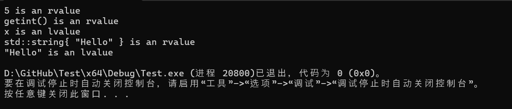
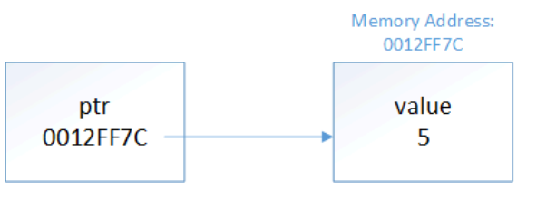
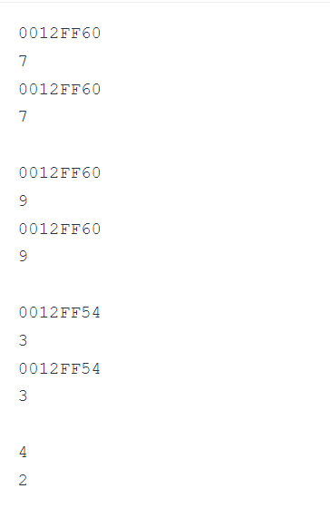
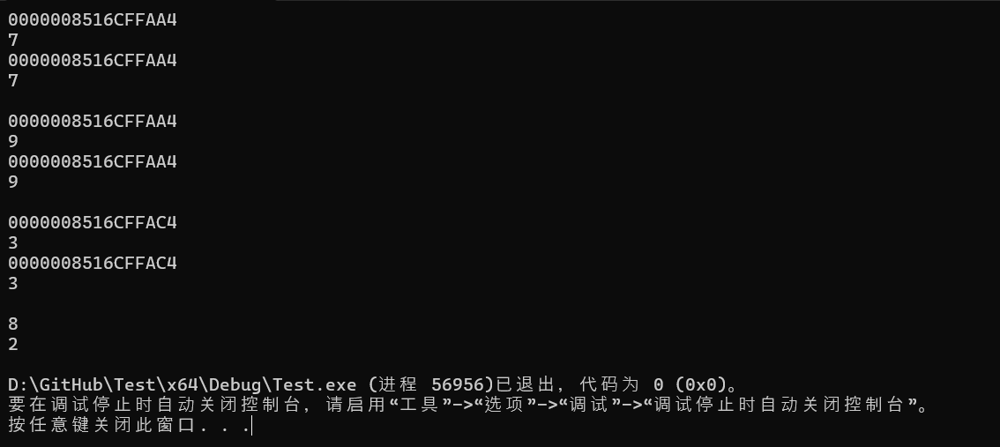
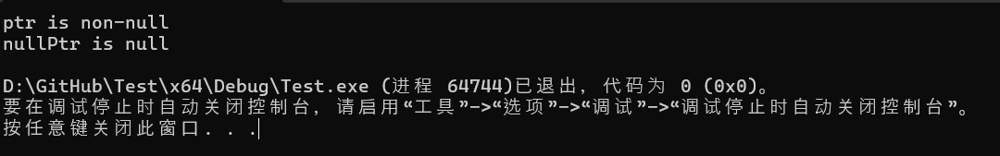

# **12复合类型：引用和指针**

## 12.1复合数据类型简介

到目前为止，我们在程序中已经大量使用了这些基本类型，尤其是`int`数据类型。虽然这些基本类型对于直接使用非常有用，但当我们开始做更复杂的事情时，它们并不能满足我们的全部需求。

例如，假设你正在编写一个数学程序来将两个分数相乘。你将如何在程序中表示分数？你可能会使用一对整数（一个表示分子，一个表示分母），如下所示：

```c++
#include <iostream>

int main()
{
    // Our first fraction
    int num1 {};
    int den1 {};

    // Our second fraction
    int num2 {};
    int den2 {};

    // Used to eat (remove) the slash between the numerator and denominator
    char ignore {};

    std::cout << "Enter a fraction: ";
    std::cin >> num1 >> ignore >> den1;

    std::cout << "Enter a fraction: ";
    std::cin >> num2 >> ignore >> den2;

    std::cout << "The two fractions multiplied: "
        << num1 * num2 << '/' << den1 * den2 << '\n';

    return 0;
}
```

虽然这个程序可以运行，但它也给我们带来了一些需要改进的挑战。首先，每对整数之间的联系都很松散——除了注释和它们在代码中的使用情况之外，几乎没有迹象表明每对分子和分母是相关的。其次，遵循 DRY（不要重复自己）原则，我们应该创建一个函数来处理用户输入分数（以及一些错误处理）。但是，函数只能返回一个值，那么我们如何将分子和分母返回给调用者呢？

现在想象一下另一种情况，您正在编写一个需要保存员工 ID 列表的程序。您将如何做？您可以尝试以下方法

```c++
int main()
{
    int id1 { 42 };
    int id2 { 57 };
    int id3 { 162 };
    // and so on
}
```

但是如果你有 100 名员工怎么办？首先，你需要输入 100 个变量名。如果你需要打印所有变量名怎么办？或者将它们传递给函数怎么办？我们需要输入大量数据。这根本无法扩展。

显然，基本类型只能帮助我们走这么远。

### **复合数据类型**

幸运的是，C++ 支持第二组数据类型，称为`compound data types`。**复合数据类型**（有时也称为**复合数据类型**）是可以从基本数据类型（或其他复合数据类型）构造的数据类型。每种复合数据类型也有自己独特的属性。

正如我们将在本章和后续章节中展示的那样，我们可以使用复合数据类型来优雅地解决我们上面提出的所有挑战。

C++ 支持以下复合类型：

- 功能
- 数组
- 指针类型：
  - 指向对象的指针
  - 指向函数的指针
- 指向成员类型的指针：
  - 指向数据成员的指针
  - 指向成员函数的指针
- 引用类型：
  - L 值引用
  - R 值引用
- 枚举类型：
  - 无作用域枚举
  - 范围枚举
- 课程类型：
  - 结构
  - 课程
  - 工会

您已经经常使用一种复合类型：函数。例如，考虑这个函数：

```c++
void doSomething(int x, double y)
{
}
```

此函数的类型为`void(int, double)`。请注意，此类型由基本类型组成，因此是复合类型。当然，函数也有自己的特殊行为（例如可调用）。

因为这里要讲的内容很多，所以我们会用多个章节来讲。在本章中，我们将介绍一些更简单的复合类型，包括`l-value references`、 和`pointers`。下一章，我们将介绍`unscoped enumerations`、`scoped enumerations`和我们的第一个类类型：`structs`。然后，在那之后的章节中，我们将介绍类并深入研究一些更有用的`array`类型。这包括`std::string`（在课程[5.9 中介绍—— std::string 简介](https://www.learncpp.com/cpp-tutorial/introduction-to-stdstring/)），它实际上是一种类类型！

**命名法**：**类类型**是一种结构、类或联合的类型。我们将在以后的课程中多次使用这个术语。

## 12.2值类别（左值和右值）

在我们讨论第一个复合类型（左值引用）之前，我们要稍微绕个弯，先讨论一下什么`lvalue`是 an。

在课程[1.10——表达式介绍](https://www.learncpp.com/cpp-tutorial/introduction-to-expressions/)中，我们将表达式定义为“可以执行以产生奇异值的文字、变量、运算符和函数调用的组合”。

例如：

```c++
#include <iostream>

int main()
{
    std::cout << 2 + 3 << '\n'; // The expression 2 + 3 produces the value 5

    return 0;
}
```

在上面的程序中，表达式`2 + 3`被求值得出值 5，然后将其打印到控制台。

在课程[6.4 -- 增量/减量运算符和副作用](https://www.learncpp.com/cpp-tutorial/increment-decrement-operators-and-side-effects/)中，我们还注意到表达式可以产生比表达式寿命更长的副作用：

```c++
#include <iostream>

int main()
{
    int x { 5 };
    ++x; // This expression statement has the side-effect of incrementing x
    std::cout << x << '\n'; // prints 6

    return 0;
}
```

在上面的程序中，表达式`++x`增加了的值`x`，并且即使表达式完成计算后，该值仍然保持不变。

除了产生值和副作用之外，表达式还可以做另一件事：它们可以求值为对象或函数。稍后我们将进一步探讨这一点。

### 表达式的属性

为了帮助确定表达式应如何评估以及在何处使用它们，C++ 中的所有表达式都具有两个属性：类型和值类别。

### 表达式的类型

表达式的类型相当于表达式求值后的值、对象或函数的类型。例如：

```c++
int main()
{
    auto v1 { 12 / 4 }; // int / int => int
    auto v2 { 12.0 / 4 }; // double / int => double

    return 0;
}
```

对于`v1`，编译器将在编译时确定两个操作数的除法`int`将产生`int`结果，因此`int`此表达式的类型也是如此。通过类型推断，`int`将用作 的类型`v1`。

对于`v2`，编译器将（在编译时）确定一个`double`操作数和一个`int`操作数的除法将产生`double`结果。请记住，算术运算符必须具有匹配类型的操作数，因此在这种情况下，`int`操作数将转换为`double`，并执行浮点除法。`double`此表达式的类型也是如此。

编译器可以使用表达式的类型来确定表达式在给定上下文中是否有效。例如：

```c++
#include <iostream>

void print(int x)
{
    std::cout << x << '\n';
}

int main()
{
    print("foo"); // error: print() was expecting an int argument, we tried to pass in a string literal

    return 0;
}
```

在上面的程序中，`print(int)`函数需要一个`int`参数。但是，我们传入的表达式（字符串文字`"foo"`）的类型不匹配，并且找不到转换。因此导致编译错误。

请注意，表达式的类型必须在编译时可确定（否则类型检查和类型推断将不起作用） - 但是，表达式的值可以在编译时（如果表达式是 constexpr）或运行时（如果表达式不是 constexpr）确定。

### **表达式的值类别**

现在考虑以下程序：

```c++
int main()
{
    int x{};

    x = 5; // valid: we can assign 5 to x
    5 = x; // error: can not assign value of x to literal value 5

    return 0;
}
```

其中一个赋值语句是有效的（将5值赋给`x`变量），另一个则无效（将`x`的值赋给文字值5意味着什么？）。那么编译器如何知道哪些表达式可以合法地出现在赋值语句的两侧？

答案在于表达式的第二个属性：`value category`。表达式（或子表达式）的**值类别**指示表达式是否解析为值、函数或某种对象。

在 C++11 之前，只有两种可能的值类别：`lvalue`和`rvalue`。

在 C++11 中，添加了三个附加值类别（`glvalue`、`prvalue`和`xvalue`）来支持称为 的新功能`move semantics`。

### **左值和右值表达式**

**左值**（发音为“ell-value”，是“left value”或“locator value”的缩写，有时写为“l-value”）是一个计算结果为可识别对象或函数（或位域）的表达式。

C++ 标准使用了“身份”一词，但定义不明确。具有身份的实体（如对象或函数）可以与其他类似实体区分开来（通常通过比较实体的地址）。

具有身份的实体可以通过标识符、引用或指针进行访问，并且其生命周期通常比单个表达式或语句更长。

```c++
int main()
{
    int x { 5 };
    int y { x }; // x is an lvalue expression

    return 0;
}
```

在上面的程序中，表达式`x`是一个左值表达式，因为它计算的是变量`x`（有一个标识符）。

自从语言中引入常量以来，左值就分为两种子类型：**可修改左值**是其值可以修改的左值。**不可修改左值**是其值不能修改的左值（因为左值是 const 或 constexpr）。

```c++
int main()
{
    int x{};
    const double d{};

    int y { x }; // x is a modifiable lvalue expression
    const double e { d }; // d is a non-modifiable lvalue expression

    return 0;
}
```

**右值**（发音为“arr-value”，是“right value”的缩写，有时写作`r-value`）是一种非左值的表达式。右值表达式求值为一个值。常见的右值包括文字（C 样式字符串文字除外，它们是左值）以及按值返回的函数和运算符的返回值。右值不可识别（意味着必须立即使用），并且仅存在于使用它们的表达式的范围内。

```c++
int return5()
{
    return 5;
}

int main()
{
    int x{ 5 }; // 5 is an rvalue expression
    const double d{ 1.2 }; // 1.2 is an rvalue expression

    int y { x }; // x is a modifiable lvalue expression
    const double e { d }; // d is a non-modifiable lvalue expression
    int z { return5() }; // return5() is an rvalue expression (since the result is returned by value)

    int w { x + 1 }; // x + 1 is an rvalue expression
    int q { static_cast<int>(d) }; // the result of static casting d to an int is an rvalue expression

    return 0;
}
```

您可能想知道为什么`return5()`、`x + 1`和`static_cast<int>(d)`是右值：答案是因为这些表达式产生的临时值不是可识别的对象。

**关键见解**左值表达式计算结果为可识别的对象。右值表达式计算结果为一个值。

`x = 5`现在我们可以回答为什么有效但无效的问题`5 = x`：赋值运算要求赋值的左操作数是可修改的左值表达式，右操作数是右值表达式。后者赋值（`5 = x`）失败，因为左操作数表达式`5`不是左值。

```c++
int main()
{
    int x{};

    // Assignment requires the left operand to be a modifiable lvalue expression and the right operand to be an rvalue expression
    x = 5; // valid: x is a modifiable lvalue expression and 5 is an rvalue expression
    5 = x; // error: 5 is an rvalue expression and x is a modifiable lvalue expression

    return 0;
}
```

**相关内容**：[左值和右值表达式的完整列表可在此处](https://en.cppreference.com/w/cpp/language/value_category)找到。在 C++11 中，右值分为两个子类型：prvalues 和 xvalues，因此我们在此处讨论的右值是这两个类别的总和。

**提示**：下面的代码演示了判断表达式是左值还是右值的方法：

```c++
#include <iostream>
#include <string>

// T& is an lvalue reference, so this overload will be preferred for lvalues
template <typename T>
constexpr bool is_lvalue(T&)
{
    return true;
}

// T&& is an rvalue reference, so this overload will be preferred for rvalues
template <typename T>
constexpr bool is_lvalue(T&&)
{
    return false;
}

// A helper macro (#expr prints whatever is passed in for expr as text)
#define PRINTVCAT(expr) { std::cout << #expr << " is an " << (is_lvalue(expr) ? "lvalue\n" : "rvalue\n"); }

int getint() { return 5; }

int main()
{
    PRINTVCAT(5);
    PRINTVCAT(getint());
    int x { 5 };
    PRINTVCAT(x);
    PRINTVCAT(std::string {"Hello"});
    PRINTVCAT("Hello");
}
```



此方法依赖于两个重载函数：一个带有左值引用参数，另一个带有右值引用参数。左值引用版本将优先用于左值参数，右值引用版本将优先用于右值参数。因此，我们可以根据所选函数来确定参数是左值还是右值。

**关键见解**：C 样式字符串文字是左值，因为 C 样式字符串（即 C 样式数组）会衰减为指针。衰减过程仅在数组是左值（因此具有可存储在指针中的地址）时才有效。C++ 继承了这一点以实现向后兼容。

### **左值到右值的转换**

再看一下这个例子：

```c++
int main()
{
    int x { 5 };
    int y { x }; // x is an lvalue expression

    return 0;
}
```

如果`x`是一个计算结果为变量的左值表达式，那么最终`y`如何得到值5？

答案是，在需要右值但提供了左值的上下文中，左值表达式将隐式转换为右值表达式`int`。变量的初始化器应为右值表达式。因此，左值表达式会`x`经历左值到右值的转换，其计算结果为值`5`，然后用于初始化`y`。

我们上面说过，赋值运算符期望右操作数是一个右值表达式，那么为什么这样的代码可以工作呢？

```c++
int main()
{
    int x{ 1 };
    int y{ 2 };

    x = y; // y is a modifiable lvalue, not an rvalue, but this is legal

    return 0;
}
```

在这种情况下，`y`是一个左值表达式，但它经历了左值到右值的转换，其计算结果为 (2) 的值`y`，然后将其赋值给`x`。

现在考虑这个例子：

```c++
int main()
{
    int x { 2 };

    x = x + 1;

    return 0;
}
```

在此语句中，变量`x`在两个不同的上下文中使用。赋值运算符的左侧`x`是一个左值表达式，其计算结果为变量`x`。赋值运算符的右侧`x + 1`是一个右值表达式，其计算结果为值`3`。

**关键见解**

识别左值和右值表达式的经验法则：

- 左值表达式是那些计算结果为函数或可识别对象（包括变量）且在表达式结束后仍然存在的表达式。
- 右值表达式是那些计算结果为值的表达式，包括在表达式结束后不再存在的文字和临时对象。

## 12.3 — 左值引用

在 C++ 中，**引用**是现有对象的别名。一旦定义了引用，对引用的任何操作都会应用于被引用的对象。这意味着我们可以使用引用来读取或修改被引用的对象。

尽管引用一开始可能看起来很愚蠢、无用或多余，但引用在 C++ 中随处可见

**关键见解**：引用本质上与被引用的对象相同。

您还可以创建对函数的引用，尽管这种情况不常见。

现代 C++ 包含两种类型的引用：左值引用和右值引用。在本章中，我们将讨论左值引用。

**相关内容**：因为我们将在本课中讨论左值和右值，所以如果您在继续学习之前需要复习这些术语，请复习[12.2 -- 值类别（左值和右值） 。右值引用在移动语义一章（](https://www.learncpp.com/cpp-tutorial/value-categories-lvalues-and-rvalues/)[第 22 章](https://www.learncpp.com/#Chapter22)）中介绍。

### 左值引用类型

**左值引用**（通常称为“引用”，因为在 C++11 之前只有一种引用类型）充当现有左值（例如变量）的别名。

就像对象的类型决定了它可以保存什么类型的值一样，引用的类型决定了它可以引用什么类型的对象。左值引用类型可以通过在类型说明符中使用单个与号 (&) 来识别：

```c++
// regular types
int        // a normal int type (not an reference)
int&       // an lvalue reference to an int object
double&    // an lvalue reference to a double object
const int& // an lvalue reference to a const int object
```

例如，`int&`是对象的左值引用的类型`int`，并且`const int&`是对象的左值引用的类型`const int`。

指定引用的类型（例如`int&`）称为**引用类型**。可以被引用的类型（例如`int`）称为**被引用类型**。

**命名法**：有两种左值引用：

- 对非常量左值引用通常被称为“左值引用”，但也可以称为**对非常量左值引用**或**非常量左值引用**（因为它不是使用`const`关键字定义的）。
- 对 const 的左值引用通常称为**对 const 的左值引用**或**const 左值引用**。

### **左值引用变量**

我们可以用左值引用类型做的事情之一是创建一个左值引用变量。**左值引用变量**是充当对左值（通常是另一个变量）的引用的变量。

要创建左值引用变量，我们只需定义一个具有左值引用类型的变量：

```c++
#include <iostream>

int main()
{
    int x { 5 };    // x is a normal integer variable
    int& ref { x }; // ref is an lvalue reference variable that can now be used as an alias for variable x

    std::cout << x << '\n';  // print the value of x (5)
    std::cout << ref << '\n'; // print the value of x via ref (5)

    return 0;
}
```

在上面的例子中，类型`int&`定义`ref`为对 int 的左值引用，然后我们用左值表达式初始化它`x`。此后，`ref`和`x`可以同义使用。因此，此程序打印：


`int& ref`从编译器的角度来看，将“与”号“附加”到类型名称 ( ) 还是变量名称 ( )并不重要`int &ref`，选择哪个只是风格问题。现代 C++ 程序员倾向于将“与”号附加到类型，因为这样可以更清楚地表明引用是类型信息的一部分，而不是标识符。

**最佳实践**：定义引用时，将“与”符号放在类型（而不是引用变量的名称）旁边。

### 通过非常量左值引用修改值

在上面的例子中，我们展示了我们可以使用引用来读取被引用对象的值。我们还可以使用非常量引用来修改被引用对象的值：

```c++
#include <iostream>

int main()
{
    int x { 5 }; // normal integer variable
    int& ref { x }; // ref is now an alias for variable x

    std::cout << x << ref << '\n'; // print 55

    x = 6; // x now has value 6

    std::cout << x << ref << '\n'; // prints 66

    ref = 7; // the object being referenced (x) now has value 7

    std::cout << x << ref << '\n'; // prints 77

    return 0;
}
```

在上面的例子中，`ref`是的别名`x`，因此我们可以`x`通过`x`或来改变的值`ref`。

### 引用初始化

**与常量非常相似，所有引用都必须初始化。引用使用一种称为引用初始化**的初始化形式进行初始化。

```c++
int main()
{
    int& invalidRef;   // error: references must be initialized

    int x { 5 };
    int& ref { x }; // okay: reference to int is bound to int variable

    return 0;
}
```

当引用用对象（或函数）初始化时，我们称它与该对象（或函数）**绑定**。绑定此类引用的过程称为**引用绑定**。被引用的对象（或函数）有时称为**引用对象**。

非常量左值引用只能绑定到*可修改的*左值。

```c++
int main()
{
    int x { 5 };
    int& ref { x };         // okay: non-const lvalue reference bound to a modifiable lvalue

    const int y { 5 };
    int& invalidRef { y };  // invalid: non-const lvalue reference can't bind to a non-modifiable lvalue
    int& invalidRef2 { 0 }; // invalid: non-const lvalue reference can't bind to an rvalue

    return 0;
}
```

**关键见解**：如果非常量左值引用可以绑定到不可修改（const）左值或右值，那么您将能够通过引用更改这些值，这将违反它们的 const 性。

不允许使用左值引用`void`（这有什么意义？）。

### **引用通常只绑定到与其引用类型匹配的对象**

在大多数情况下，引用只会绑定到类型与引用类型匹配的对象（此规则有一些例外，我们将在讨论继承时讨论）。如果您尝试将引用绑定到与其引用类型不匹配的对象，则编译器将尝试隐式将该对象转换为引用类型，然后将引用绑定到该类型。

**关键见解**：由于转换的结果是右值，并且非常量左值引用不能绑定到右值，因此尝试将非常量左值引用绑定到与其引用类型不匹配的对象将导致编译错误。

```c++
int main()
{
    int x { 5 };
    int& ref { x };            // okay: referenced type (int) matches type of initializer

    double d { 6.0 };
    int& invalidRef { d };     // invalid: conversion of double to int is narrowing conversion, disallowed by list initialization
    double& invalidRef2 { x }; // invalid: non-const lvalue reference can't bind to rvalue (result of converting x to double)

    return 0;
}
```

### **无法重新设置引用（更改为引用另一个对象）**

一旦初始化，C++ 中的引用就无法**重新定位**，这意味着它无法更改为引用另一个对象。

新的 C++ 程序员经常尝试通过使用赋值来为引用提供另一个要引用的变量来重新定位引用。这将编译并运行 - 但不会按预期运行。考虑以下程序：

```c++
#include <iostream>

int main()
{
    int x { 5 };
    int y { 6 };

    int& ref { x }; // ref is now an alias for x

    ref = y; // assigns 6 (the value of y) to x (the object being referenced by ref)
    // The above line does NOT change ref into a reference to variable y!

    std::cout << x << '\n'; // user is expecting this to print 5

    return 0;
}
```

当在表达式中求值引用时，它会解析为它所引用的对象。所以现在`ref = y`不会更改`ref`为引用`y`。相反，由于`ref`是的别名`x`，表达式的求值方式就像写的那样`x = y`——并且由于`y`求值为值`6`，因此`x`被赋值为值`6`。

### **参考范围及期限**

引用变量遵循与普通变量相同的作用域和持续时间规则：

```c++
#include <iostream>

int main()
{
    int x { 5 }; // normal integer
    int& ref { x }; // reference to variable value

     return 0;
} // x and ref die here
```

### **引用和引用对象具有独立的生命周期**

除了一个例外（我们将在下一课中介绍），引用的生命周期和其引用对象的生命周期是独立的。换句话说，以下两个都是正确的：

- 引用可以在其引用的对象之前被销毁。
- 被引用的对象可以在引用之前被销毁。

当引用在指称对象之前被销毁时，指称对象不会受到影响。以下程序演示了这一点：

```c++
#include <iostream>

int main()
{
    int x { 5 };

    {
        int& ref { x };   // ref is a reference to x
        std::cout << ref << '\n'; // prints value of ref (5)
    } // ref is destroyed here -- x is unaware of this

    std::cout << x << '\n'; // prints value of x (5)

    return 0;
} // x destroyed here
```

当`ref`变量消亡时，它`x`仍照常运行，完全没有意识到对它的引用已经被破坏。

**悬垂引用**

如果被引用的对象在被引用之前被销毁，则该引用将保留对不再存在的对象的引用。此类引用称为**悬垂引用**。访问悬垂引用会导致未定义的行为。

悬垂引用很容易避免，但我们将在第[12.12 课“按引用返回和按地址返回”](https://www.learncpp.com/cpp-tutorial/return-by-reference-and-return-by-address/)中展示这种情况在实践中可能发生的情况。

**引用不是对象**

可能令人惊讶的是，在 C++ 中引用不是对象。引用不需要存在或占用存储空间。如果可能，编译器会通过用引用对象替换所有出现的引用来优化引用。然而，这并不总是可行的，在这种情况下，引用可能需要存储空间。

这也意味着“引用变量”这个术语有点用词不当，因为变量是具有名称的对象，而引用不是对象。

因为引用不是对象，所以它们不能在任何需要对象的地方使用（例如，你不能引用引用，因为左值引用必须引用可识别的对象）。在你需要一个对象引用或一个可以重新放置的引用的情况下`std::reference_wrapper`（我们将在第[23.3 课-聚合](https://www.learncpp.com/cpp-tutorial/aggregation/)中介绍），它提供了一个解决方案。

考虑以下变量：

```c++
int var{};
int& ref1{ var };  // an lvalue reference bound to var
int& ref2{ ref1 }; // an lvalue reference bound to var
```

因为`ref2`（引用）是用`ref1`（引用）初始化的，所以你可能会想得出 是`ref2`对引用的引用。但事实并非如此。因为`ref1`是对 的引用`var`，所以在表达式（例如初始化器）中使用时，`ref1`其计算结果为`var`。所以`ref2`只是一个普通的左值引用（由其类型 表示`int&`），绑定到`var`。

对引用的引用（对`int`）会有语法`int&&`——但由于 C++ 不支持对引用的引用，所以这种语法在 C++11 中被重新用于指示右值引用（我们在第[22.2 课——R 值引用](https://www.learncpp.com/cpp-tutorial/rvalue-references/)中介绍）。

### **测验**

自行确定以下程序打印什么值（不要编译该程序）

```c++
#include <iostream>

int main()
{
    int x{ 1 };
    int& ref{ x };

    std::cout << x << ref << '\n';

    int y{ 2 };
    ref = y;
    y = 3;

    std::cout << x << ref << '\n';

    x = 4;

    std::cout << x << ref << '\n';

    return 0;
}
```

## 12.4 — 对 const 的左值引用

在上一课（[12.3 -- 左值引用](https://www.learncpp.com/cpp-tutorial/lvalue-references/)）中，我们讨论了左值引用只能绑定到可修改的左值。这意味着以下内容是非法的：

```c++
int main()
{
    const int x { 5 }; // x is a non-modifiable (const) lvalue
    int& ref { x }; // error: ref can not bind to non-modifiable lvalue

    return 0;
}
```

这是不允许的，因为它允许我们`x`通过非常量引用（）来修改常量变量（ `ref`）。

但是如果我们想要创建一个 const 变量并引用它，该怎么办呢？普通的左值引用（对非常量）不行。

### **对 const 的左值引用**

通过在声明左值引用时使用`const`关键字，我们告诉左值引用将其引用的对象视为 const。这样的引用称为**对 const 值的左值引用**（有时称为**对 const 的引用**或**const 引用**）。

对 const 的左值引用可以绑定到不可修改的左值：

```c++
int main()
{
    const int x { 5 };    // x is a non-modifiable lvalue
    const int& ref { x }; // okay: ref is a an lvalue reference to a const value

    return 0;
}
```

因为对 const 的左值引用将它们引用的对象视为 const，所以它们可以用来访问但不能修改被引用的值：

```c++
#include <iostream>

int main()
{
    const int x { 5 };    // x is a non-modifiable lvalue
    const int& ref { x }; // okay: ref is a an lvalue reference to a const value

    std::cout << ref << '\n'; // okay: we can access the const object
    ref = 6;                  // error: we can not modify an object through a const reference

    return 0;
}
```

### **使用可修改的左值将左值引用初始化为 const**

对 const 的左值引用也可以绑定到可修改的左值。在这种情况下，通过引用访问时，被引用的对象将被视为 const（即使底层对象是 non-const）：

```c++
#include <iostream>

int main()
{
    int x { 5 };          // x is a modifiable lvalue
    const int& ref { x }; // okay: we can bind a const reference to a modifiable lvalue

    std::cout << ref << '\n'; // okay: we can access the object through our const reference
    ref = 7;                  // error: we can not modify an object through a const reference

    x = 6;                // okay: x is a modifiable lvalue, we can still modify it through the original identifier

    return 0;
}
```

在上面的程序中，我们将 const 引用绑定`ref`到可修改的左值`x`。然后我们可以使用`ref`来访问`x`，但由于`ref`是 const ，我们不能通过`x`来修改 的值`ref`。但是，我们仍然可以`x`直接修改 的值（使用标识符`x`）。

**最佳实践**：除非您需要修改所引用的对象，否则优先`lvalue references to const`选择。

### **使用右值将左值引用初始化为 const**

也许令人惊讶的是，对 const 的左值引用也可以绑定到右值：

```c++
#include <iostream>

int main()
{
    const int& ref { 5 }; // okay: 5 is an rvalue

    std::cout << ref << '\n'; // prints 5

    return 0;
}
```

发生这种情况时，将创建一个临时对象并用右值初始化该对象，并且将对 const 的引用绑定到该临时对象。

### **使用不同类型的值初始化对 const 的左值引用**

对 const 的左值引用甚至可以绑定到不同类型的值，只要这些值可以隐式转换为引用类型：

```c++
#include <iostream>

int main()
{
    // case 1
    const double& r1 { 5 };  // temporary double initialized with value 5, r1 binds to temporary

    std::cout << r1 << '\n'; // prints 5

    // case 2
    char c { 'a' };
    const int& r2 { c };     // temporary int initialized with value 'a', r2 binds to temporary

    std::cout << r2 << '\n'; // prints 97 (since r2 is a reference to int)

    return 0;
}
```

`double`在情况 1 中，创建一个类型为 的临时对象并用 int 值初始化`5`。然后`const double& r1`绑定到该临时 double 对象。

`int`在情况 2 中，创建一个类型为 char 的临时对象并将其初始化为 char 值`a`。然后`const int& r2`绑定到该临时 int 对象。

在这两种情况下，引用的类型和临时的类型都匹配。

**关键见解**：如果您尝试将 const 左值引用绑定到不同类型的值，则编译器将创建与引用相同类型的临时对象，使用该值对其进行初始化，然后将引用绑定到临时对象。

还要注意，当我们打印时，`r2`它打印为 int 而不是 char。这是因为它`r2`是对 int 对象（创建的临时 int）的引用，而不是对 char 的引用`c`。

尽管允许这样做看起来很奇怪，但我们将在第[12.6 课“通过 const 左值引用传递”](https://www.learncpp.com/cpp-tutorial/pass-by-const-lvalue-reference/)中看到这种方法有用的例子。

**警告**：

我们通常假设引用与它所绑定的对象完全相同 —— 但当引用绑定到对象的临时副本而非对象本身时，这一假设就不成立了。对原始对象的任何后续修改都不会被引用看到（因为它引用的是副本）。

这是一个愚蠢的例子来说明这一点：

```c++
#include <iostream>

int main()
{
    short bombs { 1 };         // I can has a bomb

    const int& you { bombs };  // You likes to set bombs off
    --bombs;                   // I can disarmed a bomb

    if (you)                   // If you can still has a bomb
    {
        std::cout << "Bombs away!  Goodbye, cruel world.\n";
    }

    return 0;
}
```

### **绑定到临时对象的 const 引用可以延长临时对象的生存期**

临时对象通常在创建它们的表达式结束时被销毁。

但是，请考虑一下，如果在上面的例子中，`5`在初始化的表达式末尾销毁了用来保存右值的临时对象，会发生什么情况`ref`。引用`ref`将悬空（引用已被销毁的对象），当我们尝试访问时，我们将得到未定义的行为`ref`。

为了避免在这种情况下出现悬垂引用，C++ 有一个特殊规则：当 const 左值引用*直接*绑定到临时对象时，临时对象的生存期将延长以匹配引用的生存期。

```c++
#include <iostream>

int main()
{
    const int& ref { 5 }; // The temporary object holding value 5 has its lifetime extended to match ref

    std::cout << ref << '\n'; // Therefore, we can safely use it here

    return 0;
} // Both ref and the temporary object die here
```

在上面的例子中，当`ref`用右值初始化时`5`，会创建一个临时对象并将`ref`其绑定到该临时对象。临时对象的生命周期与的生命周期相匹配。因此，我们可以在下一个语句中`ref`安全地打印的值。然后和临时对象都超出范围并在块末尾被销毁。`ref``ref`

**关键见解**：左值引用只能绑定到可修改的左值。对 const 的左值引用可以绑定到可修改的左值、不可修改的左值和右值。这使它们成为一种更加灵活的引用类型。

### **Constexpr 左值引用**

当应用于引用时，`constexpr`允许在常量表达式中使用引用。Constexpr 引用有一个特定的限制：它们只能绑定到具有静态持续时间的对象（全局或静态局部）。这是因为编译器知道静态对象将在内存中实例化的位置，因此它可以将该地址视为编译时常量。

constexpr 引用不能绑定到 (非静态) 局部变量。这是因为局部变量的地址只有在定义它们的函数被实际调用时才为人所知。

```c++
int g_x { 5 };

int main()
{
    [[maybe_unused]] constexpr int& ref1 { g_x }; // ok, can bind to global

    static int s_x { 6 };
    [[maybe_unused]] constexpr int& ref2 { s_x }; // ok, can bind to static local

    int x { 6 };
    [[maybe_unused]] constexpr int& ref3 { x }; // compile error: can't bind to non-static object

    return 0;
}
```

当定义对 const 变量的 constexpr 引用时，我们需要同时应用`constexpr`（适用于引用）和`const`（适用于被引用的类型）。

```c++
int main()
{
    static const int s_x { 6 }; // a const int
    [[maybe_unused]] constexpr const int& ref2 { s_x }; // needs both constexpr and const

    return 0;
}
```

鉴于这些限制，constexpr 引用通常没有太多用处。

## 12.5 — 通过左值引用传递

在之前的课程中，我们介绍了左值引用（[12.3 -- 左值引用](https://www.learncpp.com/cpp-tutorial/lvalue-references/)）和对 const 的左值引用（[12.4 -- 对 const 的左值引用](https://www.learncpp.com/cpp-tutorial/lvalue-references-to-const/)）。单独来看，这些可能看起来没什么用——既然可以直接使用变量本身，为什么还要为变量创建别名呢？

在本课中，我们将最终深入了解引用的用途。然后从本章后面开始，您将看到引用的常用用法。

首先，介绍一些背景知识。回到第[2.4 课——函数参数和实参的介绍](https://www.learncpp.com/cpp-tutorial/introduction-to-function-parameters-and-arguments/)，我们讨论了`pass by value`传递给函数的实参被复制到函数的参数中：

```c++
#include <iostream>

void printValue(int y)
{
    std::cout << y << '\n';
} // y is destroyed here

int main()
{
    int x { 2 };

    printValue(x); // x is passed by value (copied) into parameter y (inexpensive)

    return 0;
}
```

在上面的程序中，当`printValue(x)`被调用时， `x2`的值被*复制*到参数`y`中。然后，在函数结束时，对象被销毁。`

这意味着当我们调用该函数时，我们复制了参数的值，只短暂使用它然后销毁它！幸运的是，由于基本类型的复制成本很低，所以这不是问题。

### **有些对象的复制成本很高**

标准库提供的大多数类型（例如`std::string`）都是`class types`。类类型的复制通常很昂贵。只要有可能，我们就希望避免对复制成本高昂的对象进行不必要的复制，尤其是当我们几乎立即销毁这些副本时。

考虑以下程序来说明这一点：

```c++
#include <iostream>
#include <string>

void printValue(std::string y)
{
    std::cout << y << '\n';
} // y is destroyed here

int main()
{
    std::string x { "Hello, world!" }; // x is a std::string

    printValue(x); // x is passed by value (copied) into parameter y (expensive)

    return 0;
}
```

虽然这个程序的行为符合我们的预期，但它的效率也很低。与前面的示例相同，当`printValue()`调用时，参数`x`被复制到`printValue()`参数中`y`。但是，在这个例子中，参数是`std::string`而不是`int`，并且`std::string`是一个复制成本很高的类类型。而且每次`printValue()`调用时都会进行这种昂贵的复制！

### **通过引用传递**

避免在调用函数时对参数进行昂贵的复制的一种方法是使用`pass by reference`而不是`pass by value`。使用**传递引用**时，我们将函数参数声明为引用类型（或 const 引用类型）而不是普通类型。调用函数时，每个引用参数都绑定到相应的参数。由于引用充当参数的别名，因此不会复制参数。

以下是与上面相同的例子，但是使用按引用传递而不是按值传递：

```c++
#include <iostream>
#include <string>

void printValue(std::string& y) // type changed to std::string&
{
    std::cout << y << '\n';
} // y is destroyed here

int main()
{
    std::string x { "Hello, world!" };

    printValue(x); // x is now passed by reference into reference parameter y (inexpensive)

    return 0;
}
```

此程序与上一个程序完全相同，只是参数的类型`y`已从 更改为`std::string`（`std::string&`左值引用）。现在，当`printValue(x)`调用 时，左值引用参数`y`将绑定到参数`x`。绑定引用总是很便宜，并且不需要复制`x`。由于引用充当被引用对象的别名，因此当`printValue()`使用引用时`y`，它访问的是实际参数`x`（而不是 的副本`x`）。

**关键见解**

通过引用传递允许我们将参数传递给函数，而不必在每次调用该函数时复制这些参数

### **通过引用传递允许我们改变参数的值**

对象通过值传递时，函数参数会收到参数的副本。这意味着对参数值的任何更改都是对参数副本进行的，而不是对参数本身进行的：

```c++
#include <iostream>

void addOne(int y) // y is a copy of x
{
    ++y; // this modifies the copy of x, not the actual object x
}

int main()
{
    int x { 5 };

    std::cout << "value = " << x << '\n';

    addOne(x);

    std::cout << "value = " << x << '\n'; // x has not been modified

    return 0;
}
```

在上面的程序中，因为 value 参数`y`是 的副本`x`，所以当我们增加 时`y`，这只会影响`y`。

但是，由于引用的行为与被引用的对象相同，因此当使用传递引用时，对引用参数所做的任何更改*都会*影响参数：

```c++
#include <iostream>

void addOne(int& y) // y is bound to the actual object x
{
    ++y; // this modifies the actual object x
}

int main()
{
    int x { 5 };

    std::cout << "value = " << x << '\n';

    addOne(x);

    std::cout << "value = " << x << '\n'; // x has been modified

    return 0;
}
```

在上面的例子中，`x`初始值为`5`。当`addOne(x)`被调用时，引用参数`y`被绑定到参数`x`。当`addOne()`函数增加引用时`y`，它实际上是将参数`x`从`5`增加到`6`（而不是 的副本）。即使在执行完成`x`后，这个改变的值仍然会保留。

**关键见解**

通过引用非 const 传递值允许我们编写修改传入参数值的函数。

函数修改传入参数值的能力很有用。假设你编写了一个函数来确定怪物是否成功攻击了玩家。如果成功，怪物应该对玩家的健康造成一定程度的伤害。如果你通过引用传递玩家对象，该函数可以直接修改传入的实际玩家对象的健康状况。如果你通过值传递玩家对象，你只能修改玩家对象副本的健康状况，这并不那么有用。

### **通过引用传递只能接受可修改的左值参数**

因为对非常量值的引用只能绑定到可修改的左值（本质上是非 const 变量），这意味着通过引用传递仅适用于可修改的左值的参数。实际上，这大大限制了通过引用传递非常量值的实用性，因为这意味着我们不能传递 const 变量或文字。例如：

```c++
#include <iostream>

void printValue(int& y) // y only accepts modifiable lvalues
{
    std::cout << y << '\n';
}

int main()
{
    int x { 5 };
    printValue(x); // ok: x is a modifiable lvalue

    const int z { 5 };
    printValue(z); // error: z is a non-modifiable lvalue

    printValue(5); // error: 5 is an rvalue

    return 0;
}
```

## 12.6 — 通过 const 左值引用传递

与非 const 引用（只能绑定到可修改的左值）不同，const 引用可以绑定到可修改的左值、不可修改的左值和右值。因此，如果我们将引用参数设为 const，那么它将能够绑定到任何类型的参数：

```c++
#include <iostream>

void printRef(const int& y) // y is a const reference
{
    std::cout << y << '\n';
}

int main()
{
    int x { 5 };
    printRef(x);   // ok: x is a modifiable lvalue, y binds to x

    const int z { 5 };
    printRef(z);   // ok: z is a non-modifiable lvalue, y binds to z

    printRef(5);   // ok: 5 is rvalue literal, y binds to temporary int object

    return 0;
}
```

通过 const 引用传递提供与通过引用传递相同的主要好处（避免复制参数），同时还保证函数不能*更改*被引用的值。

例如，下面是不允许的，因为`ref`是 const：

```c++
void addOne(const int& ref)
{
    ++ref; // not allowed: ref is const
}
```

大多数情况下，我们不希望我们的函数修改参数的值。

**最佳实践**

除非有特殊原因（例如函数需要更改参数的值），否则最好通过 const 引用传递，而不是通过非常量引用传递。

现在我们可以理解允许 const 左值引用绑定到右值的动机：如果没有这种能力，就无法将文字（或其他右值）传递给通过引用传递的函数！

### **将不同类型的值传递给 const 左值引用参数**

在课程[12.4 — 左值引用到 const](https://www.learncpp.com/cpp-tutorial/lvalue-references-to-const/)中，我们注意到 const 左值引用可以绑定到不同类型的值，只要该值可以转换为引用的类型。允许这样做的主要动机是，我们可以以完全相同的方式将值作为参数传递给值参数或 const 引用参数：

```c++
#include <iostream>

void printVal(double d)
{
    std::cout << d << '\n';
}

void printRef(const double& d)
{
    std::cout << d << '\n';
}

int main()
{
    printVal(5); // 5 converted to temporary double, copied to parameter d
    printRef(5); // 5 converted to temporary double, bound to parameter d

    return 0;
}
```

### **混合传递值和传递引用**

具有多个参数的函数可以单独确定每个参数是按值传递还是按引用传递。

例如：

```c++
#include <string>

void foo(int a, int& b, const std::string& c)
{
}

int main()
{
    int x { 5 };
    const std::string s { "Hello, world!" };

    foo(5, x, s);

    return 0;
}
```

在上面的例子中，第一个参数通过值传递，第二个参数通过引用传递，第三个参数通过 const 引用传递。

### **何时传递（const）引用**

由于类类型的复制成本可能很高（有时非常高），因此类类型通常通过 const 引用传递，而不是通过值传递，以避免对参数进行昂贵的复制。基本类型的复制成本很低，因此它们通常通过值传递。

**最佳实践**

根据经验法则，通过值传递基本类型，通过 const 引用传递类（或结构）类型。

其他常见的按值传递类型：枚举类型和`std::string_view`。
其他常见的按（const）引用传递类型：`std::string`、`std::array`和`std::vector`。

### **值传递与引用传递的成本**

并非所有类类型都需要通过引用传递。您可能想知道为什么我们不直接通过引用传递所有内容。在本节（可选阅读）中，我们将讨论通过值传递与通过引用传递的成本，并完善我们关于何时应使用每种方法的最佳实践。

有两个关键点可以帮助我们理解何时应该按值传递，何时应该按引用传递：

首先，复制对象的成本通常与两件事成正比：

- 对象的大小。占用更多内存的对象需要更多时间来复制。
- 任何额外的设置成本。有些类类型在实例化时会进行额外的设置（例如打开文件或数据库，或分配一定数量的动态内存来保存可变大小的对象）。每次复制对象时都必须支付这些设置成本。

另一方面，将引用绑定到对象总是很快（与复制基本类型的速度大约相同）。

其次，通过引用访问对象比通过普通变量标识符访问对象稍微昂贵一些。使用变量标识符，正在运行的程序可以直接转到分配给该变量的内存地址并直接访问该值。使用引用通常需要额外的步骤：程序必须先访问引用以确定引用的对象，然后才能转到该对象的内存地址并访问该值。编译器有时还可以优化使用按值传递对象的代码，而不是使用按引用传递对象的代码。这意味着为访问按引用传递的对象而生成的代码通常比为按值传递的对象而生成的代码慢。

现在我们可以回答为什么不通过引用传递所有内容的问题了：

- 对于复制成本低廉的对象，复制的成本与绑定的成本相似，因此我们倾向于按值传递，这样生成的代码会更快。
- 对于复制成本高昂的对象，复制的成本占主导地位，因此我们倾向于通过（const）引用传递以避免进行复制。

**最佳实践**

对于复制成本低廉的对象，优先通过值传递；对于复制成本高昂的对象，优先通过 const 引用传递。如果您不确定某个对象的复制成本是低廉还是高昂，则优先通过 const 引用传递。

那么最后一个问题是，我们如何定义“复制成本低廉”？这里没有绝对的答案，因为这因编译器、用例和架构而异。但是，我们可以制定一个很好的经验法则：如果对象使用 2 个或更少的内存“字”（其中“字”近似为内存地址的大小）并且没有设置成本，则复制成本低廉。

以下程序定义了一个类似函数的宏，可用于确定某种类型（或对象）的复制成本是否低廉：

```c++
#include <iostream>

// Function-like macro that evaluates to true if the type (or object) is equal to or smaller than
// the size of two memory addresses
#define isSmall(T) (sizeof(T) <= 2 * sizeof(void*))

struct S
{
    double a;
    double b;
    double c;
};

int main()
{
    std::cout << std::boolalpha; // print true or false rather than 1 or 0
    std::cout << isSmall(int) << '\n'; // true

    double d {};
    std::cout << isSmall(d) << '\n'; // true
    std::cout << isSmall(S) << '\n'; // false

    return 0;
}
```

但是，很难知道类类型对象是否有设置成本。最好假设大多数标准库类都有设置成本，除非你知道它们没有。

**提示**

`sizeof(T) <= 2 * sizeof(void*)`如果没有额外的设置成本，则类型 T 的对象复制起来很便宜。

### 对于函数参数，大多数情况下优先`std::string_view`于`const std::string&`

现代 C++ 中经常出现的一个问题：在编写具有字符串参数的函数时，该参数的类型应该是`const std::string&`还是`std::string_view`？

在大多数情况下，`std::string_view`这是更好的选择，因为它可以有效地处理更广泛的参数类型。

```c++
void doSomething(const std::string&);
void doSomething(std::string_view);   // prefer this in most cases
```

在某些情况下使用`const std::string&`参数可能更合适：

- 如果您使用的是 C++14 或更早版本，`std::string_view`则不可用。
- 如果您的函数需要调用其他采用 C 样式字符串或`std::string`参数的函数，那么`const std::string&`可能是一个更好的选择，因为`std::string_view`不能保证以空值终止（C 样式字符串函数所期望的）并且不能有效地转换回`std::string`。

**最佳实践**

`std::string_view`最好使用（按值）而不是传递字符串`const std::string&`，除非您的函数调用需要 C 风格字符串或`std::string`参数的其他函数。

### 为什么参数比高级`std::string_view`更有效`const std::string&`

在 C++ 中，字符串参数通常是`std::string`、`std::string_view`或 C 风格的字符串/字符串文字。

提醒一下：

- 如果实参的类型与相应形参的类型不匹配，则编译器将尝试隐式转换实参以匹配形参的类型。
- 转换一个值会创建一个转换类型的临时对象。
- 创建（或复制）的成本`std::string_view`很低，因为`std::string_view`不会复制它正在查看的字符串。
- 创建（或复制）`std::string`可能会很昂贵，因为每个`std::string`对象都会复制一个字符串。

下表显示了我们尝试传递每种类型时发生的情况：

| 参数类型                 | std::string_view 参数 | **const std::string& 参数**       |
| ------------------------ | --------------------- | --------------------------------- |
| std::string              | 廉价的转换            | 廉价的引用绑定                    |
| std::string_view         | 廉价复制品            | 需要昂贵的显式转换为`std::string` |
| C-style string / literal | 廉价的转换            | 昂贵的改造                        |

带有`std::string_view`值参数：

- 如果我们传递一个`std::string`参数，编译器将会把转换`std::string`为`std::string_view`，这很便宜，所以这样就可以了。
- 如果我们传入一个`std::string_view`参数，编译器就会将参数复制到参数中，这样做成本不高，所以这样就可以了。
- 如果我们传递一个 C 风格的字符串或字符串文字，编译器会将它们转换为`std::string_view`，这很便宜，所以这样就可以了。

正如您所见，`std::string_view`可以以低成本处理所有三种情况。

带有`const std::string&`引用参数：

- 如果我们传入一个`std::string`参数，该参数将引用绑定到该参数，这很便宜，所以这样就可以了。
- 如果我们传入一个`std::string_view`参数，编译器将拒绝进行隐式转换，并产生编译错误。我们可以使用`static_cast`进行显式转换（到`std::string`），但这种转换很昂贵（因为`std::string`将复制正在查看的字符串）。转换完成后，参数将引用绑定到结果，这很便宜。但是我们已经制作了一个昂贵的副本来进行转换，所以这不是很好。
- 如果我们传入 C 样式的字符串或字符串文字，编译器会将其隐式转换为`std::string`，这很昂贵。所以这也不是很好。

因此，`const std::string&`参数仅以低成本处理`std::string`参数。

相同，以代码形式：

```c++
#include <iostream>
#include <string>
#include <string_view>

void printSV(std::string_view sv)
{
    std::cout << sv << '\n';
}

void printS(const std::string& s)
{
    std::cout << s << '\n';
}

int main()
{
    std::string s{ "Hello, world" };
    std::string_view sv { s };

    // Pass to `std::string_view` parameter
    printSV(s);              // ok: inexpensive conversion from std::string to std::string_view
    printSV(sv);             // ok: inexpensive copy of std::string_view
    printSV("Hello, world"); // ok: inexpensive conversion of C-style string literal to std::string_view

    // pass to `const std::string&` parameter
    printS(s);              // ok: inexpensive bind to std::string argument
    printS(sv);             // compile error: cannot implicit convert std::string_view to std::string
    printS(static_cast<std::string>(sv)); // bad: expensive creation of std::string temporary
    printS("Hello, world"); // bad: expensive creation of std::string temporary

    return 0;
}
```

另外，我们需要考虑在函数内部访问参数的成本。因为`std::string_view`参数是一个普通对象，所以可以直接访问被查看的字符串。访问`std::string&`参数需要额外的步骤来获取引用的对象，然后才能访问字符串。

## 12.7 — 指针简介

指针是 C++ 历史上的恶魔之一，也是许多有抱负的 C++ 学习者陷入困境的地方。然而，正如您即将看到的那样，指针并不可怕。

事实上，指针的行为很像左值引用。但在进一步解释之前，让我们先进行一些设置。

**相关内容**

如果你对左值引用生疏或不熟悉，现在是复习的好时机。我们在课程[12.3 - 左值引用](https://www.learncpp.com/cpp-tutorial/lvalue-references/)、[12.4 - 左值对 const 的引用](https://www.learncpp.com/cpp-tutorial/lvalue-references-to-const/)和[12.5 - 通过左值引用传递 中](https://www.learncpp.com/cpp-tutorial/pass-by-lvalue-reference/)介绍了左值引用。

考虑一个正常变量，如下所示：

```c++
char x {}; // chars use 1 byte of memory
```

简单来说，当执行为此定义生成的代码时，会将 RAM 中的一块内存分配给此对象。为了举例说明，假设变量`x`被分配了内存地址`140`。每当我们`x`在表达式或语句中使用变量时，程序都会转到内存地址`140`来访问存储在那里的值。

变量的优点在于我们无需担心分配了哪些特定的内存地址，也无需担心存储对象的值需要多少字节。我们只需通过给定的标识符引用变量，编译器会将此名称转换为适当分配的内存地址。编译器负责所有寻址。

参考文献中也是如此：

```c++
int main()
{
    char x {}; // assume this is assigned memory address 140
    char& ref { x }; // ref is an lvalue reference to x (when used with a type, & means lvalue reference)

    return 0;
}
```

因为`ref`充当 的别名`x`，每当我们使用 时`ref`，程序都会转到内存地址`140`来访问该值。同样，编译器会负责寻址，所以我们不必考虑它。

### **寻址运算符 (&)**

尽管默认情况下变量使用的内存地址不会向我们公开，但我们确实可以访问此信息。地址**运算符**(&) 返回其操作数的内存地址。这非常简单：

```c++
#include <iostream>

int main()
{
    int x{ 5 };
    std::cout << x << '\n';  // print the value of variable x
    std::cout << &x << '\n'; // print the memory address of variable x

    return 0;
}
```

上述程序打印：


在上面的例子中，我们使用地址运算符 (&) 检索分配给变量的地址`x`并将该地址打印到控制台。内存地址通常以十六进制值的形式打印（我们在第[5.3 课 - 数字系统（十进制、二进制、十六进制和八进制）](https://www.learncpp.com/cpp-tutorial/numeral-systems-decimal-binary-hexadecimal-and-octal/)中介绍了十六进制），通常不带 0x 前缀。

对于使用多个字节内存的对象，address-of 将返回该对象使用的第一个字节的内存地址。

**提示**

& 符号容易引起混淆，因为它在不同上下文中具有不同的含义：

- 当跟在类型名称后面时，& 表示左值引用：`int& ref`。
- 在表达式的一元上下文中使用时，& 是取地址运算符：`std::cout << &x`。
- 在表达式的二进制上下文中使用时，& 是按位与运算符：`std::cout << x & y`。

### **取消引用运算符 (\*)**

获取变量的地址本身并不是很有用。

我们可以用地址做的最有用的事情是访问存储在该地址的值。**取消引用运算符**(*)（有时也称为**间接运算符**）将给定内存地址处的值作为左值返回：

```c++
#include <iostream>

int main()
{
    int x{ 5 };
    std::cout << x << '\n';  // print the value of variable x
    std::cout << &x << '\n'; // print the memory address of variable x

    std::cout << *(&x) << '\n'; // print the value at the memory address of variable x (parentheses not required, but make it easier to read)

    return 0;
}
```

这个程序很简单。首先我们声明一个变量`x`并打印它的值。然后我们打印变量的地址`x`。最后，我们使用解引用运算符来获取变量内存地址处的值`x`（也就是的值`x`），并将其打印到控制台。

**关键见解**

给定一个内存地址，我们可以使用取消引用运算符（*）来获取该地址的值（作为左值）。

地址运算符（&）和取消引用运算符（*）的作用相反：地址运算符获取对象的地址，而取消引用获取某个地址处的对象。

获取变量的内存地址，然后立即取消引用该地址来获取值也不是那么有用（毕竟，我们可以使用该变量来访问该值）。

但是现在我们已经将地址运算符（&）和取消引用运算符（*）添加到我们的工具包中，我们就可以讨论指针了。

### **指针**

指针是一个将内存*地址（通常是另一个变量的地址）作为其值的对象。***这**使我们能够存储其他对象的地址以供以后使用。

与使用与号 (&) 字符声明引用类型非常相似，指针类型使用星号 (*) 声明：

```c++
int;  // a normal int
int&; // an lvalue reference to an int value

int*; // a pointer to an int value (holds the address of an integer value)
```

要创建指针变量，我们只需定义一个指针类型的变量：

```c++
int main()
{
    int x { 5 };    // normal variable
    int& ref { x }; // a reference to an integer (bound to x)

    int* ptr;       // a pointer to an integer

    return 0;
}
```

**最佳实践**

声明指针类型时，将星号放在类型名称旁边。

**警告**

虽然通常不应该在一行上声明多个变量，但是如果这样做，则每个变量都必须包含星号。

```c++
int* ptr1, ptr2;   // incorrect: ptr1 is a pointer to an int, but ptr2 is just a plain int!
int* ptr3, * ptr4; // correct: ptr3 and ptr4 are both pointers to an int
```

虽然这有时被用作不将星号与类型名称放在一起（而是将其放在变量名称旁边）的参数，但它是避免在同一语句中定义多个变量的更好参数。

### **指针初始化**

与普通变量一样，默认情况下*不会*初始化指针。未初始化的指针有时称为**野指针**。野指针包含垃圾地址，取消引用野指针将导致未定义的行为。因此，您应该始终将指针初始化为已知值。

**最佳实践**

始终初始化你的指针。

```c++
int main()
{
    int x{ 5 };

    int* ptr;        // an uninitialized pointer (holds a garbage address)
    int* ptr2{};     // a null pointer (we'll discuss these in the next lesson)
    int* ptr3{ &x }; // a pointer initialized with the address of variable x

    return 0;
}
```

由于指针保存的是地址，因此当我们初始化或为指针赋值时，该值必须是地址。通常，指针用于保存另一个变量的地址（我们可以使用地址运算符 (&) 获取该变量）。

一旦我们有了一个保存另一个对象地址的指针，我们就可以使用取消引用运算符 (*) 来访问该地址的值。例如：

```c++
#include <iostream>

int main()
{
    int x{ 5 };
    std::cout << x << '\n'; // print the value of variable x

    int* ptr{ &x }; // ptr holds the address of x
    std::cout << *ptr << '\n'; // use dereference operator to print the value at the address that ptr is holding (which is x's address)

    return 0;
}
```


从概念上来说，你可以这样思考上面的代码片段：



指针名称的由来就是这个——`ptr`它保存着的地址`x`，所以我们说它`ptr`“指向” `x`。

**Note**：

**关于指针命名法的注释：“X 指针”（其中 X 是某种类型）是“指向 X 的指针”的常用简写。因此，当我们说“整数指针”时，我们实际上是指“指向整数的指针”。当我们讨论 const 指针时，这种理解将很有价值。**

就像引用的类型必须与被引用的对象的类型相匹配一样，指针的类型必须与指向的对象的类型相匹配：

```c++
int main()
{
    int i{ 5 };
    double d{ 7.0 };

    int* iPtr{ &i };     // ok: a pointer to an int can point to an int object
    int* iPtr2 { &d };   // not okay: a pointer to an int can't point to a double object
    double* dPtr{ &d };  // ok: a pointer to a double can point to a double object
    double* dPtr2{ &i }; // not okay: a pointer to a double can't point to an int object

    return 0;
}
```

除了我们将在下一课讨论的一个例外之外，不允许使用文字值初始化指针：

```c++
int* ptr{ 5 }; // not okay
int* ptr{ 0x0012FF7C }; // not okay, 0x0012FF7C is treated as an integer literal
```

### 指针和赋值

我们可以用两种不同的方式对指针进行赋值：

1. 改变指针指向的内容（通过为指针分配新地址）
2. 改变指向的值（通过为取消引用的指针分配一个新值）

首先，让我们看一下指针被改为指向不同对象的情况：

```c++
#include <iostream>

int main()
{
    int x{ 5 };
    int* ptr{ &x }; // ptr initialized to point at x

    std::cout << *ptr << '\n'; // print the value at the address being pointed to (x's address)

    int y{ 6 };
    ptr = &y; // // change ptr to point at y

    std::cout << *ptr << '\n'; // print the value at the address being pointed to (y's address)

    return 0;
}
```


在上面的例子中，我们定义指针`ptr`，用ptr的地址初始化它`x`，然后取消引用该指针以打印指向的值y（ 6）。然后我们使用赋值运算符将保存的`5`地址更改为6 的地址。然后我们再次取消引用该指针以打印指向的值（现在是）。

现在让我们看看如何使用指针来改变指向的值：

```c++
#include <iostream>

int main()
{
    int x{ 5 };
    int* ptr{ &x }; // initialize ptr with address of variable x

    std::cout << x << '\n';    // print x's value
    std::cout << *ptr << '\n'; // print the value at the address that ptr is holding (x's address)

    *ptr = 6; // The object at the address held by ptr (x) assigned value 6 (note that ptr is dereferenced here)

    std::cout << x << '\n';
    std::cout << *ptr << '\n'; // print the value at the address that ptr is holding (x's address)

    return 0;
}
```

在这个例子中，我们定义指针`ptr`，用它的地址初始化它`x`，然后打印`x`和的值`*ptr`（`5`）。因为`*ptr`返回一个左值，我们可以在赋值语句的左侧使用它，这样我们就可以把 指向的值更改为`ptr`。然后我们再次打印和`6`的值，以显示该值已按预期更新。

### **指针的行为与左值引用非常相似**

指针和左值引用的行为类似。考虑以下程序：

```c++
#include <iostream>

int main()
{
    int x{ 5 };
    int& ref { x };  // get a reference to x
    int* ptr { &x }; // get a pointer to x

    std::cout << x;
    std::cout << ref;  // use the reference to print x's value (5)
    std::cout << *ptr << '\n'; // use the pointer to print x's value (5)

    ref = 6; // use the reference to change the value of x
    std::cout << x;
    std::cout << ref;  // use the reference to print x's value (6)
    std::cout << *ptr << '\n'; // use the pointer to print x's value (6)

    *ptr = 7; // use the pointer to change the value of x
    std::cout << x;
    std::cout << ref;  // use the reference to print x's value (7)
    std::cout << *ptr << '\n'; // use the pointer to print x's value (7)

    return 0;
}
```

该程序打印：


在上面的程序中，我们创建一个`x`值为 的普通变量`5`，然后创建一个左值引用和一个指向 的指针`x`。接下来，我们使用左值引用将值从 更改`5`为`6`，并表明我们可以通过所有三种方法访问更新后的值。最后，我们使用取消引用的指针将值从 更改为`6`，`7`并再次表明我们可以通过所有三种方法访问更新后的值。

因此，指针和引用都提供了一种间接访问另一个对象的方法。主要区别在于，使用指针时，我们需要显式获取指向的地址，并且必须显式取消引用指针才能获取值。使用引用时，地址和取消引用都是隐式发生的。

指针和引用之间还有一些值得一提的区别：

- 引用必须初始化，指针不需要初始化（但应该初始化）。
- 引用不是对象，指针才是。
- 引用不能被重新放置（更改为引用其他内容），指针可以改变它们指向的内容。
- 引用必须始终绑定到某个对象，指针可以指向虚无（我们将在下一课中看到一个例子）。
- 引用是“安全的”（悬垂引用之外），指针本质上是危险的（我们也将在下一课中讨论这个问题）。

### **地址运算符返回一个指针**

值得注意的是，地址运算符 (&) 不会将其操作数的地址作为文字返回。相反，它返回一个包含操作数地址的指针，其类型由参数派生而来（例如，取地址`int`将返回指针中的地址`int`）。

我们可以在以下示例中看到这一点：

```c++
#include <iostream>
#include <typeinfo>

int main()
{
	int x{ 4 };
	std::cout << typeid(&x).name() << '\n'; // print the type of &x

	return 0;
}
```

在 Visual Studio 中，打印如下：


使用 gcc，这将打印“pi”（指向 int 的指针）。由于 typeid().name() 的结果与编译器有关，因此您的编译器可能会打印不同的内容，但含义相同。

### **指针的大小**

指针的大小取决于可执行文件编译的体系结构 - 32 位可执行文件使用 32 位内存地址 - 因此，32 位机器上的指针是 32 位（4 字节）。对于 64 位可执行文件，指针将是 64 位（8 字节）。请注意，无论指向的对象的大小如何，这都是正确的：

```c++
#include <iostream>

int main() // assume a 32-bit application
{
    char* chPtr{};        // chars are 1 byte
    int* iPtr{};          // ints are usually 4 bytes
    long double* ldPtr{}; // long doubles are usually 8 or 12 bytes

    std::cout << sizeof(chPtr) << '\n'; // prints 4
    std::cout << sizeof(iPtr) << '\n';  // prints 4
    std::cout << sizeof(ldPtr) << '\n'; // prints 4

    return 0;
}
```

指针的大小始终相同。这是因为指针只是一个内存地址，而访问内存地址所需的位数是恒定的。

### **悬垂指针**

与悬垂引用非常相似，**悬垂指针**是一个保存不再有效的对象地址的指针（例如，因为它已被销毁）。

取消引用悬垂指针（例如为了打印指向的值）将导致未定义的行为，因为您试图访问不再有效的对象。

可能令人惊讶的是，标准规定“对无效指针*值*的任何其他使用都具有实现定义的行为”。这意味着您可以为无效指针分配一个新值，例如 nullptr（因为这不使用无效指针的值）。但是，使用无效指针值的任何其他操作（例如复制或增加无效指针）将产生实现定义的行为。

**关键见解**

取消引用无效指针将导致未定义的行为。无效指针值的任何其他使用都是由实现定义的。

以下是创建悬垂指针的示例：

```c++
#include <iostream>

int main()
{
    int x{ 5 };
    int* ptr{ &x };

    std::cout << *ptr << '\n'; // valid

    {
        int y{ 6 };
        ptr = &y;

        std::cout << *ptr << '\n'; // valid
    } // y goes out of scope, and ptr is now dangling

    std::cout << *ptr << '\n'; // undefined behavior from dereferencing a dangling pointer

    return 0;
}
```

上述程序可能会打印：


### 结论

指针是保存内存地址的变量。可以使用取消引用运算符 (*) 取消引用它们，以检索它们保存的地址处的值。取消引用野指针或悬空指针（或空指针）将导致未定义的行为，并且可能会导致应用程序崩溃。

指针比引用更灵活，但更危险。

### **测验**

1.这个程序打印什么值？假设 short 为 2 个字节，并且是 32 位机器。

```c++
#include <iostream>

int main()
{
	short value{ 7 }; // &value = 0012FF60
	short otherValue{ 3 }; // &otherValue = 0012FF54

	short* ptr{ &value };

	std::cout << &value << '\n';
	std::cout << value << '\n';
	std::cout << ptr << '\n';
	std::cout << *ptr << '\n';
	std::cout << '\n';

	*ptr = 9;

	std::cout << &value << '\n';
	std::cout << value << '\n';
	std::cout << ptr << '\n';
	std::cout << *ptr << '\n';
	std::cout << '\n';

	ptr = &otherValue;

	std::cout << &otherValue << '\n';
	std::cout << otherValue << '\n';
	std::cout << ptr << '\n';
	std::cout << *ptr << '\n';
	std::cout << '\n';

	std::cout << sizeof(ptr) << '\n';
	std::cout << sizeof(*ptr) << '\n';

	return 0;
}
```





关于 4 和 2 的简要说明。32 位机器意味着指针的长度为 32 位，但 sizeof() 始终以字节为单位打印大小。32 位是 4 个字节。因此是`sizeof(ptr)`4。因为`ptr`是指向短整型的指针，`*ptr`所以是短整型。本例中短整型的大小为 2 个字节。因此`sizeof(*ptr)`是 2。

2.这段代码有什么问题？

```c++
int v1{ 45 };
int* ptr{ &v1 }; // initialize ptr with address of v1

int v2 { 78 };
*ptr = &v2;     // assign ptr to address of v2
```

上述代码片段的最后一行无法编译。

让我们更详细地研究一下这个程序。

第一行和第四行包含标准变量定义以及初始化值。这里没有什么特别的。

在第二行，我们定义一个名为 的新指针`ptr`，并用 的地址初始化它`v1`。请记住，在这种情况下，星号是指针声明语法的一部分，而不是取消引用。所以这一行没问题。

在第五行，星号表示取消引用，用于获取指针指向的值。因此，这一行表示“检索`ptr`指向（整数）的值，并为其分配地址” `v2`。这没有任何意义——您不能将地址分配给整数！

第五行应为：

```c++
ptr = &v2;
```

这将正确地将地址分配`v2`给指针。

## 12.8 — 空指针

除了内存地址之外，指针还可以保存一个值：空值。**空值**（通常缩写为**null**）是一种特殊值，表示某物没有值。当指针保存空值时，意味着该指针未指向任何东西。这样的指针称为**空指针**。

创建空指针的最简单方法是使用值初始化：

```c++
int main()
{
    int* ptr {}; // ptr is now a null pointer, and is not holding an address

    return 0;
}
```

**最佳实践**：如果您没有使用有效对象的地址初始化指针，则将其初始化为空指针。

因为我们可以使用赋值来改变指针指向的内容，所以最初设置为空的指针以后可以更改为指向有效对象：

```c++
#include <iostream>

int main()
{
    int* ptr {}; // ptr is a null pointer, and is not holding an address

    int x { 5 };
    ptr = &x; // ptr now pointing at object x (no longer a null pointer)

    std::cout << *ptr << '\n'; // print value of x through dereferenced ptr

    return 0;
}
```

### **nullptr 关键字**

与表示布尔文字值的关键字`true`和`false`非常相似， **nullptr**关键字表示空指针文字。我们可以使用显式初始化或为指针分配空值。

```c++
int main()
{
    int* ptr { nullptr }; // can use nullptr to initialize a pointer to be a null pointer

    int value { 5 };
    int* ptr2 { &value }; // ptr2 is a valid pointer
    ptr2 = nullptr; // Can assign nullptr to make the pointer a null pointer

    someFunction(nullptr); // we can also pass nullptr to a function that has a pointer parameter

    return 0;
}
```

在上面的例子中，我们使用赋值`ptr2`将的值设置为`nullptr`，从而形成`ptr2`一个空指针。

**最佳实践**：`nullptr`当需要空指针文字进行初始化、赋值或将空指针传递给函数时使用。

### **取消引用空指针会导致未定义的行为**

就像取消引用悬空或野指针会导致未定义行为一样，取消引用空指针也会导致未定义行为。在大多数情况下，它会导致应用程序崩溃。

下面的程序说明了这一点，并且在运行它时可能会导致应用程序崩溃或异常终止（继续尝试，不会损害您的机器）：

```c++
#include <iostream>

int main()
{
    int* ptr {}; // Create a null pointer
    std::cout << *ptr << '\n'; // Dereference the null pointer

    return 0;
}
```

从概念上讲，这是有道理的。取消引用指针意味着“转到指针指向的地址并访问那里的值”。空指针持有一个空值，从语义上讲，这意味着指针没有指向任何东西。那么它会访问什么值呢？

意外取消引用空指针和悬空指针是 C++ 程序员最常犯的错误之一，并且可能是 C++ 程序在实践中崩溃的最常见原因。

**警告：**无论何时使用指针，您都需要格外小心，确保您的代码没有取消引用空指针或悬空指针，因为这会导致未定义的行为（可能是应用程序崩溃）。

### **检查空指针**

就像我们可以使用条件来测试布尔值是否为`true`或 一样`false`，我们可以使用条件来测试指针是否具有值`nullptr`：

```c++
#include <iostream>

int main()
{
    int x { 5 };
    int* ptr { &x };

    if (ptr == nullptr) // explicit test for equivalence
        std::cout << "ptr is null\n";
    else
        std::cout << "ptr is non-null\n";

    int* nullPtr {};
    std::cout << "nullPtr is " << (nullPtr==nullptr ? "null\n" : "non-null\n"); // explicit test for equivalence

    return 0;
}
```



在课程[4.9 -- 布尔值](https://www.learncpp.com/cpp-tutorial/boolean-values/)中，我们注意到整数值将隐式转换为布尔值： 的整数值`0`转换为布尔值`false`，而任何其他整数值都转换为布尔值`true`。

类似地，指针也会隐式转换为布尔值：空指针转换为布尔值`false`，非空指针转换为布尔值`true`。这使我们能够跳过显式测试`nullptr`，而仅使用隐式转换为布尔值来测试指针是否为空指针。以下程序与上一个程序等效：

```c++
#include <iostream>

int main()
{
    int x { 5 };
    int* ptr { &x };

    // pointers convert to Boolean false if they are null, and Boolean true if they are non-null
    if (ptr) // implicit conversion to Boolean
        std::cout << "ptr is non-null\n";
    else
        std::cout << "ptr is null\n";

    int* nullPtr {};
    std::cout << "nullPtr is " << (nullPtr ? "non-null\n" : "null\n"); // implicit conversion to Boolean

    return 0;
}
```

**警告**：条件语句只能用来区分空指针和非空指针。没有便捷的方法来确定非空指针是指向有效对象还是悬空指针（指向无效对象）。

### **使用 nullptr 避免悬垂指针**

上面我们提到，取消引用空指针或悬空指针将导致未定义的行为。因此，我们需要确保我们的代码不会发生上述情况。

我们可以轻松避免取消引用空指针，方法是使用条件来确保在尝试取消引用之前指针为非空：

```c++
// Assume ptr is some pointer that may or may not be a null pointer
if (ptr) // if ptr is not a null pointer
    std::cout << *ptr << '\n'; // okay to dereference
else
    // do something else that doesn't involve dereferencing ptr (print an error message, do nothing at all, etc...)
```

但是悬垂指针怎么办？因为没有办法检测指针是否悬垂，所以我们首先需要避免在程序中出现任何悬垂指针。我们通过确保将任何未指向有效对象的指针设置为 来做到这一点

这样，在取消引用指针之前，我们只需要测试它是否为空 - 如果它非空，我们假设该指针不是悬空的。

**最佳实践**：指针要么保存有效对象的地址，要么设置为 nullptr。这样我们只需要测试指针是否为 null，并且可以假设任何非空指针都是有效的。

不幸的是，避免悬空指针并不总是那么容易：当一个对象被销毁时，指向该对象的任何指针都将处于悬空状态。此类指针不会*自动*清零！程序员有责任确保所有指向刚刚被销毁的对象的指针都正确设置为`nullptr`。

**警告:**当一个对象被销毁时，指向被销毁对象的任何指针都将处于悬空状态（它们不会自动设置为`nullptr`）。您有责任检测这些情况并确保随后将这些指针设置为`nullptr`。

### **旧式空指针文字：0 和 NULL**

在旧代码中，您可能会看到使用另外两个文字值来代替`nullptr`。

第一个是文字`0`。在指针上下文中，文字`0`被特别定义为表示空值，并且是唯一可以将整数文字分配给指针的情况。

```c++
int main()
{
    float* ptr { 0 };  // ptr is now a null pointer (for example only, don't do this)

    float* ptr2; // ptr2 is uninitialized
    ptr2 = 0; // ptr2 is now a null pointer (for example only, don't do this)

    return 0;
}
```

顺便说一下……

在现代架构中，地址`0`通常用于表示空指针。但是，C++ 标准不保证此值，并且某些架构使用其他值。`0`当在空指针上下文中使用文字时，将转换为架构用于表示空指针的任何地址。

此外，还有一个名为`NULL`（在 <cstddef> 标头中定义）的预处理器宏。此宏继承自 C，在 C 中它通常用于指示空指针。

```c++
#include <cstddef> // for NULL

int main()
{
    double* ptr { NULL }; // ptr is a null pointer

    double* ptr2; // ptr2 is uninitialized
    ptr2 = NULL; // ptr2 is now a null pointer

    return 0;
}
```

在现代 C++ 中，应避免使用`NULLnullptr和（而应使用）``0`。我们将在第[12.11 课“按地址传递（第 2 部分）”](https://www.learncpp.com/cpp-tutorial/pass-by-address-part-2/)中讨论原因。

### **尽可能使用引用而不是指针**

指针和引用都使我们能够间接访问其他对象。

指针还具有改变其指向的内容以及指向空指针的额外能力。然而，这些指针能力也具有内在的危险性：空指针有被取消引用的风险，而改变指针指向的内容的能力可以使创建悬空指针变得更容易：

```c++
int main()
{
    int* ptr { };

    {
        int x{ 5 };
        ptr = &x; // assign the pointer to an object that will be destroyed (not possible with a reference)
    } // ptr is now dangling and pointing to invalid object

    if (ptr) // condition evaluates to true because ptr is not nullptr
        std::cout << *ptr; // undefined behavior

    return 0;
}
```

由于引用不能绑定到 null，所以我们不必担心 null 引用。而且由于引用必须在创建时绑定到有效对象，并且不能重新设置，因此悬空引用更难创建。

由于它们更安全，所以应该优先使用引用而不是指针，除非需要指针提供的附加功能。

**最佳实践**:除非需要指针提供的附加功能，否则最好使用引用而不是指针。

## 12.9 — 指针和 const

考虑以下代码片段：

```c++
int main()
{
    int x { 5 };
    int* ptr { &x }; // ptr is a normal (non-const) pointer

    int y { 6 };
    ptr = &y; // we can point at another value

    *ptr = 7; // we can change the value at the address being held

    return 0;
}
```

使用普通（非常量）指针，我们既可以改变指针指向的内容（通过为指针分配一个新的地址来保存），也可以改变所保存地址的值（通过为取消引用的指针分配新值）。

然而，如果我们想要指向的值是 const 会发生什么情况？

```c++
int main()
{
    const int x { 5 }; // x is now const
    int* ptr { &x };   // compile error: cannot convert from const int* to int*

    return 0;
}
```

上面的代码片段无法编译——我们不能将普通指针设置为指向 const 变量。这是有道理的：const 变量的值不能更改。允许程序员将非 const 指针设置为 const 值将允许程序员取消引用该指针并更改该值。这会违反变量的 const 性。

### **指向 const 值的指针**

**指向 const 值的指针**（有时简称为`pointer to const`）是指向常量值的（非 const）指针。

要声明指向 const 值的指针，请`const`在指针的数据类型前使用关键字：

```c++
int main()
{
    const int x{ 5 };
    const int* ptr { &x }; // okay: ptr is pointing to a "const int"

    *ptr = 6; // not allowed: we can't change a const value

    return 0;
}
```

在上面的例子中，`ptr`指向一个`const int`。由于指向的数据类型是 const，因此指向的值不能改变。

然而，因为指向 const 的指针本身并不是 const（它只是指向一个 const 值），所以我们可以通过为指针分配一个新地址来改变指针指向的内容：

```c++
int main()
{
    const int x{ 5 };
    const int* ptr { &x }; // ptr points to const int x

    const int y{ 6 };
    ptr = &y; // okay: ptr now points at const int y

    return 0;
}
```

就像对 const 的引用一样，指向 const 的指针也可以指向非常量。指向 const 的指针将指向的值视为常量，无论该地址处的对象最初是否定义为 const：

```c++
int main()
{
    int x{ 5 }; // non-const
    const int* ptr { &x }; // ptr points to a "const int"

    *ptr = 6;  // not allowed: ptr points to a "const int" so we can't change the value through ptr
    x = 6; // allowed: the value is still non-const when accessed through non-const identifier x

    return 0;
}
```

### 常量指针

我们也可以让指针本身保持常量。const**指针**是初始化后地址不可改变的指针。

要声明一个 const 指针，请`const`在指针声明中使用星号后的关键字：

```c++
int main()
{
    int x{ 5 };
    int* const ptr { &x }; // const after the asterisk means this is a const pointer

    return 0;
}
```

在上面的例子中，`ptr`是一个指向（非 const）int 值的 const 指针。

就像普通的 const 变量一样，const 指针必须在定义时初始化，并且该值不能通过赋值来更改：

```c++
int main()
{
    int x{ 5 };
    int y{ 6 };

    int* const ptr { &x }; // okay: the const pointer is initialized to the address of x
    ptr = &y; // error: once initialized, a const pointer can not be changed.

    return 0;
}
```

但是，因为指向的*值*是非 const 的，所以可以通过取消引用 const 指针来改变指向的值：

```c++
int main()
{
    int x{ 5 };
    int* const ptr { &x }; // ptr will always point to x

    *ptr = 6; // okay: the value being pointed to is non-const

    return 0;
}
```

### **指向 const 值的 const 指针**

最后，可以通过在类型之前和星号之后使用关键字`const`来声明指向**const 值的 const 指针：**

```c++
int main()
{
    int value { 5 };
    const int* const ptr { &value }; // a const pointer to a const value

    return 0;
}
```

指向 const 值的 const 指针不能改变其地址，也不能通过指针改变其指向的值。只能取消引用以获取其指向的值。

### **指针和 const 回顾**

总而言之，你只需要记住 4 条规则，而且它们非常合乎逻辑：

- 可以为非常量指针分配另一个地址来改变其指向的内容。
- const指针总是指向同一个地址，并且这个地址不能改变。


- 指向非 const 值的指针可以改变其指向的值。它们不能指向 const 值。
- 指向 const 值的指针在通过指针访问时将该值视为 const，因此无法更改其指向的值。这些可以指向 const 或非常量左值（但不能指向没有地址的右值）。

保持声明语法正确可能有点困难：

- 星号前面的A`const`与指向的类型相关。因此，这是一个指向 const 值的指针，无法通过该指针修改该值。

- 星号后面的A`const`与指针本身相关联。因此，无法为该指针分配新地址。

  ```c++
  int main()
  {
      int v{ 5 };
  
      int* ptr0 { &v };             // points to an "int" but is not const itself, so this is a normal pointer.
      const int* ptr1 { &v };       // points to a "const int" but is not const itself, so this is a pointer to a const value.
      int* const ptr2 { &v };       // points to an "int" and is const itself, so this is a const pointer (to a non-const value).
      const int* const ptr3 { &v }; // points to a "const int" and is const itself, so this is a const pointer to a const value.
  
      // if the const is on the left side of the *, the const belongs to the value
      // if the const is on the right side of the *, the const belongs to the pointer
  
      return 0;
  }
  ```

  

## 12.10 — 通过地址传递

下面是一个示例程序，展示了`std::string`通过值和引用传递的对象：

```c++
#include <iostream>
#include <string>

void printByValue(std::string val) // The function parameter is a copy of str
{
    std::cout << val << '\n'; // print the value via the copy
}

void printByReference(const std::string& ref) // The function parameter is a reference that binds to str
{
    std::cout << ref << '\n'; // print the value via the reference
}

int main()
{
    std::string str{ "Hello, world!" };

    printByValue(str); // pass str by value, makes a copy of str
    printByReference(str); // pass str by reference, does not make a copy of str

    return 0;
}
```

当我们按值传递参数时`str`，函数参数`val`会收到参数的副本。由于参数是参数的副本，因此对参数的任何更改都`val`针对副本，而不是原始参数。

当我们`str`通过引用传递参数时，引用参数`ref`将绑定到实际参数。这避免了复制参数。因为我们的引用参数是 const，所以我们不允许更改`ref`。但如果`ref`是 non-const，我们对 所做的任何更改`ref`都会改变`str`。

在这两种情况下，调用者都提供了实际对象（`str`）作为参数传递给函数调用。

### **通过地址传递**

C++ 提供了第三种将值传递给函数的方法，称为按地址传递。使用**按地址传递时**，调用者不再提供对象作为参数，而是提供对象的*地址*（通过指针）。此指针（保存对象的地址）被复制到被调用函数的指针参数中（现在也保存对象的地址）。然后，函数可以取消引用该指针以访问传递地址的对象。

这是上述程序的一个版本，添加了通过地址传递的变体：

```c++
#include <iostream>
#include <string>

void printByValue(std::string val) // The function parameter is a copy of str
{
    std::cout << val << '\n'; // print the value via the copy
}

void printByReference(const std::string& ref) // The function parameter is a reference that binds to str
{
    std::cout << ref << '\n'; // print the value via the reference
}

void printByAddress(const std::string* ptr) // The function parameter is a pointer that holds the address of str
{
    std::cout << *ptr << '\n'; // print the value via the dereferenced pointer
}

int main()
{
    std::string str{ "Hello, world!" };

    printByValue(str); // pass str by value, makes a copy of str
    printByReference(str); // pass str by reference, does not make a copy of str
    printByAddress(&str); // pass str by address, does not make a copy of str

    return 0;
}
```

请注意这三个版本有多么相似。让我们更详细地探讨一下通过地址传递的版本。

首先，因为我们希望`printByAddress()`函数使用地址传递，所以我们将函数参数设为一个名为的指针`ptr`。由于将以只读方式`printByAddress()`使用，因此是指向 const 值的指针。

```c++
void printByAddress(const std::string* ptr)
{
    std::cout << *ptr << '\n'; // print the value via the dereferenced pointer
}
```

在函数内部`printByAddress()`，我们取消引用`ptr`参数来访问所指向对象的值。

其次，当调用函数时，我们不能只传入`str`对象——我们需要传入的地址`str`。最简单的方法是使用地址运算符 (&) 来获取保存地址的指针`str`：

```c++
printByAddress(&str); // use address-of operator (&) to get pointer holding address of str
```

当执行此调用时，`&str`将创建一个指针，该指针保存 str的地址。然后，该地址被复制ptr到函数参数中作为函数调用的一部分。由于ptr现在保存 str的地址，因此当函数取消引用 ptr时，它将获得str 的值，该函数会将该值打印到控制台。

尽管我们在上面的例子中使用了地址运算符来获取的地址`str`，但是如果我们已经有一个保存地址的指针变量`str`，我们可以使用它：

```c++
int main()
{
    std::string str{ "Hello, world!" };

    printByValue(str); // pass str by value, makes a copy of str
    printByReference(str); // pass str by reference, does not make a copy of str
    printByAddress(&str); // pass str by address, does not make a copy of str

    std::string* ptr { &str }; // define a pointer variable holding the address of str
    printByAddress(ptr); // pass str by address, does not make a copy of str

    return 0;
}
```

**命名法**

当我们使用 将变量的地址作为参数传递时`operator&`，我们说该变量是按地址传递的。

当我们有一个保存对象地址的指针变量，并且我们将该指针作为参数传递给相同类型的参数时，我们说对象是按地址传递的，而指针是按值传递的。

### **通过地址传递不会复制指向的对象**

考虑以下陈述：

```c++
std::string str{ "Hello, world!" };
printByAddress(&str); // use address-of operator (&) to get pointer holding address of str
```

正如我们在[12.5 -- 通过左值引用传递](https://www.learncpp.com/cpp-tutorial/pass-by-lvalue-reference/)中指出的那样，复制 a 的`std::string`成本很高，因此我们希望避免这种情况。当我们`std::string`通过地址传递 a 时，我们不会复制实际`std::string`对象 - 我们只是将指针（保存对象的地址）从调用者复制到被调用函数。由于地址通常只有 4 或 8 个字节，指针只有 4 或 8 个字节，因此复制指针总是很快。

因此，就像通过引用传递一样，通过地址传递速度很快，并且避免复制参数对象。

### **通过地址传递允许函数修改参数的值**

当我们通过地址传递对象时，函数将接收传递的对象的地址，它可以通过取消引用来访问该地址。因为这是传递的实际参数对象的地址（而不是对象的副本），所以如果函数参数是指向非常量指针，则函数可以通过指针参数修改参数：

```c++
#include <iostream>

void changeValue(int* ptr) // note: ptr is a pointer to non-const in this example
{
    *ptr = 6; // change the value to 6
}

int main()
{
    int x{ 5 };

    std::cout << "x = " << x << '\n';

    changeValue(&x); // we're passing the address of x to the function

    std::cout << "x = " << x << '\n';

    return 0;
}
```

如您所见，参数已被修改，并且即使在`changeValue()`运行结束后此修改仍然有效。

如果函数不应该修改传入的对象，则可以将函数参数设为指向 const 的指针：

```c++
void changeValue(const int* ptr) // note: ptr is now a pointer to a const
{
    *ptr = 6; // error: can not change const value
}
```

**空检查**

现在考虑这个看上去相当无辜的程序：

```c++
#include <iostream>

void print(int* ptr)
{
	std::cout << *ptr << '\n';
}

int main()
{
	int x{ 5 };
	print(&x);

	int* myPtr {};
	print(myPtr);

	return 0;
}
```

当该程序运行时，它将打印该值`5`，然后很可能会崩溃。

在对 的调用中`print(myPtr)`，`myPtr`是一个空指针，因此函数参数`ptr`也将是空指针。当在函数体中取消引用此空指针时，会导致未定义的行为。

通过地址传递参数时，应注意确保在取消引用该值之前指针不是空指针。一种方法是使用条件语句：

```c++
#include <iostream>

void print(int* ptr)
{
    if (ptr) // if ptr is not a null pointer
    {
        std::cout << *ptr << '\n';
    }
}

int main()
{
	int x{ 5 };

	print(&x);
	print(nullptr);

	return 0;
}
```

在上面的程序中，我们`ptr`在取消引用之前进行测试以确保它不为空。虽然这对于这样一个简单的函数来说没问题，但在更复杂的函数中，这可能会导致冗余逻辑（多次测试 ptr 是否不为空）或函数主要逻辑的嵌套（如果包含在块中）。

在大多数情况下，做相反的事情更有效：测试函数参数是否为空作为先决条件（[9.6--Assert 和 static_assert](https://www.learncpp.com/cpp-tutorial/assert-and-static_assert/)），并立即处理否定情况：

```c++
#include <iostream>

void print(int* ptr)
{
    if (!ptr) // if ptr is a null pointer, early return back to the caller
        return;

    // if we reached this point, we can assume ptr is valid
    // so no more testing or nesting required

    std::cout << *ptr << '\n';
}

int main()
{
	int x{ 5 };

	print(&x);
	print(nullptr);

	return 0;
}
```

如果永远不应该将空指针传递给函数，则可以使用`assert`（我们在第[9.6 课 - Assert 和 static_assert](https://www.learncpp.com/cpp-tutorial/assert-and-static_assert/)中介绍过）（因为断言旨在记录永远不会发生的事情）：

```c++
#include <iostream>
#include <cassert>

void print(const int* ptr) // now a pointer to a const int
{
	assert(ptr); // fail the program in debug mode if a null pointer is passed (since this should never happen)

	// (optionally) handle this as an error case in production mode so we don't crash if it does happen
	if (!ptr)
		return;

	std::cout << *ptr << '\n';
}

int main()
{
	int x{ 5 };

	print(&x);
	print(nullptr);

	return 0;
}
```

### **优先通过（const）引用传递**

请注意，上面示例中的函数`print()`不能很好地处理空值——它实际上只是中止了该函数。鉴于此，为什么允许用户传入空值呢？通过引用传递具有与通过地址传递相同的好处，而没有无意中取消引用空指针的风险。

通过 const 引用传递比通过地址传递还有其他一些优点。

首先，因为通过地址传递的对象必须有地址，所以只有左值可以通过地址传递（因为右值没有地址）。通过 const 引用传递更灵活，因为它可以接受左值和右值：

```c++
#include <iostream>

void printByValue(int val) // The function parameter is a copy of the argument
{
    std::cout << val << '\n'; // print the value via the copy
}

void printByReference(const int& ref) // The function parameter is a reference that binds to the argument
{
    std::cout << ref << '\n'; // print the value via the reference
}

void printByAddress(const int* ptr) // The function parameter is a pointer that holds the address of the argument
{
    std::cout << *ptr << '\n'; // print the value via the dereferenced pointer
}

int main()
{
    printByValue(5);     // valid (but makes a copy)
    printByReference(5); // valid (because the parameter is a const reference)
    printByAddress(&5);  // error: can't take address of r-value

    return 0;
}
```

其次，通过引用传递的语法很自然，因为我们只需传递文字或对象即可。通过地址传递，我们的代码最终会充斥着与号 (&) 和星号 (*)。

在现代 C++ 中，大多数可以通过传递地址完成的事情都可以通过其他方法更好地完成。请遵循这一常见准则：“尽可能传递引用，必须传递地址”。

**最佳实践**

除非有特殊原因要使用通过地址传递，否则最好通过引用传递而不是通过地址传递。

## 12.11 — 通过地址传递（第 2 部分）

### 通过地址传递“可选”参数

通过地址传递的一个更常见用途是允许函数接受“可选”参数。通过示例来说明比描述更容易：

```c++
#include <iostream>

void printIDNumber(const int *id=nullptr)
{
    if (id)
        std::cout << "Your ID number is " << *id << ".\n";
    else
        std::cout << "Your ID number is not known.\n";
}

int main()
{
    printIDNumber(); // we don't know the user's ID yet

    int userid { 34 };
    printIDNumber(&userid); // we know the user's ID now

    return 0;
}
```

在这个程序中，`printIDNumber()`函数有一个参数，它通过地址传递，默认为`nullptr`。在 中`main()`，我们调用这个函数两次。第一次调用时，我们不知道用户的 ID，因此我们调用时`printIDNumber()`不带参数。`id`参数默认为`nullptr`，函数打印`Your ID number is not known.`。对于第二次调用，我们现在有一个有效的 id，因此我们调用`printIDNumber(&userid)`。`id`参数接收 的地址`userid`，因此函数打印`Your ID number is 34.`。

然而，在很多情况下，函数重载是实现相同结果的更好的选择：

```c++
#include <iostream>

void printIDNumber()
{
    std::cout << "Your ID is not known\n";
}

void printIDNumber(int id)
{
    std::cout << "Your ID is " << id << "\n";
}

int main()
{
    printIDNumber(); // we don't know the user's ID yet

    int userid { 34 };
    printIDNumber(userid); // we know the user is 34

    printIDNumber(62); // now also works with rvalue arguments

    return 0;
}
```

这有许多优点：我们不再需要担心空引用，并且我们可以将文字或其他右值作为参数传入。

### **改变指针参数指向的内容**

当我们将地址传递给函数时，该地址会从参数复制到指针参数中（这很好，因为复制地址很快）。现在考虑以下程序：

```c++
#include <iostream>

// [[maybe_unused]] gets rid of compiler warnings about ptr2 being set but not used
void nullify([[maybe_unused]] int* ptr2)
{
    ptr2 = nullptr; // Make the function parameter a null pointer
}

int main()
{
    int x{ 5 };
    int* ptr{ &x }; // ptr points to x

    std::cout << "ptr is " << (ptr ? "non-null\n" : "null\n");

    nullify(ptr);

    std::cout << "ptr is " << (ptr ? "non-null\n" : "null\n");
    return 0;
}
```

如您所见，更改指针参数所持有的地址对参数所持有的地址没有影响（`ptr`仍然指向`x`）。当函数`nullify()`被调用时，`ptr2`接收传入地址的副本（在本例中，是所持有的地址`ptr`，即的地址`x`）。当函数更改指向的内容时`ptr2`，这只会影响所持有的副本`ptr2`。

那么如果我们想允许函数改变指针参数指向的内容该怎么办？

### **通过地址传递……通过引用？**

是的，确实有这个功能。就像我们可以通过引用传递普通变量一样，我们也可以通过引用传递指针。下面是与上面相同的程序，但将其`ptr2`更改为对地址的引用：

```c++
#include <iostream>

void nullify(int*& refptr) // refptr is now a reference to a pointer
{
    refptr = nullptr; // Make the function parameter a null pointer
}

int main()
{
    int x{ 5 };
    int* ptr{ &x }; // ptr points to x

    std::cout << "ptr is " << (ptr ? "non-null\n" : "null\n");

    nullify(ptr);

    std::cout << "ptr is " << (ptr ? "non-null\n" : "null\n");
    return 0;
}
```

因为`refptr`现在是指针的引用，所以当`ptr`作为参数传递时，`refptr`将绑定到`ptr`。这意味着对 的任何更改`refptr`都会对 进行更改`ptr`。

**顺便说一下……**

因为对指针的引用相当少见，所以很容易混淆语法（是还是`int*&`？`int&*`）。好消息是，如果你反向执行，编译器会出错，因为你不能有一个指向引用的指针（因为指针必须保存对象的地址，而引用不是对象）。然后你可以把它调换一下。

### 为什么不再使用`0`或（可选）`NULL`

在本小节中，我们将解释为什么不再推荐使用`0`或。`NULL`

文字`0`可以解释为整数文字或空指针文字。在某些情况下，我们可能不清楚我们想要解释的是哪一个——在某些情况下，编译器可能会认为我们指的是一个，而实际上我们指的是另一个——这会对程序的行为产生意想不到的后果。

预处理器宏的定义`NULL`不是由语言标准定义的。它可以定义为`0`、`0L`、`((void*)0)`或其他完全不同的东西。

在课程[11.1 -- 函数重载简介](https://www.learncpp.com/cpp-tutorial/introduction-to-function-overloading/)中，我们讨论了函数可以被重载（多个函数可以有相同的名称，只要可以通过参数的数量或类型进行区分）。编译器可以通过函数调用时传入的参数判断出你想要重载哪个函数。

当使用`0`或时`NULL`，可能会导致问题：

```c++
#include <iostream>
#include <cstddef> // for NULL

void print(int x) // this function accepts an integer
{
	std::cout << "print(int): " << x << '\n';
}

void print(int* ptr) // this function accepts an integer pointer
{
	std::cout << "print(int*): " << (ptr ? "non-null\n" : "null\n");
}

int main()
{
	int x{ 5 };
	int* ptr{ &x };

	print(ptr);  // always calls print(int*) because ptr has type int* (good)
	print(0);    // always calls print(int) because 0 is an integer literal (hopefully this is what we expected)

	print(NULL); // this statement could do any of the following:
	// call print(int) (Visual Studio does this)
	// call print(int*)
	// result in an ambiguous function call compilation error (gcc and Clang do this)

	print(nullptr); // always calls print(int*)

	return 0;
}
```

当传递整数值`0`作为参数时，编译器会优先选择`print(int)`。当我们打算使用空指针参数进行调用`print(int*)`时，这可能会导致意外的结果。`print(int*)`

如果`NULL`定义为`0`，`print(NULL)`也会调用`print(int)`，这`print(int*)`与空指针字面量的情况不同。如果`NULL`未定义为`0`，则可能导致其他行为，例如调用`print(int*)`或编译错误。

使用`nullptr`消除了这种歧义（它将始终调用`print(int*)`），因为`nullptr`只会匹配指针类型。

### **std::nullptr_t （可选）**

由于`nullptr`在函数重载中可以与整数值区分开来，因此它必须具有不同的类型。那么是什么类型`nullptr`？答案是`nullptr`具有类型`std::nullptr_t`（在标头 <cstddef> 中定义）。`std::nullptr_t`只能容纳一个值：`nullptr`！虽然这看起来有点傻，但在一种情况下很有用。如果我们想编写一个只接受`nullptr`文字参数的函数，我们可以将参数设为`std::nullptr_t`。

```c++
#include <iostream>
#include <cstddef> // for std::nullptr_t

void print(std::nullptr_t)
{
    std::cout << "in print(std::nullptr_t)\n";
}

void print(int*)
{
    std::cout << "in print(int*)\n";
}

int main()
{
    print(nullptr); // calls print(std::nullptr_t)

    int x { 5 };
    int* ptr { &x };

    print(ptr); // calls print(int*)

    ptr = nullptr;
    print(ptr); // calls print(int*) (since ptr has type int*)

    return 0;
}
```

在上面的例子中，函数调用`print(nullptr)`解析为函数，`print(std::nullptr_t)`因为`print(int*)`它不需要转换。

有一种情况可能会让人有点困惑，那就是当我们调用`print(ptr)`时，`ptr`的值是`nullptr`。请记住，函数重载匹配的是类型，而不是值，并且`ptr`的类型是`int*`。因此，`print(int*)`将会匹配。`print(std::nullptr_t)`在这种情况下甚至没有考虑 ，因为指针类型不会隐式转换为`std::nullptr_t`。

您可能永远都不需要使用它，但是最好还是了解一下，以防万一。

### **仅通过值传递**

现在您已经了解了通过引用、地址和值传递之间的基本区别，让我们暂时进行简化。:)

虽然编译器通常可以完全优化引用，但有些情况下这是不可能的，而且实际上需要引用。引用通常由编译器使用指针实现。这意味着在幕后，通过引用传递本质上只是通过地址传递。

在上一课中，我们提到通过地址传递只是将地址从调用方复制到被调用函数——这只是通过值传递地址。

因此，我们可以得出结论，C++ 确实按值传递所有东西！按地址（和引用）传递的特性完全来自于这样一个事实：我们可以取消引用传递的地址来更改参数，而对于普通的值参数，我们无法做到这一点！

## 12.12 — 按引用返回和按地址返回

在之前的课程中，我们讨论了当按值传递参数时，会将参数的副本复制到函数参数中。对于基本类型（复制成本低），这是可以的。但对于类类型（例如`std::string`），复制通常成本高昂。我们可以通过使用传递（const）引用（或传递地址）来避免进行成本高昂的复制。

当按值返回时，我们会遇到类似的情况：返回值的副本被传回给调用者。如果函数的返回类型是类类型，这可能会很昂贵。

```c++
std::string returnByValue(); // returns a copy of a std::string (expensive)
```

### **按引用返回**

在我们将类类型传递回调用者的情况下，我们可能（也可能不）希望通过引用返回。**通过引用返回**将返回绑定到要返回对象的引用，从而避免复制返回值。要通过引用返回，我们只需将函数的返回值定义为引用类型：

```c++
std::string&       returnByReference(); // returns a reference to an existing std::string (cheap)
const std::string& returnByReferenceToConst(); // returns a const reference to an existing std::string (cheap)
```

这是一个学术程序，用于演示通过引用返回的机制：

```c++
#include <iostream>
#include <string>

const std::string& getProgramName() // returns a const reference
{
    static const std::string s_programName { "Calculator" }; // has static duration, destroyed at end of program

    return s_programName;
}

int main()
{
    std::cout << "This program is named " << getProgramName();

    return 0;
}
```

因为返回一个 const 引用，所以当执行`return s_programName`该行时，`getProgramName()`将返回一个 const 引用到`s_programName`（从而避免进行复制）。然后调用者可以使用该 const 引用来访问`s_programName` 的值，该值将被打印。

### **通过引用返回的对象在函数返回后必须存在**

使用按引用返回有一个主要注意事项：程序员*必须*确保被引用的对象比返回引用的函数存活的时间长。否则，返回的引用将处于悬空状态（引用已被销毁的对象），并且使用该引用将导致未定义的行为。

在上面的程序中，由于`s_programName`具有静态持续时间，因此`s_programName`将存在直到程序结束。当`main()`访问返回的引用时，实际上是在访问`s_programName`，这很好，因为`s_programName`直到稍后才会被销毁。

现在让我们修改上面的程序来展示当我们的函数返回一个悬垂引用时会发生什么：

```c++
#include <iostream>
#include <string>

const std::string& getProgramName()
{
    const std::string programName { "Calculator" }; // now a non-static local variable, destroyed when function ends

    return programName;
}

int main()
{
    std::cout << "This program is named " << getProgramName(); // undefined behavior

    return 0;
}
```

此程序的结果是未定义的。`getProgramName()`返回时，将返回绑定到局部变量的引用`programName`。然后，由于`programName`是具有自动持续时间的局部变量，因此在函数结束时被销毁。这意味着返回的引用现在是悬空的，并且在函数中`programName`使用会导致未定义的行为。`programName``main()`

如果您尝试通过引用返回局部变量，现代编译器将产生警告或错误（因此上述程序甚至可能无法编译），但编译器有时难以检测更复杂的情况。

**警告**

通过引用返回的对象必须存在于返回引用的函数的作用域之外，否则将产生悬垂引用。切勿通过引用返回（非静态）局部变量或临时变量。

### **生命周期延长无法跨函数边界起作用**

让我们看一个通过引用返回临时变量的例子：

```c++
#include <iostream>

const int& returnByConstReference()
{
    return 5; // returns const reference to temporary object
}

int main()
{
    const int& ref { returnByConstReference() };

    std::cout << ref; // undefined behavior

    return 0;
}
```

在上面的程序中，`returnByConstReference()`返回一个整数文字，但函数的返回类型是`const int&`。这导致创建并返回一个临时引用，该引用绑定到保存值 5 的临时对象。此返回的引用被复制到调用方范围内的临时引用中。然后临时对象超出范围，使调用方范围内的临时引用悬空。

当调用者范围内的临时引用被绑定到 const 引用变量`ref`（在 中`main()`）时，再延长临时对象的生命周期就太晚了——因为它已经被销毁了。因此`ref`是一个悬垂引用，使用 的值`ref`将导致未定义的行为。

下面是一个不太明显的例子，同样不起作用：

```c++
#include <iostream>

const int& returnByConstReference(const int& ref)
{
    return ref;
}

int main()
{
    // case 1: direct binding
    const int& ref1 { 5 }; // extends lifetime
    std::cout << ref1 << '\n'; // okay

    // case 2: indirect binding
    const int& ref2 { returnByConstReference(5) }; // binds to dangling reference
    std::cout << ref2 << '\n'; // undefined behavior

    return 0;
}
```

在情况 2 中，会创建一个临时对象来保存值`5`，该值会与函数参数`ref`绑定。函数只是将此引用返回给调用者，然后调用者使用该引用初始化`ref2`。由于这不是与临时对象的直接绑定（因为引用是通过函数反弹的），因此不适用生存期延长。这留下了`ref2`悬空，其后续使用是未定义的行为。

**警告**

引用生命周期扩展无法跨函数边界起作用。

### **不要通过引用返回非常量静态局部变量**

在上面的原始示例中，我们通过引用返回了一个 const 静态局部变量，以便以简单的方式说明通过引用返回的机制。但是，通过引用返回非常量静态局部变量是相当不符合习惯的，通常应避免。下面是一个简化的示例，说明了可能发生的一个此类问题：

```c++
#include <iostream>
#include <string>

const int& getNextId()
{
    static int s_x{ 0 }; // note: variable is non-const
    ++s_x; // generate the next id
    return s_x; // and return a reference to it
}

int main()
{
    const int& id1 { getNextId() }; // id1 is a reference
    const int& id2 { getNextId() }; // id2 is a reference

    std::cout << id1 << id2 << '\n';

    return 0;
}
```

发生这种情况是因为`id1`和`id2`引用同一个对象（静态变量`s_x`），所以当任何内容（例如`getNextId()`）修改该值时，所有引用现在都访问修改后的值。

`id1`可以通过将和设为普通变量（而不是引用）来修复上述示例，`id2`以便它们保存返回值的副本而不是对的引用`s_x`。

**Note：**

下面是另一个例子，但这个问题不太明显：

```c++
#include <iostream>
#include <string>
#include <string_view>

std::string& getName()
{
    static std::string s_name{};
    std::cout << "Enter a name: ";
    std::cin >> s_name;
    return s_name;
}

void printFirstAlphabetical(std::string_view s1, std::string_view s2)
{
    if (s1 < s2)
        std::cout << s1 << " comes before " << s2 << '\n';
    else
        std::cout << s2 << " comes before " << s1 << '\n';
}

int main()
{
    printFirstAlphabetical(getName(), getName());

    return 0;
}
```

在此示例中，`getName()`返回对静态本地的引用`s_name`。使用`std::string_view`对的引用初始化`s_name`会导致`std::string_view`查看`s_name`（而不是复制它）。

因此，`s1`和`s2`最终都进行了查看`s_name`（被分配了我们输入的最后一个名字）。

另一个常见的问题是，通过引用返回非常量静态局部变量的程序没有标准化方法来重置`s_x`回默认状态。此类程序必须使用非常规解决方案（例如重置函数参数），或者只能通过退出并重新启动程序来重置。

**最佳实践：**避免返回对非常量局部静态变量的引用。

如果通过引用返回的局部变量的创建和/或初始化成本很高（因此我们不必在每次函数调用时重新创建变量），则有时会将const 引用返回到*const局部静态变量。但这种情况很少见。*

有时，将 const 引用返回到*const*全局变量也是一种封装全局变量访问的方法。我们将在第[7.8 课——为什么（非 const）全局变量是邪恶的](https://www.learncpp.com/cpp-tutorial/why-non-const-global-variables-are-evil/)中讨论这个问题。如果有意且谨慎地使用，这也是可以的。

### **使用返回的引用对普通变量进行赋值/初始化会进行复制**

如果函数返回一个引用，并且该引用用于初始化或分配给非引用变量，则返回值将被复制（就好像它是通过值返回的一样）。

```c++
#include <iostream>
#include <string>

const int& getNextId()
{
    static int s_x{ 0 };
    ++s_x;
    return s_x;
}

int main()
{
    const int id1 { getNextId() }; // id1 is a normal variable now and receives a copy of the value returned by reference from getNextId()
    const int id2 { getNextId() }; // id2 is a normal variable now and receives a copy of the value returned by reference from getNextId()

    std::cout << id1 << id2 << '\n';

    return 0;
}
```

在上面的例子中，`getNextId()`返回的是引用，但`id1`和`id2`是非引用变量。在这种情况下，返回的引用的值被复制到普通变量中。因此，该程序打印：

```
12
```

还要注意，如果程序返回一个悬空引用，则在进行复制之前该引用将处于悬空状态，这将导致未定义的行为：

```c++
#include <iostream>
#include <string>

const std::string& getProgramName() // will return a const reference
{
    const std::string programName{ "Calculator" };

    return programName;
}

int main()
{
    std::string name { getProgramName() }; // makes a copy of a dangling reference
    std::cout << "This program is named " << name << '\n'; // undefined behavior

    return 0;
}
```

### **通过引用返回引用参数就可以了**

有很多情况下通过引用返回对象是有意义的，我们将在以后的课程中遇到很多这样的情况。但是，现在我们可以展示一个有用的例子。

如果通过引用将参数传递给函数，则通过引用返回该参数是安全的。这是有道理的：为了将参数传递给函数，该参数必须存在于调用方的范围内。当被调用的函数返回时，该对象必须仍然存在于调用方的范围内。

以下是此类函数的一个简单示例：

```c++
#include <iostream>
#include <string>

// Takes two std::string objects, returns the one that comes first alphabetically
const std::string& firstAlphabetical(const std::string& a, const std::string& b)
{
	return (a < b) ? a : b; // We can use operator< on std::string to determine which comes first alphabetically
}

int main()
{
	std::string hello { "Hello" };
	std::string world { "World" };

	std::cout << firstAlphabetical(hello, world) << '\n';

	return 0;
}
```

在上面的函数中，调用者通过 const 引用传入两个 std::string 对象，并且这两个字符串中按字母顺序排在第一位的那个字符串将通过 const 引用传回。如果我们使用按值传递和按值返回，我们将制作最多 3 个 std::string 副本（每个参数一个，返回值一个）。通过使用按引用传递/按引用返回，我们可以避免这些副本。

### **通过 const 引用返回通过 const 引用传递的右值是可以的**

当 const 引用参数的参数是右值时，仍然可以通过 const 引用返回该参数。

这是因为右值直到创建它们的完整表达式结束时才会被销毁。

首先，我们来看这个例子：

```c++
#include <iostream>
#include <string>

std::string getHello()
{
    return std::string{"Hello"};
}

int main()
{
    const std::string s{ getHello() };

    std::cout << s;

    return 0;
}
```

在这种情况下，唯一的区别是，右值通过 const 引用传递给`foo()`，然后通过 const 引用返回给调用者，然后再用于初始化`s`。其他一切都相同。

[我们在第14.6 课“访问函数”](https://www.learncpp.com/cpp-tutorial/access-functions/)中讨论了类似的情况。

### 调用者可以通过引用修改值

当通过非 const 引用将参数传递给函数时，该函数可以使用该引用来修改参数的值。

类似地，当从函数返回非 const 引用时，调用者可以使用该引用来修改返回的值。

以下是一个示例：

```c++
#include <iostream>

// takes two integers by non-const reference, and returns the greater by reference
int& max(int& x, int& y)
{
    return (x > y) ? x : y;
}

int main()
{
    int a{ 5 };
    int b{ 6 };

    max(a, b) = 7; // sets the greater of a or b to 7

    std::cout << a << b << '\n';

    return 0;
}
```

在上面的程序中，使用`a`和`b`作为参数`max(a, b)`调用函数。引用参数x绑定到参数a，引用参数y绑定到参数b。然后函数确定x( 5) 和y( 6) 中哪个更大。在本例中，y更大，因此y函数返回y（仍然绑定到）给调用者。然后调用者将值7赋给这个返回的引用。

因此，该表达式`max(a, b) = 7`实际上解析为`b = 7`。


### **按地址返回**

**通过地址返回与**通过引用返回几乎完全相同，只是返回的是指向对象的指针，而不是指向对象的引用。通过地址返回与通过引用返回具有相同的主要警告 - 通过地址返回的对象必须超出返回地址的函数的作用域，否则调用者将收到悬空指针。

与通过引用返回相比，通过地址返回的主要优势在于，`nullptr`如果没有有效对象可返回，我们可以让函数返回。例如，假设我们有一个要搜索的学生列表。如果我们在列表中找到了我们要找的学生，我们可以返回一个指向代表匹配学生的对象的指针。如果我们没有找到任何匹配的学生，我们可以返回`nullptr`以指示未找到匹配的学生对象。

按地址返回的主要缺点是调用者必须记住`nullptr`在取消引用返回值之前进行检查，否则可能会发生空指针取消引用并导致未定义的行为。由于这种危险，除非需要返回“无对象”的能力，否则按引用返回应优于按地址返回。

**最佳实践**：除非返回“无对象”（使用）的能力`nullptr`很重要，否则最好通过引用返回而不是通过地址返回。

## 12.13 — 输入和输出参数

函数和其调用者通过两种机制相互通信：参数和返回值。调用函数时，调用者提供参数，函数通过其参数接收这些参数。这些参数可以通过值、引用或地址传递。

通常，我们会按值或 const 引用传递参数。但有时我们可能需要采取其他方式。

### **在参数中**

在大多数情况下，函数参数仅用于接收来自调用者的输入。仅用于接收来自调用者的输入的参数有时被称为**参数**。

```c++
#include <iostream>

void print(int x) // x is an in parameter
{
    std::cout << x << '\n';
}

void print(const std::string& s) // s is an in parameter
{
    std::cout << s << '\n';
}

int main()
{
    print(5);
    std::string s { "Hello, world!" };
    print(s);

    return 0;
}
```

输入参数通常通过值或 const 引用传递。

### **输出参数**

通过（非常量）引用（或地址）传递的函数参数允许函数修改作为参数传递的对象的值。当出于某种原因使用返回值不够用时，这为函数提供了一种将数据返回给调用者的方法。

仅用于向调用者返回信息的函数参数称为**输出参数**。

例如：

```c++
#include <cmath>    // for std::sin() and std::cos()
#include <iostream>

// sinOut and cosOut are out parameters
void getSinCos(double degrees, double& sinOut, double& cosOut)
{
    // sin() and cos() take radians, not degrees, so we need to convert
    constexpr double pi { 3.14159265358979323846 }; // the value of pi
    double radians = degrees * pi / 180.0;
    sinOut = std::sin(radians);
    cosOut = std::cos(radians);
}

int main()
{
    double sin { 0.0 };
    double cos { 0.0 };

    double degrees{};
    std::cout << "Enter the number of degrees: ";
    std::cin >> degrees;

    // getSinCos will return the sin and cos in variables sin and cos
    getSinCos(degrees, sin, cos);

    std::cout << "The sin is " << sin << '\n';
    std::cout << "The cos is " << cos << '\n';

    return 0;
}
```

该函数有一个参数`degrees`（其参数通过值传递）作为输入，并“返回”两个参数（通过引用）作为输出。

我们用后缀“out”来命名这些输出参数，以表示它们是输出参数。这有助于提醒调用者传递给这些参数的初始值无关紧要，并且我们应该预料到它们会被覆盖。按照惯例，输出参数通常是最右边的参数。

让我们更详细地了解一下它的工作原理。首先，主函数创建局部变量`sin`和cos。它们通过引用（而不是值）传递给函数getSinCos()。这意味着函数 `getSinCos()` 可以访问中的实际sin和cos变量在main()，而不仅仅是副本。因此，getSinCos()将新值分配给sin和（分别通过引用sinOut和cosOut），这将覆盖和中的旧值在 `sin` 和`cos`.。然后函数打印这些更新的值。

**顺便说一下……**

[StackOverflow 上的这个答案](https://stackoverflow.com/a/9779765)很有趣，它解释了为什么非常量左值引用不允许绑定到右值/临时对象（因为隐式类型转换与输出参数结合时会产生意外行为）。

### 输出参数的语法不自然

输出参数虽然有用，但也有一些缺点。

首先，调用者必须实例化（并初始化）对象并将其作为参数传递，即使它不打算使用它们。这些对象必须能够被赋值，这意味着它们不能被设为 const。

其次，由于调用者必须传入对象，这些值不能用作临时值，也不能轻易在单个表达式中使用。

下面的例子显示了这两个缺点：

```c++
#include <iostream>

int getByValue()
{
    return 5;
}

void getByReference(int& x)
{
    x = 5;
}

int main()
{
    // return by value
    [[maybe_unused]] int x{ getByValue() }; // can use to initialize object
    std::cout << getByValue() << '\n';      // can use temporary return value in expression

    // return by out parameter
    int y{};                // must first allocate an assignable object
    getByReference(y);      // then pass to function to assign the desired value
    std::cout << y << '\n'; // and only then can we use that value

    return 0;
}
```

### **通过引用传递的参数不会明显表明参数将被修改**

当我们将函数的返回值赋给一个对象时，很明显该对象的值被修改了：

```c++
x = getByValue(); // obvious that x is being modified
```

这很好，因为它清楚地表明我们应该预期值`x`会发生改变。

不过，我们再看一下`getSinCos()`上面例子中的函数调用：

```c++
getSinCos(degrees, sin, cos);
```

从此函数调用中无法确定哪个`degrees`是输入参数，而`sin`和`cos`是输出参数。如果调用者没有意识到这一点`sin`并且`cos`将被修改，则可能会产生语义错误。

在某些情况下，使用按地址传递而不是按引用传递可以要求调用者将对象的地址作为参数传入，从而有助于使输出参数更加明显。

请考虑以下示例：

```c++
void foo1(int x);  // pass by value
void foo2(int& x); // pass by reference
void foo3(int* x); // pass by address

int main()
{
    int i{};

    foo1(i);  // can't modify i
    foo2(i);  // can modify i (not obvious)
    foo3(&i); // can modify i

    int *ptr { &i };
    foo3(ptr); // can modify i (not obvious)

    return 0;
}
```

请注意，在调用时`foo3(&i)`，我们必须传入`&i`而不是`i`，这有助于更清楚地表明我们应该期望`i`被修改。

然而，这并不是万无一失的，因为`foo3(ptr)`允许`foo3()`修改`i`并且不需要调用者获取的地址`ptr`。

调用者可能还认为他们可以传入`nullptr`空指针作为有效参数，但实际上这是不允许的。而且现在函数需要进行空指针检查和处理，这增加了更多的复杂性。这种对空指针处理的需要通常会导致比仅仅坚持通过引用传递更多的问题。

由于所有这些原因，除非没有其他好的选择，否则应该避免使用外部参数。

**最佳实践**

避免超出参数（除非在没有更好选择的罕见情况下）。

对于非可选的输出参数优先通过引用传递。

### **输入/输出参数**

在极少数情况下，函数实际上会在覆盖其值之前使用输出参数的值。这样的参数称为输入**输出参数**。输入输出参数的工作原理与输出参数相同，并且具有相同的挑战。

### 何时通过非常量引用传递

如果您要通过引用传递以避免复制参数，则几乎总是应该通过 const 引用传递。

然而，在两种主要情况下，通过非常量引用传递可能是更好的选择。

首先，当参数是输入输出参数时，使用非常量引用传递。由于我们已经传入了需要返回的对象，因此修改该对象通常更直接、更高效。

```c++
void someFcn(Foo& inout)
{
    // modify inout
}

int main()
{
    Foo foo{};
    someFcn(foo); // foo modified after this call, may not be obvious

    return 0;
}
```

给函数起一个好名字可以帮助：

```c++
void modifyFoo(Foo& inout)
{
    // modify inout
}

int main()
{
    Foo foo{};
    modifyFoo(foo); // foo modified after this call, slightly more obvious

    return 0;
}
```

另一种方法是通过值或 const 引用传递对象（按照惯例）并按值返回一个新对象，然后调用者可以将其分配回原始对象：

```c++
Foo someFcn(const Foo& in)
{
    Foo foo { in }; // copy here
    // modify foo
    return foo;
}

int main()
{
    Foo foo{};
    foo = someFcn(foo); // makes it obvious foo is modified, but another copy made here

    return 0;
}
```

这样做的好处是可以使用更传统的返回语法，但需要制作 2 个额外副本（有时编译器可以优化其中一个副本）。

其次，当函数本来会通过值将对象返回给调用者，但复制该对象的成本极高时，请使用非常量引用传递*。*尤其是当函数在性能至关重要的代码段中被多次调用时。

```c++
void generateExpensiveFoo(Foo& out)
{
    // modify out
}

int main()
{
    Foo foo{};
    generateExpensiveFoo(foo); // foo modified after this call

    return 0;
}
```

## 12.14 — 使用指针、引用和 const 进行类型推断

在第 10.8 课[——使用 auto 关键字进行对象类型推断](https://www.learncpp.com/cpp-tutorial/type-deduction-for-objects-using-the-auto-keyword/)中，我们讨论了如何`auto`使用关键字让编译器从初始化程序中推断出变量的类型：

```c++
int main()
{
    int a { 5 };
    auto b { a }; // b deduced as an int

    return 0;
}
```

我们还注意到，默认情况下，类型推断将从`const`类型中删除：

```c++
int main()
{
    const double a { 7.8 }; // a has type const double
    auto b { a };           // b has type double (const dropped)

    constexpr double c { 7.8 }; // c has type const double (constexpr implicitly applies const)
    auto d { c };               // d has type double (const dropped)

    return 0;
}
```

可以通过在定义中添加`const`(或)  constexpr限定符来应用 Const (或 constexpr) ：

```c++
int main()
{
    double a { 7.8 };    // a has type double
    const auto b { a };  // b has type const double (const applied)

    constexpr double c { 7.8 }; // c has type const double (constexpr implicitly applies const)
    const auto d { c };         // d is const double (const dropped, const reapplied)
    constexpr auto e { c };     // e is constexpr double (const dropped, constexpr reapplied)

    return 0;
}
```

### 类型推断删除引用

除了删除 const 之外，类型推断还会删除引用：

```c++
#include <string>

std::string& getRef(); // some function that returns a reference

int main()
{
    auto ref { getRef() }; // type deduced as std::string (not std::string&)

    return 0;
}
```

在上面的例子中，变量`ref`使用类型推断。尽管函数`getRef()`返回一个`std::string&`，但是引用限定符被删除，因此的类型`ref`推断为`std::string`。

就像删除 const 一样，如果您希望推断的类型是引用，则可以在定义点重新应用引用：

```c++
#include <string>

std::string& getRef(); // some function that returns a reference

int main()
{
    auto ref1 { getRef() };  // std::string (reference dropped)
    auto& ref2 { getRef() }; // std::string& (reference dropped, reference reapplied)

    return 0;
}
```

### 顶级 const 和低级 const

**顶级 const**是适用于对象本身的 const 限定符。例如：

```c++
const int x;    // this const applies to x, so it is top-level
int* const ptr; // this const applies to ptr, so it is top-level
```

相反，**低级 const**是一个适用于被引用或指向的对象的 const 限定符：

```c++
const int& ref; // this const applies to the object being referenced, so it is low-level
const int* ptr; // this const applies to the object being pointed to, so it is low-level
```

对 const 值的引用始终是低级 const。指针可以具有顶级 const、低级 const 或两种类型的 const：

```c++
const int* const ptr; // the left const is low-level, the right const is top-level
```

当我们说类型推导删除 const 限定符时，它只会删除顶级 const。低级 const 不会被删除。我们稍后会看到这方面的例子。

### 类型推导和 const 引用

如果初始化器是对 const 的引用，则首先删除该引用（然后如果适用则重新应用），然后从结果中删除任何顶级 const。

```c++
#include <string>

const std::string& getConstRef(); // some function that returns a reference to const

int main()
{
    auto ref1{ getConstRef() }; // std::string (reference dropped, then top-level const dropped from result)

    return 0;
}
```

在上面的例子中，由于`getConstRef()`返回一个`const std::string&`，引用首先被删除，剩下`const std::string`。这个 const 现在是一个顶级 const，所以它也被删除，剩下的推导类型为`std::string`。

**关键见解**

删除引用可能会将低级 const 更改为顶级 const：`const std::string&`是一个低级 const，但删除引用会产生`const std::string`，这是一个顶级 const。

我们可以重新应用引用和/或 const：

```c++
#include <string>

const std::string& getConstRef(); // some function that returns a const reference

int main()
{
    auto ref1{ getConstRef() };        // std::string (reference and top-level const dropped)
    const auto ref2{ getConstRef() };  // const std::string (reference dropped, const dropped, const reapplied)

    auto& ref3{ getConstRef() };       // const std::string& (reference dropped and reapplied, low-level const not dropped)
    const auto& ref4{ getConstRef() }; // const std::string& (reference dropped and reapplied, low-level const not dropped)

    return 0;
}
```

`ref1`我们在前面的例子中介绍了 的情况。对于`ref2`，这与 的情况类似`ref1`，只是我们重新应用了`const`限定符，因此推断出的类型是`const std::string`。

事情变得更加有趣`ref3`。通常，引用会首先被丢弃，但由于我们重新应用了引用，因此它不会被丢弃。这意味着类型仍然是`const std::string&`。而且由于这个 const 是一个低级 const，所以它不会被丢弃。因此推断出的类型是`const std::string&`。

这个`ref4`案例的工作原理与 类似`ref3`，只是我们也重新应用了`const`限定符。由于类型已经推断为对 const 的引用，因此我们`const`在这里重新应用是多余的。也就是说，`const`在这里使用可以明确表明我们的结果将是 const（而在`ref3`案例中，结果的常量性是隐含的且不明显）。

**最佳实践**

如果您想要一个 const 引用，`const`即使不是绝对必要的，也要重新应用限定符，因为它可以明确您的意图并有助于防止错误。

### 那么 constexpr 引用怎么样？

Constexpr 不是表达式类型的一部分，因此不能通过 推导`auto`。

**Note**：当定义一个 const 引用（例如`const int&`）时，const 适用于被引用的对象，而不是引用本身。

当定义对 const 变量的 constexpr 引用（例如`constexpr const int&`）时，我们需要同时应用`constexpr`（适用于引用）和`const`（适用于被引用的类型）。

```c++
#include <string_view>
#include <iostream>

constexpr std::string_view hello { "Hello" };   // implicitly const

constexpr const std::string_view& getConstRef() // function is constexpr, returns a const std::string_view&
{
    return hello;
}

int main()
{
    auto ref1{ getConstRef() };                  // std::string_view (reference dropped and top-level const dropped)
    constexpr auto ref2{ getConstRef() };        // constexpr const std::string_view (reference dropped and top-level const dropped, constexpr applied, implicitly const)

    auto& ref3{ getConstRef() };                 // const std::string_view& (reference reapplied, low-level const not dropped)
    constexpr const auto& ref4{ getConstRef() }; // constexpr const std::string_view& (reference reapplied, low-level const not dropped, constexpr applied)

    return 0;
}
```

### 类型推导和指针

与引用不同，类型推导不会删除指针：

```c++
#include <string>

std::string* getPtr(); // some function that returns a pointer

int main()
{
    auto ptr1{ getPtr() }; // std::string*

    return 0;
}
```

我们还可以将星号与指针类型推导结合使用（`auto*`），以更清楚地表明推导的类型是指针：

```c++
#include <string>

std::string* getPtr(); // some function that returns a pointer

int main()
{
    auto ptr1{ getPtr() };  // std::string*
    auto* ptr2{ getPtr() }; // std::string*

    return 0;
}
```

**关键见解**

类型推导时引用会被删除而指针不会被删除的原因是引用和指针的语义不同。

当我们评估引用时，我们实际上是在评估被引用的对象。因此，在推导类型时，我们应该推导被引用对象的类型，而不是引用本身。此外，由于我们推导的是非引用，因此使用 很容易将其变为引用`auto&`。如果类型推导推导的是引用，那么如果我们不想要引用，则删除引用的语法要复杂得多。

另一方面，指针保存的是对象的地址。当我们评估指针时，我们评估的是指针本身，而不是指向的对象（如果我们想要，我们可以取消引用指针）。因此，我们应该推断指针的类型，而不是指向的对象的类型，这是有道理的。


### auto 和 auto* Optional的区别

当我们使用`auto`指针类型初始化器时，推导的类型`auto`包括指针。因此对于`ptr1`上述内容，替换的类型`auto`是`std::string*`。

当我们使用`auto*`指针类型初始化器时，为 auto 推导的类型不*包括*指针——在推导类型后，指针会重新应用。因此，对于`ptr2`上述情况，替换的类型`auto`是`std::string`，然后重新应用指针。

在大多数情况下，实际效果是相同的（`ptr1`并且`ptr2`都推论到`std::string*`上述例子中）。

`auto`然而，在实际使用中，和有几个不同之处`auto*`。首先，`auto*`必须解析为指针初始化器，否则会导致编译错误：

```c++
#include <string>

std::string* getPtr(); // some function that returns a pointer

int main()
{
    auto ptr3{ *getPtr() };      // std::string (because we dereferenced getPtr())
    auto* ptr4{ *getPtr() };     // does not compile (initializer not a pointer)

    return 0;
}
```

这是有道理的：在这种`ptr4`情况下，`auto`推导为`std::string`，然后重新应用指针。因此`ptr4`具有类型`std::string*`，并且我们不能`std::string*`用非指针的初始化器来初始化。

其次，当我们将 引入方程时，其表现方式`auto`和表现方式存在差异。我们将在下文中介绍这一点。`auto*``const`

### **类型推导和 const 指针可选**

由于指针不会被丢弃，所以我们不必担心这一点。但是对于指针，我们需要考虑 const 指针和指向 const 的指针的情况，并且我们还有`auto`vs `auto*`。就像引用一样，在指针类型推导期间，只有顶级 const 会被丢弃。

让我们从一个简单的案例开始：

```c++
#include <string>

std::string* getPtr(); // some function that returns a pointer

int main()
{
    const auto ptr1{ getPtr() };  // std::string* const
    auto const ptr2 { getPtr() }; // std::string* const

    const auto* ptr3{ getPtr() }; // const std::string*
    auto* const ptr4{ getPtr() }; // std::string* const

    return 0;
}
```

当我们使用`auto const`或 时`const auto`，我们说的是“使推导类型为 const”。因此，在`ptr1`和 的情况下`ptr2`，推导类型为`std::string*`，然后应用 const ，使最终类型为`std::string* const`。这类似于`const int`和`int const`表示相同的意思。

但是，当我们使用 时`auto*`， const 限定符的顺序很重要。`const`左边的 a 表示“使推导的指针类型成为指向 const 的指针”，而`const`右边的 a 表示“使推导的指针类型成为 const 指针”。 因此`ptr3`最终为指向 const 的指针，`ptr4`最终为 const 指针。

现在让我们看一个例子，其中初始化器是一个指向 const 的 const 指针。

```c++
#include <string>

int main()
{
    std::string s{};
    const std::string* const ptr { &s };

    auto ptr1{ ptr };  // const std::string*
    auto* ptr2{ ptr }; // const std::string*

    auto const ptr3{ ptr };  // const std::string* const
    const auto ptr4{ ptr };  // const std::string* const

    auto* const ptr5{ ptr }; // const std::string* const
    const auto* ptr6{ ptr }; // const std::string*

    const auto const ptr7{ ptr };  // error: const qualifer can not be applied twice
    const auto* const ptr8{ ptr }; // const std::string* const

    return 0;
}
```

`ptr1`和 的情况`ptr2`很简单。顶级 const（指针本身的 const）被删除。指向的对象上的低级 const 不会被删除。因此在这两种情况下，最终类型都是`const std::string*`。

`ptr3`和 的情况`ptr4`也很简单。顶级 const 被删除，但我们正在重新应用它。指向的对象上的低级 const 不会被删除。因此在这两种情况下，最终类型都是`const std::string* const`。

`ptr5`和 的情况`ptr6`与我们在上例中展示的情况类似。在这两种情况下，顶层 const 都被删除。对于`ptr5`，`auto* const`重新应用顶层 const，因此最终类型为`const std::string* const`。对于`ptr6`，`const auto*`将 const 应用于指向的类型（在本例中已经是 const），因此最终类型为`const std::string*`。

在这种`ptr7`情况下，我们两次应用了 const 限定符，这是不允许的，并且会导致编译错误。

最后，在这种`ptr8`情况下，我们在指针的两侧应用 const（这是允许的，因为`auto*`必须是指针类型），所以得到的类型是`const std::string* const`。

**最佳实践**

如果您想要一个 const 指针、指向 const 的指针或指向 const 的 const 指针，`const`则即使不是绝对必要的，也要重新应用限定符，因为它可以明确您的意图并有助于防止错误。

**提示**

`auto*`在推导指针类型时考虑使用。`auto*`在这种情况下使用可以更清楚地表明我们正在推导指针类型，并借助编译器的帮助确保我们不会推导非指针类型，并让您更好地控制 const。

## 12.15 — std::optional

在课程[9.4 -- 检测和处理错误](https://www.learncpp.com/cpp-tutorial/detecting-and-handling-errors/)中，我们讨论了函数遇到无法合理处理的错误的情况。例如，考虑一个计算并返回值的函数：

```c++
int doIntDivision(int x, int y)
{
    return x / y;
}
```

如果调用者传入一个语义上无效的值（例如`y`= `0`），则此函数无法计算要返回的值（因为除以 0 在数学上是未定义的）。在这种情况下我们该怎么办？因为计算结果的函数应该没有副作用，所以此函数无法合理地自行解决错误。在这种情况下，典型的做法是让函数检测错误，然后将错误传回给调用者，以某种适合程序的方式处理。

在前面链接的课程中，我们介绍了两种让函数将错误返回给调用者的不同方法：

- 让返回 void 的函数返回布尔值（表示成功或失败）。
- 让值返回函数返回一个标记值（在函数可以返回的可能值集合中不会出现的特殊值）来指示错误。

作为后者的一个例子，如果用户传入一个语义上无效的参数，`reciprocal()`下面的函数将返回值（否则永远不会发生） ：`0.0``x`

```c++
#include <iostream>

// The reciprocal of x is 1/x, returns 0.0 if x=0
double reciprocal(double x)
{
    if (x == 0.0) // if x is semantically invalid
       return 0.0; // return 0.0 as a sentinel to indicate an error occurred

    return 1.0 / x;
}

void testReciprocal(double d)
{
     double result { reciprocal(d) };
     std::cout << "The reciprocal of " << d << " is ";
     if (result != 0.0)
         std::cout << result << '\n';
     else
         std::cout << "undefined\n";
}

int main()
{
    testReciprocal(5.0);
    testReciprocal(-4.0);
    testReciprocal(0.0);

    return 0;
}
```

虽然这是一个相当有吸引力的解决方案，但也存在一些潜在的缺点：

- 程序员必须知道函数使用哪个标记值来指示错误（并且对于使用此方法返回错误的每个函数，该值可能不同）。
- 同一函数的不同版本可能使用不同的标记值。
- 对于所有可能的标记值都是有效返回值的函数，此方法不起作用。

考虑一下`doIntDivision()`上面的函数。如果用户传入 ，它会返回什么值`0`？`y`我们不能使用`0`，因为`0`除以任何值都会得到`0`有效结果。事实上，我们能返回的值都是自然发生的。

那么我们该做什么呢？

首先，我们可以选择一些（希望是）不常见的返回值作为我们的标记并用它来指示错误：

```c++
#include <limits> // for std::numeric_limits

// returns std::numeric_limits<int>::lowest() on failure
int doIntDivision(int x, int y)
{
    if (y == 0)
        return std::numeric_limits<int>::lowest();
    return x / y;
}
```

```
std::numeric_limits<T>::lowest()`是一个返回类型 的最大负值的函数。它与我们在第 9.5 课中介绍的函数（返回类型 的最大正值）`T`相对应[——std::cin 和处理无效输入](https://www.learncpp.com/cpp-tutorial/stdcin-and-handling-invalid-input/)。`std::numeric_limits<T>::max()``T
```

在上面的例子中，如果`doIntDivision()`无法继续，我们返回`std::numeric_limits<int>::lowest()`，它将最大的负 int 值返回给调用者以指示该函数失败。

虽然这种方法基本有效，但也有两个缺点：

- 每次调用此函数时，我们都需要测试返回值是否相等，以`std::numeric_limits<int>::lowest()`查看是否失败。这很冗长且丑陋。
- [这是一个半谓词问题](https://en.wikipedia.org/wiki/Semipredicate_problem)的例子：如果用户调用`doIntDivision(std::numeric_limits<int>::lowest(), 1)`，返回的结果`std::numeric_limits<int>::lowest()`将不明确，无法判断函数是成功还是失败。这可能是也可能不是一个问题，具体取决于函数的实际使用方式，但这是我们需要担心的另一件事，也是错误潜入程序的另一种潜在方式。

其次，我们可以放弃使用返回值来返回错误，并使用其他机制（例如异常）。但是，异常有其自身的复杂性和性能成本，可能不合适或不受欢迎。对于这样的事情来说，这可能有点过头了。

第三，我们可以放弃返回单个值，而是返回两个值：一个（类型`bool`）指示函数是否成功，另一个（所需返回类型）保存实际返回值（如果函数成功）或不确定值（如果函数失败）。这可能是最好的选择。

在 C++17 之前，选择后一种选项需要您自己实现。尽管 C++ 提供了多种实现方法，但任何自行实现的方法都不可避免地会导致不一致和错误。

### 返回`std::optional`

C++17 引入了`std::optional`，这是一个实现可选值的类模板类型。也就是说， a`std::optional<T>`可以具有 类型的值`T`，也可以不具有 类型的值。我们可以使用它来实现上面的第三个选项：

```c++
#include <iostream>
#include <optional> // for std::optional (C++17)

// Our function now optionally returns an int value
std::optional<int> doIntDivision(int x, int y)
{
    if (y == 0)
        return {}; // or return std::nullopt
    return x / y;
}

int main()
{
    std::optional<int> result1 { doIntDivision(20, 5) };
    if (result1) // if the function returned a value
        std::cout << "Result 1: " << *result1 << '\n'; // get the value
    else
        std::cout << "Result 1: failed\n";

    std::optional<int> result2 { doIntDivision(5, 0) };

    if (result2)
        std::cout << "Result 2: " << *result2 << '\n';
    else
        std::cout << "Result 2: failed\n";

    return 0;
}
```

使用起来`std::optional`非常简单。我们可以构造一个`std::optional<T>`有值或无值的：

```c++
std::optional<int> o1 { 5 };            // initialize with a value
std::optional<int> o2 {};               // initialize with no value
std::optional<int> o3 { std::nullopt }; // initialize with no value
```

要查看 a 是否`std::optional`有值，我们可以选择下列之一：

```c++
if (o1.has_value()) // call has_value() to check if o1 has a value
if (o2)             // use implicit conversion to bool to check if o2 has a value
```

要从 a 中获取值`std::optional`，我们可以选择下列方法之一：

```c++
std::cout << *o1;             // dereference to get value stored in o1 (undefined behavior if o1 does not have a value)
std::cout << o2.value();      // call value() to get value stored in o2 (throws std::bad_optional_access exception if o2 does not have a value)
std::cout << o3.value_or(42); // call value_or() to get value stored in o3 (or value `42` if o3 doesn't have a value)
```

请注意，其`std::optional`使用语法基本与指针相同：

| 行为           | 指针                            | `std::optional`                 |
| -------------- | ------------------------------- | ------------------------------- |
| 不具有任何价值 | 初始化/分配`{}`或`std::nullptr` | 初始化/分配`{}`或`std::nullopt` |
| 保持价值       | 初始化/分配地址                 | 初始化/分配值                   |
| 检查是否有值   | 隐式转换为 bool                 | 隐式转换为 bool 或`has_value()` |
| 获取价值       | 取消引用                        | 取消引用或`value()`             |

然而，从语义上来说，指针和`std::optional`有很大的不同。

- 指针具有引用语义，这意味着它引用其他对象，赋值复制的是指针，而不是对象。如果我们按地址返回指针，则指针将被复制回调用者，而不是指向的对象。这意味着我们不能按地址返回本地对象，因为我们会将该对象的地址复制回调用者，然后该对象将被销毁，使返回的指针悬空。
- A`std::optional`具有值语义，这意味着它实际上包含其值，赋值会复制该值。如果我们`std::optional`按值返回，则`std::optional`（包括所包含的值）将被复制回调用者。这意味着我们可以使用 将值从函数返回给调用者`std::optional`。

考虑到这一点，让我们看看我们的示例是如何工作的。我们`doIntDivision()`现在返回一个`std::optional<int>`而不是一个`int`。在函数体内部，如果我们检测到错误，我们将返回一个`{}`，它隐式返回一个`std::optional`不包含值的。如果我们有一个值，我们将返回该值，它隐式返回一个`std::optional`包含该值的。

在 中`main()`，我们使用隐式转换为 bool 来检查返回值是否`std::optional`有值。如果有，我们取消引用该`std::optional`对象以获取该值。如果没有，那么我们执行错误条件。就是这样！

### 退货的利弊`std::optional`

返回 a`std::optional`是很好的，原因如下：

- 有效地使用`std::optional`文档来表明函数是否可能返回值。
- 我们不必记住哪个值作为哨兵被返回。
- 使用的语法`std::optional`方便且直观。

退货`std::optional`确实有一些缺点：

- `std::optional`在获取值之前，我们必须确保包含值。如果我们取消引用`std::optional`不包含值的，则会出现未定义的行为。
- `std::optional`没有提供传回有关函数失败原因的信息的方法。

除非您的函数需要返回有关失败原因的其他信息（为了更好地理解失败，或区分不同类型的失败），否则`std::optional`对于可能返回值或失败的函数来说是一个很好的选择。

**最佳实践**

对于可能失败的函数，返回一个`std::optional`（而不是一个标记值），除非你的函数需要返回有关其失败原因的其他信息。

**相关内容**

`std::expected`（在 C++23 中引入）旨在处理函数可以返回预期值或意外错误代码的情况。有关更多信息，请参阅[std::expected 参考。](https://en.cppreference.com/w/cpp/utility/expected)

### 用作`std::optional`可选函数参数

在课程[12.11 -- 通过地址传递（第 2 部分）](https://www.learncpp.com/cpp-tutorial/pass-by-address-part-2/)中，我们讨论了如何使用通过地址传递来允许函数接受“可选”参数（即，调用者可以传入`nullptr`表示“无参数”或对象）。但是，这种方法的一个缺点是，非 nullptr 参数必须是左值（以便可以将其地址传递给函数）。

也许并不令人意外（考虑到名称），`std::optional`这是函数接受可选参数（仅用作内部参数）的另一种方法。而不是这样：

```c++
#include <iostream>

void printIDNumber(const int *id=nullptr)
{
    if (id)
        std::cout << "Your ID number is " << *id << ".\n";
    else
        std::cout << "Your ID number is not known.\n";
}

int main()
{
    printIDNumber(); // we don't know the user's ID yet

    int userid { 34 };
    printIDNumber(&userid); // we know the user's ID now

    return 0;
}
```

您可以这样做：

```c++
#include <iostream>
#include <optional>

void printIDNumber(std::optional<const int> id = std::nullopt)
{
    if (id)
        std::cout << "Your ID number is " << *id << ".\n";
    else
        std::cout << "Your ID number is not known.\n";
}

int main()
{
    printIDNumber(); // we don't know the user's ID yet

    int userid { 34 };
    printIDNumber(userid); // we know the user's ID now

    printIDNumber(62); // we can also pass an rvalue

    return 0;
}
```

这种方法有两个优点：

1. 它有效地证明该参数是可选的。
2. 我们可以传入一个右值（因为`std::optional`将会进行复制）。

但是，由于`std::optional`会复制其参数，因此当`T`是复制成本高昂的类型（如`std::string`）时，这会出现问题。对于普通函数参数，我们通过将参数设为 来解决这个问题`const lvalue reference`，这样就不会进行复制。不幸的是，自 C++23 起`std::optional`不支持引用。

**Note**

因此，我们建议仅当通常通过值`T`传递时才将其用作`std::optional<T>`可选参数。否则，请使用`const T*`

虽然`std::optional`不直接支持引用，但您可以使用`std::reference_wrapper`（我们在第 17.5 课中介绍过[——通过 std::reference_wrapper 的引用数组](https://www.learncpp.com/cpp-tutorial/arrays-of-references-via-stdreference_wrapper/)）来模拟引用。让我们看看上面的程序使用`std::string`id 和是什么样子的`std::reference_wrapper`：

```c++
#include <functional>  // for std::reference_wrapper
#include <iostream>
#include <optional>
#include <string>

struct Employee
{
    std::string name{}; // expensive to copy
    int id;
};

void printEmployeeID(std::optional<std::reference_wrapper<Employee>> e=std::nullopt)
{
    if (e)
        std::cout << "Your ID number is " << e->get().id << ".\n";
    else
        std::cout << "Your ID number is not known.\n";
}

int main()
{
    printEmployeeID(); // we don't know the Employee yet

    Employee e { "James", 34 };
    printEmployeeID(e); // we know the Employee's ID now

    return 0;
}
```

为了进行比较，指针版本：

```c++
#include <iostream>
#include <string>

struct Employee
{
    std::string name{}; // expensive to copy
    int id;
};

void printEmployeeID(const Employee* e=nullptr)
{
    if (e)
        std::cout << "Your ID number is " << e->id << ".\n";
    else
        std::cout << "Your ID number is not known.\n";
}

int main()
{
    printEmployeeID(); // we don't know the Employee yet

    Employee e { "James", 34 };
    printEmployeeID(&e); // we know the Employee's ID now

    return 0;
}
```

这两个程序几乎完全相同。我们认为前者并不比后者更易读或更易于维护，因此不值得在程序中引入两种额外的类型。

在许多情况下，函数重载提供了一种更好的解决方案：

```c++
#include <iostream>
#include <string>

struct Employee
{
    std::string name{}; // expensive to copy
    int id;
};

void printEmployeeID()
{
    std::cout << "Your ID number is not known.\n";
}

void printEmployeeID(const Employee& e)
{
    std::cout << "Your ID number is " << e.id << ".\n";
}

int main()
{
    printEmployeeID(); // we don't know the Employee yet

    Employee e { "James", 34 };
    printEmployeeID(e); // we know the Employee's ID now

    printEmployeeID( { "Dave", 62 } ); // we can even pass rvalues

    return 0;
}
```

# 12.x — 第 12 章总结和测验

**复合数据类型**（也称为**复合数据类型**）是可以由基本数据类型（或其他复合数据类型）构成的数据类型。

**表达式的值类别**指示表达式是否解析为值、函数或某种对象。

左**值**是一个表达式，其计算结果为具有标识的函数或对象。具有**标识**的对象或函数具有标识符或可识别的内存地址。左值有两种子类型：**可修改左值**是可以修改的左值，**不可修改左值**是其值无法修改的左值（通常是因为它们是 const 或 constexpr）。

**右值**是非左值的表达式。这包括文字（字符串文字除外）以及函数或运算符的返回值（当按值返回时）。

引用是现有对象的别名。一旦定义了引用，对引用的任何操作都将应用于被引用的对象。C++ 包含两种类型的引用：左值引用和右值引用。左**值****引用**（通常简称为**引用**）充当现有左值（例如变量）的别名。**左值引用变量**是充当对左值（通常是另一个变量）的引用的变量。

当引用用对象（或函数）初始化时，我们称它与该对象（或函数）**绑定**。被引用的对象（或函数）有时称为**引用对象**。

左值引用不能绑定到不可修改的左值或右值（否则您将能够通过引用更改这些值，这将违反它们的 const 性）。因此，左值引用有时被称为**对非常量左值引用**（有时缩写为**非常量引用**）。

一旦初始化，C++ 中的引用就无法**重新定位**，这意味着它不能被更改为引用另一个对象。

如果被引用的对象在被引用之前被销毁，则该引用将保留对不再存在的对象的引用。此类引用称为**悬垂引用**。访问悬垂引用会导致未定义的行为。

通过在声明左值引用时使用`const`关键字，我们告诉左值引用将其引用的对象视为 const。这样的引用称为**对 const 值的左值引用**（有时称为**对 const 的引用**或**const 引用**）。Const 引用可以绑定到可修改的左值、不可修改的左值和右值。

**临时对象**（有时也称为**未命名对象**或**匿名对象**）是在单个表达式中创建用于临时使用（然后销毁）的对象。

使用**引用传递**时，我们将函数参数声明为引用（或 const 引用），而不是普通变量。调用函数时，每个引用参数都会绑定到相应的参数。由于引用充当参数的别名，因此不会复制参数。

地址**运算符**(&) 返回其操作数的内存地址。**取消引用运算符**(*) 将给定内存地址的值作为左值返回。

指针是一个将*内存地址*（通常是另一个变量的地址）作为其值的对象。这允许我们存储其他对象的地址以供以后使用。与普通变量一样，指针默认不初始化。尚未初始化的指针有时称为**野****指针**。**悬垂指针**是保存不再有效的对象（例如，因为它已被销毁）地址的指针。

除了内存地址之外，指针还可以保存一个附加值：空值。**空值**（通常缩写为**null**）是一种特殊值，表示某物没有值。当指针保存空值时，意味着该指针未指向任何东西。这样的指针称为**空指针**。**nullptr**关键字表示空指针文字。我们可以使用`nullptr`显式初始化或为指针分配一个空值。

指针应该保存有效对象的地址，或者设置为`nullptr`。这样我们只需要测试指针是否为空，并且可以假设任何非空指针都是有效的。

**指向 const 值的指针**（有时简称为**指向 const 的指针**）是指向常量值的（非 const）指针。

**const 指针**是初始化后地址不能改变的指针。

**指向 const 值的 const 指针**不能改变其地址，也不能通过指针改变其指向的值。

使用**通过地址传递**，调用者不再提供对象作为参数，而是提供对象的地址（通过指针）。此指针（保存对象的地址）被复制到被调用函数的指针参数中（现在也保存对象的地址）。然后，函数可以取消引用该指针以访问传递了地址的对象。

**按引用返回**将返回与被返回对象绑定的引用，从而避免复制返回值。使用按引用返回有一个主要注意事项：程序员必须确保被引用的对象比返回引用的函数存活的时间长。否则，被返回的引用将处于悬空状态（引用已被销毁的对象），并且使用该引用将导致未定义的行为。如果通过引用将参数传递给函数，则通过引用返回该参数是安全的。

如果函数返回一个引用，并且该引用用于初始化或分配给非引用变量，则返回值将被复制（就好像它是通过值返回的一样）。

变量的类型推导（通过`auto`关键字）将从推导类型中删除任何引用或顶级 const 限定符。如果需要，可以将它们重新应用为变量声明的一部分。

**按地址返回与**按引用返回几乎相同，只是返回指向对象的指针而不是对对象的引用。

## **测验**

### 对于运算符 << 右侧的每个下列表达式，指出表达式是左值还是右值：

```
std::cout << 5;
```

文字是右值，`5`右值也是

```
int x { 5 };
std::cout << x;
```

表达式`x`标识变量`x`，因此该表达式是左值。

```
int x { 5 };
std::cout << x + 1;
```

该表达式`x + 1`计算一个临时值，因此该表达式是一个右值。

```
int foo() { return 5; }
std::cout << foo();
```

函数的返回值（按值返回时）是右值。

```
int& max(int &x, int &y) { return x > y ? x : y; }
int x { 5 };
int y { 6 };
std::cout << max(x, y);
```

max() 返回一个左值引用，它是一个左值

### 这个程序的输出是什么？

```c++
#include <iostream>

int main()
{
	int x{ 4 };
	int y{ 6 };

	int& ref{ x };
	++ref;
	ref = y;
	++ref;

	std::cout << x << ' ' << y;

	return 0;
}
```

请记住，引用不能重新定位，因此`ref = y`不会引用`ref`。`y`它相当于`x = y`。

```c++
#include <iostream>

int main()
{
	int x{ 4 };
	int y{ 6 };

	int& ref{ x }; // ref is now an alias for `x`
	++ref;   // x is now 5
	ref = y; // x is now 6
	++ref;   // x is now 7

	std::cout << x << ' ' << y; // prints 7 6

	return 0;
}
```

### 请说出两个我们尽可能倾向于通过 const 引用而不是非常量引用传递参数的原因。

1. 非常量引用参数可用于修改参数的值。如果我们不需要此功能，最好通过常量引用传递，这样我们就不会意外修改参数。
2. 非 const 引用参数只能接受可修改的左值作为参数。 const 引用参数可以接受可修改的左值、不可修改的左值或右值作为参数。

### const 指针和指向 const 的指针有什么区别

const 指针是地址不可改变的指针（不能重新指向其他对象）。但是，指向对象的值可以改变。
指向 const 的指针是指向对象的指针，该对象的值不能通过指针改变。但是，该指针可以重新指向另一个对象。

### 编写一个名为的函数`sort2`，允许调用者传递 2 个 int 变量作为参数。当函数返回时，第一个参数应保存两个值中较小的一个，第二个参数应保存两个值中较大的一个。

提示：`std::swap()`函数（在 <algorithm> 标头中）可用于交换两个变量的值。例如`std::swap(x, y)`交换变量`x`和的值`y`。

以下代码应运行并打印注释中指出的值：

```c++
#include <algorithm> // for std::swap
#include <iostream>

void sort2(int& lesser, int& greater)
{
    // If the values are already sorted, we have nothing to do
    if (lesser <= greater)
        return;

    // Otherwise we need to swap the values
    std::swap(lesser, greater);

    // If we wrote our own swap instead, we could do so like this:
    // int swap { lesser };
    // lesser = greater;
    // greater = swap;

}

int main()
{
    int x { 7 };
    int y { 5 };

    std::cout << x << ' ' << y << '\n';

    sort2(x, y); // make sure sort works when values need to be swapped
    std::cout << x << ' ' << y << '\n';

    sort2(x, y); // make sure sort works when values don't need to be swapped
    std::cout << x << ' ' << y << '\n';

    return 0;
}
```

