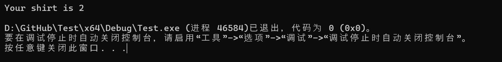
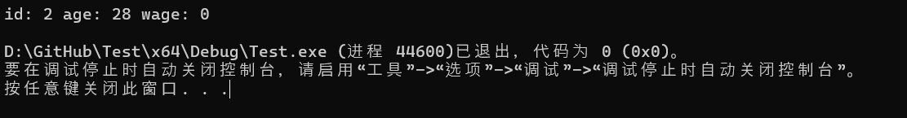
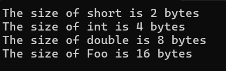

# 第13章、**复合类型：枚举和结构体**

## 13.1 — 程序定义（用户定义）类型介绍

由于基本类型是作为核心 C++ 语言的一部分定义的，因此可以立即使用。例如，如果我们想定义一个类型为`int`或 的变量`double`，我们可以这样做：

```c++
int x; // define variable of fundamental type 'int'
double d; // define variable of fundamental type 'double'
```

对于作为基本类型（包括函数、指针、引用和数组）的简单扩展的复合类型来说也是如此：

```c++
void fcn(int) {}; // define a function of type void()(int)
int* ptr; // define variable of compound type 'pointer to int'
int& ref { x }; // define variable of compound type 'reference to int' (initialized with x)
int arr[5]; // define an array of 5 integers of type int[5] (we'll cover this in a future chapter)
```

这是可行的，因为 C++ 语言已经知道这些类型的类型名称（和符号）的含义——我们不需要提供或导入任何定义。

但是，请考虑类型别名的情况（在课程[10.7 -- 类型定义和类型别名](https://www.learncpp.com/cpp-tutorial/typedefs-and-type-aliases/)中介绍），它允许我们为现有类型定义一个新名称。由于类型别名会在程序中引入新的标识符，因此必须先定义类型别名，然后才能使用：

```c++
#include <iostream>

using length = int; // define a type alias with identifier 'length'

int main()
{
    length x { 5 }; // we can use 'length' here since we defined it above
    std::cout << x << '\n';

    return 0;
}
```

如果我们省略 的定义`length`，编译器将不知道 a`length`是什么，当我们尝试使用该类型定义变量时，它会报错。 的定义`length`不会创建对象 - 它只是告诉编译器 a`length`是什么，以便以后可以使用。

### **什么是用户定义/程序定义类型？**

回到上一章的介绍（[12.1——复合数据类型简介](https://www.learncpp.com/cpp-tutorial/introduction-to-compound-data-types/)），我们介绍了存储分数的挑战，该分数具有概念上相互关联的分子和分母。在那一课中，我们讨论了使用两个单独的整数分别存储分数的分子和分母时遇到的一些挑战。

如果 C++ 有内置分数类型，那就完美了——但事实并非如此。而且还有数百种其他可能有用的类型，但 C++ 没有包括它们，因为不可能预测某人可能需要的一切（更不用说实现和测试这些东西了）。

相反，C++ 以不同的方式解决了这些问题：允许我们创建全新的自定义类型供我们的程序使用！此类类型通常称为**用户定义类型**（尽管我们认为术语**“程序定义类型”**更好——我们将在本课后面讨论两者的区别）。

C++ 有两种不同的复合类型，可用于创建程序定义的类型：

- 枚举类型（包括无范围枚举和有范围枚举）
- 类类型（包括结构、类和联合）。

### **定义程序定义类型**

与类型别名一样，程序定义类型也必须先定义才能使用。程序定义类型的定义称为 类型**定义**。

虽然我们还没有介绍什么是结构体，但这里有一个例子展示了自定义 Fraction 类型的定义和使用该类型的对象的实例：

```c++
// Define a program-defined type named Fraction so the compiler understands what a Fraction is
// (we'll explain what a struct is and how to use them later in this chapter)
// This only defines what a Fraction type looks like, it doesn't create one
struct Fraction
{
	int numerator {};
	int denominator {};
};

// Now we can make use of our Fraction type
int main()
{
	Fraction f { 3, 4 }; // this actually instantiates a Fraction object named f

	return 0;
}
```

在此示例中，我们使用`struct`关键字来定义一个名为 的新程序定义类型`Fraction`（在全局范围内，因此可以在文件的其余部分的任何位置使用）。这不会分配任何内存 - 它只是告诉编译器 是什么样子`Fraction`，因此我们可以稍后分配类型的对象`Fraction`。然后，在 中，我们实例化`Fraction`f（并初始化）一个名为`main()`的变量。

程序定义的类型定义必须以分号结尾。未在类型定义末尾添加分号是程序员常见的错误，并且很难调试，因为编译器可能会在类型定义*后的行上出错。*

**警告**：不要忘记用分号结束类型定义。

我们将在下一课（[13.2--无作用域枚举](https://www.learncpp.com/cpp-tutorial/unscoped-enumerations/)）中展示更多定义和使用程序定义类型的示例，并从[第 13.7 课--结构体、成员和成员选择简介](https://www.learncpp.com/cpp-tutorial/introduction-to-structs-members-and-member-selection/)开始介绍结构体。

### **命名程序定义类型**

按照惯例，程序定义类型的命名以大写字母开头，并且不使用后缀（例如`Fraction`，不是`fraction`，`fraction_t`或`Fraction_t`）。

**最佳实践**：以大写字母开头命名程序定义类型，并且不要使用后缀。

新程序员有时会发现如下的变量定义令人困惑，因为类型名称和变量名很相似：

```c++
Fraction fraction {}; // Instantiates a variable named fraction of type Fraction
```

这与任何其他变量定义没什么不同：类型 ( `Fraction`) 放在第一位（因为 Fraction 是大写的，我们知道它是程序定义的类型），然后是变量名称 ( `fraction`)，然后是可选的初始化程序。因为 C++ 区分大小写，所以这里没有命名冲突！

### **在多文件程序中使用程序定义类型**

每个使用程序定义类型的代码文件在使用之前都需要查看完整的类型定义。前向声明是不够的。这是必需的，以便编译器知道为该类型的对象分配多少内存。

为了将类型定义传播到需要它们的代码文件中，程序定义类型通常在头文件中定义，然后 #include 到需要该类型定义的任何代码文件中。这些头文件通常与程序定义类型同名（例如，名为 Fraction 的程序定义类型将在 Fraction.h 中定义）

**最佳实践**：仅在一个代码文件中使用的程序定义类型应在该代码文件中尽可能靠近第一个使用点进行定义。在多个代码文件中使用的程序定义类型应该在与程序定义类型同名的头文件中定义，然后根据需要将其#include 到每个代码文件中。

下面是一个示例，如果我们将 Fraction 类型移动到头文件（名为 Fraction.h）以便可以将其包含在多个代码文件中，它将是什么样子：

`Fraction.h：`

```c++
#ifndef FRACTION_H
#define FRACTION_H

// Define a new type named Fraction
// This only defines what a Fraction looks like, it doesn't create one
// Note that this is a full definition, not a forward declaration
struct Fraction
{
	int numerator {};
	int denominator {};
};

#endif
```

`Fraction.cpp:`

```c++
#include "Fraction.h" // include our Fraction definition in this code file

// Now we can make use of our Fraction type
int main()
{
	Fraction f{ 3, 4 }; // this actually creates a Fraction object named f

	return 0;
}
```

### **类型定义部分不受单一定义规则 (ODR) 的约束**

在课程[2.7 — 前向声明和定义](https://www.learncpp.com/cpp-tutorial/forward-declarations/#ODR)中，我们讨论了一次定义规则如何要求每个函数和全局变量在每个程序中只有一个定义。要在不包含定义的文件中使用给定函数或全局变量，我们需要前向声明（我们通常通过头文件传播）。这是可行的，因为声明足以满足编译器对函数和非 constexpr 变量的要求，然后链接器可以将所有内容连接起来。

但是，以类似的方式使用前向声明对类型不起作用，因为编译器通常需要查看完整定义才能使用给定类型。我们必须能够将完整类型定义传播到需要它的每个代码文件。

为了实现这一点，类型部分不受单一定义规则的约束：允许在多个代码文件中定义给定类型。

您已经使用了此功能（可能没有意识到）：如果您的程序有两个代码文件`#include <iostream>`，那么您将所有输入/输出类型定义导入到这两个文件中。

有两个注意事项值得了解。首先，每个代码文件仍然只能有一个类型定义（这通常不是问题，因为标头保护会阻止这种情况）。其次，给定类型的所有类型定义必须相同，否则会导致未定义的行为。

### **命名法：用户定义类型与程序定义类型**

“用户定义类型”这个术语有时会出现在日常对话中，C++ 语言标准中也提到过（但未定义）。在日常对话中，该术语往往表示“在您自己的程序中定义的类型”（例如上面的 Fraction 类型示例）。

C++ 语言标准以非常规方式使用术语“用户定义类型”。在语言标准中，“用户定义类型”是指由您、标准库或实现定义的任何类类型或枚举类型（例如，编译器为支持语言扩展而定义的类型）。也许违反直觉，这意味着`std::string`（标准库中定义的类类型）被视为用户定义类型！

为了提供额外的区分，C++20 语言标准对术语“程序定义类型”进行了有益的定义，即指未作为标准库、实现或核心语言的一部分定义的类类型和枚举类型。换句话说，“程序定义类型”仅包括由我们（或第三方库）定义的类类型和枚举类型。

因此，当仅谈论我们在自己的程序中定义的类类型和枚举类型时，我们更喜欢使用术语“程序定义”，因为它具有更精确的定义。

| 类型     | 意义                                                         | 示例                                 |
| -------- | ------------------------------------------------------------ | ------------------------------------ |
| 基本的   | 核心 C++ 语言的内置类型                                      | int，std::nullptr_t                  |
| Compound | 由基本类型构建的类型                                         | int&、double*、std::string、Fraction |
| 用户定义 | 类类型或枚举类型 （包括标准库或实现中定义的类型） （在非正式使用中，通常用于表示程序定义的类型） | std::string，Fraction                |
| 程序定义 | 类类型或枚举类型 （不包括标准库或实现中定义的类型）          | Fraction                             |

## 13.2 — 无作用域枚举

C++ 包含许多有用的基本数据类型和复合数据类型（我们在课程[4.1 - 基本数据类型简介](https://www.learncpp.com/cpp-tutorial/introduction-to-fundamental-data-types/)和课程[12.1 - 复合数据类型简介](https://www.learncpp.com/cpp-tutorial/introduction-to-compound-data-types/)中介绍过）。但这些类型并不总是能满足我们想要做的事情。

例如，假设您正在编写一个程序，需要跟踪苹果是红色、黄色还是绿色，或者衬衫是什么颜色（从预设的颜色列表中）。如果只有基本类型可用，您将如何做到这一点？

您可以使用某种隐式映射将颜色存储为整数值（0 = 红色，1 = 绿色，2 = 蓝色）：

```c++
int main()
{
    int appleColor{ 0 }; // my apple is red
    int shirtColor{ 1 }; // my shirt is green

    return 0;
}
```

但这根本不直观，我们已经讨论过为什么魔法数字不好（[5.2 -- 文字](https://www.learncpp.com/cpp-tutorial/literals/)）。我们可以通过使用符号常量来摆脱魔法数字：

```c++
constexpr int red{ 0 };
constexpr int green{ 1 };
constexpr int blue{ 2 };

int main()
{
    int appleColor{ red };
    int shirtColor{ green };

    return 0;
}
```

虽然这对于阅读来说稍微好一些，但是程序员仍然需要推断出`appleColor`和`shirtColor`（类型`int`）用于保存颜色符号常量集合中定义的值之一（这些值可能在其他地方定义，可能在单独的文件中）。

我们可以使用类型别名使这个程序更清晰一些：

```c++
using Color = int; // define a type alias named Color

// The following color values should be used for a Color
constexpr Color red{ 0 };
constexpr Color green{ 1 };
constexpr Color blue{ 2 };

int main()
{
    Color appleColor{ red };
    Color shirtColor{ green };

    return 0;
}
```

我们越来越接近了。阅读此代码的人仍然必须了解这些颜色符号常量应该与类型变量一起使用`Color`，但至少类型现在有一个唯一的名称，因此搜索的人`Color`将能够找到相关符号常量的集合。

然而，由于`Color`只是 的别名`int`，我们仍然面临一个问题，即没有任何东西可以强制正确使用这些颜色符号常量。我们仍然可以这样做：

```c++
Color eyeColor{ 8 }; // syntactically valid, semantically meaningless
```

此外，如果我们在调试器中调试任何这些变量，我们将只能看到颜色的整数值（例如`0`），而看不到符号含义（`red`），这会使我们更难判断程序是否正确。

幸运的是，我们可以做得更好。

为了启发，请考虑一下`bool`类型。`bool`特别有趣的是，它只有两个定义的值：`true`和`false`。我们可以直接使用`true`或`false`（作为文字），也可以实例化一个`bool`对象并让它保存其中一个值。此外，编译器能够区分`bool`其他类型。这意味着我们可以重载函数，并自定义这些函数在传递`bool`值时的行为。

如果我们有能力定义自己的自定义类型，并且*可以*定义与该类型相关的命名值集，那么我们就有完美的工具来优雅地解决上述挑战……

### **枚举**

枚举（也称为**枚举类型**或枚举**）是一种复合数据类型，其****值**仅限于一组命名的符号常量（称为**枚举器**）。

C++ 支持两种类型的枚举：无范围枚举（我们现在将介绍）和有范围枚举（我们将在本章后面介绍）。

因为枚举是程序定义的类型[13.1 -- 程序定义（用户定义）类型介绍](https://www.learncpp.com/cpp-tutorial/introduction-to-program-defined-user-defined-types/)，所以每个枚举都需要在使用它之前进行完整定义（前向声明是不够的）。

### **无作用域枚举**

范围枚举是通过`enum`关键字定义的。

枚举类型最好通过示例来讲解，因此让我们定义一个可以保存一些颜色值的无范围枚举。我们将在下面解释它的工作原理。

```c++
// Define a new unscoped enumeration named Color
enum Color
{
    // Here are the enumerators
    // These symbolic constants define all the possible values this type can hold
    // Each enumerator is separated by a comma, not a semicolon
    red,
    green,
    blue, // trailing comma optional but recommended
}; // the enum definition must end with a semicolon

int main()
{
    // Define a few variables of enumerated type Color
    Color apple { red };   // my apple is red
    Color shirt { green }; // my shirt is green
    Color cup { blue };    // my cup is blue

    Color socks { white }; // error: white is not an enumerator of Color
    Color hat { 2 };       // error: 2 is not an enumerator of Color

    return 0;
}
```

我们通过使用`enum`关键字来开始我们的示例，以告诉编译器我们正在定义一个无范围的枚举，我们将其命名为`Color`。

在一对花括号内，我们定义了类型的枚举器`Color`：`red`、`green`和`blue`。这些枚举器定义了该类型所限的特定值`Color`。每个枚举器必须用逗号（而不是分号）分隔 - 最后一个枚举器后面的尾随逗号是可选的，但为了保持一致性，建议使用。

最常见的是每行定义一个枚举器，但在简单情况下（枚举器数量较少且不需要注释），它们也可以全部定义在一行上。

类型定义`Color`以分号结尾。现在我们已经完全定义了什么`Color`是枚举类型！

在 中`main()`，我们实例化了三个类型为 的变量`Color`：`apple`用颜色 初始化`red`，`shirt`用颜色 初始化`green`，`cup`用颜色 初始化`blue`。 为每个对象分配内存。 请注意，枚举类型的初始化器必须是该类型定义的枚举器之一。 变量`socks`和`hat`会导致编译错误，因为初始化器`white`和`2`不是 的枚举器`Color`。

枚举器隐式地是 constexpr。

**提醒**

快速回顾一下命名法：

- 枚举或*枚举类型*是程序定义的类型本身（例如*）*。`Color`
- *枚举器*是属于枚举的特定命名值（例如`red`）。

### **命名枚举和枚举器**

按照惯例，枚举类型的名称以大写字母开头（所有程序定义的类型都是如此）。

**警告**:枚举不必命名，但是在现代 C++ 中应该避免使用未命名的枚举。

枚举器必须有名字。遗憾的是，枚举器名称没有通用的命名约定。常见的选择包括以小写字母开头（例如 red）、以大写字母开头（Red）、全部大写字母（RED）、全部大写字母加前缀（COLOR_RED），或以“k”为前缀并插入大写字母（kColorRed）。

现代 C++ 指南通常建议避免使用全大写的命名约定，因为全大写通常用于预处理器宏，并且可能会发生冲突。我们还建议避免使用以大写字母开头的约定，因为以大写字母开头的名称通常保留用于程序定义的类型。

**最佳实践:**枚举类型以大写字母开头命名。枚举器以小写字母开头命名。

### **枚举类型是不同的类型**

您创建的每个枚举类型都被视为一种**不同的类型**，这意味着编译器可以将其与其他类型区分开来（与 typedef 或类型别名不同，它们被认为与它们所别名的类型没有区别）。

由于枚举类型是不同的，因此定义为一个枚举类型的一部分的枚举器不能与另一个枚举类型的对象一起使用：

```c++
enum Pet
{
    cat,
    dog,
    pig,
    whale,
};

enum Color
{
    black,
    red,
    blue,
};

int main()
{
    Pet myPet { black }; // compile error: black is not an enumerator of Pet
    Color shirt { pig }; // compile error: pig is not an enumerator of Color

    return 0;
}
```

不管怎样，你可能都不想要一件猪衬衫。

### **使用枚举**

由于枚举器具有描述性，因此它们对于增强代码文档和可读性非常有用。当您拥有一组较小的相关常量，并且对象每次只需要保存其中一个值时，最好使用枚举类型。

通常定义的枚举包括一周中的日子、基本方向和一副牌的花色：

```c++
enum DaysOfWeek
{
    sunday,
    monday,
    tuesday,
    wednesday,
    thursday,
    friday,
    saturday,
};

enum CardinalDirections
{
    north,
    east,
    south,
    west,
};

enum CardSuits
{
    clubs,
    diamonds,
    hearts,
    spades,
};
```

有时函数会向调用者返回状态代码，以指示函数是否成功执行或遇到错误。传统上，使用较小的负数来表示不同的可能错误代码。例如：

```c++
int readFileContents()
{
    if (!openFile())
        return -1;
    if (!readFile())
        return -2;
    if (!parseFile())
        return -3;

    return 0; // success
}
```

但是，使用这样的魔法数字不太具有描述性。更好的方法是使用枚举类型：

```c++
enum FileReadResult
{
    readResultSuccess,
    readResultErrorFileOpen,
    readResultErrorFileRead,
    readResultErrorFileParse,
};

FileReadResult readFileContents()
{
    if (!openFile())
        return readResultErrorFileOpen;
    if (!readFile())
        return readResultErrorFileRead;
    if (!parseFile())
        return readResultErrorFileParse;

    return readResultSuccess;
}
```

然后，调用者可以根据适当的枚举器测试函数的返回值，这比测试特定整数值的返回结果更容易理解。

```c++
if (readFileContents() == readResultSuccess)
{
    // do something
}
else
{
    // print error message
}
```

枚举类型在游戏中也很有用，可以识别不同类型的物品、怪物或地形。基本上，任何由一小组相关对象组成的事物都可以。

例如：

```c++
enum ItemType
{
	sword,
	torch,
	potion,
};

int main()
{
	ItemType holding{ torch };

	return 0;
}
```

当用户需要在两个或多个选项之间做出选择时，枚举类型也可以作为有用的函数参数：

```c++
enum SortOrder
{
    alphabetical,
    alphabeticalReverse,
    numerical,
};

void sortData(SortOrder order)
{
    switch (order)
    {
        case alphabetical:
            // sort data in forwards alphabetical order
            break;
        case alphabeticalReverse:
            // sort data in backwards alphabetical order
            break;
        case numerical:
            // sort data numerically
            break;
    }
}
```

许多语言使用枚举来定义布尔值 - 毕竟，布尔值本质上只是一个具有 2 个枚举器的枚举：`false`和`true`！然而，在 C++ 中，`true`和`false`被定义为关键字而不是枚举器。

因为枚举很小并且复制起来很便宜，所以可以通过值传递（和返回）它们。

在课程[O.1 -- 通过 std::bitset 进行位标志和位操作](https://www.learncpp.com/cpp-tutorial/bit-flags-and-bit-manipulation-via-stdbitset/)中，我们讨论了位标志。枚举还可用于定义相关位标志位置的集合，以供使用`std::bitset`：

```c++
#include <bitset>
#include <iostream>

namespace Flags
{
    enum State
    {
        isHungry,
        isSad,
        isMad,
        isHappy,
        isLaughing,
        isAsleep,
        isDead,
        isCrying,
    };
}

int main()
{
    std::bitset<8> me{};
    me.set(Flags::isHappy);
    me.set(Flags::isLaughing);

    std::cout << std::boolalpha; // print bool as true/false

    // Query a few states (we use the any() function to see if any bits remain set)
    std::cout << "I am happy? " << me.test(Flags::isHappy) << '\n';
    std::cout << "I am laughing? " << me.test(Flags::isLaughing) << '\n';

    return 0;
}
```

如果您想知道如何在需要整数值的地方使用枚举器，无作用域枚举器将隐式转换为整数值。我们将在下一课中进一步探讨这一点（[13.3--无作用域枚举器整数转换](https://www.learncpp.com/cpp-tutorial/unscoped-enumerator-integral-conversions/)）。

### **无范围枚举的范围**

无范围枚举之所以如此命名，是因为它们将其枚举器名称放入与枚举定义本身相同的范围中（而不是像命名空间那样创建一个新的范围区域）。

例如，给定这个程序：

```c++
enum Color // this enum is defined in the global namespace
{
    red, // so red is put into the global namespace
    green,
    blue,
};

int main()
{
    Color apple { red }; // my apple is red

    return 0;
}
```

枚举`Color`在全局范围内定义。因此，所有枚举名称（`red`、`green`和`blue`）也进入全局范围。这会污染全局范围并显著增加命名冲突的可能性。

这样做的后果是，一个枚举器名称不能在同一范围内的多个枚举中使用：

```c++
enum Color
{
    red,
    green,
    blue, // blue is put into the global namespace
};

enum Feeling
{
    happy,
    tired,
    blue, // error: naming collision with the above blue
};

int main()
{
    Color apple { red }; // my apple is red
    Feeling me { happy }; // I'm happy right now (even though my program doesn't compile)

    return 0;
}
```

在上面的例子中，两个无作用域枚举（`Color`和`Feeling`）都将同名的枚举器`blue`放入全局作用域中。这会导致命名冲突和随后的编译错误。

无作用域枚举还为其枚举器提供了一个命名作用域区域（就像命名空间充当其中声明的名称的命名作用域区域一样）。这意味着我们可以按如下方式访问无作用域枚举的枚举器：

```c++
enum Color
{
    red,
    green,
    blue, // blue is put into the global namespace
};

int main()
{
    Color apple { red }; // okay, accessing enumerator from global namespace
    Color raspberry { Color::red }; // also okay, accessing enumerator from scope of Color

    return 0;
}
```

大多数情况下，访问无范围枚举器时不需要使用范围解析运算符。

### **避免枚举器命名冲突**

有很多常用的方法可以防止无范围枚举器命名冲突。

一种选择是在每个枚举器前面加上枚举本身的名称：

```c++
enum Color
{
    color_red,
    color_blue,
    color_green,
};

enum Feeling
{
    feeling_happy,
    feeling_tired,
    feeling_blue, // no longer has a naming collision with color_blue
};

int main()
{
    Color paint { color_blue };
    Feeling me { feeling_blue };

    return 0;
}
```

这仍然会污染命名空间，但通过使名称更长且更独特，可以减少命名冲突的机会。

更好的选择是将枚举类型放在提供单独范围区域的东西里面，比如命名空间：

```c++
namespace Color
{
    // The names Color, red, blue, and green are defined inside namespace Color
    enum Color
    {
        red,
        green,
        blue,
    };
}

namespace Feeling
{
    enum Feeling
    {
        happy,
        tired,
        blue, // Feeling::blue doesn't collide with Color::blue
    };
}

int main()
{
    Color::Color paint{ Color::blue };
    Feeling::Feeling me{ Feeling::blue };

    return 0;
}
```

这意味着我们现在必须在枚举和枚举器名称前加上范围区域的名称。

`Note:`类还提供了作用域，通常将与类相关的枚举类型放在类的作用域内。我们将在第[15.3 课——嵌套类型（成员类型）](https://www.learncpp.com/cpp-tutorial/nested-types-member-types/)中讨论这一点。

一个相关的选项是使用作用域枚举（它定义自己的作用域区域）。我们将很快讨论作用域枚举（[13.6 -- 作用域枚举（枚举类）](https://www.learncpp.com/cpp-tutorial/scoped-enumerations-enum-classes/)）。

**最佳实践**:最好将枚举放在命名范围区域（例如命名空间或类）内，这样枚举器就不会污染全局命名空间。

或者，如果枚举仅在单个函数主体中使用，则应在函数内部定义枚举。这会将枚举及其枚举器的范围限制在该函数内。此类枚举的枚举器将覆盖全局范围内定义的同名枚举器。

### **与枚举器进行比较**

我们可以使用相等运算符（`operator==`和`operator!=`）来测试枚举是否具有特定枚举器的值。

```c++
#include <iostream>

enum Color
{
    red,
    green,
    blue,
};

int main()
{
    Color shirt{ blue };

    if (shirt == blue) // if the shirt is blue
        std::cout << "Your shirt is blue!";
    else
        std::cout << "Your shirt is not blue!";

    return 0;
}
```

在上面的例子中，我们使用 if 语句来测试是否`shirt`等于枚举器`blue`。这为我们提供了一种方法，可以根据枚举所持有的枚举器来条件化程序的行为。

### **测验**

定义一个名为 MonsterType 的枚举类型，在以下怪物种族之间进行选择：兽人、地精、巨魔、食人魔和骷髅。

```c++
enum MonsterType
{
    orc,
    goblin,
    troll,
    ogre,
    skeleton,
};
```

将 `MonsterType` 枚举放入命名空间中。然后，创建一个 main() 函数并实例化一个 troll。该程序应该可以编译。

```c++
namespace Monster
{
    enum MonsterType
    {
        orc,
        goblin,
        troll,
        ogre,
        skeleton,
    };
}

int main()
{
    // We use [[maybe_unused]] to avoid warnings about unused variables
    // You could also output the monster instead
    [[maybe_unused]] Monster::MonsterType monster{ Monster::troll };

    return 0;
}
```

## 13.3 — 无作用域枚举器整数转换

在上一课（[13.2-无作用域枚举](https://www.learncpp.com/cpp-tutorial/unscoped-enumerations/)）中，我们提到枚举器是符号常量。我们当时没有告诉你的是，这些枚举器具有整数类型的值。

[这与字符（ 4.11 -- Chars](https://www.learncpp.com/cpp-tutorial/chars/) ）的情况类似。考虑：

```c++
char ch { 'A' };
```

char 实际上只是一个 1 字节的整数值，并且字符`'A'`会转换为整数值（在本例中为`65`）并存储。

当我们定义枚举时，每个枚举器都会根据其在枚举器列表中的位置自动与一个整数值相关联。 默认情况下，第一个枚举器被赋予整数值`0`，并且每个后续枚举器的值都比前一个枚举器大一：

```c++
enum Color
{
    black,   // 0
    red,     // 1
    blue,    // 2
    green,   // 3
    white,   // 4
    cyan,    // 5
    yellow,  // 6
    magenta, // 7
};

int main()
{
    Color shirt{ blue }; // shirt actually stores integral value 2

    return 0;
}
```

可以明确定义枚举器的值。这些整数值可以是正数或负数，并且可以与其他枚举器共享相同的值。任何未定义的枚举器都会被赋予一个比前一个枚举器大 1 的值。

```c++
enum Animal
{
    cat = -3,    // values can be negative
    dog,         // -2
    pig,         // -1
    horse = 5,
    giraffe = 5, // shares same value as horse
    chicken,     // 6
};
```

注意，在这种情况下，`horse`和`giraffe`被赋予了相同的值。当发生这种情况时，枚举器变得不唯一——本质上，`horse`和`giraffe`是可以互换的。尽管 C++ 允许这样做，但通常应避免将相同的值分配给同一枚举中的两个枚举器。

大多数情况下，枚举器的默认值就是您想要的，因此除非有特殊原因，否则请不要提供您自己的值。

**最佳实践：**除非有令人信服的理由，否则请避免为枚举器分配明确的值。

### **值初始化枚举**

如果枚举是零初始化的（当我们使用值初始化时会发生这种情况），则枚举将被赋予值`0`，即使没有具有该值的对应枚举器。

```c++
#include <iostream>

enum Animal
{
    cat = -3,    // -3
    dog,         // -2
    pig,         // -1
    // note: no enumerator with value 0 in this list
    horse = 5,   // 5
    giraffe = 5, // 5
    chicken,     // 6
};

int main()
{
    Animal a {}; // value-initialization zero-initializes a to value 0
    std::cout << a; // prints 0

    return 0;
}
```

这有两个语义后果：

- 如果存在值为 0 的枚举器，则值初始化会将枚举默认为该枚举器的含义。例如，使用前面的`enum Color`示例，值初始化`Color`将默认为`black`）。因此，最好考虑将值为 0 的枚举器设为代表枚举的最佳默认含义的枚举器。

  类似这样的情况很可能会导致问题：

  ```c++
  enum UniverseResult
  {
      destroyUniverse, // default value (0)
      saveUniverse
  };
  ```

  

- 如果没有值为 0 的枚举器，则值初始化很容易创建语义上无效的枚举。在这种情况下，我们建议添加值为 0 的“无效”或“未知”枚举器，以便您有文档记录该状态的含义，以及您可以明确处理的该状态的名称。

  ```c++
  enum Winner
  {
      winnerUnknown, // default value (0)
      player1,
      player2,
  };
  
  // somewhere later in your code
  if (w == winnerUnknown) // handle case appropriately
  ```

  

**最佳实践**

让表示 0 的枚举器成为枚举的最佳默认含义。如果没有好的默认含义，请考虑添加一个值为 0 的“无效”或“未知”枚举器，以便明确记录该状态，并在适当的情况下进行明确处理。

### **无范围枚举将隐式转换为整数值**

尽管枚举存储的是整数值，但它们不被视为整数类型（它们是复合类型）。但是，无作用域枚举将隐式转换为整数值。由于枚举器是编译时常量，因此这是一个 constexpr 转换（我们将在第[10.4 课——收缩转换、列表初始化和 constexpr 初始化器](https://www.learncpp.com/cpp-tutorial/narrowing-conversions-list-initialization-and-constexpr-initializers/)中介绍这些内容）。

考虑以下程序：

```c++
#include <iostream>

enum Color
{
    black, // assigned 0
    red, // assigned 1
    blue, // assigned 2
    green, // assigned 3
    white, // assigned 4
    cyan, // assigned 5
    yellow, // assigned 6
    magenta, // assigned 7
};

int main()
{
    Color shirt{ blue };

    std::cout << "Your shirt is " << shirt << '\n'; // what does this do?

    return 0;
}
```

由于枚举类型保存整数值，正如您所料，这将打印：



当枚举类型用于函数调用或与运算符一起使用时，编译器将首先尝试查找与枚举类型匹配的函数或运算符。例如，当编译器尝试编译时`std::cout << shirt`，编译器将首先查看是否`operator<<`知道如何将类型的对象`Color`（因为`shirt`是类型`Color`）打印到`std::cout`。但它不知道。

由于编译器找不到匹配项，因此它会检查是否`operator<<`知道如何打印无范围枚举转换为的整数类型的对象。如果可以，则中的值`shirt`将转换为整数值并打印为整数值`2`。

### **枚举大小和基础类型（基数）**

枚举器的值属于整数类型。但是什么整数类型呢？用于表示枚举器值的特定整数类型称为枚举的**基础类型**（或**基数**）。

对于无作用域枚举，C++ 标准未指定应使用哪种特定整数类型作为基础类型，因此选择由实现定义。大多数编译器将使用`int`作为基础类型（这意味着无作用域枚举的大小与 相同`int`），除非需要更大的类型来存储枚举器值。但您不应假设这适用于每个编译器或平台。

可以为枚举明确指定基础类型。基础类型必须是整数类型。例如，如果您在某些带宽敏感的环境中工作（例如通过网络发送数据），则可能需要为枚举指定较小的类型：

```c++
#include <cstdint>  // for std::int8_t
#include <iostream>

// Use an 8-bit integer as the enum underlying type
enum Color : std::int8_t
{
    black,
    red,
    blue,
};

int main()
{
    Color c{ black };
    std::cout << sizeof(c) << '\n'; // prints 1 (byte)

    return 0;
}
```

**最佳实践**

仅在必要时指定枚举的基类型。

**警告**

由于`std::int8_t`和`std::uint8_t`通常是 char 类型的类型别名，因此使用其中任何一种类型作为枚举基数很可能会导致枚举器打印为 char 值而不是 int 值。

### **整数到无范围枚举器的转换**

虽然编译器会将无作用域枚举隐式转换为整数，但它不会*将*整数隐式转换为无作用域枚举。以下操作将产生编译器错误：

```c++
enum Pet // no specified base
{
    cat, // assigned 0
    dog, // assigned 1
    pig, // assigned 2
    whale, // assigned 3
};

int main()
{
    Pet pet { 2 }; // compile error: integer value 2 won't implicitly convert to a Pet
    pet = 3;       // compile error: integer value 3 won't implicitly convert to a Pet

    return 0;
}
```

有两种方法可以解决这个问题。

首先，您可以使用以下方法将整数明确转换为无范围枚举器`static_cast`：

```c++
enum Pet // no specified base
{
    cat, // assigned 0
    dog, // assigned 1
    pig, // assigned 2
    whale, // assigned 3
};

int main()
{
    Pet pet { static_cast<Pet>(2) }; // convert integer 2 to a Pet
    pet = static_cast<Pet>(3);       // our pig evolved into a whale!

    return 0;
}
```

我们将在第 13.4 课中看到一个例子[——将枚举转换为字符串，并](https://www.learncpp.com/cpp-tutorial/converting-an-enumeration-to-and-from-a-string/)在其中利用这一点。

对目标枚举的枚举器所表示的任何整数值进行 static_cast 都是安全的。由于我们的`Pet`枚举具有值为`0`、`1`、`2`和 的枚举器`3`，因此将整数值`0`、`1`、`2`和静态转换`3`为 a`Pet`是有效的。

静态转换目标枚举基础类型范围内的任何整数值也是安全的，即使没有枚举器表示该值。静态转换基础类型范围之外的值将导致未定义的行为。

**Note**

<u>如果枚举具有明确定义的基础类型，则枚举的范围与基础类型的范围相同。</u>

<u>如果枚举没有显式的底层类型，事情会稍微复杂一些。在这种情况下，编译器可以选择底层类型，它可以选择任何有符号或无符号类型，只要所有枚举器的值都适合该类型。鉴于此，只有适合最小位数范围（可以容纳所有枚举器的值）的整数值才是安全的。</u>

<u>我们来做两个例子来说明这一点：</u>

- <u>对于具有值 2、9 和 12 的枚举器，这些枚举器至少可以适合范围为 0 到 15 的无符号 4 位整数类型。因此，只有将 0 到 15 的整数值 static_cast 转换为此枚举类型才是安全的。</u>
- <u>对于具有值 -28、2 和 6 的枚举数，这些枚举数至少可以适合范围为 -32 到 31 的有符号 6 位整数类型。因此，只有将整数值 -32 到 31 static_cast 为这种枚举类型才是安全的。</u>

其次，从 C++17 开始，如果无范围枚举具有明确指定的基数，则编译器将允许您使用整数值列出初始化无范围枚举：

```c++
enum Pet: int // we've specified a base
{
    cat, // assigned 0
    dog, // assigned 1
    pig, // assigned 2
    whale, // assigned 3
};

int main()
{
    Pet pet1 { 2 }; // ok: can brace initialize unscoped enumeration with specified base with integer (C++17)
    Pet pet2 (2);   // compile error: cannot direct initialize with integer
    Pet pet3 = 2;   // compile error: cannot copy initialize with integer

    pet1 = 3;       // compile error: cannot assign with integer

    return 0;
}
```

### **测验**

真或假。枚举器可以是：

- 给定一个整数值   真的

- 没有明确的价值 确实如此。 未明确赋值的枚举器将被隐式赋值为前一个枚举器的整数值 + 1。如果没有前一个枚举器，则枚举器将采用 0 值。 

- 给定浮点值  错误的

- 给定负值 真的

- 给定一个非唯一值 真的

- 给定先前枚举器的值（例如洋红色=红色）没错。枚举器不必是唯一的。由于枚举器隐式转换为整数，并且可以将整数赋给枚举器，因此可以使用其他枚举器初始化枚举器（尽管通常没有理由这样做！）。

- 给定一个非 `constexpr` 值  错误。由于枚举器是 `constexpr`，因此它们的值也必须是 `constexpr`。

  

## 13.4 — 将枚举转换为字符串

在上一课（[13.3 -- 无范围枚举器整数转换](https://www.learncpp.com/cpp-tutorial/unscoped-enumerator-integral-conversions/)）中，我们展示了这样的示例：

```c++
#include <iostream>

enum Color
{
    black, // 0
    red,   // 1
    blue,  // 2
};

int main()
{
    Color shirt{ blue };

    std::cout << "Your shirt is " << shirt << '\n';

    return 0;
}
```

因为`operator<<`不知道如何打印`Color`，所以编译器会隐式地将其转换`Color`为整数值并打印出来。

大多数情况下，将枚举打印为整数值（例如`2`）并不是我们想要的。相反，我们通常希望打印枚举器所代表的任何名称（例如`blue`）。C++ 没有提供现成的方法来执行此操作，因此我们必须自己找到解决方案。幸运的是，这并不难。

### **获取枚举器的名称**

获取枚举器名称的典型方法是编写一个函数，该函数允许我们传入枚举器并以字符串形式返回枚举器的名称。但这需要某种方法来确定应为给定的枚举器返回哪个字符串。

有两种常见的方法可以实现这一点。

在课程[8.5 -- Switch 语句基础](https://www.learncpp.com/cpp-tutorial/switch-statement-basics/)中，我们注意到 switch 语句可以切换整数值或枚举值。在下面的示例中，我们使用 switch 语句选择一个枚举器并返回该枚举器的适当颜色字符串文字：

```c++
#include <iostream>
#include <string_view>

enum Color
{
    black,
    red,
    blue,
};

constexpr std::string_view getColorName(Color color)
{
    switch (color)
    {
    case black: return "black";
    case red:   return "red";
    case blue:  return "blue";
    default:    return "???";
    }
}

int main()
{
    constexpr Color shirt{ blue };

    std::cout << "Your shirt is " << getColorName(shirt) << '\n';

    return 0;
}
```

在上面的例子中，我们打开了`color`，它保存了我们传入的枚举器。在 switch 内部，我们为 的每个枚举器都有一个 case 标签`Color`。每个 case 都会以 C 样式字符串文字的形式返回相应颜色的名称。此 C 样式字符串文字会隐式转换为`std::string_view`，并返回给调用者。我们还有一个默认 case，它返回`"???"`，以防用户传入我们意想不到的内容。

**提醒**

由于 C 样式字符串文字存在于整个程序中，因此可以返回`std::string_view`查看 C 样式字符串文字的 。当`std::string_view`复制回调用者时，正在查看的 C 样式字符串文字仍将存在。

该函数是 constexpr，因此我们可以在常量表达式中使用颜色的名称。

虽然这可以让我们获得枚举器的名称，但如果我们想将该名称打印到控制台，则必须执行的操作`std::cout << getColorName(shirt)`并不像那么好`std::cout << shirt`。我们将`std::cout`在即将到来的课程 13.5 中教授如何打印枚举[——重载 I/O 运算符的介绍](https://www.learncpp.com/cpp-tutorial/introduction-to-overloading-the-i-o-operators/)。

解决将枚举器映射到字符串的程序的第二种方法是使用数组。我们将在第[17.6 课——std::array 和枚举](https://www.learncpp.com/cpp-tutorial/stdarray-and-enumerations/)中介绍这一点。

### **无范围枚举器输入**

现在让我们看一个输入案例。在下面的例子中，我们定义一个`Pet`枚举。由于`Pet`是程序定义的类型，因此语言不知道如何`Pet`使用输入`std::cin`：

```c++
#include <iostream>

enum Pet
{
    cat,   // 0
    dog,   // 1
    pig,   // 2
    whale, // 3
};

int main()
{
    Pet pet { pig };
    std::cin >> pet; // compile error: std::cin doesn't know how to input a Pet

    return 0;
}
```

解决此问题的一个简单方法是读入一个整数，然后将`static_cast`其转换为适当枚举类型的枚举器：

```c++
#include <iostream>
#include <string_view>

enum Pet
{
    cat,   // 0
    dog,   // 1
    pig,   // 2
    whale, // 3
};

constexpr std::string_view getPetName(Pet pet)
{
    switch (pet)
    {
    case cat:   return "cat";
    case dog:   return "dog";
    case pig:   return "pig";
    case whale: return "whale";
    default:    return "???";
    }
}

int main()
{
    std::cout << "Enter a pet (0=cat, 1=dog, 2=pig, 3=whale): ";

    int input{};
    std::cin >> input; // input an integer

    if (input < 0 || input > 3)
        std::cout << "You entered an invalid pet\n";
    else
    {
        Pet pet{ static_cast<Pet>(input) }; // static_cast our integer to a Pet
        std::cout << "You entered: " << getPetName(pet) << '\n';
    }

    return 0;
}
```

虽然这可行，但有点尴尬。还要注意，我们只应该`static_cast<Pet>(input)`在知道`input`在枚举器范围内时才这样做。

### 从字符串获取枚举

如果用户可以输入一个代表枚举器的字符串（例如“pig”），而不是输入数字，那么效果会更好，我们可以将该字符串转换为适当的`Pet`枚举器。但是，这样做需要我们解决几个挑战。

首先，我们不能打开一个字符串，所以我们需要使用其他东西来匹配用户传入的字符串。这里最简单的方法是使用一系列 if 语句。

其次，`Pet`如果用户传入无效字符串，我们应该返回什么枚举器？一种选择是添加一个枚举器来表示“无/无效”，然后返回它。但是，更好的选择是`std::optional`在这里使用。

```c++
#include <iostream>
#include <optional> // for std::optional
#include <string>
#include <string_view>

enum Pet
{
    cat,   // 0
    dog,   // 1
    pig,   // 2
    whale, // 3
};

constexpr std::string_view getPetName(Pet pet)
{
    switch (pet)
    {
    case cat:   return "cat";
    case dog:   return "dog";
    case pig:   return "pig";
    case whale: return "whale";
    default:    return "???";
    }
}

constexpr std::optional<Pet> getPetFromString(std::string_view sv)
{
    if (sv == "cat")   return cat;
    if (sv == "dog")   return dog;
    if (sv == "pig")   return pig;
    if (sv == "whale") return whale;

    return {};
}

int main()
{
    std::cout << "Enter a pet: cat, dog, pig, or whale: ";
    std::string s{};
    std::cin >> s;

    std::optional<Pet> pet { getPetFromString(s) };

    if (!pet)
        std::cout << "You entered an invalid pet\n";
    else
        std::cout << "You entered: " << getPetName(*pet) << '\n';

    return 0;
}
```

在上述解决方案中，我们使用一系列 if-else 语句进行字符串比较。如果用户的输入字符串与枚举器字符串匹配，我们将返回相应的枚举器。如果没有匹配的字符串，我们将返回`{}`，这意味着“无值”。

**note**

注意上面的解决方案只匹配小写字母。如果要匹配任意大小写，可以使用以下函数将用户的输入转换为小写：

```c++
#include <algorithm> // for std::transform
#include <cctype>    // for std::tolower
#include <string>
#include <string_view>

// This function returns a std::string that is the lower-case version of the std::string_view passed in.
// Only 1:1 character mapping can be performed by this function
std::string toASCIILowerCase(std::string_view sv)
{
    std::string lower{};
    std::transform(sv.begin(), sv.end(), std::back_inserter(lower),
        [](unsigned char c){ return static_cast<char>(std::tolower(c)); });
    return lower;
}
```

此函数遍历 中的每个字符`std::string_view sv`，使用 将其转换为小写字符`std::tolower()`（在 lambda 的帮助下），然后将该小写字符附加到`lower`。

与输出情况类似，如果我们可以的话会更好`std::cin >> pet`。我们将在即将到来的课程[13.5——I/O 运算符重载简介](https://www.learncpp.com/cpp-tutorial/introduction-to-overloading-the-i-o-operators/)中介绍这一点。

## 13.5 — I/O 运算符重载介绍

在上一课 ( [13.4 -- 将枚举转换为字符串以及从字符串转换](https://www.learncpp.com/cpp-tutorial/converting-an-enumeration-to-and-from-a-string/)) 中，我们展示了这个例子，其中我们使用一个函数将枚举转换为等效的字符串：

```c++
#include <iostream>
#include <string_view>

enum Color
{
    black,
    red,
    blue,
};

constexpr std::string_view getColorName(Color color)
{
    switch (color)
    {
    case black: return "black";
    case red:   return "red";
    case blue:  return "blue";
    default:    return "???";
    }
}

int main()
{
    constexpr Color shirt{ blue };

    std::cout << "Your shirt is " << getColorName(shirt) << '\n';

    return 0;
}
```

尽管上面的例子运行良好，但也存在两个缺点：

1. 我们必须记住我们创建的用于获取枚举器名称的函数的名称。
2. 必须调用这样的函数会使我们的输出语句变得更加混乱。

`operator<<`理想情况下，如果我们能够以某种方式教会输出枚举，那就太好了，所以我们可以做这样的事情：`std::cout << shirt`并让它做我们期望的事情。

### **运算符重载简介**

在课程[11.1 — 函数重载简介](https://www.learncpp.com/cpp-tutorial/introduction-to-function-overloading/)中，我们介绍了函数重载，它允许我们创建具有相同名称的多个函数，只要每个函数具有唯一的函数原型即可。使用函数重载，我们可以创建适用于不同数据类型的函数变体，而不必为每个变体想出一个唯一的名称。

类似地，C++ 也支持**运算符重载**，它允许我们定义现有运算符的重载，以便我们可以使这些运算符与我们程序定义的数据类型一起工作。

基本运算符重载相当简单：

- 使用运算符的名称作为函数的名称来定义函数。
- 为每个操作数添加一个适当类型的参数（按从左到右的顺序）。这些参数之一必须是用户定义类型（类类型或枚举类型），否则编译器会出错。
- 将返回类型设置为任何有意义的类型。
- 使用return语句返回操作的结果。

当编译器在表达式中遇到运算符的使用，并且一个或多个操作数是用户定义类型时，编译器将检查是否存在可用于解析该调用的重载运算符函数。例如，给定某个表达式`x + y`，编译器将使用函数重载解析来查看是否存在`operator+(x, y)`可用于评估该运算的函数调用。如果可以找到一个非歧义`operator+`函数，则将调用该函数，并将运算结果作为返回值返回。

**note：**运算符也可以重载为最左操作数的成员函数。

### 重载`operator<<`以打印枚举器

在我们继续之前，让我们快速回顾一下`operator<<`它用于输出时的工作原理。

考虑一个简单的表达式，如`std::cout << 5`.`std::cout`有类型`std::ostream`（这是标准库中的用户定义类型），并且`5`是类型的文字`int`。

当评估此表达式时，编译器将寻找一个`operator<<`可以处理类型为`std::ostream`和 的参数的重载函数`int`。它将找到这样一个函数（也定义为标准 I/O 库的一部分）并调用它。在该函数内部，`std::cout`用于输出`x`到控制台（具体如何实现定义）。最后，该`operator<<`函数返回其左操作数（在本例中为`std::cout`），以便`operator<<`可以链接后续对 的调用。

考虑到上述情况，让我们实现一个重载`operator<<`来打印`Color`：

```c++
#include <iostream>
#include <string_view>

enum Color
{
	black,
	red,
	blue,
};

constexpr std::string_view getColorName(Color color)
{
    switch (color)
    {
    case black: return "black";
    case red:   return "red";
    case blue:  return "blue";
    default:    return "???";
    }
}

// Teach operator<< how to print a Color
// std::ostream is the type of std::cout, std::cerr, etc...
// The return type and parameter type are references (to prevent copies from being made)
std::ostream& operator<<(std::ostream& out, Color color)
{
    out << getColorName(color); // print our color's name to whatever output stream out
    return out;                 // operator<< conventionally returns its left operand

    // The above can be condensed to the following single line:
    // return out << getColorName(color)
}

int main()
{
	Color shirt{ blue };
	std::cout << "Your shirt is " << shirt << '\n'; // it works!

	return 0;
}
```

让我们稍微解开一下重载运算符函数。首先，函数的名称是`operator<<`，因为这是我们正在重载的运算符的名称。`operator<<`有两个参数。左边的参数是我们的输出流，其类型为`std::ostream`。我们在这里使用非常量引用传递，因为我们不想`std::ostream`在调用函数时复制对象，但`std::ostream`需要修改对象才能进行输出。右边的参数是我们的`Color`对象。由于`operator<<`通常返回其左操作数，因此返回类型与左操作数的类型匹配，即`std::ostream&`。

现在让我们看看实现。`std::ostream`对象已经知道如何`std::string_view`使用a 来打印`operator<<`（这是标准库的一部分）。因此，`out << getColorName(color)`只需将颜色名称作为 a 获取`std::string_view`，然后将其打印到输出流即可。

请注意，我们的实现使用参数`out`而不是`std::cout`因为我们希望允许调用者确定他们将输出到哪个输出流（例如`std::cerr << color`应该输出到`std::cerr`，而不是`std::cout`）。

返回左操作数也很简单。左操作数是参数`out`，所以我们只需返回`out`。

综上所述：当我们调用 时`std::cout << shirt`，编译器将看到我们已经重载了，`operator<<`可以使用 类型的对象`Color`。`operator<<`然后使用`std::cout`作为`out`参数 调用我们的重载函数，并使用我们的`shirt`变量（其值为`blue`）作为参数`color`。由于`out`是对 的引用`std::cout`，并且`color`是枚举器的副本`blue`，因此表达式`out << getColorName(color)`将打印`"blue"`到控制台。最后，`out`如果我们想要链接其他输出，则将返回给调用者。

### 重载`operator>>`以输入枚举器

与我们上面教导如何`operator<<`输出枚举类似，我们也可以教导`operator>>`如何输入枚举：

```c++
#include <iostream>
#include <limits>
#include <optional>
#include <string>
#include <string_view>

enum Pet
{
    cat,   // 0
    dog,   // 1
    pig,   // 2
    whale, // 3
};

constexpr std::string_view getPetName(Pet pet)
{
    switch (pet)
    {
    case cat:   return "cat";
    case dog:   return "dog";
    case pig:   return "pig";
    case whale: return "whale";
    default:    return "???";
    }
}

constexpr std::optional<Pet> getPetFromString(std::string_view sv)
{
    if (sv == "cat")   return cat;
    if (sv == "dog")   return dog;
    if (sv == "pig")   return pig;
    if (sv == "whale") return whale;

    return {};
}

// pet is an in/out parameter
std::istream& operator>>(std::istream& in, Pet& pet)
{
    std::string s{};
    in >> s; // get input string from user

    std::optional<Pet> match { getPetFromString(s) };
    if (match) // if we found a match
    {
        pet = *match; // dereference std::optional to get matching enumerator
        return in;
    }

    // We didn't find a match, so input must have been invalid
    // so we will set input stream to fail state
    in.setstate(std::ios_base::failbit);

    // On an extraction failure, operator>> zero-initializes fundamental types
    // Uncomment the following line to make this operator do the same thing
    // pet = {};

    return in;
}

int main()
{
    std::cout << "Enter a pet: cat, dog, pig, or whale: ";
    Pet pet{};
    std::cin >> pet;

    if (std::cin) // if we found a match
        std::cout << "You chose: " << getPetName(pet) << '\n';
    else
    {
        std::cin.clear(); // reset the input stream to good
        std::cin.ignore(std::numeric_limits<std::streamsize>::max(), '\n');
        std::cout << "Your pet was not valid\n";
    }

    return 0;
}
```

这里与输出情况有几个值得注意的区别。首先，`std::cin`具有类型`std::istream`，因此我们使用`std::istream&`作为左参数和返回值的类型，而不是`std::ostream&`。其次，`pet`参数是非 const 引用。`operator>>`如果我们的提取结果匹配，这允许我们修改传入的右操作数的值。

**关键见解：**我们的右操作数（`pet`）是一个输出参数。我们将在第[12.13 课“输入和输出参数”](https://www.learncpp.com/cpp-tutorial/in-and-out-parameters/)中介绍输出参数。

如果`pet`是值参数而不是引用参数，那么我们的`operator>>`函数最终会将新值分配给右操作数的副本，而不是实际的右操作数。在这种情况下，我们希望修改右操作数。

在函数内部，我们使用`operator>>`输入`std::string`（它已经知道如何执行的操作）。如果用户输入的值与我们的宠物之一匹配，那么我们可以分配`pet`适当的枚举器并返回左操作数（`in`）。

如果用户没有输入有效的宠物，我们会通过进入`std::cin`“失败模式”来处理这种情况。这是`std::cin`提取失败时通常会进入的状态。然后调用者可以检查`std::cin`提取是成功还是失败。

**相关内容**

在第 17.6课[——std::array 和枚举](https://www.learncpp.com/cpp-tutorial/stdarray-and-enumerations/)中，我们展示了如何使用它`std::array`来减少输入和输出运算符的冗余，并避免在添加新的枚举器时修改它们。

## 13.6 — 范围枚举（枚举类）

尽管无作用域枚举在 C++ 中是不同的类型，但它们不是类型安全的，在某些情况下会允许您执行无意义的操作。考虑以下情况：

```c++
#include <iostream>

int main()
{
    enum Color
    {
        red,
        blue,
    };

    enum Fruit
    {
        banana,
        apple,
    };

    Color color { red };
    Fruit fruit { banana };

    if (color == fruit) // The compiler will compare color and fruit as integers
        std::cout << "color and fruit are equal\n"; // and find they are equal!
    else
        std::cout << "color and fruit are not equal\n";

    return 0;
}
```

当比较`color`和`fruit`时，编译器会查看是否知道如何比较a`Color`和a `Fruit`。但不知道。接下来，它会尝试将`Color`和/或转换`Fruit`为整数，看看是否能找到匹配项。最终，编译器会确定，如果将两者都转换为整数，则可以进行比较。由于`color`和`fruit`都设置为可转换为整数值的枚举器`0`，`color`因此将等于`fruit`。

这在语义上毫无意义，因为`color`和`fruit`来自不同的枚举，并且不旨在进行比较。使用标准枚举器，没有简单的方法可以防止这种情况。

由于这样的挑战，以及命名空间污染问题（在全局范围内定义的无范围枚举将其枚举器放在全局命名空间中），C++ 设计人员确定需要一个更清晰的枚举解决方案。

### **范围枚举**

该解决方案是**范围枚举**（在 C++ 中通常称为**枚举类**，其原因很快就会变得显而易见）。

范围枚举的工作方式与无范围枚举类似（[13.2 -- 无范围枚举](https://www.learncpp.com/cpp-tutorial/unscoped-enumerations/)），但有两个主要区别：它们不会隐式转换为整数，并且枚举器*仅*放置在枚举的范围区域中（而不是定义枚举的范围区域中）。

要创建范围枚举，我们使用关键字`enum class`。范围枚举定义的其余部分与无范围枚举定义相同。以下是一个例子：

```c++
#include <iostream>
int main()
{
    enum class Color // "enum class" defines this as a scoped enumeration rather than an unscoped enumeration
    {
        red, // red is considered part of Color's scope region
        blue,
    };

    enum class Fruit
    {
        banana, // banana is considered part of Fruit's scope region
        apple,
    };

    Color color { Color::red }; // note: red is not directly accessible, we have to use Color::red
    Fruit fruit { Fruit::banana }; // note: banana is not directly accessible, we have to use Fruit::banana

    if (color == fruit) // compile error: the compiler doesn't know how to compare different types Color and Fruit
        std::cout << "color and fruit are equal\n";
    else
        std::cout << "color and fruit are not equal\n";

    return 0;
}
```

该程序在第 19 行产生编译错误，因为范围枚举不会转换为任何可以与其他类型进行比较的类型。

**顺便说一下……**

关键字`class`（连同`static`关键字）是 C++ 语言中最常重载的关键字之一，根据上下文可能具有不同的含义。虽然作用域枚举使用关键字`class`，但它们不被视为“类类型”（为结构、类和联合保留）。

`enum struct`在此上下文中也有效，并且行为与 相同`enum class`。但是， 的使用`enum struct`不符合惯用语，因此请避免使用。

### **作用域枚举定义自己的作用域区域**

与无范围枚举不同，无范围枚举将其枚举器放在与枚举本身相同的范围中，而有范围枚举*仅*将其枚举器放在枚举的范围区域中。换句话说，有范围枚举就像其枚举器的命名空间。当在全局范围内使用有范围枚举时，这种内置命名空间有助于减少全局命名空间污染和名称冲突的可能性。

要访问范围枚举器，我们这样做就像它在具有与范围枚举相同名称的命名空间中一样：

```c++
#include <iostream>

int main()
{
    enum class Color // "enum class" defines this as a scoped enum rather than an unscoped enum
    {
        red, // red is considered part of Color's scope region
        blue,
    };

    std::cout << red << '\n';        // compile error: red not defined in this scope region
    std::cout << Color::red << '\n'; // compile error: std::cout doesn't know how to print this (will not implicitly convert to int)

    Color color { Color::blue }; // okay

    return 0;
}
```

因为范围枚举为枚举器提供了自己的隐式命名空间，所以没有必要将范围枚举放在另一个范围区域（例如命名空间）内，除非有其他令人信服的理由，因为这将是多余的。

### **范围枚举不会隐式转换为整数**

与非作用域枚举器不同，作用域枚举器不会隐式转换为整数。在大多数情况下，这是一件好事，因为这样做几乎没有意义，并且它有助于防止语义错误，例如比较来自不同枚举的枚举器，或诸如 之类的表达式`red + 5`。

请注意，您仍然可以在同一范围的枚举内比较枚举器（因为它们属于同一类型）：

```c++
#include <iostream>
int main()
{
    enum class Color
    {
        red,
        blue,
    };

    Color shirt { Color::red };

    if (shirt == Color::red) // this Color to Color comparison is okay
        std::cout << "The shirt is red!\n";
    else if (shirt == Color::blue)
        std::cout << "The shirt is blue!\n";

    return 0;
}
```

在某些情况下，将范围枚举器视为整数值很有用。在这些情况下，您可以使用 将范围枚举器显式转换为整数`static_cast`。C++23 中的更好选择是使用`std::to_underlying()`（在 <utility> 标头中定义），它将枚举器转换为枚举的基础类型的值。

```c++
#include <iostream>
#include <utility> // for std::to_underlying() (C++23)

int main()
{
    enum class Color
    {
        red,
        blue,
    };

    Color color { Color::blue };

    std::cout << color << '\n'; // won't work, because there's no implicit conversion to int
    std::cout << static_cast<int>(color) << '\n';   // explicit conversion to int, will print 1
    std::cout << std::to_underlying(color) << '\n'; // convert to underlying type, will print 1 (C++23)

    return 0;
}
```

相反，您也可以将`static_cast`整数添加到范围枚举器，这在从用户输入时很有用：

```c++
#include <iostream>

int main()
{
    enum class Pet
    {
        cat, // assigned 0
        dog, // assigned 1
        pig, // assigned 2
        whale, // assigned 3
    };

    std::cout << "Enter a pet (0=cat, 1=dog, 2=pig, 3=whale): ";

    int input{};
    std::cin >> input; // input an integer

    Pet pet{ static_cast<Pet>(input) }; // static_cast our integer to a Pet

    return 0;
}
```

从 C++17 开始，你可以使用不带 static_cast 的整数值列表初始化范围枚举（与无范围枚举不同，你不需要指定基数）：

```c++
// using enum class Pet from prior example
Pet pet { 1 }; // okay
```

**最佳实践**

<u>除非有令人信服的理由，否则应优先使用有范围的枚举，而不是无范围的枚举。</u>

尽管范围枚举具有诸多好处，但无范围枚举在 C++ 中仍然很常用，因为在某些情况下我们需要隐式转换为 int（进行大量的 static_casting 会很烦人）并且我们不需要额外的命名空间。

### 简化范围枚举器到整数的转换（高级）

范围枚举很棒，但缺少隐式转换为整数的功能有时会成为痛点。如果我们需要经常将范围枚举转换为整数（例如，我们想将范围枚举用作数组索引的情况），那么每次需要转换时都必须使用 static_cast ，这会严重扰乱我们的代码。

如果您发现自己处于一种需要更容易地将范围枚举器转换为整数的情况，那么一个有用的方法是重载一元运算`operator+`符来执行此转换：

```c++
#include <iostream>
#include <type_traits> // for std::underlying_type_t

enum class Animals
{
    chicken, // 0
    dog, // 1
    cat, // 2
    elephant, // 3
    duck, // 4
    snake, // 5

    maxAnimals,
};

// Overload the unary + operator to convert Animals to the underlying type
// adapted from https://stackoverflow.com/a/42198760, thanks to Pixelchemist for the idea
// In C++23, you can #include <utility> and return std::to_underlying(a) instead
constexpr auto operator+(Animals a) noexcept
{
    return static_cast<std::underlying_type_t<Animals>>(a);
}

int main()
{
    std::cout << +Animals::elephant << '\n'; // convert Animals::elephant to an integer using unary operator+

    return 0;
}
```

此方法可防止意外的隐式转换为整数类型，但提供了一种根据需要明确请求此类转换的便捷方法。

### `using enum`语句

C++20 中引入了一条语句，该`using enum`语句将枚举中的所有枚举器导入到当前作用域中。当与枚举类类型一起使用时，这使我们能够访问枚举类枚举器，而无需在每个枚举类枚举器前面加上枚举类的名称。

这在我们有许多相同、重复的前缀的情况下很有用，例如在 switch 语句中：

```c++
#include <iostream>
#include <string_view>

enum class Color
{
    black,
    red,
    blue,
};

constexpr std::string_view getColor(Color color)
{
    using enum Color; // bring all Color enumerators into current scope (C++20)
    // We can now access the enumerators of Color without using a Color:: prefix

    switch (color)
    {
    case black: return "black"; // note: black instead of Color::black
    case red:   return "red";
    case blue:  return "blue";
    default:    return "???";
    }
}

int main()
{
    Color shirt{ Color::blue };

    std::cout << "Your shirt is " << getColor(shirt) << '\n';

    return 0;
}
```

在上面的例子中，`Color`是一个枚举类，所以我们通常会使用完全限定名称（例如`Color::blue`）来访问枚举器。然而，在函数中`getColor()`，我们添加了语句`using enum Color;`，它允许我们在没有前缀的情况下访问这些枚举器`Color::`。

这使得我们避免在 switch 语句中使用多个冗余、明显的前缀。

### **测验**

问题 #1

定义一个名为 Animal 的枚举类，其中包含以下动物：猪、鸡、山羊、猫、狗、鸭。编写一个名为 getAnimalName() 的函数，该函数接受一个 Animal 参数并使用 switch 语句将该动物的名称作为 std::string_view（或 std::string，如果您使用的是 C++14）返回。编写另一个名为 printNumberOfLegs() 的函数，该函数使用 switch 语句打印每只动物行走的腿数。确保这两个函数都有一个打印错误消息的默认情况。使用一只猫和一只鸡从 main() 调用 printNumberOfLegs()。您的输出应如下所示：

```c++
猫有四条腿。
一只鸡有两条腿。
```

```c++
#include <iostream>
#include <string_view> // C++17
//#include <string> // for C++14

enum class Animal
{
    pig,
    chicken,
    goat,
    cat,
    dog,
    duck,
};

constexpr std::string_view getAnimalName(Animal animal) // C++17
// const std::string getAnimalName(Animal animal) // C++14
{
    // If C++20 capable, could use `using enum Animal` here to reduce Animal prefix redundancy
    switch (animal)
    {
        case Animal::chicken:
            return "chicken";
        case Animal::duck:
            return "duck";
        case Animal::pig:
            return "pig";
        case Animal::goat:
            return "goat";
        case Animal::cat:
            return "cat";
        case Animal::dog:
            return "dog";

        default:
            return "???";
    }
}

void printNumberOfLegs(Animal animal)
{
    std::cout << "A " << getAnimalName(animal) << " has ";

    // If C++20 capable, could use `using enum Animal` here to reduce Animal prefix redundancy
    switch (animal)
    {
        case Animal::chicken:
        case Animal::duck:
            std::cout << 2;
            break;

        case Animal::pig:
        case Animal::goat:
        case Animal::cat:
        case Animal::dog:
            std::cout << 4;
            break;

        default:
            std::cout << "???";
            break;
    }

    std::cout << " legs.\n";
}

int main()
{
    printNumberOfLegs(Animal::cat);
    printNumberOfLegs(Animal::chicken);

    return 0;
}
```

## 13.7 — 结构体、成员和成员选择简介

在编程中，有很多情况下我们需要多个变量来表示感兴趣的内容。正如我们在上一章的介绍中讨论的那样（[12.1-复合数据类型简介](https://www.learncpp.com/cpp-tutorial/introduction-to-compound-data-types/)），分数有一个分子和分母，它们链接在一起形成一个数学对象。

或者，假设我们想编写一个程序，需要存储公司员工的信息。我们可能有兴趣跟踪员工的姓名、职称、年龄、员工 ID、经理 ID、工资、生日、雇用日期等属性……

如果我们使用独立变量来追踪所有这些信息，可能看起来像这样：

```c++
std::string name;
std::string title;
int age;
int id;
int managerId;
double wage;
int birthdayYear;
int birthdayMonth;
int birthdayDay;
int hireYear;
int hireMonth;
int hireDay;
```

但是，这种方法存在许多问题。首先，无法立即确定这些变量是否真正相关（您必须阅读注释，或查看它们在上下文中的使用方式）。其次，现在有 12 个变量需要管理。如果我们想将这个员工传递给一个函数，我们必须传递 12 个参数（并且要按正确的顺序传递），这会弄乱我们的函数原型和函数调用。而且由于函数只能返回一个值，函数如何返回员工呢？

如果我们想要多个员工，我们需要为每个额外的员工定义 12 个变量（每个变量都需要一个唯一的名称）！这显然根本无法扩展。我们真正需要的是某种方式将所有这些相关的数据组织在一起，使它们更易于管理。

幸运的是，C++ 提供了两种复合类型来解决此类挑战：结构（我们现在将介绍）和类（我们稍后将探讨）。结构**（****structure**的缩写）是一种程序定义的数据类型（[13.1——程序定义（用户定义）类型简介](https://www.learncpp.com/cpp-tutorial/introduction-to-program-defined-user-defined-types/)），它允许我们将多个变量捆绑在一起形成一个类型。正如您即将看到的那样，这使得相关变量集的管理变得更加简单！

**提醒：**结构体是一种类类型（类和联合也是）。因此，适用于类类型的任何内容也适用于结构体。

### **定义结构体**

因为结构体是程序定义的类型，所以我们首先必须告诉编译器我们的结构体类型是什么样的，然后才能开始使用它。以下是简化员工结构体定义的示例：

```c++
struct Employee
{
    int id {};
    int age {};
    double wage {};
};
```

该`struct`关键字用于告诉编译器我们正在定义一个已命名的结构`Employee`（因为程序定义的类型的名称通常以大写字母开头）。

然后，在一对花括号内，我们定义每个 Employee 对象将包含的变量。在此示例中，`Employee`我们创建的每个对象将有 3 个变量： an `int id`、 an`int age`和 a `double wage`。结构体中的变量称为**数据成员**（或**成员变量**）。

**提示**

<u>在日常用语中，*成员*是指属于某个群体的个人。例如，你可能是篮球队的成员，而你的妹妹可能是合唱团的成员。</u>

<u>在 C++ 中，**成员**是属于结构（或类）的变量、函数或类型。所有成员都必须在结构（或类）定义中声明。</u>

<u>我们将在以后的课程中多次使用*“成员”*这个术语，因此请确保记住它的含义。</u>

就像我们使用一组空花括号来初始化（[1.4 -- 变量赋值和初始化](https://www.learncpp.com/cpp-tutorial/variable-assignment-and-initialization/)）普通变量一样，每个成员变量后面的空花括号可确保`Employee`在创建时初始化我们内部的成员变量的值。我们将在几节课中介绍默认成员初始化时（ [13.9 -- 默认成员初始化](https://www.learncpp.com/cpp-tutorial/default-member-initialization/)）`Employee`对此进行更多讨论。

最后，我们用分号结束类型定义。

提醒一下，`Employee`这只是一种类型定义——此时实际上并没有创建任何对象。

### **定义结构对象**

为了使用该`Employee`类型，我们只需定义一个类型的变量`Employee`：

```c++
Employee joe {}; // Employee is the type, joe is the variable name
```

`Employee`这定义了一个名为的变量`joe`。执行代码时，将实例化一个包含 3 个数据成员的 Employee 对象。空括号确保我们的对象已进行值初始化。

与任何其他类型一样，可以定义同一结构类型的多个变量：

```c++
Employee joe {}; // create an Employee struct for Joe
Employee frank {}; // create an Employee struct for Frank
```

### 访问成员

请考虑以下示例：

```c++
struct Employee
{
    int id {};
    int age {};
    double wage {};
};

int main()
{
    Employee joe {};

    return 0;
}
```

在上面的例子中，名称`joe`指的是整个结构体对象（其中包含成员变量）。要访问特定的成员变量，我们在结构体变量名称和成员名称之间使用**成员选择运算符**( `operator.`)。例如，要访问 Joe 的 age 成员，我们将使用`joe.age`。

结构体成员变量的工作方式与普通变量一样，因此可以对其进行正常操作，包括赋值、算术、比较等……

```c++
#include <iostream>

struct Employee
{
    int id {};
    int age {};
    double wage {};
};

int main()
{
    Employee joe {};

    joe.age = 32;  // use member selection operator (.) to select the age member of variable joe

    std::cout << joe.age << '\n'; // print joe's age

    return 0;
}
```

结构体的最大优点之一是我们只需要为每个结构体变量创建一个新名称（成员名称作为结构体类型定义的一部分是固定的）。在下面的例子中，我们实例化了两个`Employee`对象：`joe`和`frank`。

```c++
#include <iostream>

struct Employee
{
    int id {};
    int age {};
    double wage {};
};

int main()
{
    Employee joe {};
    joe.id = 14;
    joe.age = 32;
    joe.wage = 60000.0;

    Employee frank {};
    frank.id = 15;
    frank.age = 28;
    frank.wage = 45000.0;

    int totalAge { joe.age + frank.age };
    std::cout << "Joe and Frank have lived " << totalAge << " total years\n";

    if (joe.wage > frank.wage)
        std::cout << "Joe makes more than Frank\n";
    else if (joe.wage < frank.wage)
        std::cout << "Joe makes less than Frank\n";
    else
        std::cout << "Joe and Frank make the same amount\n";

    // Frank got a promotion
    frank.wage += 5000.0;

    // Today is Joe's birthday
    ++joe.age; // use pre-increment to increment Joe's age by 1

    return 0;
}
```

在上面的例子中，很容易分辨出哪些成员变量属于 Joe，哪些属于 Frank。这提供了比单个变量更高级别的组织。此外，由于 Joe 和 Frank 的成员具有相同的名称，因此当您拥有多个相同结构类型的变量时，这可以提供一致性。

## 13.8 — 结构聚合初始化

在上一课（[13.7 -- 结构体、成员和成员选择简介](https://www.learncpp.com/cpp-tutorial/introduction-to-structs-members-and-member-selection/)）中，我们讨论了如何定义结构体、实例化结构体对象以及访问其成员。在本课中，我们将讨论如何初始化结构体。

### 数据成员默认未初始化

与普通变量非常相似，数据成员默认不初始化。考虑以下结构：

```c++
#include <iostream>

struct Employee
{
    int id; // note: no initializer here
    int age;
    double wage;
};

int main()
{
    Employee joe; // note: no initializer here either
    std::cout << joe.id << '\n';

    return 0;
}
```

因为我们没有提供任何初始化器，所以当`joe`实例化时`joe.id`，、`joe.age`和`joe.wage`都将未初始化。然后当我们尝试打印的值时，我们将得到未定义的行为`joe.id`。

但是，在我们向您展示如何初始化结构之前，让我们先稍微绕一下弯路。

### 什么是聚合？

在一般编程中，**聚合数据类型**（也称为**聚合**）是可以包含多个数据成员的任何类型。某些类型的聚合允许成员具有不同的类型（例如结构），而其他类型的聚合则要求所有成员必须是单一类型（例如数组）。

在 C++ 中，聚合的定义更窄并且相当复杂。

**注：**在本教程系列中，当我们使用术语“聚合”（或“非聚合”）时，我们指的是聚合的 C++ 定义。

**对于高级读者**

<u>为了简单起见，C++ 中的聚合要么是 C 样式的数组（[17.7--C 样式数组简介](https://www.learncpp.com/cpp-tutorial/introduction-to-c-style-arrays/)），要么是具有以下内容的类类型（结构体、类或联合）：</u>

- <u>没有用户声明的构造函数（[14.9--构造函数简介](https://www.learncpp.com/cpp-tutorial/introduction-to-constructors/)）</u>
- <u>没有私有或受保护的非静态数据成员（[14.5--公共和私有成员以及访问说明符](https://www.learncpp.com/cpp-tutorial/public-and-private-members-and-access-specifiers/)）</u>
- <u>无虚函数（[25.2--虚函数和多态性](https://www.learncpp.com/cpp-tutorial/virtual-functions/)）</u>

<u>流行的类型`std::array`（[17.1--std::array 简介](https://www.learncpp.com/cpp-tutorial/introduction-to-stdarray/)）也是一个聚合体。</u>

<u>[您可以在此处](https://en.cppreference.com/w/cpp/language/aggregate_initialization)找到 C++ 聚合的精确定义。</u>

此时要理解的关键是：仅具有数据成员的结构是聚合。

### **结构的聚合初始化**

因为普通变量只能保存一个值，所以我们只需要提供一个初始化程序：

```c++
int x { 5 };
```

但是，一个结构体可以有多个成员：

```c++
struct Employee
{
    int id {};
    int age {};
    double wage {};
};
```

当我们定义具有结构类型的对象时，我们需要某种方式在初始化时初始化多个成员：

```c++
Employee joe; // how do we initialize joe.id, joe.age, and joe.wage?
```

**聚合使用一种称为聚合初始化**的初始化形式，它允许我们直接初始化聚合的成员。为此，我们提供了一个**初始化列表**作为初始化器，它只是一个用逗号分隔的值的括号列表。

聚合初始化有两种主要形式：

```c++
struct Employee
{
    int id {};
    int age {};
    double wage {};
};

int main()
{
    Employee frank = { 1, 32, 60000.0 }; // copy-list initialization using braced list
    Employee joe { 2, 28, 45000.0 };     // list initialization using braced list (preferred)

    return 0;
}
```

这些初始化形式中的每一种都进行**逐个成员初始化**，这意味着结构中的每个成员都按照声明的顺序进行初始化。因此，`Employee joe { 2, 28, 45000.0 };`首先`joe.id`用值初始化`2`，然后`joe.age`用值初始化`28`，最后`joe.wage`用值`45000.0`初始化。

**最佳实践**

<u>初始化聚合时优先使用（非复制）支撑列表形式。</u>

在 C++20 中，我们还可以使用带括号的值列表来初始化（一些）聚合：

```c++
Employee robert ( 3, 45, 62500.0 );  // direct initialization using parenthesized list (C++20)
```

我们建议尽可能避免使用最后一种形式，因为它目前不适用于利用括号省略的聚合（尤其是`std::array`）。

### **初始化列表中缺少初始化项**

如果初始化聚合但初始化值的数量少于成员的数量，则所有剩余成员将使用空的初始化列表进行初始化。在大多数情况下，这将对这些成员执行值初始化。

```c++
struct Employee
{
    int id {};
    int age {};
    double wage {};
};

int main()
{
    Employee joe { 2, 28 }; // joe.wage will be value-initialized to 0.0

    return 0;
}
```

在上面的例子中，`joe.id`将用值进行初始化，`2` `joe.age`将用值进行初始化`28`，并且因为`joe.wage`没有给出显式的初始化器，它将被值初始化为`0.0`。

这意味着我们通常可以使用一个空的初始化列表来对结构的所有成员进行值初始化：

```c++
Employee joe {}; // value-initialize all members
```

### 重载`operator<<`以打印结构体

在第 13.5 课[- I/O 运算符重载简介](https://www.learncpp.com/cpp-tutorial/introduction-to-overloading-the-i-o-operators/)中，我们展示了如何重载以打印枚举器。重载结构`operator<<`也很有用。`operator<<`

下面是与上一节相同的例子，但现在重载了`operator<<`：

```c++
#include <iostream>

struct Employee
{
    int id {};
    int age {};
    double wage {};
};

std::ostream& operator<<(std::ostream& out, const Employee& e)
{
    out << e.id << ' ' << e.age << ' ' << e.wage;
    return out;
}

int main()
{
    Employee joe { 2, 28 }; // joe.wage will be value-initialized to 0.0
    std::cout << joe << '\n';

    return 0;
}
```

我们可以看到，`joe.wage`值确实被初始化为`0.0`。

与枚举不同，结构可以有多个成员——如何格式化结构的输出完全取决于您。请注意，`operator<<`上面的重载输出的三个值并不直观——这些值是什么意思？

让我们做同样的例子，但更新我们的输出函数以使其更具描述性：

```c++
#include <iostream>

struct Employee
{
    int id {};
    int age {};
    double wage {};
};

std::ostream& operator<<(std::ostream& out, const Employee& e)
{
    out << "id: " << e.id << " age: " << e.age << " wage: " << e.wage;
    return out;
}

int main()
{
    Employee joe { 2, 28 }; // joe.wage will be value-initialized to 0.0
    std::cout << joe << '\n';

    return 0;
}
```



### **Const 结构**

结构类型的变量可以是 const（或 constexpr），并且与所有 const 变量一样，它们必须被初始化。

```c++
struct Rectangle
{
    double length {};
    double width {};
};

int main()
{
    const Rectangle unit { 1.0, 1.0 };
    const Rectangle zero { }; // value-initialize all members

    return 0;
}
```

### 指定初始化程序C++20

从值列表初始化结构时，初始化器将按照声明的顺序应用于成员。

```c++
struct Foo
{
    int a {};
    int c {};
};

int main()
{
    Foo f { 1, 3 }; // f.a = 1, f.c = 3

    return 0;
}
```

现在考虑一下如果更新此结构定义以添加不是最后一个成员的新成员会发生什么：

```c++
struct Foo
{
    int a {};
    int b {}; // just added
    int c {};
};

int main()
{
    Foo f { 1, 3 }; // now, f.a = 1, f.b = 3, f.c = 0

    return 0;
}
```

现在，所有初始化值都已发生改变，更糟糕的是，编译器可能不会将其检测为错误（毕竟语法仍然有效）。

为了避免这种情况，C++20 添加了一种新的初始化结构成员的方法，称为**指定初始化器**。指定初始化器允许您明确定义哪些初始化值映射到哪些成员。可以使用列表或复制初始化来初始化成员，并且必须按照在结构中声明它们的顺序进行初始化，否则将导致警告或错误。未指定初始化器的成员将进行值初始化。

```c++
struct Foo
{
    int a{ };
    int b{ };
    int c{ };
};

int main()
{
    Foo f1{ .a{ 1 }, .c{ 3 } }; // ok: f1.a = 1, f1.b = 0 (value initialized), f1.c = 3
    Foo f2{ .a = 1, .c = 3 };   // ok: f2.a = 1, f2.b = 0 (value initialized), f2.c = 3
    Foo f3{ .b{ 2 }, .a{ 1 } }; // error: initialization order does not match order of declaration in struct

    return 0;
}
```

指定初始化器很不错，因为它们提供了一定程度的自文档性，并有助于确保您不会无意中混淆初始化值的顺序。但是，指定初始化器也会使初始化器列表变得非常混乱，因此我们目前不建议将其用作最佳实践。

此外，由于没有强制要求在初始化聚合的所有地方一致使用指定的初始化程序，因此最好避免在现有聚合定义的中间添加新成员，以避免初始化程序转移的风险。

**最佳实践：**向聚合添加新成员时，最安全的做法是将其添加到定义列表的底部，以便其他成员的初始化程序不会发生变化。

### 使用初始化列表进行赋值

如上一课所示，我们可以单独为结构体的成员赋值：

```c++
struct Employee
{
    int id {};
    int age {};
    double wage {};
};

int main()
{
    Employee joe { 1, 32, 60000.0 };

    joe.age  = 33;      // Joe had a birthday
    joe.wage = 66000.0; // and got a raise

    return 0;
}
```

对于单个成员来说，这很好，但当我们想要更新许多成员时，这并不好。与使用初始化列表初始化结构类似，您也可以使用初始化列表（执行成员赋值）为结构赋值：

```c++
struct Employee
{
    int id {};
    int age {};
    double wage {};
};

int main()
{
    Employee joe { 1, 32, 60000.0 };
    joe = { joe.id, 33, 66000.0 }; // Joe had a birthday and got a raise

    return 0;
}
```

请注意，因为我们不想更改`joe.id`，所以我们需要将`joe.id`列表中的当前值作为占位符提供，以便成员赋值可以分配`joe.id`给`joe.id`。这有点丑陋。

### **使用相同类型的另一个结构初始化一个结构**

也可以使用相同类型的另一个结构来初始化结构：

```c++
#include <iostream>

struct Foo
{
    int a{};
    int b{};
    int c{};
};

std::ostream& operator<<(std::ostream& out, const Foo& f)
{
    out << f.a << ' ' << f.b << ' ' << f.c;
    return out;
}

int main()
{
    Foo foo { 1, 2, 3 };

    Foo x = foo; // copy-initialization
    Foo y(foo);  // direct-initialization
    Foo z {foo}; // direct-list-initialization

    std::cout << x << '\n';
    std::cout << y << '\n';
    std::cout << z << '\n';

    return 0;
}
```

请注意，这使用了我们熟悉的标准初始化形式（复制、直接或直接列表初始化）而不是聚合初始化。

最常见的情况是使用返回相同类型结构的函数的返回值初始化结构。我们将在第[13.10 课“传递和返回结构”](https://www.learncpp.com/cpp-tutorial/passing-and-returning-structs/)中更详细地介绍这一点。

## 13.9 — 默认成员初始化

当我们定义结构（或类）类型时，我们可以为每个成员提供一个默认初始化值作为类型定义的一部分。对于未标记为 的成员`static`，此过程有时称为**非静态成员初始化**。初始化值称为**默认成员初始化器**。

以下是一个例子：

```c++
struct Something
{
    int x;       // no initialization value (bad)
    int y {};    // value-initialized by default
    int z { 2 }; // explicit default value
};

int main()
{
    Something s1; // s1.x is uninitialized, s1.y is 0, and s1.z is 2

    return 0;
}
```

在上面的 定义中`Something`，`x`没有默认值，`y`默认是值初始化的，并且`z`具有默认值`2`。如果用户在实例化 类型的对象时没有提供显式的初始化值，则将使用这些默认成员初始化值`Something`。

我们的`s1`对象没有初始化器，因此 的成员`s1`被初始化为其默认值。`s1.x`没有默认初始化器，因此它保持未初始化状态。`s1.y`是默认初始化的值，因此它获得值`0`。 并`s1.z`使用值 进行初始化`2`。

请注意，尽管我们没有为提供显式初始化器`s1.z`，但由于提供了默认成员初始化器，它也被初始化为非零值。

**关键见解：**使用默认成员初始化器（或我们稍后将介绍的其他机制），即使没有提供显式初始化器，结构体和类也可以自我初始化！

### **显式初始化值优先于默认值**

列表初始化器中的显式值始终优先于默认成员初始化值。

```c++
struct Something
{
    int x;       // no default initialization value (bad)
    int y {};    // value-initialized by default
    int z { 2 }; // explicit default value
};

int main()
{
    Something s2 { 5, 6, 7 }; // use explicit initializers for s2.x, s2.y, and s2.z (no default values are used)

    return 0;
}
```

在上述情况下，`s2`每个成员都有明确的初始化值，因此根本不使用默认成员初始化值。这意味着`s2.x`，`s2.y`和分别`s2.z`被初始化为值`5`，`6`和`7`。

### **当存在默认值时，初始化列表中缺少初始化程序**

在上一课（[13.8--结构聚合初始化](https://www.learncpp.com/cpp-tutorial/struct-aggregate-initialization/)）中，我们注意到，如果聚合已初始化，但初始化值的数量少于成员的数量，则所有剩余成员都将进行值初始化。但是，如果为给定成员提供了默认成员初始化程序，则将改用该默认成员初始化程序。

```c++
struct Something
{
    int x;       // no default initialization value (bad)
    int y {};    // value-initialized by default
    int z { 2 }; // explicit default value
};

int main()
{
    Something s3 {}; // value initialize s3.x, use default values for s3.y and s3.z

    return 0;
}
```

在上述情况下，`s3`列表用空列表初始化，因此缺少所有初始化器。这意味着如果存在默认成员初始化器，则将使用它，否则将进行值初始化。因此，`s3.x`（没有默认成员初始化器）的值初始化为`0`，`s3.y`值默认初始化为`0`，并且`s3.z`默认为值`2`。

### **回顾初始化可能性**

如果使用初始化列表定义聚合：

- 如果存在明确的初始化值，则使用该明确的值。
- 如果缺少初始化程序并且存在默认成员初始化程序，则使用默认值。
- 如果缺少初始化器且不存在默认成员初始化器，则会发生值初始化。

如果定义聚合时没有初始化列表：

- 如果存在默认成员初始值设定项，则使用默认值。
- 如果不存在默认成员初始化器，则该成员保持未初始化状态。

成员总是按照声明的顺序进行初始化。

以下示例概括了所有可能性：

```c++
struct Something
{
    int x;       // no default initialization value (bad)
    int y {};    // value-initialized by default
    int z { 2 }; // explicit default value
};

int main()
{
    Something s1;             // No initializer list: s1.x is uninitialized, s1.y and s1.z use defaults
    Something s2 { 5, 6, 7 }; // Explicit initializers: s2.x, s2.y, and s2.z use explicit values (no default values are used)
    Something s3 {};          // Missing initializers: s3.x is value initialized, s3.y and s3.z use defaults

    return 0;
}
```

我们要注意的情况是`s1.x`。因为`s1`没有初始化列表，`x`也没有默认成员初始化，所以`s1.x`保持未初始化状态（这很糟糕，因为我们应该始终初始化我们的变量）。

### **始终为你的成员提供默认值**

为了避免出现未初始化成员的可能性，只需确保每个成员都有一个默认值（显式默认值或一对空括号）。这样，无论我们是否提供初始化列表，我们的成员都将使用某个值进行初始化。

考虑以下结构，其所有成员均为默认值：

```c++
struct Fraction
{
	int numerator { }; // we should use { 0 } here, but for the sake of example we'll use value initialization instead
	int denominator { 1 };
};

int main()
{
	Fraction f1;          // f1.numerator value initialized to 0, f1.denominator defaulted to 1
	Fraction f2 {};       // f2.numerator value initialized to 0, f2.denominator defaulted to 1
	Fraction f3 { 6 };    // f3.numerator initialized to 6, f3.denominator defaulted to 1
	Fraction f4 { 5, 8 }; // f4.numerator initialized to 5, f4.denominator initialized to 8

	return 0;
}
```

在所有情况下，我们的成员都用值初始化。

**最佳实践**：为所有成员提供默认值。这可确保即使变量定义不包含初始化列表，您的成员也会被初始化。

### 聚合的默认初始化与值初始化

回顾上面例子中的两行：

```c++
Fraction f1;          // f1.numerator value initialized to 0, f1.denominator defaulted to 1
Fraction f2 {};       // f2.numerator value initialized to 0, f2.denominator defaulted to 1
```

您会注意到`f1`是默认初始化 并且`f2`是值初始化，但结果相同（`numerator`初始化为`0`和`denominator`初始化为`1`）。那么我们应该选择哪一个呢？

值初始化情况（`f2`）更安全，因为它将确保任何没有默认值的成员都被初始化为值（尽管我们应该始终为成员提供默认值，但这可以防止出现遗漏默认值的情况）。

优先使用值初始化还有一个好处——它与我们初始化其他类型对象的方式一致。一致性有助于防止错误。

**最佳实践：**对于聚合体，优先使用值初始化（带有空括号初始化器），而不是默认初始化（没有括号）。

尽管如此，程序员对类类型使用默认初始化而不是值初始化的情况并不少见。部分原因是历史原因（因为值初始化直到 C++11 才引入），部分原因是在特定情况下（对于非聚合），默认初始化可能比值初始化更有效（我们在第**<u>[14.11 课——默认构造函数和默认参数]</u>**中介绍了这种情况）。

因此，在这些教程中，我们不会强制使用结构和类的值初始化，但我们强烈建议这样做。

## 13.10 — 传递和返回结构体

考虑由 3 个松散变量表示的员工：

```c++
int main()
{
    int id { 1 };
    int age { 24 };
    double wage { 52400.0 };

    return 0;
}
```

如果我们想将该员工传递给函数，我们必须传递三个变量：

```c++
#include <iostream>

void printEmployee(int id, int age, double wage)
{
    std::cout << "ID:   " << id << '\n';
    std::cout << "Age:  " << age << '\n';
    std::cout << "Wage: " << wage << '\n';
}

int main()
{
    int id { 1 };
    int age { 24 };
    double wage { 52400.0 };

    printEmployee(id, age, wage);

    return 0;
}
```

虽然传递 3 个单独的员工变量并不是那么糟糕，但考虑一个需要传递 10 或 12 个员工变量的函数。单独传递每个变量会很耗时，而且容易出错。此外，如果我们为员工添加新属性（例如姓名），我们现在必须修改所有函数声明、定义和函数调用以接受新参数和参数！

### **传递结构体（通过引用）**

与单个变量相比，使用结构体的一大优势在于，我们可以将整个结构体传递给需要使用成员的函数。结构体通常通过引用传递（通常通过 const 引用）以避免进行复制。

```c++
#include <iostream>

struct Employee
{
    int id {};
    int age {};
    double wage {};
};

void printEmployee(const Employee& employee) // note pass by reference here
{
    std::cout << "ID:   " << employee.id << '\n';
    std::cout << "Age:  " << employee.age << '\n';
    std::cout << "Wage: " << employee.wage << '\n';
}

int main()
{
    Employee joe { 14, 32, 24.15 };
    Employee frank { 15, 28, 18.27 };

    // Print Joe's information
    printEmployee(joe);

    std::cout << '\n';

    // Print Frank's information
    printEmployee(frank);

    return 0;
}
```

在上面的例子中，我们将整个传递`Employee`给`printEmployee()`（两次，一次为`joe`，一次为`frank`）。

因为我们传递的是整个结构体对象（而不是单个成员），所以无论结构体对象有多少个成员，我们都只需要一个参数。而且，将来，如果我们决定向结构体添加新成员`Employee`，我们将不必更改函数声明或函数调用！新成员将自动包含在内。

### **传递临时结构**

在前面的例子中，我们`joe`在将 Employee 变量传递给`printEmployee()`函数之前创建了它。这使我们能够为 Employee 变量命名，这对于文档目的很有用。但它还需要两个语句（一个用于创建`joe`，一个用于使用`joe`）。

如果我们只使用一次变量，则必须为变量命名并分开创建和使用该变量会增加复杂性。在这种情况下，最好使用临时对象。临时对象不是变量，因此它没有标识符。

这是与上面相同的例子，但我们用临时对象替换了变量`joe`和：`frank`

```c++
#include <iostream>

struct Employee
{
    int id {};
    int age {};
    double wage {};
};

void printEmployee(const Employee& employee) // note pass by reference here
{
    std::cout << "ID:   " << employee.id << '\n';
    std::cout << "Age:  " << employee.age << '\n';
    std::cout << "Wage: " << employee.wage << '\n';
}

int main()
{
    // Print Joe's information
    printEmployee(Employee { 14, 32, 24.15 }); // construct a temporary Employee to pass to function (type explicitly specified) (preferred)

    std::cout << '\n';

    // Print Frank's information
    printEmployee({ 15, 28, 18.27 }); // construct a temporary Employee to pass to function (type deduced from parameter)

    return 0;
}
```

我们可以用两种方式创建临时对象`Employee`。在第一个调用中，我们使用语法`Employee { 14, 32, 24.15 }`。这告诉编译器创建一个`Employee`对象并使用提供的初始化器对其进行初始化。这是首选语法，因为它清楚地表明了我们正在创建哪种临时对象，并且编译器不可能误解我们的意图。

在第二次调用中，我们使用语法`{ 15, 28, 18.27 }`。编译器足够聪明，能够理解所提供的参数必须转换为，`Employee`以便函数调用成功。请注意，此形式被视为隐式转换，因此在仅接受显式转换的情况下它将不起作用。

### **返回结构体**

假设我们有一个函数需要返回三维笛卡尔空间中的一个点。这样的点有 3 个属性：x 坐标、y 坐标和 z 坐标。但函数只能返回一个值。那么我们如何将所有 3 个坐标返回给用户呢？

一种常见的方式是返回一个结构体：

```c++
#include <iostream>

struct Point3d
{
    double x { 0.0 };
    double y { 0.0 };
    double z { 0.0 };
};

Point3d getZeroPoint()
{
    // We can create a variable and return the variable (we'll improve this below)
    Point3d temp { 0.0, 0.0, 0.0 };
    return temp;
}

int main()
{
    Point3d zero{ getZeroPoint() };

    if (zero.x == 0.0 && zero.y == 0.0 && zero.z == 0.0)
        std::cout << "The point is zero\n";
    else
        std::cout << "The point is not zero\n";

    return 0;
}
```

结构通常按值返回，以便不会返回悬垂引用。

在上面的函数中`getZeroPoint()`，我们创建一个新的命名对象（`temp`），以便我们可以返回它：

```c++
Point3d getZeroPoint()
{
    // We can create a variable and return the variable (we'll improve this below)
    Point3d temp { 0.0, 0.0, 0.0 };
    return temp;
}
```

对象的名称（`temp`）在这里实际上并没有提供任何文档价值。

我们可以通过返回一个临时（未命名/匿名）对象来使我们的函数稍微好一点：

```c++
Point3d getZeroPoint()
{
    return Point3d { 0.0, 0.0, 0.0 }; // return an unnamed Point3d
}
```

在这种情况下，`Point3d`会构造一个临时变量，将其复制回调用者，然后在表达式结束时销毁。请注意，这样做有多简洁（一行代码 vs 两行代码，而且无需了解是否`temp`使用了多次）。

### **推断返回类型**

在函数具有显式返回类型的情况下（例如`Point3d`），我们甚至可以省略返回语句中的类型：

```c++
Point3d getZeroPoint()
{
    // We already specified the type at the function declaration
    // so we don't need to do so here again
    return { 0.0, 0.0, 0.0 }; // return an unnamed Point3d
}
```

这被认为是一种隐式转换。

还要注意，由于在这种情况下我们返回全零值，我们可以使用空括号来返回值初始化的 Point3d：

```c++
Point3d getZeroPoint()
{
    // We can use empty curly braces to value-initialize all members
    return {};
}
```

### 结构体是重要的构建块

虽然结构本身很有用，但类（C++ 和面向对象编程的核心）直接建立在我们在此处介绍的概念之上。充分了解结构（尤其是数据成员、成员选择和默认成员初始化）将使您更容易过渡到类。

### **测验**

#### 问题 #1

您正在运营一个网站，并试图计算您的广告收入。编写一个程序，允许您输入 3 条数据：

- 观看了多少广告。
- 点击了广告的用户百分比。
- 点击每个广告的平均收入。

将这 3 个值存储在一个结构体中。将该结构体传递给另一个打印每个值的函数。打印函数还应打印您当天赚了多少钱（将 3 个字段相乘）。

```c++
#include <iostream>

// First we need to define our Advertising struct
struct Advertising
{
    int adsShown {};
    double clickThroughRatePercentage {};
    double averageEarningsPerClick {};
};

Advertising getAdvertising()
{
    Advertising temp {};
    std::cout << "How many ads were shown today? ";
    std::cin >> temp.adsShown;
    std::cout << "What percentage of ads were clicked on by users? ";
    std::cin >> temp.clickThroughRatePercentage;
    std::cout << "What was the average earnings per click? ";
    std::cin >> temp.averageEarningsPerClick;

    return temp;
}

void printAdvertising(const Advertising& ad)
{
    std::cout << "Number of ads shown: " << ad.adsShown << '\n';
    std::cout << "Click through rate: " << ad.clickThroughRatePercentage << '\n';
    std::cout << "Average earnings per click: $" << ad.averageEarningsPerClick << '\n';

    // The following line is split up to reduce the length
    // We need to divide ad.clickThroughRatePercentage by 100 because it's a percent of 100, not a multiplier
    std::cout << "Total Earnings: $" <<
        (ad.adsShown * ad.clickThroughRatePercentage / 100 * ad.averageEarningsPerClick) << '\n';
}

int main()
{
    // Declare an Advertising struct variable
    Advertising ad{ getAdvertising() };
    printAdvertising(ad);

    return 0;
}
```

#### 问题 #2

创建一个结构体来保存分数。该结构体应该有一个整数分子和一个整数分母成员。

编写一个函数来读取用户的分数，并使用它读取两个分数对象。编写另一个函数将两个分数相乘并将结果作为分数返回（您不需要减少分数）。编写另一个函数来打印分数。

你的程序的输出应该与以下内容相符：

```
输入分子的值：1
输入分母的值：2

输入分子的值：3
输入分母的值：4

分数相乘：3/8
```

将两个分数相乘时，得到的分子是两个分子的乘积，得到的分母是两个分母的乘积。

```c++
#include <iostream>

struct Fraction
{
    int numerator{ 0 };
    int denominator{ 1 };
};

Fraction getFraction()
{
    Fraction temp{};
    std::cout << "Enter a value for numerator: ";
    std::cin >> temp.numerator;
    std::cout << "Enter a value for denominator: ";
    std::cin >> temp.denominator;
    std::cout << '\n';

    return temp;
}

constexpr Fraction multiply(const Fraction& f1, const Fraction& f2)
{
    return { f1.numerator * f2.numerator, f1.denominator * f2.denominator };
}

void printFraction(const Fraction& f)
{
    std::cout << f.numerator << '/' << f.denominator << '\n';
}

int main()
{
    Fraction f1{ getFraction() };
    Fraction f2{ getFraction() };

    std::cout << "Your fractions multiplied together: ";

    printFraction(multiply(f1, f2));

    return 0;
}
```

#### 问题 #3

在前面的测验问题的答案中，为什么`getFraction()`按值返回而不是按引用返回？

因为我们的`temp`Fraction 是局部变量，所以它会在函数结束时超出范围。如果我们要返回`temp`引用，我们会将悬空引用返回给调用者。

## 13.11 — 结构杂项

### 具有程序定义成员的结构

在 C++ 中，结构（和类）可以拥有其他程序定义类型的成员。有两种方法可以做到这一点。

首先，我们可以定义一个程序定义类型（在全局范围内），然后将其用作另一个程序定义类型的成员：

```c++
#include <iostream>

struct Employee
{
    int id {};
    int age {};
    double wage {};
};

struct Company
{
    int numberOfEmployees {};
    Employee CEO {}; // Employee is a struct within the Company struct
};

int main()
{
    Company myCompany{ 7, { 1, 32, 55000.0 } }; // Nested initialization list to initialize Employee
    std::cout << myCompany.CEO.wage << '\n'; // print the CEO's wage

    return 0;
}
```

在上面的例子中，我们定义了一个`Employee`结构体，然后将其用作结构体中的成员`Company`。当我们初始化我们的 时`Company`，我们还可以`Employee`使用嵌套初始化列表来初始化我们的。如果我们想知道 CEO 的薪水是多少，我们只需使用成员选择运算符两次：`myCompany.CEO.wage;`

其次，类型也可以嵌套在其他类型中，因此，如果 Employee 仅作为 Company 的一部分存在，则 Employee 类型可以嵌套在 Company 结构体中：

```c++
#include <iostream>

struct Company
{
    struct Employee // accessed via Company::Employee
    {
        int id{};
        int age{};
        double wage{};
    };

    int numberOfEmployees{};
    Employee CEO{}; // Employee is a struct within the Company struct
};

int main()
{
    Company myCompany{ 7, { 1, 32, 55000.0 } }; // Nested initialization list to initialize Employee
    std::cout << myCompany.CEO.wage << '\n'; // print the CEO's wage

    return 0;
}
```

### 作为所有者的结构应该具有作为所有者的数据成员

在课程[5.11 -- std::string_view (第 2 部分)](https://www.learncpp.com/cpp-tutorial/stdstring_view-part-2/)中，我们介绍了所有者和查看者的双重概念。所有者管理自己的数据，并控制何时销毁数据。查看者查看其他人的数据，但无法控制何时更改或销毁数据。

在大多数情况下，我们希望我们的结构体（和类）是其所包含数据的所有者。这提供了一些有用的好处：

- 只要结构（或类）存在，数据成员就会有效。
- 这些数据成员的值不会发生意外改变。

使结构（或类）成为所有者的最简单方法是为每个数据成员赋予一个所有者类型（例如，不是查看器、指针或引用）。如果结构或类的所有数据成员都是所有者，则结构或类本身将自动成为所有者。

如果结构（或类）有一个数据成员是查看器，则该成员查看的对象可能会在查看它的数据成员之前被销毁。如果发生这种情况，结构将留下一个悬空成员，访问该成员将导致未定义的行为。

**最佳实践:**在大多数情况下，我们希望我们的结构（和类）是所有者。实现这一点的最简单方法是确保每个数据成员都有一个所有者类型（例如，不是查看器、指针或引用）。

这就是为什么字符串数据成员几乎总是属于类型`std::string`（所有者），而不是类型`std::string_view`（查看者）。以下示例说明了这种情况：

```c++
#include <iostream>
#include <string>
#include <string_view>

struct Owner
{
    std::string name{}; // std::string is an owner
};

struct Viewer
{
    std::string_view name {}; // std::string_view is a viewer
};

// getName() returns the user-entered string as a temporary std::string
// This temporary std::string will be destroyed at the end of the full expression
// containing the function call.
std::string getName()
{
    std::cout << "Enter a name: ";
    std::string name{};
    std::cin >> name;
    return name;
}

int main()
{
    Owner o { getName() };  // The return value of getName() is destroyed just after initialization
    std::cout << "The owners name is " << o.name << '\n';  // ok

    Viewer v { getName() }; // The return value of getName() is destroyed just after initialization
    std::cout << "The viewers name is " << v.name << '\n'; // undefined behavior

    return 0;
}
```

该`getName()`函数返回用户输入的临时名称`std::string`。此临时返回值在调用该函数的完整表达式的末尾被销毁。

在 的情况下`o`，此临时文件`std::string`用于初始化`o.name`。由于`o.name`是`std::string`，因此`o.name`会复制临时文件`std::string`。然后临时文件`std::string`会消失，但`o.name`由于它是副本，因此不会受到影响。当我们`o.name`在后续语句中打印时，它会按预期工作。

在 的情况下`v`，此临时变量`std::string`用于初始化`v.name`。由于`v.name`是`std::string_view`，因此`v.name`它只是临时变量 的一个视图`std::string`，而不是副本。`std::string`然后临时变量消失，留下`v.name`悬空。当我们`v.name`在后续语句中打印时，我们得到了未定义的行为。

### **结构大小和数据结构对齐**

通常，结构的大小是其所有成员的大小之和，但并非总是如此！

考虑以下程序：

```c++
#include <iostream>

struct Foo
{
    short a {};
    int b {};
    double c {};
};

int main()
{
    std::cout << "The size of short is " << sizeof(short) << " bytes\n";
    std::cout << "The size of int is " << sizeof(int) << " bytes\n";
    std::cout << "The size of double is " << sizeof(double) << " bytes\n";

    std::cout << "The size of Foo is " << sizeof(Foo) << " bytes\n";

    return 0;
}
```

在作者的机器上打印了以下内容：



`short`注意， ++`int`的大小`double`是14个字节，但是的大小`Foo`是16个字节！

事实证明，我们只能说结构的大小*至少*与其包含的所有变量的大小一样大。但它可能会更大！出于性能原因，编译器有时会在结构中添加间隙（这称为**填充**）。

在上面的结构体中`Foo`，编译器在成员之后不可见地添加了 2 个字节的填充`a`，使得结构体的大小为 16 个字节而不是 14 个字节。

**对于高级读者:**编译器可能添加填充的原因超出了本教程的范围，但想要了解更多信息的读者可以阅读 Wikipedia 上有关[数据结构对齐的](https://en.wikipedia.org/wiki/Data_structure_alignment)内容。这是可选阅读材料，不需要了解结构或 C++！

这实际上会对结构的大小产生相当大的影响，如下面的程序所示：

```c++
#include <iostream>

struct Foo1
{
    short a{}; // will have 2 bytes of padding after a
    int b{};
    short c{}; // will have 2 bytes of padding after c
};

struct Foo2
{
    int b{};
    short a{};
    short c{};
};

int main()
{
    std::cout << sizeof(Foo1) << '\n'; // prints 12
    std::cout << sizeof(Foo2) << '\n'; // prints 8

    return 0;
}
```

请注意，`Foo1`和`Foo2`具有相同的成员，唯一的区别是声明顺序。`Foo1`由于添加了填充，Yettle 的大小为 50%。

## 13.12 — 使用指针和引用进行成员选择

### 结构体的成员选择和对结构的引用

在第 13.7 课[— — 结构体、成员和成员选择介绍](https://www.learncpp.com/cpp-tutorial/introduction-to-structs-members-and-member-selection/)中，我们展示了可以使用成员选择运算符 (.) 从结构体对象中选择一个成员：

```c++
#include <iostream>

struct Employee
{
    int id {};
    int age {};
    double wage {};
};

int main()
{
    Employee joe { 1, 34, 65000.0 };

    // Use member selection operator (.) to select a member from struct object
    ++joe.age; // Joe had a birthday
    joe.wage = 68000.0; // Joe got a promotion

    return 0;
}
```

由于对对象的引用就像对象本身一样，我们还可以使用成员选择运算符（.）从对结构的引用中选择一个成员：

```c++
#include <iostream>

struct Employee
{
    int id{};
    int age{};
    double wage{};
};

void printEmployee(const Employee& e)
{
    // Use member selection operator (.) to select member from reference to struct
    std::cout << "Id: " << e.id << '\n';
    std::cout << "Age: " << e.age << '\n';
    std::cout << "Wage: " << e.wage << '\n';
}

int main()
{
    Employee joe{ 1, 34, 65000.0 };

    ++joe.age;
    joe.wage = 68000.0;

    printEmployee(joe);

    return 0;
}
```

### **指向结构体的指针的成员选择**

但是，成员选择运算符（.）不能直接用于指向结构的指针：

```c++
#include <iostream>

struct Employee
{
    int id{};
    int age{};
    double wage{};
};

int main()
{
    Employee joe{ 1, 34, 65000.0 };

    ++joe.age;
    joe.wage = 68000.0;

    Employee* ptr{ &joe };
    std::cout << ptr.id << '\n'; // Compile error: can't use operator. with pointers

    return 0;
}
```

使用普通变量或引用，我们可以直接访问对象。但是，由于指针保存地址，因此我们首先需要取消引用指针以获取对象，然后才能对其进行任何操作。因此，从指向结构的指针访问成员的一种方法如下：

```c++
#include <iostream>

struct Employee
{
    int id{};
    int age{};
    double wage{};
};

int main()
{
    Employee joe{ 1, 34, 65000.0 };

    ++joe.age;
    joe.wage = 68000.0;

    Employee* ptr{ &joe };
    std::cout << (*ptr).id << '\n'; // Not great but works: First dereference ptr, then use member selection

    return 0;
}
```

但是，这有点丑陋，特别是因为我们需要用括号括住取消引用操作，以便它优先于成员选择操作。

为了使语法更清晰，C++ 提供了一个**从指针运算符 (->) 中选择成员**（有时也称为**箭头运算符**），可用于从指向对象的指针中选择成员：

```c++
#include <iostream>

struct Employee
{
    int id{};
    int age{};
    double wage{};
};

int main()
{
    Employee joe{ 1, 34, 65000.0 };

    ++joe.age;
    joe.wage = 68000.0;

    Employee* ptr{ &joe };
    std::cout << ptr->id << '\n'; // Better: use -> to select member from pointer to object

    return 0;
}
```

此指针成员选择运算符 (->) 的工作方式与成员选择运算符 (.) 相同，但在选择成员之前会隐式取消引用指针对象。因此`ptr->id`相当于`(*ptr).id`。

此箭头运算符不仅更易于输入，而且出错的可能性也大大降低，因为间接寻址是隐式为您完成的，因此无需担心优先级问题。因此，通过指针进行成员访问时，请始终使用 -> 运算符，而不是 . 运算符。

**最佳实践:**使用指针访问成员时，使用指针运算符（->）中的成员选择，而不是成员选择运算符（.）。

### 链式`operator->`

如果通过访问的成员`operator->`是指向类类型的指针，`operator->`则可以在同一个表达式中再次应用来访问该类类型的成员。

下面的例子说明了这一点（由读者 Luna 提供）：

```c++
#include <iostream>

struct Point
{
    double x {};
    double y {};
};

struct Triangle
{
    Point* a {};
    Point* b {};
    Point* c {};
};

int main()
{
    Point a {1,2};
    Point b {3,7};
    Point c {10,2};

    Triangle tr { &a, &b, &c };
    Triangle* ptr {&tr};

    // ptr is a pointer to a Triangle, which contains members that are pointers to a Point
    // To access member y of Point c of the Triangle pointed to by ptr, the following are equivalent:

    // access via operator.
    std::cout << (*(*ptr).c).y << '\n'; // ugly!

    // access via operator->
    std::cout << ptr -> c -> y << '\n'; // much nicer
}
```

`operator->`当连续使用多个（例如`ptr->c->y`）时，表达式可能难以阅读。在成员和`operator->`（例如`ptr -> c -> y`）之间添加空格可以更容易区分正在访问的成员和运算符。

### **混合指向成员的指针和非指针**

成员选择运算符始终应用于当前选定的变量。如果您混合使用指针和普通成员变量，则可以看到成员选择中 . 和 -> 都按顺序使用：

```c++
#include <iostream>
#include <string>

struct Paw
{
    int claws{};
};

struct Animal
{
    std::string name{};
    Paw paw{};
};

int main()
{
    Animal puma{ "Puma", { 5 } };

    Animal* ptr{ &puma };

    // ptr is a pointer, use ->
    // paw is not a pointer, use .

    std::cout << (ptr->paw).claws << '\n';

    return 0;
}
```

请注意，在 的情况下`(ptr->paw).claws`，括号不是必需的，因为`operator->`和都是`operator.`按从左到右的顺序进行计算，但它确实稍微有助于可读性。

## 13.13 — 类模板

在课程[11.6 -- 函数模板](https://www.learncpp.com/cpp-tutorial/function-templates/)中，我们介绍了为每种不同的类型集创建单独的（重载）函数的挑战：

```c++
#include <iostream>

// function to calculate the greater of two int values
int max(int x, int y)
{
    return (x < y) ? y : x;
}

// almost identical function to calculate the greater of two double values
// the only difference is the type information
double max(double x, double y)
{
    return (x < y) ? y : x;
}

int main()
{
    std::cout << max(5, 6);     // calls max(int, int)
    std::cout << '\n';
    std::cout << max(1.2, 3.4); // calls max(double, double)

    return 0;
}
```

解决这个问题的方法是创建一个函数模板，编译器可以使用它来实例化我们需要的任何类型的普通函数：

```c++
#include <iostream>

// a single function template for max
template <typename T>
T max(T x, T y)
{
    return (x < y) ? y : x;
}

int main()
{
    std::cout << max(5, 6);     // instantiates and calls max<int>(int, int)
    std::cout << '\n';
    std::cout << max(1.2, 3.4); // instantiates and calls max<double>(double, double)

    return 0;
}
```

### **聚合类型面临类似的挑战**

我们在聚合类型（结构体/类/联合和数组）方面遇到了类似的挑战。

例如，假设我们正在编写一个程序，需要处理成对的`int`值，并需要确定两个数字中哪个更大。我们可以编写如下程序：

```c++
#include <iostream>

struct Pair
{
    int first{};
    int second{};
};

constexpr int max(Pair p) // pass by value because Pair is small
{
    return (p.first < p.second ? p.second : p.first);
}

int main()
{
    Pair p1{ 5, 6 };
    std::cout << max(p1) << " is larger\n";

    return 0;
}
```

后来，我们发现我们还需要值对`double`。因此我们将程序更新为以下内容：

```c++
#include <iostream>

struct Pair
{
    int first{};
    int second{};
};

struct Pair // compile error: erroneous redefinition of Pair
{
    double first{};
    double second{};
};

constexpr int max(Pair p)
{
    return (p.first < p.second ? p.second : p.first);
}

constexpr double max(Pair p) // compile error: overloaded function differs only by return type
{
    return (p.first < p.second ? p.second : p.first);
}

int main()
{
    Pair p1{ 5, 6 };
    std::cout << max(p1) << " is larger\n";

    Pair p2{ 1.2, 3.4 };
    std::cout << max(p2) << " is larger\n";

    return 0;
}
```

不幸的是，这个程序无法编译，并且有许多问题需要解决。

首先，与函数不同，类型定义不能重载。编译器会将 的第二个重复定义视为 的`Pair`第一个定义的错误重新声明`Pair`。其次，尽管函数可以重载，但我们的`max(Pair)`函数仅在返回类型上有所不同，而重载函数不能仅通过返回类型来区分。第三，这里有很多冗余。每个`Pair`结构都是相同的（除了数据类型），并且与我们的`max(Pair)`函数相同（除了返回类型）。

`Pair`我们可以通过赋予结构不同的名称（例如`PairInt`和）来解决前两个问题`PairDouble`。但是这样我们都必须记住命名方案，并且本质上要为我们想要的每个附加对类型克隆一堆代码，这并不能解决冗余问题。

幸运的是，我们可以做得更好。

**类模板:**就像函数模板是用于实例化函数的模板定义一样，**类模板**是用于实例化类类型的模板定义。

**提醒:**“类类型”是结构、类或联合类型。虽然为了简单起见，我们将在结构上演示“类模板”，但这里的所有内容同样适用于类。

提醒一下，这是我们的`int`对结构定义：

```c++
struct Pair
{
    int first{};
    int second{};
};
```

让我们将我们的 pair 类重写为一个类模板：

```c++
#include <iostream>

template <typename T>
struct Pair
{
    T first{};
    T second{};
};

int main()
{
    Pair<int> p1{ 5, 6 };        // instantiates Pair<int> and creates object p1
    std::cout << p1.first << ' ' << p1.second << '\n';

    Pair<double> p2{ 1.2, 3.4 }; // instantiates Pair<double> and creates object p2
    std::cout << p2.first << ' ' << p2.second << '\n';

    Pair<double> p3{ 7.8, 9.0 }; // creates object p3 using prior definition for Pair<double>
    std::cout << p3.first << ' ' << p3.second << '\n';

    return 0;
}
```

就像函数模板一样，类模板定义以模板参数声明开始。我们从`template`关键字开始。接下来，我们在尖括号 (<>) 内指定类模板将使用的所有模板类型。对于我们需要的每种模板类型，我们使用关键字`typename`(preferred) 或`class`(not preferred)，后跟模板类型的名称（例如`T`）。在这种情况下，由于我们的两个成员都是同一类型，因此我们只需要一种模板类型。

接下来，我们像往常一样定义结构体，但我们可以`T`在需要模板类型的任何地方使用模板类型 ( )，该模板类型稍后将被替换为真实类型。就这样！我们完成了类模板定义。

在 main 函数中，我们可以`Pair`使用任意类型来实例化对象。首先，我们实例化一个类型为 的对象`Pair<int>`。由于 的类型定义`Pair<int>`尚不存在，因此编译器使用类模板来实例化名为 的结构类型定义`Pair<int>`，其中所有出现的模板类型都`T`被替换为类型`int`。

接下来，我们实例化一个类型为 的对象`Pair<double>`，该对象实例化一个名为 的结构类型定义，`Pair<double>`其中`T`被 替换`double`。对于`p3`，`Pair<double>`已经实例化，因此编译器将使用先前的类型定义。

这是与上面相同的例子，展示了编译器在完成所有模板实例化之后实际编译的内容：

```c++
#include <iostream>

// A declaration for our Pair class template
// (we don't need the definition any more since it's not used)
template <typename T>
struct Pair;

// Explicitly define what Pair<int> looks like
template <> // tells the compiler this is a template type with no template parameters
struct Pair<int>
{
    int first{};
    int second{};
};

// Explicitly define what Pair<double> looks like
template <> // tells the compiler this is a template type with no template parameters
struct Pair<double>
{
    double first{};
    double second{};
};

int main()
{
    Pair<int> p1{ 5, 6 };        // instantiates Pair<int> and creates object p1
    std::cout << p1.first << ' ' << p1.second << '\n';

    Pair<double> p2{ 1.2, 3.4 }; // instantiates Pair<double> and creates object p2
    std::cout << p2.first << ' ' << p2.second << '\n';

    Pair<double> p3{ 7.8, 9.0 }; // creates object p3 using prior definition for Pair<double>
    std::cout << p3.first << ' ' << p3.second << '\n';

    return 0;
}
```

### **在函数中使用类模板**

现在让我们回到让我们的函数适用于不同类型的挑战`max()`。由于编译器将`Pair<int>`和`Pair<double>`视为单独的类型，因此我们可以使用按参数类型区分的重载函数：

```c++
constexpr int max(Pair<int> p)
{
    return (p.first < p.second ? p.second : p.first);
}

constexpr double max(Pair<double> p) // okay: overloaded function differentiated by parameter type
{
    return (p.first < p.second ? p.second : p.first);
}
```

虽然这可以编译，但它并没有解决冗余问题。我们真正想要的是一个可以接受任意类型的一对的函数。换句话说，我们想要一个接受类型为 的参数的函数`Pair<T>`，其中 T 是模板类型参数。这意味着我们需要一个函数模板来完成这项工作！

这是一个完整的示例，以`max()`函数模板的形式实现：

```c++
#include <iostream>

template <typename T>
struct Pair
{
    T first{};
    T second{};
};

template <typename T>
constexpr T max(Pair<T> p)
{
    return (p.first < p.second ? p.second : p.first);
}

int main()
{
    Pair<int> p1{ 5, 6 };
    std::cout << max<int>(p1) << " is larger\n"; // explicit call to max<int>

    Pair<double> p2{ 1.2, 3.4 };
    std::cout << max(p2) << " is larger\n"; // call to max<double> using template argument deduction (prefer this)

    return 0;
}
```

函数`max()`模板非常简单。因为我们要传入`Pair<T>`，所以我们需要编译器理解它`T`是什么。因此，我们需要用定义模板类型 T 的模板参数声明来开始我们的函数。然后我们可以将`T`其用作返回类型，并将其用作 的模板类型`Pair<T>`。

当`max()`使用参数调用函数时`Pair<int>`，编译器将从`int max<int>(Pair<int>)`函数模板中实例化该函数，其中模板类型`T`被替换为`int`。以下代码片段显示了编译器在这种情况下实际实例化的内容：

```c++
template <>
constexpr int max(Pair<int> p)
{
    return (p.first < p.second ? p.second : p.first);
}
```

与对函数模板的所有调用一样，我们可以明确说明模板类型参数（例如`max<int>(p1)`），也可以隐式说明（例如`max(p2)`），并让编译器使用模板参数推导来确定模板类型参数应该是什么。

### 具有模板类型和非模板类型成员的类模板

类模板可以有一些使用模板类型的成员，而其他成员则使用普通（非模板）类型。例如：

```c++
template <typename T>
struct Foo
{
    T first{};    // first will have whatever type T is replaced with
    int second{}; // second will always have type int, regardless of what type T is
};
```

它的工作原理与您预期的完全一样：`first`将是任何模板类型`T`，并且`second`始终是`int`。

### 具有多种模板类型的类模板

类模板也可以有多个模板类型。例如，如果我们希望`Pair`类的两个成员能够具有不同的类型，我们可以`Pair`用两种模板类型定义类模板：

```c++
#include <iostream>

template <typename T, typename U>
struct Pair
{
    T first{};
    U second{};
};

template <typename T, typename U>
void print(Pair<T, U> p)
{
    std::cout << '[' << p.first << ", " << p.second << ']';
}

int main()
{
    Pair<int, double> p1{ 1, 2.3 }; // a pair holding an int and a double
    Pair<double, int> p2{ 4.5, 6 }; // a pair holding a double and an int
    Pair<int, int> p3{ 7, 8 };      // a pair holding two ints

    print(p2);

    return 0;
}
```

要定义多个模板类型，在模板参数声明中，我们用逗号分隔每个所需的模板类型。在上面的例子中，我们定义了两个不同的模板类型，一个名为`T`，一个名为`U`。`T`和 `U`实际模板类型参数可以与`p1`和`p2`不同（如上面的and 的情况）或`p3`相同（如`p3` 的情况）。

### **使函数模板适用于多个类类型**

考虑`print()`上面例子中的函数模板：

```c++
template <typename T, typename U>
void print(Pair<T, U> p)
{
    std::cout << '[' << p.first << ", " << p.second << ']';
}
```

因为我们已经明确将函数参数定义为 a `Pair<T, U>`，所以只有类型为 a 的参数`Pair<T, U>`（或可以转换为 a 的参数`Pair<T, U>`）才会匹配。如果我们只希望能够使用参数调用函数，那么这是理想的选择`Pair<T, U>`。

在某些情况下，我们可能会编写函数模板，希望将其用于任何可以成功编译的类型。为此，我们只需使用类型模板参数作为函数参数即可。

例如：

```c++
#include <iostream>

template <typename T, typename U>
struct Pair
{
    T first{};
    U second{};
};

struct Point
{
    int first{};
    int second{};
};

template <typename T>
void print(T p) // type template parameter will match anything
{
    std::cout << '[' << p.first << ", " << p.second << ']'; // will only compile if type has first and second members
}

int main()
{
    Pair<double, int> p1{ 4.5, 6 };
    print(p1); // matches print(Pair<double, int>)

    std::cout << '\n';

    Point p2 { 7, 8 };
    print(p2); // matches print(Point)

    std::cout << '\n';

    return 0;
}
```

在上面的例子中，我们重写了它`print()`，使其只有一个类型模板参数`（ T）`，它将匹配任何类型。对于具有`first`和`second`成员`T`的任何类类型，函数体都将成功编译。我们通过使用 `print()`类型的对象`Pair<double, int>`进行调用，然后再次使用 `Point`类型的对象来演示这一点。

有一种情况可能会产生误导。请考虑以下版本的`print()`：

```c++
template <typename T, typename U>
struct Pair // defines a class type named Pair
{
    T first{};
    U second{};
};

template <typename Pair> // defines a type template parameter named Pair (shadows Pair class type)
void print(Pair p)       // this refers to template parameter Pair, not class type Pair
{
    std::cout << '[' << p.first << ", " << p.second << ']';
}
```

您可能认为此函数仅在使用`Pair`类类型参数调用时才会匹配。但此版本的`print()`功能与前一个版本的模板参数名为 完全相同，并且可以与*任何*`T`类型匹配。这里的问题是，当我们定义`Pair`为类型模板参数时，它会遮蔽全局范围内名称`Pair`的其他用法。因此，在函数模板中，`Pair`指的是模板参数，而不是`Pair`类类型。并且由于类型模板参数将匹配任何类型，因此 `this Pair`匹配任何参数类型，而不仅仅是类类型的参数类型！

这是坚持使用简单模板参数名称的一个很好的理由，例如 `T`, `U`, `N`, 因为它们不太可能遮蔽类类型名称

### std::pair

因为使用成对的数据很常见，所以 C++ 标准库包含一个名为`std::pair`(在`<utility>`标题中) 的类模板，其定义与`Pair`上一节中具有多个模板类型的类模板相同。实际上，我们可以将我们开发的结构体替换`pair`为`std::pair`：

```c++
#include <iostream>
#include <utility>

template <typename T, typename U>
void print(std::pair<T, U> p)
{
    std::cout << '[' << p.first << ", " << p.second << ']';
}

int main()
{
    std::pair<int, double> p1{ 1, 2.3 }; // a pair holding an int and a double
    std::pair<double, int> p2{ 4.5, 6 }; // a pair holding a double and an int
    std::pair<int, int> p3{ 7, 8 };      // a pair holding two ints

    print(p2);

    return 0;
}
```

`Pair`我们在本课中开发了自己的类来展示事物的工作原理，但在实际代码中，您应该倾向于`std::pair`编写自己的代码。

### **在多个文件中使用类模板**

和函数模板一样，类模板通常在头文件中定义，因此可以将它们包含在任何需要它们的代码文件中。模板定义和类型定义都不受一次定义规则的约束，因此这不会引起问题：

`pair.h:`

```c++
#ifndef PAIR_H
#define PAIR_H

template <typename T>
struct Pair
{
    T first{};
    T second{};
};

template <typename T>
constexpr T max(Pair<T> p)
{
    return (p.first < p.second ? p.second : p.first);
}

#endif
```

`foo.cpp:`

```c++
#include "pair.h"
#include <iostream>

void foo()
{
    Pair<int> p1{ 1, 2 };
    std::cout << max(p1) << " is larger\n";
}
```

`main.cpp:`

```c++
#include "pair.h"
#include <iostream>

void foo(); // forward declaration for function foo()

int main()
{
    Pair<double> p2 { 3.4, 5.6 };
    std::cout << max(p2) << " is larger\n";

    foo();

    return 0;
}
```

## 13.14 — 类模板参数推导 (CTAD) 和推导指南

### 类模板参数推导 (CTAD) C++17 

从 C++17 开始，当从类模板实例化对象时，编译器可以根据对象初始化器的类型推断出模板类型（这称为**类模板参数推断**或简称**CTAD**）。例如：

```c++
#include <utility> // for std::pair

int main()
{
    std::pair<int, int> p1{ 1, 2 }; // explicitly specify class template std::pair<int, int> (C++11 onward)
    std::pair p2{ 1, 2 };           // CTAD used to deduce std::pair<int, int> from the initializers (C++17)

    return 0;
}
```

仅当不存在模板参数列表时才会执行 CTAD。因此，以下两项都是错误：

```c++
#include <utility> // for std::pair

int main()
{
    std::pair<> p1 { 1, 2 };    // error: too few template arguments, both arguments not deduced
    std::pair<int> p2 { 3, 4 }; // error: too few template arguments, second argument not deduced

    return 0;
}
```

由于 CTAD 是类型推断的一种形式，我们可以使用文字后缀来改变推断的类型：

```c++
#include <utility> // for std::pair

int main()
{
    std::pair p1 { 3.4f, 5.6f }; // deduced to pair<float, float>
    std::pair p2 { 1u, 2u };     // deduced to pair<unsigned int, unsigned int>

    return 0;
}
```

### 模板参数推导指南C++17 

在大多数情况下，CTAD 开箱即用。但是，在某些情况下，编译器可能需要一些额外的帮助来了解如何正确推导模板参数。

您可能会惊讶地发现以下程序（与上面使用的示例几乎相同`std::pair`）无法在 C++17 中编译（仅限）：

```c++
// define our own Pair type
template <typename T, typename U>
struct Pair
{
    T first{};
    U second{};
};

int main()
{
    Pair<int, int> p1{ 1, 2 }; // ok: we're explicitly specifying the template arguments
    Pair p2{ 1, 2 };           // compile error in C++17 (okay in C++20)

    return 0;
}
```

如果您使用 C++17 编译此代码，则可能会收到一些错误，例如“类模板参数推导失败”或“无法推导模板参数”或“没有可行的构造函数或推导指南”。这是因为在 C++17 中，CTAD 不知道如何推导聚合类模板的模板参数。为了解决这个问题，我们可以为编译器提供**推导指南**，它告诉编译器如何推导给定类模板的模板参数。

以下是带有推理指南的同一程序：

```c++
template <typename T, typename U>
struct Pair
{
    T first{};
    U second{};
};

// Here's a deduction guide for our Pair (needed in C++17 only)
// Pair objects initialized with arguments of type T and U should deduce to Pair<T, U>
template <typename T, typename U>
Pair(T, U) -> Pair<T, U>;

int main()
{
    Pair<int, int> p1{ 1, 2 }; // explicitly specify class template Pair<int, int> (C++11 onward)
    Pair p2{ 1, 2 };           // CTAD used to deduce Pair<int, int> from the initializers (C++17)

    return 0;
}
```

此示例应在 C++17 下编译。

我们课程的推理指南`Pair`非常简单，但让我们仔细看看它是如何运作的。

```c++
// Here's a deduction guide for our Pair (needed in C++17 only)
// Pair objects initialized with arguments of type T and U should deduce to Pair<T, U>
template <typename T, typename U>
Pair(T, U) -> Pair<T, U>;
```

首先，我们使用与类中相同的模板类型定义`Pair`。这是有道理的，因为如果我们的推导指南要告诉编译器如何推导 的类型`Pair<T, U>`，我们必须定义`T`和`U`是什么（模板类型）。其次，在箭头的右侧，我们有帮助编译器推导的类型。在本例中，我们希望编译器能够推导类型 对象的模板参数`Pair<T, U>`，所以这就是我们在这里放置的内容。最后，在箭头的左侧，我们告诉编译器要查找什么类型的声明。在本例中，我们告诉它查找某个具有`Pair`两个参数（一个类型`T`，另一个类型`U`）的对象的声明。我们也可以将其写成`Pair(T t, U u)`（其中`t`和`u`是参数的名称，但由于我们不使用`t`和`u`，因此我们不需要给它们命名）。

综上所述，我们告诉编译器，如果它看到一个`Pair`带有两个参数（分别为类型`T`和`U`）的声明，它应该推断出类型为`Pair<T, U>`。

因此，当编译器看到我们程序中的定义时`Pair p2{ 1, 2 };`，它会说，“哦，这是一个 a 的声明`Pair`，并且有两个类型`int`和的参数`int`，所以使用推导指南，我应该推断出这是一个`Pair<int, int>`“。

以下是采用单一模板类型的 Pair 的类似示例：

```c++
template <typename T>
struct Pair
{
    T first{};
    T second{};
};

// Here's a deduction guide for our Pair (needed in C++17 only)
// Pair objects initialized with arguments of type T and T should deduce to Pair<T>
template <typename T>
Pair(T, T) -> Pair<T>;

int main()
{
    Pair<int> p1{ 1, 2 }; // explicitly specify class template Pair<int> (C++11 onward)
    Pair p2{ 1, 2 };      // CTAD used to deduce Pair<int> from the initializers (C++17)

    return 0;
}
```

在这种情况下，我们的推导指南将 a `Pair(T, T)`（`Pair`具有两个类型参数的a `T`）映射到 a `Pair<T>`。

**提示**

<u>C++20 增加了编译器自动生成聚合推导指南的能力，因此仅需为了与 C++17 兼容而提供推导指南。</u>

<u>因此，`Pair`没有推导指南的版本应该在 C++20 中编译。</u>

<u>`std::pair`（和其他标准库模板类型）带有预定义的演绎指南，这就是为什么我们上面使用的示例`std::pair`在 C++17 中可以很好地编译，而我们不必自己提供演绎指南。</u>

### **具有默认值的类型模板参数**

就像函数参数可以有默认参数一样，模板参数也可以被赋予默认值。当模板参数没有明确指定且无法推断时，将使用这些默认值。

这是上面的类模板程序的修改版`Pair<T, U>`，具有类型模板参数`T`并`U`默认为类型`int`：

```c++
template <typename T=int, typename U=int> // default T and U to type int
struct Pair
{
    T first{};
    U second{};
};

template <typename T, typename U>
Pair(T, U) -> Pair<T, U>;

int main()
{
    Pair<int, int> p1{ 1, 2 }; // explicitly specify class template Pair<int, int> (C++11 onward)
    Pair p2{ 1, 2 };           // CTAD used to deduce Pair<int, int> from the initializers (C++17)

    Pair p3;                   // uses default Pair<int, int>

    return 0;
}
```

我们的 定义`p3`没有明确指定类型模板参数的类型，也没有从中推导这些类型的初始化器。因此，编译器将使用默认值中指定的类型，这意味着`p3`类型为`Pair<int, int>`。

### **CTAD 不适用于非静态成员初始化**

当使用非静态成员初始化来初始化类类型的成员时，CTAD 在此上下文中不起作用。所有模板参数都必须明确指定：

```c++
#include <utility> // for std::pair

struct Foo
{
    std::pair<int, int> p1{ 1, 2 }; // ok, template arguments explicitly specified
    std::pair p2{ 1, 2 };           // compile error, CTAD can't be used in this context
};

int main()
{
    std::pair p3{ 1, 2 };           // ok, CTAD can be used here
    return 0;
}
```

### **CTAD 不适用于函数参数**

CTAD 代表类模板*实参*推导，而不是类模板*参数*推导，因此它只会推导模板实参的类型，而不是模板参数的类型。

因此，CTAD不能用于函数参数。

```c++
#include <iostream>
#include <utility>

void print(std::pair p) // compile error, CTAD can't be used here
{
    std::cout << p.first << ' ' << p.second << '\n';
}

int main()
{
    std::pair p { 1, 2 }; // p deduced to std::pair<int, int>
    print(p);

    return 0;
}
```

在这种情况下，您应该使用模板：

```c++
#include <iostream>
#include <utility>

template <typename T, typename U>
void print(std::pair<T, U> p)
{
    std::cout << p.first << ' ' << p.second << '\n';
}

int main()
{
    std::pair p { 1, 2 }; // p deduced to std::pair<int, int>
    print(p);

    return 0;
}
```

## 13.15 — 别名模板

在课程[10.7 — 类型定义和类型别名](https://www.learncpp.com/cpp-tutorial/typedefs-and-type-aliases/)中，我们讨论了类型别名如何让我们为现有类型定义别名。

为所有模板参数都明确指定的类模板创建类型别名，其工作方式与普通类型别名一样：

```c++
#include <iostream>

template <typename T>
struct Pair
{
    T first{};
    T second{};
};

template <typename T>
void print(const Pair<T>& p)
{
    std::cout << p.first << ' ' << p.second << '\n';
}

int main()
{
    using Point = Pair<int>; // create normal type alias
    Point p { 1, 2 };        // compiler replaces this with Pair<int>

    print(p);

    return 0;
}
```

此类别名可以在本地定义（例如在函数内部），也可以在全局定义。

### 别名模板

在其他情况下，我们可能需要为模板类提供类型别名，但并非所有模板参数都定义为别名的一部分（而是由类型别名的用户提供）。为此，我们可以定义一个**别名模板**，即可用于实例化类型别名的模板。就像类型别名不定义不同类型一样，别名模板也不定义不同类型。

以下是其工作原理的一个例子：

```c++
#include <iostream>

template <typename T>
struct Pair
{
    T first{};
    T second{};
};

// Here's our alias template
// Alias templates must be defined in global scope
template <typename T>
using Coord = Pair<T>; // Coord is an alias for Pair<T>

// Our print function template needs to know that Coord's template parameter T is a type template parameter
template <typename T>
void print(const Coord<T>& c)
{
    std::cout << c.first << ' ' << c.second << '\n';
}

int main()
{
    Coord<int> p1 { 1, 2 }; // Pre C++-20: We must explicitly specify all type template argument
    Coord p2 { 1, 2 };      // In C++20, we can use alias template deduction to deduce the template arguments in cases where CTAD works

    std::cout << p1.first << ' ' << p1.second << '\n';
    print(p2);

    return 0;
}
```

在此示例中，我们定义了一个名为 的别名模板`Coord`，`Pair<T>`其中类型模板参数`T`将由 Coord 别名的用户定义。`Coord`是别名模板，`Coord<T>`是 的实例化类型别名`Pair<T>`。定义后，我们可以`Coord`在需要使用 的地方使用`Pair`，以及`Coord<T>`在需要使用 的地方使用`Pair<T>`。

关于这个例子，有几点值得注意。

首先，与普通类型别名（可以在块内定义）不同，别名模板必须在全局范围内定义（所有模板都必须如此）。

其次，在 C++20 之前，当我们使用别名模板实例化对象时，我们必须明确指定模板参数。从 C++20 开始，我们可以使用**别名模板推导**，当别名类型可以与 CTAD 配合使用时，它将从初始化程序中推导模板参数的类型。

第三，由于 CTAD 不适用于函数参数，因此当我们使用别名模板作为函数参数时，我们必须明确定义别名模板使用的模板参数。换句话说，我们这样做：

```c++
template <typename T>
void print(const Coord<T>& c)
{
    std::cout << c.first << ' ' << c.second << '\n';
}
```

不是这个：

```c++
void print(const Coord& c) // won't work, missing template arguments
{
    std::cout << c.first << ' ' << c.second << '\n';
}
```

这与我们使用`Pair`或`Pair<T>`代替`Coord`或没有什么不同`Coord<T>`。

## 13.x — 第 13 章总结和测验

### 快速回顾

程序**定义类型**（也称为**用户定义类型**）是我们可以创建用于我们自己的程序的自定义类型。枚举类型和类类型（包括结构、类和联合）允许创建程序定义类型。程序定义类型必须先定义才能使用。程序定义类型的定义称为类型**定义**。类型定义不受一次定义规则的约束。

枚举（也称为**枚举类型**或**枚举**）是一种复合数据类型，其中每个可能的值都定义为符号常量（称为**枚举器**）。枚举是**不同****的类型**，这意味着编译器可以将它们与其他类型区分开来（与类型别名不同）。

**无作用域枚举**之所以这样命名，是因为它们将其枚举器名称放入与枚举定义本身相同的作用域中（而不是像命名空间那样创建一个新的作用域区域）。无作用域枚举还为其枚举器提供了一个命名的作用域区域。无作用域枚举将隐式转换为整数值。

**范围枚举的**工作方式与无范围枚举类似，但不会隐式转换为整数，并且枚举器*仅*放置在枚举的范围区域中（而不是定义枚举的范围区域中）。

结构（ **structure**的缩写）是一种程序定义的数据类型，它允许我们将多个变量捆绑在一起形成一个类型。结构（或类）的变量称为**数据****成员**（或**成员变量**）。要访问特定的成员变量，我们在结构变量名和成员名之间使用**成员选择运算符**（）（对于普通结构和对结构的引用），或**使用指针运算符**（）（对于指向结构的指针）进行成员选择。`operator.``operator->`

在一般编程中，**聚合数据类型**（也称为**聚合**）是可以包含多个数据成员的任何类型。在 C++ 中，仅具有数据成员的数组和结构是**聚合**。

**聚合使用一种称为聚合初始化**的初始化形式，它允许我们直接初始化聚合的成员。为此，我们提供了一个**初始化列表**作为初始化器，它只是一个以逗号分隔的值列表。聚合初始化执行逐个**成员初始化**，这意味着结构中的每个成员都按声明的顺序进行初始化。

在 C++20 中，**指定初始化器**允许您明确定义哪些初始化值映射到哪些成员。成员必须按照在结构中声明的顺序进行初始化，否则会导致错误。

当我们定义结构体（或类）类型时，我们可以在类型定义中为每个成员提供一个默认的初始化值。这个过程称为**非静态成员初始化**，初始化值称为**默认成员初始化器**。

出于性能原因，编译器有时会在结构中添加间隙（这称为**填充**），因此结构的大小可能大于其成员大小的总和。

类**模板**是用于实例化类类型（结构、类或联合）的模板定义。**类模板参数推导 (CTAD)**是 C++17 的一项功能，允许编译器从初始化程序中推导模板类型参数。

### **测验**

#### 问题 #1

在设计游戏时，我们决定要有怪物，因为每个人都喜欢与怪物战斗。声明一个代表怪物的结构。怪物的类型可以是以下之一：食人魔、龙、兽人、巨型蜘蛛或史莱姆。

每个怪物还应有一个名称（使用`std::string`或`std::string_view`），以及表示它们在死亡前可以承受多少伤害的生命值。编写一个名为 printMonster() 的函数，打印出结构的所有成员。实例化一个食人魔和一个史莱姆，使用初始化列表初始化它们，然后将它们传递给 printMonster()。

你的程序应该产生以下输出：

```
这个食人魔名叫托格，生命值为 145 点。
这个史莱姆名叫 Blurp，生命值有 23 点。
```

```c++
#include <iostream>
#include <string>
#include <string_view> // C++17

// Our monster struct represents a single monster
// We use std::string_view here because we're making a design decision that the monster's name
// will always be set from a C-style string literal and does not need to be modified

struct Monster
{
	// Define our different monster types as an enum
	enum Type
	{
		ogre,
		dragon,
		orc,
		giant_spider,
		slime,
	};

	Type type{};
	std::string_view name{};
	int health{};
};

// Return the name of the monster's type as a string
// Since this could be used elsewhere, it's better to make this its own function
constexpr std::string_view getMonsterTypeString(Monster::Type type)
{
	switch (type)
	{
	case Monster::ogre:          return "Ogre";
	case Monster::dragon:        return "Dragon";
	case Monster::orc:           return "Orc";
	case Monster::giant_spider:  return "Giant Spider";
	case Monster::slime:         return "Slime";
	}

	return "Unknown";
}

// Print our monster's stats
void printMonster(const Monster& monster)
{
	std::cout << "This " << getMonsterTypeString(monster.type) <<
		" is named " << monster.name <<
		" and has " << monster.health << " health.\n";
}

int main()
{
	Monster ogre{ Monster::ogre, "Torg", 145 };
	Monster slime{ Monster::slime, "Blurp", 23 };

	printMonster(ogre);
	printMonster(slime);

	return 0;
}
```

#### 问题 #2

指定每个给定类型的对象是否应通过值、常量地址或常量引用传递。您可以假设接受这些类型作为参数的函数不会修改它们。

a)char

`char`是一种基本类型，因此应该通过值传递。

b)std::string

`std::string`每次复制字符串时都必须创建其副本。通过 const 引用传递它。

c)unsigned long

`unsigned long`是一种基本类型，因此应该通过值传递。

d)`bool`

`bool`是一种基本类型，因此应该通过值传递。

e) 枚举类型

枚举类型保存整数值（通常为 int）。由于整数值是通过值传递的，因此枚举类型也应该通过值传递。

```c++
struct Position
{
  double x{};
  double y{};
  double z{};
};
```

`Position`是一种结构类型，应该通过 const 引用传递。

f)

```c++
struct Player
{
  int health{};
  // The Player struct is still under development.  More members will be added.
};
```

尽管当前状态`Player`仅包含一个成员`int`，这样可以快速传递值，但将来会添加更多成员。我们不想在每次使用`Player`时都更新，因此我们通过 const 引用传递它

h) `int`（当 null 是有效参数时）

通常我们会传递一个`int`值，但如果我们还想传递一个空值，那么通过地址传递是一个不错的选择，因为我们可以传递`int`或 的地址`nullptr`。

I) std::string_view

`std::string_view`不会创建正在查看的字符串的副本，而且复制成本很低。按值传递。

#### 问题 #3

创建一个名为的类模板`Triad`，该模板具有 3 个相同模板类型的成员。还创建一个名为的函数模板`print`，该模板可以打印三元组。以下程序应该可以编译：

```c++
int main()
{
	Triad t1{ 1, 2, 3 }; // note: uses CTAD to deduce template arguments
	print(t1);

	Triad t2{ 1.2, 3.4, 5.6 }; // note: uses CTAD to deduce template arguments
	print(t2);

	return 0;
}
```

```
[1, 2, 3][1.2, 3.4, 5.6]
```

如果您使用的是 C++17，则需要提供推论指南以使 CTAD 正常工作（有关信息，请参阅[13.14——类模板参数推论（CTAD）和推论指南）。](https://www.learncpp.com/cpp-tutorial/class-template-argument-deduction-ctad-and-deduction-guides/)

```c++
#include <iostream>

template <typename T>
struct Triad
{
	T first {};
	T second {};
	T third {};
};

// If using C++17, we need to provide a deduction guide (not required in C++20)
// A Triad with three arguments of the same type should deduce to a Triad<T>
template <typename T>
Triad(T, T, T) -> Triad<T>;

template <typename T>
void print(const Triad<T>& t)
{
	std::cout << '[' << t.first << ", " << t.second << ", " << t.third << ']';
}

int main()
{
	Triad t1{ 1, 2, 3 };
	print(t1);

	Triad t2{ 1.2, 3.4, 5.6 };
	print(t2);

	return 0;
}
```