# 第14章、**课程简介**

## 14.1 — 面向对象编程简介

### 程序化编程

回到第[1.3 课——对象和变量简介](https://www.learncpp.com/cpp-tutorial/introduction-to-objects-and-variables/)，我们在 C++ 中将对象定义为“可用于存储值的一块内存”。具有名称的对象称为变量。我们的 C++ 程序由对计算机的连续指令列表组成，这些指令定义数据（通过对象）和对数据执行的操作（通过包含语句和表达式的函数）。

到目前为止，我们一直在进行一种称为过程式编程的编程。在**过程式编程**中，重点是创建实现程序逻辑的“过程”（在 C++ 中称为函数）。我们将数据对象传递给这些函数，这些函数对数据执行操作，然后可能返回供调用者使用的结果。

在过程编程中，函数和这些函数操作的数据是独立的实体。程序员负责将函数和数据组合在一起以产生所需的结果。这导致代码如下所示：

```c++
eat(you, apple);
```

现在，看看你的周围——你看到的到处都是物体：书籍、建筑物、食物，甚至你自己。这些物体有两个主要组成部分：

1) 一些相关属性（例如重量、颜色、大小、坚固性、形状等）；

2) 它们可以表现出一些行为（例如被打开、使其他东西变热等）。

   这些属性和行为是不可分割的。

在编程中，属性由对象表示，行为由函数表示。因此，过程式编程不能很好地代表现实，因为它将属性（对象）和行为（函数）分开。

### **什么是面向对象编程？**

**在面向对象编程**（通常缩写为 OOP）中，重点是创建程序定义的数据类型，这些数据类型既包含属性，又包含一组定义良好的行为。OOP 中的术语“对象”是指我们可以从此类类型实例化的对象。

这导致代码看起来更像这样：

```c++
you.eat(apple);
```

这使得主体是谁（`you`）、正在调用什么行为（`eat()`）、以及哪些对象是该行为的附属物（`apple`）变得更加清晰。

由于属性和行为不再是分开的，对象更容易模块化，这使我们的程序更容易编写和理解，并且还提供了更高程度的代码可重用性。这些对象还提供了一种更直观的方式来处理我们的数据，允许我们定义我们如何与对象交互，以及它们如何与其他对象交互。

我们将在下一课中讨论如何创建这样的对象。

### **程序化与 OOP 类示例**

这是一个用过程编程风格编写的简短程序，用于打印动物的名称和腿的数量：

```c++
#include <iostream>
#include <string_view>

enum AnimalType
{
    cat,
    dog,
    chicken,
};

constexpr std::string_view animalName(AnimalType type)
{
    switch (type)
    {
    case cat: return "cat";
    case dog: return "dog";
    case chicken: return "chicken";
    default:  return "";
    }
}

constexpr int numLegs(AnimalType type)
{
    switch (type)
    {
    case cat: return 4;
    case dog: return 4;
    case chicken: return 2;
    default:  return 0;
    }
}


int main()
{
    constexpr AnimalType animal{ cat };
    std::cout << "A " << animalName(animal) << " has " << numLegs(animal) << " legs\n";

    return 0;
}
```

在这个程序中，我们编写了一些函数，可以让我们做一些事情，比如获取动物的腿的数量，以及获取动物的名字。

虽然这工作得很好，但考虑一下当我们想要更新这个程序，使我们的动物现在是 时会发生什么`snake`。要在我们的代码中添加一条蛇，我们需要修改`AnimalType`、`numLegs()`、`animalName()`。如果这是一个更大的代码库，我们还需要更新任何其他使用 的函数`AnimalType`——如果`AnimalType`在很多地方使用，那么可能需要修改（并可能破坏）大量代码。

现在让我们使用更多的 OOP 思维来编写相同的程序（产生相同的输出）：

```c++
#include <iostream>
#include <string_view>

struct Cat
{
    std::string_view name{ "cat" };
    int numLegs{ 4 };
};

struct Dog
{
    std::string_view name{ "dog" };
    int numLegs{ 4 };
};

struct Chicken
{
    std::string_view name{ "chicken" };
    int numLegs{ 2 };
};

int main()
{
    constexpr Cat animal;
    std::cout << "a " << animal.name << " has " << animal.numLegs << " legs\n";

    return 0;
}
```

在这个例子中，每种动物都是它自己的程序定义类型，并且该类型管理与该动物相关的一切（在这种情况下，只是跟踪名称和腿的数量）。

现在考虑一下我们想将动物更新为蛇的情况。我们所要做的就是创建一个`Snake`类型并使用它来代替`Cat`。只需要更改很少的现有代码，这意味着破坏已经运行的东西的风险要小得多。

如上所述，我们上面的`Cat`、`Dog`和`Chicken`示例有很多重复（因为每个都定义了完全相同的成员集）。在这种情况下，创建一个通用`Animal`结构并为每种动物创建一个实例可能是更好的选择。但是，如果我们想添加一个`Chicken`不适用于其他动物的新成员（例如`wormsPerDay`）怎么办？使用通用`Animal`结构，所有动物都会获得该成员。使用我们的 OOP 模型，我们可以将该成员限制为`Chicken`对象。

### **OOP 还带来了其他好处**

在学校，当你提交编程作业时，你的工作基本上就完成了。你的教授或助教将运行你的代码，看看它是否产生了正确的结果。结果要么正确，要么错误，然后你就会得到相应的评分。你的代码很可能在那时被丢弃。

另一方面，当你将代码提交到其他开发人员使用的存储库或真实用户使用的应用程序中时，情况就完全不同了。某些新操作系统或软件版本会破坏你的代码。用户会发现你犯的一些逻辑错误。业务合作伙伴会要求一些新功能。其他开发人员需要在不破坏代码的情况下扩展代码。你的代码需要能够发展，也许发展幅度很大，并且需要能够以最少的时间投入、最少的麻烦和最少的破坏来实现这一点。

解决这些问题的最佳方法是尽可能保持代码模块化（并且不冗余）。为了实现这一点，OOP 还引入了许多其他有用的概念：继承、封装、抽象和多态性。

我们将适时介绍所有这些内容，以及它们如何帮助您减少代码冗余，并更易于修改和扩展。一旦您熟悉了 OOP 并对其了如指掌，您可能再也不想回到纯过程式编程了。

也就是说，OOP 不会取代过程式编程——相反，它为您的编程工具带提供了额外的工具，以便在需要时管理复杂性。

### “对象”一词

请注意，“对象”一词的含义有些过分，这会引起一些混淆。在传统编程中，对象是一块用于存储值的内存。仅此而已。在面向对象编程中，“对象”意味着它既是传统编程意义上的对象，又结合了属性和行为。在这些教程中，我们将偏向于使用“对象”一词的传统含义，在具体指代 OOP 对象时，我们更喜欢使用“类对象”一词。

### **测验**

#### 问题 #1

更新上面的动物程序示例，实例化一条蛇而不是一只猫。

```c++
#include <iostream>
#include <string_view>

enum AnimalType
{
    cat,
    dog,
    chicken,
    snake,
};

constexpr std::string_view animalName(AnimalType type)
{
    switch (type)
    {
    case cat: return "cat";
    case dog: return "dog";
    case chicken: return "chicken";
    case snake: return "snake";
    default:  return "";
    }
}

constexpr int numLegs(AnimalType type)
{
    switch (type)
    {
    case cat: return 4;
    case dog: return 4;
    case chicken: return 2;
    case snake: return 0;

    default:  return 0;
    }
}


int main()
{
    constexpr AnimalType animal{ snake };
    std::cout << "A " << animalName(animal) << " has " << numLegs(animal) << " legs\n";

    return 0;
}
```

#### 问题 #2

更新上面的动物 OOP 类示例，实例化一条蛇而不是一只猫。

```c++
#include <iostream>
#include <string_view>

struct Cat
{
    std::string_view name{ "cat" };
    int numLegs{ 4 };
};

struct Dog
{
    std::string_view name{ "dog" };
    int numLegs{ 4 };
};

struct Chicken
{
    std::string_view name{ "chicken" };
    int numLegs{ 2 };
};

struct Snake
{
    std::string_view name{ "snake" };
    int numLegs{ 0 };
};

int main()
{
    constexpr Snake animal;
    std::cout << "a " << animal.name << " has " << animal.numLegs << " legs\n";

    return 0;
}
```

## 14.2 — 类的介绍


在上一章中，我们介绍了结构体（[13.7——结构体、成员和成员选择简介](https://www.learncpp.com/cpp-tutorial/introduction-to-structs-members-and-member-selection/)），并讨论了它们如何将多个成员变量捆绑到一个可以初始化并作为一个单元传递的对象中。换句话说，结构体提供了一个方便的包来存储和移动相关数据值。

考虑以下结构：

```c++
#include <iostream>

struct Date
{
    int day{};
    int month{};
    int year{};
};

void printDate(const Date& date)
{
    std::cout << date.day << '/' << date.month << '/' << date.year; // assume DMY format
}

int main()
{
    Date date{ 4, 10, 21 }; // initialize using aggregate initialization
    printDate(date);        // can pass entire struct to function

    return 0;
}
```

**提醒：**在这些教程中，我们所有的结构都是聚合。我们将在第**[13.8 课“结构聚合初始化”]**中讨论聚合。

尽管结构很有用，但它也存在一些缺陷，这些缺陷在尝试构建大型复杂程序（尤其是由多名开发人员开发的程序）时会带来挑战。

### **类不变问题**

结构体最大的困难可能在于它们没有提供记录和执行类不变量的有效方法。在课程[9.6 - Assert 和 static_assert](https://www.learncpp.com/cpp-tutorial/assert-and-static_assert/)中，我们将不变量定义为“某个组件执行时必须为真的条件”。

在类类型（包括结构、类和联合）的上下文中，**类不变量**是对象整个生命周期内必须为真的条件，以便对象保持有效状态。违反类不变量的对象被称为处于**无效状态**，并且继续使用该对象可能会导致意外或未定义的行为。

**关键见解：**使用违反类不变量的对象可能会导致意外或未定义的行为。

首先，考虑以下结构

```c++
struct Pair
{
    int first {};
    int second {};
};
```

`first`和成员`second`可以独立地设置为任意值，因此`Pair`结构没有不变量。

现在考虑以下几乎相同的结构：

```c++
struct Fraction
{
    int numerator { 0 };
    int denominator { 1 };
};
```

我们从数学中知道，分母为`0` 的分数在数学上是未定义的（因为分数的值是其分子除以分母——而除以`0`是数学上未定义的）。因此，我们希望确保`denominator`Fraction 对象的成员永远不会设置为`0`。如果设置为 ，则该 Fraction 对象处于无效状态，并且继续使用该对象可能会导致未定义的行为。

例如：

```c++
#include <iostream>

struct Fraction
{
    int numerator { 0 };
    int denominator { 1 }; // class invariant: should never be 0
};

void printFractionValue(const Fraction& f)
{
     std::cout << f.numerator / f.denominator << '\n';
}

int main()
{
    Fraction f { 5, 0 };   // create a Fraction with a zero denominator
    printFractionValue(f); // cause divide by zero error

    return 0;
}
```

在上面的例子中，我们使用注释来记录 Fraction 的不变量。我们还提供了一个默认成员初始化程序，以确保`1`在用户未提供初始化值时将分母设置为。这确保了如果用户决定初始化 Fraction 对象，我们的 Fraction 对象将有效。这是一个不错的开始。

但没有什么可以阻止我们明确违反此类不变量：当我们创建时`Fraction f`，我们使用聚合初始化将分母明确初始化为`0`。虽然这不会立即导致问题，但我们的对象现在处于无效状态，进一步使用该对象可能会导致意外或未定义的行为。

这正是我们稍后调用时看到的`printFractionValue(f)`：程序由于除以零的错误而终止。

**顺便说一下……**

<u>一个小小的改进是将 放在`assert(f.denominator != 0);`主体的顶部`printFractionValue`。这会增加代码的文档价值，并使违反了哪些先决条件更加明显。但是，从行为上讲，这实际上并没有改变任何东西。我们真正想要在问题的根源处（当成员初始化或分配了错误值时）而不是在下游的某个地方（当使用错误值时）捕获这些问题。</u>

鉴于 Fraction 示例相对简单，避免创建无效的 Fraction 对象应该不太难。但是，在使用许多结构、具有许多成员的结构或成员具有复杂关系的结构的更复杂的代码库中，了解哪些值的组合可能违反某些类不变量可能不那么明显。

### **更复杂的类不变量**

Fraction 的类不变量很简单 --`denominator`成员不能是`0`。从概念上来说，这很容易理解，而且避免起来也不太困难。

当结构成员必须具有相关值时，类不变量变得更具挑战性。

```c++
#include <string>

struct Employee
{
    std::string name { };
    char firstInitial { }; // should always hold first character of `name` (or `0`)
};
```

在上面的（设计不良的）结构中，存储在成员中的字符值`firstInitial`应该始终与的第一个字符匹配`name`。

当`Employee`初始化对象时，用户负责确保类不变性得到维护。如果`name`被赋予了新值，用户也有责任确保`firstInitial`更新。对于使用 Employee 对象的开发人员来说，这种关联可能并不明显，即使很明显，他们也可能会忘记这样做。

即使我们编写函数来帮助我们创建和更新 Employee 对象（确保`firstInitial`始终从 的第一个字符开始设置`name`），我们仍然依赖用户了解和使用这些函数。

简而言之，依赖对象的使用者来维护类不变量可能会导致有问题的代码。

**关键见解：**依靠对象的用户来维护类不变量可能会导致问题。

理想情况下，我们希望使我们的类类型更加安全，以便对象既不能处于无效状态，也不能立即发出信号（而不是让未定义的行为在未来的某个随机点发生）。

结构（作为聚合）不具备以优雅的方式解决此问题所需的机制。

### **课程简介**

在开发 C++ 时，Bjarne Stroustrup 希望引入一些功能，使开发人员能够创建可以更直观使用的程序定义类型。他还对找到优雅的解决方案以解决大型复杂程序中常见的一些陷阱和维护挑战（例如前面提到的类不变性问题）很感兴趣。

凭借使用其他编程语言（尤其是第一种面向对象编程语言 Simula）的经验，Bjarne 确信可以开发一种程序定义类型，这种类型通用且功能强大，几乎可以用于任何事物。为了向 Simula 致敬，他将这种类型称为*类*。

与结构一样，**类**是一种程序定义的复合类型，可以有许多不同类型的成员变量。

**关键见解**

从技术角度来看，结构和类几乎完全相同 - 因此，任何使用结构实现的示例都可以使用类实现，反之亦然。但是，从实际角度来看，我们使用结构和类的方式不同。

我们在第 14.5 课中介绍了结构体和类之间的技术和实际差异**[——公共和私有成员以及访问说明符]**

### **定义一个类**

因为类是程序定义的数据类型，所以必须先定义它才能使用。类的定义与结构类似，只是我们使用`class`关键字 而不是`struct`。例如，下面是一个简单的员工类的定义：

```c++
class Employee
{
    int m_id {};
    int m_age {};
    double m_wage {};
};
```

为了演示类和结构有多么相似，下面的程序相当于我们在课程顶部展示的程序，但`Date`现在是一个类而不是结构：

```c++
#include <iostream>

class Date       // we changed struct to class
{
public:          // and added this line, which is called an access specifier
    int m_day{}; // and added "m_" prefixes to each of the member names
    int m_month{};
    int m_year{};
};

void printDate(const Date& date)
{
    std::cout << date.m_day << '/' << date.m_month << '/' << date.m_year;
}

int main()
{
    Date date{ 4, 10, 21 };
    printDate(date);

    return 0;
}
```

### **C++ 标准库大部分是类**

您可能已经使用过类对象，但可能不知道。`std::string`和都`std::string_view`被定义为类。 事实上，标准库中的大多数非别名类型都被定义为类！

类确实是 C++ 的核心和灵魂——它们是如此的基础，以至于 C++ 最初被称为“带类的 C”！一旦您熟悉了类，您在 C++ 中的大部分时间将花在编写、测试和使用它们上。

### **测验**

#### 问题 #1

给定一组值（年龄、地址号等），我们可能想知道该集合中的最小值和最大值。由于最小值和最大值是相关的，我们可以将它们组织在一个结构体中，如下所示：

```cpp
struct minMax
{
    int min; // holds the minimum value seen so far
    int max; // holds the maximum value seen so far
};
```

但是，正如所写，此结构具有未指定的类不变量。这个不变量是什么？

不变的是`min <= max`。如果`min`大于`max`，则使用此结构的任何代码都可能发生故障。

## 14.3 — 成员函数

在课程[13.7 — 结构、成员和成员选择简介](https://www.learncpp.com/cpp-tutorial/introduction-to-structs-members-and-member-selection/)中，我们介绍了 struct 程序定义类型，它可以包含成员变量。以下是用于保存日期的结构体示例：

```c++
struct Date
{
    int year {};
    int month {};
    int day {};
};
```

现在，如果我们想将日期打印到屏幕上（我们可能经常想这样做），那么编写一个函数来执行此操作是有意义的。这是一个完整的程序：

```c++
#include <iostream>

struct Date
{
    // here are our member variables
    int year {};
    int month {};
    int day {};
};

void print(const Date& date)
{
    // member variables accessed using member selection operator (.)
    std::cout << date.year << '/' << date.month << '/' << date.day;
}

int main()
{
    Date today { 2020, 10, 14 }; // aggregate initialize our struct

    today.day = 16; // member variables accessed using member selection operator (.)
    print(today);   // non-member function accessed using normal calling convention

    return 0;
}
```

### 属性和行为的分离

看看你的周围——你看到的到处都是物体：书籍、建筑物、食物，甚至你自己。现实生活中的物体有两个主要组成部分：1) 一些可观察的属性（例如重量、颜色、大小、坚固性、形状等）；2) 基于这些属性，它们可以执行或已经对其执行了一些操作（例如被打开、损坏其他东西等）。这些属性和操作是不可分割的。

在编程中，我们用变量表示属性，用函数表示动作。

在上面的例子中`Date`，请注意我们已经分别定义了我们的属性（的成员变量`Date`）和使用这些属性执行的操作（print()函数）。我们只能根据的`Date`和`print()`参数推断 `const Date&`和`print()`之间的联系。

虽然我们可以将`Date`和都`print()`放入一个命名空间（以更清楚地表明两者应该打包在一起），但这会在我们的程序中添加更多名称和更多命名空间前缀，从而使我们的代码变得混乱。

如果有某种方法可以将我们的属性和操作定义在一起作为一个单独的包，那就太好了。

### **成员函数**

除了拥有成员变量之外，类类型（包括结构体、类和联合）还可以拥有自己的函数！属于类类型的函数称为**成员函数**。

**顺便说一下……**

<u>在其他面向对象语言（如 Java 和 C#）中，这些被称为**方法**。尽管 C++ 中不使用“方法”一词，但先学习其他语言之一的程序员仍可能使用该术语。</u>

非成员函数的函数被称为**非成员函数**（有时也被**称为自由函数**），以区别于成员函数。`print()`上面的函数就是非成员函数。

成员函数必须在类类型定义内声明，并且可以在类类型定义内或外定义。提醒一下，定义也是声明，因此如果我们在类内定义成员函数，则算作声明。

为了简单起见，我们现在在类类型定义中定义我们的成员函数。

### 成员函数示例

让我们重写`Date`课程顶部的示例，`print()`从非成员函数转换为成员函数：

```cpp
// Member function version
#include <iostream>

struct Date
{
    int year {};
    int month {};
    int day {};

    void print() // defines a member function named print
    {
        std::cout << year << '/' << month << '/' << day;
    }
};

int main()
{
    Date today { 2020, 10, 14 }; // aggregate initialize our struct

    today.day = 16; // member variables accessed using member selection operator (.)
    today.print();  // member functions also accessed using member selection operator (.)

    return 0;
}
```

非会员和会员示例之间有三个主要区别：

1. 声明（和定义）`print()`函数的地方
2. 我们如何调用`print()`函数
3. 如何访问`print()`函数内部的成员

### 成员函数在类类型定义中声明

在非成员示例中，`print()`非成员函数在结构外部（全局命名空间中）定义`Date`。默认情况下，它具有外部链接，因此可以从其他源文件调用它（使用适当的前向声明）。

在成员示例中，`print()`成员函数在结构定义中声明（在本例中为定义）`Date`。由于`print()`声明为 的一部分`Date`，因此这会告诉编译器这`print()`是一个成员函数。

类类型定义内部定义的成员函数是隐式内联的，因此如果类类型定义包含在多个代码文件中，它们不会导致违反一次定义规则。

### **调用成员函数（和隐式对象）**

在非成员示例中，我们调用`print(today)`，其中`today`（明确地）作为参数传递。

在成员示例中，我们调用`today.print()`。此语法使用成员选择运算符 (.) 来选择要调用的成员函数，与我们访问成员变量的方式一致（例如`today.day = 16;`）。

所有（非静态）成员函数都必须使用该类类型的对象来调用。在本例中，print()是被`today`调用的对象。

请注意，在成员函数的情况下，我们不需要将其`today`作为参数传递。调用成员函数的对象被*隐式*传递给成员函数。因此，调用成员函数的对象通常称为**隐式对象**。

换句话说，当我们调用时`today.print()`，`today`是隐式对象，并且它被隐式地传递给`print()`成员函数。

### **访问成员函数内部的成员使用隐式对象**

以下是非会员版本的`print()`：

```cpp
// non-member version of print
void print(const Date& date)
{
    // member variables accessed using member selection operator (.)
    std::cout << date.year << '/' << date.month << '/' << date.day;
}
```

此版本的`print()`具有引用参数`const Date& date`。在函数内部，我们通过此引用参数访问成员，如`date.year`、`date.month`和`date.day`。`print(today)`调用 时，`date`引用参数绑定到参数`today`、 和`date.year`、`date.month`，并分别`date.day`计算为`today.year`、`today.month`和`today.day`。

现在我们再看`print()`一下成员函数的定义：

```c++
void print() // defines a member function named print()
{
    std::cout << year << '/' << month << '/' << day;
}
```

在成员示例中，我们以`year`、`month`、和`day`的形式访问成员。

在成员函数内部，任何不以成员选择运算符 (.) 作为前缀的成员标识符都与隐式对象相关联。

换句话说，当`today.print()`被调用时，`today`是我们的隐式对象，并且`year`、`month`和`day`（没有前缀）分别计算为`today.year`，`today.day`，`today.month`的值。

**关键见解**

<u>对于非成员函数，我们必须明确地将一个对象传递给函数来使用，并通过该对象明确访问成员。</u>

<u>使用成员函数，我们隐式地将一个对象传递给函数来使用，并通过该对象隐式访问成员。</u>

另一个成员函数示例

下面是一个稍微复杂一些的成员函数的示例：

```cpp
#include <iostream>
#include <string>

struct Person
{
    std::string name{};
    int age{};

    void kisses(const Person& person)
    {
        std::cout << name << " kisses " << person.name << '\n';
    }
};

int main()
{
    Person joe{ "Joe", 29 };
    Person kate{ "Kate", 27 };

    joe.kisses(kate);

    return 0;
}
```

让我们来看看它是如何工作的。首先，我们定义两个`Person`结构体，`joe`和`kate`。接下来，我们调用`joe.kisses(kate)`。`joe`这里是隐式对象，并`kate`作为显式参数传递。

当`kisses()`成员函数执行时，标识符`name`不使用成员选择运算符 (.)，因此它引用隐式对象，即`joe`。因此，这将解析为`joe.name`。

`person.name`使用成员选择运算符，因此它不引用隐式对象。由于`person`的引用是`kate`，因此这将解析为`kate.name`。

**关键见解**

<u>如果没有成员函数，我们会这样写`kisses(joe, kate)`。有了成员函数，我们会这样写`joe.kisses(kate)`。请注意后者的读起来有多好，以及它如何清楚地表明哪个对象正在启动操作以及哪个对象正在支持。</u>

### 成员变量和函数可以按任意顺序定义20250207

C++ 编译器通常从上到下编译代码。对于遇到的每个名称，编译器都会确定它是否已经看到过该名称的声明，以便进行正确的类型检查。

非成员在使用之前必须声明，否则编译器会报错：

```cpp
int x()
{
    return y(); // error: y not declared yet, so compiler doesn't know what it is
}

int y()
{
    return 5;
}
```

为了解决这个问题，我们通常按照粗略的使用顺序定义非成员（这需要在我们需要更改顺序时进行工作），或者使用前向声明（这需要进行添加工作）。

然而，在类定义中，这个限制不适用：你可以在声明成员变量和成员函数之前访问它们。这意味着你可以按你喜欢的任何顺序定义成员变量和成员函数！

例如：

```c++
struct Foo
{
    int z() { return m_data; } // We can access data members before they are defined
    int x() { return y(); }    // We can can access member functions before they are defined

    int m_data { y() };        // This even works in default member initializers (see warning below)
    int y() { return 5; }
};
```

**警告**

<u>数据成员按声明顺序初始化。如果数据成员的初始化访问了另一个稍后才声明（因此尚未初始化）的数据成员，则初始化将导致未定义的行为。</u>

```cpp
struct Bad
{
    int m_bad1 { m_data }; // undefined behavior: m_bad1 initialized before m_data
    int m_bad2 { fcn() };  // undefined behavior: m_bad2 initialized before m_data (accessed through fcn())

    int m_data { 5 };
    int fcn() { return m_data; }
};
```

因此，通常最好避免在默认成员初始化器中使用其他成员。

**对于高级读者**

<u>为了允许以任意顺序定义数据成员和成员函数，编译器使用了一个巧妙的技巧。当编译器遇到在类定义中定义的成员函数时：</u>

- <u>成员函数是隐式前向声明的。</u>
- <u>成员函数定义立即移至类定义结束后。</u>

<u>这样，当编译器实际编译成员函数定义时，它已经看到了完整的类定义（包含所有成员的声明！）</u>

<u>例如，当编译器遇到这种情况时：</u>

```cpp
struct Foo
{
    int z() { return m_data; } // m_data not declared yet
    int x() { return y(); }    // y not declared yet
    int y() { return 5; }

    int m_data{};
};
```

它将编译出与下面等价的内容：

```cpp
struct Foo
{
    int z(); // forward declaration of Foo::z()
    int x(); // forward declaration of Foo::x()
    int y(); // forward declaration of Foo::y()

    int m_data{};
};

int Foo::z() { return m_data; } // m_data already declared above
int Foo::x() { return y(); }    // y already declared above
int Foo::y() { return 5; }
```

### 成员函数可以重载

和非成员函数一样，成员函数也可以被重载，只要能够区分各个成员函数即可。

`Date`以下是具有重载成员函数的结构的示例`print()`：

```cpp
#include <iostream>
#include <string_view>

struct Date
{
    int year {};
    int month {};
    int day {};

    void print()
    {
        std::cout << year << '/' << month << '/' << day;
    }

    void print(std::string_view prefix)
    {
        std::cout << prefix << year << '/' << month << '/' << day;
    }
};

int main()
{
    Date today { 2020, 10, 14 };

    today.print(); // calls Date::print()
    std::cout << '\n';

    today.print("The date is: "); // calls Date::print(std::string_view)
    std::cout << '\n';

    return 0;
}
```

### 结构和成员函数

在 C 语言中，结构体只有数据成员，没有成员函数。

在 C++ 中，在设计类时，Bjarne Stroustrup 花了一些时间考虑是否应该让结构体（继承自 C）拥有成员函数的能力。经过考虑，他决定应该这样做。

在现代 C++ 中，结构体可以具有成员函数。但不包括构造函数，构造函数是一种特殊类型的成员函数，我们将在即将到来的课程[14.9——构造函数简介](https://www.learncpp.com/cpp-tutorial/introduction-to-constructors/)中介绍它。具有构造函数的类类型不再是聚合，我们希望我们的结构体保持聚合状态。

**最佳实践：**成员函数可用于结构和类。但是，结构体应该避免定义构造函数成员函数，因为这样做会使它们成为非集合。

### 没有数据成员的类类型

可以创建没有数据成员的类类型（例如，只有成员函数的类类型）。也可以实例化此类类型的对象：

```cpp
#include <iostream>

struct Foo
{
    void printHi() { std::cout << "Hi!\n"; }
};

int main()
{
    Foo f{};
    f.printHi(); // requires object to call

    return 0;
}
```

但是，如果类类型没有任何数据成员，那么使用类类型可能有点过头了。在这种情况下，请考虑使用命名空间（包含非成员函数）。这可以让读者更清楚地知道没有数据被管理（并且不需要实例化对象来调用函数）。

```cpp
#include <iostream>

namespace Foo
{
    void printHi() { std::cout << "Hi!\n"; }
};

int main()
{
    Foo::printHi(); // no object needed

    return 0;
}
```

**最佳实践：**如果您的类类型没有数据成员，最好使用命名空间。

### **测验**

#### 问题 #1

创建一个名为的结构体`IntPair`，用于保存两个整数。添加一个名为的成员函数`print`，用于打印这两个整数的值。

下面的程序函数应该编译：

```cpp
#include <iostream>

// Provide the definition for IntPair and the print() member function here

int main()
{
	IntPair p1 {1, 2};
	IntPair p2 {3, 4};

	std::cout << "p1: ";
	p1.print();

	std::cout << "p2: ";
	p2.print();

	return 0;
}
```

并产生输出：

```
p1：对（1，2）
p2：对（3，4）
```

```c++
#include <iostream>

struct IntPair
{
	int first{};
	int second{};

	void print()
	{
		std::cout << "Pair(" << first << ", " << second << ")\n";
	}
};

int main()
{
	IntPair p1 {1, 2};
	IntPair p2 {3, 4};

	std::cout << "p1: ";
	p1.print();

	std::cout << "p2: ";
	p2.print();

	return 0;
}
```

#### 问题 #2

`IntPair`向命名添加一个新的成员函数`isEqual`，返回一个布尔值，指示一个是否`IntPair`等于另一个。

下面的程序函数应该编译：

```cpp
#include <iostream>

// Provide the definition for IntPair and the member functions here

int main()
{
	IntPair p1 {1, 2};
	IntPair p2 {3, 4};

	std::cout << "p1: ";
	p1.print();

	std::cout << "p2: ";
	p2.print();

	std::cout << "p1 and p1 " << (p1.isEqual(p1) ? "are equal\n" : "are not equal\n");
	std::cout << "p1 and p2 " << (p1.isEqual(p2) ? "are equal\n" : "are not equal\n");

	return 0;
}
```

并产生输出：

```
p1：对 (1, 2) 
p2：对 (3, 4) 
p1 和 p1 相等
p1 和 p2 不相等
```

```c++
#include <iostream>

struct IntPair
{
	int first{};
	int second{};

	void print()
	{
		std::cout << "Pair(" << first << ", " << second << ")\n";
	}

	bool isEqual(IntPair a)
	{
		return (first == a.first) && (second == a.second);
	}
};

int main()
{
	IntPair p1 {1, 2};
	IntPair p2 {3, 4};

	std::cout << "p1: ";
	p1.print();

	std::cout << "p2: ";
	p2.print();

	std::cout << "p1 and p1 " << (p1.isEqual(p1) ? "are equal\n" : "are not equal\n");
	std::cout << "p1 and p2 " << (p1.isEqual(p2) ? "are equal\n" : "are not equal\n");

	return 0;
}
```

## 14.4 — Const 类对象和 const 成员函数

在课程[5.1 — 常量变量（命名常量）](https://www.learncpp.com/cpp-tutorial/constant-variables-named-constants/)中，您了解到基本数据类型（`doublecharconst`等）的对象`int`可以通过关键字设为常量。所有 const 变量都必须在创建时初始化。

```cpp
const int x;      // compile error: not initialized
const int y{};    // ok: value initialized
const int z{ 5 }; // ok: list initialized
```

类似地，类类型对象（struct、classes 和 unions）也可以通过使用关键字设置为 const `const`。此类对象也必须在创建时进行初始化。

```cpp
struct Date
{
    int year {};
    int month {};
    int day {};
};

int main()
{
    const Date today { 2020, 10, 14 }; // const class type object

    return 0;
}
```

就像普通变量一样，当您需要确保类类型对象在创建后不会被修改时，您通常会希望将它们设为 `const` （或 `constexpr`）。

### 不允许修改 const 对象的数据成员

一旦 const 类类型对象被初始化，任何试图修改对象数据成员的行为都是不允许的，因为这会破坏对象的 const 性。这包括直接更改成员变量（如果它们是公共的），或调用设置成员变量值的成员函数。

```cpp
struct Date
{
    int year {};
    int month {};
    int day {};

    void incrementDay()
    {
        ++day;
    }
};

int main()
{
    const Date today { 2020, 10, 14 }; // const

    today.day += 1;        // compile error: can't modify member of const object
    today.incrementDay();  // compile error: can't call member function that modifies member of const object

    return 0;
}
```

### Const 对象不能调用非 const 成员函数

你可能会惊奇地发现，这段代码也会引起编译错误：

```cpp
#include <iostream>

struct Date
{
    int year {};
    int month {};
    int day {};

    void print()
    {
        std::cout << year << '/' << month << '/' << day;
    }
};

int main()
{
    const Date today { 2020, 10, 14 }; // const

    today.print();  // compile error: can't call non-const member function

    return 0;
}
```

即使`print()`没有尝试修改成员变量，我们对的调用`today.print()`仍然违反了 const。发生这种情况是因为`print()`成员函数本身未声明为 const。编译器不允许我们在 const 对象上调用非 const 成员函数。

### Const 成员函数

为了解决上述问题，我们需要创建`print()`一个 const 成员函数。const**成员函数**是一种保证不会修改对象或调用任何非 const 成员函数（因为它们可能会修改对象）的成员函数。

创建`print()`const 成员函数很容易——我们只需将`const`关键字附加到函数原型的参数列表之后、函数体之前：

```cpp
#include <iostream>

struct Date
{
    int year {};
    int month {};
    int day {};

    void print() const // now a const member function
    {
        std::cout << year << '/' << month << '/' << day;
    }
};

int main()
{
    const Date today { 2020, 10, 14 }; // const

    today.print();  // ok: const object can call const member function

    return 0;
}
```

在上面的例子中，`print()`已经将其设为 const 成员函数，这意味着我们可以在 const 对象（如`today`）上调用它。

**对于高级读者**

<u>对于在类定义之外定义的成员函数，必须在类定义中的函数声明和类定义之外的函数定义上使用关键字。我们在第[15.2 课“类和头文件”](https://www.learncpp.com/cpp-tutorial/classes-and-header-files/)`const`中展示了一个示例。</u>

<u>构造函数不能设为 const，因为它们需要初始化对象的成员，这需要修改它们。我们将在第[14.9 课“构造函数简介”中介绍构造](https://www.learncpp.com/cpp-tutorial/introduction-to-constructors/)函数。</u>

尝试更改成员变量或调用非 const 成员函数的 const 成员函数将导致编译器错误。例如：

```cpp
struct Date
{
    int year {};
    int month {};
    int day {};

    void incrementDay() const // made const
    {
        ++day; // compile error: const function can't modify member
    }
};

int main()
{
    const Date today { 2020, 10, 14 }; // const

    today.incrementDay();

    return 0;
}
```

在这个例子中，`incrementDay()`已被标记为 const 成员函数，但它试图改变`day`。这将导致编译器错误。

### 可以在非 const 对象上调用 Const 成员函数

Const 成员函数也可以在非 const 对象上调用：

```cpp
#include <iostream>

struct Date
{
    int year {};
    int month {};
    int day {};

    void print() const // const
    {
        std::cout << year << '/' << month << '/' << day;
    }
};

int main()
{
    Date today { 2020, 10, 14 }; // non-const

    today.print();  // ok: can call const member function on non-const object

    return 0;
}
```


因为 const 成员函数可以在 const 对象和非 const 对象上调用，所以如果成员函数不修改对象的状态，就应该将其设为 const。

**最佳实践：**不会（并且永远不会）修改对象状态的成员函数应该设为 const，以便可以在 const 对象和非 const 对象上调用它。

谨慎对待您应用的成员函数`const`。一旦成员函数变为 const，该函数就可以在 const 对象上调用。稍后删除`const`成员函数将破坏在 const 对象上调用该成员函数的任何代码。

### 通过传递 const 引用来传递 const 对象

尽管实例化 const 局部变量是创建 const 对象的一种方法，但获取 const 对象的更常见方法是通过 const 引用将对象传递给函数。

在课程[12.5 — 通过左值引用传递](https://www.learncpp.com/cpp-tutorial/pass-by-lvalue-reference/)中，我们介绍了通过 const 引用传递类类型参数而不是通过值传递的优点。回顾一下，通过值传递类类型参数会导致创建类的副本（这很慢）——大多数时候，我们不需要副本，对原始参数的引用就可以正常工作并避免创建副本。我们通常将引用设为 const，以允许函数接受 const 左值参数和右值参数（例如文字和临时对象）。

你能找出以下代码的错误吗？

```cpp
#include <iostream>

struct Date
{
    int year {};
    int month {};
    int day {};

    void print() // non-const
    {
        std::cout << year << '/' << month << '/' << day;
    }
};

void doSomething(const Date& date)
{
    date.print();
}

int main()
{
    Date today { 2020, 10, 14 }; // non-const
    today.print();

    doSomething(today);

    return 0;
}
```

答案是，在`doSomething()`函数内部，`date`它被视为 const 对象（因为它是通过 const 引用传递的）。有了 const `date`，我们就可以调用非 const 成员函数`print()`。由于我们不能在 const 对象上调用非 const 成员函数，这将导致编译错误。

修复很简单：make `print()`const：

```cpp
#include <iostream>

struct Date
{
    int year {};
    int month {};
    int day {};

    void print() const // now const
    {
        std::cout << year << '/' << month << '/' << day;
    }
};

void doSomething(const Date& date)
{
    date.print();
}

int main()
{
    Date today { 2020, 10, 14 }; // non-const
    today.print();

    doSomething(today);

    return 0;
}
```

现在在函数中`doSomething()`，`const date`将能够成功调用 const 成员函数`print()`。

### 成员函数 const 和非 const 重载

最后，虽然不常这样做，但可以重载成员函数，使同一函数具有 const 和非 const 版本。这是可行的，因为 const 限定符被视为函数签名的一部分，因此两个仅在 const 性上不同的函数被视为不同。

```cpp
#include <iostream>

struct Something
{
    void print()
    {
        std::cout << "non-const\n";
    }

    void print() const
    {
        std::cout << "const\n";
    }
};

int main()
{
    Something s1{};
    s1.print(); // calls print()

    const Something s2{};
    s2.print(); // calls print() const

    return 0;
}
```

这将打印：

```cpp
non-const
const
```

当返回值需要在 const 性上有所不同时，通常会使用 const 和非 const 版本重载函数。这种情况非常罕见。

## 14.5 — 公共和私有成员以及访问说明符


假设你在秋高气爽的一天走在街上，吃着墨西哥卷饼。你想找个地方坐下，于是环顾四周。你的左边是一个公园，有修剪过的草坪和遮荫树，几张不舒服的长椅，附近操场上有尖叫的孩子。你的右边是一个陌生人的住所。透过窗户，你看到一张舒适的躺椅和一个噼啪作响的壁炉。

叹了一口气，你选择了公园。

做出选择的关键决定因素是公园是公共场所，而住宅是私人场所。您（和其他人）可以自由进入公共场所。但只有住宅成员（或获得明确许可进入的人）才允许进入私人住宅。

### 会员访问

类似的概念也适用于类类型的成员。类类型的每个成员都有一个称为**访问级别**的属性，该属性决定了谁可以访问该成员。

C++ 有三种不同的访问级别：*public*，*private*和*protected*。在本课中，我们将介绍两种常用的访问级别： public 和 private 。

**相关内容**

<u>我们在继承章节中讨论了受保护的访问级别（第[24.5 课——继承和访问说明符](https://www.learncpp.com/cpp-tutorial/inheritance-and-access-specifiers/)）。</u>

每当访问成员时，编译器都会检查成员的访问级别是否允许访问该成员。如果不允许访问，编译器将生成编译错误。此访问级别系统有时被非正式地称为**访问控制**。

### 结构体的成员默认是公共的

具有*公共*访问级别的成员称为*公共成员*。**公共成员**是类类型的成员，对它们的访问方式没有任何限制。就像我们开头类比中的公园一样，任何人都可以访问公共成员（只要它们在范围内）。

公共成员可以被同一类的其他成员访问。值得注意的是，公共成员也可以被**public**访问，public 就是我们所说的存在于给定类类型的成员*之外的代码。public 的示例*包括非成员函数，以及其他类类型的成员。

**关键见解**

<u>结构体的成员默认为公共的。公共成员可以被类类型的其他成员访问，也可以被公共成员访问。</u>

<u>术语“公共”用于指代存在于给定类类型的成员之外的代码。这包括非成员函数以及其他类类型的成员。</u>

默认情况下，结构的所有成员都是公共成员。

考虑以下结构：

```cpp
#include <iostream>

struct Date
{
    // struct members are public by default, can be accessed by anyone
    int year {};       // public by default
    int month {};      // public by default
    int day {};        // public by default

    void print() const // public by default
    {
        // public members can be accessed in member functions of the class type
        std::cout << year << '/' << month << '/' << day;
    }
};

// non-member function main is part of "the public"
int main()
{
    Date today { 2020, 10, 14 }; // aggregate initialize our struct

    // public members can be accessed by the public
    today.day = 16; // okay: the day member is public
    today.print();  // okay: the print() member function is public

    return 0;
}
```

在此示例中，可以在三个地方访问成员：

- 在成员函数中`print()`，我们访问隐式对象的`year`、`month`和`day`成员。
- 在 中`main()`，我们直接访问`today.day`来设置它的值。
- 在中`main()`，我们调用成员函数`today.print()`。

所有这三种访问都是允许的，因为公共成员可以从任何地方访问。

由于`main()`不是 `Date`的成员，因此它被视为`Date`的**public**一部分。但是，由于*公共*可以访问公共成员，因此`main()`可以直接访问 `Date`的成员（包括对 `today.print()`的调用）。

### 类的成员默认是私有的

具有*私有*访问级别的成员称为*私有成员*。**私有成员**是类类型的成员，只能由同一类的其他成员访问。

考虑下面的例子，它与上面的例子几乎相同：

```cpp
#include <iostream>

class Date // now a class instead of a struct
{
    // class members are private by default, can only be accessed by other members
    int m_year {};     // private by default
    int m_month {};    // private by default
    int m_day {};      // private by default

    void print() const // private by default
    {
        // private members can be accessed in member functions
        std::cout << m_year << '/' << m_month << '/' << m_day;
    }
};

int main()
{
    Date today { 2020, 10, 14 }; // compile error: can no longer use aggregate initialization

    // private members can not be accessed by the public
    today.m_day = 16; // compile error: the m_day member is private
    today.print();    // compile error: the print() member function is private

    return 0;
}
```

在此示例中，可以在相同的三个位置访问成员：

- 在成员函数中`print()`，我们访问隐式对象的`m_year`、`m_month`和`m_day`成员。
- 在 中`main()`，我们直接访问`today.m_day`来设置它的值。
- 在中`main()`，我们调用成员函数`today.print()`。

然而，如果你编译这个程序，你会注意到产生了三个编译错误。

在 中`main()`，语句`today.m_day = 16`和`today.print()`现在都生成编译错误。这是因为`main()`是公共的一部分，而公共不允许直接访问私有成员。

在 `print()内，允许`print()`访问成员`m_year`、`m_month`和`m_day`。这是因为是类的成员，而 类的成员可以访问私有成员。

那么第三个编译错误从何而来？也许令人惊讶的是，`today`现在的初始化会导致编译错误。在课程[13.8——结构聚合初始化](https://www.learncpp.com/cpp-tutorial/struct-aggregate-initialization/)中，我们注意到聚合可以“没有私有或受保护的非静态数据成员”。我们的`Date`类有私有数据成员（因为类的成员默认是私有的），所以我们的`Date`类不符合聚合的条件。因此，我们不能再使用聚合初始化来初始化它。

[我们将在即将到来的第14.9 课——构造函数简介](https://www.learncpp.com/cpp-tutorial/introduction-to-constructors/)中讨论如何正确初始化类（通常是非聚合的）。

**关键见解：**

<u>类的成员默认都是私有的。私有成员可以被类中的其他成员访问，但不能被公共成员访问。</u>

<u>具有私有成员的类不再是聚合，因此不能再使用聚合初始化。</u>

### 命名私有成员变量

在 C++ 中，以“m_”前缀开头命名私有数据成员是一种常见惯例。这样做有几个重要的原因。

考虑某个类的以下成员函数：

```cpp
// Some member function that sets private member m_name to the value of the name parameter
void setName(std::string_view name)
{
    m_name = name;
}
```

首先，“m_”前缀使我们能够轻松区分数据成员与成员函数中的函数参数或局部变量。我们可以很容易地看到“m_name”是成员，而“name”不是。这有助于清楚地表明此函数正在更改类的状态。这很重要，因为当我们更改数据成员的值时，它会在成员函数的范围之外持续存在（而对函数参数或局部变量的更改通常不会）。

这与我们建议对局部静态变量使用“s_”前缀、对全局变量使用“g_”前缀的原因相同。

其次，“m_”前缀有助于防止私有成员变量与局部变量、函数参数和成员函数的名称之间的命名冲突。

如果我们将私有成员命名`name`为 而不是`m_name`，那么：

- 我们的`name`函数参数将会遮蔽`name`私有数据成员。
- 如果我们有一个名为的成员函数`name`，我们会因为重新定义标识符而收到编译错误`name`。

**最佳实践**

<u>考虑以“m_”前缀开头命名私有数据成员，以帮助将它们与局部变量、函数参数和成员函数的名称区分开来。</u>

<u>如果需要，类的公共成员也可以遵循此约定。但是，结构的公共成员通常不使用此前缀，因为结构通常没有很多成员函数（如果有的话）。</u>

### 通过访问说明符设置访问级别

默认情况下，结构（和联合）的成员是公共的，而类的成员是私有的。

**但是，我们可以使用访问说明符**明确设置成员的访问级别。访问说明符设置跟随该说明符的*所有成员*的访问级别。C++ 提供了三个访问说明符： `public:`、`private:`和`protected:`。

在下面的例子中，我们既使用`public:`访问说明符来确保`print()`成员函数可以被公众使用，又使用`private:`访问说明符使我们的数据成员成为私有的。

```cpp
class Date
{
// Any members defined here would default to private

public: // here's our public access specifier

    void print() const // public due to above public: specifier
    {
        // members can access other private members
        std::cout << m_year << '/' << m_month << '/' << m_day;
    }

private: // here's our private access specifier

    int m_year { 2020 };  // private due to above private: specifier
    int m_month { 14 }; // private due to above private: specifier
    int m_day { 10 };   // private due to above private: specifier
};

int main()
{
    Date d{};
    d.print();  // okay, main() allowed to access public members

    return 0;
}
```

此示例可以编译。由于访问说明符`print()`，它是公共成员`public:`，`main()`因此允许访问它（它是公共的一部分）。

因为我们有私有成员，所以我们无法聚合初始化`d`。在这个例子中，我们改用默认成员初始化（作为临时解决方法）。

由于类默认为私有访问，因此可以省略前导`private:`访问说明符：

```cpp
class Foo
{
// private access specifier not required here since classes default to private members
    int m_something {};  // private by default
};
```

但是，由于类和结构具有不同的访问级别默认值，许多开发人员更喜欢明确说明：

```cpp
class Foo
{
private: // redundant, but makes it clear that what follows is private
    int m_something {};  // private by default
};
```

虽然这在技术上是多余的，但使用显式`private:`说明符可以清楚地表明以下成员是私有的，而无需根据是否`Foo`定义为类或结构来推断默认访问级别。

访问级别摘要

以下是不同访问级别的简要汇总表：

| 访问级别 | 访问说明符 | 会员访问 | 派生类访问 | 公共访问 |
| :------- | :--------- | :------- | :--------- | :------- |
| 民众     | public:    | 是的     | 是的       | 是的     |
| 受保护   | protected: | 是的     | 是的       | 不       |
| 私人的   | private:   | 是的     | 不         | 不       |

类类型可以按任意顺序使用任意数量的访问说明符，并且可以重复使用（例如，可以有一些公共成员，然后是一些私有成员，然后是更多公共成员）。

大多数类都对各种成员使用 private 和 public 访问说明符。我们将在下一节中看到一个示例。

### 结构体和类的访问级别最佳实践

现在我们已经了解了访问级别是什么，接下来让我们讨论一下如何使用它们。

结构体应完全避免使用访问说明符，这意味着所有结构体成员默认都是公共的。我们希望我们的结构体是聚合体，而聚合体只能有公共成员。使用`public:`访问说明符与默认说明符是多余的，而使用`private:`或`protected:`会使结构体成为非聚合体。

类通常只应具有私有（或受保护）数据成员（通过使用默认私有访问级别，或`private:`（或`protected:`）访问说明符）。我们将在下一课[14.6 -- 访问函数](https://www.learncpp.com/cpp-tutorial/access-functions/)中讨论这样做的理由。

类通常具有公共成员函数（因此这些成员函数在对象创建后可供公众使用）。但是，如果成员函数不打算供公众使用，则偶尔会将其设为私有（或受保护）。

**最佳实践**

<u>类通常应该将成员变量设为私有的（或受保护的），将成员函数设为公共的。</u>

<u>结构通常应避免使用访问说明符（所有成员都默认为公共）。</u>

### 访问级别以班级为基础

C++ 访问级别的一个细微差别经常被忽略或误解，那就是对成员的访问是基于每个类定义的，而不是基于每个对象定义的。

您已经知道成员函数可以直接访问（隐式对象的）私有成员。但是，由于访问级别是针对每个类的，而不是针对每个对象的，因此成员函数还可以直接访问范围内的同一类类型的任何其他对象的私有成员。

让我们用一个例子来说明这一点：

```cpp
#include <iostream>
#include <string>
#include <string_view>

class Person
{
private:
    std::string m_name{};

public:
    void kisses(const Person& p) const
    {
        std::cout << m_name << " kisses " << p.m_name << '\n';
    }

    void setName(std::string_view name)
    {
        m_name = name;
    }
};

int main()
{
    Person joe;
    joe.setName("Joe");

    Person kate;
    kate.setName("Kate");

    joe.kisses(kate);

    return 0;
}
```

这将打印：

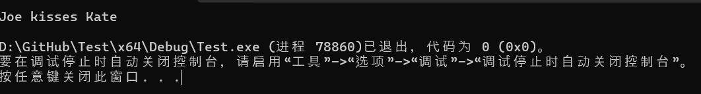

这里有几点需要注意。

首先，`m_name`它已被设为私有的，因此只能由`Person`类的成员（而非公众）访问。

其次，由于我们的类有私有成员，因此它不是聚合，我们不能使用聚合初始化来初始化我们的 Person 对象。作为一种解决方法（直到我们找到解决这个问题的正确方法），我们创建了一个名为的公共成员函数`setName()`，它允许我们为 Person 对象分配一个名称。

第三，由于`kisses()`是成员函数，因此它可以直接访问私有成员`m_name`。但是，您可能会惊讶地发现它也可以直接访问`p.m_name`！这是因为`p`是一个`Person`对象，并且可以访问范围内`kisses()`任何`Person`对象的私有成员！

我们将在运算符重载章节中看到使用此方法的更多示例。

### 结构体和类之间的技术和实际区别

现在我们已经介绍了访问级别，我们终于可以讨论结构体和类之间的技术差异了。

类默认将其成员设置为私有，而结构默认将其成员设置为公共。

…

是的，就是这样。

**注**

<u>说得更严谨些，还有一个小区别——结构体从其他类类型公开继承，而类从其他类类型私有继承。我们将在继承章节中介绍这是什么意思，但这一点实际上无关紧要，因为无论如何你都不应该依赖继承的默认值。</u>

在实践中，我们以不同的方式使用结构和类。

根据经验法则，当满足以下所有条件时，请使用结构体：

- 您拥有一个简单的数据集合，限制访问不会对其带来好处。
- 聚合初始化就足够了。
- 您没有类不变量、设置需求或清理需求。

结构体的几个用途示例：`constexpr` 全局程序数据、点结构体（int 成员的简单集合，不会因设为私有而受益）、用于从函数返回一组数据的结构体。

否则就使用类。

我们希望我们的结构是聚合。因此，如果您使用任何使您的结构成为非聚合的功能，您可能应该使用类（并遵循类的所有最佳实践）。

### **测验**

#### 问题 #1

a) 什么是公共成员？

公共成员是类的一个成员，可以被任何人访问，包括同一类的其他成员和公众。

b) 什么是私人成员？

私有成员是类的一个成员，只能由该类的其他成员访问。

c) 什么是访问说明符？

访问说明符决定谁有权访问该说明符后面的成员。

d) 有多少个访问说明符，它们是什么？

Three. Public, private, and protected.

#### 问题 #2

a) 编写一个名为的类`Point3d`。该类应包含：

- `int`三个类型为`m_x`、`m_y`、 和 的私有成员变量`m_z`；
- 一个名为的公共成员函数`setValues()`允许您设置`m_x`、`m_y`和的值`m_z`。
- 一个名为的公共成员函数`print()`以以下格式打印 Point：<m_x, m_y, m_z>

确保以下程序正确执行：

```cpp
int main()
{
    Point3d point;
    point.setValues(1, 2, 3);

    point.print();
    std::cout << '\n';

    return 0;
}
```

这应该打印：

```
<1，2，3>
```

```c++
#include <iostream>

class Point3d
{
private:
    int m_x {};
    int m_y {};
    int m_z {};

public:
	void setValues(int x, int y, int z)
	{
		m_x = x;
		m_y = y;
		m_z = z;
	}

	void print() const
	{
		std::cout << '<' << m_x << ", " << m_y << ", " << m_z << '>';
	}
};

int main()
{
    Point3d point;
    point.setValues(1, 2, 3);

    point.print();
    std::cout << '\n';

    return 0;
}
```

b) 添加一个名为`isEqual()`Point3d 类的函数。以下代码应该可以正确运行：

```cpp
int main()
{
	Point3d point1{};
	point1.setValues(1, 2, 3);

	Point3d point2{};
	point2.setValues(1, 2, 3);

	std::cout << "point 1 and point 2 are" << (point1.isEqual(point2) ? "" : " not") << " equal\n";

	Point3d point3{};
	point3.setValues(3, 4, 5);

	std::cout << "point 1 and point 3 are" << (point1.isEqual(point3) ? "" : " not") << " equal\n";

	return 0;
}
```

```
point 1 and point 2 are equal
point 1 and point 3 are not equal
```

```c++
#include <iostream>

class Point3d
{
private:
	int m_x {};
	int m_y {};
	int m_z {};

public:
	void setValues(int x, int y, int z)
	{
		m_x = x;
		m_y = y;
		m_z = z;
	}

	void print() const
	{
		std::cout << '<' << m_x << ", " << m_y << ", " << m_z << '>';
	}

	// We can use the fact that access controls work on a per-class basis here
	// to directly access the private members of Point3d parameter p
	bool isEqual(const Point3d& p) const
	{
		return (m_x == p.m_x) && (m_y == p.m_y) && (m_z == p.m_z);
	}
};

int main()
{
	Point3d point1{};
	point1.setValues(1, 2, 3);

	Point3d point2{};
	point2.setValues(1, 2, 3);

	std::cout << "point 1 and point 2 are" << (point1.isEqual(point2) ? "" : " not") << " equal\n";

	Point3d point3{};
	point3.setValues(3, 4, 5);

	std::cout << "point 1 and point 3 are" << (point1.isEqual(point3) ? "" : " not") << " equal\n";

	return 0;
}
```

## 14.6 — 访问函数

在上一课[14.5 -- 公共和私有成员以及访问说明符](https://www.learncpp.com/cpp-tutorial/public-and-private-members-and-access-specifiers/)中，我们讨论了公共和私有访问级别。提醒一下，类通常将其数据成员设为私有，而私有成员不能被公众直接访问。

考虑以下`Date`类：

```cpp
#include <iostream>

class Date
{
private:
    int m_year{ 2020 };
    int m_month{ 10 };
    int m_day{ 14 };

public:
    void print() const
    {
        std::cout << m_year << '/' << m_month << '/' << m_day << '\n';
    }
};

int main()
{
    Date d{};  // create a Date object
    d.print(); // print the date

    return 0;
}
```

虽然此类提供了`print()`打印整个日期的成员函数，但这可能不足以满足用户的需求。例如，如果对象的用户`Date`想要获取年份怎么办？或者将年份更改为其他值？他们无法这样做，因为`m_year`是私有的（因此不能被公众直接访问）。

对于某些类，我们能够获取或设置私有成员变量的值是合适的（在类的功能范围内）。

### 访问函数

**访问函数**是一个简单的公共成员函数，其任务是检索或更改私有成员变量的值。

访问函数有两种类型：getter 和 setter。getter **（**有时也称为**访问器**）是返回私有成员变量值的公共成员函数。setter （有时也称为**修改器**）是设置私有成员变量值的公共成员函数。

Getter 通常设为 const，这样它们就可以在 const 对象和非 const 对象上调用。Setter 应该是非 const，这样它们就可以修改数据成员。

为了便于说明，我们来更新我们的`Date`类，使其拥有一整套 getter 和 setter：

```cpp
#include <iostream>

class Date
{
private:
    int m_year { 2020 };
    int m_month { 10 };
    int m_day { 14 };

public:
    void print()
    {
        std::cout << m_year << '/' << m_month << '/' << m_day << '\n';
    }

    int getYear() const { return m_year; }        // getter for year
    void setYear(int year) { m_year = year; }     // setter for year

    int getMonth() const  { return m_month; }     // getter for month
    void setMonth(int month) { m_month = month; } // setter for month

    int getDay() const { return m_day; }          // getter for day
    void setDay(int day) { m_day = day; }         // setter for day
};

int main()
{
    Date d{};
    d.setYear(2021);
    std::cout << "The year is: " << d.getYear() << '\n';

    return 0;
}
```

这将打印：

```
年份：2021
```

### 访问函数命名

对于访问函数的命名，没有通用的约定。不过，有一些命名约定比其他约定更受欢迎。

- 以“get”和“set”为前缀：

```cpp
int getDay() const { return m_day; }  // getter
void setDay(int day) { m_day = day; } // setter
```

使用“get”和“set”前缀的优点是它可以清楚地表明这些是访问函数（并且调用起来应该很便宜）。

- 无前缀：

```cpp
int day() const { return m_day; }  // getter
void day(int day) { m_day = day; } // setter
```

这种风格更简洁，并且对 getter 和 setter 使用相同的名称（依靠函数重载来区分两者）。C++ 标准库使用此约定。

无前缀约定的缺点是，设置 day 成员的值并不特别明显：

```cpp
d.day(5); // does this look like it's setting the day member to 5?
```

**关键见解**

<u>在私有数据成员前面加上“m_”的一个最佳理由就是为了避免数据成员和 getter 具有相同的名称（C++ 不支持，但其他语言如 Java 却支持）。</u>

- 仅限“set”前缀：

```cpp
int day() const { return m_day; }     // getter
void setDay(int day) { m_day = day; } // setter
```

选择上述哪种方式取决于个人喜好。不过，我们强烈建议为 setter 使用“set”前缀。getter 可以使用“get”前缀，也可以不使用前缀。

**提示:**在你的 setter 上使用“set”前缀，使它们正在改变对象的状态更加明显。

### Getters 应该按值或 const 左值引用返回

Getter 应提供对数据的“只读”访问。因此，最佳实践是它们应通过值（如果复制成员的成本较低）或 const 左值引用（如果复制成员的成本较高）返回。

因为通过引用返回数据成员是一个不平凡的话题，所以我们将在第[14.7 课——返回数据成员引用的成员函数](https://www.learncpp.com/cpp-tutorial/member-functions-returning-references-to-data-members/)中更详细地介绍该主题。

### 访问函数关注点

关于哪些情况下应该使用或避免使用访问函数，存在很多讨论。许多开发人员认为使用访问函数违反了良好的类设计（这个话题很容易写成一本书）。

目前，我们建议采用一种务实的方法。在创建课程时，请考虑以下几点：

- 如果您的类没有不变量并且需要大量访问函数，请考虑使用结构（其数据成员是公共的）并提供对成员的直接访问。
- 优先实现行为或操作，而不是访问函数。例如，`setAlive(bool)`实现一个`kill()`和`revive()`函数，而不是一个 setter。
- 仅在公众合理需要获取或设置单个成员的值的情况下提供访问函数。

### 如果我们要提供数据公共访问功能，为什么要将其设为私有？

很高兴您问到这个问题。我们将在下一课[14.8 中回答这个问题——数据隐藏（封装）的好处](https://www.learncpp.com/cpp-tutorial/the-benefits-of-data-hiding-encapsulation/)。

## 14.7 — 返回数据成员引用的成员函数

在课程[12.12 — 按引用返回和按地址返回](https://www.learncpp.com/cpp-tutorial/return-by-reference-and-return-by-address/)中，我们介绍了按引用返回。特别是，我们指出，“按引用返回的对象在函数返回后必须存在”。这意味着我们不应该按引用返回局部变量，因为在局部变量被销毁后，引用将处于悬空状态。但是，通常可以通过引用返回通过引用传递的函数参数或具有静态持续时间的变量（静态局部变量或全局变量），因为它们通常不会在函数返回后被销毁。

例如：

```cpp
// Takes two std::string objects, returns the one that comes first alphabetically
const std::string& firstAlphabetical(const std::string& a, const std::string& b)
{
	return (a < b) ? a : b; // We can use operator< on std::string to determine which comes first alphabetically
}

int main()
{
	std::string hello { "Hello" };
	std::string world { "World" };

	std::cout << firstAlphabetical(hello, world); // either hello or world will be returned by reference

	return 0;
}
```

成员函数也可以通过引用返回，并且它们遵循与非成员函数相同的规则，以确定何时可以安全地通过引用返回。但是，成员函数还有一种我们需要讨论的情况：通过引用返回数据成员的成员函数。

这在 getter 访问函数中最为常见，因此我们将使用 getter 成员函数来说明此主题。但请注意，此主题适用于任何返回数据成员引用的成员函数。

### 按值返回数据成员可能很昂贵

请考虑以下示例：

```cpp
#include <iostream>
#include <string>

class Employee
{
	std::string m_name{};

public:
	void setName(std::string_view name) { m_name = name; }
	std::string getName() const { return m_name; } //  getter returns by value
};

int main()
{
	Employee joe{};
	joe.setName("Joe");
	std::cout << joe.getName();

	return 0;
}
```

在此示例中，访问函数`getName()`按值std::string m_name返回。

虽然这是最安全的做法，但也意味着`m_name`每次`getName()`调用时都会进行昂贵的复制。由于访问函数往往会被多次调用，因此这通常不是最佳选择。

### **通过左值引用返回数据成员**

成员函数还可以通过（const）左值引用返回数据成员。

数据成员的生命周期与包含它们的对象相同。由于成员函数始终在对象上调用，并且该对象必须存在于调用方的范围内，因此成员函数通过 (const) 左值引用返回数据成员通常是安全的（因为通过引用返回的成员在函数返回时仍存在于调用方的范围内）。

让我们更新上面的例子，以便通过 const 左值引用`getName()`返回：`m_name`

```cpp
#include <iostream>
#include <string>

class Employee
{
	std::string m_name{};

public:
	void setName(std::string_view name) { m_name = name; }
	const std::string& getName() const { return m_name; } //  getter returns by const reference
};

int main()
{
	Employee joe{}; // joe exists until end of function
	joe.setName("Joe");

	std::cout << joe.getName(); // returns joe.m_name by reference

	return 0;
}
```


现在，当`joe.getName()`被调用时，`joe.m_name`将通过引用返回给调用者，从而避免必须进行复制。然后，调用者使用此引用打印`joe.m_name`到控制台。

因为`joe`一直存在于调用者的范围内直到函数结束`main()`，所以对的引用`joe.m_name`也有效相同的持续时间。

**关键见解**

<u>可以返回对数据成员的 (const) 左值引用。函数返回后，隐式对象（包含数据成员）仍存在于调用方的作用域中，因此任何返回的引用都是有效的。</u>

### 返回对数据成员的引用的成员函数的返回类型应该与数据成员的类型匹配

通常，通过引用返回的成员函数的返回类型应该与返回的数据成员的类型相匹配。在上面的例子中，`m_name`是 类型`std::string`，因此`getName()`返回`const std::string&`。

返回 a`std::string_view`需要`std::string_view`每次调用该函数时创建并返回一个临时变量。这毫无必要，效率低下。如果调用者想要 a `std::string_view`，他们可以自己进行转换。

**最佳实践**

<u>返回引用的成员函数应该返回与返回的数据成员相同类型的引用，以避免不必要的转换。</u>

对于 getter，使用`auto`编译器从返回的成员推断返回类型是确保不发生转换的有效方法：

```cpp
#include <iostream>
#include <string>

class Employee
{
	std::string m_name{};

public:
	void setName(std::string_view name) { m_name = name; }
	const auto& getName() const { return m_name; } // uses `auto` to deduce return type from m_name
};

int main()
{
	Employee joe{}; // joe exists until end of function
	joe.setName("Joe");

	std::cout << joe.getName(); // returns joe.m_name by reference

	return 0;
}
```

但是，从文档角度来看，使用`auto`返回类型会掩盖 getter 的返回类型。例如：

```cpp
const auto& getName() const { return m_name; } // uses `auto` to deduce return type from m_name
```

目前还不清楚这个函数实际上返回什么类型的字符串（它可能是`std::string`，，，或者完全`std::string_view`不同`C-style string`的东西！）。

因此，我们通常更喜欢明确的返回类型。

### **右值隐式对象并按引用返回**

有一种情况我们需要小心一点。在上面的例子中，`joe`是一个一直存在到函数结束的左值对象。因此，返回的引用`joe.getName()`也将一直有效直到函数结束。

但是如果我们的隐式对象是右值（例如某个按值返回的函数的返回值）会怎么样？右值对象在创建它们的完整表达式的末尾被销毁。当右值对象被销毁时，对该右值成员的任何引用都将失效并悬空，并且使用此类引用将产生未定义的行为。

因此，对右值对象成员的引用只能在创建右值对象的完整表达式中安全地使用。

**警告**

**右值对象在其创建的完整表达式的末尾被销毁。对右值对象成员的任何引用在该点处都悬空。**

**对右值对象成员的引用只能在创建右值对象的完整表达式中安全地使用。**

让我们探讨一些与此相关的案例：

```cpp
#include <iostream>
#include <string>
#include <string_view>

class Employee
{
	std::string m_name{};

public:
	void setName(std::string_view name) { m_name = name; }
	const std::string& getName() const { return m_name; } //  getter returns by const reference
};

// createEmployee() returns an Employee by value (which means the returned value is an rvalue)
Employee createEmployee(std::string_view name)
{
	Employee e;
	e.setName(name);
	return e;
}

int main()
{
	// Case 1: okay: use returned reference to member of rvalue class object in same expression
	std::cout << createEmployee("Frank").getName();

	// Case 2: bad: save returned reference to member of rvalue class object for use later
	const std::string& ref { createEmployee("Garbo").getName() }; // reference becomes dangling when return value of createEmployee() is destroyed
	std::cout << ref; // undefined behavior

	// Case 3: okay: copy referenced value to local variable for use later
	std::string val { createEmployee("Hans").getName() }; // makes copy of referenced member
	std::cout << val; // okay: val is independent of referenced member

	return 0;
}
```

当`createEmployee()`被调用时，它将`Employee`按值返回一个对象。这个返回的`Employee`对象是一个右值，它将一直存在到包含对 的调用的完整表达式结束为止`createEmployee()`。当该右值对象被销毁时，对该对象成员的任何引用都将变为悬空。

在情况 1 中，我们调用`createEmployee("Frank")`，它返回一个右值`Employee`对象。然后我们调用`getName()`这个右值对象，它返回对 的引用`m_name`。然后立即使用此引用将名称打印到控制台。此时，包含对 的调用的完整表达式`createEmployee("Frank")`结束，并且右值对象及其成员被销毁。由于此后右值对象及其成员均未使用，因此这种情况没有问题。

在情况 2 中，我们遇到了问题。首先，`createEmployee("Garbo")`返回一个右值对象。然后我们调用`getName()`以获取对此右值成员`m_name`的引用。然后使用`m_name`此成员初始化`ref`。此时，包含对的调用的完整表达式`createEmployee("Garbo")`结束，并且右值对象及其成员被销毁。这留下了悬空。因此，当我们在后续语句中使用时，我们正在访问悬空引用，并导致未定义的行为。

**关键见解**

**完整表达式的求值在将该完整表达式用作初始化器*后结束。这允许使用相同类型的右值初始化对象（因为右值在初始化发生后才会被销毁）。***

但是，如果我们想保存一个通过引用返回成员的函数的值以供以后使用，该怎么办？ 我们可以使用返回的引用来初始化非引用局部变量，而不是使用返回的引用来初始化局部引用变量。

在情况 3 中，我们使用返回的引用来初始化非引用局部变量`val`。这将导致被引用的成员被复制到 中`val`。初始化后，`val`独立于引用而存在。因此，当右值对象随后被销毁时，`val`不会受到影响。因此`val`可以在未来的语句中输出而不会出现问题。

### **使用安全地通过引用返回的成员函数**

尽管右值隐式对象存在潜在危险，但 getter 返回的类型通常通过 const 引用而不是通过值进行复制，而成本较高。

鉴于此，让我们讨论如何安全地使用此类函数的返回值。上面例子中的三个案例说明了三个关键点：

- 优先使用立即通过引用返回的成员函数的返回值（如情况 1 所示）。由于这适用于左值和右值对象，因此如果您始终这样做，则可以避免麻烦。
- 不要“保存”返回的引用以供以后使用（如情况 2 所示），除非您确定隐式对象是左值。如果您对右值隐式对象执行此操作，则当您使用现在悬空的引用时将导致未定义的行为。
- 如果您确实需要保留返回的引用以供以后使用，并且不确定隐式对象是否为左值，则使用返回的引用作为非引用局部变量的初始化器，这将把被引用的成员的副本复制到局部变量中（如情况 3 所示）。

**最佳实践**

**倾向于使用立即通过引用返回的成员函数的返回值，以避免在隐式对象是右值时出现悬垂引用的问题。**

### 不要返回对私有数据成员的非 const 引用

因为引用的行为就像被引用的对象一样，所以返回非常量引用的成员函数可以提供对该成员的直接访问（即使该成员是私有的）。

例如：

```cpp
#include <iostream>

class Foo
{
private:
    int m_value{ 4 }; // private member

public:
    int& value() { return m_value; } // returns a non-const reference (don't do this)
};

int main()
{
    Foo f{};                // f.m_value is initialized to default value 4
    f.value() = 5;          // The equivalent of m_value = 5
    std::cout << f.value(); // prints 5

    return 0;
}
```

因为`value()`返回对 的非 const 引用`m_value`，所以调用者可以使用该引用直接访问（并更改 的值）`m_value`。这使得呼叫者能够破坏访问控制系统。

### Const 成员函数不能返回对数据成员的非 const 引用

const 成员函数不允许返回对成员的非 const 引用。这是有道理的——const 成员函数不允许修改对象的状态，也不允许调用会修改对象状态的函数。它不应该做任何可能导致修改对象的事情。

如果允许 const 成员函数返回成员的非 const 引用，则将为调用者提供一种直接修改该成员的方法。这违反了 const 成员函数的本意。

## 14.8 — 数据隐藏（封装）的好处

让我们从一个类比开始。

在现代生活中，我们可以使用许多机械或电子设备。您可以使用遥控器打开/关闭电视。您可以通过踩油门让汽车前进。您可以通过拨动开关打开车灯。所有这些设备都有一个共同点：它们提供一个简单的用户界面（一组按钮、一个踏板、一个开关等），让您可以执行关键操作。

这些设备的实际运行方式对您来说是隐藏的。当您按下遥控器上的按钮时，您不需要知道遥控器如何与电视通信。当您踩下汽车的油门时，您不需要知道内燃机如何使车轮转动。当您拍照时，您不需要知道传感器如何收集光线并将光线转换成像素化图像。

这种接口与实现的分离非常有用，因为它允许我们使用对象而不必了解它们的工作原理——相反，我们只需了解如何与它们交互。这大大降低了使用这些对象的复杂性，并增加了我们能够与之交互的对象数量。

### 类类型中的实现和接口

出于类似的原因，在编程中将接口和实现分开是有用的。但首先，让我们定义一下类类型中接口和实现的含义。

类类型的接口（也称为类**接口**）**定义了类类型**的用户如何与类类型的对象进行交互。由于只有公共成员才能从类类型的外部访问，因此类类型的公共成员构成了其接口。因此，由公共成员组成的接口有时称为**公共接口**。

接口是类的作者和类的用户之间的隐式契约。如果现有接口发生更改，则使用该接口的任何代码都可能中断。因此，确保类类型的接口设计良好且稳定（不要发生太大变化）非常重要。

类类型的实现由使类按预期运行的代码组成。这包括存储数据的成员变量，以及包含程序逻辑和操作成员变量的成员函数体**。**

### 数据隐藏

在编程中，**数据隐藏**（也称为**信息隐藏**或**数据抽象**）是一种通过向用户隐藏（使用户无法访问）程序定义的数据类型的实现来强制接口和实现分离的技术。

在 C++ 类类型中实现数据隐藏很简单。首先，我们确保类类型的数据成员是私有的（以便用户无法直接访问它们）。成员函数主体内的语句已经不能直接供用户访问，因此我们不需要在那里做任何其他事情。接下来，我们确保成员函数是公共的，以便用户可以调用它们。

通过遵循这些规则，我们强制类类型的用户使用公共接口来操作对象，并阻止他们直接访问实现细节。

C++ 中定义的类应该使用数据隐藏。事实上，标准库提供的所有类都这样做。另一方面，结构体不应该使用数据隐藏，因为非公共成员会阻止它们被视为聚合。

以这种方式定义类需要类作者做一些额外的工作。要求类的用户使用公共接口似乎比直接提供对成员变量的公共访问更麻烦。但这样做有很多有用的好处，有助于提高类的可重用性和可维护性。我们将用本课的剩余时间讨论这些好处。

**命名法**

**在编程中，封装是指将数据和用于操作该数据实例的函数捆绑在一起。在 C++ 中，封装了具有数据和用于创建和操作该类对象的公共接口的类类型。由于封装是数据隐藏的先决条件，并且数据隐藏是一项非常重要的技术，因此传统上术语封装通常也包括数据隐藏。**

**在本系列教程中，我们假设所有封装的类都实现了数据隐藏。**

### 数据隐藏使类更易于使用，并降低复杂性

要使用封装类，您不需要知道它是如何实现的。您只需要了解它的接口：哪些成员函数是公开可用的、它们接受哪些参数以及它们返回哪些值。

例如：

```cpp
#include <iostream>
#include <string_view>

int main()
{
    std::string_view sv{ "Hello, world!" };
    std::cout << sv.length();

    return 0;
}
```

在这个简短的程序中，我们看不到实现的细节`std::string_view`。我们看不到 a`std::string_view`有多少个数据成员，它们叫什么名字，它们是什么类型。我们不知道`length()`成员函数如何返回正在查看的字符串的长度。

最棒的是，我们不必知道！程序就可以运行。我们只需要知道如何初始化类型的对象`std::string_view`，以及`length()`成员函数返回什么。

无需关心这些细节可以大大降低程序的复杂性，从而减少错误。这比任何其他原因都更能体现封装的关键优势。

`std::string`想象一下，如果必须理解、`std::vector`或的`std::cout`实现方式才能使用它们，那么 C++ 会变得多么复杂！

### 数据隐藏使我们能够保持不变性

在关于类的入门课程（**14.2 -- 类的介绍）**中，我们介绍了*类不变量*的概念，类不变量是在对象的整个生命周期内必须为真的条件，以使对象保持有效状态。

考虑以下程序：

```cpp
#include <iostream>
#include <string>

struct Employee // members are public by default
{
    std::string name{ "John" };
    char firstInitial{ 'J' }; // should match first initial of name

    void print() const
    {
        std::cout << "Employee " << name << " has first initial " << firstInitial << '\n';
    }
};

int main()
{
    Employee e{}; // defaults to "John" and 'J'
    e.print();

    e.name = "Mark"; // change employee's name to "Mark"
    e.print(); // prints wrong initial

    return 0;
}
```

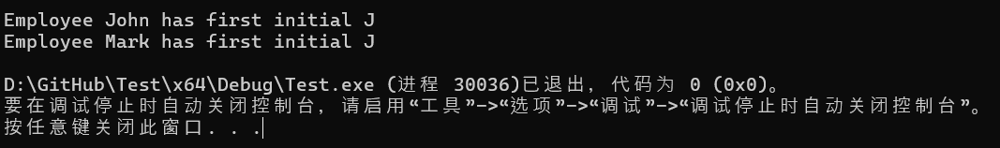

我们的`Employee`结构体有一个类不变量，它`firstInitial`应该始终等于 的第一个字符`name`。如果情况不真实，那么`print()`函数就会出现故障。

由于`name`成员是公共的，因此中的代码`main()`能够设置`e.name`为`"Mark"`，并且`firstInitial`成员不会被更新。我们的不变量被破坏，我们对的第二次调用`print()`无法按预期工作。

当我们让用户直接访问类的实现时，他们就有责任维护所有不变量——他们可能不会这样做（要么做对，要么根本不做）。把这个负担放在用户身上会增加很多复杂性。

让我们重写这个程序，使我们的成员变量私有，并公开一个成员函数来设置员工的名字：

```cpp
#include <iostream>
#include <string>
#include <string_view>

class Employee // members are private by default
{
    std::string m_name{};
    char m_firstInitial{};

public:
    void setName(std::string_view name)
    {
        m_name = name;
        m_firstInitial = name.front(); // use std::string::front() to get first letter of `name`
    }

    void print() const
    {
        std::cout << "Employee " << m_name << " has first initial " << m_firstInitial << '\n';
    }
};

int main()
{
    Employee e{};
    e.setName("John");
    e.print();

    e.setName("Mark");
    e.print();

    return 0;
}
```

该程序现在按预期运行：

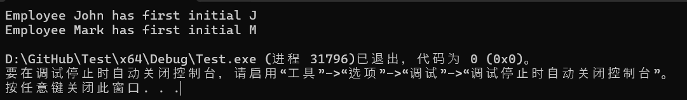

从用户的角度来看，唯一的变化是`name`他们不再直接赋值，而是调用成员函数`setName()`，该函数负责设置`m_name`和`m_firstInitial`。用户无需维护这个不变量！

### 数据隐藏使我们能够更好地检测（和处理）错误

在上面的程序中，`m_firstInitial`必须与 的第一个字符匹配的不变量`m_name`存在，因为`m_firstInitial`独立于 而存在`m_name`。我们可以通过将数据成员替换`m_firstInitial`为返回首字母的成员函数来删除这个特定的不变量：

```c++
#include <iostream>
#include <string>

class Employee
{
    std::string m_name{ "John" };

public:
    void setName(std::string_view name)
    {
        m_name = name;
    }

    // use std::string::front() to get first letter of `m_name`
    char firstInitial() const { return m_name.front(); }

    void print() const
    {
        std::cout << "Employee " << m_name << " has first initial " << firstInitial() << '\n';
    }
};

int main()
{
    Employee e{}; // defaults to "John"
    e.setName("Mark");
    e.print();

    return 0;
}
```

但是，这个程序还有另一个类不变量。花点时间看看你能否确定它是什么。我们在这里等着，看看这幅画是否干了……

答案是`m_name`不应该是空字符串（因为每个 都`Employee`应该有一个名称）。如果`m_name`设置为空字符串，不会立即发生任何不好的事情。但如果`firstInitial()`随后调用 ，`front()`的成员`std::string`将尝试获取空字符串的第一个字母，这会导致未定义的行为。

理想情况下，我们希望防止`m_name`其变为空。

如果用户对该`m_name`成员具有公共访问权限，他们只需设置`m_name = ""`，我们就无法阻止这种情况发生。

但是，由于我们强制用户`m_name`通过公共接口函数进行设置`setName()`，因此我们可以`setName()`验证用户是否传入了有效名称。如果名称非空，则可以将其分配给`m_name`。如果名称为空字符串，则可以执行任意数量的响应：

- 忽略将名称设置为“”的请求并返回给调用者。
- 断言。
- 抛出异常。
- 做 hokey pokey。等等，不是这个。

这里的重点是，我们可以发现滥用行为，然后以我们认为最合适的方式处理。如何最有效地处理此类案件是另一天的话题。

数据隐藏使得在不破坏现有程序的情况下更改实现细节成为可能

考虑这个简单的例子：

```cpp
#include <iostream>

struct Something
{
    int value1 {};
    int value2 {};
    int value3 {};
};

int main()
{
    Something something;
    something.value1 = 5;
    std::cout << something.value1 << '\n';
}
```

虽然这个程序运行良好，但是如果我们决定改变类的实现细节，会发生什么呢？就像这样？

```cpp
#include <iostream>

struct Something
{
    int value[3] {}; // uses an array of 3 values
};

int main()
{
    Something something;
    something.value1 = 5;
    std::cout << something.value1 << '\n';
}
```

我们还没有讲到数组，不过不用担心。重点是这个程序不再能编译，因为命名的成员`value1`不再存在，而 中的语句`main()`仍在使用该标识符。

数据隐藏使我们能够改变类的实现方式，而不会破坏使用它们的程序。

下面是该类的原始版本的封装版本，使用函数进行访问`m_value1`：

```cpp
#include <iostream>

class Something
{
private:
    int m_value1 {};
    int m_value2 {};
    int m_value3 {};

public:
    void setValue1(int value) { m_value1 = value; }
    int getValue1() const { return m_value1; }
};

int main()
{
    Something something;
    something.setValue1(5);
    std::cout << something.getValue1() << '\n';
}
```

现在，让我们将类的实现改回数组：

```cpp
#include <iostream>

class Something
{
private:
    int m_value[3]; // note: we changed the implementation of this class!

public:
    // We have to update any member functions to reflect the new implementation
    void setValue1(int value) { m_value[0] = value; }
    int getValue1() const { return m_value[0]; }
};

int main()
{
    // But our programs that use the class do not need to be updated!
    Something something;
    something.setValue1(5);
    std::cout << something.getValue1() << '\n';
}
```

因为我们没有改变类的公共接口，所以使用该接口的程序根本不需要改变，并且仍然具有相同的功能。

类似地，如果侏儒晚上潜入你家，用不同的（但兼容的）技术替换你的电视遥控器的内部结构，你可能甚至都不会注意到！

### 优先使用非成员函数而不是成员函数

在 C++ 中，如果某个函数可以实现为非成员函数，则考虑将其实现为非成员函数，而不是成员函数。

这有许多好处：

- 非成员函数不是类接口的一部分。因此，类的接口将更小、更直观，使类更易于理解。
- 非成员函数强制封装，因为此类函数必须通过类的公共接口工作。不会因为方便而直接访问实现。
- 在对类的实现进行更改时，不需要考虑非成员函数（只要接口不会以不兼容的方式更改）。
- 非成员函数往往更容易调试。
- 包含应用程序特定数据和逻辑的非成员函数可以与类的可重用部分分离。

**最佳实践**

**尽可能优先将函数实现为非成员（尤其是包含应用程序特定数据或逻辑的函数）。**

以下是三个类似的例子，按从最差到最好的顺序排列：

```cpp
#include <iostream>
#include <string>

class Yogurt
{
    std::string m_flavor{ "vanilla" };

public:
    void setFlavor(std::string_view flavor)
    {
        m_flavor = flavor;
    }

    const std::string& getFlavor() const { return m_flavor; }

    // Worst: member function print() uses direct access to m_flavor when getter exists
    void print() const
    {
        std::cout << "The yogurt has flavor " << m_flavor << '\n';
    }
};

int main()
{
    Yogurt y{};
    y.setFlavor("cherry");
    y.print();

    return 0;
}
```

以上是最糟糕的版本。当风味的 getter 已存在时，`print()`成员函数直接访问`m_flavor`。如果类实现被更新，`print()`也可能会进行修改。`print()`打印的字符串是特定于应用程序的（使用此类的另一个应用程序可能想要打印其他内容，这将需要克隆或修改类）。

```cpp
#include <iostream>
#include <string>

class Yogurt
{
    std::string m_flavor{ "vanilla" };

public:
    void setFlavor(std::string_view flavor)
    {
        m_flavor = flavor;
    }

    const std::string& getFlavor() const { return m_flavor; }

    // Better: member function print() has no direct access to members
    void print(std::string_view prefix) const
    {
        std::cout << prefix << ' ' << getFlavor() << '\n';
    }
};

int main()
{
    Yogurt y{};
    y.setFlavor("cherry");
    y.print("The yogurt has flavor");

    return 0;
}
```

上面的版本更好，但仍然不是很好。`print()`仍然是一个成员函数，但至少它现在不直接访问任何数据成员。如果类实现被更新，`print()`将需要被评估以确定是否需要更新（但不会）。函数的前缀`print()`现在是参数化的，这允许我们将前缀移到非成员函数中`main()`。但该函数仍然对如何打印内容施加限制（例如，它总是打印为前缀、空格、风味、换行符）。如果这不能满足给定应用程序的需求，则需要添加另一个函数。

```cpp
#include <iostream>
#include <string>

class Yogurt
{
    std::string m_flavor{ "vanilla" };

public:
    void setFlavor(std::string_view flavor)
    {
        m_flavor = flavor;
    }

    const std::string& getFlavor() const { return m_flavor; }
};

// Best: non-member function print() is not part of the class interface
void print(const Yogurt& y)
{
        std::cout << "The yogurt has flavor " << y.getFlavor() << '\n';
}

int main()
{
    Yogurt y{};
    y.setFlavor("cherry");
    print(y);

    return 0;
}
```

上面的版本是最好的。`print()`现在是非成员函数。它不直接访问任何成员。如果类实现发生变化，则`print()`根本不需要进行评估。此外，每个应用程序都可以提供自己的`print()`函数，该函数可以准确地打印该应用程序想要的内容。

### 类成员声明的顺序

在类之外编写代码时，我们需要先声明变量和函数，然后才能使用它们。然而，在类内部，不存在这种限制。如第**[14.3 课——成员函数]**中所述，我们可以按任意顺序排列成员。

那么我们该如何排序呢？

这里有两种观点：

- 首先列出您的私有成员，然后列出您的公共成员函数。这遵循了传统的先声明后使用风格。任何查看您的类代码的人都会看到您在使用数据成员之前是如何定义的，这可以使阅读和理解实现细节变得更容易。
- 首先列出公共成员，然后将私有成员放在底部。因为使用你的类的人对公共接口感兴趣，所以将公共成员放在最前面会使他们需要的信息放在最上面，而将实现细节（最不重要）放在最后。

在现代 C++ 中，通常更推荐第二种方法（公共成员优先），尤其是对于与其他开发人员共享的代码。

**最佳实践**

**首先声明公共成员，然后声明受保护成员，最后声明私有成员。这样可以突出公共接口，而不再强调实现细节。**

**注**

**本网站上的大部分示例使用的声明顺序与建议的顺序相反。这在一定程度上是历史原因，但我们也发现，在学习语言机制时，这种顺序更为直观，因为我们专注于实现细节并剖析事物的工作原理。**

**[Google C++ 风格指南](https://google.github.io/styleguide/cppguide.html#Declaration_Order)建议遵循以下命令：**

- **类型和类型别名（typedef、using、enum、嵌套结构和类以及友元类型）**
- **静态常量**
- **工厂函数**
- **构造函数和赋值运算符**
- **析构函数**
- **所有其他函数（静态和非静态成员函数以及友元函数）**
- **数据成员（静态和非静态）**

## 14.9 — 构造函数简介

当类类型是聚合时，我们可以使用聚合初始化来直接初始化类类型：

```c++
struct Foo // Foo is an aggregate
{
    int x {};
    int y {};
};

int main()
{
    Foo foo { 6, 7 }; // uses aggregate initialization

    return 0;
}
```

聚合初始化按成员进行初始化（成员按定义顺序初始化）。因此，`foo`在上面的例子中，当 被实例化时，`foo.x`被初始化为`6`，`foo.y`被初始化为`7`。

但是，一旦我们将任何成员变量设为私有（以隐藏我们的数据），我们的类类型就不再是聚合（因为聚合不能有私有成员）。这意味着我们不再能够使用聚合初始化：

```cpp
class Foo // Foo is not an aggregate (has private members)
{
    int m_x {};
    int m_y {};
};

int main()
{
    Foo foo { 6, 7 }; // compile error: can not use aggregate initialization

    return 0;
}
```

不允许通过聚合初始化来初始化具有私有成员的类类型是有道理的，原因如下：

- 聚合初始化需要了解类的实现（因为您必须知道成员是什么，以及它们的定义顺序），当我们隐藏数据成员时，我们有意避免这种情况。
- 如果我们的类具有某种不变量，我们将依赖用户以保留不变量的方式初始化该类。

那么我们如何初始化具有私有成员变量的类呢？编译器为上例给出的错误消息提供了一条线索：“错误：没有匹配的构造函数来初始化‘Foo’”

我们必须需要一个匹配的构造函数。但是那到底是什么呢？

### 构造函数

**构造函数**是一个特殊的成员函数，在创建非聚合类类型对象后自动调用。

当定义非聚合类类型对象时，编译器会查看是否可以找到与调用者提供的初始化值（如果有）匹配的可访问构造函数。

- 如果找到可访问的匹配构造函数，则为该对象分配内存，然后调用构造函数。
- 如果找不到可访问的匹配构造函数，则会产生编译错误。

**关键见解**

**许多新程序员对构造函数是否创建对象感到困惑。构造函数不会创建对象——编译器在调用构造函数之前为对象设置内存分配。然后在未初始化的对象上调用构造函数。**

**但是，如果无法为一组初始化器找到匹配的构造函数，则编译器将出错。因此，虽然构造函数不会创建对象，但缺少匹配的构造函数将阻止创建对象。**

除了确定如何创建对象之外，构造函数通常还执行两个功能：

- 它们通常执行任何成员变量的初始化（通过成员初始化列表）
- 它们可能执行其他设置功能（通过构造函数主体中的语句）。这可能包括诸如检查初始化值的错误、打开文件或数据库等……

构造函数执行完毕后，我们说对象已经“构造完成”，并且对象现在应该处于一致、可用的状态。

请注意，聚合不允许有构造函数 - 因此，如果向聚合添加构造函数，它就不再是聚合。

### 命名构造函数

与普通成员函数不同，构造函数对于其命名有特定的规则：

- 构造函数必须与类同名（大小写相同）。对于模板类，此名称不包括模板参数。
- 构造函数没有返回类型（甚至没有`void`）。

由于构造函数通常是类接口的一部分，所以它们通常是公共的。

### 基本构造函数示例

让我们在上面的示例中添加一个基本的构造函数：

```cpp
#include <iostream>

class Foo
{
private:
    int m_x {};
    int m_y {};

public:
    Foo(int x, int y) // here's our constructor function that takes two initializers
    {
        std::cout << "Foo(" << x << ", " << y << ") constructed\n";
    }

    void print() const
    {
        std::cout << "Foo(" << m_x << ", " << m_y << ")\n";
    }
};

int main()
{
    Foo foo{ 6, 7 }; // calls Foo(int, int) constructor
    foo.print();

    return 0;
}
```

该程序现在将编译并产生结果：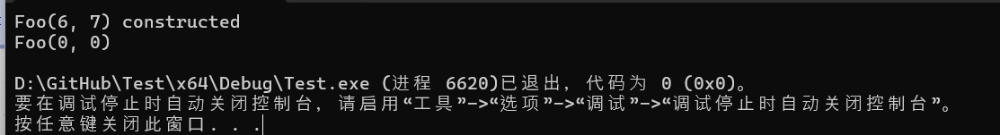

当编译器看到该定义时`Foo foo{ 6, 7 }`，它会寻找一个`Foo`可以接受两个`int`参数的匹配构造函数。`Foo(int, int)`如果匹配，则编译器将允许该定义。

在运行时，当`foo`实例化时，为`foo`分配内存，然后`Foo(int, int)`调用构造函数，将参数`x`初始化为`6`，将参数`y`初始化为`7`。然后执行构造函数体并打印`Foo(6, 7) constructed`。

当我们调用`print()`成员函数时，您会注意到成员`m_x`和`m_y`的值为 0。这是因为虽然我们的`Foo(int, int)`构造函数被调用，但它实际上并没有初始化成员。我们将在下一课中展示如何做到这一点。

### 构造函数参数的隐式转换

在课程[10.1 -- 隐式类型转换](https://www.learncpp.com/cpp-tutorial/implicit-type-conversion/)中，我们注意到编译器将在函数调用中执行参数的隐式转换（如果需要），以匹配参数为不同类型的函数定义：

```cpp
void foo(int, int)
{
}

int main()
{
    foo('a', true); // will match foo(int, int)

    return 0;
}
```

对于构造函数来说这没有什么不同：`Foo(int, int)`构造函数将匹配任何参数可以隐式转换为的调用`int`：

```cpp
class Foo
{
public:
    Foo(int x, int y)
    {
    }
};

int main()
{
    Foo foo{ 'a', true }; // will match Foo(int, int) constructor

    return 0;
}
```

### 构造函数不应该是 const

构造函数需要能够初始化正在构造的对象 - 因此，构造函数不能是 const。

```cpp
#include <iostream>

class Something
{
private:
    int m_x{};

public:
    Something() // constructors must be non-const
    {
        m_x = 5; // okay to modify members in non-const constructor
    }

    int getX() const { return m_x; } // const
};

int main()
{
    const Something s{}; // const object, implicitly invokes (non-const) constructor

    std::cout << s.getX(); // prints 5

    return 0;
}
```

通常，不能在 const 对象上调用非 const 成员函数。但是，由于构造函数是隐式调用的，因此可以在 const 对象上调用非 const 构造函数。

### 构造函数与 setter

构造函数用于在实例化时初始化整个对象。设置器用于为现有对象的单个成员赋值。

## 14.10 — 构造函数成员初始化列表

### 通过成员初始化列表进行成员初始化

要让构造函数初始化成员，我们使用**成员初始化列表**（通常称为“成员初始化列表”）。不要将其与用于使用值列表初始化聚合的类似名称的“初始化列表”混淆。

成员初始化列表最好通过示例来学习。在下面的例子中，我们的`Foo(int, int)`构造函数已更新为使用成员初始化列表来初始化`m_x`、 和`m_y`：

```cpp
#include <iostream>

class Foo
{
private:
    int m_x {};
    int m_y {};

public:
    Foo(int x, int y)
        : m_x { x }, m_y { y } // here's our member initialization list
    {
        std::cout << "Foo(" << x << ", " << y << ") constructed\n";
    }

    void print() const
    {
        std::cout << "Foo(" << m_x << ", " << m_y << ")\n";
    }
};

int main()
{
    Foo foo{ 6, 7 };
    foo.print();

    return 0;
}
```

成员初始化列表在构造函数参数之后定义。它以冒号 (:) 开头，然后列出要初始化的每个成员以及该变量的初始化值，以逗号分隔。您必须在此处使用直接形式的初始化（最好使用大括号，但圆括号也可以）——使用复制初始化（带等号）在这里不起作用。另请注意，成员初始化列表不以分号结尾。

该程序产生以下输出：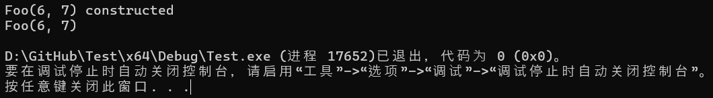

实例化时`foo`，初始化列表中的成员将使用指定的初始化值进行初始化。在这种情况下，成员初始化列表将初始化`m_x`为 的值`x`（即`6`），并将`m_y`的值`y`（即`7`）初始化为 。然后运行构造函数的主体。

当`print()`调用成员函数时，可以看到`m_x`仍然有值`6`， 并且`m_y`仍然有值`7`。

### 成员初始化列表格式

C++ 提供了很大的自由度来按照您的喜好格式化成员初始化列表，因为它不关心您将冒号、逗号或空格放在哪里。

以下样式均有效（并且您很可能在实践中看到所有三种样式）：

```cpp
Foo(int x, int y) : m_x { x }, m_y { y }
{
}
```

```cpp
Foo(int x, int y) :
    m_x { x },
    m_y { y }
{
}
```

```cpp
Foo(int x, int y)
    : m_x { x }
    , m_y { y }
{
}
```

我们的建议是使用上面的第三种样式：

- 将冒号放在构造函数名称后面的行上，因为这将成员初始化列表与函数原型干净地分开。
- 缩进成员初始化列表，以便更容易看到函数名称。

如果成员初始化列表很短/很简单，则所有初始化程序都可以放在一行：

```cpp
Foo(int x, int y)
    : m_x { x }, m_y { y }
{
}
```

否则（或者如果您愿意），每个成员和初始化器对可以放在单独的行上（以逗号开头以保持一致性）：

```cpp
Foo(int x, int y)
    : m_x { x }
    , m_y { y }
{
}
```

### 成员初始化顺序

因为 C++ 标准是这么说的，成员初始化列表中的成员总是按照它们在类内部定义的顺序进行初始化（而不是按照它们在成员初始化列表中定义的顺序）。

在上面的例子中，因为在类定义`m_x`之前 `m_y` 定义，所以将首先 `m_x` 被初始化（即使它没有在成员初始化列表中首先列出）。

因为我们直观地期望变量从左到右初始化，这可能会导致发生细微的错误。请考虑以下示例：

```cpp
#include <algorithm> // for std::max
#include <iostream>

class Foo
{
private:
    int m_x{};
    int m_y{};

public:
    Foo(int x, int y)
        : m_y{ std::max(x, y) }, m_x{ m_y } // issue on this line
    {
    }

    void print() const
    {
        std::cout << "Foo(" << m_x << ", " << m_y << ")\n";
    }
};

int main()
{
    Foo foo{ 6, 7 };
    foo.print();

    return 0;
}
```

在上面的例子中，我们的意图是计算传入的初始化值中较大的一个（通过`std::max(x, y)`，然后使用该值初始化`m_x`和`m_y`。然而，在作者的机器上，打印的结果如下：

```cpp
Foo(-858993460, 7)
```

发生了什么？尽管`m_y`在成员初始化列表中排在第一位，但由于`m_x`在类中首先定义，因此`m_x`首先初始化。并将`m_y`初始化为尚未初始化`m_x`的值。最后，`m_y`初始化为初始化值中较大的一个。

为了防止此类错误，成员初始化列表中的成员应按照其在类中定义的顺序列出。如果成员初始化顺序错误，某些编译器会发出警告。

**最佳实践**

**成员初始化列表中的成员变量应按照它们在类中定义的顺序列出。**

避免使用其他成员的值初始化成员也是一个好主意（如果可能的话）。这样，即使您在初始化顺序上犯了错误，也不会有什么问题，因为初始化值之间没有依赖关系。

### 成员初始化列表与默认成员初始化

成员可以通过几种不同的方式初始化：

- 如果成员在成员初始化列表中列出，则使用该初始化值
- 否则，如果成员具有默认成员初始化器，则使用该初始化值
- 否则，该成员将默认初始化。

这意味着，如果成员既具有默认成员初始化器，又在构造函数的成员初始化器列表中列出，则成员初始化器列表值优先。

下面是展示所有三种初始化方法的示例：

```cpp
#include <iostream>

class Foo
{
private:
    int m_x{};    // default member initializer (will be ignored)
    int m_y{ 2 }; // default member initializer (will be used)
    int m_z;      // no initializer

public:
    Foo(int x)
        : m_x{ x } // member initializer list
    {
        std::cout << "Foo constructed\n";
    }

    void print() const
    {
        std::cout << "Foo(" << m_x << ", " << m_y << ", " << m_z << ")\n";
    }
};

int main()
{
    Foo foo{ 6 };
    foo.print();

    return 0;
}
```

在作者的机器上，输出如下：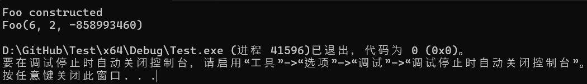

事情是这样的。`foo`构造时，只`m_x`出现在成员初始化列表中，因此`m_x`首先初始化为`6`。`m_y`不在成员初始化列表中，但它有一个默认成员初始化，因此它被初始化为`2`。`m_z`既不在成员初始化列表中，也没有默认成员初始化，因此它是默认初始化的（对于基本类型来说，这意味着它未初始化）。因此，当我们打印的值时`m_z`，我们得到未定义的行为。

### 构造函数体

构造函数的函数体通常留空。这是因为我们主要使用构造函数进行初始化，这是通过成员初始化列表完成的。如果我们只需要这样做，那么我们就不需要在构造函数的函数体中添加任何语句。

但是，由于构造函数主体中的语句在成员初始化列表执行后执行，因此我们可以添加语句来执行所需的任何其他设置任务。在上面的示例中，我们向控制台打印了一些内容以显示构造函数已执行，但我们可以执行其他操作，例如打开文件或数据库、分配内存等……

新的程序员有时会使用构造函数的主体为成员赋值：

```cpp
#include <iostream>

class Foo
{
private:
    int m_x{ 0 };
    int m_y{ 1 };

public:
    Foo(int x, int y)
    {
        m_x = x; // incorrect: this is an assignment, not an initialization
        m_y = y; // incorrect: this is an assignment, not an initialization
    }

    void print() const
    {
        std::cout << "Foo(" << m_x << ", " << m_y << ")\n";
    }
};

int main()
{
    Foo foo{ 6, 7 };
    foo.print();

    return 0;
}
```

虽然在这个简单的情况下这将产生预期的结果，但如果需要初始化成员（例如对于 const 或引用的数据成员），赋值将不起作用。

**最佳实践**

**最好使用成员初始化列表来初始化成员，而不是在构造函数主体中分配值。**

### 检测并处理构造函数的无效参数

考虑以下 Fraction 类：

```cpp
class Fraction
{
private:
    int m_numerator {};
    int m_denominator {};

public:
    Fraction(int numerator, int denominator):
        m_numerator { numerator }, m_denominator { denominator }
    {
    }
};
```

因为分数是分子除以分母，所以分数的分母不能为零（否则我们会得到除以零的结果，这在数学上是未定义的）。换句话说，此类具有不变量，`m_denominator`不能为`0`。

那么当用户尝试创建分母为零的分数（例如`Fraction f { 1, 0 };`）时，我们该怎么办？

在成员初始化列表中，我们用于检测和处理错误的工具非常有限。我们可以使用条件运算符来检测错误，但接下来该怎么办呢？

```cpp
class Fraction
{
private:
    int m_numerator {};
    int m_denominator {};

public:
    Fraction(int numerator, int denominator):
        m_numerator { numerator }, m_denominator { denominator != 0.0 ? denominator : ??? } // what do we do here?
    {
    }
};
```

我们可以将分母更改为有效值，但这样用户就会得到`Fraction`不包含他们要求的值的结果，而且我们无法通知他们我们做了一些意想不到的事情。因此，我们通常不会尝试在成员初始化列表中进行任何类型的验证——我们只会使用传入的值初始化成员，然后尝试处理这种情况。

在构造函数主体中，我们可以使用语句，这样我们就有更多选项来检测和处理错误。这是一个很好的地方，`assert`或者`static_assert`传入的参数在语义上是有效的，但实际上并不能处理生产构建中的运行时错误。

当构造函数无法构造语义上有效的对象时，我们说它失败了。

### 当构造函数失败时（前奏）

在课程**[9.4 — 检测和处理错误]**中，我们介绍了错误处理的主题，并讨论了一些处理函数因发生错误而无法继续执行的情况的选项。由于构造函数是函数，因此它们容易受到相同问题的影响。

在那节课中，我们提出了 4 种处理此类错误的策略：

- 解决函数内的错误。
- 将错误传回给调用者处理。
- 停止程序。
- 抛出异常。

在大多数情况下，我们没有足够的信息来完全在构造函数中解决此类问题。因此修复该问题通常不是一个选择。

使用非成员和非特殊成员函数，我们可以将错误传回给调用者处理。但构造函数没有返回值，所以我们没有很好的方法来做到这一点。在某些情况下，我们可以添加一个`isValid()`成员函数（或对的重载转换`bool`），返回对象当前是否处于有效状态。例如，函数`isValid()`会在何时``m_denominator != 0.0``返回`true`。但这意味着调用者必须记住在每次创建新的 Fraction 时实际调用该函数。并且拥有可访问的语义无效对象可能会导致错误。所以虽然这总比没有好，但它并不是一个很好的选择。

在某些类型的程序中，我们可以暂停整个程序，让用户使用正确的输入重新运行该程序……但在大多数情况下，这是不可接受的。所以可能不会。

剩下的就是抛出异常。异常会完全中止构造过程，这意味着用户永远无法访问语义无效的对象。因此在大多数情况下，抛出异常是这些情况下最好的选择。

**关键见解**

**当构造函数失败（且无法恢复）时，抛出异常通常是最好的做法。我们将在第[27.5 课——异常、类和继承]和[第 27.7 课——函数 try 块]中进一步讨论这一点。**

**注**

**目前，我们通常假设我们的类对象的构造成功创建了一个语义有效的对象。**

对于高级读者

如果无法或不需要异常（因为您决定不使用它们，或者因为您还没有了解它们），那么还有另一个合理的选择。不要让用户直接创建类，而是提供一个函数，该函数要么返回类的实例，要么返回指示失败的内容。

在以下示例中，我们的`createFraction()`函数返回一个`std::optional<Fraction>`可选包含有效 的`Fraction`。如果包含，那么我们可以使用该分数。如果不是，那么调用者可以检测到并处理它。我们将`std::optional`在课程[12.15 中介绍 std::optional]和课程 15.8 中的友元函数 中介绍[友元](https://www.learncpp.com/cpp-tutorial/friend-non-member-functions/)函数。

```cpp
#include <iostream>
#include <optional>

class Fraction
{
private:
    int m_numerator { 0 };
    int m_denominator { 1 };

    // private constructor can't be called by public
    Fraction(int numerator, int denominator):
        m_numerator { numerator }, m_denominator { denominator }
    {
    }

public:
    // Allow this function to access private members
    friend std::optional<Fraction> createFraction(int numerator, int denominator);
};

std::optional<Fraction> createFraction(int numerator, int denominator)
{
    if (denominator == 0.0)
        return {};

    return Fraction{numerator, denominator};
}

int main()
{
    auto f1 { createFraction(0, 1) };
    if (f1)
    {
        std::cout << "Fraction created\n";
    }

    auto f2 { createFraction(0, 0) };
    if (!f2)
    {
        std::cout << "Bad fraction\n";
    }
}
```

### **测验**

#### 问题 #1

编写一个名为 Ball 的类。Ball 应该有两个私有成员变量，一个用于保存颜色，一个用于保存半径。还编写一个函数来打印出球的颜色和半径。

以下示例程序应该可以编译：

```cpp
int main()
{
	Ball blue{ "blue", 10.0 };
	print(blue);

	Ball red{ "red", 12.0 };
	print(red);

	return 0;
}
```

```c++
#include <iostream>
#include <string>
#include <string_view>

class Ball
{
private:
	std::string m_color{ "none" };
	double m_radius{ 0.0 };

public:
	Ball(std::string_view color, double radius)
		: m_color{ color }
		, m_radius{ radius }
	{
	}

	const std::string& getColor() const { return m_color; }
	double getRadius() const { return m_radius; }
};

void print(const Ball& ball)
{
    std::cout << "Ball(" << ball.getColor() << ", " << ball.getRadius() << ")\n";
}

int main()
{
	Ball blue{ "blue", 10.0 };
	print(blue);

	Ball red{ "red", 12.0 };
	print(red);

	return 0;
}
```

并产生结果：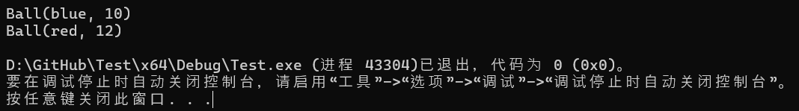

#### 问题 #2

为什么我们要创建`print()`非成员函数而不是成员函数？

其基本原理在第[14.8 课“数据隐藏（封装）的好处”](https://www.learncpp.com/cpp-tutorial/the-benefits-of-data-hiding-encapsulation/#prefer-non-member-functions)中给出。

#### 问题 #3

为什么我们要制作`m_color`一个`std::string`而不是一个`std::string_view`？

在这个特定的例子中，这并不重要（因为我们的颜色参数是 C 风格的字符串文字，它不会超出范围）。

但从概念上讲，我们希望我们的`Ball`类成为传入颜色的所有者。如果`m_color`是`std::string_view`，则为颜色参数传入一个临时对象（例如，`std::string`从函数返回的）将`m_color`在临时颜色参数被销毁时处于悬空状态。

## 14.11 — 默认构造函数和默认参数

**默认构造函数**是不接受任何参数的构造函数。通常，这是一个已定义且无参数的构造函数。

以下是具有默认构造函数的类的示例：

```cpp
#include <iostream>

class Foo
{
public:
    Foo() // default constructor
    {
        std::cout << "Foo default constructed\n";
    }
};

int main()
{
    Foo foo{}; // No initialization values, calls Foo's default constructor

    return 0;
}
```

当上述程序运行时，`Foo`将创建一个类型的对象。由于没有提供初始化值，因此`Foo()`将调用默认构造函数，并打印：

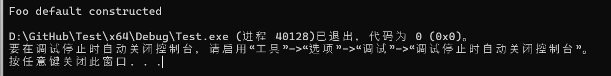

### 类类型的值初始化与默认初始化

如果类类型具有默认构造函数，则值初始化和默认初始化都将调用默认构造函数。 因此，对于这样的类（例如`Foo`上例中的类），以下内容本质上是等效的：

```cpp
Foo foo{}; // value initialization, calls Foo() default constructor
Foo foo2;  // default initialization, calls Foo() default constructor
```

但是，正如我们在第[13.9 课——默认成员初始化]中已经讲过的那样，值初始化对于聚合来说更安全。由于很难判断类类型是聚合还是非聚合，因此更安全的做法是对所有东西都使用值初始化，而不必为此担心。

**最佳实践**

**对于所有类类型，优先使用值初始化而不是默认初始化。**

### 具有默认参数的构造函数

与所有函数一样，构造函数最右边的参数可以有默认参数。

例如：

```cpp
#include <iostream>

class Foo
{
private:
    int m_x { };
    int m_y { };

public:
    Foo(int x=0, int y=0) // has default arguments
        : m_x { x }
        , m_y { y }
    {
        std::cout << "Foo(" << m_x << ", " << m_y << ") constructed\n";
    }
};

int main()
{
    Foo foo1{};     // calls Foo(int, int) constructor using default arguments
    Foo foo2{6, 7}; // calls Foo(int, int) constructor

    return 0;
}
```

这将打印：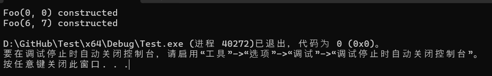

如果构造函数中的所有参数都有默认参数，则该构造函数为默认构造函数（因为它可以在没有参数的情况下调用）。

### 重载构造函数

因为构造函数是函数，所以它们可以重载。也就是说，我们可以有多个构造函数，以便用不同的方式构造对象：

```cpp
#include <iostream>

class Foo
{
private:
    int m_x {};
    int m_y {};

public:
    Foo() // default constructor
    {
        std::cout << "Foo constructed\n";
    }

    Foo(int x, int y) // non-default constructor
        : m_x { x }, m_y { y }
    {
        std::cout << "Foo(" << m_x << ", " << m_y << ") constructed\n";
    }
};

int main()
{
    Foo foo1{};     // Calls Foo() constructor
    Foo foo2{6, 7}; // Calls Foo(int, int) constructor

    return 0;
}
```

上述内容的必然结果是，一个类应该只有一个默认构造函数。如果提供了多个默认构造函数，则编译器将无法区分应该使用哪个：

```cpp
#include <iostream>

class Foo
{
private:
    int m_x {};
    int m_y {};

public:
    Foo() // default constructor
    {
        std::cout << "Foo constructed\n";
    }

    Foo(int x=1, int y=2) // default constructor
        : m_x { x }, m_y { y }
    {
        std::cout << "Foo(" << m_x << ", " << m_y << ") constructed\n";
    }
};

int main()
{
    Foo foo{}; // compile error: ambiguous constructor function call

    return 0;
}
```

在上面的例子中，我们实例化时`foo`没有参数，因此编译器将寻找默认构造函数。它会找到两个，但无法区分应该使用哪个构造函数。这将导致编译错误。

### 隐式默认构造函数

如果非聚合类类型对象没有用户声明的构造函数，则编译器将生成一个公共默认构造函数（以便该类可以进行值或默认初始化）。此构造函数称为**隐式默认构造函数**。

请考虑以下示例：

```cpp
#include <iostream>

class Foo
{
private:
    int m_x{};
    int m_y{};

    // Note: no constructors declared
};

int main()
{
    Foo foo{};

    return 0;
}
```

此类没有用户声明的构造函数，因此编译器将为我们生成一个隐式默认构造函数。该构造函数将用于实例化`foo{}`。

隐式默认构造函数相当于没有参数、没有成员初始化列表、构造函数主体中没有语句的构造函数。换句话说，对于上述`Foo`类，编译器会生成以下内容：

```cpp
public:
    Foo() // implicitly generated default constructor
    {
    }
```

隐式默认构造函数主要用于类没有数据成员的情况。如果类有数据成员，我们可能希望使用用户提供的值来初始化它们，而隐式默认构造函数不足以满足这一要求。

### 用于`= default`生成显式默认的默认构造函数

如果我们想要编写一个与隐式生成的默认构造函数等效的默认构造函数，我们可以告诉编译器为我们生成一个默认构造函数。此构造函数称为**显式默认的默认构造函数**，可以使用以下`= default`语法生成：

```cpp
#include <iostream>

class Foo
{
private:
    int m_x {};
    int m_y {};

public:
    Foo() = default; // generates an explicitly defaulted default constructor

    Foo(int x, int y)
        : m_x { x }, m_y { y }
    {
        std::cout << "Foo(" << m_x << ", " << m_y << ") constructed\n";
    }
};

int main()
{
    Foo foo{}; // calls Foo() default constructor

    return 0;
}
```

在上面的例子中，由于我们有一个用户声明的构造函数（`Foo(int, int)`），因此通常不会生成隐式默认构造函数。但是，因为我们已经告诉编译器生成这样的构造函数，所以它会生成。此构造函数随后将由我们的实例化使用`foo{}`。

**最佳实践**

**`= default`与具有空体的默认构造函数相比，优先使用明确默认的默认构造函数（ ）。**

### 明确默认的默认构造函数与空的用户定义构造函数

至少有两种情况下，显式默认的默认构造函数的行为与空的用户定义构造函数不同。

1. 对类进行值初始化时，如果该类具有用户定义的默认构造函数，则将默认初始化该对象。但是，如果该类具有非用户提供的默认构造函数（即隐式定义或使用 定义的默认构造函数`= default`），则在默认初始化之前将对对象进行零初始化。

```cpp
#include <iostream>

class User
{
private:
    int m_a; // note: no default initialization value
    int m_b {};

public:
    User() {} // user-defined empty constructor

    int a() const { return m_a; }
    int b() const { return m_b; }
};

class Default
{
private:
    int m_a; // note: no default initialization value
    int m_b {};

public:
    Default() = default; // explicitly defaulted default constructor

    int a() const { return m_a; }
    int b() const { return m_b; }
};

class Implicit
{
private:
    int m_a; // note: no default initialization value
    int m_b {};

public:
    // implicit default constructor

    int a() const { return m_a; }
    int b() const { return m_b; }
};

int main()
{
    User user{}; // default initialized
    std::cout << user.a() << ' ' << user.b() << '\n';

    Default def{}; // zero initialized, then default initialized
    std::cout << def.a() << ' ' << def.b() << '\n';

    Implicit imp{}; // zero initialized, then default initialized
    std::cout << imp.a() << ' ' << imp.b() << '\n';

    return 0;
}
```

在作者的机器上，打印出以下内容：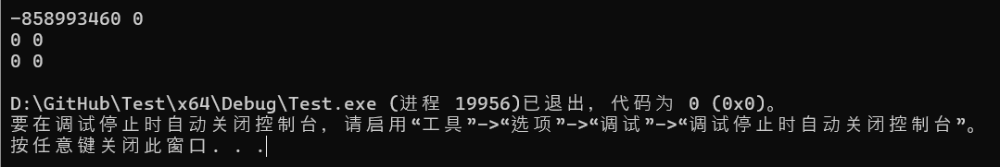

请注意，`user.a`在默认初始化之前并未将其初始化为零，因此未初始化。

实际上，这并不重要，因为您应该为所有数据成员提供默认成员初始化器！

**提示**

**对于没有用户提供的默认构造函数的类，值初始化将首先对类进行零初始化，而默认初始化则不会。鉴于此，默认初始化可能比值初始化更高效（但安全性较差）。如果您希望在初始化大量没有用户提供的默认构造函数的对象的代码段中榨干每一点性能，那么将这些对象更改为默认初始化可能值得探索。或者，您可以尝试将类更改为具有空体的默认构造函数。这可以避免使用值初始化时的零初始化情况，但可能会抑制其他优化。**

2.在 C++20 之前，具有用户定义的默认构造函数（即使其主体为空）的类会使该类成为非聚合类，而显式默认的默认构造函数则不会。假设该类原本是聚合类，前者会导致该类使用列表初始化而不是聚合初始化。在 C++20 及更高版本中，解决了这种不一致问题，因此两者都使该类成为非聚合类。

### 仅在有意义时才创建默认构造函数

默认构造函数允许我们创建非聚合类类型的对象，而无需用户提供的初始化值。因此，只有当使用所有默认值创建类类型的对象有意义时，类才应提供默认构造函数。

例如：

```cpp
#include <iostream>

class Fraction
{
private:
    int m_numerator{ 0 };
    int m_denominator{ 1 };

public:
    Fraction() = default;
    Fraction(int numerator, int denominator)
        : m_numerator{ numerator }
        , m_denominator{ denominator }
    {
    }

    void print() const
    {
        std::cout << "Fraction(" << m_numerator << ", " << m_denominator << ")\n";
    }
};

int main()
{
    Fraction f1 {3, 5};
    f1.print();

    Fraction f2 {}; // will get Fraction 0/1
    f2.print();

    return 0;
}
```

对于表示分数的类，允许用户创建没有初始化器的分数对象是有意义的（在这种情况下，用户将获得分数 0/1）。

现在考虑这个类：

```cpp
#include <iostream>
#include <string>
#include <string_view>

class Employee
{
private:
    std::string m_name{ };
    int m_id{ };

public:
    Employee(std::string_view name, int id)
        : m_name{ name }
        , m_id{ id }
    {
    }

    void print() const
    {
        std::cout << "Employee(" << m_name << ", " << m_id << ")\n";
    }
};

int main()
{
    Employee e1 { "Joe", 1 };
    e1.print();

    Employee e2 {}; // compile error: no matching constructor
    e2.print();

    return 0;
}
```

对于表示员工的类，允许创建没有姓名的员工是没有意义的。因此，这样的类不应该有默认构造函数，这样如果类的用户试图这样做，就会产生编译错误。

## 14.12 — 委托构造函数

只要有可能，我们就想减少冗余代码（遵循 DRY 原则——不要重复自己）。

考虑以下函数：

```cpp
void A()
{
    // statements that do task A
}

void B()
{
    // statements that do task A
    // statements that do task B
}
```

这两个函数都有一组语句，它们执行完全相同的操作（任务 A）。在这种情况下，我们可以像这样重构：

```cpp
void A()
{
    // statements that do task A
}

void B()
{
    A();
    // statements that do task B
}
```

这样，我们就删除了函数`A()`和中存在的冗余代码`B()`。这使我们的代码更易于维护，因为只需在一个地方进行更改。

当一个类包含多个构造函数时，每个构造函数中的代码非常相似甚至完全相同，并且有大量重复，这种情况非常常见。我们同样希望尽可能消除构造函数冗余。

请考虑以下示例：

```cpp
#include <iostream>
#include <string>
#include <string_view>

class Employee
{
private:
    std::string m_name{};
    int m_id{ 0 };

public:
    Employee(std::string_view name)
        : m_name{ name }
    {
        std::cout << "Employee " << m_name << " created\n";
    }

    Employee(std::string_view name, int id)
        : m_name{ name }, m_id{ id }
    {
        std::cout << "Employee " << m_name << " created\n";
    }
};

int main()
{
    Employee e1{ "James" };
    Employee e2{ "Dave", 42 };
}
```

每个构造函数的主体打印相同的内容。

构造函数可以调用其他函数，包括类的其他成员函数。所以我们可以像这样重构：

```cpp
#include <iostream>
#include <string>
#include <string_view>

class Employee
{
private:
    std::string m_name{};
    int m_id{ 0 };

    void printCreated() const
    {
        std::cout << "Employee " << m_name << " created\n";
    }

public:
    Employee(std::string_view name)
        : m_name{ name }
    {
        printCreated();
    }

    Employee(std::string_view name, int id)
        : m_name{ name }, m_id{ id }
    {
        printCreated();
    }
};

int main()
{
    Employee e1{ "James" };
    Employee e2{ "Dave", 42 };
}
```

虽然这比之前的版本要好，但它需要引入新功能，这并不理想。

我们可以做得更好吗？

### 显而易见的解决方案不起作用

类似于上例中函数`B()`调用函数的方式，显而易见的解决方案是让其中一个构造函数调用另一个构造函数。但这不会按预期工作，因为构造函数并非设计为直接从另一个函数（包括其他构造函数）的主体调用！`A()``Employee`

例如，您可能会想尝试一下：

```cpp
#include <iostream>
#include <string>
#include <string_view>

class Employee
{
private:
    std::string m_name{};
    int m_id{ 0 };

public:
    Employee(std::string_view name)
        : m_name{ name }
    {
        std::cout << "Employee " << m_name << " created\n";
    }

    Employee(std::string_view name, int id)
        : m_name{ name }, m_id{ id }
    {
        Employee(name); // compile error
    }
};

int main()
{
    Employee e1{ "James" };
    Employee e2{ "Dave", 42 };
}
```

这不起作用，并将导致编译错误。

当我们尝试显式调用不带任何参数的构造函数时，会发生更危险的情况。这不会对默认构造函数执行函数调用——而是创建一个临时（未命名）对象并用值初始化它！这是一个愚蠢的例子，说明了这一点：

```cpp
#include <iostream>
struct Foo
{
    int x{};
    int y{};

public:
    Foo()
    {
        x = 5;
    }

    Foo(int value): y { value }
    {
        // intent: call Foo() function
        // actual: value initializes nameless temporary Foo (which is then discarded)
        Foo(); // note: this is the equivalent of writing Foo{}
    }
};

int main()
{
    Foo f{ 9 };
    std::cout << f.x << ' ' << f.y; // prints 0 9
}
```

在此示例中，`Foo(int)`构造函数具有语句`Foo()`，期望调用`Foo()`构造函数并分配成员`x`值`5`。但是，此语法实际上会创建一个未命名的临时对象`Foo`，然后值会对其进行初始化（与我们编写的 相同`Foo{}`）。当`x = 5`语句执行时，会为`x`临时对象的成员`Foo`分配一个值。由于未使用临时对象，因此一旦完成构造，就会将其丢弃。

`x`构造函数隐式对象的成员从未`Foo(int)`被赋值。因此，当我们稍后在 中打印出它的值时`main()`，我们得到的`0`不是预期的`5`。

请注意，这种情况不会产生编译错误 - 相反，它只是默默地无法产生预期的结果！

**警告**

**不应直接从另一个函数体调用构造函数。这样做要么会导致编译错误，要么会初始化一个临时对象然后将其丢弃（这可能不是您想要的）。**

### 委托构造函数

构造函数可以将初始化委托（转移责任）给同一类类型的另一个构造函数。这个过程有时称为**构造函数链**，这样的构造函数称为**委托构造函数**。

要使一个构造函数将初始化委托给另一个构造函数，只需调用成员初始化列表中的构造函数即可。应用于我们上面的例子：

```c++
#include <iostream>
#include <string>
#include <string_view>

class Employee
{
private:
    std::string m_name{};
    int m_id{ 0 };

public:
    Employee(std::string_view name)
        : Employee{ name, 0 } // delegate initialization to Employee(std::string_view, int) constructor
    {
    }

    Employee(std::string_view name, int id)
        : m_name{ name }, m_id{ id } // actually initializes the members
    {
        std::cout << "Employee " << m_name << " created\n";
    }

};

int main()
{
    Employee e1{ "James" };
    Employee e2{ "Dave", 42 };
}
```

`e1 { "James" }`初始化后，`Employee(std::string_view)`将调用匹配的构造函数并将参数`name`设置为`"James"`。此构造函数的成员初始化列表将初始化委托给其他构造函数，因此`Employee(std::string_view, int)`随后调用 。 `name` (`"James"`)的值作为第一个参数传递，文字 `0` 作为第二个参数传递。然后，委托构造函数的成员初始化列表初始化成员。然后，委托构造函数的主体运行。然后控制权返回到初始构造函数，其（空）主体运行。最后，控制权返回给调用者。

这种方法的缺点是有时需要重复初始化值。在委托给构造函数时`Employee(std::string_view, int)`，我们需要为`int`参数指定一个初始化值。我们不得不对文字进行硬编码`0`，因为没有办法引用默认成员初始化器。

关于委托构造函数的一些额外说明。首先，委托给另一个构造函数的构造函数不允许自己进行任何成员初始化。因此，您的构造函数可以委托或初始化，但不能同时进行。

### 顺便说一下……

**注意，我们让`Employee(std::string_view)`（参数较少的构造函数）委托给`Employee(std::string_view name, int id)`（参数较多的构造函数）。通常情况下，让参数较少的构造函数委托给参数较多的构造函数。**

**如果我们选择将`Employee(std::string_view name, int id)`委托给`Employee(std::string_view)`，那么我们将无法`m_id`使用进行初始化`id`，因为构造函数只能委托或初始化，而不能同时进行。**

其次，一个构造函数可能会委托给另一个构造函数，而后者又会委托回第一个构造函数。这会形成无限循环，并会导致程序耗尽堆栈空间并崩溃。您可以通过确保所有构造函数都解析为非委托构造函数来避免这种情况。

**最佳实践**

**如果有多个构造函数，请考虑是否可以使用委托构造函数来减少重复代码。**

### 使用默认参数减少构造函数

有时也可以使用默认值将多个构造函数减少为更少的构造函数。例如，通过为参数设置默认值`id`，我们可以创建一个`Employee`需要 name 参数但可以选择接受 id 参数的构造函数：

```cpp
#include <iostream>
#include <string>
#include <string_view>

class Employee
{
private:
    std::string m_name{};
    int m_id{ 0 }; // default member initializer

public:

    Employee(std::string_view name, int id = 0) // default argument for id
        : m_name{ name }, m_id{ id }
    {
        std::cout << "Employee " << m_name << " created\n";
    }
};

int main()
{
    Employee e1{ "James" };
    Employee e2{ "Dave", 42 };
}
```

由于在函数调用中最右边的参数必须附加默认值，因此定义类时的一个好习惯是首先定义用户*必须*为其提供初始化值的成员（然后将其作为构造函数的最左边的参数）。用户可以选择性提供的成员（因为默认值是可以接受的）应该第二个定义（然后将其作为构造函数的最右边的参数）。

**最佳实践**

**应首先定义用户必须提供初始化值的成员（并作为构造函数最左边的参数）。应第二个定义用户可以随意提供初始化值（因为可以接受默认值）的成员（并作为构造函数最右边的参数）。**

请注意，此方法还需要复制（'0'）的默认初始化值`m_id`：一次作为默认成员初始化器，一次作为默认参数。

### 难题：冗余构造函数与冗余默认值

在上面的例子中，我们使用了委托构造函数和默认参数来减少构造函数冗余。但这两种方法都要求我们在各个地方复制成员的初始化值。不幸的是，目前没有办法指定委托构造函数或默认参数应使用默认成员初始化值。

关于构造函数数量少（初始化值重复）还是构造函数数量多（初始化值不重复）好，存在各种观点。我们的观点是，构造函数数量少通常更直接，即使会导致初始化值重复。

**对于高级读者**

**当我们有一个在多个地方使用的初始化值时（例如，作为默认成员初始化器和构造函数参数的默认参数），我们可以定义一个命名常量，并在需要初始化值的地方使用它。这允许在一个地方定义初始化值。**

**最好的方法是使用`static constexpr`类内部的成员：**

```cpp
#include <iostream>
#include <string>
#include <string_view>

class Employee
{
private:
    static constexpr int default_id { 0 }; // define a named constant with our desired initialization value

    std::string m_name{};
    int m_id{ default_id }; // we can use it here

public:

    Employee(std::string_view name, int id = default_id) // and we can use it here
        : m_name{ name }, m_id{ id }
    {
        std::cout << "Employee " << m_name << " created\n";
    }
};

int main()
{
    Employee e1{ "James" };
    Employee e2{ "Dave", 42 };
}
```

[我们在第15.6 课“静态成员变量”](https://www.learncpp.com/cpp-tutorial/static-member-variables/)中介绍静态成员。

这种方法的缺点是，每个额外的命名常量都会增加一个必须理解的名称，从而使您的类变得更加混乱和复杂。这是否值得取决于需要多少个这样的常量，以及在多少地方需要初始化值。

**测验**

### 问题 #1

编写一个名为 Ball 的类。Ball 应该有两个私有成员变量，一个用于保存颜色（默认值：）`black`，另一个用于保存半径（默认值`10.0`：）。添加 4 个构造函数，分别处理以下每种情况：

```c++
int main()
{
    Ball def{};
    Ball blue{ "blue" };
    Ball twenty{ 20.0 };
    Ball blueTwenty{ "blue", 20.0 };

    return 0;
}
```

```c++
#include <iostream>
#include <string>
#include <string_view>

class Ball
{
private:
	std::string m_color{ "black" };
	double m_radius{ 10.0 };

public:
	// Default constructor (color and radius will use default value)
	Ball()
	{
            print();
	}

	// Constructor with only radius parameter (color will use default value)
	Ball(double radius)
		: m_radius{ radius }
	{
            print();
	}

	// Constructor with only color parameter (radius will use default value)
	Ball(std::string_view color)
		: m_color{ color }
	{
            print();
	}

	// Constructor with both color and radius parameters
	Ball(std::string_view color, double radius)
		: m_color{ color }
		, m_radius{ radius }
	{
            print();
	}

    void print() const
    {
        std::cout << "Ball(" << m_color << ", " << m_radius << ")\n";
    }
};

int main()
{
    Ball def{};
    Ball blue{ "blue" };
    Ball twenty{ 20.0 };
    Ball blueTwenty{ "blue", 20.0 };

    return 0;
}
```

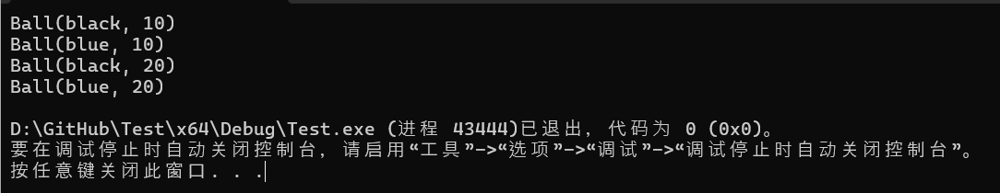

### 问题 #2

通过使用默认参数和委托构造函数来减少上述程序中的构造函数数量。

```c++
#include <iostream>
#include <string>
#include <string_view>

class Ball
{
private:
	std::string m_color{ "black" };
	double m_radius{ 10.0 };

public:
	// Handles Ball(radius)
	Ball(double radius)
		: Ball{ "black", radius } // delegate to the other constructor
	{
		// We don't need to call print() here since it will be called by
		// the constructor we delegate to
	}

	// Handles Ball(color, radius), Ball(color), and Ball()
	Ball(std::string_view color="black", double radius=10.0)
		: m_color{ color }
		, m_radius{ radius }
	{
		print();
	}

	void print() const
	{
		std::cout << "Ball(" << m_color << ", " << m_radius << ")\n";
	}
};

int main()
{
    Ball def{};
    Ball blue{ "blue" };
    Ball twenty{ 20.0 };
    Ball blueTwenty{ "blue", 20.0 };

    return 0;
}
```

## 14.13 — 临时类对象

请考虑以下示例：

```cpp
#include <iostream>

int add(int x, int y)
{
    int sum{ x + y }; // stores x + y in a variable
    return sum;       // returns value of that variable
}

int main()
{
    std::cout << add(5, 3) << '\n';

    return 0;
}
```

在`add()`函数中，变量`sum`用于存储表达式的结果`x + y`。然后在 return 语句中评估此变量以产生要返回的值。虽然这可能偶尔对调试有用（因此我们可以根据`sum`需要检查的值），但通过定义一个仅使用一次的对象，它实际上使函数变得比它需要的更复杂。

在大多数情况下，如果变量仅使用一次，我们实际上不需要变量。相反，我们可以用用于初始化变量的表达式代替本来要使用变量的位置。以下是以`add()`这种方式重写的函数：

```cpp
#include <iostream>

int add(int x, int y)
{
    return x + y; // just return x + y directly
}

int main()
{
    std::cout << add(5, 3) << '\n';

    return 0;
}
```

这不仅适用于返回值，也适用于大多数函数参数。例如，代替这个：

```cpp
#include <iostream>

void printValue(int value)
{
    std::cout << value;
}

int main()
{
    int sum{ 5 + 3 };
    printValue(sum);

    return 0;
}
```

我们可以这样写：

```cpp
#include <iostream>

void printValue(int value)
{
    std::cout << value;
}

int main()
{
    printValue(5 + 3);

    return 0;
}
```

请注意，这让我们的代码更加简洁。我们不必定义变量并为其命名。我们也不必扫描整个函数来确定该变量是否在其他地方实际使用。因为`5 + 3`是一个表达式，所以我们知道它只在那一行中使用。

请注意，这仅在接受右值表达式的情况下才有效。在需要左值表达式的情况下，我们必须有一个对象：

```cpp
#include <iostream>

void addOne(int& value) // pass by non-const references requires lvalue
{
    ++value;
}

int main()
{
    int sum { 5 + 3 };
    addOne(sum);   // okay, sum is an lvalue

    addOne(5 + 3); // compile error: not an lvalue

    return 0;
}
```

### 临时类对象

同样的问题也适用于类类型的上下文。

**作者注**

**我们将在这里使用一个类，但本课中的所有内容同样适用于使用聚合初始化来初始化的结构。**

下面的示例与上面的例子类似，但是使用程序定义的类类型`IntPair`而不是`int`：

```cpp
#include <iostream>

class IntPair
{
private:
    int m_x{};
    int m_y{};

public:
    IntPair(int x, int y)
        : m_x { x }, m_y { y }
    {}

    int x() const { return m_x; }
    int y() const { return m_y; }
};

void print(IntPair p)
{
    std::cout << "(" << p.x() << ", " << p.y() << ")\n";
}

int main()
{
    // Case 1: Pass variable
    IntPair p { 3, 4 };
    print(p); // prints (3, 4)

    return 0;
}
```

在情况 1 中，我们实例化变量`IntPair p`，然后传递`p`给函数`print()`。

但是，`p`仅使用一次，并且函数`print()`将接受右值，因此实际上没有理由在这里定义变量。所以让我们摆脱`p`。

我们可以通过传递临时对象而不是命名变量来实现这一点。**临时对象**（有时称为**匿名对象**或未**命名对象**）是没有名称且仅在单个表达式的持续时间内存在的对象。

创建临时类类型对象有两种常用方法：

```cpp
#include <iostream>

class IntPair
{
private:
    int m_x{};
    int m_y{};

public:
    IntPair(int x, int y)
        : m_x { x }, m_y { y }
    {}

    int x() const { return m_x; }
    int y() const{ return m_y; }
};

void print(IntPair p)
{
    std::cout << "(" << p.x() << ", " << p.y() << ")\n";
}

int main()
{
    // Case 1: Pass variable
    IntPair p { 3, 4 };
    print(p);

    // Case 2: Construct temporary IntPair and pass to function
    print(IntPair { 5, 6 } );

    // Case 3: Implicitly convert { 7, 8 } to a temporary Intpair and pass to function
    print( { 7, 8 } );

    return 0;
}
```

在情况 2 中，我们告诉编译器构造一个`IntPair`对象，并用 初始化它`{ 5, 6 }`。由于此对象没有名称，因此它是一个临时对象。然后将临时对象传递给`p`函数的参数`print()`。当函数调用返回时，临时对象将被销毁。

在情况 3 中，我们还创建了一个临时`IntPair`对象以传递给函数`print()`。但是，由于我们没有明确指定要构造的类型，因此编译器将从`IntPair`函数参数中推断出必要的类型（），然后隐式转换`{ 7, 8 }`为`IntPair`对象。

总结一下：

```cpp
IntPair p { 1, 2 }; // create named object p initialized with value { 1, 2 }
IntPair { 1, 2 };   // create temporary object initialized with value { 1, 2 }
{ 1, 2 };           // compiler will try to convert value { 1, 2 } to temporary object matching parameter type
```

### 临时对象和按值返回

当函数按值返回时，返回的对象是一个临时对象（使用 return 语句中标识的值或对象进行初始化）。

以下是一些示例：

```cpp
#include <iostream>

class IntPair
{
private:
    int m_x{};
    int m_y{};

public:
    IntPair(int x, int y)
        : m_x { x }, m_y { y }
    {}

    int x() const { return m_x; }
    int y() const { return m_y; }
};

void print(IntPair p)
{
    std::cout << "(" << p.x() << ", " << p.y() << ")\n";
}

// Case 1: Create named variable and return
IntPair ret1()
{
    IntPair p { 3, 4 };
    return p; // returns temporary object (initialized using p)
}

// Case 2: Create temporary IntPair and return
IntPair ret2()
{
    return IntPair { 5, 6 }; // returns temporary object (initialized using another temporary object)
}

// Case 3: implicitly convert { 7, 8 } to IntPair and return
IntPair ret3()
{
    return { 7, 8 }; // returns temporary object (initialized using another temporary object)
}

int main()
{
    print(ret1());
    print(ret2());
    print(ret3());

    return 0;
}
```

在情况 1 中，当我们 时`return p`，使用 创建一个临时对象并进行初始化`p`。

此示例中的情况与前一个示例中的情况类似。

### 几点说明

首先，与 的情况一样`int`，当在表达式中使用时，临时类对象是右值。因此，此类对象只能在接受右值表达式的地方使用。

其次，临时对象在定义时创建，并在定义它们的完整表达式的末尾销毁。完整表达式是非子表达式的表达式。

### `static_cast`与临时对象的显式实例化

在我们需要将值从一种类型转换为另一种类型但不涉及缩小转换的情况下，我们通常可以选择使用`static_cast`临时对象的显式实例。

例如：

```cpp
#include <iostream>

int main()
{
    char c { 'a' };

    std::cout << static_cast<int>( c ) << '\n'; // static_cast returns a temporary int direct-initialized with value of c
    std::cout << int { c } << '\n';             // explicitly creates a temporary int list-initialized with value c

    return 0;
}
```

`static_cast<int>(c)`返回一个`int`使用 的值直接初始化的临时变量`c`。`int { c }`创建一个`int`使用 的值列表初始化的临时变量`c`。无论哪种方式，我们都会得到一个使用 的值初始化的临时 int `c`，这正是我们想要的。

让我们展示一个稍微复杂一点的例子：

`printString.h:`

```cpp
#include <string>
void printString(const std::string &s)
{
    std::cout << s << '\n';
}
```

`main.cpp`：

```cpp
#include "printString.h"
#include <iostream>
#include <string>
#include <string_view>

int main()
{
    std::string_view sv { "Hello" };

    // We want to print sv using the printString() function

//    printString(sv); // compile error: a std::string_view won't implicitly convert to a std::string

    printString( static_cast<std::string>(sv) ); // Case 1: static_cast returns a temporary std::string direct-initialized with sv
    printString( std::string { sv } );           // Case 2: explicitly creates a temporary std::string list-initialized with sv
    printString( std::string ( sv ) );           // Case 3: C-style cast returns temporary std::string direct-initialized with sv (avoid this one!)

    return 0;
}
```

假设头文件中的代码`printString.h`不是我们可以修改的代码（例如，因为它与我们正在使用的某些第三方库一起分发，并且已编写为与不支持的 C++11 兼容）`std::string_view`。那么我们如何调用？因为 a不会隐式转换为 a （出于效率原因），我们不能仅将其用作参数。我们必须使用某种明确的转换形式。`printString()``sv``std::string_view``std::string``sv`

在情况 1 中，`static_cast<std::string>(sv)`调用 static_cast 运算符强制转换`sv`为`std::string`。这将返回一个`std::string`已使用 直接初始化的临时变量`sv`，然后将其用作函数调用的参数。

在情况 2 中，`std::string { sv }`创建一个`std::string`使用 进行列表初始化的临时变量`sv`。由于这是一个显式构造，因此允许转换。然后将此临时变量用作函数调用的参数。

在情况 3 中，`std::string ( sv )`使用 C 风格强制类型转换将`sv`其转换为`std::string`。虽然这在这里有效，但 C 风格强制类型转换通常很危险，应避免使用。请注意，这与前一种情况有多么相似！

**最佳实践**

**一个简单的经验法则是：`static_cast`在转换为基本类型时优先使用，在转换为类类型时使用列表初始化临时类型。**

**当下列任一情况为真时，选择`static_cast`何时创建临时对象：**

- **我们需要执行缩小转换。**
- **我们希望清楚地表明我们正在转换为一种会导致某些不同行为的类型（例如，将 a`char`转换为 an `int`）。**
- **由于某些原因，我们想使用直接初始化（例如，为了避免列表构造函数优先）。**

**当以下任一情况为真时，优先创建一个新对象（使用列表初始化）而不是创建临时对象：**

- **我们想要使用列表初始化（例如，为了防止缩小转换，或者因为我们需要调用列表构造函数）。**
- **我们需要向构造函数提供额外的参数以便于转换。**

## 14.14 — 复制构造函数简介

考虑以下程序：

```cpp
#include <iostream>

class Fraction
{
private:
    int m_numerator{ 0 };
    int m_denominator{ 1 };

public:
    // Default constructor
    Fraction(int numerator=0, int denominator=1)
        : m_numerator{numerator}, m_denominator{denominator}
    {
    }

    void print() const
    {
        std::cout << "Fraction(" << m_numerator << ", " << m_denominator << ")\n";
    }
};

int main()
{
    Fraction f { 5, 3 };  // Calls Fraction(int, int) constructor
    Fraction fCopy { f }; // What constructor is used here?

    f.print();
    fCopy.print();

    return 0;
}
```

您可能会惊讶地发现该程序编译得很好，并产生结果：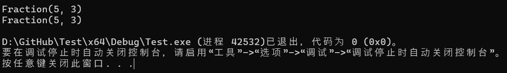

让我们仔细看看这个程序是如何工作的。

变量的初始化`f`只是一个调用`Fraction(int, int)`构造函数的标准大括号初始化。

但是下一行呢？变量的初始化`fCopy`显然也是一个初始化，而且您知道构造函数用于初始化类。那么这一行调用了哪个构造函数？

答案是：复制构造函数。

### 复制构造函数

复制**构造函数**是一种使用现有同类型的对象来初始化对象的构造函数。复制构造函数执行后，新创建的对象应该是作为初始化器传入的对象的副本。

### 隐式复制构造函数

如果您没有为类提供复制构造函数，C++ 将为您创建一个公共**隐式复制构造函数**。在上面的示例中，该语句`Fraction fCopy { f };`调用隐式复制构造函数进行`fCopy`初始化`f`。

默认情况下，隐式复制构造函数将执行成员初始化。这意味着每个成员将使用作为初始化器传入的类的相应成员进行初始化。在上面的示例中，``fCopy.m_denominator``使用(具有值5)`fCopy.m_numerator`进行初始化，使用(具有值)进行初始化。`f.m_numerator``5``fCopy.m_denominator``f.m_denominator``3`

复制构造函数执行后，`f`和的成员`fCopy`具有相同的值，`fCopy`的副本也是如此`f`。因此，调用`print()`或 都会得到相同的结果。

### 定义自己的复制构造函数

我们也可以明确定义自己的复制构造函数。在本课中，我们将让复制构造函数打印一条消息，以便向您展示在进行复制时它确实在执行。

复制构造函数看起来就像您期望的那样：

```cpp
#include <iostream>

class Fraction
{
private:
    int m_numerator{ 0 };
    int m_denominator{ 1 };

public:
    // Default constructor
    Fraction(int numerator=0, int denominator=1)
        : m_numerator{numerator}, m_denominator{denominator}
    {
    }

    // Copy constructor
    Fraction(const Fraction& fraction)
        // Initialize our members using the corresponding member of the parameter
        : m_numerator{ fraction.m_numerator }
        , m_denominator{ fraction.m_denominator }
    {
        std::cout << "Copy constructor called\n"; // just to prove it works
    }

    void print() const
    {
        std::cout << "Fraction(" << m_numerator << ", " << m_denominator << ")\n";
    }
};

int main()
{
    Fraction f { 5, 3 };  // Calls Fraction(int, int) constructor
    Fraction fCopy { f }; // Calls Fraction(const Fraction&) copy constructor

    f.print();
    fCopy.print();

    return 0;
}
```

当运行该程序时，您将获得：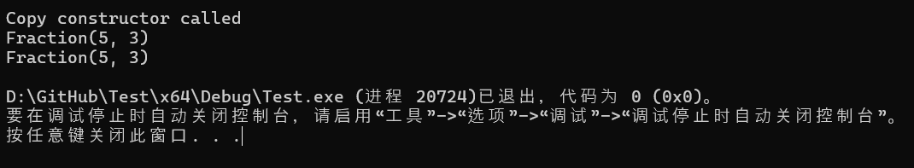

我们上面定义的复制构造函数在功能上等同于我们默认获得的复制构造函数，只是我们添加了一个输出语句来证明复制构造函数确实被调用了。当`fCopy`使用 初始化时，将调用此复制构造函数`f`。

**提醒**

**访问控制以类为基础（而不是以对象为基础）工作。这意味着类的成员函数可以访问同一类型的任何类对象的私有成员（而不仅仅是隐式对象）。**

**我们在上面复制构造函数中利用了这一点`Fraction`，以便直接访问参数的私有成员`fraction`。否则，我们将无法直接访问这些成员（除非添加访问函数，但我们可能不想这样做）。**

复制构造函数除了复制对象外不应执行任何其他操作。这是因为编译器可能会在某些情况下优化复制构造函数。如果您依赖复制构造函数执行除复制之外的某些行为，则该行为可能会发生也可能不会发生。我们将在第**[14.15 课“类初始化和复制省略”]**中进一步讨论这一点。

**最佳实践**

**复制构造函数除了复制之外不应该有任何副作用。**

### 更喜欢隐式复制构造函数

与不执行任何操作（因此很少是我们想要的）的隐式默认构造函数不同，隐式复制构造函数执行的成员初始化通常正是我们想要的。因此，在大多数情况下，使用隐式复制构造函数是完全没问题的。

**最佳实践**

**最好使用隐式复制构造函数，除非您有特殊理由要创建自己的构造函数。**

[当我们讨论动态内存分配（ 21.13-浅复制与深复制](https://www.learncpp.com/cpp-tutorial/shallow-vs-deep-copying/)）时，我们会看到需要覆盖复制构造函数的情况。

### 按值传递和复制构造函数

当对象按值传递时，参数会被复制到参数中。当参数和参数是同一类类型时，复制是通过隐式调用复制构造函数进行的。

以下示例说明了这一点：

```cpp
#include <iostream>

class Fraction
{
private:
    int m_numerator{ 0 };
    int m_denominator{ 1 };

public:
    // Default constructor
    Fraction(int numerator = 0, int denominator = 1)
        : m_numerator{ numerator }, m_denominator{ denominator }
    {
    }

    // Copy constructor
    Fraction(const Fraction& fraction)
        : m_numerator{ fraction.m_numerator }
        , m_denominator{ fraction.m_denominator }
    {
        std::cout << "Copy constructor called\n";
    }

    void print() const
    {
        std::cout << "Fraction(" << m_numerator << ", " << m_denominator << ")\n";
    }
};

void printFraction(Fraction f) // f is pass by value
{
    f.print();
}

int main()
{
    Fraction f{ 5, 3 };

    printFraction(f); // f is copied into the function parameter using copy constructor

    return 0;
}
```

在作者的机器上，此示例打印：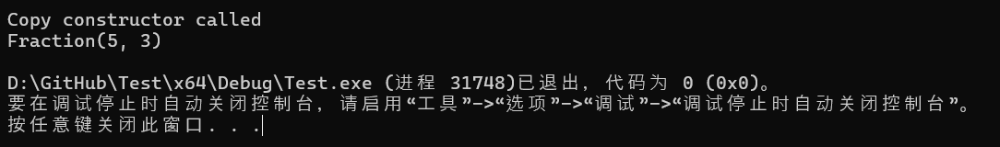

### 按值返回和复制构造函数

在课程[2.5 — 局部作用域简介](https://www.learncpp.com/cpp-tutorial/introduction-to-local-scope/)中，我们注意到按值返回会创建一个临时对象（保存返回值的副本），该对象将传递回调用者。当返回类型和返回值是同一类类型时，通过隐式调用复制构造函数来初始化临时对象。

例如：

```cpp
#include <iostream>

class Fraction
{
private:
    int m_numerator{ 0 };
    int m_denominator{ 1 };

public:
    // Default constructor
    Fraction(int numerator = 0, int denominator = 1)
        : m_numerator{ numerator }, m_denominator{ denominator }
    {
    }

    // Copy constructor
    Fraction(const Fraction& fraction)
        : m_numerator{ fraction.m_numerator }
        , m_denominator{ fraction.m_denominator }
    {
        std::cout << "Copy constructor called\n";
    }

    void print() const
    {
        std::cout << "Fraction(" << m_numerator << ", " << m_denominator << ")\n";
    }
};

void printFraction(Fraction f) // f is pass by value
{
    f.print();
}

Fraction generateFraction(int n, int d)
{
    Fraction f{ n, d };
    return f;
}

int main()
{
    Fraction f2 { generateFraction(1, 2) }; // Fraction is returned using copy constructor

    printFraction(f2); // f2 is copied into the function parameter using copy constructor

    return 0;
}
```

当`generateFraction`返回时，将使用`Fraction`复制构造函数创建`main`一个临时对象并初始化它。`Fraction`

因为这个临时变量用于初始化`Fraction f2`，所以这会再次调用复制构造函数将临时变量复制到其中`f2`。

当`f2`传递给时`printFraction()`，复制构造函数会被第三次调用。

因此，在作者的机器上，此示例打印：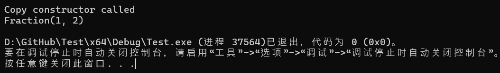

如果你编译并执行上述示例，你可能会发现只发生了两次对复制构造函数的调用。这是一种称为*复制省略的编译器优化。我们将在*[第 14.15 课——类初始化和复制省略](https://www.learncpp.com/cpp-tutorial/class-initialization-and-copy-elision/)中进一步讨论复制省略。

### 使用`= default`生成默认复制构造函数

如果类没有复制构造函数，编译器会为我们隐式生成一个。如果我们愿意，我们可以使用以下语法显式请求编译器为我们创建一个默认的复制构造函数`= default`：

```cpp
#include <iostream>

class Fraction
{
private:
    int m_numerator{ 0 };
    int m_denominator{ 1 };

public:
    // Default constructor
    Fraction(int numerator=0, int denominator=1)
        : m_numerator{numerator}, m_denominator{denominator}
    {
    }

    // Explicitly request default copy constructor
    Fraction(const Fraction& fraction) = default;

    void print() const
    {
        std::cout << "Fraction(" << m_numerator << ", " << m_denominator << ")\n";
    }
};

int main()
{
    Fraction f { 5, 3 };
    Fraction fCopy { f };

    f.print();
    fCopy.print();

    return 0;
}
```

### 用于`= delete`防止复印

有时我们会遇到不希望某个类的对象可复制的情况。我们可以通过将复制构造函数标记为已删除来防止这种情况，使用以下`= delete`语法：

```cpp
#include <iostream>

class Fraction
{
private:
    int m_numerator{ 0 };
    int m_denominator{ 1 };

public:
    // Default constructor
    Fraction(int numerator=0, int denominator=1)
        : m_numerator{numerator}, m_denominator{denominator}
    {
    }

    // Delete the copy constructor so no copies can be made
    Fraction(const Fraction& fraction) = delete;

    void print() const
    {
        std::cout << "Fraction(" << m_numerator << ", " << m_denominator << ")\n";
    }
};

int main()
{
    Fraction f { 5, 3 };
    Fraction fCopy { f }; // compile error: copy constructor has been deleted

    return 0;
}
```

在示例中，当编译器去寻找用于初始化的构造函数时`fCopy`，`f`它会发现复制构造函数已被删除。这将导致它发出编译错误。

**顺便说一下……**

**您还可以通过将复制构造函数设为私有来阻止公众复制类对象（因为私有函数不能被公众调用）。但是，私有复制构造函数仍然*可以*从类的其他成员调用，因此除非有必要，否则不建议使用此解决方案。**

**对于高级读者**

**三原则是众所周知的 C++ 原则，即如果一个类需要用户定义的复制构造函数、析构函数或复制赋值运算符，那么它很可能需要这三个。在 C++11 中，这被扩展为五原则，将移动构造函数和移动赋值运算符添加到列表中。**

**不遵循三法则/五法则可能会导致代码故障。在讨论动态内存分配时，我们将重新讨论三法则和五法则。**

**我们在第[15.4 课 - 析构函数简介](https://www.learncpp.com/cpp-tutorial/introduction-to-destructors/)和[第 19.3 课 - 析构](https://www.learncpp.com/cpp-tutorial/destructors/)函数中讨论了析构函数，在第[21.12 课 - 重载赋值运算符中讨论了复制](https://www.learncpp.com/cpp-tutorial/overloading-the-assignment-operator/)赋值。**

### **测验**

#### 问题 #1

在上面的课程中，我们注意到复制构造函数的参数必须是 (const) 引用。为什么不允许使用按值传递？

当我们通过值传递类类型参数时，将隐式调用复制构造函数将参数复制到参数中。

如果复制构造函数使用按值传递，则复制构造函数需要调用自身以将初始化器参数复制到复制构造函数参数中。但对复制构造函数的调用也将按值传递，因此将再次调用复制构造函数以将参数复制到函数参数中。这将导致对复制构造函数的无限调用链。

## 14.15 — 类初始化和复制省略

```cpp
int a;         // no initializer (default initialization)
int b = 5;     // initializer after equals sign (copy initialization)
int c( 6 );    // initializer in parentheses (direct initialization)

// List initialization methods (C++11)
int d { 7 };   // initializer in braces (direct list initialization)
int e = { 8 }; // initializer in braces after equals sign (copy list initialization)
int f {};      // initializer is empty braces (value initialization)
```

所有这些初始化类型对于具有类类型的对象均有效：

```cpp
#include <iostream>

class Foo
{
public:

    // Default constructor
    Foo()
    {
        std::cout << "Foo()\n";
    }

    // Normal constructor
    Foo(int x)
    {
        std::cout << "Foo(int) " << x << '\n';
    }

    // Copy constructor
    Foo(const Foo&)
    {
        std::cout << "Foo(const Foo&)\n";
    }
};

int main()
{
    // Calls Foo() default constructor
    Foo f1;           // default initialization
    Foo f2{};         // value initialization (preferred)

    // Calls foo(int) normal constructor
    Foo f3 = 3;       // copy initialization (non-explicit constructors only)
    Foo f4(4);        // direct initialization
    Foo f5{ 5 };      // direct list initialization (preferred)
    Foo f6 = { 6 };   // copy list initialization (non-explicit constructors only)

    // Calls foo(const Foo&) copy constructor
    Foo f7 = f3;      // copy initialization
    Foo f8(f3);       // direct initialization
    Foo f9{ f3 };     // direct list initialization (preferred)
    Foo f10 = { f3 }; // copy list initialization

    return 0;
}
```


在现代 C++ 中，复制初始化、直接初始化和列表初始化本质上做同一件事——它们初始化一个对象。

对于所有类型的初始化：

- 初始化类类型时，将检查该类的构造函数集，并使用重载解析来确定最佳匹配的构造函数。这可能涉及参数的隐式转换。
- 在初始化非类类型时，使用隐式转换规则来判断是否存在隐式转换。

**关键见解**

**初始化形式之间有三个主要区别：**

- **列表初始化不允许缩小转换。**
- **复制初始化仅考虑非显式构造函数/转换函数。我们将在第[14.16 课——转换构造函数和显式关键字](https://www.learncpp.com/cpp-tutorial/converting-constructors-and-the-explicit-keyword/)中介绍这一点。**
- **列表初始化优先匹配列表构造函数，而不是其他匹配的构造函数。我们将在第[16.2 课——std::vector 和列表构造函数简介](https://www.learncpp.com/cpp-tutorial/introduction-to-stdvector-and-list-constructors/)中介绍这一点。**

还值得注意的是，在某些情况下，某些形式的初始化是不允许的（例如，在构造函数成员初始化列表中，我们只能使用直接形式的初始化，而不能使用复制初始化）。

### 不必要的副本

考虑这个简单的程序：

```cpp
#include <iostream>

class Something
{
    int m_x{};

public:
    Something(int x)
        : m_x{ x }
    {
        std::cout << "Normal constructor\n";
    }

    Something(const Something& s)
        : m_x { s.m_x }
    {
        std::cout << "Copy constructor\n";
    }

    void print() const { std::cout << "Something(" << m_x << ")\n"; }
};

int main()
{
    Something s { Something { 5 } }; // focus on this line
    s.print();

    return 0;
}
```

在上面的变量初始化中`s`，我们首先构造一个临时变量`Something`，并用值初始化`5`（使用`Something(int)`构造函数）。然后使用此临时变量初始化`s`。由于临时变量和`s`具有相同的类型（它们都是`Something`对象），因此`Something(const Something&)`通常会在此处调用复制构造函数以将临时变量中的值复制到中`s`。最终结果是`s`用值初始化`5`。

如果没有任何优化，上述程序将打印：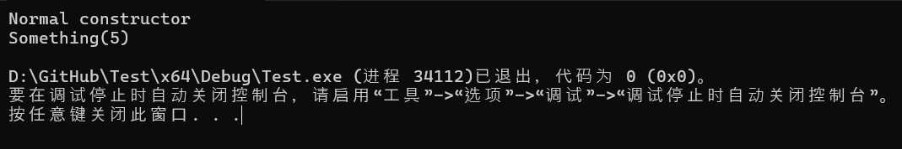

但是，这个程序效率不高，因为我们必须进行两次构造函数调用：一次调用`Something(int)`，一次调用`Something(const Something&)`。请注意，上面的最终结果与我们编写以下内容的结果相同：

```cpp
Something s { 5 }; // only invokes Something(int), no copy constructor
```

此版本产生相同的结果，但效率更高，因为它仅进行调用`Something(int)`（不需要复制构造函数）。

### 复制省略

由于编译器可以自由地重写语句来优化它们，人们可能想知道编译器是否可以优化掉不必要的复制Something s { 5 }，并且就像我们一开始`Something s { Something{5} };`写的那样。

答案是肯定的，而这个过程称为*复制省略*。**复制省略**是一种编译器优化技术，允许编译器删除不必要的对象复制。换句话说，在编译器通常会调用复制构造函数的情况下，编译器可以自由地重写代码以完全避免对复制构造函数的调用。当编译器优化了对复制构造函数的调用时，我们说构造函数已被**省略**。

与其他类型的优化不同，复制省略不受“as-if”规则的约束。也就是说，即使复制构造函数有副作用（例如将文本打印到控制台），复制省略也可以省略复制构造函数！这就是为什么复制构造函数除了复制之外不应该有副作用的原因——如果编译器省略对复制构造函数的调用，副作用将不会执行，程序的可观察行为将发生变化！

编译器省略了复制构造函数以避免不必要的复制，因此打印“复制构造函数”的语句不会执行！由于复制省略，我们程序的可观察行为已经发生了变化！

### 按值传递和按值返回中的复制省略

当使用与参数相同类型的参数按值传递或按值返回时，通常会调用复制构造函数。 但是，在某些情况下，可以省略这些副本。 以下程序演示了其中一些情况：

```cpp
#include <iostream>

class Something
{
public:
	Something() = default;
	Something(const Something&)
	{
		std::cout << "Copy constructor called\n";
	}
};

Something rvo()
{
	return Something{}; // calls Something() and copy constructor
}

Something nrvo()
{
	Something s{}; // calls Something()
	return s;      // calls copy constructor
}

int main()
{
	std::cout << "Initializing s1\n";
	Something s1 { rvo() }; // calls copy constructor

	std::cout << "Initializing s2\n";
	Something s2 { nrvo() }; // calls copy constructor

        return 0;
}
```

在 C++14 或更早版本中，如果禁用复制省略，上述程序将调用 4 次复制构造函数：

- 一旦`rvo`返回。`Something``main`
- 一旦`rvo()`使用 的返回值来初始化`s1`。
- 一旦`nrvo`返回。`s``main`
- 一旦`nrvo()`使用 的返回值来初始化`s2`。

但是，由于复制省略，您的编译器可能会省略大多数或所有这些复制构造函数调用。Visual Studio 2022 省略了 3 种情况（它不会省略`nrvo()`按值返回的情况），而 GCC 省略了所有 4 种情况。

记住编译器何时执行/不执行复制省略并不重要。只需知道这是编译器在可以的情况下执行的优化。如果您希望看到复制构造函数被调用但实际上没有，那么复制省略可能是原因。

### C++17 中的强制复制省略C++17

在 C++17 之前，复制省略是编译器可以进行的可选优化。在 C++17 中，在某些情况下，复制省略成为强制性的。在这些情况下，复制省略将自动执行（即使您告诉编译器不要执行复制省略）。

在 C++17 或更高版本中运行与上述相同的示例，需要省略在`rvo()`返回时以及`s1`使用该值初始化时发生的复制构造函数调用。with 的初始化`s2`不是`nvro()`强制省略的情况，因此此处发生的 2 个复制构造函数调用可能会或可能不会被省略，具体取决于您的编译器和优化设置。

在可选省略的情况下，即使省略了对复制构造函数的实际调用，也必须有一个可访问的复制构造函数（例如，不会被删除）。

在强制省略的情况下，可访问的复制构造函数不需要可用（换句话说，即使删除了复制构造函数，也会发生强制省略）。

## 14.16 — 转换构造函数和显式关键字

```cpp
#include <iostream>

void printDouble(double d) // has a double parameter
{
    std::cout << d;
}

int main()
{
    printDouble(5); // we're supplying an int argument

    return 0;
}
```

在上面的例子中，我们的`printDouble`函数有一个`double`参数，但是我们传入的参数类型为`int`。由于参数的类型和参数的类型不匹配，编译器将查看是否可以将参数的类型隐式转换为参数的类型。在这种情况下，使用数字转换规则，int 值`5`将转换为 double 值`5.0`，并且由于我们按值传递，因此参数`d`将使用此值进行复制初始化。

### 用户定义的转换

现在考虑以下类似的例子：

```cpp
#include <iostream>

class Foo
{
private:
    int m_x{};
public:
    Foo(int x)
        : m_x{ x }
    {
    }

    int getX() const { return m_x; }
};

void printFoo(Foo f) // has a Foo parameter
{
    std::cout << f.getX();
}

int main()
{
    printFoo(5); // we're supplying an int argument

    return 0;
}
```

在这个版本中，`printFoo`有一个`Foo`参数，但我们传递了一个类型的参数`int`。由于这些类型不匹配，编译器将尝试将 int 值隐式转换`5`为`Foo`对象，以便可以调用该函数。

与第一个例子不同，在第一个例子中，我们的参数和实参类型都是基本类型（因此可以使用内置的数字提升/转换规则进行转换），而在本例中，我们的类型之一是程序定义类型。C++ 标准没有特定的规则来告诉编译器如何将值转换为（或从）程序定义类型。

相反，编译器会检查我们是否定义了一些可用于执行此类转换的函数。此类函数称为**用户定义转换**。

### 转换构造函数

在上面的例子中，编译器会找到一个函数，让其将 int 值转换`5`为`Foo`对象。该函数就是`Foo(int)`构造函数。

到目前为止，我们通常使用构造函数来明确构造对象：

```cpp
Foo x { 5 }; // Explicitly convert int value 5 to a Foo
```

想想这做什么：我们提供一个`int`值（`5`）并得到一个`Foo`对象作为回报。

在函数调用的上下文中，我们试图解决同样的问题：

```cpp
printFoo(5); // Implicitly convert int value 5 into a Foo
```

我们提供一个`int`值 ( `5`)，并希望`Foo`返回一个对象。`Foo(int)`构造函数就是为此而设计的！

因此在这种情况下，当`printFoo(5)`被调用时，参数`f`会使用构造函数 `Foo(int)` 作为参数5进行复制初始化！

**顺便说一下……**

**在 C++17 之前，当`printFoo(5)`被调用时，会使用构造函数`5`隐式转换为临时变量。然后会将此临时变量复制构造到参数中。`Foo``Foo(int)``Foo``f`**

**从 C++17 开始，强制省略复制。参数`f`使用值进行复制初始化`5`，不需要调用复制构造函数（即使删除了复制构造函数，它也能正常工作）。**

可以用于执行隐式转换的构造函数称为**转换构造函数**。默认情况下，所有构造函数都是转换构造函数。

### 仅可应用一种用户定义的转换

现在考虑以下示例：

```cpp
#include <iostream>
#include <string>
#include <string_view>

class Employee
{
private:
    std::string m_name{};

public:
    Employee(std::string_view name)
        : m_name{ name }
    {
    }

    const std::string& getName() const { return m_name; }
};

void printEmployee(Employee e) // has an Employee parameter
{
    std::cout << e.getName();
}

int main()
{
    printEmployee("Joe"); // we're supplying an string literal argument

    return 0;
}
```

在这个版本中，我们将我们的`Foo`类替换为一个`Employee`类。`printEmployee`有一个`Employee`参数，我们传入一个 C 样式的字符串文字。我们有一个转换构造函数：`Employee(std::string_view)`。

您可能会惊讶地发现此版本无法编译。原因很简单：只能应用一个用户定义转换来执行隐式转换，而此示例需要两个。首先，我们的 C 样式字符串文字必须转换为`std::string_view`（使用`std::string_view`转换构造函数），然后我们的`std::string_view`必须转换为`Employee`（使用`Employee(std::string_view)`转换构造函数）。

有两种方法可以使该示例发挥作用：

1. 使用`std::string_view`文字：

```cpp
int main()
{
    using namespace std::literals;
    printEmployee( "Joe"sv); // now a std::string_view literal

    return 0;
}
```

这是有效的，因为现在只需要一个用户定义的转换（从`std::string_view`到`Employee`）。

2.明确构造一个`Employee`而不是隐式创建一个：

```cpp
int main()
{
    printEmployee(Employee{ "Joe" });

    return 0;
}
```

这也是可行的，因为现在只需要一次用户定义的转换（从字符串文字到用于`std::string_view`初始化`Employee`对象的）。将我们显式构造的`Employee`对象传递给函数不需要进行第二次转换。

后一个示例提出了一个有用的技巧：将隐式转换转换为显式定义很简单。我们将在本课后面看到更多此类示例。

**关键见解**

**通过使用直接列表初始化（或直接初始化），隐式转换可以轻松地转换为显式定义。**

### 当转换构造函数出错时

考虑以下程序：

```cpp
#include <iostream>

class Dollars
{
private:
    int m_dollars{};

public:
    Dollars(int d)
        : m_dollars{ d }
    {
    }

    int getDollars() const { return m_dollars; }
};

void print(Dollars d)
{
    std::cout << "$" << d.getDollars();
}

int main()
{
    print(5);

    return 0;
}
```

当我们调用时`print(5)`，`Dollars(int)`转换构造函数将用于转换`5`为`Dollars`对象。因此，此程序打印：

虽然这可能是调用者的意图，但很难说，因为调用者没有提供任何迹象表明这是他们真正想要的。完全有可能，调用者认为这会打印`5`，并且没有想到编译器会默默地、隐式地将我们的`int`值转换为`Dollars`对象，以便它可以满足此函数调用。

虽然这个例子很简单，但是在更大更复杂的程序中，编译器很容易执行一些你没有预料到的隐式转换，从而导致运行时出现意外行为。

`print(Dollars)`如果我们的函数只能用对象来调用`Dollars`，而不是用任何可以隐式转换为的值`Dollars`（尤其是像 这样的基类）来调用，那就更好了`int`。这将减少无意中出错的可能性。

### 显式关键字

为了解决此类问题，我们可以使用**显式**关键字来告诉编译器构造函数不应用作转换构造函数。

创建构造函数`explicit`有两个显著的后果：

- 显式构造函数不能用于执行复制初始化或复制列表初始化。
- 显式构造函数不能用于进行隐式转换（因为这使用了复制初始化或复制列表初始化）。

我们将`Dollars(int)`前面例子中的构造函数更新为显式构造函数：

```cpp
#include <iostream>

class Dollars
{
private:
    int m_dollars{};

public:
    explicit Dollars(int d) // now explicit
        : m_dollars{ d }
    {
    }

    int getDollars() const { return m_dollars; }
};

void print(Dollars d)
{
    std::cout << "$" << d.getDollars();
}

int main()
{
    print(5); // compilation error because Dollars(int) is explicit

    return 0;
}
```

由于编译器无法再用作`Dollars(int)`转换构造函数，因此无法找到转换`5`为的方法`Dollars`。因此，它将生成编译错误。

### 显式构造函数可用于直接和直接列表初始化

显式构造函数仍可用于直接和直接列表初始化：

```cpp
// Assume Dollars(int) is explicit
int main()
{
    Dollars d1(5); // ok
    Dollars d2{5}; // ok
}
```

现在，让我们回到之前的例子，我们`Dollars(int)`明确声明了构造函数，因此以下内容会产生编译错误：

```cpp
print(5); // compilation error because Dollars(int) is explicit
```

如果我们实际上想`print()`使用`int`值来调用`5`，但构造函数是显式的，该怎么办？解决方法很简单：我们可以自己显式定义对象，而不是让编译器隐式转换`5`为`Dollars`可以传递给的：`print()``Dollars`

```cpp
print(Dollars{5}); // ok: explicitly create a Dollars
```

这是允许的，因为我们仍然可以使用显式构造函数来列出初始化对象。而且由于我们现在已经显式构造了一个`Dollars`，因此参数类型与参数类型匹配，因此不需要转换！

这不仅可以编译和运行，还可以更好地记录我们的意图，因为它明确说明了我们想要用`Dollars`对象调用这个函数。

请注意，`static_cast`返回一个直接初始化的对象，因此它将在执行转换时考虑显式构造函数：

```cpp
print(static_cast<Dollars>(5)); // ok: static_cast will use explicit constructors
```

### 按值返回和显式构造函数

显式构造函数仍可用于直接和直接列表初始化：

```cpp
// Assume Dollars(int) is explicit
int main()
{
    Dollars d1(5); // ok
    Dollars d2{5}; // ok
}
```

现在，让我们回到之前的例子，我们`Dollars(int)`明确声明了构造函数，因此以下内容会产生编译错误：

```cpp
print(5); // compilation error because Dollars(int) is explicit
```

如果我们实际上想`print()`使用`int`值来调用`5`，但构造函数是显式的，该怎么办？解决方法很简单：我们可以自己显式定义对象，而不是让编译器隐式转换`5`为`Dollars`可以传递给的：`print()``Dollars`

```cpp
print(Dollars{5}); // ok: explicitly create a Dollars
```

这是允许的，因为我们仍然可以使用显式构造函数来列出初始化对象。而且由于我们现在已经显式构造了一个`Dollars`，因此参数类型与参数类型匹配，因此不需要转换！

这不仅可以编译和运行，还可以更好地记录我们的意图，因为它明确说明了我们想要用`Dollars`对象调用这个函数。

请注意，`static_cast`返回一个直接初始化的对象，因此它将在执行转换时考虑显式构造函数：

```cpp
print(static_cast<Dollars>(5)); // ok: static_cast will use explicit constructors
```

### 按值返回和显式构造函数

当我们从函数返回一个值时，如果该值与函数的返回类型不匹配，则会发生隐式转换。就像按值传递一样，此类转换不能使用显式构造函数。

以下程序显示了返回值及其结果的一些变化：

```cpp
#include <iostream>

class Foo
{
public:
    explicit Foo() // note: explicit (just for sake of example)
    {
    }

    explicit Foo(int x) // note: explicit
    {
    }
};

Foo getFoo()
{
    // explicit Foo() cases
    return Foo{ };   // ok
    return { };      // error: can't implicitly convert initializer list to Foo

    // explicit Foo(int) cases
    return 5;        // error: can't implicitly convert int to Foo
    return Foo{ 5 }; // ok
    return { 5 };    // error: can't implicitly convert initializer list to Foo
}

int main()
{
    return 0;
}
```

或许令人惊讶的是，`return { 5 }`这被认为是一种转变。

### 使用最佳实践`explicit`

现代最佳实践是使任何构造函数`explicit`默认接受单个参数。这包括具有多个参数的构造函数，其中大多数或所有参数都有默认值。这将禁止编译器使用该构造函数进行隐式转换。如果需要隐式转换，则只会考虑非显式构造函数。如果找不到非显式构造函数来执行转换，则编译器将出错。

如果在特定情况下确实需要这种转换，则使用直接列表初始化将隐式转换转换为显式定义很简单。

下列内容**不应**明确说明：

- 复制（和移动）构造函数（因为它们不执行转换）。

以下内容**通常不会**明确说明：

- 没有参数的默认构造函数（因为它们仅用于转换`{}`为默认对象，而不是我们通常需要限制的东西）。
- 仅接受多个参数的构造函数（因为这些参数通常不是转换的候选者）。

但是，如果您愿意，可以将上述内容标记为显式，以防止使用空列表和多参数列表进行隐式转换。

**通常应**明确说明以下内容：

- 接受单个参数的构造函数。

在某些情况下，将单参数构造函数设为非显式确实有意义。当满足以下所有条件时，这会很有用：

- 构造的对象在语义上等同于参数值。
- 转换性能良好。

例如，`std::string_view`接受 C 样式字符串参数的构造函数不是显式的，因为不太可能出现我们不同意将 C 样式字符串视为 a 的情况`std::string_view`。相反，`std::string`接受 a 的构造函数`std::string_view`被标记为显式的，因为虽然 a`std::string`值在语义上等同于 a`std::string_view`值，但构造 a`std::string`并不高效。

**最佳实践**

**默认情况下，使任何构造函数都接受单个参数`explicit`。如果类型之间的隐式转换在语义上等效且性能良好，则可以考虑将构造函数设为非显式。**

**不要使复制或移动构造函数显式化，因为它们不执行转换。**

## 14.17 - `Constexpr` 聚合和类

这些函数可以在编译时或运行时进行求值。例如：

```cpp
#include <iostream>

constexpr int greater(int x, int y)
{
    return (x > y ? x : y);
}

int main()
{
    std::cout << greater(5, 6) << '\n'; // greater(5, 6) may be evaluated at compile-time or runtime

    constexpr int g { greater(5, 6) };  // greater(5, 6) must be evaluated at compile-time
    std::cout << g << '\n';             // prints 6

    return 0;
}
```

在此示例中，`greater()`是一个 constexpr 函数，`greater(5, 6)`是一个常量表达式，可以在编译时或运行时进行求值。由于在非 constexpr 上下文中`std::cout << greater(5, 6)`调用`greater(5, 6)`，因此编译器可以自由选择`greater(5, 6`在编译时还是运行时求值 )。当`greater(5, 6)`用于初始化 constexpr 变量时`g`，`greater(5, 6)`是在 constexpr 上下文中调用的，并且必须在编译时进行求值。

现在考虑以下类似的例子：

```cpp
#include <iostream>

struct Pair
{
    int m_x {};
    int m_y {};

    int greater() const
    {
        return (m_x > m_y  ? m_x : m_y);
    }
};

int main()
{
    Pair p { 5, 6 };                  // inputs are constexpr values
    std::cout << p.greater() << '\n'; // p.greater() evaluates at runtime

    constexpr int g { p.greater() };  // compile error: greater() not constexpr
    std::cout << g << '\n';

    return 0;
}
```

在这个版本中，我们有一个名为的聚合结构`Pair`，`greater()`现在是成员函数。但是，由于成员函数`greater()`不是 constexpr，`p.greater()`因此不是常量表达式。当`std::cout << p.greater()`调用`p.greater()`（在非 constexpr 上下文中）时，`p.greater()`将在运行时进行评估。但是，当我们尝试使用`p.greater()`来初始化 constexpr 变量时`g`，我们会收到编译错误，因为`p.greater()`无法在编译时进行评估。

由于的输入`p`是 `constexpr` 值（`5`和`6`），因此似乎`p.greater()`应该能够在编译时进行评估。但我们该怎么做呢？

### `Constexpr` 成员函数

和非成员函数一样，成员函数也可以通过使用关键字变为 constexpr。Constexpr`constexpr`成员函数可以在编译时或运行时进行求值。

```cpp
#include <iostream>

struct Pair
{
    int m_x {};
    int m_y {};

    constexpr int greater() const // can evaluate at either compile-time or runtime
    {
        return (m_x > m_y  ? m_x : m_y);
    }
};

int main()
{
    Pair p { 5, 6 };
    std::cout << p.greater() << '\n'; // okay: p.greater() evaluates at runtime

    constexpr int g { p.greater() };  // compile error: p not constexpr
    std::cout << g << '\n';

    return 0;
}
```

在这个例子中，我们创建了`greater()`一个 constexpr 函数，因此编译器可以在运行时或编译时对其进行评估。

当我们`p.greater()`在运行时调用表达式时`std::cout << p.greater()`，它会在运行时进行评估。

但是，当`p.greater()`用来初始化 `constexpr` 变量时`g`，我们得到一个编译器错误。虽然`greater()`现在是 `constexpr`，`p`但仍然不是 `constexpr`，因此`p.greater()`不是常量表达式。

### `Constexpr` 聚合

好的，如果我们需要`p`成为 `constexpr`，那么我们就将其设为 `constexpr`：

```cpp
#include <iostream>

struct Pair // Pair is an aggregate
{
    int m_x {};
    int m_y {};

    constexpr int greater() const
    {
        return (m_x > m_y  ? m_x : m_y);
    }
};

int main()
{
    constexpr Pair p { 5, 6 };        // now constexpr
    std::cout << p.greater() << '\n'; // p.greater() evaluates at runtime or compile-time

    constexpr int g { p.greater() };  // p.greater() must evaluate at compile-time
    std::cout << g << '\n';

    return 0;
}
```

由于`Pair`是聚合，并且聚合隐式支持 `constexpr`，所以我们就大功告成了。这有效！由于是`p``constexpr` 类型，并且`greater()`是 `constexpr` 成员函数，`p.greater()`所以是常量表达式，可以在只允许使用常量表达式的地方使用。

### `Constexpr` 类对象和 `constexpr` 构造函数

现在让我们将其变为`Pair`非聚合：

```cpp
#include <iostream>

class Pair // Pair is no longer an aggregate
{
private:
    int m_x {};
    int m_y {};

public:
    Pair(int x, int y): m_x { x }, m_y { y } {}

    constexpr int greater() const
    {
        return (m_x > m_y  ? m_x : m_y);
    }
};

int main()
{
    constexpr Pair p { 5, 6 };       // compile error: p is not a literal type
    std::cout << p.greater() << '\n';

    constexpr int g { p.greater() };
    std::cout << g << '\n';

    return 0;
}
```

这个例子几乎与前一个例子相同，只是`Pair`不再是一个聚合（因为有私有数据成员和构造函数）。

当我们编译这个程序时，我们得到一个编译器错误，提示它`Pair`不是“文字类型”。这是什么意思？

在 C++ 中，**文字类型**是可以在常量表达式中创建对象的任何类型。换句话说，除非类型符合文字类型的条件，否则对象不能是 constexpr。而我们的非聚合`Pair`不符合条件。

**命名法**

**文字和文字类型是截然不同（但又相关）的东西。文字是插入源代码的 constexpr 值。文字类型是可用作 constexpr 值类型的类型。文字始终具有文字类型。但是，具有文字类型的值或对象不一定是文字。**

[文字类型的定义很复杂，可以在cppreference](https://en.cppreference.com/w/cpp/named_req/LiteralType)上找到摘要。但值得注意的是文字类型包括：

- 标量类型（保存单个值的类型，例如基本类型和指针）
- 引用类型
- 大多数聚合
- 具有 constexpr 构造函数的类

现在我们明白了为什么我们的`Pair`不是文字类型。当实例化类对象时，编译器将调用构造函数来初始化对象。而我们`Pair`类中的构造函数不是 constexpr，因此无法在编译时调用它。因此，`Pair`对象不能是 constexpr。

解决这个问题的方法很简单：我们只需创建我们的构造函数`constexpr`：

```cpp
#include <iostream>

class Pair
{
private:
    int m_x {};
    int m_y {};

public:
    constexpr Pair(int x, int y): m_x { x }, m_y { y } {} // now constexpr

    constexpr int greater() const
    {
        return (m_x > m_y  ? m_x : m_y);
    }
};

int main()
{
    constexpr Pair p { 5, 6 };
    std::cout << p.greater() << '\n';

    constexpr int g { p.greater() };
    std::cout << g << '\n';

    return 0;
}
```

这正如预期的那样工作，就像我们的聚合版本一样`Pair`。

**最佳实践**

**如果您希望您的类能够在编译时进行评估，请将您的成员函数和构造函数设为 constexpr。**

**提示**

**`Constexpr` 是类接口的一部分，稍后删除它将破坏在常量上下文中调用该函数的调用者。**

### 非 `constexpr/`非常量对象可能需要 `Constexpr` 成员

在上面的例子中，由于 constexpr 变量的初始化器`g`必须是一个常量表达式，很明显`p.greater()`必须是一个常量表达式，因此`p`，`Pair`构造函数 和`greater()`都必须是 constexpr。

然而，如果我们`p.greater()`用 constexpr 函数替换，事情就变得不那么明显了：

```cpp
#include <iostream>

class Pair
{
private:
    int m_x {};
    int m_y {};

public:
    constexpr Pair(int x, int y): m_x { x }, m_y { y } {}

    constexpr int greater() const
    {
        return (m_x > m_y  ? m_x : m_y);
    }
};

constexpr int init()
{
    Pair p { 5, 6 };    // requires constructor to be constexpr when evaluated at compile-time
    return p.greater(); // requires greater() to be constexpr when evaluated at compile-time
}

int main()
{
    constexpr int g { init() }; // init() evaluated in runtime context
    std::cout << g << '\n';

    return 0;
}
```

请记住，constexpr 函数可以在运行时或编译时求值。当 constexpr 函数在编译时求值时，它只能调用能够在编译时求值的函数。对于类类型，这意味着 constexpr 成员函数。

由于`g`是 constexpr，`init()`因此必须在编译时进行评估。在`init()`函数中，我们将其定义`p`为非 constexpr/非常量（因为我们可以，而不是因为我们应该）。即使`p`未将其定义为 constexpr，`p`仍需要在编译时创建，因此需要一个 constexpr`Pair`构造函数。同样，为了`p.greater()`在编译时进行评估，`greater()`必须是 constexpr 成员函数。如果`Pair`构造函数或`greater()`不是 constexpr，则编译器会出错。

**关键见解**

当 **constexpr** 函数在编译时上下文中求值时，只能调用 **constexpr** 函数。

### `Constexpr` 成员函数可以是 const 或非常量C++14

在 C++11 中，非静态 constexpr 成员函数隐式为 const（构造函数除外）。

但是，从 C++14 开始，constexpr 成员函数不再是隐式 const。这意味着 constexpr 非 const 成员函数可以更改类的数据成员，只要隐式对象不是 const。

这是一个人为设计的例子：

```cpp
#include <iostream>

class Pair
{
private:
    int m_x {};
    int m_y {};

public:
    constexpr Pair(int x, int y): m_x { x }, m_y { y } {}

    constexpr int greater() const // constexpr and const
    {
        return (m_x > m_y  ? m_x : m_y);
    }

    constexpr void reset() // constexpr but non-const
    {
        m_x = m_y = 0; // non-const member function can change members
    }

    constexpr const int& getX() const { return m_x; }
};

// This function is constexpr
constexpr Pair zero()
{
    Pair p { 1, 2 }; // p is non-const
    p.reset();       // okay to call non-const member function on non-const object
    return p;
}

int main()
{
    Pair p1 { 3, 4 };
    p1.reset();                     // okay to call non-const member function on non-const object
    std::cout << p1.getX() << '\n'; // prints 0

    Pair p2 { zero() };             // zero() will be evaluated at runtime
    p2.reset();                     // okay to call non-const member function on non-const object
    std::cout << p2.getX() << '\n'; // prints 0

    constexpr Pair p3 { zero() };   // zero() will be evaluated at compile-time
//    p3.reset();                   // Compile error: can't call non-const member function on const object
    std::cout << p3.getX() << '\n'; // prints 0

    return 0;
}
```

当我们完成这个例子时，请记住：

- 非 const 成员函数可以修改非 const 对象的成员。
- constexpr 成员函数可以在运行时上下文或编译时上下文中调用。

这两个东西独立运作。

在 的情况下`p1`，`p1`是非 const 的。因此，我们可以调用非 const 成员函数`p1.reset()`来修改`p1`。 是 constexpr 这一事实`reset()`在这里并不重要，因为我们所做的一切都不需要编译时评估。

情况`p2`类似。在这种情况下， 的初始化器`p2`是对 的函数调用`zero()`。尽管`zero()`是一个 constexpr 函数，但在这种情况下它是在运行时上下文中调用的，并且就像一个普通函数一样运行。在 中`zero()`，我们实例化 non-const `p`，在其上调用 non-const 成员函数`p.reset()`，然后返回`p`。返回的`Pair`用作 的初始化器。在这种情况下和是 constexpr`p2`这一事实并不重要，因为我们所做的任何事情都不需要编译时评估。`zero()``reset()`

这个`p3`案例很有趣。因为`p3`是 constexpr，所以它必须有一个常量表达式初始化器。因此，这个对 的调用`zero()`必须在编译时求值。并且因为我们是在编译时上下文中求值，所以我们只能调用 constexpr 函数。在 内部`zero()`，`p`是 non-const （这是允许的，即使我们在编译时求值）。但是，因为我们处于编译时上下文中，所以用于创建的构造函数`p`必须是 constexpr。和案例一样`p2`，我们可以`p.reset()`在非 const 对象 上调用非 const 成员函数`p`。但是因为我们处于编译时上下文中，所以`reset()`成员函数必须是 constexpr。然后该函数返回`p`，用于初始化`p3`。

<u>作者注</u>

<u>是的，我们使用了一个非常量对象来初始化一个 constexpr 对象。如果这让你头疼，那可能是因为你还没有完全将 const 与 constexpr 区分开来。</u>

<u>不要求用 const 值初始化 constexpr 变量。看起来似乎是这样，因为大多数时候我们使用文字（const）或其他 constexpr 变量（隐式 const）初始化 constexpr 变量，并且术语`const`和`constexpr`具有相似的名称。</u>

<u>要求实际上是用常量表达式初始化 constexpr 变量。对于函数（和运算符），constexpr 并不意味着 const，并且 constexpr 函数（和运算符）可以使用非常量对象，甚至返回它们。</u>

<u>重要的不是 const，而是编译器可以在编译时确定对象的值。对于 constexpr 函数，即使它们返回非常量对象，这也是可能的！</u>

### 返回 const 引用（或指针）的 Constexpr 函数

通常情况下，您不会看到`constexpr`和`const`紧挨着使用，但有一种情况确实会发生，那就是当您有一个返回 const 引用（或指向 const 的指针）的 constexpr 成员函数时。

在我们`Pair`上面的类中，`getX()`有一个返回 constexpr 成员函数，它返回一个 const 引用：

```cpp
constexpr const int& getX() const { return m_x; }
```

这有太多的构造！

表示`constexpr`成员函数可以在编译时进行求值。`const int&`是函数的返回类型。最右边的`const`表示成员函数本身是 const，因此可以在 const 对象上调用它。

## 14.x — 第 14 章总结和测验

### 章节回顾

在**过程式编程**中，重点是创建实现程序逻辑的“过程”（在 C++ 中称为函数）。我们将数据对象传递给这些函数，这些函数对数据执行操作，然后可能返回供调用者使用的结果。

面向**对象编程**（通常缩写为 OOP）的重点是创建包含属性和一组明确定义的行为的程序定义的数据类型。

类**不变量**是对象整个生命周期内必须为真的条件，以使对象保持有效状态。违反类不变量的对象被称为处于**无效状态**，并且继续使用该对象可能会导致意外或未定义的行为。

类是**一种**程序定义的复合类型，它捆绑了数据和对该数据进行操作的函数。

属于类类型的函数称为**成员函数**。调用成员函数的对象通常称为**隐式对象**。非成员函数称为**非成员函数，**以区别于成员函数。如果您的类类型没有数据成员，则最好使用命名空间。

const**成员函数**是保证不会修改对象或调用任何非 const 成员函数（因为它们可能会修改对象）的成员函数。不（并且永远不会）修改对象状态的成员函数应设为 const，以便可以在非 const 和 const 对象上调用它。

类类型的每个成员都有一个称为**访问级别的**属性，该属性决定谁可以访问该成员。访问级别系统有时被非正式地称为**访问控制**。访问级别是基于每个类而不是每个对象定义的。

**公共成员**是类类型的成员，对它们的访问方式没有任何限制。任何人都可以访问公共成员（只要它们在范围内）。这包括同一类的其他成员。公共成员也可以由**公共**访问，公共就是我们所说的存在于给定类类型的成员之外的代码。公共的示例包括非成员函数，以及其他类类型的成员。

默认情况下，结构的所有成员都是公共成员。

**私有成员**是类类型的成员，只能由同一类的其他成员访问。

默认情况下，类的成员是私有的。具有私有成员的类不再是聚合，因此不能再使用聚合初始化。请考虑以“m_”前缀开头命名私有成员，以帮助将它们与局部变量、函数参数和成员函数的名称区分开来。

**我们可以使用访问说明符**明确设置成员的访问级别。结构体通常应避免使用访问说明符，因此所有成员都默认为公共。

**访问函数**是一种简单的公共成员函数，其作用是检索或更改私有成员变量的值。访问函数有两种类型：getter 和 setter。getter **（**有时也称为**访问器**）是返回私有成员变量值的公共成员函数。setter （有时也称为**修改器****）**是设置私有成员变量值的公共成员函数。

**类类型的接口**定义了类类型的用户如何与类类型的对象交互。由于只有公共成员才能从类类型的外部访问，因此类类型的公共成员构成了其接口。因此，由公共成员组成的接口有时称为**公共接口**。

类类型的实现由使类按预期运行的代码组成。这包括存储数据的成员变量，以及包含程序逻辑和操作成员变量的成员函数体**。**

在编程中，**数据隐藏**（也称为**信息隐藏**或**数据抽象**）是一种通过向用户隐藏程序定义的数据类型的实现来强制接口和实现分离的技术。

**封装**这个术语有时也用于指数据隐藏。但是，这个术语也用于指将数据和功能捆绑在一起（不考虑访问控制），因此它的用法可能不太明确。

定义类时，最好先声明公共成员，最后声明私有成员。这样可以突出公共接口，而不再强调实现细节。

**构造函数**是用于初始化类类型对象的特殊成员函数。必须找到匹配的构造函数才能创建非聚合类类型对象。

**成员初始化列表**允许您在构造函数中初始化成员变量。成员初始化列表中的成员变量应按照在类中定义的顺序列出。最好使用成员初始化列表来初始化成员，而不是在构造函数主体中分配值。

不带任何参数（或具有所有默认参数）的构造函数称为**默认构造函数**。如果用户未提供任何初始化值，则使用默认构造函数。如果非聚合类类型对象没有用户声明的构造函数，则编译器将生成一个默认构造函数（以便该类可以进行值或默认初始化）。此构造函数称为**隐式默认构造函数**。

构造函数可以将初始化委托给同一类类型的另一个构造函数。这个过程有时称为**构造函数链**，这样的构造函数称为**委托构造函数**。构造函数可以委托或初始化，但不能同时进行。

**临时对象**（有时称为**匿名对象**或未**命名对象**）是没有名称且仅在单个表达式的持续时间内存在的对象。

复制**构造函数**是一种构造函数，用于使用相同类型的现有对象初始化对象。如果您没有为类提供复制构造函数，C++ 将为您创建一个公共**隐式复制构造函数**，该构造函数执行成员初始化。

**假设规则规定**，编译器可以随心所欲地修改程序，以生成更优化的代码，只要这些修改不会影响程序的“可观察行为”。假设规则的一个例外是复制省略。**复制省略**是一种编译器优化技术，允许编译器删除不必要的对象复制。当编译器优化掉对复制构造函数的调用时，我们说构造函数已被**省略**。

我们编写的用于将值转换为程序定义类型或从程序定义类型转换的函数称为**用户定义转换**。可用于执行隐式转换的构造函数称为**转换构造函数**。默认情况下，所有构造函数都是转换构造函数。

我们可以使用**显式**关键字来告诉编译器，构造函数不应用作转换构造函数。这样的构造函数不能用于进行复制初始化或复制列表初始化，也不能用于进行隐式转换。

默认情况下，将接受单个参数的任何构造函数设为显式。如果类型之间的隐式转换在语义上等效且性能良好（例如从`std::string`到 的转换`std::string_view`），则可以考虑将构造函数设为非显式。不要将复制或移动构造函数设为显式，因为它们不执行转换。

成员函数（包括构造函数）可以是 constexpr。从 C++14 开始，constexpr 成员函数不再是隐式 const。

### **测验**

#### 问题 #1

a) 编写一个名为的类`Point2d`。`Point2d`应包含两个类型的成员变量`double`：`m_x`和`m_y`，均默认为`0.0`。

提供一个构造函数和一个`print()`函数。

应运行以下程序：

```cpp
#include <iostream>

int main()
{
    Point2d first{};
    Point2d second{ 3.0, 4.0 };

    // Point2d third{ 4.0 }; // should error if uncommented

    first.print();
    second.print();

    return 0;
}
```

```c++
#include <iostream>

class Point2d
{
private:
	double m_x{ 0.0 };
	double m_y{ 0.0 };

public:
	Point2d() = default;

	Point2d(double x, double y)
		: m_x{ x }, m_y{ y }
	{
	}

	void print() const
	{
		std::cout << "Point2d(" << m_x << ", " << m_y << ")\n";
	}
};

int main()
{
    Point2d first{};
    Point2d second{ 3.0, 4.0 };

    // Point2d third{ 4.0 }; // should error if uncommented

    first.print();
    second.print();

    return 0;
}
```

b) 现在添加一个名为的成员函数`distanceTo()`，该函数以另一个`Point2d`函数为参数，并计算它们之间的距离。给定两个点 (x1, y1) 和 (x2, y2)，可以使用公式计算它们之间的距离`std::sqrt((x1 - x2)*(x1 - x2) + (y1 - y2)*(y1 - y2))`。该`std::sqrt`函数位于标题中`cmath`。

应运行以下程序：

```cpp
#include <cmath>
#include <iostream>

int main()
{
    Point2d first{};
    Point2d second{ 3.0, 4.0 };

    first.print();
    second.print();

    std::cout << "Distance between two points: " << first.distanceTo(second) << '\n';

    return 0;
}
```

```c++
#include <cmath>
#include <iostream>

class Point2d
{
private:
	double m_x{ 0.0 };
	double m_y{ 0.0 };

public:
	Point2d() = default;

	Point2d(double x, double y)
		: m_x{ x }, m_y{ y }
	{
	}

	void print() const
	{
		std::cout << "Point2d(" << m_x << ", " << m_y << ")\n";
	}

	double distanceTo(const Point2d& other) const
	{
		return std::sqrt(
            (m_x - other.m_x)*(m_x - other.m_x) +
            (m_y - other.m_y)*(m_y - other.m_y)
            );
	}
};

int main()
{
    Point2d first{};
    Point2d second{ 3.0, 4.0 };

    first.print();
    second.print();

    std::cout << "Distance between two points: " << first.distanceTo(second) << '\n';

    return 0;
}
```

#### 问题 #2

在课程[13.10 -- 传递和返回结构体](https://www.learncpp.com/cpp-tutorial/passing-and-returning-structs/)中，我们使用`Fraction`结构体编写了一个简短的程序。参考解决方案如下所示：

```cpp
#include <iostream>

struct Fraction
{
    int numerator{ 0 };
    int denominator{ 1 };
};

Fraction getFraction()
{
    Fraction temp{};
    std::cout << "Enter a value for numerator: ";
    std::cin >> temp.numerator;
    std::cout << "Enter a value for denominator: ";
    std::cin >> temp.denominator;
    std::cout << '\n';

    return temp;
}

Fraction multiply(const Fraction& f1, const Fraction& f2)
{
    return { f1.numerator * f2.numerator, f1.denominator * f2.denominator };
}

void printFraction(const Fraction& f)
{
    std::cout << f.numerator << '/' << f.denominator << '\n';
}

int main()
{
    Fraction f1{ getFraction() };
    Fraction f2{ getFraction() };

    std::cout << "Your fractions multiplied together: ";

    printFraction(multiply(f1, f2));

    return 0;
}
```

从结构转换`Fraction`为类。将所有函数转换为（非静态）成员函数。

```c++
#include <iostream>

class Fraction
{
private:
    int m_numerator{ 0 };
    int m_denominator{ 1 };

public:
    explicit Fraction(int numerator=0, int denominator=1)
        : m_numerator { numerator }, m_denominator { denominator}
    {
    }

    void getFraction()
    {
        std::cout << "Enter a value for numerator: ";
        std::cin >> m_numerator; // this is a member function, so we can access members directly
        std::cout << "Enter a value for denominator: ";
        std::cin >> m_denominator;
        std::cout << '\n';
    }

    Fraction multiply(const Fraction& f) const
    {
        return Fraction{ m_numerator * f.m_numerator, m_denominator * f.m_denominator };
    }

    void printFraction() const
    {
        std::cout << m_numerator << '/' << m_denominator << '\n';
    }
};

int main()
{
    Fraction f1{};
    f1.getFraction();

    Fraction f2{};
    f2.getFraction();

    std::cout << "Your fractions multiplied together: ";

    f1.multiply(f2).printFraction();

    return 0;
}
```

#### 问题 #3

在前面的测验解决方案中，为什么要创建 Fraction 构造函数`explicit`？

使构造函数显式化可防止它被用来`Fraction`通过具有单个值的隐式转换来创建。这有助于防止出现类似这样的无意义的情况`f1.multiply(true)`。

`f1.multiply(true)`要求`true`将 隐式转换为`Fraction`。通常，编译器会使用`Fraction(int numerator=0, int denominator=1)`来实现这一点，但如果我们将该构造函数设为显式，则它不适合用于隐式转换。由于编译器无法找到转换`true`为的方法`Fraction`，因此它会发出编译错误。

#### 问题 #4

`getFraction()`在前面的测验问题中，为什么离开并`print()`成为非会员会更好？

使用 的非成员版本`getFraction()`，我们可以在一个步骤中定义和初始化一个分数。成员版本需要两个步骤，因为我们必须先创建一个对象，然后对其调用成员函数。它还会打印特定于应用程序的文本提示供用户遵循。

通过变为`print()`非成员（并使用访问函数访问成员），我们从类的接口中删除了该函数，从而使类的核心功能更加简洁。这也意味着，如果类的实现发生变化，我们无需考虑是否`print()`需要更新，只要接口不变（因为我们知道它不能直接访问任何数据成员）。