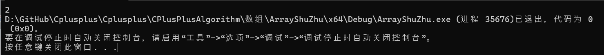

# 第15章、面向对象编程详细过程

## 15.1 — 隐藏的“this”指针和成员函数链

新程序员经常会问的一个关于类的问题是：“当调用成员函数时，C++ 如何跟踪调用该函数的对象？”。

首先，让我们定义一个简单的类。此类封装了一个整数值，并提供了一些访问函数来获取和设置该值：

```cpp
#include <iostream>

class Simple
{
private:
    int m_id{};

public:
    Simple(int id)
        : m_id{ id }
    {
    }

    int getID() const { return m_id; }
    void setID(int id) { m_id = id; }

    void print() const { std::cout << m_id; }
};

int main()
{
    Simple simple{1};
    simple.setID(2);

    simple.print();

    return 0;
}
```

正如您所期望的，该程序产生的结果：

不知何故，当我们调用时`simple.setID(2);`，C++ 知道函数`setID()`应该对对象进行操作`simple`，并且`m_id`实际上引用的是`simple.m_id`。

答案是 C++ 使用了一个隐藏指针！在本课中，我们将更详细地`this`了解一下。

### 隐藏的`this`指针

在每个成员函数内部，关键字**this**是一个 const 指针，它保存着当前隐式对象的地址。

大多数时候，我们不会`this`明确提及，而只是为了证明我们可以：

```cpp
#include <iostream>

class Simple
{
private:
    int m_id{};

public:
    Simple(int id)
        : m_id{ id }
    {
    }

    int getID() const { return m_id; }
    void setID(int id) { m_id = id; }

    void print() const { std::cout << this->m_id; } // use `this` pointer to access the implicit object and operator-> to select member m_id
};

int main()
{
    Simple simple{ 1 };
    simple.setID(2);

    simple.print();

    return 0;
}
```

这与前面的示例相同，并打印：



请注意，`print()`前两个示例中的成员函数所做的事情完全相同：

```cpp
void print() const { std::cout << m_id; }       // implicit use of this
void print() const { std::cout << this->m_id; } // explicit use of this
```

事实证明，前者是后者的简写。当我们编译程序时，编译器会隐式地为引用隐式对象的任何成员添加前缀`this->`。这有助于让我们的代码更简洁，并避免了必须反复显式编写的冗余`this->`。

**提醒**

**我们用`->`从指向对象的指针中选择一个成员。`this->m_id`相当于`(*this).m_id`。**

**我们在[第 13.12](https://www.learncpp.com/cpp-tutorial/member-selection-with-pointers-and-references/)`operator->`课中讲解了使用指针和引用进行成员选择的内容。**

### 怎么`this`設定？

让我们仔细看看这个函数调用：

```cpp
simple.setID(2);
```

尽管函数调用`setID(2)`看起来只有一个参数，但实际上有两个！编译时，编译器会将表达式重写`simple.setID(2);`如下：

```cpp
Simple::setID(&simple, 2); // note that simple has been changed from an object prefix to a function argument!
```

请注意，这现在只是一个标准函数调用，并且对象`simple`（以前是对象前缀）现在通过地址作为参数传递给函数。

但这只是答案的一半。由于函数调用现在有一个附加参数，因此成员函数定义也需要修改以接受（并使用）此参数作为参数。这是我们的原始成员函数定义`setID()`：

```cpp
void setID(int id) { m_id = id; }
```

编译器如何重写函数是特定于实现的细节，但最终结果是这样的：

```cpp
static void setID(Simple* const this, int id) { this->m_id = id; }
```

请注意，我们的`setId`函数有一个名为 的新最左边参数`this`，它是一个 const 指针（意味着它不能被重新指向，但可以修改指针的内容）。`m_id`成员也已`this->m_id`利用`this`指针重写为 。

**对于高级读者**

**在此上下文中，`static`关键字表示该函数不与类的对象相关联，而是被视为类作用域内的普通函数。我们将在第[15.7 课“静态成员函数”](https://www.learncpp.com/cpp-tutorial/static-member-functions/)中介绍静态成员函数。**

综合起来：

1. 当我们调用时`simple.setID(2)`，编译器实际上调用的是`Simple::setID(&simple, 2)`，并`simple`通过地址传递给函数。
2. 该函数有一个名为的隐藏参数`this`，它接收的地址`simple`。
3. setID() 中的成员变量以 为前缀`this->`，指向`simple`。因此，当编译器评估 时`this->m_id`，它实际上解析为`simple.m_id`。

好消息是，所有这些都是自动发生的，无论您是否记得它的工作原理，都无关紧要。您只需记住，所有非静态成员函数都有一个`this`指向调用该函数的对象的指针。

**关键见解**

**所有非静态成员函数都有一个`this`const 指针，用于保存隐式对象的地址。**

### `this`始终指向被操作的对象

新程序员有时会对有多少个`this`指针感到困惑。每个成员函数都有一个`this`指向隐式对象的指针参数。考虑一下：

```cpp
int main()
{
    Simple a{1}; // this = &a inside the Simple constructor
    Simple b{2}; // this = &b inside the Simple constructor
    a.setID(3); // this = &a inside member function setID()
    b.setID(4); // this = &b inside member function setID()

    return 0;
}
```

请注意，`this`指针交替保存对象的地址`a`或`b`取决于我们是否调用了对象`a`或的成员函数`b`。

因为`this`它只是一个函数参数（而不是成员），所以它不会使类的实例在内存方面变得更大。

### 明确引用`this`

大多数情况下，您不需要显式引用`this`指针。但是，在某些情况下这样做会很有用：

首先，如果您有一个成员函数，该函数具有与数据成员同名的参数，则可以使用以下命令消除歧义`this`：

```cpp
struct Something
{
    int data{}; // not using m_ prefix because this is a struct

    void setData(int data)
    {
        this->data = data; // this->data is the member, data is the local parameter
    }
};
```

该类`Something`有一个名为 的成员`data`。 的函数参数`setData()`也名为`data`。 在`setData()`函数内部，`data`引用函数参数（因为函数参数会遮蔽数据成员），因此如果我们要引用该`data`成员，则使用`this->data`。

有些开发人员喜欢明确地`this->`向所有类成员添加，以明确表明它们引用的是成员。我们建议您避免这样做，因为这往往会降低代码的可读性，而好处却很少。使用“m_”前缀是一种更简洁的方式来区分私有成员变量和非成员（本地）变量。

### 返回`*this`

其次，有时让成员函数返回隐式对象作为返回值会很有用。这样做的主要原因是允许成员函数“链接”在一起，因此可以在单个表达式中对同一对象调用多个成员函数！这称为**函数链接**（或**方法链接**）。

考虑这个常见的例子，你使用以下命令输出几段文本`std::cout`：

```cpp
std::cout << "Hello, " << userName;
```

编译器对上面的代码片段进行如下评估：

```cpp
(std::cout << "Hello, ") << userName;
```

首先，`operator<<`使用`std::cout`和字符串文字`"Hello, "`打印`"Hello, "`到控制台。但是，由于这是表达式的一部分，因此`operator<<`还需要返回一个值（或`void`）。如果`operator<<`返回`void`，您最终会得到以下部分求值的表达式：

```cpp
void{} << userName;
```

这显然没有任何意义（并且编译器会抛出错误）。相反，`operator<<`返回传入的流对象，在本例中为`std::cout`。这样，在`operator<<`评估第一个之后，我们得到：

```cpp
(std::cout) << userName;
```

然后打印用户的姓名。

这样，我们只需指定`std::cout`一次，然后就可以`operator<<`根据需要使用 连接任意多段文本。每次调用 都会`operator<<`返回，`std::cout`因此下一次调用 会`operator<<`使用来`std::cout`作为左操作数。

我们也可以在成员函数中实现这种行为。考虑以下类：

```cpp
class Calc
{
private:
    int m_value{};

public:

    void add(int value) { m_value += value; }
    void sub(int value) { m_value -= value; }
    void mult(int value) { m_value *= value; }

    int getValue() const { return m_value; }
};
```

如果您想要加 5、减 3 并乘以 4，则必须执行以下操作：

```cpp
#include <iostream>

int main()
{
    Calc calc{};
    calc.add(5); // returns void
    calc.sub(3); // returns void
    calc.mult(4); // returns void

    std::cout << calc.getValue() << '\n';

    return 0;
}
```

但是，如果我们让每个函数都通过引用返回，我们就可以把这些调用链接在一起。下面是具有“可链接”函数`*this`的新版本：`Calc`

```cpp
class Calc
{
private:
    int m_value{};

public:
    Calc& add(int value) { m_value += value; return *this; }
    Calc& sub(int value) { m_value -= value; return *this; }
    Calc& mult(int value) { m_value *= value; return *this; }

    int getValue() const { return m_value; }
};
```

请注意`add()`，`sub()`和`mult()`现在`*this`通过引用返回。因此，这使我们能够执行以下操作：

```cpp
#include <iostream>

int main()
{
    Calc calc{};
    calc.add(5).sub(3).mult(4); // method chaining

    std::cout << calc.getValue() << '\n';

    return 0;
}
```

我们有效地将三行代码浓缩为一个表达式！让我们仔细看看它是如何工作的。

首先，`calc.add(5)`调用 ，它将 添加`5`到`m_value`。`add()`然后返回 的引用`*this`，它是对隐式对象 的引用`calc`，因此`calc`将是后续评估中使用的对象。接下来`calc.sub(3)`进行评估，从  `m_value` 中减去`3`并再次返回 `calc`.。最后，`calc.mult(4)`利用 `m_value` 乘以3并返回 `calc`，它不会进一步使用，因此被忽略。

由于每个函数`calc`在执行时都会发生修改，因此现在`m_value`的`calc`包含值 (((0 + 5) - 3) * 4)，即`8`。

这可能是最常见的明确用法`this`，并且每当需要使用可链接的成员函数时就应该考虑它。

因为`this`总是指向隐式对象，所以我们不需要在取消引用它之前检查它是否为空指针。

### 将类重置回默认状态

如果您的类具有默认构造函数，您可能有兴趣提供一种将现有对象返回到其默认状态的方法。

如前面的课程（[14.12 -- 委托构造函数](https://www.learncpp.com/cpp-tutorial/delegating-constructors/)）中所述，构造函数仅用于初始化新对象，不应直接调用。这样做会导致意外行为。

将类重置回默认状态的最佳方法是创建一个`reset()`成员函数，让该函数创建一个新对象（使用默认构造函数），然后将该新对象分配给当前隐式对象，如下所示：

```cpp
void reset()
{
    *this = {}; // value initialize a new object and overwrite the implicit object
}
```

下面是一个完整的程序，演示了此`reset()`功能的实际效果：

```cpp
#include <iostream>

class Calc
{
private:
    int m_value{};

public:
    Calc& add(int value) { m_value += value; return *this; }
    Calc& sub(int value) { m_value -= value; return *this; }
    Calc& mult(int value) { m_value *= value; return *this; }

    int getValue() const { return m_value; }

    void reset() { *this = {}; }
};


int main()
{
    Calc calc{};
    calc.add(5).sub(3).mult(4);

    std::cout << calc.getValue() << '\n'; // prints 8

    calc.reset();

    std::cout << calc.getValue() << '\n'; // prints 0

    return 0;
}
```

### `this`和 const 对象

对于非 const 成员函数，`this`是指向非 const 值的 const 指针（意味着`this`不能指向其他内容，但指向的对象可以被修改）。对于 const 成员函数，`this`是指向 const 值的 const 指针（意味着指针不能指向其他内容，指向的对象也不能被修改）。

尝试在 const 对象上调用非常量成员函数时产生的错误可能有点难以理解：

```
错误 C2662：'int Something::getValue(void)'：无法将'this'指针从'const Something'转换为'Something &'
错误：将'const Something'作为'this'参数传递会丢弃限定符 [-fpermissive]
```

当我们在 const 对象上调用非 const 成员函数时，隐式函数参数是指向*非 const*`this`对象的 const 指针。但参数的类型为指向*const*对象的 const 指针。将指向 const 对象的指针转换为指向非 const 对象的指针需要丢弃 const 限定符，而这不能隐式完成。某些编译器生成的编译器错误反映了编译器对被要求执行此类转换的抱怨。

### 为什么是`this`指针而不是引用

由于`this`指针始终指向隐式对象（除非我们做了一些导致未定义行为的事情，否则永远不会是空指针），所以您可能想知道为什么`this`是指针而不是引用。答案很简单：当`this`它被添加到 C++ 时，引用还不存在。

如果`this`现在将它添加到 C++ 语言中，它无疑将是一个引用而不是指针。在其他更现代的 C++ 类语言中，例如 Java 和 C#，`this`则实现为引用。

## 15.2 — 类和头文件

到目前为止，我们编写的所有类都足够简单，我们能够直接在类定义本身内部实现成员函数。例如，这是一个简单`Date`类，其中所有成员函数都在类定义内部定义`Date`：

```cpp
#include <iostream>

class Date
{
private:
    int m_year{};
    int m_month{};
    int m_day{};

public:
    Date(int year, int month, int day)
        : m_year { year }
        , m_month { month }
        , m_day { day}
    {
    }

    void print() const { std::cout << "Date(" << m_year << ", " << m_month << ", " << m_day << ")\n"; };

    int getYear() const { return m_year; }
    int getMonth() const { return m_month; }
    int getDay() const { return m_day; }
};

int main()
{
    Date d { 2015, 10, 14 };
    d.print();

    return 0;
}
```

但是，随着类变得越来越长、越来越复杂，将所有成员函数定义都放在类中会使类更难管理和使用。使用已编写的类只需要了解其公共接口（公共成员函数），而不需要了解类在底层的工作方式。成员函数实现会用与实际使用类无关的细节来扰乱公共接口。

为了解决这个问题，C++ 允许我们通过在类定义之外定义成员函数将类的“声明”部分与“实现”部分分开。

以下是`Date`与上文相同的类，但构造函数和`print()`成员函数在类定义之外定义。请注意，这些成员函数的原型仍然存在于类定义内部（因为这些函数需要声明为类类型定义的一部分），但实际实现已移到外部：

```cpp
#include <iostream>

class Date
{
private:
    int m_year{};
    int m_month{};
    int m_day{};

public:
    Date(int year, int month, int day); // constructor declaration

    void print() const; // print function declaration

    int getYear() const { return m_year; }
    int getMonth() const { return m_month; }
    int getDay() const  { return m_day; }
};

Date::Date(int year, int month, int day) // constructor definition
    : m_year{ year }
    , m_month{ month }
    , m_day{ day }
{
}

void Date::print() const // print function definition
{
    std::cout << "Date(" << m_year << ", " << m_month << ", " << m_day << ")\n";
};

int main()
{
    const Date d{ 2015, 10, 14 };
    d.print();

    return 0;
}
```

成员函数可以像非成员函数一样在类定义之外定义。唯一的区别是，我们必须在成员函数名称前加上类类型的名称（在本例中为`Date::`），这样编译器就知道我们定义的是该类类型的成员，而不是非成员。

请注意，我们将访问函数定义留在了类定义中。由于访问函数通常只有一行，因此在类定义中定义这些函数只会增加很少的混乱，而将它们移到类定义之外则会导致许多额外的代码行。因此，访问函数（以及其他简单的单行函数）的定义通常留在类定义中。

### 将类定义放在头文件中

如果您在源 (.cpp) 文件中定义一个类，则该类只能在该特定源文件中使用。在较大的程序中，我们通常会在多个源文件中使用我们编写的类。

在课程[2.11 — 头文件](https://www.learncpp.com/cpp-tutorial/header-files/)中，您了解到可以将函数声明放在头文件中。然后，您可以将这些函数声明 #include 到多个代码文件（甚至多个项目中）。类也不例外。类定义可以放在头文件中，然后 #include 到任何其他想要使用该类类型的文件中。

与只需要前向声明即可使用的函数不同，编译器通常需要查看类（或任何程序定义的类型）的完整定义才能使用该类型。这是因为编译器需要了解如何声明成员才能确保正确使用它们，并且需要能够计算该类型的对象有多大才能实例化它们。所以我们的头文件通常包含类的完整定义，而不仅仅是类的前向声明。

命名类头文件和代码文件

通常，类定义在与类同名的头文件中，而类之外定义的任何成员函数都放在与类同名的 `.cpp` 文件中。

下面是我们的 Date 类，分为 `.cpp` 和 .h 文件：

`Date.h:`

```cpp
#ifndef DATE_H
#define DATE_H

class Date
{
private:
    int m_year{};
    int m_month{};
    int m_day{};

public:
    Date(int year, int month, int day);

    void print() const;

    int getYear() const { return m_year; }
    int getMonth() const { return m_month; }
    int getDay() const { return m_day; }
};

#endif
```

`Date.cpp:`

```cpp
#include "Date.h"

Date::Date(int year, int month, int day) // constructor definition
    : m_year{ year }
    , m_month{ month }
    , m_day{ day }
{
}

void Date::print() const // print function definition
{
    std::cout << "Date(" << m_year << ", " << m_month << ", " << m_day << ")\n";
};
```

现在，任何其他想要使用该类的头文件或代码文件`Date`都可以简单地`#include "Date.h"`。请注意，*Date.cpp*也需要编译到使用*Date.h*的任何项目中，以便链接器可以将对成员函数的调用连接到它们的定义。

**最佳实践**

**最好将类定义放在与类同名的头文件中。 可以在类定义中定义一些简单的成员函数（例如访问函数、空体的构造函数等）。**

**最好在与类同名的源文件中定义非平凡成员函数。**

### **如果头文件被#included多次，那么在头文件中定义类是否违反了一次定义规则？**

类型不受单一定义规则 (ODR) 的限制，该规则规定每个程序只能有一个定义。因此，将类定义纳入多个翻译单元中不存在问题。如果存在问题，那么类就没什么用了。

将类定义多次包含到单个翻译单元中仍违反 ODR。但是，标头保护（或`#pragma once`）将阻止这种情况发生。

### 内联成员函数

成员函数不免于 ODR，因此您可能想知道当成员函数在头文件中定义时我们如何避免 ODR 违规（然后可能会包含在多个翻译单元中）。

*类定义中*定义的成员函数是隐式内联的。内联函数不受一次定义规则中每个程序一次定义的限制。

*在类定义之外*定义的成员函数不是隐式内联的（因此要遵守一次定义规则中每个程序一次定义部分）。这就是为什么这些函数通常在代码文件中定义（它们在整个程序中只有一个定义）。

另外，如果在类定义之外定义的成员函数被设为内联函数（使用关键字），则可以将其保留在头文件中`inline`。下面是我们的*`Date.h`*头文件，其中在类之外定义的成员函数标记为`inline`：

`Date.h:`

```C++
#ifndef DATE_H
#define DATE_H

#include <iostream>

class Date
{
private:
    int m_year{};
    int m_month{};
    int m_day{};

public:
    Date(int year, int month, int day);

    void print() const;

    int getYear() const { return m_year; }
    int getMonth() const { return m_month; }
    int getDay() const { return m_day; }
};

inline Date::Date(int year, int month, int day) // now inline
    : m_year{ year }
    , m_month{ month }
    , m_day{ day }
{
}

inline void Date::print() const // now inline
{
    std::cout << "Date(" << m_year << ", " << m_month << ", " << m_day << ")\n";
};

#endif
```

这个*`Date.h`*可以毫无问题地包含在多个翻译单元中。

**关键见解**

**类定义内部定义的函数是隐式内联的，这允许它们被#included 到多个代码文件中而不会违反 ODR。**

**在类定义之外定义的函数不是隐式内联的。可以使用`inline`关键字将它们变为内联。**

### 成员函数的内联扩展

编译器必须能够看到函数的完整定义才能执行内联扩展。大多数情况下，此类函数（例如访问函数）是在类定义内部定义的。但是，如果您想在类定义之外定义成员函数，但仍希望它有资格进行内联扩展，则可以将其定义为类定义下方的内联函数（在同一个头文件中）。这样，任何使用 #include 头文件的人都可以访问该函数的定义。

### 那么为什么不把所有内容都放在头文件中呢？

您可能想将所有成员函数定义放入头文件中，要么放在类定义中，要么作为类定义下的内联函数。虽然这可以编译，但这样做有几个缺点。

首先，如上所述，在类定义中定义成员会使类定义变得混乱。

其次，如果您更改了标头中的任何代码，则需要重新编译包含该标头的每个文件。这可能会产生连锁反应，一个小的更改会导致整个程序需要重新编译。重新编译的成本可能相差很大：小型项目可能只需一分钟或更短的时间即可构建，而大型商业项目则可能需要数小时。

相反，如果您更改 .cpp 文件中的代码，则只需重新编译该 .cpp 文件。因此，如果可以选择，通常最好将非平凡代码放在 .cpp 文件中。

在某些情况下，违反将类定义放在标头中并将非平凡成员函数放在代码文件中的最佳实践可能是有意义的。

首先，对于仅在一个代码文件中使用且不打算进行一般重用的小类，您可能更愿意直接在使用它的单个 .cpp 文件中定义该类（和所有成员函数）。这有助于明确表明该类仅在该单个文件中使用，并不打算进行更广泛的使用。如果您后来发现要在多个文件中使用该类，或者发现类和成员函数定义使源文件变得混乱，您可以随时将该类移动到单独的头文件/代码文件中。

其次，如果一个类只有少量不重要的成员函数，并且不太可能发生变化，那么创建一个只包含一两个定义的 .cpp 文件可能不值得（因为它会使你的项目变得混乱）。在这种情况下，最好创建成员函数`inline`并将它们放在标题中的类定义下面。

第三，在现代 C++ 中，类或库越来越多地以“仅包含头文件”的形式分发，这意味着类或库的所有代码都放在头文件中。这样做主要是为了使分发和使用此类文件更加容易，因为头文件只需 #included，而代码文件需要明确添加到使用它的每个项目中，以便可以编译。如果有意创建仅包含头文件的类或库进行分发，则可以创建所有非平凡成员函数`inline`并将其放在类定义下的头文件中。

最后，对于模板类，在类外部定义的模板成员函数几乎总是在头文件内部、类定义下方定义。与非成员模板函数一样，编译器需要查看完整的模板定义才能实例化它。我们将在第[15.5 课——带有成员函数的类模板](https://www.learncpp.com/cpp-tutorial/class-templates-with-member-functions/)中介绍模板成员函数。

**作者注**

**在以后的课程中，我们的大多数类都将在单个 .cpp 文件中定义，所有函数都直接在类定义中实现。这样做是为了让示例简洁且易于自己编译。在实际项目中，将类放在自己的代码和头文件中更为常见，您应该习惯这样做。**

### **成员函数的默认参数**

在课程[11.5 -- 默认参数](https://www.learncpp.com/cpp-tutorial/default-arguments/)中，我们讨论了非成员函数默认参数的最佳实践：“如果函数具有前向声明（尤其是头文件中的声明），则将默认参数放在那里。否则，将默认参数放在函数定义中。”

因为成员函数总是被声明（或定义）为类定义的一部分，所以成员函数的最佳实践实际上更简单：始终将默认参数放在类定义中。

**最佳实践**

**将成员函数的任何默认参数放在类定义内。**

### 图书馆

在整个程序中，您使用了标准库中的类，例如`std::string`。要使用这些类，您只需 #include 相关标头（例如`#include <string>`）。请注意，您无需在项目中添加任何代码文件（例如`string.cpp`或）。`iostream.cpp`

头文件提供了编译器所需的声明，以便验证您编写的程序在语法上是否正确。但是，属于 C++ 标准库的类的实现包含在预编译文件中，该文件在链接阶段自动链接。您永远看不到代码。

许多开源软件包都提供 .h 和 .cpp 文件供您编译到程序中。但是，大多数商业库仅提供 .h 文件和预编译库文件。这样做有几个原因：1) 链接预编译库比每次需要时重新编译它更快，2) 预编译库的单个副本可以由许多应用程序共享，而编译后的代码会被编译到使用它的每个可执行文件中（这会增加文件大小），3) 知识产权原因（您不希望有人窃取您的代码）。

我们在附录中讨论了如何将第三方预编译库包含到您的项目中。

虽然您可能暂时不会创建和分发自己的库，但将类分为头文件和源文件不仅是一种好的做法，而且还能让您更轻松地创建自己的自定义库。创建自己的库超出了这些教程的范围，但如果您想分发预编译的二进制文件，则将声明和实现分开是这样做的先决条件。

### **测验**

#### **问题 #1**

在类定义之外定义成员函数的目的是什么？
a) 使类定义更简短、更易于管理。
b) 将公共接口与实现细节分开。
c) 在源文件中定义时，当实现细节发生变化时，尽量减少重新编译时间。
**d) 以上所有。**

如何在类定义之外定义成员函数？
a) 只需将函数定义为普通函数，不带任何类前缀。
**b) 使用范围解析运算符 (::) 为类名添加前缀来定义函数。**
c) 在类定义内部声明该函数，并使用 friend 关键字在外部定义它。
d) 以上都不是。

什么时候应该在类定义中定义琐碎的成员函数？
a) 总是，以提高性能。
**b) 当函数只有一行代码时。**
c) 当函数被频繁调用时
d) 不建议在类定义中定义任何成员函数。

类定义应放在哪里以方便在多个文件或项目中重用？
a) 在与类同名的 `.cpp` 文件中。
**b) 在与类同名的单独头文件中。**
c) 在包含头文件的 `.cpp` 文件中。
d) 代码中的任何地方，只要函数是在类之外定义的。

以下哪项关于类和成员函数的一次定义规则的说法是正确的？
a) 禁止在头文件中定义类。
b) 允许在同一个文件中多次包含类定义。
**c) 类内部定义的成员函数不受一次定义规则的约束。**
d) 非平凡成员函数应始终在头文件中定义。

## 15.3 — 嵌套类型（成员类型）

考虑以下简短的程序：

```c++
#include <iostream>

enum class FruitType
{
	apple,
	banana,
	cherry
};

class Fruit
{
private:
	FruitType m_type { };
	int m_percentageEaten { 0 };

public:
	Fruit(FruitType type) :
		m_type { type }
	{
	}

	FruitType getType() { return m_type; }
	int getPercentageEaten() { return m_percentageEaten; }

	bool isCherry() { return m_type == FruitType::cherry; }

};

int main()
{
	Fruit apple { FruitType::apple };

	if (apple.getType() == FruitType::apple)
		std::cout << "I am an apple";
	else
		std::cout << "I am not an apple";

	return 0;
}
```

这个程序没什么问题。但是因为`enum class FruitType`它是要与`Fruit`类一起使用的，所以让它独立于类存在让我们可以推断它们是如何连接的。

### 嵌套类型（成员类型）

到目前为止，我们已经看到了具有两种不同成员的类类型：数据成员和成员函数。`Fruit`上例中的类同时具有这两种成员。

类类型支持另一种成员：**嵌套类型**（也称为**成员类型**）。要创建嵌套类型，只需在类内部使用适当的访问说明符定义类型即可。

这是与上面相同的程序，重写为使用类内部定义的嵌套类型`Fruit`：

```C++
#include <iostream>

class Fruit
{
public:
	// FruitType has been moved inside the class, under the public access specifier
        // We've also renamed it Type and made it an enum rather than an enum class
	enum Type
	{
		apple,
		banana,
		cherry
	};

private:
	Type m_type {};
	int m_percentageEaten { 0 };

public:
	Fruit(Type type) :
		m_type { type }
	{
	}

	Type getType() { return m_type;  }
	int getPercentageEaten() { return m_percentageEaten;  }

	bool isCherry() { return m_type == cherry; } // Inside members of Fruit, we no longer need to prefix enumerators with FruitType::
};

int main()
{
	// Note: Outside the class, we access the enumerators via the Fruit:: prefix now
	Fruit apple { Fruit::apple };

	if (apple.getType() == Fruit::apple)
		std::cout << "I am an apple";
	else
		std::cout << "I am not an apple";

	return 0;
}
```

这里有几点值得指出。

首先，请注意，`FruitType`现在是在类内部定义的，`Type`由于我们稍后将讨论的原因，它已被重命名。

第二，嵌套类型`Type`已经在类的顶部定义。嵌套类型名必须完全定义后才能使用，因此通常先定义它们。

**最佳实践**

**在类类型的顶部定义任何嵌套类型。**

第三，嵌套类型遵循正常的访问规则。在访问说明`Type`符下定义`public`，以便类型名称和枚举器可以被公众直接访问。

第四，类类型充当在其中声明的名称的作用域，就像命名空间一样。因此的完全限定名称`Type`是`Fruit::Type`，枚举器的完全限定名称`apple`是`Fruit::apple`。

在类的成员中，我们不需要使用完全限定的名称。例如，在成员函数中，`isCherry()`我们`cherry`无需使用`Fruit::`范围限定符即可访问枚举器。

在类外，我们必须使用完全限定名称（例如`Fruit::apple`）。我们将其重命名`FruitType`为`Type`，以便可以以 的形式访问它`Fruit::Type`（而不是更冗余的`Fruit::FruitType`）。

最后，我们将枚举类型从有作用域改为无作用域。由于类本身现在充当作用域区域，因此使用有作用域的枚举器也有些多余。更改为无作用域枚举意味着我们可以访问枚举器，而如果枚举器有作用域，则必须使用`Fruit::apple`更长时间。`Fruit::Type::apple`

### 嵌套 typedef 和类型别名

类类型还可以包含嵌套的 typedef 或类型别名：

```C++
#include <iostream>
#include <string>
#include <string_view>

class Employee
{
public:
    using IDType = int;

private:
    std::string m_name{};
    IDType m_id{};
    double m_wage{};

public:
    Employee(std::string_view name, IDType id, double wage)
        : m_name { name }
        , m_id { id }
        , m_wage { wage }
    {
    }

    const std::string& getName() { return m_name; }
    IDType getId() { return m_id; } // can use unqualified name within class
};

int main()
{
    Employee john { "John", 1, 45000 };
    Employee::IDType id { john.getId() }; // must use fully qualified name outside class

    std::cout << john.getName() << " has id: " << id << '\n';

    return 0;
}
```

这将打印：

```
John 的 ID 为：1
```

请注意，在类内部我们可以直接使用`IDType`，但在类外部我们必须使用完全限定名称`Employee::IDType`。

[我们在第 10.7 课——类型定义和类型别名](https://www.learncpp.com/cpp-tutorial/typedefs-and-type-aliases/)中讨论了类型别名的好处，它们在这里起到了相同的作用。C++ 标准库中的类使用嵌套类型定义是很常见的。截至撰写本文时，`std::string`已定义了十个嵌套类型定义！

### 嵌套类和对外部类成员的访问

类中嵌套其他类的情况相当少见，但这种情况是有可能的。在 C++ 中，嵌套类无法访问`this`外部（包含）类的指针，因此嵌套类无法直接访问外部类的成员。这是因为嵌套类可以独立于外部类进行实例化（在这种情况下，没有外部类成员可以访问！）

但是，由于嵌套类是外部类的成员，因此它们可以访问范围内的外部类的任何私有成员。

我们举个例子来说明一下：

```cpp
#include <iostream>
#include <string>
#include <string_view>

class Employee
{
public:
    using IDType = int;

    class Printer
    {
    public:
        void print(const Employee& e) const
        {
            // Printer can't access Employee's `this` pointer
            // so we can't print m_name and m_id directly
            // Instead, we have to pass in an Employee object to use
            // Because Printer is a member of Employee,
            // we can access private members e.m_name and e.m_id directly
            std::cout << e.m_name << " has id: " << e.m_id << '\n';
        }
    };

private:
    std::string m_name{};
    IDType m_id{};
    double m_wage{};

public:
    Employee(std::string_view name, IDType id, double wage)
        : m_name{ name }
        , m_id{ id }
        , m_wage{ wage }
    {
    }

    // removed the access functions in this example (since they aren't used)
};

int main()
{
    const Employee john{ "John", 1, 45000 };
    const Employee::Printer p{}; // instantiate an object of the inner class
    p.print(john);

    return 0;
}
```

这将打印：

```
John 的 ID 为：1
```

有一种情况更常用嵌套类。在标准库中，大多数迭代器类都是作为它们设计用于迭代的容器的嵌套类实现的。例如，`std::string::iterator`是作为的嵌套类实现的`std::string`。我们将在以后的章节中介绍迭代器。

### 嵌套类型不能被前向声明

嵌套类型还有一个值得一提的限制——嵌套类型不能被前向声明。这个限制可能会在 C++ 的未来版本中取消。

## 15.4 — 析构函数简介

假设您正在编写一个需要通过网络发送一些数据的程序。但是，建立与服务器的连接非常昂贵，因此您希望收集一堆数据，然后一次性发送所有数据。这样的类可能结构如下：

```cpp
// This example won't compile because it is (intentionally) incomplete
class NetworkData
{
private:
    std::string m_serverName{};
    DataStore m_dataQueue{};

public:
	NetworkData(std::string_view serverName)
		: m_serverName { serverName }
	{
	}

	void addData(std::string_view data)
	{
		m_dataQueue.add(data);
	}

	void sendData()
	{
		// connect to server
		// send all data
		// clear data
	}
};

int main()
{
    NetworkData n("someipAddress");

    n.addData("somedata1");
    n.addData("somedata2");

    n.sendData();

    return 0;
}
```

但是，这`NetworkData`有一个潜在的问题。它依赖于`sendData()`在程序关闭之前明确调用。如果用户`NetworkData`忘记这样做，数据将不会发送到服务器，并且在程序退出时会丢失。现在，您可能会说，“嗯，记住这样做并不难！”，在这个特定情况下，你是对的。但请考虑一个稍微复杂一点的例子，比如这个函数：

```cpp
bool someFunction()
{
    NetworkData n("someipAddress");

    n.addData("somedata1");
    n.addData("somedata2");

    if (someCondition)
        return false;

    n.sendData();
    return true;
}
```

在这种情况下，如果`someCondition`是`true`，那么函数将提前返回，并且`sendData()`不会被调用。这是一个更容易犯的错误，因为调用`sendData()`是存在的，程序只是不会在所有情况下都指向它。

概括这个问题，使用资源（通常是内存，但有时是文件、数据库、网络连接等）的类通常需要在销毁使用它们的类对象之前明确发送或关闭。在其他情况下，我们可能希望在销毁对象之前进行一些记录，例如将信息写入日志文件或将遥测数据发送到服务器。术语“清理”通常用于指类在销毁该类的对象之前必须执行的任何一组任务，以便按预期运行。如果我们必须依赖此类的用户来确保在销毁对象之前调用执行清理的函数，我们可能会在某个地方遇到错误。

但是我们为什么还要要求用户确保这一点呢？如果对象正在被销毁，那么我们知道此时需要执行清理。清理应该自动进行吗？

### 析构函数来拯救你

在第 14.9课[——构造函数简介](https://www.learncpp.com/cpp-tutorial/introduction-to-constructors/)中，我们介绍了构造函数，它们是创建非聚合类类型的对象时调用的特殊成员函数。构造函数用于初始化成员变量，并执行任何其他设置任务，以确保类的对象可供使用。

类似地，类有另一种特殊的成员函数，当非聚合类类型的对象被销毁时，该函数会自动调用。此函数称为**析构**函数。析构函数旨在允许类在销毁该类的对象之前进行任何必要的清理。

### 析构函数命名

与构造函数类似，析构函数也有特定的命名规则：

1. 析构函数必须与类具有相同的名称，并且前面带有波浪符号 (~)。
2. 析构函数不能接受参数。
3. 析构函数没有返回类型。

一个类只能有一个析构函数。

一般来说，您不应该明确调用析构函数（因为它会在对象被销毁时自动调用），因为很少有情况您想要多次清理对象。

析构函数示例

```cpp
#include <iostream>

class Simple
{
private:
    int m_id {};

public:
    Simple(int id)
        : m_id { id }
    {
        std::cout << "Constructing Simple " << m_id << '\n';
    }

    ~Simple() // here's our destructor
    {
        std::cout << "Destructing Simple " << m_id << '\n';
    }

    int getID() const { return m_id; }
};

int main()
{
    // Allocate a Simple
    Simple simple1{ 1 };
    {
        Simple simple2{ 2 };
    } // simple2 dies here

    return 0;
} // simple1 dies here
```

该程序产生以下结果：

注意，每个`Simple`对象被销毁时，都会调用析构函数，并打印一条消息。“Destructing Simple 1”打印在“Destructing Simple 2”之后，因为`simple2`在函数结束之前就被销毁了，而`simple1`直到 结束才被销毁`main()`。

请记住，静态变量（包括全局变量和静态局部变量）是在程序启动时构造的，并在程序关闭时销毁。

### 改进 `NetworkData` 程序

回到课程顶部的例子，我们可以`sendData()`通过使用析构函数调用该函数来消除用户明确调用的需要：

```C++
class NetworkData
{
private:
    std::string m_serverName{};
    DataStore m_dataQueue{};

public:
	NetworkData(std::string_view serverName)
		: m_serverName { serverName }
	{
	}

	~NetworkData()
	{
		sendData(); // make sure all data is sent before object is destroyed
	}

	void addData(std::string_view data)
	{
		m_dataQueue.add(data);
	}

	void sendData()
	{
		// connect to server
		// send all data
		// clear data
	}
};

int main()
{
    NetworkData n("someipAddress");

    n.addData("somedata1");
    n.addData("somedata2");

    return 0;
}
```

有了这样的析构函数，我们的`NetworkData`对象将始终在对象被销毁之前发送它拥有的任何数据！清理会自动进行，这意味着发生错误的机会更少，需要考虑的事情也更少。

### 隐式析构函数

如果非聚合类类型对象没有用户声明的析构函数，编译器将生成一个具有空体的析构函数。这种析构函数称为隐式析构函数，它实际上只是一个占位符。

如果您的类不需要在销毁时进行任何清理，那么根本不需要定义析构函数，并让编译器为您的类生成一个隐式析构函数。

### `std::exit()`关于该函数的警告

在课程[8.12 — Halts（提前退出程序）](https://www.learncpp.com/cpp-tutorial/halts-exiting-your-program-early/)中，我们讨论了`std::exit()`可用于立即终止程序的函数。当程序立即终止时，程序将直接结束。局部变量不会首先被销毁，因此不会调用任何析构函数。在这种情况下，如果您依赖析构函数进行必要的清理工作，请务必小心。

**对于高级读者**

**未处理的异常也会导致程序终止，并且可能不会在终止之前展开堆栈。如果没有展开堆栈，则在程序终止之前不会调用析构函数。**

## 15.5 — 具有成员函数的类模板

在课程[11.6 -- 函数模板](https://www.learncpp.com/cpp-tutorial/function-templates/)中，我们了解了函数模板：

```C++
template <typename T> // this is the template parameter declaration
T max(T x, T y) // this is the function template definition for max<T>
{
    return (x < y) ? y : x;
}
```

使用函数模板，我们可以定义类型模板参数（例如`typename T`），然后将它们用作函数参数的类型（`T x, T y`）。

在课程[13.13 -- 类模板](https://www.learncpp.com/cpp-tutorial/class-templates/)中，我们介绍了类模板，它允许我们将类型模板参数用于类类型（结构体、类和联合）的数据成员的类型：

```cpp
#include <iostream>

template <typename T>
struct Pair
{
    T first{};
    T second{};
};

// Here's a deduction guide for our Pair (required in C++17 or older)
// Pair objects initialized with arguments of type T and T should deduce to Pair<T>
template <typename T>
Pair(T, T) -> Pair<T>;

int main()
{
    Pair<int> p1{ 5, 6 };        // instantiates Pair<int> and creates object p1
    std::cout << p1.first << ' ' << p1.second << '\n';

    Pair<double> p2{ 1.2, 3.4 }; // instantiates Pair<double> and creates object p2
    std::cout << p2.first << ' ' << p2.second << '\n';

    Pair<double> p3{ 7.8, 9.0 }; // creates object p3 using prior definition for Pair<double>
    std::cout << p3.first << ' ' << p3.second << '\n';

    return 0;
}
```

**相关内容**

**[我们在第 13.14 课——类模板参数推导（CTAD）和推导指南](https://www.learncpp.com/cpp-tutorial/class-template-argument-deduction-ctad-and-deduction-guides/#DeductionGuide)中讨论了推导指南。**

在本课中，我们将结合函数模板和类模板的元素，仔细研究具有成员函数的类模板。

### 成员函数中的类型模板参数

作为类模板参数声明的一部分定义的类型模板参数既可以用作数据成员的类型，也可以用作成员函数参数的类型。

在下面的例子中，我们重写上面的`Pair`类模板，将其从结构体转换为类：

```cpp
#include <ios>       // for std::boolalpha
#include <iostream>

template <typename T>
class Pair
{
private:
    T m_first{};
    T m_second{};

public:
    // When we define a member function inside the class definition,
    // the template parameter declaration belonging to the class applies
    Pair(const T& first, const T& second)
        : m_first{ first }
        , m_second{ second }
    {
    }

    bool isEqual(const Pair<T>& pair);
};

// When we define a member function outside the class definition,
// we need to resupply a template parameter declaration
template <typename T>
bool Pair<T>::isEqual(const Pair<T>& pair)
{
    return m_first == pair.m_first && m_second == pair.m_second;
}

int main()
{
    Pair p1{ 5, 6 }; // uses CTAD to infer type Pair<int>
    std::cout << std::boolalpha << "isEqual(5, 6): " << p1.isEqual( Pair{5, 6} ) << '\n';
    std::cout << std::boolalpha << "isEqual(5, 7): " << p1.isEqual( Pair{5, 7} ) << '\n';

    return 0;
}
```

以上内容应该非常简单，但有几点值得注意。

首先，因为我们的类有私有成员，所以它不是聚合，因此不能使用聚合初始化。相反，我们必须使用构造函数来初始化我们的类对象。

由于我们的类数据成员是 类型`T`，我们将构造函数的参数设为 类型`const T&`，这样用户就可以提供相同类型的初始化值。由于`T`复制成本可能很高，因此通过 const 引用传递比通过值传递更安全。

请注意，当我们在类模板定义中定义成员函数时，我们不需要为成员函数提供模板参数声明。此类成员函数隐式使用类模板参数声明。

其次，CTAD 不需要推导指南来处理非聚合类。匹配的构造函数为编译器提供了从初始化器推导模板参数所需的信息。

第三，让我们更仔细地看一下在类模板定义之外为类模板定义成员函数的情况：

```cpp
template <typename T>
bool Pair<T>::isEqual(const Pair<T>& pair)
{
    return m_first == pair.m_first && m_second == pair.m_second;
}
```

由于这个成员函数定义与类模板定义是分开的，我们需要重新提供模板参数声明（`template <typename T>`），以便编译器知道`T`是什么。

另外，当我们在类之外定义成员函数时，我们需要用类模板的完全模板名称（`Pair<T>::isEqual`，而不是`Pair::isEqual`）来限定成员函数名称。

### 注入的类名

在之前的课程中，我们注意到构造函数的名称必须与类的名称匹配。但在`Pair<T>`上面的类模板中，我们将构造函数命名为`Pair`，而不是`Pair<T>`。即使名称不匹配，这仍然有效。

在类的范围内，类的非限定名称称为**注入类名**。在类模板中，注入类名是完全模板名称的简写。

因为`Pair`是注入的类名`Pair<T>`，在我们的类模板范围内`Pair<T>`，任何 的使用都`Pair`将被视为我们改写`Pair<T>`的。因此，尽管我们将构造函数命名为`Pair`，但编译器会将其视为我们改写的`Pair<T>`。名称现在匹配！

这意味着我们也可以`isEqual()`像这样定义我们的成员函数：

```cpp
template <typename T>
bool Pair<T>::isEqual(const Pair& pair) // note the parameter has type Pair, not Pair<T>
{
    return m_first == pair.m_first && m_second == pair.m_second;
}
```

因为这是 的成员函数定义`Pair<T>`，所以我们处于类模板的范围内`Pair<T>`。因此， 的任何使用`Pair`都是 的简写`Pair<T>`！

**关键见解**

**在课程[13.14 — 类模板参数推导 (CTAD) 和推导指南](https://www.learncpp.com/cpp-tutorial/class-template-argument-deduction-ctad-and-deduction-guides/)中，我们指出 CTAD 不适用于函数参数（因为它是参数推导，而不是参数推导）。但是，使用注入的类名作为函数参数是可以的，因为它是完全模板化名称的简写，而不是 CTAD 的用法。**

**最佳实践**

**任何在类定义之外定义的成员函数模板都应该在类定义下方定义（在同一文件中）。**

### **测验**

#### 问题 #1

编写一个名为 Triad 的类模板，该模板具有 3 个私有数据成员和独立的类型模板参数。该类应具有构造函数、访问函数和`print()`在类外部定义的成员函数。

下面的程序应该可以编译并运行：

```cpp
#include <iostream>
#include <string>

int main()
{
	Triad<int, int, int> t1{ 1, 2, 3 };
	t1.print();
	std::cout << '\n';
	std::cout << t1.first() << '\n';

	using namespace std::literals::string_literals;
	const Triad t2{ 1, 2.3, "Hello"s };
	t2.print();
	std::cout << '\n';

	return 0;
}
```

```C++
#include <iostream>
#include <string>

template <typename T, typename U, typename V>
class Triad
{
private:
	T m_first{};
	U m_second{};
	V m_third{};

public:
	Triad(const T& first, const U& second, const V& third)
		: m_first{ first }
		, m_second{ second }
		, m_third{ third }
	{
	}

	const T& first() const { return m_first; }
	const U& second() const { return m_second; }
	const V& third() const { return m_third; }

	void print() const;
};

template <typename T, typename U, typename V>
void Triad<T, U, V>::print() const
{
	std::cout << '[' << m_first << ", " << m_second << ", " << m_third << ']' ;
}

int main()
{
	Triad<int, int, int> t1{ 1, 2, 3 };
	t1.print();
	std::cout << '\n';
	std::cout << t1.first() << '\n';

	using namespace std::literals::string_literals;
	const Triad t2{ 1, 2.3, "Hello"s };
	t2.print();
	std::cout << '\n';

	return 0;
}
```

#### 问题 #2

`const`如果我们从函数声明和定义中删除`print()`，程序将不再编译。为什么不呢？

`t2`是一个 const 对象，因此只能在 上调用 const 成员函数`t2`。如果我们创建了`print()`一个非 const 成员函数，则`t2`不允许调用它。这是因为非 const 成员函数可能会修改隐式对象，这将违反 const 对象的 constness（`t2`在本例中）。

## 15.6 — 静态成员变量

在课程[7.4 — 全局变量简介](https://www.learncpp.com/cpp-tutorial/introduction-to-global-variables/)中，我们介绍了全局变量，在课程[7.10 — 静态局部变量](https://www.learncpp.com/cpp-tutorial/static-local-variables/)中，我们介绍了静态局部变量。这两种类型的变量都具有静态持续时间，这意味着它们是在程序开始时创建的，并在程序结束时销毁。即使超出范围，此类变量也会保留其值。

例如：

```C++
#include <iostream>

int generateID()
{
    static int s_id{ 0 }; // static local variable
    return ++s_id;
}

int main()
{
    std::cout << generateID() << '\n';
    std::cout << generateID() << '\n';
    std::cout << generateID() << '\n';

    return 0;
}
```


请注意，静态局部变量`s_id`在多次函数调用中保持其值。

类类型为该关键字带来了另外两种用途`static`：静态成员变量和静态成员函数。幸运的是，这些用途相当简单。我们将在本课中讨论静态成员变量，并在下一课中讨论静态成员函数。

### 静态成员变量

在我们讨论将 static 关键字应用于成员变量之前，首先考虑以下类：

```cpp
#include <iostream>

struct Something
{
    int value{ 1 };
};

int main()
{
    Something first{};
    Something second{};

    first.value = 2;

    std::cout << first.value << '\n';
    std::cout << second.value << '\n';

    return 0;
}
```

当我们实例化一个类对象时，每个对象都会获得所有常规成员变量的副本。在本例中，由于我们声明了两个`Something`类对象，因此最终得到了 的两个副本`value`：`first.value`和`second.value`。`first.value`不同于`second.value`。因此，上述程序打印：

```
2
1
```

类的成员变量可以使用关键字设为静态`static`。与普通成员变量不同，**静态成员变量**由类的所有对象共享。考虑以下程序，与上述程序类似：

```cpp
#include <iostream>

struct Something
{
    static int s_value; // now static
};

int Something::s_value{ 1 }; // initialize s_value to 1

int main()
{
    Something first{};
    Something second{};

    first.s_value = 2;

    std::cout << first.s_value << '\n';
    std::cout << second.s_value << '\n';
    return 0;
}
```

该程序产生以下输出：

```
2
2
```

因为`s_value`是静态成员变量，`s_value`所以在类的所有对象之间共享。因此，`first.s_value`与是同一个变量`second.s_value`。上面的程序表明，我们使用设置的值`first`可以使用来访问`second`！

### 静态成员不与类对象关联

虽然你可以通过类的对象访问静态成员（如上例中所示`first.s_value`）`second.s_value`，但即使没有实例化类的对象，静态成员也存在！这是有道理的：它们是在程序开始时创建的，并在程序结束时销毁，因此它们的生命周期不像普通成员那样绑定到类对象。

本质上，静态成员是存在于类的作用域内的全局变量。类的静态成员和命名空间内的普通变量之间几乎没有区别。

**关键见解**

**静态成员是位于类的范围区域内的全局变量。**

因为静态成员`s_value`独立于任何类对象而存在，所以可以使用类名和范围解析运算符（在本例中为）直接访问它`Something::s_value`：

```cpp
class Something
{
public:
    static int s_value; // declares the static member variable
};

int Something::s_value{ 1 }; // defines the static member variable (we'll discuss this section below)

int main()
{
    // note: we're not instantiating any objects of type Something

    Something::s_value = 2;
    std::cout << Something::s_value << '\n';
    return 0;
}
```

在上面的代码片段中，`s_value`是通过类名`Something`而不是通过对象来引用的。请注意，我们甚至还没有实例化类型的对象`Something`，但我们仍然可以访问和使用`Something::s_value`。这是访问静态成员的首选方法。

### 最佳实践

使用类名和范围解析运算符（::）访问静态成员。

### 定义和初始化静态成员变量

当我们在类类型中声明静态成员变量时，我们会告诉编译器静态成员变量的存在，但实际上并没有定义它（很像前向声明）。因为静态成员变量本质上是全局变量，所以您必须在类之外的全局范围内显式定义（并可选地初始化）静态成员。

在上面的例子中，我们通过以下代码进行操作：

```cpp
int Something::s_value{ 1 }; // defines the static member variable
```

此行有两个目的：实例化静态成员变量（就像全局变量一样），并初始化它。在本例中，我们提供初始化值`1`。如果没有提供初始化器，则静态成员变量默认为零初始化。

请注意，此静态成员定义不受访问控制：即使该值在类中被声明为私有（或受保护），您也可以定义和初始化该值（因为定义不被视为一种访问形式）。

对于非模板类，如果类是在头文件 (.h) 中定义的，则静态成员定义通常放在类的关联代码文件中（例如`Something.cpp`）。如果类是在源文件 (.cpp) 中定义的，则静态成员定义通常直接放在类的下面。不要将静态成员定义放在头文件中（与全局变量非常相似，如果该头文件被多次包含，则最终会得到多个定义，这将导致链接器错误）。

对于模板类，（模板化的）静态成员定义通常直接放在模板类下面。

### 类定义内部静态成员变量的初始化

上述内容有几个快捷方式。首先，当静态成员是常量整型（包括`char`和`bool`）或 const 枚举时，可以在类定义中初始化静态成员：

```cpp
class Whatever
{
public:
    static const int s_value{ 4 }; // a static const int can be defined and initialized directly
};
```

在上面的例子中，由于静态成员变量是 const int，因此不需要显式定义行。允许这种快捷方式是因为这些特定的 const 类型是编译时常量。

在课程[7.9 -- 跨多个文件共享全局常量（使用内联变量）](https://www.learncpp.com/cpp-tutorial/sharing-global-constants-across-multiple-files-using-inline-variables/)中，我们介绍了内联变量，即允许有多个定义的变量。C++17 允许静态成员成为内联变量：

```cpp
class Whatever
{
public:
    static inline int s_value{ 4 }; // a static inline variable can be defined and initialized directly
};
```

此类变量无论是否为常量，都可以在类定义内部初始化。这是定义和初始化静态成员的首选方法。

因为`constexpr`成员是隐式内联的（从 C++17 开始），所以静态`constexpr`成员也可以在类定义内部初始化，而无需明确使用关键字`inline`：

```cpp
#include <string_view>

class Whatever
{
public:
    static constexpr double s_value{ 2.2 }; // ok
    static constexpr std::string_view s_view{ "Hello" }; // this even works for classes that support constexpr initialization
};
```

**最佳实践**

**使你的静态成员`inline`能够`constexpr`在类定义内部被初始化。**

### 静态成员变量的示例

为什么要在类中使用静态变量？一种用途是为类的每个实例分配一个唯一的 ID。以下是示例：

```cpp
#include <iostream>

class Something
{
private:
    static inline int s_idGenerator { 1 };
    int m_id {};

public:
    // grab the next value from the id generator
    Something() : m_id { s_idGenerator++ }
    {
    }

    int getID() const { return m_id; }
};

int main()
{
    Something first{};
    Something second{};
    Something third{};

    std::cout << first.getID() << '\n';
    std::cout << second.getID() << '\n';
    std::cout << third.getID() << '\n';
    return 0;
}
```

该程序打印：

```
1
2
3
```

由于`s_idGenerator`被所有`Something`对象共享，因此当创建`Something`新对象时，构造函数会使用  `m_id` 的当前值进行初始化，然后 `s_idGenerator` 为下一个对象增加该值。这保证了每个实例化的 `Something` 对象都会收到一个唯一的 ID（按创建顺序递增）。

为每个对象赋予一个唯一的 ID 有助于调试，因为它可用于区分具有相同数据的对象。处理数据数组时尤其如此。

当类需要使用查找表（例如用于存储一组预先计算的值的数组）时，静态成员变量也很有用。通过使查找表成为静态的，所有对象都只有一个副本，而不是为每个实例化的对象制作一个副本。这可以节省大量内存。

### 只有静态成员可以使用类型推断（`auto`和 CTAD）

静态成员可以用来`auto`从初始化程序中推断其类型，或者用来从初始化程序中推断模板参数推导 (CTAD) 推断模板类型参数。

非静态成员不得使用`auto`或 CTAD。

做出这种区分的原因相当复杂，但归根结底是因为非静态成员可能会出现某些情况，导致歧义或不直观的结果。静态成员不会出现这种情况。因此，非静态成员被限制使用这些功能，而静态成员则不会。

```cpp
#include <utility> // for std::pair<T, U>

class Foo
{
private:
    auto m_x { 5 };           // auto not allowed for non-static members
    std::pair m_v { 1, 2.3 }; // CTAD not allowed for non-static members

    static inline auto s_x { 5 };           // auto allowed for static members
    static inline std::pair s_v { 1, 2.3 }; // CTAD allowed for static members

public:
    Foo() {};
};

int main()
{
    Foo foo{};

    return 0;
}
```

## 15.7 — 静态成员函数

在上一课**[15.6 -- 静态成员变量]**中，您了解到静态成员变量是属于类而不是类的对象的成员变量。 如果静态成员变量是公共的，则可以使用类名和作用域解析运算符直接访问它：

```cpp
#include <iostream>

class Something
{
public:
    static inline int s_value { 1 };
};

int main()
{
    std::cout << Something::s_value; // s_value is public, we can access it directly
}
```

但是如果静态成员变量是私有的怎么办？考虑以下示例：

```cpp
#include <iostream>

class Something
{
private: // now private
    static inline int s_value { 1 };
};

int main()
{
    std::cout << Something::s_value; // error: s_value is private and can't be accessed directly outside the class
}
```

在这种情况下，我们不能`Something::s_value`直接从访问`main()`，因为它是私有的。通常我们通过公共成员函数访问私有成员。虽然我们可以创建一个普通的公共成员函数来访问`s_value`，但我们需要实例化类类型的对象才能使用该函数！

```cpp
#include <iostream>

class Something
{
private:
    static inline int s_value { 1 };

public:
    int getValue() { return s_value; }
};

int main()
{
    Something s{};
    std::cout << s.getValue(); // works, but requires us to instantiate an object to call getValue()
}
```

### 静态成员函数

成员变量并不是唯一可以设为静态的成员类型。成员函数也可以设为静态。下面是上面带有静态成员函数访问器的示例：

```cpp
#include <iostream>

class Something
{
private:
    static inline int s_value { 1 };

public:
    static int getValue() { return s_value; } // static member function
};

int main()
{
    std::cout << Something::getValue() << '\n';
}
```

由于静态成员函数不与特定对象相关联，因此可以使用类名和作用域解析运算符（例如`Something::getValue()`）直接调用它们。与静态成员变量一样，它们也可以通过类类型的对象调用，尽管不建议这样做。

### 静态成员函数没有`this`指针

静态成员函数有两个值得注意的有趣特点。首先，由于静态成员函数不附加到对象，因此它们没有`this`指针！仔细想想，这很有道理——`this`指针始终指向成员函数正在处理的对象。静态成员函数不处理对象，因此`this`不需要指针。

其次，静态成员函数可以直接访问其他静态成员（变量或函数），但不能访问非静态成员。这是因为非静态成员必须属于类对象，而静态成员函数没有类对象可以与之合作！

### 在类定义之外定义的静态成员

静态成员函数也可以在类声明之外定义。其工作方式与普通成员函数相同。

```cpp
#include <iostream>

class IDGenerator
{
private:
    static inline int s_nextID { 1 };

public:
     static int getNextID(); // Here's the declaration for a static function
};

// Here's the definition of the static function outside of the class.  Note we don't use the static keyword here.
int IDGenerator::getNextID() { return s_nextID++; }

int main()
{
    for (int count{ 0 }; count < 5; ++count)
        std::cout << "The next ID is: " << IDGenerator::getNextID() << '\n';

    return 0;
}
```

该程序打印：

```
The next ID is: 1
The next ID is: 2
The next ID is: 3
The next ID is: 4
The next ID is: 5
```

请注意，由于此类中的所有数据和函数都是静态的，因此我们无需实例化该类的对象即可使用其功能！此类利用静态成员变量来保存要分配的下一个 ID 的值，并提供静态成员函数来返回该 ID 并增加它。

如课程[15.2 - 类和头文件](https://www.learncpp.com/cpp-tutorial/classes-and-header-files/)中所述，在类定义中定义的成员函数是隐式内联的。在类定义之外定义的成员函数不是隐式内联的，但可以使用`inline`关键字将其设为内联。因此，如果该头文件随后被包含在多个翻译单元中，则应使在头文件中定义的静态成员函数`inline`不违反一次定义规则 (ODR)。

### 关于所有静态成员的类的警告

编写包含所有静态成员的类时要小心。虽然这种“纯静态类”（也称为“单态”）很有用，但它们也有一些潜在的缺点。

首先，由于所有静态成员都只实例化一次，因此无法拥有纯静态类的多个副本（除非克隆该类并重命名）。例如，如果您需要两个独立的`IDGenerator`，那么使用纯静态类就不可能实现。

其次，在关于全局变量的课程中，您了解到全局变量很危险，因为任何一段代码都可能改变全局变量的值，最终破坏另一段看似不相关的代码。纯静态类也是如此。由于所有成员都属于类（而不是类的对象），并且类声明通常具有全局范围，因此纯静态类本质上相当于在全局可访问的命名空间中声明函数和全局变量，具有全局变量所具有的所有必需缺点。

不要编写一个包含所有静态成员的类，而要考虑编写一个普通类并实例化它的全局实例（全局变量具有静态持续时间）。这样，可以在适当的时候使用全局实例，但如果有用，仍然可以实例化本地实例。

### 纯静态类与命名空间

纯静态类与命名空间有很多重叠之处。两者都允许您定义具有静态持续时间的变量和其作用域范围内的函数。但是，一个显著的区别是，类具有访问控制，而命名空间没有。

一般来说，当您有静态数据成员和/或需要访问控制时，静态类是首选。否则，最好使用命名空间。

### C++ 不支持静态构造函数

如果您可以通过构造函数初始化普通成员变量，那么通过静态构造函数初始化静态成员变量也是有道理的。虽然一些现代语言确实支持静态构造函数来实现这一目的，但不幸的是 C++ 不是其中之一。

如果您的静态变量可以直接初始化，则不需要构造函数：您可以在定义时初始化静态成员变量（即使它是私有的）。我们在`IDGenerator`上面的例子中就是这么做的。这是另一个例子：

```cpp
#include <iostream>

struct Chars
{
    char first{};
    char second{};
    char third{};
    char fourth{};
    char fifth{};
};

struct MyClass
{
	static inline Chars s_mychars { 'a', 'e', 'i', 'o', 'u' }; // initialize static variable at point of definition
};

int main()
{
    std::cout << MyClass::s_mychars.third; // print i

    return 0;
}
```

如果初始化静态成员变量需要执行代码（例如循环），则有很多不同的、有些晦涩难懂的方法可以实现这一点。一种适用于所有变量（无论是否静态）的方法是使用函数创建一个对象，用数据填充它，然后将其返回给调用者。这个返回值可以复制到正在初始化的对象中。

```cpp
#include <iostream>

struct Chars
{
    char first{};
    char second{};
    char third{};
    char fourth{};
    char fifth{};
};

class MyClass
{
private:
    static Chars generate()
    {
        Chars c{}; // create an object
        c.first = 'a'; // fill it with values however you like
        c.second = 'e';
        c.third = 'i';
        c.fourth = 'o';
        c.fifth = 'u';

        return c; // return the object
    }

public:
	static inline Chars s_mychars { generate() }; // copy the returned object into s_mychars
};

int main()
{
    std::cout << MyClass::s_mychars.third; // print i

    return 0;
}
```

### **测验**

#### 问题 #1

将以下示例中的命名空间转换`Random`为具有静态成员的类：

```cpp
#include <chrono>
#include <random>
#include <iostream>

namespace Random
{
	inline std::mt19937 generate()
	{
		std::random_device rd{};

		// Create seed_seq with high-res clock and 7 random numbers from std::random_device
		std::seed_seq ss{
			static_cast<std::seed_seq::result_type>(std::chrono::steady_clock::now().time_since_epoch().count()),
				rd(), rd(), rd(), rd(), rd(), rd(), rd() };

		return std::mt19937{ ss };
	}

	inline std::mt19937 mt{ generate() }; // generates a seeded std::mt19937 and copies it into our global object

	// Generate a random int between [min, max] (inclusive)
	inline int get(int min, int max)
	{
		return std::uniform_int_distribution{min, max}(mt);
	}
}

int main()
{
	// Print a bunch of random numbers
	for (int count{ 1 }; count <= 10; ++count)
		std::cout << Random::get(1, 6) << '\t';

	std::cout << '\n';

	return 0;
}
```

```cpp
#include <chrono>
#include <random>
#include <iostream>

class Random
{
private: // could be public if we want these to be accessible
	static std::mt19937 generate()
	{
		std::random_device rd{};

		// Create seed_seq with high-res clock and 7 random numbers from std::random_device
		std::seed_seq ss{
			static_cast<std::seed_seq::result_type>(std::chrono::steady_clock::now().time_since_epoch().count()),
				rd(), rd(), rd(), rd(), rd(), rd(), rd() };

		return std::mt19937{ ss };
	}

	static inline std::mt19937 mt{ generate() }; // generates a seeded std::mt19937 and copies it into our global object

public:
	// Generate a random int between [min, max] (inclusive)
	static int get(int min, int max)
	{
		return std::uniform_int_distribution{min, max}(mt);
	}
};

int main()
{
	// Print a bunch of random numbers
	for (int count{ 1 }; count <= 10; ++count)
		std::cout << Random::get(1, 6) << '\t';

	std::cout << '\n';

	return 0;
}
```

在命名空间中声明的任何对象都是全局变量。当我们`inline std::mt19937 mt`在命名空间内声明时，我们将其声明`mt`为内联全局变量。这允许整个程序使用单个实例`std::mt19937`（通过全局变量`mt`）。

相反，当实例化类对象时，该类对象包含每个非静态数据成员的副本。我们不希望每个类对象都有自己的副本`std::mt19937`。因此，我们声明`static inline std::mt19937 mt`，它告诉编译器`std::mt19937`应该存在一个实例作为类的一部分`Random`。定义`mt`为使其成为内联变量，允许我们在类定义中初始化它（我们将在第[15.6 课——静态成员变量](https://www.learncpp.com/cpp-tutorial/static-member-variables/)`static inline`中介绍这一点）。

我们还创建了成员函数`static`，以便无需实例化对象即可访问它们`Random`。

## 15.8 — 友元非成员函数

在本章和最后一章的大部分内容中，我们一直在宣扬访问控制的优点，访问控制提供了一种机制来控制谁可以访问类的各个成员。私有成员只能由类中的其他成员访问，而公共成员则可供所有人访问。在第[14.6 课——访问函数](https://www.learncpp.com/cpp-tutorial/access-functions/)中，我们讨论了将数据保持私有以及为非成员创建公共接口的好处。

然而，在某些情况下，这种安排并不充分，或者并不理想。

例如，考虑一个专注于管理某些数据集的存储类。现在假设您还想显示该数据，但处理显示的代码将有很多选项，因此很复杂。您可以将存储管理功能和显示管理功能放在同一个类中，但这会使事情变得混乱并形成复杂的界面。您也可以将它们分开：存储类管理存储，其他显示类管理所有显示功能。这创造了一个很好的责任分离。但显示类将无法访问存储类的私有成员，并且可能无法完成其工作。

或者，有些情况下，从语法上讲，我们可能更倾向于使用非成员函数而不是成员函数（我们将在下面展示一个示例）。这通常是在重载运算符时出现的情况，我们将在以后的课程中讨论这个主题。但非成员函数有同样的问题——它们无法访问类的私有成员。

如果访问函数（或其他公共成员函数）已经存在，并且足以满足我们尝试实现的任何功能，那么很好——我们可以（也应该）只使用它们。但在某些情况下，这些函数并不存在。然后呢？

一种选择是向类添加新的成员函数，以允许其他类或非成员函数执行它们原本无法完成的任何工作。但我们可能不想允许公众访问这些东西——也许这些东西高度依赖于实现，或者容易被滥用。

我们真正需要的是根据具体情况找到某种方法来颠覆访问控制系统。

### 友谊是神奇的

我们应对挑战的答案是友谊。

在类的主体中，可以使用**朋友声明**（使用关键字）来告诉编译器某个其他类或函数现在是朋友。在 C++ 中，**朋友**是被授予对另一个类的私有和受保护成员的完全访问权限的类或函数（成员或非成员）。通过这种方式，一个类可以有选择地授予其他类或函数对其成员的完全访问权限，而不会影响其他任何内容。`friend`

**关键见解**

**友元关系始终由其成员将被访问的类授予（而不是由需要访问的类或函数授予）。在访问控制和授予友元关系之间，类始终保留控制谁可以访问其成员的能力。**

例如，如果我们的存储类将显示类设为朋友，则显示类将能够直接访问存储类的所有成员。显示类可以使用这种直接访问来实现存储类的显示，同时保持结构上的独立性。

朋友声明不受访问控制的影响，因此它被放在类体内的什么位置并不重要。

现在我们知道了什么是朋友，让我们看一些具体的例子，其中将友元授予非成员函数、成员函数和其他类。我们将在本课中讨论友元非成员函数，然后在下一课[15.9 -- 友元类和友元成员函数 中讨论友元类和友元成员函数](https://www.learncpp.com/cpp-tutorial/friend-classes-and-friend-member-functions/)。

### 友元非成员函数

友**元函数**是一种可以访问类的私有成员和受保护成员的函数（成员或非成员），就像它是该类的成员一样。在其他所有方面，友元函数都是普通函数。

让我们看一个将非成员函数设为朋友的简单类的示例：

```cpp
#include <iostream>

class Accumulator
{
private:
    int m_value { 0 };

public:
    void add(int value) { m_value += value; }

    // Here is the friend declaration that makes non-member function void print(const Accumulator& accumulator) a friend of Accumulator
    friend void print(const Accumulator& accumulator);
};

void print(const Accumulator& accumulator)
{
    // Because print() is a friend of Accumulator
    // it can access the private members of Accumulator
    std::cout << accumulator.m_value;
}

int main()
{
    Accumulator acc{};
    acc.add(5); // add 5 to the accumulator

    print(acc); // call the print() non-member function

    return 0;
}
```

在此示例中，我们声明了一个名为 的非成员函数`print()`，该函数接受类 的对象`Accumulator`。由于`print()`不是 Accumulator 类的成员，因此通常无法访问私有成员`m_value`。但是，Accumulator 类有一个朋友声明，可以创建`print(const Accumulator& accumulator)`朋友，因此现在可以这样做。

请注意，由于`print()`是非成员函数（因此没有隐式对象），我们必须明确地传递一个`Accumulator`对象来`print()`使用。

### 在类内部定义朋友非成员

就像可以在类内部定义成员函数一样，友元非成员函数也可以在类内部定义。以下示例`print()`在类内部定义了友元非成员函数`Accumulator`：

```cpp
#include <iostream>

class Accumulator
{
private:
    int m_value { 0 };

public:
    void add(int value) { m_value += value; }

    // Friend functions defined inside a class are non-member functions
    friend void print(const Accumulator& accumulator)
    {
        // Because print() is a friend of Accumulator
        // it can access the private members of Accumulator
        std::cout << accumulator.m_value;
    }
};

int main()
{
    Accumulator acc{};
    acc.add(5); // add 5 to the accumulator

    print(acc); // call the print() non-member function

    return 0;
}
```

尽管您可能认为因为`print()`在 内部定义`Accumulator`，所以使其成为`print()`的成员`Accumulator`，但事实并非如此。因为`print()`被定义为朋友，所以它被视为非成员函数（就像它是在 外部定义的一样`Accumulator`）。

**从语法上来说，优先选择友元非成员函数**

在本课的介绍中，我们提到有时我们可能更喜欢使用非成员函数而不是成员函数。现在让我们举一个例子。

```cpp
#include <iostream>

class Value
{
private:
    int m_value{};

public:
    explicit Value(int v): m_value { v }  { }

    bool isEqualToMember(const Value& v) const;
    friend bool isEqualToNonmember(const Value& v1, const Value& v2);
};

bool Value::isEqualToMember(const Value& v) const
{
    return m_value == v.m_value;
}

bool isEqualToNonmember(const Value& v1, const Value& v2)
{
    return v1.m_value == v2.m_value;
}

int main()
{
    Value v1 { 5 };
    Value v2 { 6 };

    std::cout << v1.isEqualToMember(v2) << '\n';
    std::cout << isEqualToNonmember(v1, v2) << '\n';

    return 0;
}
```

在这个例子中，我们定义了两个相似的函数来检查两个`Value`对象是否相等。`isEqualToMember()`是成员函数， 是非`isEqualToNonmember()`成员函数。让我们关注一下这些函数是如何定义的。

在 中`isEqualToMember()`，我们隐式传递一个对象，显式传递另一个对象。函数的实现反映了这一点，我们必须在心理上调和`m_value`属于隐式对象而`v.m_value`属于显式参数。

在 中`isEqualToNonmember()`，两个对象都是显式传递的。这会导致函数实现的并行性更好，因为`m_value`成员总是显式地以显式参数作为前缀。

`v1.isEqualToMember(v2)`您可能仍然更喜欢调用语法`isEqualToNonmember(v1, v2)`。但是当我们讨论运算符重载时，我们会看到这个主题再次出现。

### 多位好友

一个函数可以同时是多个类的朋友。例如，考虑以下示例：

```cpp
#include <iostream>

class Humidity; // forward declaration of Humidity

class Temperature
{
private:
    int m_temp { 0 };
public:
    explicit Temperature(int temp) : m_temp { temp } { }

    friend void printWeather(const Temperature& temperature, const Humidity& humidity); // forward declaration needed for this line
};

class Humidity
{
private:
    int m_humidity { 0 };
public:
    explicit Humidity(int humidity) : m_humidity { humidity } {  }

    friend void printWeather(const Temperature& temperature, const Humidity& humidity);
};

void printWeather(const Temperature& temperature, const Humidity& humidity)
{
    std::cout << "The temperature is " << temperature.m_temp <<
       " and the humidity is " << humidity.m_humidity << '\n';
}

int main()
{
    Humidity hum { 10 };
    Temperature temp { 12 };

    printWeather(temp, hum);

    return 0;
}
```

关于这个例子，有三点值得注意。首先，因为和`printWeather()`都使用了，所以让它成为其中任何一个的成员其实都没有意义。非成员函数效果更好。其次，因为它是 和 的朋友，所以它可以访问这两个类的对象中的私有数据。最后，请注意示例顶部的以下一行：`Humidity``Temperature``printWeather()``Humidity``Temperature`

```cpp
class Humidity;
```

这是 的前向声明`class Humidity`。类前向声明的作用与函数前向声明相同——它们告诉编译器稍后将定义的标识符。但是，与函数不同，类没有返回类型或参数，因此类前向声明总是简单的`class ClassName`（除非它们是类模板）。

`Humidity`如果没有这行代码，编译器在解析里面的朋友声明时会告诉我们它不知道 a 是什么`Temperature`。

### 友谊是否违反了数据隐藏原则？

不是。友元关系是由执行数据隐藏的类授予的，期望友元能够访问其私有成员。将友元视为类本身的扩展，具有所有相同的访问权限。因此，访问是预期的，而不是违规的。

如果使用得当，友谊函数可以使程序更易于维护，因为当从设计角度看有意义时，允许将功能分开（而不是因为访问控制原因而必须将它们放在一起）。或者当使用非成员函数而不是成员函数更有意义时。

但是，由于朋友可以直接访问类的实现，因此对类实现的更改通常也会导致朋友的更改。如果一个类有很多朋友（或者这些朋友还有朋友），这可能会导致连锁反应。

实现友元函数时，尽可能使用公共接口而不是直接访问成员。这将有助于将友元函数与未来的实现变更隔离开来，从而减少以后需要修改和/或重新测试的代码。

**最佳实践**

**只要有可能，友元函数就应该优先使用类接口而不是直接访问。**

### 优先使用非友元函数而不是友元函数

在课程[14.8 -- 数据隐藏（封装）的好处](https://www.learncpp.com/cpp-tutorial/the-benefits-of-data-hiding-encapsulation/)中，我们提到我们应该优先使用非成员函数而不是成员函数。出于同样的原因，我们应该优先使用非友元函数而不是友元函数。

例如，在下面的例子中，如果 的实现`Accumulator`发生了变化（例如，我们重命名`m_value`）， 的实现`print()`也需要更改：

```cpp
#include <iostream>

class Accumulator
{
private:
    int m_value { 0 }; // if we rename this

public:
    void add(int value) { m_value += value; } // we need to modify this

    friend void print(const Accumulator& accumulator);
};

void print(const Accumulator& accumulator)
{
    std::cout << accumulator.m_value; // and we need to modify this
}

int main()
{
    Accumulator acc{};
    acc.add(5); // add 5 to the accumulator

    print(acc); // call the print() non-member function

    return 0;
}
```

一个更好的想法如下：

```cpp
#include <iostream>

class Accumulator
{
private:
    int m_value { 0 };

public:
    void add(int value) { m_value += value; }
    int value() const { return m_value; } // added this reasonable access function
};

void print(const Accumulator& accumulator) // no longer a friend of Accumulator
{
    std::cout << accumulator.value(); // use access function instead of direct access
}

int main()
{
    Accumulator acc{};
    acc.add(5); // add 5 to the accumulator

    print(acc); // call the print() non-member function

    return 0;
}
```

在此示例中，`print()`使用访问函数`value()`来获取的值，`m_value`而不是`m_value`直接访问。现在，如果的实现`Accumulator`发生变化，`print()`则无需更新。

**最佳实践**

**在可能且合理的情况下，优先将函数实现为非友元。**

在向现有类的公共接口添加新成员时要小心谨慎，因为每个函数（即使是微不足道的函数）都会增加一定程度的混乱和复杂性。在`Accumulator`上述情况下，拥有一个访问函数来获取当前累积值是完全合理的。在更复杂的情况下，最好使用友谊，而不是向类的接口添加许多新的访问函数。

## 15.9 — 友元类和友元成员函数

### 友元类

**友类**是可以访问另一个类的私有成员和受保护成员的类。

以下是一个例子：

```CPP
#include <iostream>

class Storage
{
private:
    int m_nValue {};
    double m_dValue {};
public:
    Storage(int nValue, double dValue)
       : m_nValue { nValue }, m_dValue { dValue }
    { }

    // Make the Display class a friend of Storage
    friend class Display;
};

class Display
{
private:
    bool m_displayIntFirst {};

public:
    Display(bool displayIntFirst)
         : m_displayIntFirst { displayIntFirst }
    {
    }

    // Because Display is a friend of Storage, Display members can access the private members of Storage
    void displayStorage(const Storage& storage)
    {
        if (m_displayIntFirst)
            std::cout << storage.m_nValue << ' ' << storage.m_dValue << '\n';
        else // display double first
            std::cout << storage.m_dValue << ' ' << storage.m_nValue << '\n';
    }

    void setDisplayIntFirst(bool b)
    {
         m_displayIntFirst = b;
    }
};

int main()
{
    Storage storage { 5, 6.7 };
    Display display { false };

    display.displayStorage(storage);

    display.setDisplayIntFirst(true);
    display.displayStorage(storage);

    return 0;
}
```

因为`Display`该类是的朋友`Storage`，所以成员可以访问他们有权访问`Display`的任何对象的私有成员。`Storage`

该程序产生以下结果：

```
6.7 5
5 6.7
```

关于朋友类别的一些补充说明。

首先，尽管`Display`是的朋友`Storage`，`Display`但也无法访问对象`*this`的指针`Storage`（因为`*this`实际上是一个函数参数）。

其次，友谊不是相互的。`Display`是 的朋友`Storage`并不意味着`Storage`也是 的朋友`Display`。 如果希望两个类互为朋友，则两个类都必须将对方声明为朋友。

类友谊也不是传递性的。如果类 A 是类 B 的朋友，而类 B 是类 C 的朋友，那并不意味着类 A 也是类 C 的朋友。

**对于高级读者**

**友谊也不是可继承的。如果类 A 将 B 设为朋友，则从 B 派生的类不是 A 的朋友。**

朋友类声明充当被友元类的前向声明。这意味着我们在成为朋友之前无需前向声明被友元类。在上面的示例中，`friend class Display`既充当前向声明`Display`，又充当朋友声明。

### 好友成员功能

除了将整个类设为朋友外，您还可以将单个成员函数设为朋友。此操作与将非成员函数设为朋友类似，只是改用成员函数的名称。

但实际上，这可能比预期的要棘手一些。让我们将前面的示例转换为`Display::displayStorage`一个朋友成员函数。您可以尝试以下方法：

```CPP
#include <iostream>

class Display; // forward declaration for class Display

class Storage
{
private:
	int m_nValue {};
	double m_dValue {};
public:
	Storage(int nValue, double dValue)
		: m_nValue { nValue }, m_dValue { dValue }
	{
	}

	// Make the Display::displayStorage member function a friend of the Storage class
	friend void Display::displayStorage(const Storage& storage); // error: Storage hasn't seen the full definition of class Display
};

class Display
{
private:
	bool m_displayIntFirst {};

public:
	Display(bool displayIntFirst)
		: m_displayIntFirst { displayIntFirst }
	{
	}

	void displayStorage(const Storage& storage)
	{
		if (m_displayIntFirst)
			std::cout << storage.m_nValue << ' ' << storage.m_dValue << '\n';
		else // display double first
			std::cout << storage.m_dValue << ' ' << storage.m_nValue << '\n';
	}
};

int main()
{
    Storage storage { 5, 6.7 };
    Display display { false };
    display.displayStorage(storage);

    return 0;
}
```

然而，事实证明这是行不通的。为了使单个成员函数成为朋友，编译器必须看到朋友成员函数的类的完整定义（而不仅仅是前向声明）。由于类`Storage`尚未看到类的完整定义`Display`，因此当我们尝试将成员函数设为朋友时，编译器会出错。

幸运的是，这个问题很容易解决，只需将类的定义移到类的`Display`定义之前`Storage`（在同一个文件中，或者将的定义`Display`移到头文件并在`Storage`定义之前用#include 包含它）。

```cpp
#include <iostream>

class Display
{
private:
	bool m_displayIntFirst {};

public:
	Display(bool displayIntFirst)
		: m_displayIntFirst { displayIntFirst }
	{
	}

	void displayStorage(const Storage& storage) // compile error: compiler doesn't know what a Storage is
	{
		if (m_displayIntFirst)
			std::cout << storage.m_nValue << ' ' << storage.m_dValue << '\n';
		else // display double first
			std::cout << storage.m_dValue << ' ' << storage.m_nValue << '\n';
	}
};

class Storage
{
private:
	int m_nValue {};
	double m_dValue {};
public:
	Storage(int nValue, double dValue)
		: m_nValue { nValue }, m_dValue { dValue }
	{
	}

	// Make the Display::displayStorage member function a friend of the Storage class
	friend void Display::displayStorage(const Storage& storage); // okay now
};

int main()
{
    Storage storage { 5, 6.7 };
    Display display { false };
    display.displayStorage(storage);

    return 0;
}
```

但是，现在我们又遇到了另一个问题。因为成员函数`Display::displayStorage()`使用`Storage`作为引用参数，而我们刚刚将的定义移到了`Storage`定义的下方`Display`，所以编译器会抱怨它不知道 a`Storage`是什么。我们无法通过重新排列定义顺序来解决这个问题，因为这样我们就会撤消之前的修复。

幸运的是，这个问题也可通过几个简单的步骤解决。首先，我们可以添加前向声明，这样编译器在看到类的完整定义之前`class Storage`就可以接受引用。`Storage`

其次，我们可以将 的定义`Display::displayStorage()`移出类，置于`Storage`类 的完整定义之后。

它看起来是这样的：

```cpp
#include <iostream>

class Storage; // forward declaration for class Storage

class Display
{
private:
	bool m_displayIntFirst {};

public:
	Display(bool displayIntFirst)
		: m_displayIntFirst { displayIntFirst }
	{
	}

	void displayStorage(const Storage& storage); // forward declaration for Storage needed for reference here
};

class Storage // full definition of Storage class
{
private:
	int m_nValue {};
	double m_dValue {};
public:
	Storage(int nValue, double dValue)
		: m_nValue { nValue }, m_dValue { dValue }
	{
	}

	// Make the Display::displayStorage member function a friend of the Storage class
	// Requires seeing the full definition of class Display (as displayStorage is a member)
	friend void Display::displayStorage(const Storage& storage);
};

// Now we can define Display::displayStorage
// Requires seeing the full definition of class Storage (as we access Storage members)
void Display::displayStorage(const Storage& storage)
{
	if (m_displayIntFirst)
		std::cout << storage.m_nValue << ' ' << storage.m_dValue << '\n';
	else // display double first
		std::cout << storage.m_dValue << ' ' << storage.m_nValue << '\n';
}

int main()
{
    Storage storage { 5, 6.7 };
    Display display { false };
    display.displayStorage(storage);

    return 0;
}
```

现在一切都可以正确编译： 的前向声明`class Storage`足以满足类`Display::displayStorage()`内部的声明`Display`。 的完整定义`Display`满足 声明`Display::displayStorage()`为 的朋友`Storage`。 并且 类 的完整定义`Storage`足以满足 成员函数 的定义`Display::displayStorage()`。

如果这有点令人困惑，请参阅上面程序中的注释。关键点是类前向声明满足对类的引用。但是，访问类的成员需要编译器已经看到完整的类定义。

如果这看起来有点麻烦——确实如此。幸运的是，这种舞蹈只是因为我们试图在一个文件中完成所有事情才需要。更好的解决方案是将每个类定义放在单独的头文件中，将成员函数定义放在相应的 .cpp 文件中。这样，所有类定义都可以在 .cpp 文件中使用，并且不需要重新排列类或函数！

### 测验时间

#### 问题 #1

在几何学中，点是空间中的一个位置。我们可以将三维空间中的点定义为坐标 x、y 和 z 的集合。例如，`Point { 2.0, 1.0, 0.0 }`坐标空间 x=2.0、y=1.0 和 z=0.0 处的点。在物理学中，矢量是具有大小（长度）和方向（但没有位置）的量。我们可以将三维空间中的矢量定义为 x、y 和 z 值，表示矢量沿 x、y 和 z 轴的方向（长度可以从这些值中得出）。例如，`Vector { 2.0, 0.0, 0.0 }`矢量表示沿正 x 轴（仅）的方向，长度为 2.0。

可以将A`Vector`应用于 a 以`Point`将 移动`Point`到新位置。这是通过将向量的方向添加到点的位置来产生新位置来实现的。例如，`Point { 2.0, 1.0, 0.0 }`+`Vector { 2.0, 0.0, 0.0 }`将产生`Point { 4.0, 1.0, 0.0 }`。

这种点和向量经常用于计算机图形学（点表示形状的顶点，向量表示形状的运动）。

给定以下程序：

```cpp
#include <iostream>

class Vector3d
{
private:
	double m_x{};
	double m_y{};
	double m_z{};

public:
	Vector3d(double x, double y, double z)
		: m_x{x}, m_y{y}, m_z{z}
	{
	}

	void print() const
	{
		std::cout << "Vector(" << m_x << ", " << m_y << ", " << m_z << ")\n";
	}
};

class Point3d
{
private:
	double m_x{};
	double m_y{};
	double m_z{};

public:
	Point3d(double x, double y, double z)
		: m_x{x}, m_y{y}, m_z{z}
	{ }

	void print() const
	{
		std::cout << "Point(" << m_x << ", " << m_y << ", " << m_z << ")\n";
	}

	void moveByVector(const Vector3d& v)
	{
		// implement this function as a friend of class Vector3d
	}
};

int main()
{
	Point3d p { 1.0, 2.0, 3.0 };
	Vector3d v { 2.0, 2.0, -3.0 };

	p.print();
	p.moveByVector(v);
	p.print();

	return 0;
}
```

##### 步骤#1

创建`Point3d`的朋友类`Vector3d`，并实现功能`Point3d::moveByVector()`。

```C++
#include <iostream>

class Vector3d
{
private:
	double m_x{};
	double m_y{};
	double m_z{};

public:
	Vector3d(double x, double y, double z)
		: m_x{x}, m_y{y}, m_z{z}
	{

	}

	void print() const
	{
		std::cout << "Vector(" << m_x << ", " << m_y << ", " << m_z << ")\n";
	}

	friend class Point3d; // Point3d is now a friend of class Vector3d
};


class Point3d
{
private:
	double m_x{};
	double m_y{};
	double m_z{};

public:
	Point3d(double x, double y, double z)
		: m_x{x}, m_y{y}, m_z{z}
	{

	}

	void print() const
	{
		std::cout << "Point(" << m_x << ", " << m_y << ", " << m_z << ")\n";
	}


	void moveByVector(const Vector3d& v)
	{
		m_x += v.m_x;
		m_y += v.m_y;
		m_z += v.m_z;
	}
};


int main()
{
	Point3d p { 1.0, 2.0, 3.0 };
	Vector3d v { 2.0, 2.0, -3.0 };

	p.print();
	p.moveByVector(v);
	p.print();

	return 0;
}
```

##### 步骤#2

不要将类设为`Point3d`类的朋友`Vector3d`，而是将成员函数设为`Point3d::moveByVector`类的朋友`Vector3d`。

```C++
#include <iostream>

class Vector3d; // first, we need to tell the compiler that a class named Vector3d exists

class Point3d
{
private:
	double m_x{};
	double m_y{};
	double m_z{};

public:
	Point3d(double x, double y, double z)
		: m_x{x}, m_y{y}, m_z{z}
	{

	}

	void print() const
	{
		std::cout << "Point(" << m_x << ", " << m_y << ", " << m_z << ")\n";
	}

	void moveByVector(const Vector3d& v); // so we can use Vector3d here
       // note: we can't define this function here, because Vector3d hasn't been defined yet (just forward declared)
};

class Vector3d
{
private:
	double m_x{};
	double m_y{};
	double m_z{};

public:
	Vector3d(double x, double y, double z)
		: m_x{x}, m_y{y}, m_z{z}
	{

	}

	void print() const
	{
		std::cout << "Vector(" << m_x << ", " << m_y << ", " << m_z << ")\n";
	}

	friend void Point3d::moveByVector(const Vector3d& v); // Point3d::moveByVector() is now a friend of class Vector3d
};

// Now that Vector3d has been defined, we can define the function Point3d::moveByVector()
void Point3d::moveByVector(const Vector3d& v)
{
	m_x += v.m_x;
	m_y += v.m_y;
	m_z += v.m_z;
}

int main()
{
	Point3d p { 1.0, 2.0, 3.0 };
	Vector3d v { 2.0, 2.0, -3.0 };

	p.print();
	p.moveByVector(v);
	p.print();

	return 0;
}
```

##### 步骤#3

使用 5 个独立的文件重新实现前一步的解决方案：Point3d.h、Point3d.cpp、Vector3d.h、Vector3d.cpp 和 main.cpp。

Point3d.h：

```cpp
// Header file that defines the Point3d class

#ifndef POINT3D_H
#define POINT3D_H

class Vector3d; // forward declaration for class Vector3d for function moveByVector()

class Point3d
{
    private:
        double m_x{};
        double m_y{};
        double m_z{};

    public:
        Point3d(double x, double y, double z);

        void print() const;
        void moveByVector(const Vector3d& v); // forward declaration above needed for this line
};

#endif
```

Point3d.cpp：

```cpp
// Member functions of the Point3d class defined here

#include "Point3d.h" // Point3d class defined here
#include "Vector3d.h" // for the parameter of the function moveByVector()

#include <iostream>

Point3d::Point3d(double x, double y, double z)
  : m_x{x}, m_y{y}, m_z{z}
{}

void Point3d::moveByVector(const Vector3d& v)
{
    // Add the vector components to the corresponding point coordinates
    m_x += v.m_x;
    m_y += v.m_y;
    m_z += v.m_z;
}

void Point3d::print() const
{
    std::cout << "Point(" << m_x << ", " << m_y << ", " << m_z << ")\n";
}
```

复制

Vector3d.h：

```cpp
// Header file that defines the Vector3d class

#ifndef VECTOR3D_H
#define VECTOR3D_H

#include "Point3d.h" // for declaring Point3d::moveByVector() as a friend

class Vector3d
{
    private:
        double m_x{};
        double m_y{};
        double m_z{};

    public:
        Vector3d(double x, double y, double z);

        void print() const;
        friend void Point3d::moveByVector(const Vector3d& v);
};

#endif
```

Vector3d.cpp：

```cpp
// Member functions of the Vector3d class defined here

#include "Vector3d.h" // Vector3d class defined in this file

#include <iostream>

Vector3d::Vector3d(double x, double y, double z)
  : m_x{x}, m_y{y}, m_z{z}
{}

void Vector3d::print() const
{
    std::cout << "Vector(" << m_x << " , " << m_y << " , " << m_z << ")\n";
}
```

主程序：

```cpp
#include "Vector3d.h"
#include "Point3d.h"

int main()
{
    Point3d p { 1.0, 2.0, 3.0 };
    Vector3d v { 2.0, 2.0, -3.0 };

    p.print();
    p.moveByVector(v);
    p.print();

    return 0;
}
```

## 15.10 — Ref 限定符

在课程[14.7 — 返回数据成员引用的成员函数](https://www.learncpp.com/cpp-tutorial/member-functions-returning-references-to-data-members/)中，我们讨论了当隐式对象是右值时，调用返回数据成员引用的访问函数可能会很危险。下面是简要回顾：

```cpp
#include <iostream>
#include <string>
#include <string_view>

class Employee
{
private:
	std::string m_name{};

public:
	Employee(std::string_view name): m_name { name } {}
	const std::string& getName() const { return m_name; } //  getter returns by const reference
};

// createEmployee() returns an Employee by value (which means the returned value is an rvalue)
Employee createEmployee(std::string_view name)
{
	Employee e { name };
	return e;
}

int main()
{
	// Case 1: okay: use returned reference to member of rvalue class object in same expression
	std::cout << createEmployee("Frank").getName() << '\n';

	// Case 2: bad: save returned reference to member of rvalue class object for use later
	const std::string& ref { createEmployee("Garbo").getName() }; // reference becomes dangling when return value of createEmployee() is destroyed
	std::cout << ref << '\n'; // undefined behavior

	return 0;
}
```

在情况 2 中，从 返回的右值对象`createEmployee("Garbo")`在初始化后被销毁`ref`，留下`ref`引用刚刚被销毁的数据成员。后续使用`ref`表现出未定义的行为。

这多少有点让人困惑。

- 如果我们的`getName()`函数按值返回，当我们的隐式对象是右值时，这是安全的，但是当我们的隐式对象是左值时（这是最常见的情况），就会进行昂贵且不必要的复制。
- 如果我们的`getName()`函数通过 const 引用返回，那么这是有效的（因为没有复制`std::string`），但是当隐式对象是右值时可能会被误用（导致未定义的行为）。

由于成员函数通常在左值隐式对象上调用，因此传统的选择是通过 const 引用返回，并简单地避免在隐式对象是右值的情况下滥用返回的引用。

### Ref 限定符

上述挑战的根源在于我们只希望一个函数能够处理两种不同的情况（一种情况是我们的隐式对象是左值，另一种情况是我们的隐式对象是右值）。对于一种情况而言最优的方案对于另一种情况而言并不理想。

为了解决此类问题，C++11 引入了一个鲜为人知的功能，称为**引用限定符**，它允许我们根据成员函数是在左值还是右值隐式对象上调用来重载该函数。使用此功能，我们可以创建两个版本`getName()`- 一个用于隐式对象是左值的情况，另一个用于隐式对象是右值的情况。

首先，让我们从非引用限定版本的`getName()`

```cpp
const std::string& getName() const { return m_name; } // callable with both lvalue and rvalue implicit objects
```

为了对此函数进行引用限定，我们向`&`重载添加一个仅匹配左值隐式对象的限定符，并向`&&`重载添加一个仅匹配右值隐式对象的限定符：

```cpp
const std::string& getName() const &  { return m_name; } //  & qualifier overloads function to match only lvalue implicit objects, returns by reference
std::string        getName() const && { return m_name; } // && qualifier overloads function to match only rvalue implicit objects, returns by value
```

因为这些函数是不同的重载，所以它们可以有不同的返回类型！我们的左值限定重载通过 const 引用返回，而我们的右值限定重载通过值返回。

以下是上述内容的完整示例：

```cpp
#include <iostream>
#include <string>
#include <string_view>

class Employee
{
private:
	std::string m_name{};

public:
	Employee(std::string_view name): m_name { name } {}

	const std::string& getName() const &  { return m_name; } //  & qualifier overloads function to match only lvalue implicit objects
	std::string        getName() const && { return m_name; } // && qualifier overloads function to match only rvalue implicit objects
};

// createEmployee() returns an Employee by value (which means the returned value is an rvalue)
Employee createEmployee(std::string_view name)
{
	Employee e { name };
	return e;
}

int main()
{
	Employee joe { "Joe" };
	std::cout << joe.getName() << '\n'; // Joe is an lvalue, so this calls std::string& getName() & (returns a reference)

	std::cout << createEmployee("Frank").getName() << '\n'; // Frank is an rvalue, so this calls std::string getName() && (makes a copy)

	return 0;
}
```

当我们的隐式对象是左值时，这使我们能够执行高性能的操作，而当我们的隐式对象是右值时，这使我们能够执行安全的操作。

**对于高级读者**

**当隐式对象是非 const 临时对象时，上述右值重载`getName()`从性能角度来看可能不是最优的。在这种情况下，隐式对象无论如何都会在表达式的末尾消亡。因此，我们可以让它尝试移动成员（使用），而不是让右值 getter 返回成员的副本（可能很昂贵）`std::move`。**

**这可以通过为非常量右值添加以下重载 getter 来实现：**

```cpp
// If the implicit object is a non-const rvalue, use std::move to try to move m_name
std::string getName() && { return std::move(m_name); }
```

**这可以与 const rvalue getter 共存，或者您可以直接使用它（因为 const rvalue 相当罕见）。**

**我们将在[第 22.4](https://www.learncpp.com/cpp-tutorial/stdmove/)`std::move`课中介绍 std::move 。**

### 关于引用限定成员函数的一些说明

首先，对于给定函数，非引用限定的重载和引用限定的重载不能共存。请使用其中一种。

其次，与 const 左值引用可以绑定到右值的方式类似，如果只存在 const 左值限定函数，它将接受左值或右值隐式对象。

第三，可以显式删除任一限定重载（使用`= delete`），从而阻止对该函数的调用。例如，删除右值限定版本可阻止将该函数与右值隐式对象一起使用。

### 那么为什么我们不建议使用引用限定符呢？

虽然引用限定符很简洁，但以这种方式使用它们也有一些缺点。

- 向每个返回引用的 getter 添加右值重载会增加类的混乱，以缓解不太常见且可以通过良好习惯轻松避免的情况。
- 通过值返回右值重载意味着我们必须支付复制（或移动）的成本，即使在我们可以安全地使用引用的情况下也是如此（例如，在课程顶部的示例中的情况 1）。

此外：

- 大多数 C++ 开发人员都没有意识到这个特性（这可能会导致使用过程中出现错误或效率低下）。
- 标准库通常不使用此功能。

基于以上所有情况，我们不建议将使用引用限定符作为最佳实践。相反，我们建议始终立即使用访问函数的结果，而不是保存返回的引用以供以后使用。

## 15.x — 第 15 章总结和测验

### 章节回顾

在每个（非静态）成员函数中，关键字**this**是一个 const 指针，它保存当前隐式对象的地址。我们可以让函数`*this`按引用返回，以便启用**方法链**，其中可以在单个表达式中对同一对象调用多个成员函数。

最好将类定义放在与类同名的头文件中。 可以在类定义中定义一些简单的成员函数（例如访问函数、空体的构造函数等）。

最好在与类同名的源文件中定义非平凡成员函数。

在类类型内部定义的类型称为**嵌套类型**（或**成员类型**）。类型别名也可以嵌套。

在类模板定义内部定义的成员函数可以使用类模板本身的模板参数。在类模板定义外部定义的成员函数必须重新提供模板参数声明，并且应在类模板定义的正下方定义（在同一文件中）。

**静态成员变量**是静态持续时间成员，由类的所有对象共享。即使类的任何对象尚未实例化，静态成员仍然存在。最好使用类名、作用域解析运算符和成员名称来访问它们。

制作静态成员`inline`允许它们在类定义内部进行初始化。

**静态成员函数**是无需对象即可调用的成员函数。它们没有`*this`指针，无法访问非静态数据成员。

在类的主体内，可以使用**友元声明**（使用关键字）来告诉编译器某个其他类或函数现在是友元。**友元**是被授予对另一个类的私有和受保护成员的完全访问权限的类或函数（成员或非成员）。**友元函数**是可以访问类的私有和受保护成员的函数（成员或非成员），就像它是该类的成员一样。**友元类**是可以访问另一个类的私有和受保护成员的类。`friend`

### 测验时间

#### 问题 #1

让我们创建一个随机怪物生成器。这个应该很有趣。

##### a) 首先，让我们创建一个名为 的怪物类型范围枚举`MonsterType`。

包括以下怪物类型：龙、哥布林、食人魔、兽人、骷髅、巨魔、吸血鬼和僵尸。添加一个额外的 `maxMonsterTypes` 枚举器，以便我们可以计算有多少个枚举器。

```CPP
enum class MonsterType
{
	dragon,
	goblin,
	ogre,
	orc,
	skeleton,
	troll,
	vampire,
	zombie,
	maxMonsterTypes,
};
```

##### b) 现在，让我们创建我们的`Monster`类。

我们的`Monster`类将有 4 个属性（成员变量）：类型 ( `MonsterType`)、名称 ( `std::string`)、吼叫 ( `std::string`) 和生命值 ( `int`)。

```cpp
#include <string>

enum class MonsterType
{
	dragon,
	goblin,
	ogre,
	orc,
	skeleton,
	troll,
	vampire,
	zombie,
	maxMonsterTypes,
};

class Monster
{
private:
	MonsterType m_type{};
	std::string m_name{"???"};
	std::string m_roar{"???"};
	int m_hitPoints{};
};
```

##### c)`enum class MonsterType`特定于`Monster`

因此`MonsterType`在里面创建一个嵌套的无范围枚举`Monster`并将其重命名为`Type`。

```cpp
#include <string>

class Monster
{
public:
	enum Type
	{
		dragon,
		goblin,
		ogre,
		orc,
		skeleton,
		troll,
		vampire,
		zombie,
		maxMonsterTypes,
	};

private:

	Type m_type{};
	std::string m_name{"???"};
	std::string m_roar{"???"};
	int m_hitPoints{};
};
```

##### d) 创建一个构造函数，允许您初始化所有成员变量。

下面的程序应该可以编译：

```cpp
int main()
{
	Monster skeleton{ Monster::skeleton, "Bones", "*rattle*", 4 };

	return 0;
}
```

```cpp
#include <string>
#include <string_view>

class Monster
{
public:
	enum Type
	{
		dragon,
		goblin,
		ogre,
		orc,
		skeleton,
		troll,
		vampire,
		zombie,
		maxMonsterTypes,
	};

private:

	Type m_type{};
	std::string m_name{"???"};
	std::string m_roar{"???"};
	int m_hitPoints{};

public:
	Monster(Type type, std::string_view name, std::string_view roar, int hitPoints)
		: m_type{ type }, m_name{ name }, m_roar{ roar }, m_hitPoints{ hitPoints }
	{
	}
};

int main()
{
	Monster skeleton{ Monster::skeleton, "Bones", "*rattle*", 4 };

	return 0;
}
```

##### e) 现在我们希望能够打印怪物，以便验证它是否正确。

编写两个函数：一个函数`getTypeString()`返回怪物的类型（以字符串形式），另一个函数`print()`匹配下面示例程序中的输出。

下面的程序应该可以编译：

```cpp
int main()
{
	Monster skeleton{ Monster::skeleton, "Bones", "*rattle*", 4 };
	skeleton.print();

	Monster vampire{ Monster::vampire, "Nibblez", "*hiss*", 0 };
	vampire.print();

	return 0;
}
```

```C++
#include <iostream>
#include <string>
#include <string_view>

class Monster
{
public:
	enum Type
	{
		dragon,
		goblin,
		ogre,
		orc,
		skeleton,
		troll,
		vampire,
		zombie,
		maxMonsterTypes,
	};

private:

	Type m_type{};
	std::string m_name{"???"};
	std::string m_roar{"???"};
	int m_hitPoints{};

public:
	Monster(Type type, std::string_view name, std::string_view roar, int hitPoints)
		: m_type{ type }, m_name{ name }, m_roar{ roar }, m_hitPoints{ hitPoints }
	{

	}

	constexpr std::string_view getTypeString() const
	{
		switch (m_type)
		{
		case dragon:   return "dragon";
		case goblin:   return "goblin";
		case ogre:     return "ogre";
		case orc:      return "orc";
		case skeleton: return "skeleton";
		case troll:    return "troll";
		case vampire:  return "vampire";
		case zombie:   return "zombie";
		default:       return "???";
		}
	}

	void print() const
	{
		std::cout << m_name << " the " << getTypeString();

		if (m_hitPoints <= 0)
			std::cout << " is dead.\n";
		else
			std::cout << " has " << m_hitPoints << " hit points and says " << m_roar << ".\n";
	}
};

int main()
{
	Monster skeleton{ Monster::skeleton, "Bones", "*rattle*", 4 };
	skeleton.print();

	Monster vampire{ Monster::vampire, "Nibblez", "*hiss*", 0 };
	vampire.print();

	return 0;
}
```

打印:

```
Bones the skeleton has 4 hit points and says *rattle*.
Nibblez the vampire is dead.
```

##### f) 现在我们可以创建一个随机怪物生成器。

让我们考虑一下我们的`MonsterGenerator`意志是如何工作的。理想情况下，我们会要求它给我们一个`Monster`，它会为我们创建一个随机的。因为`MonsterGenerator`没有任何状态，所以这是一个命名空间的良好候选者。

创建`MonsterGenerator`命名空间。在命名的内创建函数`generate()`。这应该返回一个`Monster`。现在，让它返回`Monster{ Monster::skeleton, "Bones", "*rattle*", 4}`；

下面的程序应该可以编译：

```cpp
int main()
{
	Monster m{ MonsterGenerator::generate() };
	m.print();

	return 0;
}
```

并打印：

```
骷髅 Bones 有 4 点生命值，并且发出 *嘎嘎声*
```

```cpp
#include <iostream>
#include <string>
#include <string_view>

class Monster
{
public:
	enum Type
	{
		dragon,
		goblin,
		ogre,
		orc,
		skeleton,
		troll,
		vampire,
		zombie,
		maxMonsterTypes,
	};

private:

	Type m_type{};
	std::string m_name{};
	std::string m_roar{};
	int m_hitPoints{};

public:
	Monster(Type type, std::string_view name, const std::string& roar, int hitPoints)
		: m_type{ type }, m_name{ name }, m_roar{ roar }, m_hitPoints{ hitPoints }
	{

	}

	constexpr std::string_view getTypeString() const
	{
		switch (m_type)
		{
		case Type::dragon: return "dragon";
		case Type::goblin: return "goblin";
		case Type::ogre: return "ogre";
		case Type::orc: return "orc";
		case Type::skeleton: return "skeleton";
		case Type::troll: return "troll";
		case Type::vampire: return "vampire";
		case Type::zombie: return "zombie";
		default: return "???";
		}
	}

	void print() const
	{
		if (m_hitPoints <= 0)
			std::cout << m_name << " is dead.\n";
		else
			std::cout << m_name << " the " << getTypeString() << " has " << m_hitPoints << " hit points and says " << m_roar << ".\n";
	}
};

namespace MonsterGenerator
{
	Monster generate()
	{
		return Monster{ Monster::skeleton, "Bones", "*rattle*", 4 };
	}
};

int main()
{
	Monster m{ MonsterGenerator::generate() };
	m.print();

	return 0;
}
```

##### g) 向命名空间添加另外两个函数`MonsterGenerator`。

`getName(int)`将采用 0 到 5 之间的数字（含）并返回您选择的名称。`getRoar(int)`还将采用 0 到 5 之间的数字（含）并返回您选择的吼叫。同时更新您的`generate()`函数以调用`getName(0)`和`getRoar(0)`。

下面的程序应该可以编译：

```cpp
int main()
{
	Monster m{ MonsterGenerator::generate() };
	m.print();

	return 0;
}
```

并打印：

```
骷髅 Blarg 有 4 点生命值，它会发出“咆哮”的声音
```

您的名字和声音将根据您的选择而有所不同。

```cpp
#include <iostream>
#include <string>
#include <string_view>

class Monster
{
public:
	enum Type
	{
		dragon,
		goblin,
		ogre,
		orc,
		skeleton,
		troll,
		vampire,
		zombie,
		maxMonsterTypes,
	};

private:

	Type m_type{};
	std::string m_name{"???"};
	std::string m_roar{"???"};
	int m_hitPoints{};

public:
	Monster(Type type, std::string_view name, std::string_view roar, int hitPoints)
		: m_type{ type }, m_name{ name }, m_roar{ roar }, m_hitPoints{ hitPoints }
	{

	}

	constexpr std::string_view getTypeString() const
	{
		switch (m_type)
		{
		case dragon:   return "dragon";
		case goblin:   return "goblin";
		case ogre:     return "ogre";
		case orc:      return "orc";
		case skeleton: return "skeleton";
		case troll:    return "troll";
		case vampire:  return "vampire";
		case zombie:   return "zombie";
		default: return "???";
		}
	}

	void print() const
	{
		std::cout << m_name << " the " << getTypeString();

		if (m_hitPoints <= 0)
			std::cout << " is dead.\n";
		else
			std::cout << " has " << m_hitPoints << " hit points and says " << m_roar << ".\n";
	}
};

namespace MonsterGenerator
{
    std::string_view getName(int n)
	{
        switch (n)
        {
            case 0:  return "Blarg";
            case 1:  return "Moog";
            case 2:  return "Pksh";
            case 3:  return "Tyrn";
            case 4:  return "Mort";
            case 5:  return "Hans";
            default: return "???";
        }
    }

    std::string_view getRoar(int n)
	{
        switch (n)
        {
            case 0:  return "*ROAR*";
            case 1:  return "*peep*";
            case 2:  return "*squeal*";
            case 3:  return "*whine*";
            case 4:  return "*growl*";
            case 5:  return "*burp*";
            default: return "???";
        }
    }

	Monster generate()
	{
		return Monster{ Monster::skeleton, getName(0), getRoar(0), 4 };
	}

};

int main()
{
	Monster m{ MonsterGenerator::generate() };
	m.print();

	return 0;
}
```

##### h) 现在我们将随机化生成的怪物。

[从8.15 -- 全局随机数 (`Random.h`)](https://www.learncpp.com/cpp-tutorial/global-random-numbers-random-h/#RandomH)中获取`Random.h`代码并将其保存为 `Random.h`。然后使用它`Random::get()`来生成随机怪物类型、随机名称、随机咆哮和随机生命值（介于 1 到 100 之间）。**

下面的程序应该可以编译：

```cpp
#include "Random.h"

int main()
{
	Monster m{ MonsterGenerator::generate() };
	m.print();

	return 0;
}
```

并打印如下内容：

```
僵尸莫特有 61 点生命值，并且发出“咆哮”声
```

```c++
#include "Random.h"
#include <iostream>
#include <string>
#include <string_view>

class Monster
{
public:
	enum Type
	{
		dragon,
		goblin,
		ogre,
		orc,
		skeleton,
		troll,
		vampire,
		zombie,
		maxMonsterTypes,
	};

private:

	Type m_type{};
	std::string m_name{"???"};
	std::string m_roar{"???"};
	int m_hitPoints{};

public:
	Monster(Type type, std::string_view name, std::string_view roar, int hitPoints)
		: m_type{ type }, m_name{ name }, m_roar{ roar }, m_hitPoints{ hitPoints }
	{

	}

	constexpr std::string_view getTypeString() const
	{
		switch (m_type)
		{
		case dragon:   return "dragon";
		case goblin:   return "goblin";
		case ogre:     return "ogre";
		case orc:      return "orc";
		case skeleton: return "skeleton";
		case troll:    return "troll";
		case vampire:  return "vampire";
		case zombie:   return "zombie";
		default: return "???";
		}
	}

	void print() const
	{
		std::cout << m_name << " the " << getTypeString();

		if (m_hitPoints <= 0)
			std::cout << " is dead.\n";
		else
			std::cout << " has " << m_hitPoints << " hit points and says " << m_roar << ".\n";
	}
};

namespace MonsterGenerator
{
    std::string_view getName(int n)
	{
        switch (n)
        {
            case 0:  return "Blarg";
            case 1:  return "Moog";
            case 2:  return "Pksh";
            case 3:  return "Tyrn";
            case 4:  return "Mort";
            case 5:  return "Hans";
            default: return "???";
        }
    }

    std::string_view getRoar(int n)
	{
        switch (n)
        {
            case 0:  return "*ROAR*";
            case 1:  return "*peep*";
            case 2:  return "*squeal*";
            case 3:  return "*whine*";
            case 4:  return "*growl*";
            case 5:  return "*burp*";
            default: return "???";
        }
    }

    Monster generate()
    {
        return Monster{
            static_cast<Monster::Type>(Random::get(0, Monster::maxMonsterTypes-1)),
            getName(Random::get(0,5)),
            getRoar(Random::get(0,5)),
            Random::get(1, 100)
            };
	}

};

int main()
{
	Monster m{ MonsterGenerator::generate() };
	m.print();

	return 0;
}
```

