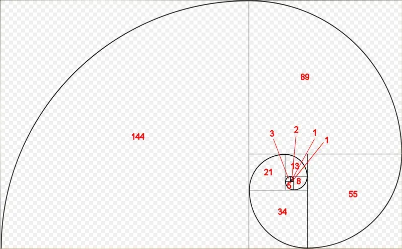

# 20.1 — **函数指针**

在课程[12.7 — 指针简介中](https://www.learncpp.com/cpp-tutorial/introduction-to-pointers/)，您了解到指针是一个保存另一个变量地址的变量。函数指针与之类似，只不过它指向的不是变量，而是函数！

考虑以下函数：

```cpp
int foo()
{
    return 5;
}
```

标识符`foo()`是函数的名称。但函数是什么类型？函数有自己的函数类型——在本例中，函数类型返回一个整数，不接受任何参数。与变量非常相似，函数位于内存中的指定地址（使其成为左值）。

当调用一个函数（通过`operator()`）时，执行会跳转到被调用函数的地址：

```cpp
int foo() // code for foo starts at memory address 0x002717f0
{
    return 5;
}

int main()
{
    foo(); // jump to address 0x002717f0

    return 0;
}
```

在你的编程生涯中的某个时刻（如果你还没有的话），你可能会犯一个简单的错误：

```cpp
#include <iostream>

int foo() // code starts at memory address 0x002717f0
{
    return 5;
}

int main()
{
    std::cout << foo << '\n'; // we meant to call foo(), but instead we're printing foo itself!

    return 0;
}
```

`foo()`我们没有调用函数并打印返回值，而是无意中将函数`foo`直接发送给了`std::cout`。在这种情况下会发生什么？

当通过名称（不带括号）引用函数时，C++ 会将该函数转换为函数指针（保存函数的地址）。然后`operator<<`尝试打印函数指针，但由于`operator<<`不知道如何打印函数指针而失败。标准规定，在这种情况下，`foo`应转换为`bool`（`operator<<`知道如何打印）。并且由于的函数指针`foo`是非空指针，因此它应始终求值为布尔值`true`。因此，这应该打印：

```
1
```

**提示**

一些编译器（例如 Visual Studio）具有编译器扩展，可以打印函数的地址：

```
0x002717f0
```

如果您的平台没有打印该函数的地址而您希望它打印，您可以通过将函数转换为空指针并打印来强制它这样做：

```cpp
#include <iostream>

int foo() // code starts at memory address 0x002717f0
{
    return 5;
}

int main()
{
    std::cout << reinterpret_cast<void*>(foo) << '\n'; // Tell C++ to interpret function foo as a void pointer (implementation-defined behavior)

    return 0;
}
```

这是实现定义的行为，因此它可能无法在所有平台上起作用。

就像可以声明指向普通变量的非常量指针一样，也可以声明指向函数的非常量指针。在本课的其余部分，我们将研究这些函数指针及其用途。函数指针是一个相当高级的主题，对于那些只寻求 C++ 基础知识的人来说，本课的其余部分可以放心地跳过或略读。

## 函数指针

创建非 const 函数指针的语法是 C++ 中最丑陋的东西之一：

```cpp
// fcnPtr is a pointer to a function that takes no arguments and returns an integer
int (*fcnPtr)();
```

在上面的代码片段中，fcnPtr 是一个指向没有参数并返回整数的函数的指针。fcnPtr 可以指向任何与此类型匹配的函数。

出于优先级原因，*fcnPtr 周围的括号是必需的，因为`int* fcnPtr()`它将被解释为名为 fcnPtr 的函数的前向声明，该函数不接受任何参数并返回指向整数的指针。

要创建 const 函数指针，const 位于星号后面：

```cpp
int (*const fcnPtr)();
```

如果将 const 放在 int 之前，则表示指向的函数将返回一个 const int。

**提示**

**函数指针的语法可能比较难理解。以下文章演示了解析此类声明的方法：**

- https://c-faq.com/decl/spiral.anderson.html
- https://web.archive.org/web/20110818081319/http://ieng9.ucsd.edu/~cs30x/rt_lt.rule.html

## 将函数分配给函数指针

函数指针可以用函数初始化（非常量函数指针可以赋值函数）。与指向变量的指针一样，我们也可以使用 &foo 来获取指向 foo 的函数指针。

```cpp
int foo()
{
    return 5;
}

int goo()
{
    return 6;
}

int main()
{
    int (*fcnPtr)(){ &foo }; // fcnPtr points to function foo
    fcnPtr = &goo; // fcnPtr now points to function goo

    return 0;
}
```

一个常见的错误是这样做：

```cpp
fcnPtr = goo();
```

这会尝试将对函数 goo()（其类型为 `int`）的调用的返回值赋给 fcnPtr（其期望值为 `int(*)()`类型），但这并不是我们想要的。我们希望将函数 goo 的地址赋给 fcnPtr，而不是函数 goo() 的返回值。因此不需要括号。

请注意，函数指针的类型（参数和返回类型）必须与函数的类型匹配。以下是一些示例：

```cpp
// function prototypes
int foo();
double goo();
int hoo(int x);

// function pointer initializers
int (*fcnPtr1)(){ &foo };    // okay
int (*fcnPtr2)(){ &goo };    // wrong -- return types don't match!
double (*fcnPtr4)(){ &goo }; // okay
fcnPtr1 = &hoo;              // wrong -- fcnPtr1 has no parameters, but hoo() does
int (*fcnPtr3)(int){ &hoo }; // okay
```

与基本类型不同，C++*会*在需要时隐式地将函数转换为函数指针（因此您无需使用地址运算符 (&) 来获取函数的地址）。但是，函数指针不会转换为 void 指针，反之亦然（尽管 Visual Studio 等某些编译器可能允许这样做）。

```cpp
// function prototypes
int foo();

// function initializations
int (*fcnPtr5)() { foo }; // okay, foo implicitly converts to function pointer to foo
void* vPtr { foo };       // not okay, though some compilers may allow
```

函数指针也可以被初始化或者赋值nullptr：

```cpp
int (*fcnptr)() { nullptr }; // okay
```

## 使用函数指针调用函数

使用函数指针可以做的另一件主要事情是使用它来实际调用函数。有两种方法可以做到这一点。第一种是通过显式取消引用：

```cpp
int foo(int x)
{
    return x;
}

int main()
{
    int (*fcnPtr)(int){ &foo }; // Initialize fcnPtr with function foo
    (*fcnPtr)(5); // call function foo(5) through fcnPtr.

    return 0;
}
```

第二种方法是通过隐式取消引用：

```cpp
int foo(int x)
{
    return x;
}

int main()
{
    int (*fcnPtr)(int){ &foo }; // Initialize fcnPtr with function foo
    fcnPtr(5); // call function foo(5) through fcnPtr.

    return 0;
}
```

如您所见，隐式取消引用方法看起来就像一个普通的函数调用 - 这正是您所期望的，因为普通函数名称无论如何都是指向函数的指针！但是，一些较旧的编译器不支持隐式取消引用方法，但所有现代编译器都应该支持。

还要注意，由于函数指针可以设置为 nullptr，因此在调用函数指针之前，最好断言或有条件地测试它是否为空指针。就像普通指针一样，取消引用空函数指针会导致未定义的行为。

```cpp
int foo(int x)
{
    return x;
}

int main()
{
    int (*fcnPtr)(int){ &foo }; // Initialize fcnPtr with function foo
    if (fcnPtr) // make sure fcnPtr isn't a null pointer
        fcnPtr(5); // otherwise this will lead to undefined behavior

    return 0;
}
```

## 默认参数不适用于通过函数指针调用的函数高级

当编译器遇到对具有一个或多个默认参数的函数的正常函数调用时，它会重写该函数调用以包含默认参数。此过程发生在编译时，因此只能应用于可以在编译时解析的函数。

但是，当通过函数指针调用函数时，它会在运行时解析。在这种情况下，无需重写函数调用以包含默认参数。

**关键见解**

因为解析发生在运行时，所以当通过函数指针调用函数时，默认参数不会被解析。

这意味着我们可以使用函数指针来消除由于默认参数而产生歧义的函数调用。在下面的例子中，我们展示了两种方法来实现这一点：

```cpp
#include <iostream>

void print(int x)
{
    std::cout << "print(int)\n";
}

void print(int x, int y = 10)
{
    std::cout << "print(int, int)\n";
}

int main()
{
//    print(1); // ambiguous function call

    // Deconstructed method
    using vnptr = void(*)(int); // define a type alias for a function pointer to a void(int) function
    vnptr pi { print }; // initialize our function pointer with function print
    pi(1); // call the print(int) function through the function pointer

    // Concise method
    static_cast<void(*)(int)>(print)(1); // call void(int) version of print with argument 1

    return 0;
}
```

## 将函数作为参数传递给其他函数

使用函数指针最有用的功能之一是将一个函数作为参数传递给另一个函数。用作另一个函数参数的函数有时称为**回调函数**。

考虑这样一种情况：您正在编写一个函数来执行某项任务（例如对数组进行排序），但您希望用户能够定义该任务的某个特定部分的执行方式（例如数组是按升序还是降序排序）。让我们仔细研究一下这个问题在排序中的具体应用，作为一个可以推广到其他类似问题的示例。

许多基于比较的排序算法都基于类似的概念：排序算法遍历数字列表，对数字对进行比较，并根据比较结果对数字重新排序。因此，通过改变比较，我们可以改变算法的排序方式，而不会影响其余的排序代码。

以下是上一课中的选择排序例程：

```cpp
#include <utility> // for std::swap

void SelectionSort(int* array, int size)
{
    if (!array)
        return;

    // Step through each element of the array
    for (int startIndex{ 0 }; startIndex < (size - 1); ++startIndex)
    {
        // smallestIndex is the index of the smallest element we've encountered so far.
        int smallestIndex{ startIndex };

        // Look for smallest element remaining in the array (starting at startIndex+1)
        for (int currentIndex{ startIndex + 1 }; currentIndex < size; ++currentIndex)
        {
            // If the current element is smaller than our previously found smallest
            if (array[smallestIndex] > array[currentIndex]) // COMPARISON DONE HERE
            {
                // This is the new smallest number for this iteration
                smallestIndex = currentIndex;
            }
        }

        // Swap our start element with our smallest element
        std::swap(array[startIndex], array[smallestIndex]);
    }
}
```

让我们用一个函数来代替这个比较。因为我们的比较函数将比较两个整数并返回一个布尔值来指示是否应该交换元素，所以它看起来会像这样：

```cpp
bool ascending(int x, int y)
{
    return x > y; // swap if the first element is greater than the second
}
```

下面是我们使用 rising() 函数进行比较的选择排序例程：

```cpp
#include <utility> // for std::swap

void SelectionSort(int* array, int size)
{
    if (!array)
        return;

    // Step through each element of the array
    for (int startIndex{ 0 }; startIndex < (size - 1); ++startIndex)
    {
        // smallestIndex is the index of the smallest element we've encountered so far.
        int smallestIndex{ startIndex };

        // Look for smallest element remaining in the array (starting at startIndex+1)
        for (int currentIndex{ startIndex + 1 }; currentIndex < size; ++currentIndex)
        {
            // If the current element is smaller than our previously found smallest
            if (ascending(array[smallestIndex], array[currentIndex])) // COMPARISON DONE HERE
            {
                // This is the new smallest number for this iteration
                smallestIndex = currentIndex;
            }
        }

        // Swap our start element with our smallest element
        std::swap(array[startIndex], array[smallestIndex]);
    }
}
```


现在，为了让调用者决定如何进行排序，我们将允许调用者提供他们自己的排序函数，而不是使用我们自己的硬编码比较函数！这是通过函数指针完成的。

因为调用者的比较函数将比较两个整数并返回一个布尔值，所以指向此类函数的指针看起来像这样：

```cpp
bool (*comparisonFcn)(int, int);
```

因此，我们将允许调用者将指向其所需比较函数的指针作为第三个参数传递给我们的排序例程，然后我们将使用调用者的函数进行比较。

下面是使用函数指针参数进行用户定义比较的选择排序的完整示例，以及如何调用它的示例：

```cpp
#include <utility> // for std::swap
#include <iostream>

// Note our user-defined comparison is the third parameter
void selectionSort(int* array, int size, bool (*comparisonFcn)(int, int))
{
    if (!array || !comparisonFcn)
        return;

    // Step through each element of the array
    for (int startIndex{ 0 }; startIndex < (size - 1); ++startIndex)
    {
        // bestIndex is the index of the smallest/largest element we've encountered so far.
        int bestIndex{ startIndex };

        // Look for smallest/largest element remaining in the array (starting at startIndex+1)
        for (int currentIndex{ startIndex + 1 }; currentIndex < size; ++currentIndex)
        {
            // If the current element is smaller/larger than our previously found smallest
            if (comparisonFcn(array[bestIndex], array[currentIndex])) // COMPARISON DONE HERE
            {
                // This is the new smallest/largest number for this iteration
                bestIndex = currentIndex;
            }
        }

        // Swap our start element with our smallest/largest element
        std::swap(array[startIndex], array[bestIndex]);
    }
}

// Here is a comparison function that sorts in ascending order
// (Note: it's exactly the same as the previous ascending() function)
bool ascending(int x, int y)
{
    return x > y; // swap if the first element is greater than the second
}

// Here is a comparison function that sorts in descending order
bool descending(int x, int y)
{
    return x < y; // swap if the second element is greater than the first
}

// This function prints out the values in the array
void printArray(int* array, int size)
{
    if (!array)
        return;

    for (int index{ 0 }; index < size; ++index)
    {
        std::cout << array[index] << ' ';
    }

    std::cout << '\n';
}

int main()
{
    int array[9]{ 3, 7, 9, 5, 6, 1, 8, 2, 4 };

    // Sort the array in descending order using the descending() function
    selectionSort(array, 9, descending);
    printArray(array, 9);

    // Sort the array in ascending order using the ascending() function
    selectionSort(array, 9, ascending);
    printArray(array, 9);

    return 0;
}
```

该程序产生的结果：

```
9 8 7 6 5 4 3 2 1
1 2 3 4 5 6 7 8 9
```

这很酷吧？我们赋予了调用者控制选择排序如何执行其工作的能力。

调用者甚至可以定义自己的“奇怪”的比较函数：

```cpp
bool evensFirst(int x, int y)
{
	// if x is even and y is odd, x goes first (no swap needed)
	if ((x % 2 == 0) && !(y % 2 == 0))
		return false;

	// if x is odd and y is even, y goes first (swap needed)
	if (!(x % 2 == 0) && (y % 2 == 0))
		return true;

        // otherwise sort in ascending order
	return ascending(x, y);
}

int main()
{
    int array[9]{ 3, 7, 9, 5, 6, 1, 8, 2, 4 };

    selectionSort(array, 9, evensFirst);
    printArray(array, 9);

    return 0;
}
```

上述代码片段产生以下结果：

```
2 4 6 8 1 3 5 7 9
```

如您所见，在这种情况下使用函数指针提供了一种很好的方法，允许调用者将自己的功能“挂接”到您之前编写和测试过的内容中，这有助于促进代码重用！以前，如果您想按降序对一个数组进行排序，按升序对另一个数组进行排序，则需要多个版本的排序例程。现在，您可以拥有一个可以按照调用者希望的任何方式进行排序的版本！

注意：如果函数参数是函数类型，它将被转换为指向函数类型的指针。这意味着：

```cpp
void selectionSort(int* array, int size, bool (*comparisonFcn)(int, int))
```

可以等效地写成：

```cpp
void selectionSort(int* array, int size, bool comparisonFcn(int, int))
```

这仅适用于函数参数，因此用途有限。对于非函数参数，后者被解释为前向声明：

```cpp
bool (*ptr)(int, int); // definition of function pointer ptr
bool fcn(int, int);    // forward declaration of function fcn
```

## 提供默认函数

如果您要允许调用者将函数作为参数传入，那么为调用者提供一些标准函数以方便他们使用通常会很有用。例如，在上面的选择排序示例中，提供 rising() 和 descending() 函数以及 choiceSort() 函数将使调用者的工作更轻松，因为他们不必每次想要使用时都重写 rising() 或 descending()。

您甚至可以将其中一个设置为默认参数：

```cpp
// Default the sort to ascending sort
void selectionSort(int* array, int size, bool (*comparisonFcn)(int, int) = ascending);
```

在这种情况下，只要用户正常调用selectionSort（而不是通过函数指针），comparisonFcn参数就会默认为升序。您需要确保`ascending`在此之前声明了该函数，否则编译器会抱怨它不知道`ascending`是什么。

## 使用类型别名让函数指针更漂亮

让我们面对现实吧——函数指针的语法很丑陋。但是，类型别名可用于使函数指针看起来更像常规变量：

```cpp
using ValidateFunction = bool(*)(int, int);
```

这定义了一个名为“ValidateFunction”的类型别名，它是一个指向接受两个整数并返回一个布尔值的函数的指针。

现在不用这样做：

```cpp
bool validate(int x, int y, bool (*fcnPtr)(int, int)); // ugly
```

您可以这样做：

```cpp
bool validate(int x, int y, ValidateFunction pfcn) // clean
```

## 使用 std::function

定义和存储函数指针的另一种方法是使用 std::function，它是标准库 < functional> 标头的一部分。要使用此方法定义函数指针，请声明一个 std::function 对象，如下所示：

```cpp
#include <functional>
bool validate(int x, int y, std::function<bool(int, int)> fcn); // std::function method that returns a bool and takes two int parameters
```

如你所见，返回类型和参数都放在尖括号内，参数放在圆括号内。如果没有参数，圆括号可以留空。

使用 std::function 更新我们之前的示例：

```cpp
#include <functional>
#include <iostream>

int foo()
{
    return 5;
}

int goo()
{
    return 6;
}

int main()
{
    std::function<int()> fcnPtr{ &foo }; // declare function pointer that returns an int and takes no parameters
    fcnPtr = &goo; // fcnPtr now points to function goo
    std::cout << fcnPtr() << '\n'; // call the function just like normal

    std::function fcnPtr2{ &foo }; // can also use CTAD to infer template arguments

    return 0;
}
```

类型别名 std::function 有助于提高可读性：

```cpp
using ValidateFunctionRaw = bool(*)(int, int); // type alias to raw function pointer
using ValidateFunction = std::function<bool(int, int)>; // type alias to std::function
```

还要注意，std::function 仅允许通过隐式取消引用（例如）调用函数`fcnPtr()`，而不允许通过显式取消引用（例如`(*fcnPtr)()`）调用函数。

定义类型别名时，我们必须明确指定任何模板参数。在这种情况下，我们不能使用 CTAD，因为没有初始化程序来推导模板参数。

## 函数指针的类型推断

就像可以使用*auto*关键字来推断普通变量的类型一样，*auto*关键字也可以推断函数指针的类型。

```cpp
#include <iostream>

int foo(int x)
{
	return x;
}

int main()
{
	auto fcnPtr{ &foo };
	std::cout << fcnPtr(5) << '\n';

	return 0;
}
```

这与你预期的完全一样，语法也非常清晰。当然，缺点是函数的参数类型和返回类型的所有细节都被隐藏了，因此在调用函数或使用其返回值时更容易出错。

## 结论

函数指针主要在您想要将函数存储在数组（或其他结构）中，或者需要将一个函数传递给另一个函数时有用。由于声明函数指针的本机语法很丑陋且容易出错，因此我们建议使用 std::function。在函数指针类型仅使用一次的地方（例如单个参数或返回值），可以直接使用 std::function。在函数指针类型多次使用的地方，std::function 的类型别名是更好的选择（以防止重复）。

## 测验时间

1. 在这个测验中，我们将使用函数指针编写基本计算器的一个版本。

1a) 创建一个简短的程序，要求用户输入两个整数和一个数学运算（“+”、“-”、“*”、“/”）。确保用户输入有效的运算。

```cpp
#include <iostream>

int getInteger()
{
    std::cout << "Enter an integer: ";
    int x{};
    std::cin >> x;
    return x;
}

char getOperation()
{
    char op{};

    do
    {
        std::cout << "Enter an operation ('+', '-', '*', '/'): ";
        std::cin >> op;
    }
    while (op!='+' && op!='-' && op!='*' && op!='/');

    return op;
}

int main()
{
    int x{ getInteger() };
    char op{ getOperation() };
    int y{ getInteger() };

    return 0;
}
```

1b) 编写名为 add()、subtract()、multiply() 和 divide() 的函数。这些函数应接受两个整数参数并返回一个整数。

```cpp
int add(int x, int y)
{
    return x + y;
}

int subtract(int x, int y)
{
    return x - y;
}

int multiply(int x, int y)
{
    return x * y;
}

int divide(int x, int y)
{
    return x / y;
}
```

1c) 为指向一个函数的指针创建一个名为 ArithmeticFunction 的类型别名，该函数接受两个整数参数并返回一个整数。使用 std::function，并包含适当的标头。

```cpp
#include <functional>
using ArithmeticFunction = std::function<int(int, int)>;
```

1d) 编写一个名为 getArithmeticFunction() 的函数，该函数接受运算符字符并以函数指针的形式返回相应的函数。

```cpp
ArithmeticFunction getArithmeticFunction(char op)
{
    switch (op)
    {
    case '+': return &add;
    case '-': return &subtract;
    case '*': return &multiply;
    case '/': return &divide;
    }

    return nullptr;
}
```

1e) 修改 main() 函数以调用 getArithmeticFunction()。使用输入调用该函数的返回值并打印结果。

```cpp
#include <iostream>

int main()
{
    int x{ getInteger() };
    char op{ getOperation() };
    int y{ getInteger() };

    ArithmeticFunction fcn{ getArithmeticFunction(op) };
    if (fcn)
        std::cout << x << ' ' << op << ' ' << y << " = " << fcn(x, y) << '\n';

    return 0;
}
```

以下是完整程序：

```cpp
#include <iostream>
#include <functional>

int getInteger()
{
    std::cout << "Enter an integer: ";
    int x{};
    std::cin >> x;
    return x;
}

char getOperation()
{
    char op{};

    do
    {
        std::cout << "Enter an operation ('+', '-', '*', '/'): ";
        std::cin >> op;
    }
    while (op!='+' && op!='-' && op!='*' && op!='/');

    return op;
}

int add(int x, int y)
{
    return x + y;
}

int subtract(int x, int y)
{
    return x - y;
}

int multiply(int x, int y)
{
    return x * y;
}

int divide(int x, int y)
{
    return x / y;
}

using ArithmeticFunction = std::function<int(int, int)>;

ArithmeticFunction getArithmeticFunction(char op)
{
    switch (op)
    {
    case '+': return &add;
    case '-': return &subtract;
    case '*': return &multiply;
    case '/': return &divide;
    }

    return nullptr;
}

int main()
{
    int x{ getInteger() };
    char op{ getOperation() };
    int y{ getInteger() };

    ArithmeticFunction fcn{ getArithmeticFunction(op) };
    if (fcn)
        std::cout << x << ' ' << op << ' ' << y << " = " << fcn(x, y) << '\n';

    return 0;
}
```

# 20.2 — 栈和堆

程序使用的内存通常分为几个不同的区域，称为段：

- 代码段（也称为文本段），编译后的程序位于内存中。代码段通常是只读的。
- bss 段（也称为未初始化数据段），其中存储了零初始化的全局变量和静态变量。
- 数据段（也称为初始化数据段），其中存储了已初始化的全局变量和静态变量。
- 堆，动态分配的变量从这里分配。
- 调用堆栈，其中存储了函数参数、局部变量和其他与函数相关的信息。

在本课中，我们将主要关注堆和堆栈，因为大多数有趣的事情都发生在那里。

## **堆段**

[堆段（也称为“空闲存储”）跟踪用于动态内存分配的内存。我们在第19.1 课“使用 new 和 delete 进行动态内存分配”]中已经讨论过堆，因此这里就简单回顾一下。

在 C++ 中，当你使用 new 运算符分配内存时，该内存会被分配在应用程序的堆段中。

假设 int 是 4 个字节：

```cpp
int* ptr { new int }; // new int allocates 4 bytes in the heap
int* array { new int[10] }; // new int[10] allocates 40 bytes in the heap
```

当动态分配的变量被删除时，内存将“返回”到堆，然后可以在收到未来的分配请求时重新分配。请记住，删除指针不会删除变量，它只是将关联地址处的内存返回给操作系统

堆有优点也有缺点：

- 在堆上分配内存相对较慢。
- 分配的内存保持分配状态，直到被特别释放（注意内存泄漏）或应用程序结束（此时操作系统应该清理它）。
- 动态分配的内存必须通过指针访问。取消引用指针比直接访问变量要慢。
- 因为堆是一个很大的内存池，所以可以在这里分配大型数组、结构或类。

## **调用堆栈**

**调用堆栈**（通常称为“堆栈”）的作用要有趣得多。调用堆栈跟踪从程序启动到当前执行点的所有活动函数（已调用但尚未终止的函数），并处理所有函数参数和局部变量的分配。

调用堆栈以堆栈数据结构的形式实现。因此，在讨论调用堆栈的工作原理之前，我们需要了解什么是堆栈数据结构。

## **堆栈数据结构**

数据**结构**是一种编程机制，用于组织数据以便高效使用。您已经看到了几种类型的数据结构，例如数组和结构体。这两种数据结构都提供了存储数据和以高效方式访问数据的机制。编程中还常用许多其他数据结构，其中相当一部分是在标准库中实现的，堆栈就是其中之一。

想象一下餐厅里一堆盘子。由于每个盘子都很重，而且都堆在一起，所以你实际上只能做以下三件事之一：

1. 看看顶板的表面
2. 将最上面的盘子从堆叠中取出（如果存在的话，则露出下面的盘子）
3. 将新盘子放在堆顶（如果存在，则隐藏下面的盘子）

在计算机编程中，堆栈是一种容器数据结构，可容纳多个变量（非常类似于数组）。但是，数组允许您按任意顺序访问和修改元素（称为**随机访问**），而堆栈则受到更多限制。可以在堆栈上执行的操作对应于上面提到的三件事：

1. 查看堆栈顶部的项目（通常通过名为 top() 的函数完成，但有时也称为 peek()）
2. 将顶部元素从堆栈中取出（通过名为 pop() 的函数完成）
3. 将新项目放在堆栈顶部（通过名为 push() 的函数完成）

堆栈是一种后进先出 (LIFO) 结构。最后推入堆栈的项目将是第一个弹出的项目。如果您将一个新盘子放在堆栈顶部，则从堆栈中移除的第一个盘子将是您最后推入的盘子。后进先出。随着项目被推入堆栈，堆栈会变大 - 随着项目被弹出，堆栈会变小。

例如，这里有一个简短的序列，展示了堆栈的推送和弹出方式：

```cpp
Stack: empty
Push 1
Stack: 1
Push 2
Stack: 1 2
Push 3
Stack: 1 2 3
Pop
Stack: 1 2
Pop
Stack: 1
```

盘子类比很好地类比了调用堆栈的工作原理，但我们可以做一个更好的类比。考虑一堆邮箱，它们全部堆叠在一起。每个邮箱只能容纳一个项目，并且所有邮箱都是空的。此外，每个邮箱都钉在它下面的邮箱上，因此邮箱的数量无法改变。如果我们无法更改邮箱数量，我们如何获得类似堆栈的行为？

首先，我们使用一个标记（如便利贴）来记录最底部的空邮箱的位置。一开始，这将是最低的邮箱（在堆栈的底部）。当我们将一个项目推入邮箱堆栈时，我们将其放入标记的邮箱（即第一个空邮箱），并将标记上移一个邮箱。当我们从堆栈中弹出一个项目时，我们将标记下移一个邮箱（因此它指向顶部非空邮箱）并从该邮箱中移除该项目。标记下方的任何东西都被视为“在堆栈上”。标记处或标记上方的任何东西都不在堆栈上。

## **调用堆栈段**

调用堆栈段保存用于调用堆栈的内存。当应用程序启动时，操作系统会将 main() 函数推送到调用堆栈上。然后程序开始执行。

当遇到函数调用时，该函数会被推送到调用堆栈上。当前函数结束时，该函数会从调用堆栈中弹出（此过程有时称为**展开堆栈**）。因此，通过查看当前位于调用堆栈上的函数，我们可以看到所有被调用的函数，以到达当前执行点。

我们上面的邮箱类比与调用堆栈的工作方式非常类似。堆栈本身是一块固定大小的内存地址。邮箱是内存地址，我们在堆栈上推送和弹出的“项目”称为**堆栈帧**。堆栈帧跟踪与一个函数调用相关的所有数据。我们稍后会详细讨论堆栈帧。“标记”是一个寄存器（CPU 中的一小块内存），称为堆栈指针（有时缩写为“SP”）。堆栈指针跟踪调用堆栈的顶部当前所在的位置。

我们可以进一步进行优化：当我们从调用堆栈中弹出一个项目时，我们只需将堆栈指针向下移动——我们不必清理或将弹出的堆栈框架使用的内存清零（相当于清空邮箱）。此内存不再被视为“在堆栈上”（堆栈指针将位于此地址或以下），因此将无法访问。如果我们稍后将新的堆栈框架推送到同一内存，它将覆盖我们从未清理过的旧值。

## **实际的调用堆栈**

让我们更详细地了解一下调用堆栈的工作原理。以下是调用函数时发生的步骤顺序：

1. 程序遇到函数调用。
2. 构造一个堆栈框架并将其推送到堆栈上。堆栈框架包括：

- 函数调用之后的指令地址（称为**返回地址**）。这是 CPU 记住被调用函数退出后返回到哪里的方式。
- 所有函数参数。
- 任何局部变量的内存
- 函数修改的任何寄存器的已保存副本，函数返回时需要恢复这些副本

1. CPU 跳转到函数的起始点。
2. 函数内部的指令开始执行。

当函数终止时，会发生以下步骤：

1. 从调用堆栈恢复寄存器
2. 堆栈框架从堆栈中弹出。这将释放所有局部变量和参数的内存。
3. 返回值已处理。
4. CPU 在返回地址处恢复执行。

返回值可以用多种不同的方式处理，具体取决于计算机的体系结构。某些体系结构将返回值作为堆栈框架的一部分。其他体系结构使用 CPU 寄存器。

通常，了解调用堆栈如何工作的所有细节并不重要。但是，了解函数在被调用时被有效地推送到堆栈上，并在返回时弹出（展开）可以让您了解递归所需的基础知识，以及调试时有用的其他一些概念。

技术说明：在某些架构上，调用堆栈从内存地址 0 开始增长。在其他架构上，它会朝内存地址 0 增长。因此，新推送的堆栈帧可能具有比之前的堆栈帧更高或更低的内存地址。

## **一个快速而肮脏的调用堆栈示例**

考虑以下简单的应用程序：

```cpp
int foo(int x)
{
    // b
    return x;
} // foo is popped off the call stack here

int main()
{
    // a
    foo(5); // foo is pushed on the call stack here
    // c

    return 0;
}
```

调用堆栈在标记点处如下所示：

a:

```
main()
```

b:

```
foo() (including parameter x)
main()
```

c:

```
main()
```

## **堆栈溢出**

堆栈的大小是有限的，因此只能容纳有限量的信息。在适用于 Windows 的 Visual Studio 中，默认堆栈大小为 1MB。使用适用于 Unix 的 g++/Clang 变体，堆栈大小可以达到 8MB。如果程序试图在堆栈上放置过多信息，则会导致堆栈溢出。当堆栈中的所有内存都已分配时，就会发生**堆栈溢出**——在这种情况下，进一步的分配会开始溢出到内存的其他部分。

堆栈溢出通常是由于在堆栈上分配了太多变量，和/或进行了太多嵌套函数调用（其中函数 A 调用函数 B 调用函数 C 调用函数 D 等等...）在现代操作系统上，堆栈溢出通常会导致操作系统发出访问冲突并终止程序。

下面是一个可能导致堆栈溢出的示例程序。您可以在系统上运行它并观察它崩溃的情况：

```cpp
#include <iostream>

int main()
{
    int stack[10000000];
    std::cout << "hi" << stack[0]; // we'll use stack[0] here so the compiler won't optimize the array away

    return 0;
}
```

此程序尝试在堆栈上分配一个巨大（可能为 40MB）的数组。由于堆栈不够大，无法处理此数组，因此数组分配溢出到程序不允许使用的内存部分。

在 Windows（Visual Studio）上，此程序产生结果：

```
HelloWorld.exe (process 15916) exited with code -1073741571.
```

-1073741571 的十六进制表示为 c0000005，这是 Windows 操作系统的访问冲突代码。请注意，“hi” 永远不会被打印出来，因为程序在此点之前就终止了。

这是另一个由于不同原因而导致堆栈溢出的程序：

```cpp
// h/t to reader yellowEmu for the idea of adding a counter
#include <iostream>

int g_counter{ 0 };

void eatStack()
{
    std::cout << ++g_counter << ' ';

    // We use a conditional here to avoid compiler warnings about infinite recursion
    if (g_counter > 0)
        eatStack(); // note that eatStack() calls itself

    // Needed to prevent compiler from doing tail-call optimization
    std::cout << "hi";
}

int main()
{
    eatStack();

    return 0;
}
```

在上面的程序中，每次调用函数 eatStack() 时，都会将一个堆栈框架推送到堆栈上。由于 eatStack() 调用自身（并且永远不会返回给调用者），因此最终堆栈将耗尽内存并导致溢出。

堆栈有优点也有缺点：

- 在堆栈上分配内存相对较快。
- 堆栈上分配的内存只要在堆栈上，就会保持在范围内。当它从堆栈弹出时，它就会被销毁。
- 所有在堆栈上分配的内存在编译时都是已知的。因此，可以通过变量直接访问这些内存。
- 由于堆栈相对较小，因此通常不建议执行任何会占用大量堆栈空间的操作。这包括分配或复制大型数组或其他内存密集型结构。

# 20.3 — 递归

**C++ 中的递归函数**是调用自身的函数。以下是一个编写不当的递归函数的示例：

```cpp
#include <iostream>

void countDown(int count)
{
    std::cout << "push " << count << '\n';
    countDown(count-1); // countDown() calls itself recursively
}

int main()
{
    countDown(5);

    return 0;
}
```

当调用 countDown(5) 时，会打印“push 5”，并调用 countDown(4)。countDown(4) 打印“push 4”并调用 countDown(3)。countDown(3) 打印“push 3”并调用 countDown(2)。countDown(n) 调用 countDown(n-1) 的序列无限重复，有效地形成了无限循环的递归等价物。

在课程[20.2 — 堆栈和堆中](https://www.learncpp.com/cpp-tutorial/the-stack-and-the-heap/)，您了解到每个函数调用都会导致数据被放置在调用堆栈中。由于 countDown() 函数永远不会返回（它只是再次调用 countDown()），因此这些信息永远不会从堆栈中弹出！因此，在某个时候，计算机将耗尽堆栈内存，导致堆栈溢出，程序将崩溃或终止。在作者的机器上，这个程序在终止之前倒计时到 -11732！

**作者注**

尾部**调用**是发生在函数尾部的函数调用。具有递归尾部调用的函数很容易被编译器优化为迭代（非递归）函数。在上述示例中，这样的函数不会导致系统耗尽堆栈空间。如果您运行上述程序并且它一直运行，那么很可能就是这种情况。

## **递归终止条件**

递归函数调用通常与普通函数调用一样。但是，上面的程序说明了递归函数最重要的区别：必须包含递归终止条件，否则它们将“永远”运行（实际上，直到调用堆栈耗尽内存）。递归**终止**是一种条件，当满足该条件时，将导致递归函数停止调用自身。

递归终止通常涉及使用 if 语句。下面是我们重新设计的函数，添加了终止条件（以及一些额外的输出）：

```cpp
#include <iostream>

void countDown(int count)
{
    std::cout << "push " << count << '\n';

    if (count > 1) // termination condition
        countDown(count-1);

    std::cout << "pop " << count << '\n';
}

int main()
{
    countDown(5);
    return 0;
}
```

现在，当我们运行程序时，countDown() 将开始输出以下内容：

```cpp
push 5
push 4
push 3
push 2
push 1
```

如果此时你查看调用堆栈，你会看到以下内容：

```
countDown(1)
countDown(2)
countDown(3)
countDown(4)
countDown(5)
main()
```

由于终止条件，countDown(1) 不会调用 countDown(0)——相反，“if 语句”不会执行，因此它会打印“pop 1”然后终止。此时，countDown(1) 从堆栈中弹出，控制权返回到 countDown(2)。countDown(2) 在调用 countDown(1) 之后恢复执行，因此它会打印“pop 2”然后终止。递归函数调用随后从堆栈中弹出，直到所有 countDown 实例都被删除。

因此，该程序总共输出：

```cpp
push 5
push 4
push 3
push 2
push 1
pop 1
pop 2
pop 3
pop 4
pop 5
```

值得注意的是，“push”输出按正序发生，因为它们发生在递归函数调用之前。“pop”输出按逆序发生，因为它们发生在递归函数调用之后，因为函数正在从堆栈中弹出（弹出顺序与放入顺序相反）。

**一个更有用的例子**

现在我们已经讨论了递归函数调用的基本机制，让我们看一下另一个更典型的递归函数：

```cpp
// return the sum of all the integers between 1 (inclusive) and sumto (inclusive)
// returns 0 for negative numbers
int sumTo(int sumto)
{
    if (sumto <= 0)
        return 0; // base case (termination condition) when user passed in an unexpected argument (0 or negative)
    if (sumto == 1)
        return 1; // normal base case (termination condition)

    return sumTo(sumto - 1) + sumto; // recursive function call
}
```

递归程序通常很难仅凭外观来理解。当我们使用特定值调用递归函数时，查看会发生什么情况通常很有启发性。因此，让我们看看当我们使用参数 sumto = 5 调用此函数时会发生什么情况。

```
sumTo(5) called, 5 <= 1 is false, so we return sumTo(4) + 5.
sumTo(4) called, 4 <= 1 is false, so we return sumTo(3) + 4.
sumTo(3) called, 3 <= 1 is false, so we return sumTo(2) + 3.
sumTo(2) called, 2 <= 1 is false, so we return sumTo(1) + 2.
sumTo(1) called, 1 <= 1 is true, so we return 1.  This is the termination condition.
```

现在我们解开调用堆栈（在每个函数返回时将其从调用堆栈中弹出）：

```
sumTo(1) 返回 1。
sumTo(2) 返回 sumTo(1) + 2，即 1 + 2 = 3。
sumTo(3) 返回 sumTo(2) + 3，即 3 + 3 = 6。
sumTo(4) 返回 sumTo(3) + 4，即 6 + 4 = 10。
sumTo(5) 返回 sumTo(4) + 5，即 10 + 5 = 15。
```

此时，更容易看出我们正在添加 1 到传入的值（包括 1 和 1 与传入的值）之间的数字。

因为递归函数看起来可能比较难以理解，所以好的注释尤为重要。

请注意，在上面的代码中，我们使用值`sumto - 1`而不是进行递归`--sumto`。我们这样做是因为`operator--`有副作用，并且在给定表达式中多次使用具有副作用的变量将导致未定义的行为。使用`sumto - 1`避免了副作用，使 sumto 可以在表达式中安全地使用多次。

## **递归算法**

递归函数通常通过首先找到问题子集的解决方案（递归），然后修改该子解决方案以获得解决方案来解决问题。在上述算法中，sumTo(value) 首先求解 sumTo(value-1)，然后将变量值添加到 sumTo(value) 以找到 sumTo(value) 的解决方案。

在许多递归算法中，一些输入会产生微不足道的输出。例如，sumTo(1) 的输出微不足道 1（您可以在脑海中计算），并且不会从进一步的递归中受益。算法会针对其微不足道地产生输出的输入称为**基准情况**。基准情况充当算法的终止条件。通常可以通过考虑输入 0、1、“”、“”或 null 的输出来识别基准情况。

## **斐波那契数**

最著名的数学递归算法之一是斐波那契数列。斐波那契数列出现在自然界的许多地方，例如树木的分枝、贝壳的螺旋、菠萝的果实、展开的蕨叶以及松果的排列。

这是斐波那契螺旋图：



每个斐波那契数都是该数字所在正方形的边长。

斐波那契数的数学定义是：

| F(n) = | 如果 n = 0，则为 0 如果 n = 1，则为 1 如果 n > 1，则为 f(n-1) + f(n-2) |
| ------ | ------------------------------------------------------------ |
|        |                                                              |

因此，编写一个（不太有效的）递归函数来计算第 n 个斐波那契数相当简单：

```cpp
#include <iostream>

int fibonacci(int count)
{
    if (count == 0)
        return 0; // base case (termination condition)
    if (count == 1)
        return 1; // base case (termination condition)
    return fibonacci(count-1) + fibonacci(count-2);
}

// And a main program to display the first 13 Fibonacci numbers
int main()
{
    for (int count { 0 }; count < 13; ++count)
        std::cout << fibonacci(count) << ' ';

    return 0;
}
```

运行该程序产生以下结果：

```
0 1 1 2 3 5 8 13 21 34 55 89 144
```

您会注意到，这些数字正是斐波那契螺旋图中出现的数字。

**记忆算法**

上述递归斐波那契算法效率不高，部分原因是每次调用斐波那契非基数情况都会导致两次斐波那契调用。这会产生指数数量的函数调用（事实上，上述示例调用了 fibonacci() 1205 次！）。有一些技术可用于减少必要的调用次数。一种称为**记忆化的**技术会缓存昂贵的函数调用的结果，以便在再次出现相同输入时返回结果。

以下是递归斐波那契算法的记忆版本：

```cpp
#include <iostream>
#include <vector>

// h/t to potterman28wxcv for a variant of this code
// count is now a std::size_t to make indexing the std::vector easier
int fibonacci(std::size_t count)
{
	// We'll use a static std::vector to cache calculated results
	static std::vector results{ 0, 1 };

	// If we've already seen this count, then use the cache'd result
	if (count < std::size(results))
		return results[count];

	// Otherwise calculate the new result and add it
	results.push_back(fibonacci(count - 1) + fibonacci(count - 2));
	return results[count];
}

// And a main program to display the first 13 Fibonacci numbers
int main()
{
	for (int count { 0 }; count < 13; ++count)
		std::cout << fibonacci(static_cast<std::size_t>(count)) << ' ';

	return 0;
}
```

这个记忆版本进行了 35 次函数调用，比原始算法的 1205 次要好得多。

## **递归与迭代**

关于递归函数，人们经常会问的一个问题是：“如果可以迭代地完成许多相同的任务（使用*for 循环*或*while 循环*），为什么要使用递归函数？”事实证明，您总是可以迭代地解决递归问题 - 但是，对于非平凡问题，递归版本通常更容易编写（和阅读）。例如，虽然可以迭代地编写斐波那契函数，但它有点困难！（试试看！）

迭代函数（使用 for 循环或 while 循环的函数）几乎总是比其递归对应函数更高效。这是因为每次调用函数时，都会在推送和弹出堆栈框架时产生一定量的开销。迭代函数可避免这种开销。

这并不是说迭代函数总是更好的选择。有时函数的递归实现更加清晰，也更容易理解，因此为了可维护性而产生一点额外的开销是值得的，特别是如果算法不需要递归太多次来找到解决方案。

一般来说，当下列大部分条件成立时，递归是一个不错的选择：

- 递归代码的实现要简单得多。
- 递归深度可以受到限制（例如，无法提供导致其递归至 100,000 级的输入）。
- 该算法的迭代版本需要管理一堆数据。
- 这不是对性能要求很高的代码部分。

但是，如果递归算法实现起来更简单，那么先以递归方式开始，然后再优化为迭代算法可能更有意义。

**最佳实践**

**通常情况下，迭代比递归更受青睐，除非递归确实有意义。**

## **测验时间**

1. 整数 N（写作 N!）的阶乘定义为 1 和 N（0! = 1）之间所有数字的乘积（乘法）。编写一个名为阶乘的递归函数，返回输入的阶乘。使用前 7 个阶乘对其进行测试。

提示：记住 (x * y) = (y * x)，因此 1 和 N 之间的所有数字的乘积与 N 和 1 之间的所有数字的乘积相同。

```cpp
#include <iostream>

int factorial(int n)
{
	if (n <= 0)
		return 1;

	return factorial(n - 1) * n;
}

int main()
{
	for (int count { 0 }; count < 7; ++count)
		std::cout << factorial(count) << '\n';
}
```

2.编写一个递归函数，以整数作为输入并返回整数中每个数字的总和（例如 357 = 3 + 5 + 7 = 15）。打印输入 93427（即 25）的答案。假设输入值为正数。

```cpp
#include <iostream>

int sumDigits(int x)
{
	if (x < 10)
		return x;

	return sumDigits(x / 10) + x % 10;
}

int main()
{
	std::cout << sumDigits(93427);
}
```

3a) 这道题稍微有点难度。编写一个程序，要求用户输入一个正整数，然后使用递归函数打印出该数字的二进制表示形式。使用课程[O.4 中的方法 1——在二进制和十进制表示形式之间转换整数]

提示：使用方法 1，我们希望以相反的顺序打印这些位。这意味着您的打印语句应该在递归调用*之后。*


```cpp
#include <iostream>

// h/t to reader Gapo for this solution
void printBinary(int x)
{
        // Termination case
	if (x == 0)
		return;

	// Recurse to the next bit
	printBinary(x / 2);

	// Print out the remainders (in reverse order)
	std::cout << x % 2;
}

int main()
{
	int x;
	std::cout << "Enter a positive integer: ";
	std::cin >> x;

	printBinary(x);
}
```

3b) 额外奖励：更新 3a 中的代码以处理用户可能输入 0 或负数的情况。

以下是示例输出（假设为 32 位整数）：

```
输入一个整数：-15 
1111111111111111111111111111110001
```

提示：您的 printBinary() 函数实际上不需要处理负数。如果您向其传递一个与负数具有相同二进制表示形式的正值，它将产生正确的输出。

提示：有符号和无符号之间的转换不会改变二进制表示，只会改变值的解释方式。例如，有符号整数`-15`具有二进制表示`11111111111111111111111111110001`，与无符号整数相同`4294967281`。

提示：有符号值可以是正数也可以是负数，但无符号值始终为正数……

```cpp
// h/t to reader Donlod for this solution
#include <iostream>

void printBinary(unsigned int n)
{
	if (n > 1) // we only recurse if n > 1, so this is our termination case for n == 0
	{
		printBinary(n / 2);
	}

	std::cout << n % 2;
}

int main()
{
	int x{};
	std::cout << "Enter an integer: ";
	std::cin >> x;

	printBinary(static_cast<unsigned int>(x));
}
```

正如提示所述，在有符号和无符号之间进行转换不会改变二进制表示，只会改变值的解释方式。因此，如果我们以有符号整数形式捕获用户的输入，然后将其转换为无符号整数，我们将得到一个始终为正但具有与用户输入的有符号值相同的二进制表示的值。这样，我们的函数只需处理正数。

# 20.4 — 命令行参数

**需要命令行参数**

正如您在课程[0.5——编译器、链接器和库简介中学]到的，当您编译和链接程序时，输出是一个可执行文件。当程序运行时，执行从名为 main() 的函数顶部开始。到目前为止，我们像这样声明 main：

```cpp
int main()
```

请注意，此版本的 main() 不带任何参数。但是，许多程序需要某种输入才能运行。例如，假设您正在编写一个名为 Thumbnail 的程序，该程序读取一个图像文件，然后生成一个缩略图（图像的较小版本）。Thumbnail 如何知道要读取和处理哪个图像？用户必须有某种方式告诉程序要打开哪个文件。为此，您可以采用以下方法：

```cpp
// Program: Thumbnail
#include <iostream>
#include <string>

int main()
{
    std::cout << "Please enter an image filename to create a thumbnail for: ";
    std::string filename{};
    std::cin >> filename;

    // open image file
    // create thumbnail
    // output thumbnail
}
```

但是，这种方法存在一个潜在的问题。每次运行程序时，程序都会等待用户输入。如果您从命令行手动运行此程序一次，这可能不是问题。但在其他情况下，例如当您想在许多文件上运行此程序时，或者让另一个程序运行此程序时，这种方法就会出现问题。

让我们进一步研究这些案例。

假设您想要为给定目录中的所有图像文件创建缩略图。您将如何做？您可以运行此程序，次数与目录中的图像数量相同，手动输入每个文件名。但是，如果有数百张图像，这可能需要一整天的时间！一个好的解决方案是编写一个程序，循环遍历目录中的每个文件名，为每个文件调用一次 Thumbnail。

现在考虑一下这种情况：您正在运营一个网站，并且您希望每次用户将图片上传到您的网站时，您的网站都会创建一个缩略图。此程序未设置为接受来自网络的输入，那么在这种情况下上传者将如何输入文件名？一个好的解决方案是让您的网络服务器在上传后自动调用缩略图。

在这两种情况下，我们确实需要一种方法，让外部*程序*在启动 Thumbnail 时将文件名作为输入传递给我们的 Thumbnail 程序，而不是让 Thumbnail在启动后等待*用户输入文件名。*

**命令行参数**是操作系统在程序启动时传递给程序的可选字符串参数。然后程序可以将它们用作输入（或忽略它们）。就像函数参数为函数提供了一种向另一个函数提供输入的方式一样，命令行参数为人们或程序提供了一种向*程序*提供输入的方式。

## **传递命令行参数**

可执行程序可以在命令行中通过名称调用来运行。例如，要运行位于 Windows 计算机当前目录中的可执行文件“WordCount”，您可以键入：

```
WordCount
```

基于 Unix 的操作系统上的等效命令行是：

```
./WordCount
```

为了将命令行参数传递给 WordCount，我们只需在可执行文件名称后列出命令行参数：

```
WordCount Myfile.txt
```

现在，当执行 WordCount 时，Myfile.txt 将作为命令行参数提供。程序可以有多个命令行参数，以空格分隔：

```
WordCount Myfile.txt Myotherfile.txt
```

如果您从 IDE 运行程序，IDE 应该提供一种输入命令行参数的方法。

在 Microsoft Visual Studio 中，右键单击解决方案资源管理器中的项目，然后选择属性。打开“配置属性”树元素，然后选择“调试”。在右侧窗格中，有一行名为“命令参数”。您可以在此处输入命令行参数进行测试，这些参数将在运行程序时自动传递给程序。

在 Code::Blocks 中，选择“项目 -> 设置程序的参数”。

**使用命令行参数**

现在您已经知道如何为程序提供命令行参数，下一步是从我们的 C++ 程序中访问它们。为此，我们使用与之前见过的不同形式的 main()。这种新形式的 main() 接受两个参数（按照惯例命名为 argc 和 argv），如下所示：

```cpp
int main(int argc, char* argv[])
```

有时你还会看到这样的写法：

```cpp
int main(int argc, char** argv)
```

尽管这些被视为相同，但我们更喜欢第一种表示形式，因为它直观上更容易理解。

**argc是一个整数参数****，**包含传递给程序的参数数量（认为：argc =**参数**数量）。argc 始终至少为 1，因为第一个参数始终是程序本身的名称。用户提供的每个命令行参数都会导致 argc 增加 1。

**argv**是存储实际参数值的地方（想想：argv =**参数****值**，尽管正确的名称是“参数向量”）。虽然 argv 的声明看起来很吓人，但 argv 实际上只是一个 C 风格的字符指针数组（每个指针都指向一个 C 风格的字符串）。这个数组的长度是 argc。

让我们编写一个名为“MyArgs”的简短程序来打印所有命令行参数的值：

```cpp
// Program: MyArgs
#include <iostream>

int main(int argc, char* argv[])
{
    std::cout << "There are " << argc << " arguments:\n";

    // Loop through each argument and print its number and value
    for (int count{ 0 }; count < argc; ++count)
    {
        std::cout << count << ' ' << argv[count] << '\n';
    }

    return 0;
}
```

现在，当我们使用命令行参数“Myfile.txt”和“100”调用该程序（MyArgs）时，输出将如下所示：

```
有 3 个参数：
0 C:\MyArgs 
1 Myfile.txt 
2 100
```

参数 0 是当前正在运行的程序的路径和名称。本例中的参数 1 和 2 是我们传入的两个命令行参数。

请注意，我们不能使用基于范围的 for 循环来迭代`argv`，因为基于范围的 for 循环不适用于衰减的 C 样式数组。

**处理数字参数**

命令行参数始终以字符串形式传递，即使提供的值本质上是数字。要将命令行参数用作数字，必须将其从字符串转换为数字。不幸的是，C++ 使这变得比应有的更困难。

执行此操作的 C++ 方法如下：

```cpp
#include <iostream>
#include <sstream> // for std::stringstream
#include <string>

int main(int argc, char* argv[])
{
	if (argc <= 1)
	{
		// On some operating systems, argv[0] can end up as an empty string instead of the program's name.
		// We'll conditionalize our response on whether argv[0] is empty or not.
		if (argv[0])
			std::cout << "Usage: " << argv[0] << " <number>" << '\n';
		else
			std::cout << "Usage: <program name> <number>" << '\n';

		return 1;
	}

	std::stringstream convert{ argv[1] }; // set up a stringstream variable named convert, initialized with the input from argv[1]

	int myint{};
	if (!(convert >> myint)) // do the conversion
		myint = 0; // if conversion fails, set myint to a default value

	std::cout << "Got integer: " << myin t << '\n';

	return 0;
}
```

当输入“567”运行时，该程序会打印：

```
Got integer: 567
```

std::stringstream 的工作方式与 std::cin 非常相似。在本例中，我们用 argv[1] 的值初始化它，以便我们可以使用运算符>>将值提取到整数变量中（与 std::cin 相同）。

我们将在以后的章节中进一步讨论 std::stringstream。

**操作系统首先解析命令行参数**

当您在命令行中输入内容（或从 IDE 运行程序）时，操作系统会负责根据需要转换和路由该请求。这不仅涉及运行可执行文件，还涉及解析任何参数以确定应如何处理它们并将其传递给应用程序。

一般来说，操作系统对于如何处理双引号和反斜杠等特殊字符有特殊的规则。

例如：

```
MyArgs Hello world!
```

prints:

```
There are 3 arguments:
0 C:\MyArgs
1 Hello
2 world!
```

通常，用双引号传递的字符串被视为同一字符串的一部分：

```
MyArgs "Hello world!"
```

prints:

```
There are 2 arguments:
0 C:\MyArgs
1 Hello world!
```

大多数操作系统允许您通过反斜杠双引号来包含文字双引号：

```
MyArgs \"Hello world!\"
```

印刷：

```
There are 3 arguments:
0 C:\MyArgs
1 "Hello
2 world!"
```

其他字符可能也需要反斜杠或转义，具体取决于您的操作系统如何解释它们。

**结论**

命令行参数为用户或其他程序提供了一种在启动时将输入数据传递到程序的好方法。考虑将程序在启动时需要的任何输入数据作为命令行参数来操作。如果命令行未传入，您可以随时检测到并要求用户输入。这样，您的程序就可以以任何方式运行。

# 20.5 — 省略号（以及为什么要避免使用省略号）

在我们目前看到的所有函数中，必须提前知道函数将采用的参数数量（即使它们具有默认值）。但是，在某些情况下，向函数传递可变数量的参数会很有用。C++ 提供了一种称为省略号（又名“…”）的特殊说明符，使我们能够精确地做到这一点。

由于省略号很少使用，具有潜在危险，因此我们建议避免使用，因此本节可视为可选阅读内容。

使用省略号的函数采用以下形式：

```
返回类型 函数名称(参数列表，...)
```

*参数列表*是一个或多个普通函数参数。请注意，使用省略号的函数必须至少有一个非省略号参数。传递给函数的任何参数必须首先与参数列表参数匹配。

省略号（表示为连续三个句点）必须始终是函数中的最后一个参数。省略号捕获任何其他参数（如果有）。虽然不太准确，但从概念上讲，将省略号视为一个数组很有用，该数组包含除参数列表中的参数之外的任何其他参数。

## **省略号示例**

学习省略号的最佳方法是通过示例。让我们编写一个使用省略号的简单程序。假设我们要编写一个计算一组整数平均值的函数。我们可以这样做：

```cpp
#include <iostream>
#include <cstdarg> // needed to use ellipsis

// The ellipsis must be the last parameter
// count is how many additional arguments we're passing
double findAverage(int count, ...)
{
    int sum{ 0 };

    // We access the ellipsis through a va_list, so let's declare one
    std::va_list list;

    // We initialize the va_list using va_start.  The first argument is
    // the list to initialize.  The second argument is the last non-ellipsis
    // parameter.
    va_start(list, count);

    // Loop through all the ellipsis values
    for (int arg{ 0 }; arg < count; ++arg)
    {
         // We use va_arg to get values out of our ellipsis
         // The first argument is the va_list we're using
         // The second argument is the type of the value
         sum += va_arg(list, int);
    }

    // Cleanup the va_list when we're done.
    va_end(list);

    return static_cast<double>(sum) / count;
}

int main()
{
    std::cout << findAverage(5, 1, 2, 3, 4, 5) << '\n';
    std::cout << findAverage(6, 1, 2, 3, 4, 5, 6) << '\n';

    return 0;
}
```

此代码打印：

```
3
3.5
```

如您所见，此函数采用可变数量的参数！现在，让我们看一下组成此示例的组件。

首先，我们必须包含 cstdarg 标头。此标头定义了 va_list、va_arg、va_start 和 va_end，这些是我们需要用来访问省略号部分的参数的宏。

然后我们声明使用省略号的函数。请记住，参数列表必须是一个或多个固定参数。在本例中，我们传入一个整数，告诉我们要计算多少个数字的平均值。省略号总是放在最后。

请注意，省略号参数没有名称！相反，我们通过称为 va_list 的特殊类型访问省略号中的值。从概念上讲，将 va_list 视为指向省略号数组的指针很有用。首先，我们声明一个 va_list，为简单起见，我们将其称为“list”。

接下来我们需要做的是让 list 指向我们的省略号参数。我们通过调用 va_start() 来实现这一点。va_start() 接受两个参数：va_list 本身，以及函数中*最后*一个非省略号参数的名称。一旦调用了 va_start()，va_list 就会指向省略号中的第一个参数。

要获取 va_list 当前指向的参数的值，我们使用 va_arg()。va_arg() 也接受两个参数：va_list 本身，以及我们尝试访问的参数的类型。请注意，va_arg() 还将 va_list 移动到省略号中的下一个参数！

最后，为了在完成后进行清理，我们调用 va_end()，并以 va_list 作为参数。

请注意，当我们想要重置 va_list 以再次指向省略号中的第一个参数时，可以再次调用 va_start()。

## **省略号为何危险：类型检查被暂停**

省略号为程序员提供了很大的灵活性，可以实现可以接受可变数量参数的函数。然而，这种灵活性也有一些缺点。

对于常规函数参数，编译器使用类型检查来确保函数参数的类型与函数参数的类型匹配（或者可以隐式转换以匹配）。这有助于确保您不会在函数期望字符串时传递整数，反之亦然。但是，请注意省略号参数没有类型声明。使用省略号时，编译器会完全暂停对省略号参数的类型检查。这意味着可以将任何类型的参数发送给省略号！但是，缺点是，如果您使用没有意义的省略号参数调用函数，编译器将不再能够发出警告。使用省略号时，完全由调用者来确保使用函数可以处理的省略号参数调用函数。显然，这会留下相当大的错误空间（特别是如果调用者不是编写该函数的人）。

让我们看一个非常微妙的错误的例子：

```cpp
std::cout << findAverage(6, 1.0, 2, 3, 4, 5, 6) << '\n';
```

复制

虽然乍一看这似乎没什么害处，但请注意第二个参数（第一个省略号参数）是双精度数而不是整数。这可以很好地编译，并产生一个有点令人惊讶的结果：

```
1.78782e+008
```

这是一个非常大的数字。这是怎么发生的？

正如您在之前的课程中所学到的，计算机将所有数据存储为位序列。变量的类型告诉计算机如何将该位序列转换为有意义的值。但是，您刚刚了解到省略号会丢弃变量的类型！因此，从省略号中获取有意义的值的唯一方法是手动告诉 va_arg() 下一个参数的预期类型是什么。这就是 va_arg() 的第二个参数的作用。如果实际参数类型与预期参数类型不匹配，通常会发生不好的事情。

在上面的 findAverage 程序中，我们告诉 va_arg() 所有变量都应为 int 类型。因此，每次调用 va_arg() 都会返回转换为整数的下一个位序列。

在这种情况下，问题在于我们作为第一个省略号参数传入的 double 是 8 个字节，而 va_arg(list, int) 每次调用只会返回 4 个字节的数据。因此，第一次调用 va_arg 只会读取 double 的前 4 个字节（产生垃圾结果），第二次调用 va_arg 会读取 double 的后 4 个字节（产生另一个垃圾结果）。因此，我们的整体结果是垃圾。

因为类型检查被暂停，如果我们做一些完全荒谬的事情，编译器甚至不会抱怨，就像这样：

```cpp
int value{ 7 };
std::cout << findAverage(6, 1.0, 2, "Hello, world!", 'G', &value, &findAverage) << '\n';
```

不管你信不信，这实际上编译得很好，并在作者的机器上产生了以下结果：

```
1.79766e+008
```

这一结果体现了“垃圾进，垃圾出”这句话，这是一个流行的计算机科学短语，“主要用于引起人们注意这样一个事实：与人类不同，计算机会毫无疑问地处理最无意义的输入数据并产生无意义的输出”（[维基百科](https://en.wikipedia.org/wiki/Garbage_in,_garbage_out)）。

因此，总而言之，参数的类型检查被暂停，我们必须相信调用者会传递正确类型的参数。如果他们不这样做，编译器不会抱怨——我们的程序只会产生垃圾（甚至崩溃）。

## **为什么省略号很危险：省略号不知道传递了多少个参数**

省略号不仅会丢弃参数的*类型*，还会丢弃省略号中的参数*数量*。这意味着我们必须设计自己的解决方案来跟踪传入省略号的参数数量。通常，这可以通过以下三种方式之一来实现。

## **方法 1：传递长度参数**

方法 1 是让其中一个固定参数表示传递的可选参数的数量。这是我们在上面的 findAverage() 示例中使用的解决方案。

然而，即使在这里我们也会遇到麻烦。例如，考虑以下调用：

```cpp
std::cout << findAverage(6, 1, 2, 3, 4, 5) << '\n';
```

在撰写本文时，在作者的机器上产生了以下结果：

```
699773
```

发生了什么？我们告诉 findAverage() 我们将提供 6 个额外的值，但我们只给了它 5 个。因此，va_arg() 返回的前五个值是我们传入的值。它返回的第 6 个值是堆栈中某个地方的垃圾值。因此，我们得到了一个垃圾答案。

一个更加阴险的案例：

```cpp
std::cout << findAverage(6, 1, 2, 3, 4, 5, 6, 7) << '\n';
```

这会得出答案 3.5，乍一看可能是正确的，但忽略了平均值中的最后一个数字，因为我们只告诉它我们将提供 6 个附加值（然后实际上提供了 7 个）。这类错误很难发现。

## **方法 2：使用标记值**

方法 2 是使用标记值。**标记值**是一种特殊值，用于在遇到循环时终止循环。例如，对于字符串，空终止符用作标记值来表示字符串的结尾。对于省略号，标记值通常作为最后一个参数传入。以下是使用标记值 -1 重写 findAverage() 的示例：

```cpp
#include <iostream>
#include <cstdarg> // needed to use ellipsis

// The ellipsis must be the last parameter
double findAverage(int first, ...)
{
	// We have to deal with the first number specially
	int sum{ first };

	// We access the ellipsis through a va_list, so let's declare one
	std::va_list list;

	// We initialize the va_list using va_start.  The first argument is
	// the list to initialize.  The second argument is the last non-ellipsis
	// parameter.
	va_start(list, first);

	int count{ 1 };
	// Loop indefinitely
	while (true)
	{
		// We use va_arg to get values out of our ellipsis
		// The first argument is the va_list we're using
		// The second argument is the type of the value
		int arg{ va_arg(list, int) };

		// If this parameter is our sentinel value, stop looping
		if (arg == -1)
			break;

		sum += arg;
		++count;
	}

	// Cleanup the va_list when we're done.
	va_end(list);

	return static_cast<double>(sum) / count;
}

int main()
{
	std::cout << findAverage(1, 2, 3, 4, 5, -1) << '\n';
	std::cout << findAverage(1, 2, 3, 4, 5, 6, -1) << '\n';

	return 0;
}
```

注意，我们不再需要传递显式的长度作为第一个参数。相反，我们将传递一个标记值作为最后一个参数。

但是，这里有几个挑战。首先，C++ 要求我们传递至少一个固定参数。在上一个示例中，这是我们的 count 变量。在此示例中，第一个值实际上是要求平均值的数字的一部分。因此，我们不会将要求平均值的第一个值视为省略号参数的一部分，而是将其明确声明为普通参数。然后，我们需要在函数内部对其进行特殊处理（在本例中，我们将 sum 设置为 first 而不是 0 来开始）。

其次，这要求用户将哨兵作为最后一个值传入。如果用户忘记传入哨兵值（或传入错误的值），函数将不断循环，直到遇到与哨兵匹配的垃圾（或崩溃）。

最后，请注意，我们选择 -1 作为标记值。如果我们只想找到正数的平均值，这没问题，但如果我们想包括负数怎么办？只有当某个值超出您要解决的问题的有效值集时，标记值才会有效。

## **方法 3：使用解码器字符串**

方法＃3涉及传递一个“解码器字符串”，告诉程序如何解释参数。

```cpp
#include <iostream>
#include <string_view>
#include <cstdarg> // needed to use ellipsis

// The ellipsis must be the last parameter
double findAverage(std::string_view decoder, ...)
{
	double sum{ 0 };

	// We access the ellipsis through a va_list, so let's declare one
	std::va_list list;

	// We initialize the va_list using va_start.  The first argument is
	// the list to initialize.  The second argument is the last non-ellipsis
	// parameter.
	va_start(list, decoder);

	for (auto codetype: decoder)
	{
		switch (codetype)
		{
		case 'i':
			sum += va_arg(list, int);
			break;

		case 'd':
			sum += va_arg(list, double);
			break;
		}
	}

	// Cleanup the va_list when we're done.
	va_end(list);

	return sum / std::size(decoder);
}

int main()
{
	std::cout << findAverage("iiiii", 1, 2, 3, 4, 5) << '\n';
	std::cout << findAverage("iiiiii", 1, 2, 3, 4, 5, 6) << '\n';
	std::cout << findAverage("iiddi", 1, 2, 3.5, 4.5, 5) << '\n';

	return 0;
}
```

在此示例中，我们传递一个字符串，该字符串同时编码了可选变量的数量及其类型。很酷的是，这让我们能够处理不同类型的参数。但是，这种方法也有缺点：解码器字符串可能有点神秘，如果可选参数的数量或类型与解码器字符串不完全匹配，则可能会发生不好的事情。

对于那些使用 C 语言的人来说，这就是 printf 所做的！

## **更安全使用省略号的建议**

首先，如果可能的话，不要使用省略号！通常，还有其他合理的解决方案，即使它们需要稍微多一点的工作。例如，在我们的 findAverage() 程序中，我们可以传入一个动态大小的整数数组。这将提供强类型检查（以确保调用者不会尝试做一些无意义的事情），同时保留传递可变数量的整数进行平均的能力。

其次，如果确实使用省略号，则最好将传递给省略号参数的所有值都设置为同一类型（例如 all`int`或 all `double`，而不是每种类型的混合）。混合使用不同类型会大大增加调用者无意中传入错误类型的数据以及 va_arg() 产生垃圾结果的可能性。

第三，使用计数参数或解码器字符串参数通常比使用标记值更安全。这会强制用户为计数/解码器参数选择一个合适的值，从而确保省略号循环在经过合理次数的迭代后终止，即使它产生了垃圾值。

对于高级读者

为了改进类似省略号的功能，C++11 引入了`parameter packs`和`variadic templates`，它提供了类似于省略号的功能，但具有强类型检查功能。然而，重大的可用性挑战阻碍了该功能的采用。

在 C++17 中，添加了[折叠表达式]，这显著提高了参数包的可用性，现在它们是一个可行的选择。

# 20.6 — lambda（匿名函数）简介

[考虑一下我们在第 18.3 课“标准库算法介绍”]中介绍的这段代码片段：

```cpp
#include <algorithm>
#include <array>
#include <iostream>
#include <string_view>

// Our function will return true if the element matches
bool containsNut(std::string_view str)
{
    // std::string_view::find returns std::string_view::npos if it doesn't find
    // the substring. Otherwise it returns the index where the substring occurs
    // in str.
    return str.find("nut") != std::string_view::npos;
}

int main()
{
    constexpr std::array<std::string_view, 4> arr{ "apple", "banana", "walnut", "lemon" };

    // Scan our array to see if any elements contain the "nut" substring
    auto found{ std::find_if(arr.begin(), arr.end(), containsNut) };

    if (found == arr.end())
    {
        std::cout << "No nuts\n";
    }
    else
    {
        std::cout << "Found " << *found << '\n';
    }

    return 0;
}
```

此代码搜索字符串数组，查找包含子字符串“nut”的第一个元素。因此，它产生结果：

```
Found walnut
```

尽管它有效，但仍有改进的余地。

问题的根源在于，它`std::find_if`要求我们向其传递一个函数指针。因此，我们不得不定义一个只会使用一次的函数，必须为其命名，并且必须将其放在全局范围内（因为函数不能嵌套！）。该函数也非常短，从一行代码中辨别出它的作用几乎比从名称和注释中更容易。

Lambda 是匿名函数

**Lambda 表达式**（也称为**lambda**或**closure**）允许我们在另一个函数内定义一个匿名函数。嵌套很重要，因为它既可以避免命名空间命名污染，又可以将函数定义在尽可能靠近其使用位置的位置（提供额外的上下文）。

lambda 的语法是 C++ 中比较奇怪的语法之一，需要花点时间才能习惯。lambda 的形式如下：

```
[ captureClause ] ( 参数 ) -> returnType 
{
    语句；
}
```

- 如果不需要捕获，则捕获子句可以为空。
- 如果不需要参数，则参数列表可以为空。除非指定返回类型，否则也可以完全省略。
- 返回类型是可选的，如果省略，`auto`则会被假定（因此使用类型推导来确定返回类型）。虽然我们之前指出应该避免对函数返回类型进行类型推导，但在这种情况下，使用它是可以的（因为这些函数通常非常简单）。

还要注意，lambda（匿名）没有名称，所以我们不需要提供名称。

**顺便说一下……**

**这意味着一个简单的 lambda 定义如下所示：**

```cpp
#include <iostream>

int main()
{
  [] {}; // a lambda with an omitted return type, no captures, and omitted parameters.

  return 0;
}
```

让我们使用 lambda 重写上面的例子：

```cpp
#include <algorithm>
#include <array>
#include <iostream>
#include <string_view>

int main()
{
  constexpr std::array<std::string_view, 4> arr{ "apple", "banana", "walnut", "lemon" };

  // Define the function right where we use it.
  auto found{ std::find_if(arr.begin(), arr.end(),
                           [](std::string_view str) // here's our lambda, no capture clause
                           {
                             return str.find("nut") != std::string_view::npos;
                           }) };

  if (found == arr.end())
  {
    std::cout << "No nuts\n";
  }
  else
  {
    std::cout << "Found " << *found << '\n';
  }

  return 0;
}
```

这与函数指针的情况类似，并产生相同的结果：

```
Found walnut
```

请注意，我们的 lambda 与我们的函数有多么相似`containsNut`。它们都具有相同的参数和函数体。lambda 没有捕获子句（我们将在下一课中解释什么是捕获子句），因为它不需要捕获子句。并且我们在 lambda 中省略了尾随返回类型（为了简洁），但由于`operator!=`返回 a `bool`，我们的 lambda`bool`也将返回 a。

**最佳实践**

**遵循在最小范围内并最接近首次使用来定义事物的最佳实践，当我们需要将一个简单的、一次性的函数作为参数传递给其他函数时，lambda 比普通函数更受欢迎。**

## Lambda 的类型

在上面的例子中，我们在需要的地方定义了一个 lambda。这种 lambda 用法有时被称为**函数字面量**。

但是，在使用 lambda 的同一行中编写 lambda 有时会使代码更难阅读。就像我们可以用文字值（或函数指针）初始化变量以供稍后使用一样，我们也可以使用 lambda 定义初始化 lambda 变量，然后稍后使用它。命名的 lambda 以及好的函数名称可以使代码更易于阅读。

例如，在下面的代码片段中，我们用来`std::all_of`检查数组的所有元素是否都是偶数：

```cpp
// Bad: We have to read the lambda to understand what's happening.
return std::all_of(array.begin(), array.end(), [](int i){ return ((i % 2) == 0); });
```

复制

我们可以按如下方式提高其可读性：

```cpp
// Good: Instead, we can store the lambda in a named variable and pass it to the function.
auto isEven{
  [](int i)
  {
    return (i % 2) == 0;
  }
};

return std::all_of(array.begin(), array.end(), isEven);
```

注意最后一行写得多么好：“返回*数组中**所有*元素是否都是*偶数*”

**关键见解**

**将 lambda 存储在变量中为我们提供了一种为 lambda 赋予有用名称的方法，这有助于使我们的代码更具可读性。**

**将 lambda 存储在变量中还为我们提供了多次使用该 lambda 的方法。**

## 但是 lambda 的类型是什么`isEven`？

事实证明，lambda 没有我们可以明确使用的类型。当我们编写 lambda 时，编译器会为未向我们公开的 lambda 生成一个唯一类型。

**对于高级读者**

**实际上，lambda 不是函数（这也是它们避免 C++ 不支持嵌套函数的限制的原因之一）。它们是一种称为函子的特殊对象。函子是包含重载的对象`operator()`，使其可以像函数一样调用。**

尽管我们不知道 lambda 的类型，但有几种方法可以存储 lambda 以供定义后使用。如果 lambda 有一个空的捕获子句（硬括号 [] 之间没有任何内容），我们可以使用常规函数指针。`std::function`或者通过关键字进行类型推导`auto`也可以（即使 lambda 有一个非空的捕获子句）。

```cpp
#include <functional>

int main()
{
  // A regular function pointer. Only works with an empty capture clause (empty []).
  double (*addNumbers1)(double, double){
    [](double a, double b) {
      return a + b;
    }
  };

  addNumbers1(1, 2);

  // Using std::function. The lambda could have a non-empty capture clause (discussed next lesson).
  std::function addNumbers2{ // note: pre-C++17, use std::function<double(double, double)> instead
    [](double a, double b) {
      return a + b;
    }
  };

  addNumbers2(3, 4);

  // Using auto. Stores the lambda with its real type.
  auto addNumbers3{
    [](double a, double b) {
      return a + b;
    }
  };

  addNumbers3(5, 6);

  return 0;
}
```

使用 lambda 的实际类型的唯一方法是通过`auto`。`auto`与 相比，还具有没有开销的好处`std::function`。

如果我们想将 lambda 传递给函数该怎么办？有 4 种选择：

```cpp
#include <functional>
#include <iostream>

// Case 1: use a `std::function` parameter
void repeat1(int repetitions, const std::function<void(int)>& fn)
{
    for (int i{ 0 }; i < repetitions; ++i)
        fn(i);
}

// Case 2: use a function template with a type template parameter
template <typename T>
void repeat2(int repetitions, const T& fn)
{
    for (int i{ 0 }; i < repetitions; ++i)
        fn(i);
}

// Case 3: use the abbreviated function template syntax (C++20)
void repeat3(int repetitions, const auto& fn)
{
    for (int i{ 0 }; i < repetitions; ++i)
        fn(i);
}

// Case 4: use function pointer (only for lambda with no captures)
void repeat4(int repetitions, void (*fn)(int))
{
    for (int i{ 0 }; i < repetitions; ++i)
        fn(i);
}

int main()
{
    auto lambda = [](int i)
    {
        std::cout << i << '\n';
    };

    repeat1(3, lambda);
    repeat2(3, lambda);
    repeat3(3, lambda);
    repeat4(3, lambda);

    return 0;
}
```

在情况 1 中，我们的函数参数是`std::function`。这很好，因为我们可以明确看到 的参数和返回类型`std::function`。但是，这要求每次调用函数时都隐式转换 lambda，这会增加一些开销。如果需要，此方法还具有可分为声明（在标头中）和定义（在 .cpp 文件中）的优点。

在情况 2 中，我们使用了类型为 template_parameter 的函数模板`T`。当调用该函数时，将实例化与`T`lambda 的实际类型匹配的函数。这更有效率，但参数和返回类型`T`并不明显。

在案例 3 中，我们使用 C++20`auto`调用缩写函数模板语法。这会生成与案例 2 相同的函数模板。

在情况 4 中，函数参数是函数指针。由于没有捕获的 lambda 将隐式转换为函数指针，因此我们可以将没有捕获的 lambda 传递给此函数。

**最佳实践**

**将 lambda 存储在变量中时，用作`auto`变量的类型。**

将 lambda 传递给函数时：

- 如果支持 C++20，`auto`则用作参数的类型。
- 否则，使用具有类型模板参数或参数的函数`std::function`（如果 lambda 没有捕获，则使用函数指针）。

## 通用 lambda

大多数情况下，lambda 参数遵循与常规函数参数相同的规则。

一个值得注意的例外是，自 C++14 以来，我们被允许使用`auto`for 参数（注意：在 C++20 中，常规函数也可以使用`auto`for 参数）。当 lambda 具有一个或多个`auto`参数时，编译器将从对 lambda 的调用中推断出所需的参数类型。

由于具有一个或多个`auto`参数的 lambda 表达式可以与多种类型一起使用，因此它们被称为**泛型 lambda**表达式。

**对于高级读者**

**在 lambda 上下文中使用时，`auto`它只是模板参数的简写。**

让我们看一下通用的 lambda：

```cpp
#include <algorithm>
#include <array>
#include <iostream>
#include <string_view>

int main()
{
  constexpr std::array months{ // pre-C++17 use std::array<const char*, 12>
    "January",
    "February",
    "March",
    "April",
    "May",
    "June",
    "July",
    "August",
    "September",
    "October",
    "November",
    "December"
  };

  // Search for two consecutive months that start with the same letter.
  const auto sameLetter{ std::adjacent_find(months.begin(), months.end(),
                                      [](const auto& a, const auto& b) {
                                        return a[0] == b[0];
                                      }) };

  // Make sure that two months were found.
  if (sameLetter != months.end())
  {
    // std::next returns the next iterator after sameLetter
    std::cout << *sameLetter << " and " << *std::next(sameLetter)
              << " start with the same letter\n";
  }

  return 0;
}
```

输出：

```
June and July start with the same letter
```

在上面的例子中，我们使用`auto`参数通过引用捕获字符串`const`。由于所有字符串类型都允许通过 访问其各个字符`operator[]`，因此我们无需关心用户传入的是`std::string`、C 样式字符串还是其他内容。这使我们能够编写一个可以接受其中任何一种的 lambda，这意味着如果我们稍后更改 的类型`months`，则不必重写 lambda。

然而，`auto`这并不总是最好的选择。考虑一下：

```cpp
#include <algorithm>
#include <array>
#include <iostream>
#include <string_view>

int main()
{
  constexpr std::array months{ // pre-C++17 use std::array<const char*, 12>
    "January",
    "February",
    "March",
    "April",
    "May",
    "June",
    "July",
    "August",
    "September",
    "October",
    "November",
    "December"
  };

  // Count how many months consist of 5 letters
  const auto fiveLetterMonths{ std::count_if(months.begin(), months.end(),
                                       [](std::string_view str) {
                                         return str.length() == 5;
                                       }) };

  std::cout << "There are " << fiveLetterMonths << " months with 5 letters\n";

  return 0;
}
```

输出：

```
There are 2 months with 5 letters
```

在此示例中，使用`auto`将推断出 的类型`const char*`。C 样式字符串不易使用（除了使用`operator[]`）。在这种情况下，我们更喜欢将参数明确定义为`std::string_view`，这使我们能够更轻松地处理底层数据（例如，即使用户传入的是 C 样式数组，我们也可以向字符串视图询问其长度）。

常量表达式 lambda

从 C++17 开始，如果结果满足常量表达式的要求，则 lambda 隐式为 constexpr。这通常需要两件事：

- lambda 必须没有捕获，或者所有捕获都必须是 constexpr。
- lambda 调用的函数必须是 constexpr。请注意，许多标准库算法和数学函数直到 C++20 或 C++23 才成为 constexpr。

在上面的例子中，我们的 lambda 在 C++17 中不会隐式为 constexpr，但在 C++20 中会是（就像`std::count_if`在 C++20 中被设为 constexpr 一样）。这意味着在 C++20 中我们可以将`fiveLetterMonths`constexpr 设为：

```cpp
constexpr auto fiveLetterMonths{ std::count_if(months.begin(), months.end(),
                                     [](std::string_view str) {
                                       return str.length() == 5;
                                     }) };
```

## 通用 lambda 和静态变量

在课程[11.7 -- 函数模板实例化]中，我们讨论了当函数模板包含静态局部变量时，从该模板实例化的每个函数都将接收其自己的独立静态局部变量。如果这不是预期的，则可能会导致问题。

`auto`通用 lambda 的工作方式相同：为解析的每种不同类型生成一个唯一的 lambda 。

下面的示例展示了一个泛型 lambda 如何变成两个不同的 lambda：

```cpp
#include <algorithm>
#include <array>
#include <iostream>
#include <string_view>

int main()
{
  // Print a value and count how many times @print has been called.
  auto print{
    [](auto value) {
      static int callCount{ 0 };
      std::cout << callCount++ << ": " << value << '\n';
    }
  };

  print("hello"); // 0: hello
  print("world"); // 1: world

  print(1); // 0: 1
  print(2); // 1: 2

  print("ding dong"); // 2: ding dong

  return 0;
}
```

输出

```
0: hello
1: world
0: 1
1: 2
2: ding dong
```

在上面的例子中，我们定义了一个 lambda，然后使用两个不同的参数（一个字符串文字参数和一个整数参数）调用它。这会生成两个不同版本的 lambda（一个带有字符串文字参数，另一个带有整数参数）。

大多数情况下，这无关紧要。但是，请注意，如果通用 lambda 使用静态持续时间变量，则这些变量不会在生成的 lambda 之间共享。

我们可以在上面的示例中看到这一点，其中每种类型（字符串文字和整数）都有自己独特的计数！尽管我们只编写了一次 lambda，但生成了两个 lambda——每个都有自己的版本`callCount`。要在两个生成的 lambda 之间拥有共享计数器，我们必须`static`在 lambda 之外定义一个全局变量或局部变量。正如您从之前的课程中了解到的那样，全局变量和静态局部变量都可能导致问题并使代码更难理解。在下一课中讨论 lambda 捕获后，我们将能够避免这些变量。

## 返回类型推导和尾随返回类型

如果使用返回类型推断，则 lambda 的返回类型从`return`lambda 内部的语句中推断出来，并且 lambda 中的所有返回语句都必须返回相同的类型（否则编译器将不知道应该选择哪一个）。

例如：

```cpp
#include <iostream>

int main()
{
  auto divide{ [](int x, int y, bool intDivision) { // note: no specified return type
    if (intDivision)
      return x / y; // return type is int
    else
      return static_cast<double>(x) / y; // ERROR: return type doesn't match previous return type
  } };

  std::cout << divide(3, 2, true) << '\n';
  std::cout << divide(3, 2, false) << '\n';

  return 0;
}
```

这会产生编译错误，因为第一个返回语句的返回类型（int）与第二个返回语句的返回类型（double）不匹配。

如果我们返回不同类型的情况，我们有两个选择：

1. 进行显式转换，使所有返回类型匹配，或者
2. 明确指定 lambda 的返回类型，并让编译器进行隐式转换。

第二种情况通常是更好的选择：

```cpp
#include <iostream>

int main()
{
  // note: explicitly specifying this returns a double
  auto divide{ [](int x, int y, bool intDivision) -> double {
    if (intDivision)
      return x / y; // will do an implicit conversion of result to double
    else
      return static_cast<double>(x) / y;
  } };

  std::cout << divide(3, 2, true) << '\n';
  std::cout << divide(3, 2, false) << '\n';

  return 0;
}
```

这样，如果您决定更改返回类型，您（通常）只需要更改 lambda 的返回类型，而不必触及 lambda 主体。

## 标准库函数对象

对于常见操作（例如加法、求反或比较），您无需编写自己的 lambda，因为标准库附带了许多可以替代使用的基本可调用对象。这些在[< functional >](https://en.cppreference.com/w/cpp/utility/functional#Operator_function_objects)标头中定义。

在以下示例中：

```cpp
#include <algorithm>
#include <array>
#include <iostream>

bool greater(int a, int b)
{
  // Order @a before @b if @a is greater than @b.
  return a > b;
}

int main()
{
  std::array arr{ 13, 90, 99, 5, 40, 80 };

  // Pass greater to std::sort
  std::sort(arr.begin(), arr.end(), greater);

  for (int i : arr)
  {
    std::cout << i << ' ';
  }

  std::cout << '\n';

  return 0;
}
```

输出

```
99 90 80 40 13 5
```

我们不需要将`greater`函数转换为 lambda（这会使其含义有些模糊），而是可以使用`std::greater`：

```cpp
#include <algorithm>
#include <array>
#include <iostream>
#include <functional> // for std::greater

int main()
{
  std::array arr{ 13, 90, 99, 5, 40, 80 };

  // Pass std::greater to std::sort
  std::sort(arr.begin(), arr.end(), std::greater{}); // note: need curly braces to instantiate object

  for (int i : arr)
  {
    std::cout << i << ' ';
  }

  std::cout << '\n';

  return 0;
}
```

输出

```
99 90 80 40 13 5
```

结论

与使用循环的解决方案相比，Lambda 和算法库似乎过于复杂。但是，这种组合可以在几行代码中实现一些非常强大的操作，并且比编写自己的循环更具可读性。最重要的是，算法库具有强大且易于使用的并行性，而循环则无法实现这一点。升级使用库函数的源代码比升级使用循环的代码更容易。

Lambda 很棒，但它并不能在所有情况下取代常规函数。对于非平凡且可重复使用的情况，最好使用常规函数。

## 测验时间

### 问题 #1

创建一个`struct Student`存储学生姓名和分数的数组。创建一个学生数组，并用它[`std::max_element`](https://en.cppreference.com/w/cpp/algorithm/max_element)来查找分数最高的学生，然后打印该学生的姓名。`std::max_element`获取列表的`begin`和，以及一个接受 2 个参数的函数，如果第一个参数小于第二个参数，则返回。`end``true`

给定以下数组

```cpp
std::array<Student, 8> arr{
  { { "Albert", 3 },
    { "Ben", 5 },
    { "Christine", 2 },
    { "Dan", 8 }, // Dan has the most points (8).
    { "Enchilada", 4 },
    { "Francis", 1 },
    { "Greg", 3 },
    { "Hagrid", 5 } }
};
```

你的程序应该打印

```
Dan is the best student
```

```cpp
#include <algorithm>
#include <array>
#include <iostream>
#include <string_view>

struct Student
{
  std::string_view name{};
  int points{};
};

int main()
{
  constexpr std::array<Student, 8> arr{
    { { "Albert", 3 },
      { "Ben", 5 },
      { "Christine", 2 },
      { "Dan", 8 },
      { "Enchilada", 4 },
      { "Francis", 1 },
      { "Greg", 3 },
      { "Hagrid", 5 } }
  };

  const auto best{
    std::max_element(arr.begin(), arr.end(), /* lambda */) // returns an iterator
  };

  std::cout << best->name << " is the best student\n"; // must dereference iterator to get element

  return 0;
}
```

[显示解决方案]

```cpp
#include <algorithm>
#include <array>
#include <iostream>
#include <string_view>

struct Student
{
  std::string_view name{};
  int points{};
};

int main()
{
  constexpr std::array<Student, 8> arr{
    { { "Albert", 3 },
      { "Ben", 5 },
      { "Christine", 2 },
      { "Dan", 8 },
      { "Enchilada", 4 },
      { "Francis", 1 },
      { "Greg", 3 },
      { "Hagrid", 5 } }
  };

  const auto best { // returns an iterator
    std::max_element(arr.begin(), arr.end(), [](const auto& a, const auto& b) {
      return a.points < b.points;
    })
  };

  std::cout << best->name << " is the best student\n"; // must dereference iterator to get element

  return 0;
}
```

### 问题 #2

在以下代码中使用`std::sort`lambda 按平均温度的升序对季节进行排序。

```cpp
#include <algorithm>
#include <array>
#include <iostream>
#include <string_view>

struct Season
{
  std::string_view name{};
  double averageTemperature{};
};

int main()
{
  std::array<Season, 4> seasons{
    { { "Spring", 285.0 },
      { "Summer", 296.0 },
      { "Fall", 288.0 },
      { "Winter", 263.0 } }
  };

  /*
   * Use std::sort here
   */

  for (const auto& season : seasons)
  {
    std::cout << season.name << '\n';
  }

  return 0;
}
```

程序应该打印

```
Winter
Spring
Fall
Summer
```

[显示解决方案]

```cpp
#include <algorithm>
#include <array>
#include <iostream>
#include <string_view>

struct Season
{
  std::string_view name{};
  double averageTemperature{};
};

int main()
{
  std::array<Season, 4> seasons{
    { { "Spring", 285.0 },
      { "Summer", 296.0 },
      { "Fall", 288.0 },
      { "Winter", 263.0 } }
  };

  // We can compare averageTemperature of the two arguments to
  // sort the array.
  std::sort(seasons.begin(), seasons.end(),
            [](const auto& a, const auto& b) {
              return a.averageTemperature < b.averageTemperature;
            });

  for (const auto& season : seasons)
  {
    std::cout << season.name << '\n';
  }

  return 0;
}
```

# 20.7 — Lambda 捕获

## 捕获条款和按值捕获

在上一课（[20.6--lambdas（匿名函数）介绍]）中，我们介绍了这个例子：

```cpp
#include <algorithm>
#include <array>
#include <iostream>
#include <string_view>

int main()
{
  std::array<std::string_view, 4> arr{ "apple", "banana", "walnut", "lemon" };

  auto found{ std::find_if(arr.begin(), arr.end(),
                           [](std::string_view str)
                           {
                             return str.find("nut") != std::string_view::npos;
                           }) };

  if (found == arr.end())
  {
    std::cout << "No nuts\n";
  }
  else
  {
    std::cout << "Found " << *found << '\n';
  }

  return 0;
}
```

现在，让我们修改一下坚果示例，让用户选择一个子字符串进行搜索。这并不像您想象的那么直观。

```cpp
#include <algorithm>
#include <array>
#include <iostream>
#include <string_view>
#include <string>

int main()
{
  std::array<std::string_view, 4> arr{ "apple", "banana", "walnut", "lemon" };

  // Ask the user what to search for.
  std::cout << "search for: ";

  std::string search{};
  std::cin >> search;

  auto found{ std::find_if(arr.begin(), arr.end(), [](std::string_view str) {
    // Search for @search rather than "nut".
    return str.find(search) != std::string_view::npos; // Error: search not accessible in this scope
  }) };

  if (found == arr.end())
  {
    std::cout << "Not found\n";
  }
  else
  {
    std::cout << "Found " << *found << '\n';
  }

  return 0;
}
```

此代码无法编译。与嵌套块不同（嵌套块中，外部块中可访问的任何标识符都可以在嵌套块中访问），lambda 只能访问在 lambda 外部定义的某些类型的对象。这包括：

- 具有静态（或线程本地）存储持续时间的对象（包括全局变量和静态局部变量）
- constexpr 的对象（显式或隐式）

由于`search`不满足任何这些要求，所以 lambda 无法看到它。

**提示**

**Lambdas 只能访问在 lambda 之外定义的某些类型的对象，包括具有静态存储持续时间的对象（例如全局变量和静态局部变量）和 constexpr 对象。**

要从 lambda 内部访问`search`，我们需要使用捕获子句。

## 捕获条款

**捕获子句**用于（间接地）让 lambda 访问周围范围内的变量，而这些变量通常无法访问。我们需要做的就是在捕获子句中列出我们想要从 lambda 内部访问的实体。在本例中，我们希望让 lambda 访问变量的值`search`，因此我们将其添加到捕获子句中：

```cpp
#include <algorithm>
#include <array>
#include <iostream>
#include <string_view>
#include <string>

int main()
{
  std::array<std::string_view, 4> arr{ "apple", "banana", "walnut", "lemon" };

  std::cout << "search for: ";

  std::string search{};
  std::cin >> search;

  // Capture @search                                vvvvvv
  auto found{ std::find_if(arr.begin(), arr.end(), [search](std::string_view str) {
    return str.find(search) != std::string_view::npos;
  }) };

  if (found == arr.end())
  {
    std::cout << "Not found\n";
  }
  else
  {
    std::cout << "Found " << *found << '\n';
  }

  return 0;
}
```

用户现在可以搜索我们的数组的元素。

输出

```
search for: nana
Found banana
```

## 那么捕获实际上是如何进行的呢？

虽然上面示例中的 lambda 看起来像是直接访问 变量的值`main`，`search`但事实并非如此。Lambda 可能看起来像嵌套块，但它们的工作方式略有不同（这种区别很重要）。

执行 lambda 定义时，对于 lambda 捕获的每个变量，都会在 lambda 内部创建该变量的克隆（具有相同的名称）。此时，这些克隆的变量从同名的外部作用域变量进行初始化。

因此，在上面的例子中，当创建 lambda 对象时，lambda 会获得自己的名为 的 cloned 变量`search`。此 cloned具有与`main`的值`search`相同的值，因此其行为就像我们正在访问，但实际上并非如此。

虽然这些克隆的变量具有相同的名称，但它们不一定具有与原始变量相同的类型。我们将在本课的后续部分中探讨这一点。

**关键见解**

**lambda 捕获的变量是外部范围变量的*副本*，而不是实际变量。**

<u>对于高级读者</u>

<u>尽管 lambda 看起来像函数，但它们实际上是可以像函数一样调用的对象（这些被称为**函子**——我们将在以后的课程中讨论如何从头开始创建自己的函子）。</u>

<u>当编译器遇到 lambda 定义时，它会为 lambda 创建自定义对象定义。每个捕获的变量都将成为该对象的数据成员。</u>

<u>在运行时，当遇到 lambda 定义时，lambda 对象被实例化，并且 lambda 的成员在此时被初始化。</u>

## 捕获默认被视为 const

当 lambda 被调用时，`operator()`会被调用。默认情况下，这`operator()`会将捕获视为 const，这意味着不允许 lambda 修改这些捕获。

在下面的例子中，我们捕获变量`ammo`并尝试减少它。

```cpp
#include <iostream>

int main()
{
  int ammo{ 10 };

  // Define a lambda and store it in a variable called "shoot".
  auto shoot{
    [ammo]() {
      // Illegal, ammo cannot be modified.
      --ammo;

      std::cout << "Pew! " << ammo << " shot(s) left.\n";
    }
  };

  // Call the lambda
  shoot();

  std::cout << ammo << " shot(s) left\n";

  return 0;
}
```

上述代码无法编译，因为`ammo`在 lambda 中被视为 const。

## 可变捕获

为了允许修改捕获的变量，我们可以将 lambda 标记为`mutable`：

```cpp
#include <iostream>

int main()
{
  int ammo{ 10 };

  auto shoot{
    [ammo]() mutable { // now mutable
      // We're allowed to modify ammo now
      --ammo;

      std::cout << "Pew! " << ammo << " shot(s) left.\n";
    }
  };

  shoot();
  shoot();

  std::cout << ammo << " shot(s) left\n";

  return 0;
}
```

输出：

```
Pew! 9 shot(s) left.
Pew! 8 shot(s) left.
10 shot(s) left
```

虽然现在可以编译，但仍然存在逻辑错误。发生了什么？当 lambda 被调用时，lambda 捕获了的*副本*`ammo`。当 lambda`ammo`从减少`10`到`9`时，它减少了自己的副本，而不是`main()`中的`8`原始值。

`ammo`请注意，在对 lambda 的调用中，的值会被保留！

**警告**

**因为捕获的变量是 lambda 对象的成员，所以它们的值在对 lambda 的多次调用中都会保持不变！**

## 通过引用捕获

就像函数可以改变通过引用传递的参数的值一样，我们也可以通过引用捕获变量，以允许我们的 lambda 影响参数的值。

要通过引用捕获变量，我们`&`在捕获的变量名称前添加一个与号 ( )。与通过值捕获的变量不同，通过引用捕获的变量是非 const 变量，除非它们捕获的变量是`const`。当您通常希望通过引用将参数传递给函数时（例如，对于非基本类型），应优先使用通过引用捕获而不是通过值捕获。

`ammo`以下是通过引用捕获的上述代码：

```cpp
#include <iostream>

int main()
{
  int ammo{ 10 };

  auto shoot{
    // We don't need mutable anymore
    [&ammo]() { // &ammo means ammo is captured by reference
      // Changes to ammo will affect main's ammo
      --ammo;

      std::cout << "Pew! " << ammo << " shot(s) left.\n";
    }
  };

  shoot();

  std::cout << ammo << " shot(s) left\n";

  return 0;
}
```

这产生了预期的答案：

```
Pew! 9 shot(s) left.
9 shot(s) left
```

现在，让我们使用引用捕获来计算`std::sort`对数组进行排序时进行了多少次比较。

```cpp
#include <algorithm>
#include <array>
#include <iostream>
#include <string_view>

struct Car
{
  std::string_view make{};
  std::string_view model{};
};

int main()
{
  std::array<Car, 3> cars{ { { "Volkswagen", "Golf" },
                             { "Toyota", "Corolla" },
                             { "Honda", "Civic" } } };

  int comparisons{ 0 };

  std::sort(cars.begin(), cars.end(),
    // Capture @comparisons by reference.
    [&comparisons](const auto& a, const auto& b) {
      // We captured comparisons by reference. We can modify it without "mutable".
      ++comparisons;

      // Sort the cars by their make.
      return a.make < b.make;
  });

  std::cout << "Comparisons: " << comparisons << '\n';

  for (const auto& car : cars)
  {
    std::cout << car.make << ' ' << car.model << '\n';
  }

  return 0;
}
```

可能的输出

```
Comparisons: 2
Honda Civic
Toyota Corolla
Volkswagen Golf
```

## 捕获多个变量

可以通过用逗号分隔来捕获多个变量。这可以包括按值或按引用捕获的变量的混合：

```cpp
int health{ 33 };
int armor{ 100 };
std::vector<CEnemy> enemies{};

// Capture health and armor by value, and enemies by reference.
[health, armor, &enemies](){};
```

## 默认捕获

必须明确列出要捕获的变量可能会很麻烦。如果您修改 lambda，可能会忘记添加或删除捕获的变量。幸运的是，我们可以借助编译器的帮助来自动生成我们需要捕获的变量列表。

**默认捕获**（也称为**默认捕获**）会捕获 lambda 中提到的所有变量。如果使用默认捕获，则不会捕获 lambda 中未提到的变量。

**要通过值捕获**所有使用的变量，请使用捕获值`=`。****
        要通过引用捕获所有使用的变量，请使用捕获值`&`。****

以下是使用默认按值捕获的示例：

```cpp
#include <algorithm>
#include <array>
#include <iostream>

int main()
{
  std::array areas{ 100, 25, 121, 40, 56 };

  int width{};
  int height{};

  std::cout << "Enter width and height: ";
  std::cin >> width >> height;

  auto found{ std::find_if(areas.begin(), areas.end(),
                           [=](int knownArea) { // will default capture width and height by value
                             return width * height == knownArea; // because they're mentioned here
                           }) };

  if (found == areas.end())
  {
    std::cout << "I don't know this area :(\n";
  }
  else
  {
    std::cout << "Area found :)\n";
  }

  return 0;
}
```

默认捕获可以与普通捕获混合使用。我们可以通过值捕获一些变量，通过引用捕获其他变量，但每个变量只能捕获一次。

```cpp
int health{ 33 };
int armor{ 100 };
std::vector<CEnemy> enemies{};

// Capture health and armor by value, and enemies by reference.
[health, armor, &enemies](){};

// Capture enemies by reference and everything else by value.
[=, &enemies](){};

// Capture armor by value and everything else by reference.
[&, armor](){};

// Illegal, we already said we want to capture everything by reference.
[&, &armor](){};

// Illegal, we already said we want to capture everything by value.
[=, armor](){};

// Illegal, armor appears twice.
[armor, &health, &armor](){};

// Illegal, the default capture has to be the first element in the capture group.
[armor, &](){};
```

## 在 lambda-capture 中定义新变量

有时我们想捕获一个稍作修改的变量，或者声明一个仅在 lambda 作用域内可见的新变量。我们可以通过在 lambda 捕获中定义一个变量而不指定其类型来实现。

```cpp
#include <array>
#include <iostream>
#include <algorithm>

int main()
{
  std::array areas{ 100, 25, 121, 40, 56 };

  int width{};
  int height{};

  std::cout << "Enter width and height: ";
  std::cin >> width >> height;

  // We store areas, but the user entered width and height.
  // We need to calculate the area before we can search for it.
  auto found{ std::find_if(areas.begin(), areas.end(),
                           // Declare a new variable that's visible only to the lambda.
                           // The type of userArea is automatically deduced to int.
                           [userArea{ width * height }](int knownArea) {
                             return userArea == knownArea;
                           }) };

  if (found == areas.end())
  {
    std::cout << "I don't know this area :(\n";
  }
  else
  {
    std::cout << "Area found :)\n";
  }

  return 0;
}
```

`userArea`仅在定义 lambda 时计算一次。计算出的区域存储在 lambda 对象中，并且对于每次调用都相同。如果 lambda 是可变的并且修改了捕获中定义的变量，则原始值将被覆盖。

**最佳实践**

**仅当变量的值很短且类型明显时才在捕获中初始化变量。否则，最好在 lambda 之外定义变量并捕获它。**

## 悬垂捕获变量

变量在 lambda 定义的地方被捕获。如果通过引用捕获的变量在 lambda 之前消失，lambda 将保留悬空引用。

例如：

```cpp
#include <iostream>
#include <string>

// returns a lambda
auto makeWalrus(const std::string& name)
{
  // Capture name by reference and return the lambda.
  return [&]() {
    std::cout << "I am a walrus, my name is " << name << '\n'; // Undefined behavior
  };
}

int main()
{
  // Create a new walrus whose name is Roofus.
  // sayName is the lambda returned by makeWalrus.
  auto sayName{ makeWalrus("Roofus") };

  // Call the lambda function that makeWalrus returned.
  sayName();

  return 0;
}
```

调用 `makeWalrus()`会从字符串字面量`"Roofus"`创建一个临时 std::string。  `makeWalrus()`中的 lambda 通过引用捕获了临时字符串。临时字符串在包含  `makeWalrus()`调用的完整表达式结束时消亡，但 lambda sayName 在结束时仍然引用它。因此，当我们调用 sayName 时，会访问悬空引用，从而导致未定义的行为。

请注意，如果将 "Roofus "的值传递给  `makeWalrus()`，也会出现这种情况。参数 name 在  `makeWalrus()`结束时消亡，而 lambda 会留下一个悬空引用。

**警告**

**通过引用捕获变量时要格外小心，尤其是使用默认引用捕获时。捕获的变量必须比 lambda 存在的时间长。**

如果我们希望在使用 lambda 时捕获的内容`name`有效，我们需要通过值来捕获它（明确地或者使用默认的按值捕获）。

## 可变 lambda 表达式的意外副本

由于 lambda 是对象，因此它们可以被复制。在某些情况下，这可能会导致问题。请考虑以下代码：

```cpp
#include <iostream>

int main()
{
  int i{ 0 };

  // Create a new lambda named count
  auto count{ [i]() mutable {
    std::cout << ++i << '\n';
  } };

  count(); // invoke count

  auto otherCount{ count }; // create a copy of count

  // invoke both count and the copy
  count();
  otherCount();

  return 0;
}
```

输出

```
1
2
2
```

代码没有打印 1、2、3，而是打印了两次 2。当我们将 otherCount 创建为 count 的副本时，我们创建了一个处于当前状态的 count 副本，count 的 i 值是 1，所以 otherCount 的 i 值也是 1。由于 otherCount 是 count 的副本，因此它们各有自己的 i。

现在让我们看一个不太明显的例子：

```cpp
#include <iostream>
#include <functional>

void myInvoke(const std::function<void()>& fn)
{
    fn();
}

int main()
{
    int i{ 0 };

    // Increments and prints its local copy of @i.
    auto count{ [i]() mutable {
      std::cout << ++i << '\n';
    } };

    myInvoke(count);
    myInvoke(count);
    myInvoke(count);

    return 0;
}
```

输出：

```
1
1
1
```

这以更晦涩的形式展现了与前面的例子相同的问题。

当我们调用 时`myInvoke(count)`，编译器将看到`count`（具有 lambda 类型）与引用参数类型（`std::function<void()>`）不匹配。它会将 lambda 转换为临时的`std::function`，以便引用参数可以绑定到它，这将生成 lambda 的副本。因此，我们对 的调用`fn()`实际上是在作为临时 的一部分存在的 lambda 副本上执行的`std::function`，而不是实际的 lambda。

如果我们需要传递可变的 lambda，并且想要避免无意中复制的可能性，则有两种选择。一种选择是改用非捕获 lambda —— 在上述情况下，我们可以删除捕获并使用静态局部变量来跟踪我们的状态。但静态局部变量可能难以跟踪，并且会使我们的代码更难读。更好的选择是首先防止复制我们的 lambda。但由于我们无法影响`std::function`（或其他标准库函数或对象）的实现方式，我们该怎么做呢？

一个选项（h/t 给读者 Dck）是立即将我们的 lambda 放入 a 中`std::function`。这样，当我们调用 时`myInvoke()`，引用参数`fn`可以绑定到我们的`std::function`，并且不会进行临时复制：

```cpp
#include <iostream>
#include <functional>

void myInvoke(const std::function<void()>& fn)
{
    fn();
}

int main()
{
    int i{ 0 };

    // Increments and prints its local copy of @i.
    std::function count{ [i]() mutable { // lambda object stored in a std::function
      std::cout << ++i << '\n';
    } };

    myInvoke(count); // doesn't create copy when called
    myInvoke(count); // doesn't create copy when called
    myInvoke(count); // doesn't create copy when called

    return 0;
}
```

我们的输出现在符合预期：

```
1
2
3
```

另一种解决方案是使用引用包装器。C++ 提供了一种方便的类型（作为 < functional > 标头的一部分），称为`std::reference_wrapper`，它允许我们将普通类型作为引用传递。为了更加方便，`std::reference_wrapper`可以使用`std::ref()`函数创建一个。通过将我们的 lambda 包装在 中`std::reference_wrapper`，每当有人试图复制我们的 lambda 时，他们都会复制 reference_wrapper（避免复制 lambda）。

以下是我们使用的更新代码`std::ref`：

```cpp
#include <iostream>
#include <functional> // includes std::reference_wrapper and std::ref

void myInvoke(const std::function<void()>& fn)
{
    fn();
}

int main()
{
    int i{ 0 };

    // Increments and prints its local copy of @i.
    auto count{ [i]() mutable {
      std::cout << ++i << '\n';
    } };

    // std::ref(count) ensures count is treated like a reference
    // thus, anything that tries to copy count will actually copy the reference
    // ensuring that only one count exists
    myInvoke(std::ref(count));
    myInvoke(std::ref(count));
    myInvoke(std::ref(count));

    return 0;
}
```

我们的输出现在符合预期：

```
1
2
3
```

此方法的有趣之处在于，即使按值（而不是按引用）`myInvoke`获取，它也能起作用！`fn`

**规则**

**标准库函数可能会复制函数对象（提醒：lambda 是函数对象）。如果要为 lambda 提供可变捕获变量，请使用 通过引用传递它们`std::ref`。**

<u>最佳实践</u>

<u>尽量避免使用可变的 lambda。非可变的 lambda 更容易理解，并且不会出现上述问题，也不会出现添加并行执行时出现的更危险的问题。</u>

## 测验时间

### 问题 #1

下列哪个变量可由 lambda 使用而`main`无需明确捕获它们？

```cpp
int i{};
static int j{};

int getValue()
{
  return 0;
}

int main()
{
  int a{};
  constexpr int b{};
  static int c{};
  static constexpr int d{};
  const int e{};
  const int f{ getValue() };
  static const int g{};
  static const int h{ getValue() };

  [](){
    // Try to use the variables without explicitly capturing them.
    a;
    b;
    c;
    d;
    e;
    f;
    g;
    h;
    i;
    j;
  }();

  return 0;
}
```

| 多变的 | 无需显式捕获即可使用                              |
| :----- | :------------------------------------------------ |
| `a`    | 号码`a`有自动存储期限。                           |
| `b`    | 是的。`b`可以在常量表达式中使用。                 |
| `c`    | 是的。`c`具有静态存储持续时间。                   |
| `d`    | 是的。                                            |
| `e`    | 是的。`e`可以在常量表达式中使用。                 |
| `f`    | 编号`f`的值取决于`getValue`，这可能需要程序运行。 |
| `g`    | 是的。                                            |
| `h`    | 是的。`h`具有静态存储持续时间。                   |
| `i`    | 是的。`i`是一个全局变量。                         |
| `j`    | 是的。`j`可在整个文件中访问。                     |

### 问题 #2

以下代码会打印什么？不要运行代码，在脑子里想一想。

```cpp
#include <iostream>
#include <string>

int main()
{
  std::string favoriteFruit{ "grapes" };

  auto printFavoriteFruit{
    [=]() {
      std::cout << "I like " << favoriteFruit << '\n';
    }
  };

  favoriteFruit = "bananas with chocolate";

  printFavoriteFruit();

  return 0;
}
```

```
I like grapes
```

`printFavoriteFruit``favoriteFruit`按值捕获。`main`修改`favoriteFruit`不会影响 lambda 的`favoriteFruit`。

### 问题 #3

我们将编写一个关于平方数（可以通过将整数与自身相乘而得出的数字（1、4、9、16、25、…））的小游戏。

设置游戏：

- 要求用户输入一个开始的数字（例如 3）。
- 询问用户要生成多少个值。
- 选取 2 到 4 之间的一个随机整数。这是乘数。
- 生成用户指定的值的数量。从起始数字开始，每个值应为下一个平方数乘以乘数。

玩游戏：

- 用户输入猜测内容。
- 如果猜测与任何生成的值匹配，则该值将从列表中删除，然后用户可以再次猜测。
- 如果用户猜出所有生成的值，他们就赢了。
- 如果猜测的值与生成的值不匹配，则用户失败，程序会告诉他们最接近的未猜测的值。

以下是一些示例会话，可帮助您更好地了解游戏的运作方式：

```
Start where? 4
How many? 5
I generated 5 square numbers. Do you know what each number is after multiplying it by 2?
> 32
Nice! 4 number(s) left.
> 72
Nice! 3 number(s) left.
> 50
Nice! 2 number(s) left.
> 126
126 is wrong! Try 128 next time.
```

- 从 4 开始，程序生成接下来的 5 个方格：16、25、36、49、64
- 程序选择 2 作为随机乘数，因此每个方块乘以 2：32、50、72、98、128
- 现在让用户可以猜测。
- 32 在列表中。
- 72 在列表中。
- 126 不在列表中，因此用户输了。最接近的未猜出的数字是 128。

```
Start where? 1
How many? 3
I generated 3 square numbers. Do you know what each number is after multiplying it by 4?
> 4
Nice! 2 number(s) left.
> 16
Nice! 1 number(s) left.
> 36
Nice! You found all numbers, good job!！
```

- 从 1 开始，程序生成接下来的 3 个方块：1、4、9
- 程序选择 4 作为随机乘数，因此每个方块乘以 4：4、16、36
- 用户正确猜出所有数字并赢得游戏。

Tips:

- 使用 Random.h ( [8.15 -- 全局随机数 (Random.h)](https://www.learncpp.com/cpp-tutorial/global-random-numbers-random-h/) ) 生成随机数。
- 使用`std::find()`（[18.3--标准库算法介绍](https://www.learncpp.com/cpp-tutorial/introduction-to-standard-library-algorithms/#std_find)）在列表中搜索数字。
- 用于`std::vector::erase()`删除元素，例如

```cpp
auto found{ std::find(/* ... */) };

// Make sure the element was found

myVector.erase(found);
```

- 使用`std::min_element`和 lambda 来找到最接近用户猜测的数字。工作原理与上一个测验`std::min_element`类似。`std::max_element`

- 使用`std::min_element`和 lambda 来找到最接近用户猜测的数字。工作原理与上一个测验`std::min_element`类似。`std::max_element`

提示：使用`std::abs`<cmath> 计算两个数字之间的正差。

```cpp
int distance{ std::abs(3 - 5) }; // 2
```

```cpp
#include <algorithm> // std::find, std::min_element
#include <cmath> // std::abs
#include <cstddef> // std::size_t
#include <iostream>
#include <vector>
#include "Random.h"

using Numbers = std::vector<int>;

namespace config
{
    constexpr int multiplierMin{ 2 };
    constexpr int multiplierMax{ 6 };
}

// Generates @count numbers starting at @start*@start and multiplies
// every square number by @multiplier.
Numbers generateNumbers(int start, int count, int multiplier)
{
    Numbers numbers(static_cast<std::size_t>(count));

    for (int index = 0; index < count; ++index)
    {
        std::size_t uindex{ static_cast<std::size_t>(index) };
        numbers[uindex] = (start + index) * (start + index) * multiplier;
    }

    return numbers;
}

// Asks the user to input starting number, then generates array of numbers
Numbers setupGame()
{
    int start{};
    std::cout << "Start where? ";
    std::cin >> start;

    int count{};
    std::cout << "How many? ";
    std::cin >> count;

    int multiplier{ Random::get(config::multiplierMin, config::multiplierMax) };

    std::cout << "I generated " << count
        << " square numbers. Do you know what each number is after multiplying it by "
        << multiplier << "?\n";

    return generateNumbers(start, count, multiplier);
}

// Returns the user's guess
int getUserGuess()
{
    int guess{};

    std::cout << "> ";
    std::cin >> guess;

    return guess;
}

// Searches for the value @guess in @numbers and removes it.
// Returns true if the value was found. False otherwise.
bool findAndRemove(Numbers& numbers, int guess)
{
    auto found{ std::find(numbers.begin(), numbers.end(), guess) };

    if (found == numbers.end())
        return false;

    numbers.erase(found);
    return true;
}

// Finds the value in @numbers that is closest to @guess.
int findClosestNumber(const Numbers& numbers, int guess)
{
    return *std::min_element(numbers.begin(), numbers.end(),
        [=](int a, int b)
        {
            return std::abs(a - guess) < std::abs(b - guess);
        });
}


// Called when the user guesses a number correctly.
void printSuccess(const Numbers& numbers)
{
    std::cout << "Nice! ";

    if (numbers.size() == 0)
    {
        std::cout << "You found all numbers, good job!\n";
    }
    else
    {
        std::cout << numbers.size() << " number(s) left.\n";
    }
}

// Called when the user guesses a number that is not in the numbers.
void printFailure(const Numbers& numbers, int guess)
{
    int closest{ findClosestNumber(numbers, guess) };

    std::cout << guess << " is wrong!\n";

    std::cout << "Try " << closest << " next time.\n";
}

int main()
{
    Numbers numbers{ setupGame() };

    while (true)
    {
        int guess{ getUserGuess() };

        if (!findAndRemove(numbers, guess))
        {
            printFailure(numbers, guess);
            break;
        }

        printSuccess(numbers);
        if (numbers.size() == 0)
            break;
    }

    return 0;
}
```

# 20.x — 第 20 章总结和测验

## 章节回顾

又一章结束了！只剩下这个烦人的测验需要通过……

函数参数可以通过值、引用或地址传递。对于基本数据类型和枚举器，请使用值传递。对于结构、类，或者当需要函数修改参数时，请使用引用传递。对于指针或内置数组，请使用地址传递。尽可能使引用传递和地址参数为 const。

值可以通过值、引用或地址返回。大多数情况下，通过值返回是可以的，但在处理动态分配的数据、结构或类时，通过引用或地址返回会很有用。如果通过引用或地址返回，请记住确保您没有返回超出范围的内容。

函数指针允许我们将一个函数传递给另一个函数。这很有用，允许调用者自定义函数的行为，例如列表的排序方式。

动态内存在堆上分配。

调用堆栈跟踪从程序开始到当前执行点的所有活动函数（已调用但尚未终止的函数）。局部变量分配在堆栈上。堆栈的大小有限。std::vector 可用于实现类似堆栈的行为。

递归函数是调用自身的函数。所有递归函数都需要终止条件。

命令行参数允许用户或其他程序在启动时将数据传递到我们的程序中。命令行参数始终是 C 样式的字符串，如果需要数值，则必须将其转换为数字。

省略号允许您向函数传递可变数量的参数。但是，省略号参数会暂停类型检查，并且不知道传递了多少个参数。程序需要跟踪这些详细信息。

Lambda 函数是可以嵌套在其他函数中的函数。它们不需要名称，并且与算法库结合使用非常有用。

## 测验时间

### 问题 #1

为下列情况编写函数原型。必要时使用 const。

a) 一个名为 max() 的函数，它接受两个双精度数并返回其中较大的一个。

```cpp
double max(double x, double y);
```

b) 名为 swap() 的函数，用于交换两个整数。

```cpp
void swap(int& x, int& y);
```

c) 一个名为 getLargestElement() 的函数，它采用动态分配的整数数组并返回最大数字，以便调用者可以更改返回元素的值（不要忘记长度参数）。

```cpp
// Note: array can't be const in this case, because returning a non-const reference to a const element would be a const violation.
int& getLargestElement(int* array, int length);
```

### 问题 #2

这些程序有什么问题？

a)

```cpp
int& doSomething()
{
    int array[]{ 1, 2, 3, 4, 5 };
    return array[3];
}
```

doSomething() 返回对局部变量的引用，该引用将在 doSomething 终止时被销毁。

b)

```cpp
int sumTo(int value)
{
    return value + sumTo(value - 1);
}
```

函数 sumTo()没有终止条件。变量值最终会变为负数，函数会无限循环，直到堆栈溢出。

c)

```cpp
float divide(float x, float y)
{
    return x / y;
}

double divide(float x, float y)
{
    return x / y;
}
```

这两个除法函数没有区别，因为它们具有相同的名称和相同的参数。还存在潜在的除以 0 的问题。

d)

```cpp
#include <iostream>

int main()
{
    int array[100000000]{};

    for (auto x: array)
        std::cout << x << ' ';

    std::cout << '\n';

    return 0;
}
```

数组太大，无法在堆栈上分配。应动态分配。

e)

```cpp
#include <iostream>

int main(int argc, char* argv[])
{
    int age{ argv[1] };
    std::cout << "The user's age is " << age << '\n';

    return 0;
}
```

argv[1] 可能不存在。如果存在，则 argv[1] 是字符串参数，无法通过赋值转换为整数。

### 问题 #3

确定排序数组中某个值是否存在的最佳算法称为二分查找。

二分查找的工作原理如下：

- 查看数组的中心元素（如果数组有偶数个元素，则向下舍入）。
- 如果中心元素大于目标元素，则丢弃数组的上半部分（或在下半部分递归）
- 如果中心元素小于目标元素，则丢弃数组的下半部分（或在上半部分进行递归）。
- 如果中心元素等于目标元素，则返回中心元素的索引。
- 如果您丢弃整个数组而没有找到目标元素，则返回一个表示“未找到”的标记（在这种情况下，我们将使用 -1，因为它是一个无效的数组索引）。

由于每次迭代都可以丢弃一半数组，因此该算法非常快。即使数组包含一百万个元素，也只需要最多 20 次迭代即可确定数组中是否存在某个值！但是，它仅适用于已排序的数组。

修改数组（例如丢弃数组中的一半元素）的代价很高，因此我们通常不修改数组。相反，我们使用两个整数（最小值和最大值）来保存我们感兴趣的数组的最小和最大元素的索引。

让我们看一个该算法如何工作的示例，给定一个数组 { 3, 6, 7, 9, 12, 15, 18, 21, 24 }，目标值 7。首先，min = 0，max = 8，因为我们正在搜索整个数组（数组长度为 9，所以最后一个元素的索引是 8）。

- 1) 我们计算最小值 (0) 和最大值 (8) 的中点，即 4。元素 #4 的值为 12，大于我们的目标值。由于数组已排序，我们知道索引等于或大于中点 (4) 的所有元素一定太大。因此我们保留最小值，并将最大值设置为 3。
- 2) 我们计算最小值 (0) 和最大值 (3) 的中点，即 1。元素 #1 的值为 6，小于我们的目标值。由于数组已排序，我们知道索引等于或小于中点 (1) 的所有元素一定太小。因此我们将最小值设置为 2，而不改变最大值。
- 传递 3) 我们计算最小值 (2) 和最大值 (3) 的中点，即 2。元素 #2 的值为 7，这是我们的目标值。因此我们返回 2。

在 C++20 中，可以通过调用 来计算中点[`std::midpoint`](https://en.cppreference.com/w/cpp/numeric/midpoint)。在 C++20 之前，您需要自己计算中点——在这种情况下，您可以使用`min + ((max - min) / 2)`来避免溢出（当最小值和最大值均为正值时）。

给出以下代码：

```cpp
#include <iostream>
#include <iterator>

// array is the array to search over.
// target is the value we're trying to determine exists or not.
// min is the index of the lower bounds of the array we're searching.
// max is the index of the upper bounds of the array we're searching.
// binarySearch() should return the index of the target element if the target is found, -1 otherwise
int binarySearch(const int* array, int target, int min, int max)
{

}

int main()
{
    constexpr int array[]{ 3, 6, 8, 12, 14, 17, 20, 21, 26, 32, 36, 37, 42, 44, 48 };

    // We're going to test a bunch of values to see if the algorithm returns the result we expect

    // Here are the test values
    constexpr int testValues[]{ 0, 3, 12, 13, 22, 26, 43, 44, 48, 49 };

    // And here are the results that we expect for those test values
    int expectedResult[]{ -1, 0, 3, -1, -1, 8, -1, 13, 14, -1 };

    // Make sure we have the same number of test values and expected results
    static_assert(std::size(testValues) == std::size(expectedResult));

    int numTestValues { std::size(testValues) };
    // Loop through all of the test values
    for (int count{ 0 }; count < numTestValues; ++count)
    {
        // See if our test value is in the array
        int index{ binarySearch(array, testValues[count], 0, static_cast<int>(std::size(array)) - 1) };
        // If it matches our expected value, then great!
        if (index == expectedResult[count])
             std::cout << "test value " << testValues[count] << " passed!\n";
        else // otherwise, our binarySearch() function must be broken
             std::cout << "test value " << testValues[count] << " failed.  There's something wrong with your code!\n";
    }

    return 0;
}
```

复制

a) 编写二分搜索函数的迭代版本。

提示：当最小索引大于最大索引时，您可以放心地说目标元素不存在。

```cpp
#include <cassert>
#include <iostream>
#include <numeric> // for std::midpoint

// array is the array to search over.
// target is the value we're trying to determine exists or not.
// min is the index of the lower bounds of the array we're searching.
// max is the index of the upper bounds of the array we're searching.
// binarySearch() should return the index of the target element if the target is found, -1 otherwise
int binarySearch(const int* array, int target, int min, int max)
{
    assert(array); // make sure array exists

    while (min <= max)
    {
        // implement this iteratively
        int midpoint{ std::midpoint(min, max) };
        // Before C++20
        // int midpoint{ min + ((max-min) / 2) }; // this way of calculating midpoint avoids overflow

        if (array[midpoint] > target)
        {
            // if array[midpoint] > target, then we know the number must be in the lower half of the array
            // we can use midpoint - 1 as the upper index, since we don't need to retest the midpoint next iteration
            max = midpoint - 1;
        }
        else if (array[midpoint] < target)
        {
            // if array[midpoint] < target, then we know the number must be in the upper half of the array
            // we can use midpoint + 1 as the lower index, since we don't need to retest the midpoint next iteration
            min = midpoint + 1;
        }
        else
        {
            return midpoint;
        }
    }

    return -1;
}
```

[](javascript:void(0))

b) 编写二分搜索函数的递归版本。

```cpp
#include <cassert>
#include <numeric> // for std::midpoint

// array is the array to search over.
// target is the value we're trying to determine exists or not.
// min is the index of the lower bounds of the array we're searching.
// max is the index of the upper bounds of the array we're searching.
// binarySearch() should return the index of the target element if the target is found, -1 otherwise
int binarySearch(const int* array, int target, int min, int max)
{
    assert(array); // make sure array exists

    // implement this recursively

    if (min > max)
        return -1;

    int midpoint{ std::midpoint(min, max) };
    // Before C++20
    // int midpoint{ min + ((max-min) / 2) }; // this way of calculating midpoint avoids overflow

    if (array[midpoint] > target)
    {
        return binarySearch(array, target, min, midpoint - 1);
    }
    else if (array[midpoint] < target)
    {
        return binarySearch(array, target, midpoint + 1, max);
    }

    return midpoint;
}
```

**提示**

**[`std::binary_search`](https://en.cppreference.com/w/cpp/algorithm/binary_search)如果排序列表中存在某个值，则返回 true。**
**[`std::equal_range`](https://en.cppreference.com/w/cpp/algorithm/equal_range)将迭代器返回到具有给定值的第一个和最后一个元素。**

