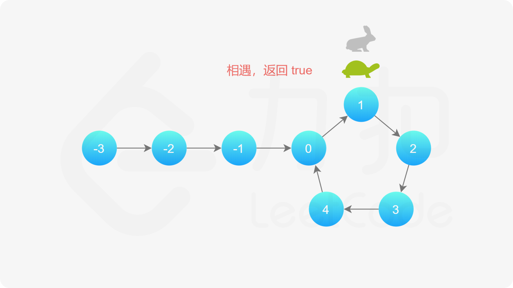

# 链表

```cPP
//链表定义
typedef struct Lnode {
	int data;//节点的数据域
	struct Lnode* next;//节点的指针域
}Lnode, *LinkList;
//链表初始化
bool InitList(LinkList& L) {
	L = new Lnode;//堆区开辟一个新结点作为链表的头节点（head），同时作为头指针指向头节点
	L->next = NULL;
	return true;
}
//判断链表是否为空
int IsEmpty(LinkList& L) {
	if (L->next == NULL) return TRUE;
	return FALSE;
}
//销毁单链表
int DestoryList(LinkList& L) {
	LinkList p;//创建一个指针
	while (L != NULL) {
		p = L;
		L = L->next;
		delete p;//L移动到下一个指针，删除p指向的节点。
	}
	return OK;
}
//清空链表
int ClearList(LinkList& L) {
	LinkList p;
	LinkList q;//创建两个指针，用于依次释放节点
	p = L->next;//将指针p指向首元节点处
	while (L != NULL) {
		q = p->next;//将p指向的那个节点的指针域赋给q,实际上就是让q指向p的下一个节点。
		delete p;//释放p指向的节点
		p = q;//将q赋给p，实际上就是让p指向q指向的节点	
	}
	L->next = NULL;//���头节点的指针域置空
	return OK;
}
//获取单链表的表长只要统计表长，不改变链表元素，因此不用&
int GetLength(LinkList L) //这里
{
	LinkList p;
	p = L->next;//将头节点的next阈值赋给p
	int i = 0;
	while (p!= NULL) {
		i++;
		p = p->next;

	}
	return i;
}
//获取链表中第i个元素的值
int GetElem(LinkList L, int i, int& e)
{
	LinkList p;
	p = L->next;//p指向首元节点
	int j = 1;//因为p已经在首元节点了，所以这里赋值直接使j=1
	while (p != NULL && j < i)//依次向后扫描，直到p指向第i个元素或者p指向空
	{
		p = p->next;
		j++;
	}
	if (!p || j > i)
	{
		cout << "out of range" << endl;
		return ERROR;
	}
	e = p->data;
	return OK;
}
//查找---按值查找，返回地址 --地址要用 指针形式返回
Lnode* LocateElem(LinkList L, int e)
{
	LinkList p;
	p = L->next;//p指向首元节点
	while (p != NULL && p->data)
	{
		p = p->next;
	}
	return p;//不管找没找到都返回地址，只是没找到时p指向空处
}
//查找-按值查找，返回位置序号
int LocateElem_L(LinkList L, int e)
{
	LinkList p;
	p = L->next;//p指向首元结点
	int j = 1;
	while (p != NULL && p->data != e)
	{
		p = p->next;
		j++;
	}
	if (p != NULL)//如果p不为空，说明找到了，返回j的位置
	{
		return j;
	}
	else//否则返回0
	{
		return 0;
	}
}
//在链表第i个位置插入新结点e
bool InsertList(LinkList& L, int i, int e) {
	LinkList p;
	p = L;//p指向头节点
	int j = 0;//j从0开始
	while (p != NULL && j < i - 1) {//寻找第i-1个节点，让指针p指向第i-1个节点位置
		p = p->next;
		++j;
	}
	if(!p||j>i-1){//i大于表长+1或者小于1，插入位置违法
		return ERROR;
	}
	Lnode* s = new Lnode;//创建一个新节点	
	s->data = e;//将新节点的数据域赋值为e
	s->next = p->next;//将新节点的指针域指向p的下一个节点
	p->next = s;//将p的指针域指向新节点
	return true;
}
//删除链表第i个位置的元素
int DeletLnode(LinkList& L, int i, int& e) {
	LinkList p;//创建一个指针,指向第i-1个节点的位置，不能直接指向第i个节点，因为删除时需要找到第i-1个节点
	p = L;
	int j = 0;
	while (p->next != NULL && j < i - 1) {//寻找第i-1个节点,并令p指向第i-1个节点
		p = p->next;
		++j;
	}
	if (!p->next || j > i - 1) {//i大于表长+1或者小于1，删除位置违法
		return ERROR;
	}
	LinkList q = p->next;//创建一个指针q，指向第i个节点
	p->next = q->next;//将第i-1个节点的指针域指向第i+1个节点
	e = q->data;//将第i个节点的数据域赋值给e
	//释放删除节点的空间，另外说明：这里不特定删除指针去，因为指针q不是在堆区开辟的，即不是new出来的，所以局部
	//变量执行完毕后，还给栈区了。
	delete q;
	return OK;
}
//输出链表 打印链表所有数据域的数据
void PrintList(LinkList L) {
	LinkList p;
	p = L->next;//p指向首元节点
	while (p != NULL) {
		cout << p->data << " ";
		p = p->next;
	}
	cout << endl;
}
```

## 单链表头插法

```cPP
//单链表的建立——头插法
void CreateListHead(LinkList& L, int n) {
	L = new Lnode;//创建一个头节点;在堆区开辟；注意这里new过之后才是结点，否则就是一个指针
	L->next = nullptr;//头节点的指针域置空 c++11写法
	for(int i=n;i>0;--i){
		Lnode* p = new Lnode;//创建新节点
		cin >> p->data;//输入新节点的数据
		//解释：第一次把p的结点的next域指针置为NULL，意思是最后一个结点的next域指针指向NULL,而后来的
		//结点的next域指针指向前一个结点，这样就形成了一个链表
		p->next = L->next;//将新节点的指针域指向头节点的指针域
		L->next = p;//将头节点的指针域指向新节点
	}
}
```

## 单链表尾插法

```cpp
//单链表的建立——尾插法
void CreateListTail(LinkList& L,int n){//通过&返回链表
	L = new Lnode;//创建一个头节点;在堆区开辟；���意这里new过之后才是结点，否则就是一个指针
	L->next = nullptr;//头节点的指针域置空 c++11写法
	LinkList r = L;//创建一个尾指针，尾指针指向头节点
	for (int i = n; i > 0; --i) {
		Lnode* p = new Lnode;//创建新节点
		cin >> p->data;//输入新节点的数据
		r->next = p;//将尾指针的指针域指向新节点,插入到尾部
		r = p;//将尾指针指向新节点，每连接上一个新结点，就把尾指针后移到新结点上，所以称之为尾指针
	}
}
```

## 单链表删除节点

```cpp
//删除链表第i个位置的元素
int DeletLnode(LinkList& L, int i, int& e) {
	LinkList p;//创建一个指针,指向第i-1个节点的位置，不能直接指向第i个节点，因为删除时需要找到第i-1个节点
	p = L;
	int j = 0;
	while (p->next != NULL && j < i - 1) {//寻找第i-1个节点,并令p指向第i-1个节点
		p = p->next;
		++j;
	}
	if (!p->next || j > i - 1) {//i大于表长+1或者小于1，删除位置违法
		return ERROR;
	}
	LinkList q = p->next;//创建一个指针q，指向第i个节点
	p->next = q->next;//将第i-1个节点的指针域指向第i+1个节点
	e = q->data;//将第i个节点的数据域赋值给e
	//释放删除节点的空间，另外说明：这里不特定删除指针去，因为指针q不是在堆区开辟的，即不是new出来的，所以局部
	//变量执行完毕后，还给栈区了。
	delete q;
	return OK;
}
```

## 单链表逆序1问题

```cPP
/**
 * Definition for singly-linked list.
 * struct ListNode {
 *     int val;
 *     ListNode *next;
 *     ListNode() : val(0), next(nullptr) {}
 *     ListNode(int x) : val(x), next(nullptr) {}
 *     ListNode(int x, ListNode *next) : val(x), next(next) {}
 * };
 */
class Solution {
public:
    ListNode* reverseList(ListNode* head) {
        ListNode* prev=nullptr;
        ListNode* curr=head;
        while(curr){
            ListNode* next=curr->next;//将下一个节点的指针指向当前节点
            curr->next=prev;//将当前节点的指针域置空
            prev=curr;//prev记住当前节点位置
            curr=next;//curr变成下一个结点的位置
        }
        return prev;      
    }
};
```

## 删除链表的倒数第N个节点

[leetcode19](https://leetcode.cn/problems/remove-nth-node-from-end-of-list/description/?envType=problem-list-v2&envId=linked-list)

思路：生成一个虚拟头节点，与题目中的 *n* 保持一致，节点的编号从 1 开始，头节点为编号 1 的节点。删除链表中倒数第N个节点意味要找到这个节点的前面一个节点。目前链表长度为L，则此时要删除的节点的前一个结点为L-N+1(因为我添加了一个虚拟头节点，所以找的时候往前推移了一个结点位置)

```c++
/**
 * Definition for singly-linked list.
 * struct ListNode {
 *     int val;
 *     ListNode *next;
 *     ListNode() : val(0), next(nullptr) {}
 *     ListNode(int x) : val(x), next(nullptr) {}
 *     ListNode(int x, ListNode *next) : val(x), next(next) {}
 * };
 */
class Solution {
public:
    int getLength(ListNode* head){
        int length=0;
        while(head){
            ++length;
            head=head->next;
        }
        return length;
    }
    ListNode* removeNthFromEnd(ListNode* head, int n) {
        ListNode* dummy =new ListNode(0,head);
        int length=getLength(head);//这里是从头节点位置开始数，并不是我加的虚拟结点。
        ListNode* cur=dummy;
        for(int i=1;i<length-n+1;++i){//从1开始计数到length-n+1
            cur=cur->next;
        }
        cur->next=cur->next->next;
        ListNode* ans=dummy->next;
        delete dummy;
        return ans;
    }
};
```

## 合并两个有序的单链表

[LeetCode链接](https://leetcode.cn/problems/merge-two-sorted-lists/submissions/595015634/?envType=problem-list-v2&envId=linked-list)

此题解法考虑双指针从头开始循环遍历往下进行排查

```c++
/**
 * Definition for singly-linked list.
 * struct ListNode {
 *     int val;
 *     ListNode *next;
 *     ListNode() : val(0), next(nullptr) {}
 *     ListNode(int x) : val(x), next(nullptr) {}
 *     ListNode(int x, ListNode *next) : val(x), next(next) {}
 * };
 */
class Solution {
public:
    ListNode* mergeTwoLists(ListNode* list1, ListNode* list2) {
        ListNode* dum=new ListNode(0);//先生成一个头结点
        ListNode* cur=dum;//返回头结点的下一个结点
        while(list1!=nullptr && list2!=nullptr){
            if(list1->val <list2->val){
                cur->next=list1;
                list1=list1->next;
            }
            else{
                cur->next=list2;
                list2=list2->next;
            }
            cur=cur->next;
        }
        cur->next=list1!=nullptr?list1:list2;//如果list1不为空为真的话输出list1
        return dum->next;

        
    }
};
```


## 判断两个链表是否有环以及入口节点

[LeetCode链接1](https://leetcode.cn/problems/linked-list-cycle/description/?envType=problem-list-v2&envId=linked-list)

使用快慢指针的方法

如果有环快指针会先进入环内，一直循环，而慢指针会后入环内最终被追上，所以逻辑如下



```cpp
/**
 * Definition for singly-linked list.
 * struct ListNode {
 *     int val;
 *     ListNode *next;
 *     ListNode(int x) : val(x), next(NULL) {}
 * };
 */
class Solution {
public:
    bool hasCycle(ListNode *head) {
        if(head==nullptr||head->next==nullptr){
            return false;
        }
        ListNode*slow=head;
        ListNode*fast=head->next;
        while(slow!=fast){
            if(fast==nullptr||fast->next==nullptr){
                return false;
            }
            slow=slow->next;
            fast=fast->next->next;
        }
        return true;
        
    }
};
```

[除了找到环还需要返还入口处](https://leetcode.cn/problems/linked-list-cycle-ii/description/?envType=problem-list-v2&envId=linked-list)
思路与算法

我们使用两个指针，fast 与 slow。它们起始都位于链表的头部。随后，slow 指针每次向后移动一个位置，而 fast 指针向后移动两个位置。如果链表中存在环，则 fast 指针最终将再次与 slow 指针在环中相遇。

如下图所示，设链表中环外部分的长度为 a。slow 指针进入环后，又走了 b 的距离与 fast 相遇。此时，fast 指针已经走完了环的 n 圈，因此它走过的总距离为 a+n(b+c)+b=a+(n+1)b+nc。


根据题意，任意时刻，fast 指针走过的距离都为 slow 指针的 2 倍。因此，我们有

a+(n+1)b+nc=2(a+b)⟹a=c+(n−1)(b+c)
有了 a=c+(n−1)(b+c) 的等量关系，我们会发现：从相遇点到入环点的距离加上 n−1 圈的环长，恰好等于从链表头部到入环点的距离。

因此，当发现 slow 与 fast 相遇时，我们再额外使用一个指针 ptr。起始，它指向链表头部；随后，它和 slow 每次向后移动一个位置。最终，它们会在入环点相遇。

```c++
/**
 * Definition for singly-linked list.
 * struct ListNode {
 *     int val;
 *     ListNode *next;
 *     ListNode(int x) : val(x), next(NULL) {}
 * };
 */
class Solution {
public:
    ListNode *detectCycle(ListNode *head) {
        ListNode *slow=head,*fast=head;
        while(fast!=nullptr){
            slow=slow->next;
            if(fast->next==nullptr){
                return nullptr;
            }
            fast=fast->next->next;
            if(fast==slow){
                ListNode *ptr=head;
                while(ptr!=slow){
                    ptr=ptr->next;
                    slow=slow->next;
                }
                return ptr;
            }
        }
        return nullptr;
        
    }
};

```

## 判断两个链表是否相交


## 旋转链表


# 单向循环链表

特点：末尾节点的指针域存第一个节点地址，而不是存空地址，单向循环列表

```cpp
#include <iostream>
using namespace std;

// 定义结点类
class Node {
public:
	int data;// 数据域
	Node* next;// 指针域,指向下一个结点
	//构造函数
	Node(int value) {
		data = value;
		next = nullptr;
	}
};
// 定义循环单链表类
class CircularLinkedList {
private:
	Node* head;//指向头结点的指针

public:
	//构造函数
	CircularLinkedList() {
		head = nullptr;
	}
	//在头部插入节点
	void insertAtHead(int value) {
		Node* newNode = new Node(value);
		if (head == nullptr) {
			head = newNode;
			head->next = head;//自己指向自己，形成循环
		}
		else {
			Node* temp = head;
			while (temp->next != head) {
				temp = temp->next;
			}
			newNode->next = head;//生成新节点指向头结点
			head = newNode;//现在的头结点是新节点
			temp->next = head;//原来的尾结点指向新的头结点
		}
	}
	//在尾部插入节点
	void insertAtTail(int value) {
		Node* newNode = new Node(value);
		if (head == nullptr) {
			head = newNode;
			head->next = head;//自己指向自己，形成循环
		}
		else {
			Node* temp = head;
			while (temp->next != head) {
				temp = temp->next;
			}
			temp->next = newNode;//原来的尾结点指向新节点
			newNode->next = head;//新节点指向头结点
		}
	}
	//删除指定值的节点
	void deleteValue(int value) {
		if (head == nullptr) {
			cout << "链表为空" << endl;
			return;
		}
		if (head->data == value) {
			if (head->next == head) {
				//只有一个节点
				delete head;
				head = nullptr;
				return;
			}
			else {
				Node* temp = head;
				while (temp->next != head) {
					temp = temp->next;
				}//到末尾节点节点
				Node* toDelete = head;//要删除的节点
				head = head->next;//将现在头结点变更为原来节点的下一个节点
				temp->next = head;//末尾节点指向新的头结点
				delete toDelete;//删除掉这个节点
			}
			return;

		}
		Node* current = head;
		while (current->next != head && current->next->data != value) {
			//当前结点的下一个结点不是要删除的结点且下一个结点不是头结点
			//继续往下找，直到找到要删除的结点或者到达末尾
			current = current->next;
		}
		if (current->next->data == value) {//找到要删除的结点
			Node* toDelete = current->next;//新建结点为要删除的结点
			current->next = current->next->next;//当前结点的指针域指向要删除结点的下一个结点位置
			delete toDelete;
		}
		else {//到末尾未找到要删除的结点
			cout << "未找到要删除的值" << endl;
		}
	}
	//修改指定位置的结点值
	void updateValue(int index, int value) {
		if (head == nullptr) {
			cout << "链表为空" << endl;
			return;
		}
		Node* current = head;
		int i = 0;
		while (current->next != head && i != index) {
			//从头结点往下走，直到找到指定位置的结点或者到达末尾
			current = current->next;
			i++;
		}
		if (i == index) {//找到结点位置
			current->data = value;
		}
		else {//未找到结点位置
			cout << "未找到指定位置" << endl;
		}
	}
	//查找是否有指定值的结点
	bool searchValue(int value) {
		if (head == nullptr) {
			cout << "链表为空" << endl;
			return false;
		}
		Node* current = head;
		do {
			if (current->data == value) {
				return true;
			}
			current = current->next;
		} while (current != head);
		return false;
	}
	//打印链表
	void printList() {
		if (head == nullptr) {
			cout << "链表为空" << endl;
			return;
		}
		Node* current = head;
		do {
			cout << current->data << " ";
			current = current->next;
		} while (current != head);
		cout << endl;
	}
	//链表逆置
	void reverseList() {
		if (head == nullptr||head->next==head) {
			//链表为空或者只有一个结点
			cout << "链表为空" << endl;
			return;
		}
		Node* pre = nullptr;
		Node* current = head;
		Node* next = nullptr;
		Node* tail = head;
		do {//从头结点下一个结点开始
			next = current->next;//next保存下一个结点的位置要改变的位置
			current->next = pre;//当前结点指向前一个结点，第一次指向nullptr
			pre = current;//pre指向当前结点
			current = next;//current指向下一个结点
		} while (current != head);

		//循环结束后，pre现在在原来的尾结点，current指向原来的头结点
		head->next = pre;//将现在头结点的指针域指向尾结点
		head = pre;//尾结点所在的位置变为头结点	
	}
	//析构函数，释放链表内存
	~CircularLinkedList() {
		if (head == nullptr) {
			return;
		}
		Node* current = head;
		while(current->next!=head){
			Node* toDelete = current;
			current = current->next;
			delete toDelete;
		}
		delete current;
		head = nullptr;
	}
};

// 主函数
int main()
{
	CircularLinkedList list;

	int choice, value, position;

	while (true)
	{
		cout << "1. 在头部插入节点" << endl;
		cout << "2. 在尾部插入节点" << endl;
		cout << "3. 删除节点" << endl;
		cout << "4. 修改节点" << endl;
		cout << "5. 查找节点" << endl;
		cout << "6. 打印链表" << endl;
		cout << "7. 逆置链表" << endl;
		cout << "8. 退出" << endl;
		cout << "请输入你的选择: ";
		cin >> choice;

		switch (choice) {
		case 1:
			cout << "请输入要插入的值: ";
			cin >> value;
			list.insertAtHead(value);
			system("pause");
			system("cls");
			break;
		case 2:
			cout << "请输入要插入的值: ";
			cin >> value;
			list.insertAtTail(value);
			system("pause");
			system("cls");
			break;
		case 3:
			cout << "请输入要删除的值: ";
			cin >> value;
			list.deleteValue(value);
			system("pause");
			system("cls");
			break;
		case 4:
			cout << "请输入要修改的位置和新值: ";
			cin >> position >> value;
			list.updateValue(position, value);
			system("pause");
			system("cls");
			break;
		case 5:
			cout << "请输入要查找的值: ";
			cin >> value;
			if (list.searchValue(value)) {
				cout << "找到节点: " << value << endl;
			}
			else {
				cout << "未找到节点: " << value << endl;
			}
			system("pause");
			system("cls");
			break;
		case 6:
			list.printList();
			system("pause");
			system("cls");
			break;
		case 7:
			list.reverseList();
			cout << "链表已逆置。" << endl;
			system("pause");
			system("cls");
			break;
		case 8:
			return 0;
		default:
			cout << "无效选择，请重试。" << endl;
		}
	}

	system("pause");
	return 0;
}

```

关于元素逆置


链表逆置的目标是将链表中所有节点的指针方向反转。例如，给定一个链表：

head -> 0x001(1, 0x002) -> 0x002(2, 0x003) -> 0x003(3, 0x001)

逆置后的链表应该变成：

head -> 0x003(3, 0x002) -> 0x002(2, 0x001) -> 0x001(1, 0x003)


核心思路
逆置链表的核心在于逐个改变每个节点的 `next` 指针，使其指向前一个节点。为了实现这一点，我们需要：
1. 遍历链表。
2. 记录当前节点的前一个节点和下一个节点。
3. 更新当前节点的 `next` 指针。

使用的指针
prev：记录前一个节点的位置。初始值为 `nullptr`，因为第一个节点逆置后将成为新链表的尾节点，它的 next 应为 nullptr。
current：记录当前节点，从头节点开始逐个遍历链表。
next：临时保存当前节点的下一个节点的位置，以便在改变 `current->next` 后还能继续遍历链表。
tail：保存原始链表的头节点，在逆置完成后更新新链表的末尾节点指向新头节点，实现循环。

原文链接：https://blog.csdn.net/w1277256813/article/details/140890636

## 约瑟夫环问题

[LeetCode链接](https://leetcode.cn/problems/find-the-winner-of-the-circular-game/description/)

**题目描述**
n个人（0,1,2,3,4…n-1），围成一圈，从编号为k的人开始报数，报数报到m的人出队（报数是1,2,…m这样报的）。下次从出队的人之后开始重新报数，循环往复，当队伍中只剩最后一个人的时候，那个人就是大王。现在，给定n，k，m，
请你求出大王的编号。

**输入描述**
输入一行包含三个整数n,k,m
1<=n<=100,1<=k<=n-1,1<=m<=100

**输出描述**
输出一个整数

**示例**
**输入**
5 1 2

**输出**
3

原文链接：https://blog.csdn.net/weixin_45532870/article/details/141604864

### 使用链表解决问题

```cpp
class Solution {
public:
    class Node//新建一个链表
    {
    public:
        Node* next;
        int id;
    };
    int findTheWinner(int n, int k) 
    {
        Node* pre,*initial;//新建两个结点
        for(int i=0;i<n;++i)//将所有位置转换为链表位置
        {
            Node* temp=new Node();//新建结点
            temp->id=i+1;//结点的数据域为从1开始编号
            if(i==0)从第一个结点开始
            {
                pre=temp;//前向指向第一个结点
                initial=temp;//后向也是 指向第一个结点                                                        
            }
            else
            {//从第二个结点开
                pre->next=temp;//pre的指针域指向新的编号，同时起始变成新的编号
                pre=temp;
            }
            //执行完全部到最后一个结点
            //到最后一个结点，又指向第一个结点
            if(i==n-1)
            {
                temp->next=initial;
            }
        }
        Node* cur=initial;//现在的头结点开始
        while(cur->next!=cur)//从第一个开始数
        {
            for(int i=0;i<k-1;++i)//找到第k个的前面一个元素的位置
            {
                pre=cur;
                cur=cur->next;
            }
            pre->next=cur->next;//将pre指向第k个元素的后面个元素的地址
            cur=pre->next;//将cur移到已经变化的pre->next的位置
            //循环没有结束就继续数数字
        }
        return cur->id;
    }
};


```

# 双向链表

## 特点

除数据域，next指针域指向下一个结点，pre指向上一个结点

## 实现代码

``` c++
#include<iostream>
using std::cout;
using std::endl;

struct Node {
	Node(int data = 0, Node* pre = nullptr, Node* next = nullptr)
		: _data(data)
		, _pre(pre)
		, _next(next) {
		cout << "Node(int=0,Node*=nullptr,node*=nullptr)" << endl;
	}
	~Node() {
		cout << "~Node()" << endl;
	}
	int _data;
	Node* _pre;
	Node* _next;
	};
class List {
	private:
		Node* _head;
		Node* _tail;
		int _size;
	public:
		List()
			: _head(new Node())
			, _tail(new Node())
			, _size(0) {
			cout << "List()" << endl;
			_head->_next = _tail;//头结点的后继指向尾结点
			_tail->_pre = _head;//尾结点的前驱指向头结点
		}
		//在头部进行插入
		void push_front(int data) {
			Node* newNode = new Node(data);//先命名一个新节点
			newNode->_pre = _head;//新结点的前驱指向头结点
			newNode->_next = _head->_next;//新结点的后继指向头结点的下一个节点
			//现在将这个结点的前驱后继两个指向这个结点
			_head->_next->_pre = newNode;//头结点的下一个节点的前驱指向新节点
			_head->_next = newNode;//头结点的后继指向新节点

			++_size;
		}
		//在尾部进行插入，尾结点一直在尾部
		void push_back(int data) {
			Node* newNode = new Node(data);
			newNode->_pre = _tail->_pre;//新结点的前驱指向尾结点的前驱
			newNode->_next = _tail;//新结点的后继指向尾结点
			//现在将这个结点的前驱后继两个指向这个结点
			_tail->_pre->_next = newNode;//尾结点的前驱的后继指向新结点
			_tail->_pre = newNode;//尾结点的前驱指向新结点

			++_size;

		}
		//在头部进行删除
		void pop_front() {
			if (size() > 0) {
				Node* pNode = _head->_next;//先找到头结点的下一个节点
				pNode->_next->_pre = _head;//头结点的下一个节点的前驱指向头结点
				_head->_next = pNode->_next;//头结点的后继指向头结点的下一个节点
				//最后删除并释放这个节点
				delete pNode;
				pNode = nullptr;
				--_size;
			}
			else {
				cout << "该链表为空，无法删除" << endl;
				return;
			}
		}
		//在尾部进行删除
		void pop_back() {
			if (size() > 0) {
				Node* pNode = _tail->_pre;//先找到尾结点的前一个节点
				pNode->_pre->_next = _tail;//尾结点的前一个节点的后继指向尾结点
				_tail->_pre = pNode->_pre;//尾结点的前驱指向尾结点的前一个节点

				delete pNode;
				pNode = nullptr;
				--_size;
			}
			else {
				cout << "该链表为空，无法删除" << endl;
				return;
			}
		}

		//在中间进行插入
		void insert(int pos, int data) {
			if (pos < 0 || pos > size()) {
				cout << "该位置异常，无法插入" << endl;
				return;
			}

			Node* pNode = _head;
			while (pos-- > 0) {//从头结点找到要插入的位置，
				pNode = pNode->_next;
			}
			
			Node* newNode = new Node(data);//新建一个节点，数据域为data，前驱后继现在为空
			//现在将新结点插入到pNode后面
			newNode->_pre = pNode;//新节点的前驱pNode
			newNode->_next = pNode->_next;//新节点的后继pNode的后一个节点
			//将断开之后的连上newNode
			pNode->_next->_pre = newNode;
			pNode->_next = newNode;

			++_size;
		}

		//在中间进行删除
		void erase(int data) {
			//先找有没有这个元素，有执行，没有不执行
			bool flag = find(data);
			if (flag) {
				Node* pNode = _head->_next;//从头结点后一个结点开始找
				while (pNode && pNode != _tail) {//pNode不为空且不是尾结点
					if (pNode->_data == data) {//找到这个元素
						Node* ptmp = pNode->_pre;//保存前一个节点
						pNode->_next->_pre = ptmp;//后一个节点的前驱指向前一个节点
						ptmp->_next = pNode->_next;//前一个节点的后继指向后一个节点

						delete pNode;
						pNode = nullptr;
						--_size;

						pNode = ptmp;
					}
					pNode = pNode->_next;
				}
			}
			else {
				cout << "该元素不在链表之中，无法删除" << endl;
				return;
			}
		}
		//查找是否有这个元素
		bool find(int data) {
			if (size() > 0) {
				Node* pNode = _head->_next;
				while (pNode && pNode != _tail) {//pNode不为空且不是尾结点
					if (data == pNode->_data) {
						return true;
					}
					pNode = pNode->_next;
				}

				return false;
			}
			else {
				cout << "该链表为空，无法查找" << endl;
				return false;
			}
		}

		void display() const {
			if (size() > 0) {
				Node* pNode = _head->_next;
				while (pNode && pNode != _tail) {
					cout << pNode->_data << "  ";
					pNode = pNode->_next;
				}
				cout << endl;
			}
			else {
				cout << "该链表为空，无法打印" << endl;
				return;
			}
		}
		//析构函数
		~List() {
			cout << "~List()" << endl;
			Node* deleteNode = _head->_next;
			while (deleteNode) {
				Node* ptmp = deleteNode->_next;
				delete deleteNode;
				deleteNode = nullptr;
				deleteNode = ptmp;
			}
			delete _head;
			_head = nullptr;
		}

		int size() const {
			return _size;
		}

};

```

## 代码解析

### struct Node部分

```cpp
struct Node {
	Node(int data = 0, Node *pre = nullptr, Node *next = nullptr)
		: _data(data)
		, _pre(pre)
		, _next(next) {
		cout << "Node(int  = 0, Node * = nullptr, Node * = nullptr) " << endl;
	}

	~Node() {
		cout << "~Node()" << endl;
	}
	int _data;
	Node *_pre;
	Node *_next;
};

```

在C++中对结构体的功能做了增强，支持**构造函数**，该函数用于初始化对象。以上代码是双链表的数据类型定义和新结点的初始化操作。**在C++中struct就是定义类的关键字**，其默认访问权限为public，与之对应的定义类的关键字为class，class的默认访问权限为private.

### List类部分

#### 构造函数

```cpp
List()
	: _head(new Node())
	, _tail(new Node())
	, _size(0) {
	cout << "List()" << endl;
	_head->_next = _tail;
	_tail->_pre = _head;
}

```

该函数的作用用于创建类对象和初始化数据成员，_head->_next = _tail;
_tail->_pre = _head;两行代码用于创建两个头结点为尾结点，其中**头结点和尾结点不带数据**，中间插入的节点带数据。

#### 析构函数

```cpp
~List() {
		cout << "~List()" << endl;
		Node *deleteNode = _head->_next;
		while (deleteNode) {
			Node *ptmp = deleteNode->_next;
			delete deleteNode;
			deleteNode = nullptr;
			deleteNode = ptmp;
		}
		delete _head;
		_head = nullptr;
	}

```

析构函数的作用用于销毁对象的数据成员，从头结点的下一个结点开始遍历采用带头尾节点的双链表，每次有一个指针保存当前节点的下一个结点，删除当前结点，再将当前结点的下一个结点置为当前结点，依次循环删除，直到只剩下头结点，最后删除头结点即完成链表的销毁操作。该双链表每次开辟结点在堆申请空间，销毁链表时需要手动释放，否则造成内存泄漏（即分配完以后未释放，造成该片已分配的空间无法再次使用）。

#### 头插push_front()

```cpp
//在头部进行插入
void push_front(int data) {
	Node *newNode = new Node(data);
	newNode->_pre = _head;
	newNode->_next = _head->_next;
	_head->_next->_pre = newNode;
	_head->_next = newNode;

	++_size;
}

```

#### 尾插

```cpp
//在尾部进行插入
void push_back(int data) {
	Node *newNode = new Node(data);
	newNode->_pre = _tail->_pre;
	newNode->_next = _tail;
	_tail->_pre->_next = newNode;
	_tail->_pre = newNode;

	++_size;

}

```

**头部删除和尾部删除同理**

#### 从头遍历链表

```cpp
void display() const {
	if (size() > 0) {
		Node *pNode = _head->_next;
		while (pNode && pNode != _tail) {
			cout << pNode->_data << "  ";
			pNode = pNode->_next;
		}
		cout << endl;
	} else {
		cout << "该链表为空，无法打印" << endl;
		return;
	}
}

```

从尾部开始遍历的链表逻辑相似，把指针定位到尾指针的前一个位置，每次往前移动，遇到头指针停止

#### 判断指定的元素是否存在（查找）

```cpp
bool find(int data) {
	if (size() > 0) {
		Node *pNode = _head->_next;
		while (pNode && pNode != _tail) {
			if (data == pNode->_data) {
				return true;
			}
			pNode = pNode->_next;
		}

		return false;
	} else {
		cout << "该链表为空，无法查找"  << endl;
		return false;
	}
}

```

该函数仅用于确定存在性，而不返回元素的具体位置

#### 从任意位置插入元素

```cpp
//在中间进行插入
void insert(int pos, int data) {
	if (pos < 0 || pos > size()) {
		cout << "该位置异常，无法插入" << endl;
		return;
	}

	Node *pNode = _head;
	while (pos-- > 0) {
		pNode = pNode->_next;
	}

	Node *newNode = new Node(data);
	newNode->_pre = pNode;
	newNode->_next = pNode->_next;
	pNode->_next->_pre = newNode;
	pNode->_next = newNode;

	++_size;
}

```

先判断插入位置是否合法，若不合法则直接return，若合法则找插入位置，找到插入位置后插入元素

#### 从任意位置删除元素

```cpp
//在中间进行删除
void erase(int data) {
	bool flag = find(data);
	if (flag) {
		Node *pNode = _head->_next;
		while (pNode && pNode != _tail) {
			if (pNode->_data == data) {
				Node *ptmp = pNode->_pre;
				pNode->_next->_pre = ptmp;
				ptmp->_next = pNode->_next;

				delete pNode;
				pNode = nullptr;
				--_size;

				pNode = ptmp;
			}
			pNode = pNode->_next;
		}
	} else {
		cout << "该元素不在链表之中，无法删除" << endl;
		return;
	}
}

```

先判断删除的位置是否合法，若不合法则退出，若合法则删除对应元素。

# 双向循环链表

```cpp
#include<iostream>
using namespace std;
using std::cout;
using std::endl;
//结点类  
class Node {
public:
    int data;
    Node* pPre, * pNext;
};
//双向循环链表类  
class DoubleCircularLinkList {
public:
    DoubleCircularLinkList() {
        head = new Node;
        head->data = 0;
        head->pNext = head;
        head->pPre = head;
    }
    ~DoubleCircularLinkList() { delete head; }
    void CreateLinkList(int n);
    void InsertNode(int position, int d);
    void TraverseLinkList();
    bool IsEmpty();
    int GetLength();
    void DeleteNode(int posiiton);
    void DeleteLinkList();
private:
    Node* head;
};

void DoubleCircularLinkList::CreateLinkList(int n) {
    if (n < 0) {
        cout << "输入结点个数错误！" << endl;
        exit(EXIT_FAILURE);
    }
    else {
        int i = 0;
        Node* pnew, * ptemp;
        ptemp = head;
        i = n;

        while (n-- > 0) {
            pnew = new Node;
            cout << "输入第" << i - n << "个结点：";
            cin >> pnew->data;
            pnew->pNext = head;
            pnew->pPre = ptemp;
            ptemp->pNext = pnew;
            ptemp = pnew;
        }
    }
}

void DoubleCircularLinkList::InsertNode(int position, int d) {
    if (position < 0 || position > GetLength() + 1) {
        cout << "输入位置错误！" << endl;
        exit(EXIT_FAILURE);
    }
    else {
        Node* pnew, * ptemp;
        pnew = new Node;
        pnew->data = d;
        ptemp = head;
        while (position-- > 1)
            ptemp = ptemp->pNext;
        pnew->pNext = ptemp->pNext;
        pnew->pPre = ptemp;
        ptemp->pNext = pnew;
        ptemp = pnew;
    }
}

void DoubleCircularLinkList::TraverseLinkList() {
    Node* ptemp = head->pNext;
    while (ptemp != head) {
        cout << ptemp->data << " ";
        ptemp = ptemp->pNext;
    }
    cout << endl;
}

bool DoubleCircularLinkList::IsEmpty() {
    if (head == head->pNext)
        return true;
    else
        return false;
}

int DoubleCircularLinkList::GetLength() {
    int n = 0;
    Node* ptemp = head->pNext;
    while (ptemp != head) {
        n++;
        ptemp = ptemp->pNext;
    }
    return n;
}

void DoubleCircularLinkList::DeleteNode(int position) {
    if (position < 0 || position > GetLength()) {
        cout << "输入位置错误！" << endl;
        exit(EXIT_FAILURE);
    }
    else {
        Node* pdelete, * ptemp;
        ptemp = head;
        while (position-- > 1)
            ptemp = ptemp->pNext;
        pdelete = ptemp->pNext;
        ptemp->pNext = pdelete->pNext;
        pdelete->pNext->pPre = ptemp;
        delete pdelete;
        pdelete = NULL;
    }
}

void DoubleCircularLinkList::DeleteLinkList() {
    Node* pdelete, * ptemp;
    pdelete = head->pNext;
    while (pdelete != head) {
        ptemp = pdelete->pNext;
        head->pNext = ptemp;
        ptemp->pPre = head;
        delete pdelete;
        pdelete = ptemp;
    }
}

//测试函数  
int main() {
    DoubleCircularLinkList dcl;
    int position = 0, value = 0, n = 0;
    bool flag = false;

    cout << "请输入需要创建双向循环链表的结点个数：";
    cin >> n;
    dcl.CreateLinkList(n);

    cout << "打印链表值如下：";
    dcl.TraverseLinkList();

    cout << "请输入插入结点的位置和值：";
    cin >> position >> value;
    dcl.InsertNode(position, value);

    cout << "打印链表值如下：";
    dcl.TraverseLinkList();

    cout << "请输入要删除结点的位置：";
    cin >> position;
    dcl.DeleteNode(position);

    cout << "打印链表值如下：";
    dcl.TraverseLinkList();

    dcl.DeleteLinkList();
    flag = dcl.IsEmpty();
    if (flag)
        cout << "删除链表成功！" << endl;
    else
        cout << "删除链表失败！" << endl;

    return 0;
}
```

