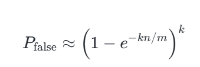
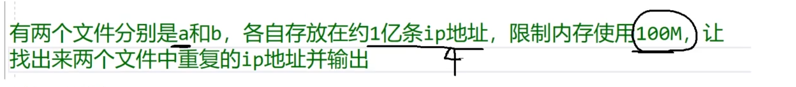

# 哈希表的理论

哈希表（Hash Table），又称散列表，是一种基于 **键值对（Key-Value）** 存储的高效数据结构，其核心思想是通过哈希函数将键（Key）映射到数组的特定位置（索引），从而实现快速的数据访问。以下从多个维度展开详细论述：

## 一、哈希表的定义与核心概念

### **基本定义**

哈希表由**哈希函数**和**数组存储结构**组成。通过哈希函数 h(k) 将关键字 k 转换为数组下标，直接访问对应位置的数据。例如，Python中的字典（`dict`）即采用哈希表实现。

### **关键术语**

**哈希函数（Hash Function）** ：将键映射到数组索引的函数，需满足均匀分布以减少冲突。

**哈希冲突（Hash Collision）** ：不同键经哈希函数计算后得到相同索引的现象。

**装填因子（Load Factor）** ：定义为表中已存元素数/哈希表总容量，反映哈希表的填充程度，直接影响冲突概率。

## 哈希函数的构造方法

哈希函数的设计需平衡**计算速度**与**分布均匀性**，常见方法包括：

1. **除留余数法**：$h(k)=kmod  p$，其中 *p* 通常为质数以减少冲突。
2. **平方取中法**：取关键字平方后的中间几位作为哈希值，适用于键值分布广的场景。
3. **折叠法**：将键分割为若干部分后相加，再取模得到索引。
4. **直接定址法**：直接以键值或线性变换（如 $h(k)=a⋅k+b$）作为索引，适用于键范围明确的情况。

## 哈希冲突的解决方法

### **开放地址法（Open Addressing）**

- **线性探测**：冲突后依次检查下一个位置$h(k)+i*modN（i=1,2,…）$，但易导致“聚集”现象。
- **二次探测**：步长按二次函数递增（如 $h(k)+i^2mod  N$），减少聚集。
- **双重哈希**：使用第二个哈希函数计算步长，进一步分散冲突元素。

### **链地址法（Separate Chaining）**

每个数组元素（桶）维护一个链表，冲突元素追加到链表中。此方法允许高装填因子，但需额外内存存储指针。

### **再哈希法（Rehashing）**

当装填因子超过阈值（如0.75）时，创建更大的数组并重新哈希所有元素，降低冲突概率。

## **基本操作**

**插入**：计算关键字的哈希值，将数据存储在对应位置。

**查找**：通过哈希函数计算关键字的哈希值，直接访问对应位置。

**删除**：找到关键字对应的存储位置并删除数据。

## 时间复杂度分析

**平均情况**：哈希表的插入、查找、删除操作的时间复杂度为 $O(1)$，前提是哈希函数分布均匀且装填因子适中。

**最坏情况**：若所有键映射到同一索引（如哈希函数设计极差），操作退化为链表或数组遍历，时间复杂度为 $O(n)$ 。

#### 与其他数据结构的对比

| 数据结构   | 优点                          | 缺点                          |
| ---------- | ----------------------------- | ----------------------------- |
| **数组**   | 快速随机访问                  | 插入/删除效率低，需连续内存   |
| **链表**   | 高效插入/删除                 | 查找需遍历，时间复杂度 $O(n)$ |
| **哈希表** | 接近 $O(1)$的增删查           | 空间利用率低，无法有序遍历    |
| **平衡树** | 有序数据，稳定 $O(log⁡n)$ 操作 | 实现复杂，内存开销大          |

## 线性探测哈希表原理

线性探测是开放寻址法中解决哈希冲突的经典方法，其核心思想是通过**线性遍历数组**寻找空槽存储冲突元素。以下是其核心原理：

####  **哈希函数与索引定位**

- **哈希函数**：将键（Key）转换为数组索引。例如，对整数键常用取模运算：`hash(key) = key % TableSize`。
- **索引冲突**：当不同键的哈希值相同时，发生冲突。此时需要寻找新的存储位置。

####  **冲突解决机制**

- **插入元素**：若目标索引已被占用，则**逐个检查后续位置**（通常步长为1），直至找到空槽或回到起点。
- **查找元素**：从哈希值对应位置开始线性探测，直到找到目标键或遇到空槽（说明键不存在）。
- **删除元素**：不能直接删除，否则会截断探测链。需标记为**DELETED**状态，查找时跳过该标记，插入时可复用。

#### **关键特性与问题**

- **主簇（Primary Clustering）** ：连续占用的槽位形成聚集，导致后续插入的探测路径变长，性能下降。
- **负载因子（Load Factor）** ：定义为元素数/表大小。通常需控制在0.7以下，过高时需扩容。
- **惰性删除**：删除时仅标记，实际清理在扩容时完成。

## 线性探测哈希表代码实现

```cpp
#include <vector>
#include <string>

enum Status { EXIST, DELETE, EMPTY };

template <typename K, typename V>
struct HashNode {
    K key;
    V value;
    Status status;
    HashNode() : status(EMPTY) {} // 默认状态为空
};

template <typename K, typename V, typename HashFunc = std::hash<K>>
class LinearProbingHashTable {
private:
    std::vector<HashNode<K, V>> table;
    size_t size;  // 当前元素数
    size_t capacity;

    // 哈希函数（使用STL默认哈希，对字符串需特化处理）
    size_t hash(const K& key) const {
        return HashFunc()(key) % capacity;
    }

    // 扩容至下一个素数
    void rehash() {
        const size_t primes[] = {53, 97, 193, 389, 769, 1543, 3079};
        size_t new_capacity = *std::upper_bound(primes, primes+7, capacity);
        std::vector<HashNode<K, V>> new_table(new_capacity);
        for (auto& node : table) {
            if (node.status == EXIST) {
                size_t idx = hash(node.key);
                while (new_table[idx].status == EXIST) 
                    idx = (idx + 1) % new_capacity;
                new_table[idx] = node;
            }
        }
        table.swap(new_table);
        capacity = new_capacity;
    }

public:
    LinearProbingHashTable(size_t initial_capacity = 53) 
        : capacity(initial_capacity), size(0) {
        table.resize(capacity);
    }

    // 插入元素
    bool insert(const K& key, const V& value) {
        if (size * 10 >= capacity * 7) rehash(); // 负载因子≥0.7时扩容
        size_t idx = hash(key);
        while (table[idx].status == EXIST) {
            if (table[idx].key == key) return false; // 键已存在
            idx = (idx + 1) % capacity;
        }
        table[idx].key = key;
        table[idx].value = value;
        table[idx].status = EXIST;
        size++;
        return true;
    }

    // 查找元素
    V* find(const K& key) {
        size_t idx = hash(key);
        size_t start = idx;
        do {
            if (table[idx].status == EXIST && table[idx].key == key) 
                return &table[idx].value;
            if (table[idx].status == EMPTY) break;
            idx = (idx + 1) % capacity;
        } while (idx != start);
        return nullptr;
    }

    // 删除元素（惰性删除）
    bool erase(const K& key) {
        size_t idx = hash(key);
        size_t start = idx;
        do {
            if (table[idx].status == EXIST && table[idx].key == key) {
                table[idx].status = DELETE;
                size--;
                return true;
            }
            if (table[idx].status == EMPTY) break;
            idx = (idx + 1) % capacity;
        } while (idx != start);
        return false;
    }
};
int main() {
    LinearProbingHashTable<int, std::string> hash_table;
    hash_table.insert(1, "Alice");
    hash_table.insert(2, "Bob");
    hash_table.insert(3, "Charlie");

    std::string* name = hash_table.find(2);
    if (name) std::cout << "Found: " << *name << std::endl; // 输出：Found: Bob

    hash_table.erase(2);
    name = hash_table.find(2);
    if (!name) std::cout << "Not Found" << std::endl; // 输出：Not Found
    return 0;
}


```

#### 1. 节点结构定义

```cpp
template <typename K, typename V>
struct HashNode {
    K key;
    V value;
    HashNode* next;
    HashNode(const K& k, const V& v) : key(k), value(v), next(nullptr) {}
};
```

#### 2. 哈希表类框架

```cpp
template <typename K, typename V>
class HashMap {
private:
    std::vector<HashNode<K, V>*> buckets; // 桶数组
    int capacity;                        // 桶数量
    int size;                            // 元素总数
    double loadFactor;                   // 负载因子阈值

    // 哈希函数：简单取模
    int hashFunction(const K& key) {
        return std::hash<K>{}(key) % capacity;
    }

    // 扩容函数（见后续实现）
    void resize();

public:
    HashMap(int initialCapacity = 10, double lf = 0.75)
        : capacity(initialCapacity), size(0), loadFactor(lf) {
        buckets.resize(capacity, nullptr);
    }

    \~HashMap() {
        // 析构时释放所有链表节点
        for (int i = 0; i < capacity; ++i) {
            HashNode<K, V>* entry = buckets[i];
            while (entry != nullptr) {
                HashNode<K, V>* prev = entry;
                entry = entry->next;
                delete prev;
            }
        }
    }

    void insert(const K& key, const V& value);
    V* find(const K& key);
    void remove(const K& key);
};
```

#### 3.插入操作（Insert）

```cpp
void insert(const K& key, const V& value) {
    // 检查是否需要扩容
    if ((size * 1.0) / capacity >= loadFactor) {
        resize();
    }

    int bucketIdx = hashFunction(key);
    HashNode<K, V>* entry = buckets[bucketIdx];

    // 遍历链表检查是否已存在相同key
    while (entry != nullptr) {
        if (entry->key == key) {
            entry->value = value; // 更新值
            return;
        }
        entry = entry->next;
    }

    // 创建新节点并插入链表头部（头插法）
    HashNode<K, V>* newNode = new HashNode<K, V>(key, value);
    newNode->next = buckets[bucketIdx];
    buckets[bucketIdx] = newNode;
    size++;
}
```

#### 4. 查找操作（Find）

```cpp
V* find(const K& key) {
    int bucketIdx = hashFunction(key);
    HashNode<K, V>* entry = buckets[bucketIdx];

    while (entry != nullptr) {
        if (entry->key == key) {
            return &(entry->value);
        }
        entry = entry->next;
    }
    return nullptr; // 未找到
}
```

#### 5. 删除操作（Remove）

```cpp
void remove(const K& key) {
    int bucketIdx = hashFunction(key);
    HashNode<K, V>* entry = buckets[bucketIdx];
    HashNode<K, V>* prev = nullptr;

    while (entry != nullptr) {
        if (entry->key == key) {
            if (prev == nullptr) {
                // 删除头节点
                buckets[bucketIdx] = entry->next;
            } else {
                prev->next = entry->next;
            }
            delete entry;
            size--;
            return;
        }
        prev = entry;
        entry = entry->next;
    }
}
```

#### 6.扩容操作（Resize）

```cpp
void resize() {
    int newCapacity = capacity * 2;
    std::vector<HashNode<K, V>*> newBuckets(newCapacity, nullptr);

    // 重新哈希所有元素
    for (int i = 0; i < capacity; ++i) {
        HashNode<K, V>* entry = buckets[i];
        while (entry != nullptr) {
            HashNode<K, V>* next = entry->next;
            int newIdx = std::hash<K>{}(entry->key) % newCapacity;

            // 插入新桶的链表头部
            entry->next = newBuckets[newIdx];
            newBuckets[newIdx] = entry;

            entry = next;
        }
    }

    // 更新桶数组和容量
    buckets = std::move(newBuckets);
    capacity = newCapacity;
}
```

## 链式探测哈希表的原理

#### **一、链式哈希表的核心原理**

链式哈希表（Separate Chaining Hash Table）通过哈希函数将键映射到数组（桶数组）的特定位置，每个桶对应一个链表结构。当哈希冲突发生时（多个键映射到同一桶），新元素直接加入该桶对应的链表中，实现动态扩容能力。

**核心组件：**

哈希函数：将键转换为整数索引（如取模运算），决定元素存储位置。

- 例如：`hash(key) = key % bucket_size`，其中`bucket_size`通常取质数以减少冲突。

**桶数组**：每个桶维护一个链表，存储哈希值相同的键值对。

**负载因子（Load Factor）** ：衡量哈希表空间利用率，计算公式为`元素总数 / 桶数量`。当负载因子超过阈值（如0.75）时触发扩容。

**冲突解决机制：**

- **链地址法**：所有哈希到同一位置的元素以链表形式串联。插入时直接在链表头部或尾部添加节点，无需线性探测。

## **链式探测哈希表的实现**

### **1. 数据结构定义**

```cpp
template <typename K, typename V>
class HashTable {
private:
    struct Node {
        K key;
        V value;
        Node* next;
        Node(K k, V v) : key(k), value(v), next(nullptr) {}
    };

    std::vector<Node*> buckets;   // 桶数组，存储链表头节点
    int capacity;                 // 桶的数量
    int size;                     // 元素总数
    double loadFactorThreshold;   // 扩容阈值，默认为0.75

    // 哈希函数：键到桶索引的映射
    int hashCode(K key) {
        return std::hash<K>{}(key) % capacity;
    }

public:
    HashTable(int initialCapacity = 11, double threshold = 0.75) 
        : capacity(initialCapacity), size(0), loadFactorThreshold(threshold) {
        buckets.resize(capacity, nullptr);
    }

    \~HashTable() {
        // 释放所有链表节点内存
        for (int i = 0; i < capacity; ++i) {
            Node* node = buckets[i];
            while (node) {
                Node* temp = node;
                node = node->next;
                delete temp;
            }
        }
    }
};

```

### **2. 插入操作（Put）**

- 步骤：
  1. 计算键的哈希值，定位到桶索引。
  2. 遍历链表检查键是否已存在：若存在则更新值，否则插入新节点。
  3. 检查负载因子，超过阈值则扩容并重哈希。

```cpp
void put(K key, V value) {
    // 检查是否需要扩容
    if ((double)size / capacity > loadFactorThreshold) {
        resize();
    }

    int index = hashCode(key);
    Node* node = buckets[index];
    
    // 遍历链表查找键是否存在
    while (node) {
        if (node->key == key) {
            node->value = value;  // 更新值
            return;
        }
        node = node->next;
    }

    // 插入新节点到链表头部
    Node* newNode = new Node(key, value);
    newNode->next = buckets[index];
    buckets[index] = newNode;
    size++;
}
```

### **3. 查找操作（Get）**

- 步骤：
  1. 计算哈希值定位桶。
  2. 遍历链表查找键，返回对应值或`nullptr`。

```cpp
V* get(K key) {
    int index = hashCode(key);
    Node* node = buckets[index];
    while (node) {
        if (node->key == key) {
            return &(node->value);
        }
        node = node->next;
    }
    return nullptr;  // 未找到
}
```

### **4. 删除操作（Remove）**

- 步骤：
  1. 定位到桶并遍历链表。
  2. 调整链表指针以跳过目标节点，释放内存。

```cpp
bool remove(K key) {
    int index = hashCode(key);
    Node* node = buckets[index];
    Node* prev = nullptr;

    while (node) {
        if (node->key == key) {
            if (prev) {
                prev->next = node->next;
            } else {
                buckets[index] = node->next;  // 删除头节点
            }
            delete node;
            size--;
            return true;
        }
        prev = node;
        node = node->next;
    }
    return false;  // 未找到
}
```

### **5. 扩容与重哈希**

- 步骤：
  1. 创建更大的桶数组（通常双倍容量，并选择邻近质数）。
  2. 遍历旧桶，将所有元素重新哈希到新桶中。

```cpp
void resize() {
    int newCapacity = nextPrime(capacity * 2);  // 选择下一个质数
    std::vector<Node*> newBuckets(newCapacity, nullptr);

    for (int i = 0; i < capacity; ++i) {
        Node* node = buckets[i];
        while (node) {
            Node* nextNode = node->next;
            // 计算新的哈希值
            int newIndex = std::hash<K>{}(node->key) % newCapacity;
            // 插入到新桶的链表头部
            node->next = newBuckets[newIndex];
            newBuckets[newIndex] = node;
            node = nextNode;
        }
    }

    buckets = std::move(newBuckets);
    capacity = newCapacity;
}
```

1、为什么采用链式哈希表？不采用线性探测哈希表？

线性哈希表的缺陷

1、发生哈希冲突时

2、多线程环境下

链式哈希表可以才用分段锁

线性哈希表的缺陷在链式哈希表的实现


如果两个容器使用的空间配置器allocator是一样的，那么可以直接交换两个容器的成员变量即可，效率高

如果两个容器使用的空间配置器allocator是不一样的，那么两个容器管理外部堆内存的方式是不一样的。

## 优化

哈希表的总结


# 哈希表应用

## 大数据查重

### 查重

#### 一、哈希表的基本原理

哈希表是一种通过**哈希函数**将键（Key）映射到存储位置的数据结构，其核心思想是通过数学函数建立键与存储位置的直接对应关系，从而实现快速查找。具体步骤如下：

1. **哈希函数计算**：将任意类型的数据转换为固定长度的整数（哈希值），例如使用除留余数法、字符串哈希等。
2. **存储位置确定**：哈希值对数组长度取模，得到数组索引。
3. **冲突处理**：当不同键映射到同一位置时，通过**拉链法**（链表存储冲突元素）或**线性探测法**（顺序查找下一个空位）解决冲突。

#### 二、哈希表在大数据查重中的应用原理

1. **快速判重**：通过哈希表的键唯一性，在插入元素前检查哈希表中是否已存在该键。若存在，则判定为重复数据。
2. **时间复杂度**：理想情况下，哈希表的插入和查找操作的平均时间复杂度为O(1)，适合海量数据场景。
3. **空间与性能平衡**：通过调整负载因子（已占用桶数/总桶数）和动态扩容，平衡内存占用与查询效率。例如，当负载因子超过0.8时触发扩容。

### C++实现示例

#### 1. 使用标准库`unordered_set`实现查重

```cpp
#include <iostream>
#include <unordered_set>
#include <vector>

int main() {
    std::vector<int> data = {1, 2, 3, 4, 2, 5, 3}; // 示例数据
    std::unordered_set<int> hash_set;

    for (const auto& num : data) {
        if (hash_set.find(num) != hash_set.end()) {
            std::cout << "重复元素: " << num << std::endl;
        } else {
            hash_set.insert(num);
        }
    }
    return 0;
}
```

**代码说明**：利用`unordered_set`的O(1)查找特性，遍历数据时直接判断是否重复。C++标准库的`unordered_set`底层采用链地址法处理冲突。

#### 2. 自定义链式哈希表实现

```cpp
#include <vector>
#include <list>

template<typename Key>
class HashTable {
private:
    std::vector<std::list<Key>> buckets;
    int capacity;
    float load_factor = 0.75;

    int hash(const Key& key) const {
        return std::hash<Key>{}(key) % capacity;
    }

    void rehash() {
        int new_capacity = capacity * 2;
        std::vector<std::list<Key>> new_buckets(new_capacity);
        for (auto& bucket : buckets) {
            for (const auto& key : bucket) {
                int idx = std::hash<Key>{}(key) % new_capacity;
                new_buckets[idx].push_back(key);
            }
        }
        buckets = std::move(new_buckets);
        capacity = new_capacity;
    }

public:
    HashTable(int initial_capacity = 8) : capacity(initial_capacity) {
        buckets.resize(capacity);
    }

    bool insert(const Key& key) {
        int idx = hash(key);
        for (const auto& k : buckets[idx]) {
            if (k == key) return false; // 重复
        }
        buckets[idx].push_back(key);
        if (static_cast<float>(size()) / capacity > load_factor) {
            rehash();
        }
        return true;
    }

    bool contains(const Key& key) const {
        int idx = hash(key);
        for (const auto& k : buckets[idx]) {
            if (k == key) return true;
        }
        return false;
    }

    size_t size() const {
        size_t count = 0;
        for (const auto& bucket : buckets) {
            count += bucket.size();
        }
        return count;
    }
};
```

**代码说明**：

- **链地址法**：每个桶使用链表存储冲突元素。
- **动态扩容**：当负载因子超过阈值时，触发`rehash`操作，重新分配所有键到更大的哈希表中。
- **哈希函数**：使用C++标准库的`std::hash`生成哈希值。

### 位图算法

1. **位图的核心设计**

   - 每个二进制位（bit）表示一个数据是否存在，例如第k*k*位为1表示整数k*k*已存在。
   - 内存节省显著：40亿整数仅需约512MB（4×109/84×109/8字节）。

2. **适用条件**

   - 数据范围已知且相对密集，如IP地址、用户ID等。
   - 不适用于数据稀疏或范围过大的场景（如最大值远超过数据量）。

3. **局限性**

   - 无法直接记录重复次数，仅能判断存在性。
   - 需预先确定数据范围，动态扩展困难。

   #### 哈希表与位图的结合策略

   **分治+位图**

   **步骤**：

   将大数据分块（如按哈希函数分配到多个文件）。

   对每个文件使用位图查重。

   - **优势**：减少单次内存压力，适合分布式处理。
   - **示例场景**：处理50亿数据时，分100个文件，每个文件位图仅需约5MB内存。

   **哈希函数优化位图映射**

   - 使用哈希函数将数据映射到更小的范围，再通过位图存储。例如，对字符串哈希取模缩小范围。
   - **关键点**：需选择均匀分布的哈希函数（如MurmurHash）以减少冲突。

### 位图算法代码实现

```cpp
#include <vector>
#include <iostream>

class Bitmap {
private:
    std::vector<unsigned char> bits; // 使用字节数组存储位图
    size_t max_num;                  // 数据最大值

public:
    Bitmap(size_t max) : max_num(max) {
        // 计算所需字节数：最大值/8 +1（向上取整）
        size_t size = (max >> 3) + 1;
        bits.resize(size, 0);
    }

    // 设置某数值对应的位为1
    void set(size_t num) {
        if (num > max_num) return;
        size_t index = num >> 3;     // 计算字节位置：num / 8
        size_t offset = num & 0x07;  // 计算位偏移：num % 8
        bits[index] |= (1 << offset);
    }

    // 检查数值是否存在
    bool test(size_t num) const {
        if (num > max_num) return false;
        size_t index = num >> 3;
        size_t offset = num & 0x07;
        return (bits[index] & (1 << offset)) != 0;
    }

    // 重置位图
    void clear() {
        std::fill(bits.begin(), bits.end(), 0);
    }
};

int main() {
    const size_t MAX_NUM = 1000000000; // 假设最大值为10亿
    Bitmap bitmap(MAX_NUM);

    // 模拟数据流插入
    std::vector<size_t> data_stream = {123, 456, 123, 789, 456};
    for (auto num : data_stream) {
        if (!bitmap.test(num)) {
            std::cout << num << " 首次出现，加入集合。" << std::endl;
            bitmap.set(num);
        } else {
            std::cout << num << " 重复！" << std::endl;
        }
    }
    return 0;
}

```


****

### 布隆过滤器、Bloom Filter布隆过滤器

布隆过滤器（Bloom Filter）是一种由Burton Howard Bloom于1970年提出的概率型数据结构，用于高效判断元素是否存在于集合中。其核心原理基于 **位数组（bit array）** 和**多个哈希函数**的组合。

**数据结构**

- **位数组**：长度为`m`的二进制向量，初始全为0。
- **哈希函数**：`k`个独立的哈希函数，将元素映射到位数组的`k`个位置。

1. **操作流程**

   - **插入元素**：
     通过`k`个哈希函数计算元素的哈希值，将对应位数组的位置置1。例如，元素`x`经过哈希函数`h1(x), h2(x), ..., hk(x)`映射到位数组的`k`个位置，均设为1。
   - **查询元素**：
     检查元素的`k`个哈希值对应位是否全为1。若全为1，则元素**可能存在**；若任一位置为0，则元素**一定不存在**。

2. **误判率分析**
   误判率（False Positive）受以下因素影响：

   - **位数组大小**（`m`）：`m`越大，误判率越低。
   - **哈希函数数量**（`k`）：存在最优值，过多或过少均会增加误判率。
   - **元素数量**（`n`）：随着`n`增加，误判率逐步上升。

   数学公式表示误判率：

   

   通过调整`m`和`k`可平衡空间与误判率。

#### 布隆过滤器的应用场景

布隆过滤器在大数据场景中广泛应用，典型场景包括：

1. **URL去重（网络爬虫）**
   爬虫系统通过布隆过滤器快速判断URL是否已爬取，避免重复请求。例如，处理1亿级URL时，仅需约120MB内存即可实现1%的误判率。
2. **缓存穿透防护**
   在分布式系统中，布隆过滤器预先过滤无效请求（如不存在的缓存键），避免直接冲击数据库。
3. **垃圾邮件过滤**
   快速判断邮件地址或内容是否为已知垃圾邮件，减少处理开销。
4. **推荐系统去重**
   避免向用户重复推荐相同内容，例如抖音等平台的历史记录管理。

#### 布隆过滤器代码实现

以下是一个基于C++的布隆过滤器实现示例，包含三个哈希函数（BKDRHash、APHash、DJBHash）和动态参数配置：

```cpp
#include <iostream>
#include <vector>
#include <bitset>
#include <functional>

class BloomFilter {
public:
    BloomFilter(size_t size, size_t hash_num) 
        : bit_size(size), hash_count(hash_num), bit_array(size, false) {}

    // 哈希函数1：BKDRHash
    size_t BKDRHash(const std::string& key) {
        size_t hash = 0;
        for (char c : key) {
            hash = hash * 131 + c;
        }
        return hash % bit_size;
    }

    // 哈希函数2：APHash
    size_t APHash(const std::string& key) {
        size_t hash = 0xAAAAAAAA;
        for (size_t i = 0; i < key.length(); i++) {
            hash ^= ((i & 1) == 0) ? (hash << 7) ^ key[i] * (hash >> 3) : 
                                    \~((hash << 11) + key[i] ^ (hash >> 5));
        }
        return hash % bit_size;
    }

    // 哈希函数3：DJBHash
    size_t DJBHash(const std::string& key) {
        size_t hash = 5381;
        for (char c : key) {
            hash = (hash << 5) + hash + c;
        }
        return hash % bit_size;
    }

    // 插入元素
    void insert(const std::string& key) {
        size_t h1 = BKDRHash(key);
        size_t h2 = APHash(key);
        size_t h3 = DJBHash(key);
        bit_array[h1] = true;
        bit_array[h2] = true;
        bit_array[h3] = true;
    }

    // 查询元素
    bool contains(const std::string& key) {
        size_t h1 = BKDRHash(key);
        size_t h2 = APHash(key);
        size_t h3 = DJBHash(key);
        return bit_array[h1] && bit_array[h2] && bit_array[h3];
    }

private:
    size_t bit_size;           // 位数组大小
    size_t hash_count;         // 哈希函数数量
    std::vector<bool> bit_array; // 位数组
};

int main() {
    BloomFilter bf(1000, 3);  // 位数组大小1000，3个哈希函数
    
    // 插入示例
    bf.insert("https://example.com");
    bf.insert("user123@email.com");
    
    // 查询示例
    std::cout << "Contains 'user123@email.com': " << bf.contains("user123@email.com") << std::endl; // 输出1
    std::cout << "Contains 'unknown_url': " << bf.contains("unknown_url") << std::endl;             // 输出0
    
    return 0;
}
```

**代码说明**：

- **哈希函数**：采用三种经典哈希算法（BKDR、AP、DJB），降低碰撞概率。
- **动态配置**：允许自定义位数组大小和哈希函数数量。
- **误判率测试**：可通过插入大量数据并统计误判次数验证参数合理性。

#### 实际应用案例

1. **Redis布隆过滤器插件**
   Redis 4.0+支持插件`jrebloom`，提供分布式布隆过滤器功能，适用于缓存穿透防护。
2. **Google Guava库**
   单机场景下，Java的Guava库提供`BloomFilter`类，支持动态扩容和误判率配置。
3. **以太坊区块链**
   以太坊全节点使用布隆过滤器快速判断交易是否在区块中，优化查询效率。

## 求topk问题

### 大小跟堆求topk问题

#### 一、TopK问题的定义与应用场景

TopK问题是指从大量数据中快速找出**最大（或最小）的K个元素**的算法问题，其核心挑战在于高效处理海量数据。典型应用包括：

- **排行榜系统**（如游戏玩家积分前100名）
- **实时数据流处理**（如热搜词统计）
- **推荐系统**（如推荐用户最可能购买的K件商品）
- **大数据分析**（如日志中高频错误类型统计）

#### 二、堆算法的核心原理

堆（Heap）是一种完全二叉树结构，分为**大根堆**（父节点值≥子节点）和**小根堆**（父节点值≤子节点）。堆操作的时间复杂度为O(log n)，是解决TopK问题的理想数据结构。

#### 1. 小根堆求最大TopK

- **原理**：维护一个大小为K的小根堆，堆顶始终是当前K个元素中的最小值。
- 流程：
  1. 初始化时插入前K个元素并建堆。
  2. 遍历后续元素，若新元素>堆顶，则替换堆顶并调整堆结构。
  3. 最终堆中保留的就是最大的K个元素。
- **优势**：避免存储全部数据，内存效率高。

#### 2. 大根堆求最小TopK

- **原理**：维护一个大小为K的大根堆，堆顶是当前K个元素中的最大值。
- 流程：
  1. 插入前K个元素建堆。
  2. 遍历后续元素，若新元素<堆顶，替换堆顶并调整。
  3. 最终堆中保留最小的K个元素。
- **适用场景**：需保留最小值的场景，但实际中较少使用（时间复杂度相同，但需更多交换操作）。

### 代码实现

#### 1. 小根堆实现最大TopK

```cpp
#include <iostream>
#include <vector>
#include <queue>

std::vector<int> topKMax(const std::vector<int>& nums, int k) {
    std::priority_queue<int, std::vector<int>, std::greater<int>> min_heap;
    
    for (int num : nums) {
        if (min_heap.size() < k) {
            min_heap.push(num);
        } else if (num > min_heap.top()) {
            min_heap.pop();
            min_heap.push(num);
        }
    }
    
    std::vector<int> result;
    while (!min_heap.empty()) {
        result.push_back(min_heap.top());
        min_heap.pop();
    }
    // 结果需逆序，从小到大转成从大到小
    std::reverse(result.begin(), result.end());
    return result;
}
```

#### 2. 大根堆实现最小TopK

```cpp
std::vector<int> topKMin(const std::vector<int>& nums, int k) {
    std::priority_queue<int> max_heap;
    
    for (int num : nums) {
        if (max_heap.size() < k) {
            max_heap.push(num);
        } else if (num < max_heap.top()) {
            max_heap.pop();
            max_heap.push(num);
        }
    }
    
    std::vector<int> result;
    while (!max_heap.empty()) {
        result.push_back(max_heap.top());
        max_heap.pop();
    }
    // 结果需逆序，从大到小转成从小到大
    std::reverse(result.begin(), result.end());
    return result;
}
```

#### 3. 测试示例

```cpp
int main() {
    std::vector<int> data = {3, 2, 1, 5, 6, 4, 9, 8, 7};
    int k = 3;
    
    auto maxK = topKMax(data, k);
    std::cout << "最大Top3: ";
    for (int num : maxK) std::cout << num << " ";
    std::cout << std::endl;  // 输出：9 8 7
    
    auto minK = topKMin(data, k);
    std::cout << "最小Top3: ";
    for (int num : minK) std::cout << num << " ";
    std::cout << std::endl;  // 输出：1 2 3
    return 0;
}
```

**Q1：为何小根堆用于求最大TopK？**
**A**：小根堆的堆顶是当前K个元素的最小值。当新元素更大时替换堆顶，确保堆中始终保留最大的K个元素。

**Q2：堆与快排选哪种？**
**A**：若需动态更新（如实时数据流）或内存有限，用堆；若数据可全部加载且需精确结果，用快排。

**Q3：如何选择K的大小？**
**A**：K越小，堆的效率越高。当K接近n时，全排序更优。

### 快排分割算法求解大数据topk问题

#### 一、快速排序分割算法原理

快速排序的核心在于**分割（Partition）算法**，其通过以下步骤将数组分为两部分：

1. **选择枢轴**：从数组中选取一个元素作为基准（Pivot）。优化方法包括随机选取或"三数取中法"（取首、中、尾三数的中间值）以避免最坏时间复杂度。
2. **分割操作**：将数组重新排列，使得所有小于枢轴的元素位于其左侧，大于等于枢轴的元素位于右侧。
3. **递归排序**：对左右两部分递归执行上述操作。

时间复杂度：平均O(n logn)，最坏O(n²)（但优化枢轴选择后概率极低）。

------

#### 二、TopK问题与快速选择算法

**TopK问题**指从无序数组中找出前K大（或小）的元素。传统排序法需O(n logn)时间，而基于分割的 **快速选择算法（QuickSelect）** 可将时间复杂度优化至平均O(n)。

#### 算法核心思想：

1. 每次分割后，根据枢轴位置判断目标K所在的区间。
2. 仅递归处理目标区间，避免完全排序。
3. 当枢轴位置等于K时，其左侧/右侧即为所求的TopK元素。

**时间复杂度分析**：

- 平均：每次分割区间减半，总操作次数为$n + n/2 + n/4 + ... ≈ 2n → O(n)$
- 最坏：O(n²)（但优化枢轴选择后可避免）

#### 代码实现

以下代码实现了基于三数取中法的快速选择算法，用于查找数组中前K大的元素：

```cpp
#include <vector>
#include <algorithm>
using namespace std;

// 三数取中法选择枢轴
int medianOfThree(vector<int>& nums, int left, int right) {
    int mid = left + (right - left) / 2;
    if (nums[left] < nums[mid]) swap(nums[left], nums[mid]);
    if (nums[left] < nums[right]) swap(nums[left], nums[right]);
    if (nums[mid] < nums[right]) swap(nums[mid], nums[right]);
    return mid; // 返回中间值的位置
}

int partition(vector<int>& nums, int left, int right) {
    int pivotIndex = medianOfThree(nums, left, right);
    int pivot = nums[pivotIndex];
    swap(nums[pivotIndex], nums[right]); // 将枢轴移至末尾
    
    int i = left;
    for (int j = left; j < right; j++) {
        if (nums[j] > pivot) { // 找前K大时比较方向为>
            swap(nums[i], nums[j]);
            i++;
        }
    }
    swap(nums[i], nums[right]); // 将枢轴放回正确位置
    return i;
}

void quickSelect(vector<int>& nums, int left, int right, int k) {
    if (left >= right) return;
    
    int pos = partition(nums, left, right);
    int count = pos - left + 1; // 当前枢轴是第count大的元素
    
    if (count == k) return;
    else if (count > k) quickSelect(nums, left, pos - 1, k); // 前k大在左半区
    else quickSelect(nums, pos + 1, right, k - count); // 继续在右半区找剩余的k-count
}

vector<int> topKFrequent(vector<int>& nums, int k) {
    quickSelect(nums, 0, nums.size() - 1, k);
    return vector<int>(nums.begin(), nums.begin() + k);
}
```

### 大数据场景优化策略

1. **内存优化**：若数据无法全载入内存，可采用分块处理，每次处理一个数据块后合并结果。
2. **并行化**：利用多线程对分割后的子数组并行处理。
3. **混合算法**：当K非常小时（如K<100），堆排序可能更高效；当K接近n时，快速选择更优。

# 一致性哈希算法

负载场景


前后两个信息映射不到一台服务器上

关于缓存的集群

缓存负载服务

### 理论

#### 1. 核心原理

一致性哈希算法（Consistent Hashing）由David Karger等人在1997年提出，旨在解决分布式系统中的负载均衡和容错问题。其核心思想是将哈希值空间组织成一个**虚拟圆环**（通常为0~2^32-1的整数范围），通过哈希函数将节点和数据映射到环上，并沿顺时针方向定位数据所属节点。

- **哈希环结构**：所有节点（如服务器）和数据（如请求）通过哈希函数（如MD5、SHA-1）映射到环上。例如，服务器IP的哈希值决定了其在环上的位置。
- **数据定位规则**：数据存储或请求时，根据其哈希值在环上顺时针查找第一个节点。例如，若数据哈希值在节点A和B之间，则归属节点B。
- **动态扩展性**：新增或删除节点时，仅影响相邻节点间的数据，避免了传统哈希算法中全局重新映射的问题。

#### 2. 关键特性

- **平衡性**（Balance）：哈希结果均匀分布，避免数据倾斜。
- **单调性**（Monotonicity）：节点增减时，已有数据尽可能保留在原节点或迁移到新节点。
- **分散性**（Spread）：相同数据在不同客户端映射到同一节点，减少冗余。
- **负载**（Load）：避免部分节点过载，通过虚拟节点优化负载分布。

#### 3. 虚拟节点机制

为解决节点数量较少时的分布不均问题，一致性哈希引入**虚拟节点**。每个物理节点对应多个虚拟节点，通过增加环上的节点密度提升均衡性。例如，物理节点A可映射为虚拟节点A-01、A-02等，每个虚拟节点独立参与哈希环的映射。

#### 4. 应用场景

- **分布式缓存**：如Memcached、Redis，动态管理缓存节点。
- **负载均衡**：如Nginx、Dubbo，分配请求到后端服务器。
- **数据库分库分表**：数据按哈希值分布到不同分片，支持水平扩展。
- **P2P网络**：分布式哈希表（DHT）中高效定位资源。

### C++实现一致性哈希算法

#### 1. 代码实现示例

```cpp
#include <iostream>
#include <string>
#include <map>
#include <functional>

class ConsistentHashing {
private:
    std::map<uint32_t, std::string> ring;  // 哈希环，存储虚拟节点哈希值与物理节点名的映射
    int virtual_nodes_per_physical;        // 每个物理节点对应的虚拟节点数

    // 哈希函数（示例使用std::hash，实际需替换为更均匀的算法如MD5）
    uint32_t hash(const std::string& key) {
        return std::hash<std::string>{}(key);
    }

public:
    ConsistentHashing(int virtual_nodes) : virtual_nodes_per_physical(virtual_nodes) {}

    // 添加物理节点
    void add_node(const std::string& node) {
        for (int i = 0; i < virtual_nodes_per_physical; ++i) {
            std::string virtual_node = node + "#" + std::to_string(i);
            uint32_t hash_value = hash(virtual_node);
            ring[hash_value] = node;
        }
    }

    // 移除物理节点
    void remove_node(const std::string& node) {
        for (int i = 0; i < virtual_nodes_per_physical; ++i) {
            std::string virtual_node = node + "#" + std::to_string(i);
            uint32_t hash_value = hash(virtual_node);
            ring.erase(hash_value);
        }
    }

    // 查找数据所属节点
    std::string get_node(const std::string& key) {
        if (ring.empty()) return "";

        uint32_t key_hash = hash(key);
        auto it = ring.upper_bound(key_hash);  // 查找第一个大于key_hash的节点

        if (it == ring.end()) {
            it = ring.begin();  // 环形结构，回到起点
        }
        return it->second;
    }
};

int main() {
    ConsistentHashing ch(3);  // 每个物理节点对应3个虚拟节点

    // 添加物理节点
    ch.add_node("NodeA");
    ch.add_node("NodeB");
    ch.add_node("NodeC");

    // 测试数据映射
    std::cout << "key1 -> " << ch.get_node("key1") << std::endl;
    std::cout << "key2 -> " << ch.get_node("key2") << std::endl;

    // 移除节点并重新测试
    ch.remove_node("NodeB");
    std::cout << "After removing NodeB:" << std::endl;
    std::cout << "key1 -> " << ch.get_node("key1") << std::endl;

    return 0;
}
```

#### 2. 实现要点

- **数据结构**：使用`std::map`（红黑树）存储哈希环，支持O(log n)的插入、删除和查找操作。
- **虚拟节点生成**：每个物理节点生成多个虚拟节点（如3个），提升分布均匀性。
- **哈希函数选择**：实际应用中需使用分布均匀的算法（如MD5、KETAMA_HASH），避免数据倾斜。

#### 3. 性能优化

- **虚拟节点数量**：通常设置为100~200，平衡内存开销与分布均匀性。
- **动态调整**：节点增减时仅需调整虚拟节点，无需全量数据迁移。

------

### 注意事项

1. **哈希函数选择**：需确保哈希值均匀分布，避免热点问题。推荐使用MD5或CRC32。
2. **虚拟节点数量**：虚拟节点越多，负载越均衡，但内存占用增加。需根据场景权衡。
3. **并发控制**：多线程环境下需对哈希环加锁（如`std::mutex`）保证线程安全。
4. **容错与恢复**：节点故障时，需结合心跳检测自动移除节点并触发数据迁移。

------

### 扩展阅读

- **虚拟节点优化**：通过权重机制为不同性能的节点分配不同数量的虚拟节点。
- **一致性哈希变种**：如带权一致性哈希、分层一致性哈希，适用于复杂场景。

# 面试题目

哈希表内部的原理？

怎么处理哈希冲突的？

查找字符串第一个没有重复的字符

查重的面试相关问题

1、有有个文件分别是a和b，里面放了很多ip地址（url地址、email地址），让你找出两个文件重复的ip，输出出，限制出来




