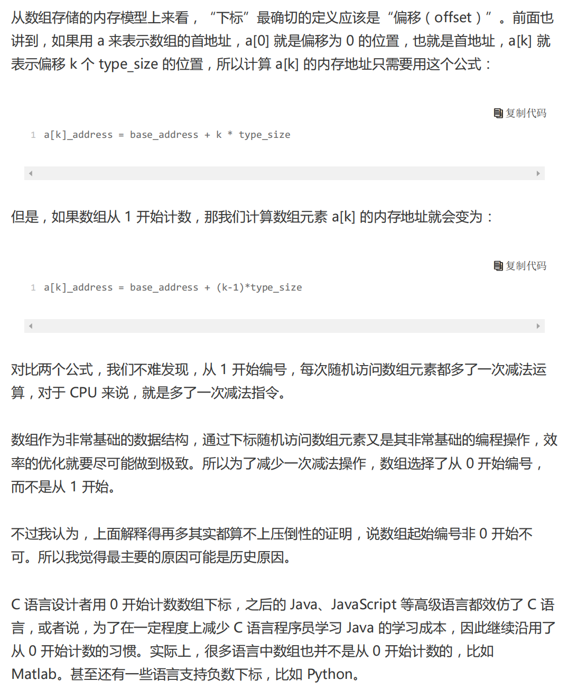

# 数组

```cpp
#include<iostream>//包含标准输入输出流库
using namespace std;//使用标准命名空间，简化代码种的std::前缀
//定义一个DynamicArray类，用于动态数组的管理
class DynamicArray {
private:
	int* data;//指向动态分配数组的指针
	int size;//当前数组中存储的元素个数
	int capacity;//当前数组的容量（即已分配的空间大小）
	//动态扩容数组，当数组容量不足时调用
	void resize() {
		capacity *= 2;//将容量翻倍
		int* newData = new int[capacity];//分配新的内存空间
		for (int i = 0; i < size; i++) {
			newData[i] = data[i];//将旧数据复制到新空间
		}
		delete[] data;//释放旧内存空间
		data = newData;//更新指针，指向新空间

	}
public:
	//构造函数，初始化动态数组
	DynamicArray(int initialCapcity = 2) {
		data = new int[initialCapcity];//分配初始内存空间
		size = 0;//初始化元素个数为0
		capacity = initialCapcity;//初始化容量为传入值或默认值
	}
	//添加元素到动态数组末尾
	void add(int value) {
		if (size >= capacity) {
			resize();//如果当前元素个数达到容量上限，则进行扩容
		}
		data[size++] = value;//在数组末尾添加新元素，并更新元素个数
	}
	//添加元素到指定位置
	void insertElement(int index, int value) {
		if (size >= capacity) {
			resize();//如果当前元素个数达到容量上限，则进行扩容
		}
		
		for (int i = size; i >index; i--)
		{
			data[i ] = data[i-1];
		}
		data[index] = value;
		size++;
	}

	//删除指定位置的元素
	void remove(int index) {
		if (index < 0 || index >= size) {
			cout << "Index out of bounds" << endl;//如果索引超出范围，输出错误信息
			return;
		}
		for (int i = index; i < size-1; i++)
		{
			data[i] = data[i + 1];//将指定位置后元素前移
		}
		size--;//更新元素个数

	}
	//获取指定位置的元素值
	int get(int index) const {
		if (index < 0 || index >= size) {
			cout << "Index out of bounds" << endl;//如果索引超出范围，输出错误信息
			return -1;//返回-1表示错误
		}
		return data[index];//返回指定位置的元素值
	}
	//修改指定位置的元素
	int set(int index,int value) const {
		if (index < 0 || index >= size) {
			cout << "Index out of bounds" << endl;//如果索引超出范围，输出错误信息
			return -1;//返回-1表示错误
		}
		data[index] = value;//修改指定位置的元素值

	}
	//获取当前元素数组的元素个数
	int getSize() const {
		return size;
	}
	//析构函数，释放动态分配的内存空间
	~DynamicArray() {
		delete[] data;//释放数组内存
	}

};


int main() {
	DynamicArray arr;
	arr.add(10);
	arr.add(20);
	arr.add(30);
	arr.add(50);
	arr.insertElement(1, 70);
	cout << "Element at index 0:" << arr.get(0) << endl;
	cout << "Element at index 1:" << arr.get(1) << endl;
	cout << "Element at index 2:" << arr.get(2) << endl; 
	cout << "Element at index 3:" << arr.get(3) << endl;
	
	arr.set(1, 40);
	cout << "Element at index 1 after updata:" << arr.get(1) << endl;
	arr.remove(1);
	cout << "Array size after deletion:" << arr.getSize() << endl;

	return 0;
}
```

## 定义数组

```cpp
private:
	int* data;//指向动态分配数组的指针
	int size;//当前数组中存储的元素个数
	int capacity;//当前数组的容量（即已分配的空间大小）
	//动态扩容数组，当数组容量不足时调用
	void resize() {
		capacity *= 2;//将容量翻倍
		int* newData = new int[capacity];//分配新的内存空间
		for (int i = 0; i < size; i++) {
			newData[i] = data[i];//将旧数据复制到新空间
		}
		delete[] data;//释放旧内存空间
		data = newData;//更新指针，指向新空间

	}
```

## 构造函数

```cpp
//构造函数，初始化动态数组
DynamicArray(int initialCapcity = 2) {
	data = new int[initialCapcity];//分配初始内存空间
	size = 0;//初始化元素个数为0
	capacity = initialCapcity;//初始化容量为传入值或默认值
}
```

## 添加函数到末尾

```cpp
//添加元素到动态数组末尾
void add(int value) {
	if (size >= capacity) {
		resize();//如果当前元素个数达到容量上限，则进行扩容
	}
	data[size++] = value;//在数组末尾添加新元素，并更新元素个数
}
```

## 添加元素到指定位置

```cpp
//添加元素到指定位置
void insertElement(int index, int value) {
	if (size >= capacity) {
		resize();//如果当前元素个数达到容量上限，则进行扩容
	}
	
	for (int i = size; i >index; i--)
	{
		data[i ] = data[i-1];
	}
	data[index] = value;
	size++;
}
```

## 删除指定位置的元素

```cpp
//删除指定位置的元素
void remove(int index) {
	if (index < 0 || index >= size) {
		cout << "Index out of bounds" << endl;//如果索引超出范围，输出错误信息
		return;
	}
	for (int i = index; i < size-1; i++)
	{
		data[i] = data[i + 1];//将指定位置后元素前移
	}
	size--;//更新元素个数

}
```

## 获取指定位置的元素

```cpp
//获取指定位置的元素值
int get(int index) const {
	if (index < 0 || index >= size) {
		cout << "Index out of bounds" << endl;//如果索引超出范围，输出错误信息
		return -1;//返回-1表示错误
	}
	return data[index];//返回指定位置的元素值
}
```

## 修改指定位置的元素

```cpp
//修改指定位置的元素
int set(int index,int value) const {
	if (index < 0 || index >= size) {
		cout << "Index out of bounds" << endl;//如果索引超出范围，输出错误信息
		return -1;//返回-1表示错误
	}
	data[index] = value;//修改指定位置的元素值

}
```

## 获取当前元素数组的元素个数

```cpp
//获取当前元素数组的元素个数
int getSize() const {
	return size;
}
```

## 析构函数

```cpp
//析构函数，释放动态分配的内存空间
~DynamicArray() {
	delete[] data;//释放数组内存
}
```


## LeetCode704

[力扣题目链接](https://leetcode.cn/problems/binary-search/)

### 解法一

```cPP
class Solution {
public:
    int search(vector<int>& nums, int target) {
        int left{0};
        int right{static_cast<int>(nums.size())-1};
        while(left<=right){
            int middle=left+(right-left)/2;
            if(nums[middle]>target){
                right=middle-1;
            }
            else if(nums[middle]<target){
                left=middle+1;
            }
            else{
                return middle;
            }
        }
        return -1;
        
    }
};
```

### 解法二

```c++
class Solution {
public:
    int search(vector<int>& nums, int target) {
        int left{0};
        int right{static_cast<int>(nums.size()) };
        while (left <right) {
            int middle = left + ((right - left) >>1);
            if (nums[middle] > target) {
                right = middle ;
            } else if (nums[middle] < target) {
                left = middle + 1;
            } else {
                return middle;
            }
        }
        return -1;
    }
};
```

第一种解法左闭右闭，都需要加1或者减去1

第二种解法左闭右开，左闭需要加1

## LeetCode35

[力扣题目链接](https://leetcode.cn/problems/search-insert-position/)

### 解法一：暴力解法

```cPP
class Solution {
public:
    int searchInsert(vector<int>& nums, int target) {
        for(int i=0;i<nums.size();i++){
            if(nums[i]>=target){
                return i;
            }
        }
        return nums.size();
        
    }
};
```

- 时间复杂度：O(n)
- 空间复杂度：O(1)

### 解法二：二分法第一种写法

```c++
class Solution {
public:
    int searchInsert(vector<int>& nums, int target) {
        int n=static_cast<int>(nums.size());
        int left=0;
        int right=n-1;
        while(left<=right){
            int middle=left+(right-left)/2;
            if (nums[middle]>target){
                right=middle;
            }
            else if(nums[middle]<target){
                left=middle+1;
            }
            else{
                return middle;
            }
        }
        return right+1;
        
        
    }
};
```

四种情况：

```cpp
 目标值在数组所有元素之前  [0, -1]
```

```cpp
 目标值等于数组中某一个元素  return middle;
```

```cpp
目标值插入数组中的位置 [left, right]，return  right + 1
```

```cpp
目标值在数组所有元素之后的情况 [left, right]， 因为是右闭区间，所以 return right + 1
```

### 解法二：二分法第二种写法

```c++
class Solution {
public:
    int searchInsert(vector<int>& nums, int target) {
        int n=static_cast<int>(nums.size());
        int left=0;
        int right=n;
        while(left<right){
            int middle=left+(right-left)/2;
            if (nums[middle]>target){
                right=middle-1;
            }
            else if(nums[middle]<target){
                left=middle+1;
            }
            else{
                return middle;
            }
        }
        return right;     
    }
};
```

- 时间复杂度：O(log n)
- 空间复杂度：O(1)

## LeetCode34

[力扣链接](https://leetcode.cn/problems/find-first-and-last-position-of-element-in-sorted-array/description/)

```cpp
class Solution {
public:
    vector<int> searchRange(vector<int>& nums, int target) {
        int left=getLeftBorder(nums,target);
        int right=getRightBorder(nums,target);
        if(left==-2||right==-2) return{-1,-1};
        if(right-left>1) return {left+1,right-1};
        return{-1,-1};
        
    }
private:
    int getRightBorder(vector<int>& nums,int target){
        int left=0;
        int right=nums.size()-1;
        int rightBorder=-2;
        while(left<=right){
            int middle=left+((right-left)/2);
            if(nums[middle]>target){
                right=middle-1;
            }else{
                left=middle+1;
                rightBorder=left;
            }
        }
        return rightBorder;
    }
    int getLeftBorder(vector<int>& nums,int target){
        int left=0;
        int right=nums.size()-1;
        int leftBorder=-2;
        while(left<=right){
            int middle=left+((right-left)/2);
            if(nums[middle]>=target){
                right=middle-1;
                leftBorder=right;
            }
            else{
                left=middle+1;
            }
        }
        return leftBorder;
    }
};
```

先寻找左右边界，左边界就减少right直到成功，右边界就减少left直到成功；

对于三种情况，

第一种情况，在左边界外还是有边界外，都返回[-1.-1]

第二情况，在数组范围内，但数组内不存在target，返回[-1,-1]

第三种情况，数组范围找到左右边界，但由于它是left<=right,跳出循环的时候`rightBorder+1,leftBorder-1`，故都需要在想等的时候跳回

## LeetCode69

[力扣链接](https://leetcode.cn/problems/sqrtx/description/)

```cpp
class Solution {
public:
    int mySqrt(int x) {
        int l=0,r=x,ans=-1;
        while(l<=r){
            int mid=l+(r-l)/2;
            if((long long)mid*mid<=x){
                ans=mid;
                l=mid+1;
            }
            else{
                r=mid-1;
            }
        }
        return ans;
        
    }
};
```

采用二分法完成这个问题

## LeetCode367

[力扣链接](https://leetcode.cn/problems/valid-perfect-square/submissions/575385575/)

```c++
class Solution {
public:
    bool isPerfectSquare(int num) {
        long long l=0,r=num;
        while(l<=r){
            long long mid=l+(r-l)/2;
            if(mid*mid==num){
                return true;
            }
            else if(mid*mid<num){
                l=mid+1;
            }
            else{
                 r=mid-1;
            }
        }
        return false;
        
    }
};
```

注意要点，使用long long扩大范围，防止计算移除

如果有0，1时，需要单独考虑情况

## Leetcode209.长度最小的子数组

[力扣题目链接](https://leetcode.cn/problems/minimum-size-subarray-sum/)

给定一个含有 n 个正整数的数组和一个正整数 s ，找出该数组中满足其和 ≥ s 的长度最小的 连续 子数组，并返回其长度。如果不存在符合条件的子数组，返回 0。

示例：

- 输入：s = 7, nums = [2,3,1,2,4,3]
- 输出：2
- 解释：子数组 [4,3] 是该条件下的长度最小的子数组。

提示：

- 1 <= target <= 10^9
- 1 <= nums.length <= 10^5
- 1 <= nums[i] <= 10^5


### 暴力解法

使用双重for循环，从第一个数字出发，累加到满足条件跳出第二个for循环，持续外循环选择最小的个数结束

```c++
class Solution {
public:
    int minSubArrayLen(int target, vector<int>& nums) {
        int result=INT32_MAX;
        int sum=0;
        int subLength=0;
        for(int i=0;i<nums.size();i++){
            sum=0;
            for(int j=i;j<nums.size();j++){
                sum+=nums[j];
                if(sum>=target){
                    subLength=j-i+1;
                    result=result<subLength ? result:subLength;
                    break;
                }
            }
        }
        return result==INT32_MAX ? 0:result;
        
    }
};
```

使用暴力解法会超出时间限制

### 滑动窗口

采用双指针的方法，前面的指针先移动到满足条件的位置，然后记录此时大小，后面指针移动到不满足条件的位置，记录此时的长度，之后继续移动前面一个指针到满足条件位置，然后继续移动后面一个指针寻找满足条件位置，

```c++
class Solution {
public:
    int minSubArrayLen(int target, vector<int>& nums) {
        int result=INT32_MAX;
        int sum=0;
        int i=0;
        int subLength=0;
        for(int j=0;j<nums.size();j++){
            sum+=nums[j];
            while(sum>=target){
                subLength=j-i+1;
                result=result<subLength?result:subLength;
                sum-=nums[i++];
            }
        }
        
        return result==INT32_MAX?0:result;
    }
};
```

代码思路：for循环先寻找满足大于s的位置，此时进入while循环之后，寻找缩减后面一个指针找到最小的满足位置，跳出while循环由往前走

## Leetcode904水果成篮

[904.水果成篮](https://leetcode.cn/problems/fruit-into-baskets/)

```c++
class Solution {
public:
    int totalFruit(vector<int>& fruits) {
        int left=0;
        vector<int>intCounts(fruits.size());#申明一个fruits.size的0数组储存每个位置是否被选入篮子中
        int kinds=0;#水果种类
        int ans=0;
        for(int i=0;i<fruits.size();i++){
            if(intCounts[fruits[i]]==0){
                kinds++;
            }
            intCounts[fruits[i]]++;
            while(kinds>2){
                intCounts[fruits[left]]--;
                if(intCounts[fruits[left]]==0){
                    kinds--;
                }
                left++;
            }
            ans=max(ans,i-left+1);
        }
        return ans;
    }
};
```

才有滑动数组，利用一个新的`fruits.size()`长的0数组来存储当时的水果是否被采用，此时这个intCounts代表的是种类


## **数组：为什么很多编程语言中的数组都是从0开始编号**




