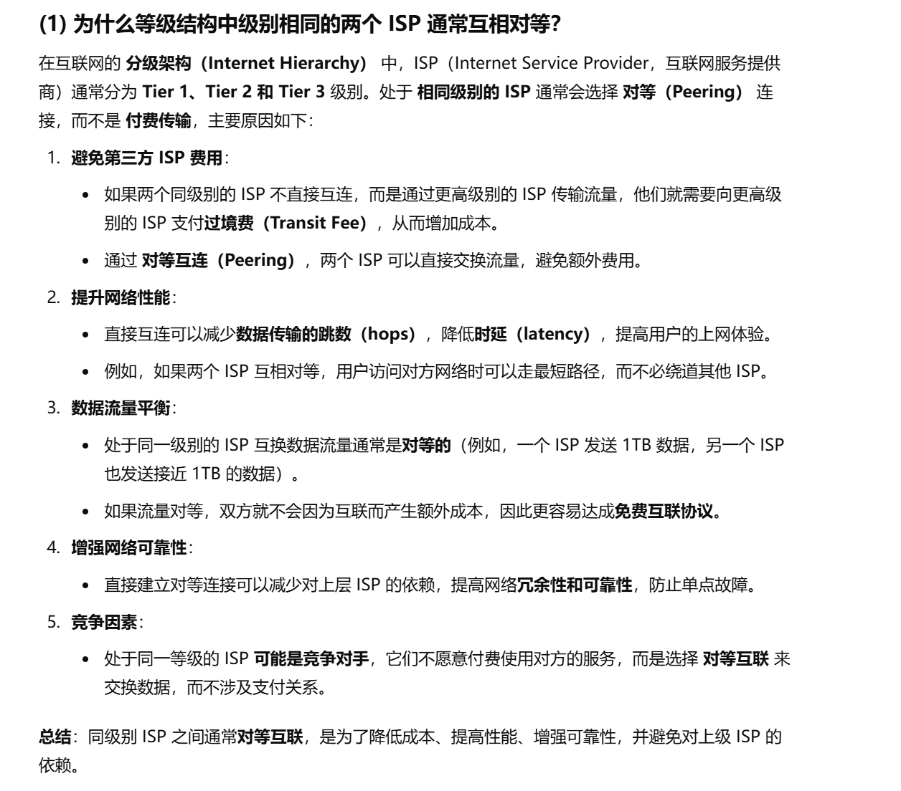

# 第一章

## 1.1节

### R1.“主机”和“端系统”之间有什么不同？列举几种不同类型的端系统。Web服务器是一种端系统吗？

#### 一、主机（Host）与端系统（End System）的核心区别

在计算机网络中，“主机”和“端系统”这两个术语在大多数情况下是**可以互换的**，但它们的侧重点略有不同：

1. **概念侧重点的差异**
   - **主机（Host）** ：更强调设备在**运行应用程序或提供服务**的能力。例如，运行Web服务器程序的主机、提供文件存储的服务器主机等。
   - **端系统（End System）** ：更强调设备在**网络中的位置**，即处于网络的“边缘”，直接与用户或其他设备交互。例如，用户的个人电脑、智能手机等。
2. **术语的适用场景**
   - 在讨论**网络架构分层**时，通常使用“端系统”以明确其在网络边缘的角色。
   - 在描述**设备功能**时（如提供Web服务、存储数据），则多用“主机”一词。
3. **广义与狭义的定义**
   - 狭义的主机可能仅指计算机的核心硬件部分（如机箱内的CPU、主板等）。
   - 广义的主机则包括所有连接到网络的设备，例如服务器、个人电脑、手机等，这与端系统的定义完全一致。

**总结**：两者的核心区别在于术语的语境而非功能。主机更强调功能属性，端系统更强调网络位置，但均指向同一类设备。

------

#### 二、端系统的常见类型

端系统涵盖广泛，包括但不限于以下类型：

1. 个人计算设备
   - 台式计算机（PC、Mac、Linux设备）
   - 移动设备（智能手机、平板电脑）
2. 服务器
   - Web服务器、邮件服务器、数据库服务器等
3. 物联网设备
   - 智能家居设备（如联网摄像头、智能电视）
   - 工业传感器、嵌入式系统
4. 其他网络终端
   - 游戏主机（如PlayStation、Xbox）
   - 打印机、路由器（兼具端系统与中间系统的功能）

------

#### 三、Web服务器是否属于端系统？

**是的，Web服务器是一种端系统**。其理由如下：

1. 网络位置与功能
   - Web服务器位于网络边缘，直接响应用户的HTTP请求，存储并提供网页资源（如HTML文件、图像、视频）。
   - 它作为数据源或服务的提供者，符合端系统的定义。
2. 术语适用性
   - 在计算机网络教材中，Web服务器常被明确列为端系统的示例。
   - 即使服务器具有高性能或专用硬件，其本质仍是网络通信的终端节点。

**例外说明**：若服务器作为中间系统（如代理服务器）仅转发数据，则可能被视为中间节点而非端系统，但这种情况较少见。

------

#### 四、扩展讨论：虚拟主机与端系统的关系

虚拟主机（Virtual Host）是一种通过软件模拟的端系统，常见于云计算环境：

1. **定义**：通过虚拟机技术在一台物理服务器上划分多个逻辑主机，每个虚拟主机拥有独立的IP地址和资源。
2. **与端系统的关联**：虚拟主机在功能上等同于端系统，可独立运行应用程序（如托管网站）。
3. **优势**：成本低、灵活性高，适合中小型网站和企业服务。

------

#### 五、总结

- **主机与端系统**本质相同，区别仅在于术语的语境侧重。
- **端系统的类型**多样，涵盖从个人设备到高性能服务器的广泛设备。
- **Web服务器**作为典型的端系统，是网络通信的核心服务提供者。

### R2.“协议”一词常被用于描述外交关系。维基百科是怎样描述外交协议的？

#### 一、外交协议的定义与类型

1. **基本定义**
   外交协议（Diplomatic Agreement）指两个或多个国家之间达成的书面协定，旨在规范或调整彼此在政治、经济、安全等领域的互动关系。其核心功能是确立共同原则、解决争议或推动合作。例如《巴黎气候协定》通过全球减排目标协调各国行动，而《伊朗核协议》则聚焦核不扩散与制裁解除的平衡。
2. **法律形式分类**
   - **条约（Treaties）** ：具有法律约束力的正式协议，通常需经各国立法机构批准。例如《联合国宪章》或《维也纳外交关系公约》。
   - **谅解备忘录（Memoranda of Understanding, MoU）** ：非正式协定，侧重原则性共识而非强制义务。例如中美早期经贸合作常以MoU形式推进。
   - **议定书（Protocol）** ：作为条约的补充文件，用于细化条款或修正既有协议，如《京都议定书》对《联合国气候变化框架公约》的扩展。

------

#### 二、历史演变与术语溯源

1. **词源与早期形态**
   “协议”（Protocol）一词源于古罗马时期的“protokollan”，原指用胶水粘合的文件卷轴，用于防止记录篡改。中世纪演变为会议记录（proces-verbaux），仅具口头承诺效力。
2. **现代外交中的双重含义**
   - **文书功能**：记录国际会议成果或对既有条约的解释（如1852年《伦敦协议》解决丹麦王位继承问题）。
   - **礼仪规则**：指外交交往中的正式礼节，包括国家称谓、外交官头衔及仪式规范，被称作“国际礼貌的代码”（Code of International Courtesy）。

### R3.标准对于协议为什么重要？

#### 一、**标准为协议提供技术基础与互操作性保障**

#### 1. **技术规范的统一性**

标准通过定义**数据格式、接口规范、通信规则**等核心要素，为协议的设计与实现提供技术框架。例如，TCP/IP协议族中的IP协议定义了数据包的格式（如IPv4与IPv6的头部结构），而HTTP协议则规范了网页请求与响应的语法和语义[1][6]。这些标准化的技术规范确保了不同厂商开发的设备或系统能够遵循相同的规则进行通信，避免了因技术碎片化导致的兼容性问题[133]。

#### 2. **互操作性的实现**

互操作性是标准与协议协同作用的核心成果。以 **工业物联网（IIoT）** 为例，不同厂商的传感器若遵循统一的工业协议标准（如OPC UA），即使硬件设计不同，也能通过标准化的数据格式和通信机制实现协同工作[124]。缺乏标准时，协议可能因缺乏统一的技术基准而无法跨平台运行。例如，早期工业现场总线协议因缺乏国际标准，导致不同厂商设备需依赖专用网关才能互联，显著增加了成本和复杂性[106]。

#### 3. **跨层级协议栈的整合**

复杂的通信系统通常依赖多层协议栈（如OSI七层模型），每一层的协议均需与上下层协议兼容。标准在此过程中扮演了“粘合剂”角色。例如，IEEE 802系列标准定义了物理层和数据链路层的规范，而IP协议作为网络层标准，通过标准化接口与底层协议无缝衔接，最终支撑应用层协议（如HTTP）的高效运行[70][133]。

------

#### 二、**标准推动协议的规模化应用与市场渗透**

#### 1. **降低市场准入门槛**

标准通过提供**公共技术平台**，减少企业开发私有协议的成本与风险。例如，蓝牙技术联盟（SIG）制定的蓝牙标准统一了短距离无线通信的技术细节，使得手机、耳机、智能家居设备等不同产品能够快速集成蓝牙协议，加速市场普及[104]。反观早期大数据处理框架（如Spark、Flink），因缺乏统一的数据源API标准，导致企业需重复开发适配层，增加了技术锁定风险[90]。

#### 2. **促进生态系统的形成**

行业标准通过凝聚产业链共识，推动协议成为事实上的市场主流。例如，5G通信标准的全球统一（由3GPP组织制定）使得华为、爱立信等设备商的5G协议能够无缝对接运营商网络，形成了从芯片到应用的完整生态系统[159]。若缺乏标准，协议可能局限于小众市场，如某些区块链协议因未形成行业标准，导致跨链互操作性不足，限制了应用场景的扩展[126]。

#### 3. **加速技术迭代与创新**

标准为协议的优化提供了可验证的基准。例如，HTTP/2协议通过标准化多路复用、头部压缩等特性，显著提升了网页加载速度。这一标准的迭代基于IETF组织的开放讨论与共识形成，确保协议改进既满足用户需求，又兼容既有技术生态[133][164]。相比之下，专有协议（如某些工业控制协议）因缺乏标准化反馈机制，技术升级往往滞后于市场需求[106]。

------

#### 三、**标准确保协议的法律合规性与风险管理**

#### 1. **规避法律风险**

在高度监管的领域（如金融、医疗），协议需符合行业安全与隐私标准。例如，支付通道协议必须遵循《支付结算办法》和《反洗钱法》等法规，标准通过明确数据加密、用户认证等要求，确保协议设计符合法律强制性规定[203]。若协议脱离标准约束（如未采用PCI-DSS支付安全标准），可能因违规面临行政处罚或合同无效风险[178][179]。

#### 2. **强化合同可执行性**

标准为协议条款的合规性提供了客观依据。例如，在技术交易合同中，合规条款常引用ISO质量标准或行业数据规范，要求协议执行方提供符合标准的技术交付物。这种标准化约束减少了合同纠纷中的主观解释空间，提升了争议解决效率[205][186]。

#### 3. **应对跨国法律差异**

国际标准（如ISO、IEC系列）通过协调不同法域的技术要求，帮助协议适应全球化市场。例如，欧盟《通用数据保护条例》（GDPR）要求数据处理协议符合隐私设计（Privacy by Design）标准，企业采用ISO/IEC 27001信息安全管理标准可系统性满足这一法律要求，避免因协议设计缺陷导致的跨境数据流动风险[177][184]。

------

#### 四、**标准优化协议的知识产权管理与技术竞争**

#### 1. **平衡专利垄断与开放创新**

标准组织（如IEEE、ETSI）通常要求专利持有者以**FRAND原则**（公平、合理、非歧视）授权标准必要专利（SEPs），防止协议因专利壁垒无法广泛实施。例如，4G/5G通信标准中，高通等企业持有的SEPs需以合理费率授权，确保其他厂商能够合规使用相关协议[6][120]。反之，若标准缺失（如某些视频编码技术），协议可能陷入专利诉讼泥潭，阻碍技术推广[6]。

#### 2. **避免技术锁定效应**

标准通过公开技术细节减少企业对私有协议的依赖。例如，USB接口标准定义了物理连接与数据传输规范，使得外围设备制造商无需支付专利费即可生产兼容产品，避免了早期计算机接口（如苹果Lightning）的封闭性导致的供应链垄断[133]。相比之下，某些专有工业协议（如西门子Profibus）因未完全开放标准，导致用户更换供应商时面临高昂的迁移成本[106]。

#### 3. **促进技术竞争与差异化**

标准在统一基础技术的同时，允许协议在更高层级实现差异化创新。例如，Wi-Fi协议基于IEEE 802.11标准定义了基础通信机制，但厂商可通过优化协议栈（如支持更高调制速率或能效算法）实现产品性能的差异化竞争[133]。这种“标准筑基、协议创新”的模式平衡了兼容性与技术进步的需求[70]。

------

#### 五、**标准解决协议碎片化与系统性效率问题**

#### 1. **减少重复开发与资源浪费**

标准通过提供通用技术方案，避免不同协议重复解决同一问题。例如，JSON和XML作为数据交换标准，被广泛集成于HTTP、MQTT等协议中，开发者无需为每个协议重新设计数据序列化机制，显著降低了开发成本[124][133]。反之，早期工业自动化领域因缺乏统一协议标准，导致同类功能模块（如PLC通信）被多家企业重复开发，造成资源浪费[106]。

#### 2. **提升系统级效率与可维护性**

标准化的协议架构简化了系统的集成与维护。例如，云计算中的RESTful API遵循统一的接口设计标准（如使用HTTP动词和状态码），使得不同云服务商的API易于集成，降低了运维复杂度[120]。若协议缺乏标准（如某些物联网设备采用私有通信协议），系统集成需依赖定制化中间件，增加了长期维护的难度[124]。

#### 3. **支持技术演进与后向兼容**

标准通过版本管理机制确保新旧协议平滑过渡。例如，IPv6协议在设计时保留了IPv4的核心逻辑，同时扩展地址空间与安全特性，使得网络设备可通过双栈协议逐步迁移，避免技术断代风险[154]。若标准未能前瞻性规划（如早期蓝牙版本未考虑低功耗需求），可能导致协议升级时出现兼容性问题，迫使企业开发临时性补丁协议（如蓝牙BLE）[104]。

## 1.2节

### R4.列出6种接入技术。将它们分类为住宅接入、公司接人或广域无线接入。

#### **一、住宅接入技术**

主要面向家庭用户，强调成本效益、易部署性和适中的带宽需求。

##### 1. **ADSL（非对称数字用户线）**

- **技术特点**：利用现有电话双绞线实现非对称传输（下行速率24Mbps，上行3.5Mbps），支持语音与数据共存。
- **应用场景**：适用于老旧小区或电话线基础设施完善的区域，曾是家庭宽带的主流技术，但逐渐被光纤取代。

##### 2. **HFC/Cable Modem（混合光纤同轴电缆）**

- **技术特点**：结合光纤主干网和同轴电缆分配网，支持双向数据传输，下行速率可达30Mbps，带宽共享可能影响实际速度。
- **应用场景**：依托有线电视网络，适合需要电视、网络捆绑服务的家庭用户。

##### 3. **FTTH（光纤到户）**

- **技术特点**：通过光纤直接接入用户端，提供对称高速带宽（1Gbps以上），低延迟、高可靠性。
- **应用场景**：新建住宅区和高带宽需求家庭（如4K视频、智能家居），是未来住宅接入的主流方向。

------

#### **二、公司接入技术**

面向企业用户，强调高带宽、稳定性和安全性。

##### 4. **以太网接入（企业局域网）**

- **技术特点**：基于五类线或光纤构建局域网，支持100Mbps至10Gbps速率，支持VLAN划分和QoS管理。
- **应用场景**：政府机构、大型企业园区和高校内部网络，通过交换机实现多终端高效互联。

##### 5. **专线接入（如DDN、光纤专线）**

- **技术特点**：独占物理通道（如DDN专线或企业级光纤），提供固定IP、24小时在线和低丢包率，支持双向同步传输。
- **应用场景**：银行、数据中心等对网络稳定性和安全性要求极高的场景，支持远程办公和跨区域互联。

------

#### **三、广域无线接入技术**

覆盖大范围区域，支持移动性和灵活部署。

##### 6. **4G/5G移动通信**

- 技术特点

  ：蜂窝网络技术，4G速率达100Mbps-1Gbps，5G进一步提升至10Gbps并支持超低延迟（1ms）

  。

  

- **应用场景**：移动设备联网、物联网（如车联网、工业传感器）、偏远地区临时覆盖。

##### 7. **卫星通信**

- **技术特点**：通过地球同步卫星传输数据，覆盖范围极广，但受天气和地理条件影响，典型速率500Kbps-100Mbps。
- **应用场景**：海洋、山区等基础设施薄弱地区，应急通信和军事用途。

### R5.HFC传输速率在用户间是专用的还是共享的?在下行HFC信道中，可能出现碰撞吗？为什么？

#### HFC传输速率在用户间的共享性分析

HFC（Hybrid Fiber-Coaxial）网络的传输速率在用户间是**共享的**，而非专用。这一结论基于以下技术特性与架构设计：

1. **共享介质的设计原理**
   HFC网络的同轴电缆分配网采用树形或总线形拓扑结构，同一光节点下的用户通过分支器连接到同一段同轴电缆。由于物理介质的共享性，所有用户的下行和上行信道均需共享该段带宽资源。例如，明确指出，HFC的上下行信道是共享的，所有用户通过Cable Modem（CM）使用同一信道传输数据。这种共享模式意味着实际可用带宽会随用户数量增加而动态变化。
2. **带宽分配与竞争机制**
   - **下行信道**：由前端设备（如CMTS）统一控制，采用广播方式将数据发送至所有用户。虽然带宽在用户间共享，但数据源单一（前端设备），因此无需竞争。
   - **上行信道**：用户需通过分布式多路访问协议（如TDMA或S-CDMA）协调发送时间，以避免信号碰撞。例如，提到光节点需管理上行信道的竞争，确保多用户共享介质时的有序传输。
3. **实际应用中的表现**
   在HFC网络中，每个光节点通常覆盖500-2000个用户。当用户数量较多时，共享带宽会导致实际速率下降，这种现象被称为“带宽稀释”。相比之下，DSL等点对点技术因带宽专用而不会受此影响。

**总结**：HFC的共享性源于其物理架构和介质特性，用户共享同轴电缆段的带宽资源，实际速率受网络负载和用户密度影响显著。

------

#### 下行HFC信道的碰撞可能性分析

在下行HFC信道中**不会发生碰撞**，原因如下：

1. **单一数据源与广播传输机制**
   下行信道的数据仅由前端设备（如CMTS）发送，用户端仅作为接收方。前端通过广播方式将数据推送至所有用户，信号传输路径为单向（前端→用户），不存在多个发送方同时传输的情况，因此无需竞争信道。
2. **物理层与协议层的设计保障**
   - **物理层**：下行信号采用QAM（正交幅度调制）技术，将数据映射到特定频段（如550-750MHz用于数字电视和宽带数据），通过频分复用避免干扰。
   - **协议层**：前端设备通过集中式调度控制下行数据的发送顺序，用户端设备仅需根据目标地址筛选数据包（如MAC地址或IP地址），无需主动竞争信道。
3. **与上行信道的对比**
   上行信道因多用户需主动发送数据，必须依赖协议（如DOCSIS）协调时隙分配，以避免碰撞。而下行信道天然无此问题，因其数据流完全由前端控制。

**总结**：下行信道的单向广播特性和单一数据源从根本上消除了碰撞的可能性，而物理层的频分复用和协议层的集中控制进一步保障了传输的稳定性。

------

#### 扩展讨论：HFC网络的优化与挑战

1. **带宽扩容技术**
   通过升级至DOCSIS 3.1标准，HFC网络可绑定多个频道，将下行速率提升至1 Gbps甚至更高。然而，由于电视频道仍占用部分频谱，实际可用带宽仍受限制。
2. **噪声与干扰管理**
   上行信道的“漏斗效应”是HFC的主要挑战，用户端噪声（如电器干扰）会在光节点处叠加，影响传输质量。解决方案包括采用高质量屏蔽电缆、动态信噪比监测以及数字滤波技术。
3. **全双工与半双工模式演进**
   早期HFC网络为半双工模式，仅支持单向广播。通过回传线路改造和全双工技术的引入，现代HFC已支持双向通信，但其共享特性仍限制了对称高速服务的部署。

### R6.列出你所在城市中的可供使用的住宅接人技术。对于每种类型的接人方式，给出所宣称的下行速率、上行速率和每月的价格。

**1. 光纤到户（FTTH）**

- **技术特点**：贵阳作为“千兆城市”，光纤网络覆盖率高，支持多运营商接入，2025年计划试点50G-PON技术，实现“万兆到户”。

- 速率：

  - **下行速率**：基础速率200Mbps（政策要求），主流套餐为500Mbps-1000Mbps，部分区域已支持2000Mbps以上（50G-PON试点）。
  - **上行速率**：普通套餐通常为下行速率的10%-30%（如100Mbps上行对应1000Mbps下行）；XGPON技术下可达2.5Gbps上行，但实际用户套餐可能限制为100-500Mbps。

- 月租费用

  （2024年数据）：

  - **中国移动**：100M（129元）、200M（169元）、500M（269元）、1000M（369元）。
  - **中国电信**：500M（100元）、1000M（184元）。
  - **中国联通**：500M（99元）、1000M（129元）。

------

**2. 5G网络**

- **技术特点**：贵阳乡镇及以上区域实现连续覆盖，热点区域支持5G-A技术（万兆下行）。
- 速率：
  - **下行速率**：理论峰值1.8Gbps（实测平均1.7Gbps），实际套餐速率多为300Mbps-1Gbps。
  - **上行速率**：一般为下行速率的20%-50%，典型范围为50-300Mbps（需根据运营商套餐调整）。
- 月租费用：
  - **独立5G套餐**：通常与手机流量捆绑，如联通“锋芒卡”19元/月含204GB流量。
  - **融合套餐**（宽带+5G）：移动1000M宽带+1000分钟语音（449元/月）。

------

**3. 无线宽带（WiFi 6）**

- **技术特点**：基于千兆光纤的WiFi 6解决方案，解决穿墙信号衰减问题，实现全屋覆盖。
- 速率：
  - **下行速率**：实测可达1086Mbps（依赖千兆光纤）。
  - **上行速率**：与所接光纤套餐一致，如1000M光纤上行100-500Mbps。
- **月租费用**：包含在光纤套餐中，无额外费用。

------

**4. 有线电视系统（HFC）**

- **技术特点**：采用光纤同轴混合网，部分小区提供互联网接入服务，但主要面向视频传输。
- 速率：
  - **下行速率**：通常为10Mbps以上（非主流选择，多与光纤套餐捆绑）。
  - **上行速率**：较低（约1-5Mbps）。
- **月租费用**：通常作为附加服务，单独资费信息不足，可能包含在融合套餐中。

------

**5. 综合布线系统（小区内网）**

- **技术特点**：小区内部网络，支持多设备冗余和IPv6协议，由物业或第三方管理。
- **速率**：依赖光纤到户基础设施，速率与FTTH一致，但具体服务条款需咨询物业。
- **月租费用**：资料未明确，可能包含在物业管理费中。

------

**6. LoRa物联网技术**

- **技术特点**：低功耗广域网技术，适用于智能家居设备联网。
- 速率：
  - **下行/上行速率**：Kbps级别（非高速互联网接入）。
- **月租费用**：模块成本15-30元，无后续流量费（与NB-IoT不同）。

### R7.以太LAN的传输速率是多少?

#### 一、以太网传输速率的核心分类

以太网技术通过标准化命名规则（如10Base-T、1000Base-SX等）定义传输速率和介质类型。速率范围从传统的10 Mbps到现代10 Gbps甚至更高，具体如下：

##### 1. **经典以太网标准**

- **10Base-T**
  - **速率**：10 Mbps
  - **介质**：双绞铜线（Cat3或更高）
  - **应用场景**：早期家庭网络和小型企业局域网，因成本低且易于部署而普及，但逐渐被淘汰[5][8]。
- **100Base-TX（快速以太网）**
  - **速率**：100 Mbps
  - **介质**：双绞铜线（Cat5）
  - **应用场景**：办公室和企业网络，支持更高带宽需求（如文件共享、视频会议）[5][8]。

##### 2. **千兆以太网（1 Gbps）**

- **1000Base-T**

  - **速率**：1 Gbps
  - **介质**：双绞铜线（Cat5e/Cat6）
  - **应用场景**：数据中心、企业核心网络，满足大数据传输需求（如虚拟化、存储网络）[5][8]。

- ##### **1000Base-SX（短波长光纤）**

  - **速率**：1 Gbps
  - **介质**：多模光纤（短距离，通常<550米）
  - **应用场景**：建筑物内部高速连接，如机房内设备互联[5][8]。

- **1000Base-LX（长波长光纤）**

  - **速率**：1 Gbps
  - **介质**：单模光纤（长距离，可达10公里）
  - **应用场景**：跨建筑物或园区网络，支持远距离传输[5][8]。

##### 3. **万兆以太网（10 Gbps）**

- **10GBase-T**
  - **速率**：10 Gbps
  - **介质**：双绞铜线（Cat6a/Cat7）
  - **应用场景**：高性能计算、数据中心骨干网，但受限于铜线的高衰减特性，传输距离较短（约100米）[8][13]。
- **10GBase-SR（短距离光纤）**
  - **速率**：10 Gbps
  - **介质**：多模光纤（典型距离<300米）
  - **应用场景**：数据中心机架内或相邻机房间的高速互联[8][13]。
- **10GBase-LR（长距离光纤）**
  - **速率**：10 Gbps
  - **介质**：单模光纤（可达10公里以上）
  - **应用场景**：城域网（MAN）或广域网（WAN）的骨干连接，支持远距离高带宽需求[8][13]。

------

#### 二、影响传输速率的因素

以太网的实际速率不仅取决于标准定义的理论值，还受到以下因素影响：

1. **介质类型与质量**
   - 双绞线的类别（如Cat5e vs. Cat6）直接影响最大速率和抗干扰能力[8]。
   - 光纤的模态（单模/多模）和波长决定传输距离和带宽上限[5][13]。
2. **网络拓扑与协议**
   - **CSMA/CD（载波侦听多路访问/冲突检测）** ：在传统共享式以太网中，碰撞会降低有效吞吐量，但全双工交换式网络已基本消除这一问题[8]。
   - **链路聚合（Bonding）** ：通过绑定多个物理链路（如2×1 Gbps）提升逻辑链路的总带宽[8]。
3. **环境与距离**
   - 铜缆的速率随距离增加而衰减（如10GBase-T在100米内可达10 Gbps，但超过后可能降至1 Gbps）[13]。
   - 光纤的长距离传输能力使其更适合广域应用[13]。

### R8.能够运行以太网的一些物理媒体是什么？

以太网能够运行的物理媒体类型随着技术发展不断扩展，从早期的同轴电缆到现代光纤和高速双绞线，涵盖了多种传输介质。以下从不同速率标准、介质特性和应用场景进行详细分析：

------

#### 一、经典以太网（10 Mbps）

1. **同轴电缆**
   - **10Base2（细缆）** ：使用RG-58同轴电缆，最大传输距离185米，采用BNC接头，常用于小型局域网[1][5]。
   - **10Base5（粗缆）** ：使用直径更粗的同轴电缆（约10 mm），最大传输距离500米，需通过AUI接口连接收发器[5][1]。
   - **10Base36**：宽带同轴电缆，支持3600米长距离传输，但应用较少[5]。
2. **双绞线**
   - **10Base-T**：使用3类非屏蔽双绞线（UTP），RJ-45接口，最大距离100米，星型拓扑结构，成为主流布线方案[1][46]。
3. **光纤**
   - **10Base-F**：包含多个子标准（如10Base-FL、FP、FB），使用62.5/125 µm多模光纤，支持全双工通信，传输距离可达2000米，但早期因成本高应用有限[7][47]。

------

#### 二、快速以太网（100 Mbps）

1. **双绞线**
   - **100Base-TX**：使用5类UTP或1类屏蔽双绞线（STP），2对线传输，最大距离100米，支持全双工[36][55]。
   - **100Base-T4**：利用4对3类UTP，通过时分复用实现100 Mbps，兼容旧布线系统[33]。
2. **光纤**
   - **100Base-FX**：使用62.5/125 µm多模光纤，波长1300 nm，传输距离可达2公里（全双工）或400米（半双工），适用于骨干网[33][44]。

------

#### 三、千兆以太网（1 Gbps及以上）

1. **双绞线**
   - **1000Base-T**：基于5e类或6类UTP，4对线全双工传输，最大距离100米，兼容性强[61]。
   - **10GBase-T**：使用6a类双绞线，支持10 Gbps速率，距离100米；6类线可支持55米[61][67]。
2. **光纤**
   - **1000Base-SX**：短波多模光纤（850 nm），距离275-550米。
   - **1000Base-LX**：长波单模/多模光纤（1310 nm），单模可达5公里[61]。
   - **10GBase-SR/LR/ER**：分别对应短距（300米）、长距（10公里）、超长距（40公里）光纤传输[16][67]。
3. **特殊铜缆**
   - **10GBase-CX4**：采用四对双轴屏蔽铜缆，支持15米短距离高速连接，适用于数据中心[11][67]。

------

#### 四、无线媒体

尽管传统以太网依赖有线介质，但现代扩展中**Wi-Fi**通过无线接入点（AP）实现以太网帧的无线传输，支持IEEE 802.11系列标准（如802.11ac/ax），带宽可达数Gbps[3]。

### R9.拨号调制解调器、HFC、DSL和FTTH都用于住宅接人。对于这些技术，给出每种技术的传输速率的范围，并讨论它们的传输速率是共享的还是专用的。

以下是对拨号调制解调器、HFC、DSL和FTTH四种住宅接入技术的传输速率范围及带宽共享特性的详细分析：

------

#### **1. 拨号调制解调器（Dial-up Modem）**

- 传输速率范围：
  - 下行速率：33.6 Kbps（V.34标准）至56 Kbps（V.90/V.92标准）。
  - 上行速率：31.2 Kbps（V.34）至48 Kbps（V.92）。
  - 实际速率可能受FCC限制，例如下行最高仅53 Kbps。
- 带宽共享性：
  - **专用**。用户独占电话线路的带宽，但由于技术限制，实际速率较低且易受线路质量影响。

------

#### **2. HFC（混合光纤同轴电缆，Hybrid Fiber-Coaxial）**

- 传输速率范围：

  - **下行**：

- 北美标准：27 Mbps（64QAM调制）至40 Mbps（256QAM调制）。

- 其他标准：10-30 Mbps（常见范围）

  ，最高可达1 Gbps（共享总带宽）。

  - **上行**：

- 1-10 Mbps（QPSK调制），具体受线路质量和回传干扰影响。

- 带宽共享性：

  - **共享**。同一光节点下的用户共享下行和上行带宽，实际速率随用户数量增加而下降。例如，若多个用户同时使用，单个用户的可用带宽可能显著减少。

------

### **3. DSL（数字用户线路，Digital Subscriber Line）**

- 传输速率范围：
  - **ADSL（非对称DSL）**：
- 下行：1.5-8 Mbps（常见），最高可达24 Mbps（某些版本）。
- 上行：16-640 Kbps
  - **VDSL（超高速DSL）**：
- 下行：13-52 Mbps（短距离），最高可达100 Mbps。
- 上行：3-6 Mbps。
- 带宽共享性：
  - **专用**。每个用户拥有独立的电话线路，带宽不受其他用户影响。但速率受用户与交换局的距离和线路质量限制。需注意，部分资料误将DSL标为共享，但技术原理上DSL为专用连接。

------

### **4. FTTH（光纤到户，Fiber to the Home）**

- 传输速率范围：

  - **下行**：100 Mbps至1 Gbps（常见家庭套餐），商业或高端服务可达10 Gbps。
  - **上行**：通常对称或接近对称速率，例如100 Mbps上行（1 Gbps下行套餐）。

- 带宽共享性：

  - **专用**。用户独享光纤链路，速率不受邻居影响。但在GPON架构中，主干光纤可能通过分光器服务多个用户（如64户共享2.5 Gbps下行），但用户端仍表现为独享带宽。

  #### **总结对比表**

  | 技术类型       | 下行速率范围        | 上行速率范围        | 带宽共享性 | 备注                                       |
  | -------------- | ------------------- | ------------------- | ---------- | ------------------------------------------ |
  | 拨号调制解调器 | 33.6 Kbps - 56 Kbps | 31.2 Kbps - 48 Kbps | 专用       | 受线路质量和FCC限制，已逐步淘汰            |
  | HFC            | 10-40 Mbps（常见）  | 1-10 Mbps           | 共享       | 总带宽共享，实际速率随用户数量波动         |
  | DSL            | ADSL: 1.5-24 Mbps   | ADSL: 16-640 Kbps   | 专用       | 速率受距离和线路质量限制                   |
  |                | VDSL: 13-100 Mbps   | VDSL: 3-6 Mbps      |            |                                            |
  | FTTH           | 100 Mbps - 10 Gbps  | 对称或接近对称      | 专用       | 用户独享光纤链路，主干可能共享但无显著影响 |

  ------

  #### **关键讨论点**

  1. **HFC的共享瓶颈**：
     HFC的同轴电缆部分采用树状拓扑结构，导致上行信道易受噪声干扰，且用户共享带宽。例如，若一个光节点服务500户，实际可用带宽可能被严重稀释。
  2. **DSL的速率与距离关系**：
     ADSL在5.5公里内速率可达8 Mbps，但超过此距离后速率急剧下降。VDSL则需更短距离（如500米内）以支持100 Mbps速率。
  3. **FTTH的扩展性**：
     GPON技术通过动态带宽分配（DBA）优化共享主干带宽，但用户端仍表现为专用。新兴的XGS-PON技术已支持10 Gbps对称速率。

### R10.描述今天最为流行的无线因特网接入技术。对它们进行比较和对照。

### 当前最流行的无线因特网接入技术对比分析（截至2025年）

#### **1. Wi-Fi（Wireless Fidelity）**

- **技术标准**：基于IEEE 802.11系列，主流版本包括Wi-Fi 5（802.11ac）和Wi-Fi 6（802.11ax）。
- **传输速率**：Wi-Fi 6理论峰值速率达9.6 Gbps，实际应用场景中通常为1-3 Gbps；Wi-Fi 5最高6.9 Gbps。
- **覆盖范围**：室内约70-100米，室外可达250米，支持多设备连接。
- **延迟**：Wi-Fi 6平均延迟降至20ms，优于Wi-Fi 5的30ms。
- **应用场景**：家庭、企业局域网、公共场所热点，支持高清视频、智能家居设备互联。
- **优势**：高带宽、易部署、支持多设备；**劣势**：易受墙体干扰，覆盖范围有限。

#### **2. 5G/5G-A（第五代移动通信技术及增强版）**

- **技术标准**：3GPP Release 15/16（5G），5G-A进一步优化网络架构。
- **传输速率**：下行峰值20 Gbps，上行10 Gbps（理论）；高通X85调制解调器实现12.5 Gbps下行和3.7 Gbps上行。
- **覆盖范围**：依赖基站密度，城市区域覆盖密集，农村依赖低频段扩展。
- **延迟**：eMBB场景下<4ms，uRLLC场景下<1ms，支持实时应用如远程手术。
- **应用场景**：移动互联网、车联网、工业物联网、AR/VR。
- **优势**：低延迟、高移动性、广域覆盖；**劣势**：基站部署成本高，高频段穿透性差。

#### **3. 蓝牙（Bluetooth）**

- **技术标准**：最新版本为Bluetooth 5.4，支持低功耗（BLE）。
- **传输速率**：最高2 Mbps（BLE），经典蓝牙可达3 Mbps。
- **覆盖范围**：10-30米（增强版可达300米）。
- **延迟**：约20-100ms，音频传输优化后更低。
- **应用场景**：短距离设备互联（耳机、键鼠）、物联网传感器。
- **优势**：低功耗、低成本；**劣势**：传输速率低，多设备连接能力弱。

#### **4. 星闪（NearLink）**

- **技术标准**：中国原生技术，支持低时延、高可靠组网。
- **传输速率**：未明确峰值，但强调“超低时延”和“高吞吐”。
- **覆盖范围**：短距离（类似蓝牙），但支持多跳中继扩展。
- **延迟**：宣称低于蓝牙，具体数值未公开。
- **应用场景**：智能汽车（数字车钥匙）、工业控制、高精度定位。
- **优势**：抗干扰强、支持大规模节点；**劣势**：生态尚不成熟，市场渗透率低。

#### **5. Li-Fi（Light Fidelity）**

- **技术标准**：利用可见光通信（VLC），基于LED光源。
- **传输速率**：实验室速率达224 Gbps，商用设备约1-10 Gbps。
- **覆盖范围**：依赖光线直射，典型场景10-30平方米。
- **延迟**：微秒级，适合超低延迟需求。
- **应用场景**：医院（无电磁干扰）、飞机舱内、高安全场所。
- **优势**：无电磁污染、高安全性；**劣势**：需视线传播，无法穿墙。

#### **6. Zigbee**

- **技术标准**：基于IEEE 802.15.4，专为低功耗设计。
- **传输速率**：250 kbps（2.4 GHz频段）。
- **覆盖范围**：10-100米，支持网状网络扩展。
- **延迟**：毫秒级，适合传感器网络。
- **应用场景**：智能家居（温控、照明）、工业监测。
- **优势**：低功耗、支持数千节点；**劣势**：速率低，兼容性差。

#### **7. NFC（近场通信）**

- **技术标准**：ISO/IEC 14443，工作频率13.56 MHz。
- **传输速率**：424 kbps。
- **覆盖范围**：<10厘米。
- **延迟**：即时响应，无显著延迟。
- **应用场景**：移动支付、身份认证、设备快速配对。
- **优势**：安全性高、无需供电；**劣势**：距离极短，速率有限。

------

#### **综合对比表**

| 技术        | 传输速率         | 覆盖范围    | 延迟     | 典型应用场景       | 主要优势             | 主要劣势           |
| ----------- | ---------------- | ----------- | -------- | ------------------ | -------------------- | ------------------ |
| **Wi-Fi 6** | 1-9.6 Gbps       | 70-250米    | 20ms     | 家庭/企业局域网    | 高带宽、多设备支持   | 墙体衰减明显       |
| **5G-A**    | 10-20 Gbps       | 广域覆盖    | <1ms     | 车联网、远程医疗   | 超低延迟、广覆盖     | 基站部署成本高     |
| **蓝牙5.4** | 2 Mbps           | 10-300米    | 20-100ms | 耳机、智能家居     | 低功耗、易集成       | 速率低、连接数有限 |
| **星闪**    | 未公开（高吞吐） | 短距离+中继 | 极低     | 工业控制、汽车互联 | 抗干扰强、多节点     | 生态不成熟         |
| **Li-Fi**   | 1-10 Gbps        | 10-30平方米 | 微秒级   | 医院、保密场所     | 无电磁干扰、高安全   | 需视线传播         |
| **Zigbee**  | 250 kbps         | 10-100米    | 毫秒级   | 智能家居传感器     | 超低功耗、大规模节点 | 速率低、兼容性差   |
| **NFC**     | 424 kbps         | <10厘米     | 即时     | 移动支付、身份验证 | 高安全性、无源操作   | 距离极短           |

------

#### **市场占有率与用户规模（2025年预测）**

1. **Wi-Fi**：Wi-Fi 6/6E/7预计占全球无线局域网市场的43%，设备年出货量超40亿台。
2. **5G**：中国5G用户数预计达8亿，占全球40%；全球5G基站覆盖30%人口。
3. **蓝牙**：设备年出货量预计75亿台，市场规模达450亿美元。
4. **星闪**：处于起步阶段，尚无明确市场占比，但政策支持推动其在汽车和工业领域渗透。
5. **Li-Fi**：全球市场规模预计35.2亿美元，年增长率70%。
6. **Zigbee**：市场规模51.6亿美元，主要应用于智能家居和工业物联网。
7. **NFC**：作为成熟技术，广泛集成于手机和支付终端，但无独立市场规模数据。

## 1.3

### R11.

假定在发送主机和接收主机间只有一台分组交换机。发送主机和交换机间以及交换机和接收主机间
的传输速率分别是R1，和R2。假设该交换机使用存储转发分组交换方式，发送一个长度为L的分组
的端到端总时延是什么？（忽略排队时延、传播时延和处理时延。）

### R12.

与分组交换网络相比，电路交换网络有哪些优点？在电路交换网络中，TDM比FDM有哪些优点？

#### **电路交换网络的优点（相比分组交换网络）**

电路交换网络（如传统电话网）与分组交换网络（如互联网）相比，具有以下优点：

1. **固定带宽保证**：
   - 在通信前建立专用信道，整个通信过程中该信道的带宽不会被其他用户占用，因此可以提供**稳定的服务质量（QoS）**，适用于实时应用（如语音通话）。
2. **低时延和无抖动**：
   - 一旦建立连接，数据可以以固定速率连续传输，而不像分组交换那样可能因拥塞导致**排队和丢包**，特别适用于**低时延、高实时性**的应用（如视频通话、远程医疗）。
3. **无数据包开销**：
   - 由于不需要为每个分组附加**额外的控制信息（如源地址、目的地址、序列号等）**，电路交换在传输相同数据量时的**协议开销较小**。
4. **安全性较高**：
   - 由于数据在通信过程中始终沿着**固定的物理路径**传输，不像分组交换网络中数据可能被路由到不同的路径，因此**窃听难度较大**。

------

#### **TDM（时分复用）比 FDM（频分复用）的优点**

在电路交换网络中，常用的复用技术包括 **时分复用（TDM）** 和 **频分复用（FDM）**。TDM 相比 FDM 具有以下优势：

1. **带宽利用率更高**：
   - 在 TDM 中，所有用户在**时间上共享**同一条信道，每个用户在**轮流的时间片内**发送数据。而 FDM 为每个用户分配一个固定的**频率带宽**，即使用户不发送数据，这部分带宽也不能被其他用户利用，造成浪费。
   - TDM 适用于**突发性流量**（如计算机数据通信），能更有效利用信道资源。
2. **易于动态分配时隙**：
   - TDM 可以根据用户需求灵活分配时间片，而 FDM 由于固定分配频带，不能根据流量需求动态调整资源。
3. **设备成本较低**：
   - TDM 的实现主要依赖于**时钟同步**，而 FDM 需要复杂的**滤波器、放大器、调制器和解调器**来确保不同频段的信号不会互相干扰。因此，TDM 的硬件成本通常较低。
4. **无频谱干扰问题**：
   - FDM 需要使用**保护频带**以防止相邻信道的干扰（即信号间串扰），导致频谱利用率降低，而 TDM 不存在这个问题。
5. **数字化优势**：
   - TDM 更适合**数字信号传输**，容易与现代数字通信技术（如时分多路交换、光纤通信）结合，而 FDM 主要用于**模拟信号**，难以适应现代数字化趋势。

#### **总结**

- **电路交换的主要优势**：提供**稳定的带宽、低时延、低抖动**，适用于高实时性应用。
- **TDM 比 FDM 的主要优势**：**带宽利用率更高、易动态分配、设备成本低、无频谱干扰问题，更适合数字信号传输**。

### R13.

假定用户共享一条2Mbps链路。同时假定当每个用户传输时连续以1Mbps传输，但每个用户仅传输
20%的时间。
a.当使用电路交换时，能够支持多少用户？

b.作为该题的后继问题，假定使用分组交换。为什么如果两个或更少的用户同时传输的话，在链
路前面基本上没有排队时延？为什么如果3个用户同时传输的话，将有排队时延？

c.求出某指定用户正在传输的概率。

d假定现在有3个用户。求出在任何给定的时间，所有3个用户在同时传输的概率。求出队列增长
的时间比率。

### R14.

为什么等级结构中级别相同的两个ISP通常互相对等？某IXP是如何挣钱的？

R15.某些内容提供商构建了自已的网络。描述谷歌的网络。内容提供商构建这些网络的动机是什么?

## 1.4

### R16.

考虑从某源主机跨越一条固定路由向某目的主机发送一分组。列出端到端时延中的时延组成成分。
这些时延中的哪些是固定的，哪些是变化的?

在端到端数据传输过程中，数据包从源主机到目的主机需要经历多个时延。端到端总时延 ($d_{\text{total}}$) 主要由以下四个组成部分：

#### **1. 处理时延（Processing Delay，$d_{\text{proc}}$）**

- 发生在

  源主机、路由器和目标主机

  ，用于处理数据包，如：

  - **检查数据包头部**（提取目的地址、协议类型等）
  - **执行路由查找**（决定下一跳）
  - **检测比特错误**

- **固定性**：通常较**固定**，但可能因**路由器的负载**变化而稍有不同。

------

#### **2. 排队时延（Queuing Delay，$d_{\text{queue}}$）**

- 发生在**路由器的输入/输出队列**中，当多个数据包同时到达时，某些数据包必须在队列中等待前面的数据包转发完成。

- 影响因素

  ：

  - 取决于**网络拥塞程度**，如果网络流量较高，队列时延就会增加。
  - **不确定性较高**，可变性最大。

------

#### **3. 传输时延（Transmission Delay，$d_{\text{trans}}$）**

- 指将整个分组从**主机或路由器的发送端口**推送到链路所需的时间。

- 计算公式：
  $$
  d_{\text{trans}} = \frac{L}{R}
  $$
  其中：

  - $L$ 是数据包的大小（比特）
  - $R$ 是链路的传输速率（bps）

- **固定性**：对于给定的**分组大小 $L$ 和链路带宽 $R$**，传输时延是**固定**的，但如果分组大小或链路速率变化，时延也会变化。

------

#### **4. 传播时延（Propagation Delay，$d_{\text{prop}}$）**

- 指比特在链路上传播的时间，即信号从发送端到接收端所需的时间。

- 计算公式：
  $$
  d_{\text{prop}} = \frac{d}{s}
  $$
  其中：

  - $d$ 是链路的物理长度（米）
  - $s$ 是信号传播速度（通常是光速的一部分）

- **固定性**：对于**固定的物理链路**，传播时延是**固定**的，但在**无线网络或不同介质（光纤、电缆等）中可能有所不同**。

------

#### **总结：哪些时延是固定的，哪些是变化的？**

| **时延类型**                      | **是否固定？** | **变化因素**                   |
| --------------------------------- | -------------- | ------------------------------ |
| **处理时延** ($d_{\text{proc}}$)  | **基本固定**   | 设备性能、当前负载             |
| **排队时延** ($d_{\text{queue}}$) | **变化大**     | 网络流量、拥塞程度             |
| **传输时延** ($d_{\text{trans}}$) | **基本固定**   | 但取决于分组大小、带宽         |
| **传播时延** ($d_{\text{prop}}$)  | **固定**       | 但取决于物理链路长度、介质类型 |

**关键点**：

- **处理时延和传播时延通常是固定的**，只要网络拓扑不变，它们就不会变化太多。
- **排队时延是最不可预测的**，受**网络拥塞**影响最大。
- **传输时延在固定带宽条件下是稳定的**，但如果带宽变化（如 4G 切换到 WiFi），则传输时延也会变化。

因此，在网络稳定、无拥塞的情况下，**排队时延是端到端时延中变化最大的部分**，而**传播时延和传输时延通常较稳定**。

### R17.

访问配套Web网站上有关传输时延与传播时延的Java小程序。在速率、传播时延和可用的分组长
度之中找出一种组合，使得该分组的第一个比特到达接收方之前发送方结束了传输。找出另一种组
合，使得发送方完成传输之前，该分组的第一个比特到达了接收方。

在网络通信中，**传输时延（Transmission Delay）** 和 **传播时延（Propagation Delay）** 的相对大小决定了数据传输的行为。它们的计算公式如下：

1. **传输时延**（将整个分组放入信道所需的时间）：
   $$
   d_{\text{trans}} = \frac{L}{R}
   $$
   其中：

   - $L$ = 分组大小（比特）
   - $R$ = 传输速率（bps）

2. **传播时延**（信号从发送端到接收端的传播时间）：
   $$
   d_{\text{prop}} = \frac{d}{s}
   $$
   其中：

   - $d$ = 信道长度（米）
   - $s$ = 信号传播速度（通常是光速的一部分，如 $2 \times 10^8$ m/s）

------

#### **情况 1：传输时延 > 传播时延（$d_{\text{trans}} > d_{\text{prop}}$）**

> **第一个比特到达接收方后，发送方还未完成整个分组的发送。**

#### **直观理解**

- **第一个比特** 以光速或接近光速的速度传播到接收方。
- 但由于**传输速率（带宽）较低，或者数据包较大**，所以发送方仍然在发送剩余比特。
- **因此，第一个比特已经到达接收方，但发送方还没有发完整个数据包！**

#### **示例**

假设：

- **带宽低**：$R = 1$ Mbps
- **分组大**：$L = 1$ Mbit
- **链路较短**：$d = 10$ km
- **信号传播速度**：$s = 2 \times 10^8$ m/s

计算：

- **传输时延**： $d_{\text{trans}} = \frac{10^6 \text{ bits}}{10^6 \text{ bps}} = 1 \text{ sec}$
- **传播时延**： $d_{\text{prop}} = \frac{10^4 \text{ m}}{2 \times 10^8 \text{ m/s}} = 50 \text{ μs}$

结论：

- 发送方需要 **1 秒** 发送完整个分组。
- 但 **第一个比特仅需 50 微秒** 就能到达接收方。
- **所以，第一个比特到达后，发送方仍然在发送剩余数据**，即 **发送还未完成！**

✅ **你的直觉是正确的，这种情况下第一个比特已经到达，而发送方还没发完所有比特！**

------

#### **情况 2：传输时延 < 传播时延（$d_{\text{trans}} < d_{\text{prop}}$）**

> **发送方完成整个分组的发送后，第一个比特才到达接收方。**

#### **直观理解**

- **带宽很高，或者数据包很小**，导致**整个分组可以迅速发完**。
- 但是链路非常长，所以**即使分组已完全发送，信号仍然在传播途中，尚未到达接收端**。

#### **示例**

假设：

- **带宽高**：$R = 10$ Gbps
- **分组小**：$L = 1000$ bits
- **链路长**：$d = 3000$ km
- **信号传播速度**：$s = 2 \times 10^8$ m/s

计算：

- **传输时延**： $d_{\text{trans}} = \frac{10^3 \text{ bits}}{10^9 \text{ bps}} = 10^{-6} \text{ sec} = 1 \text{ μs}$
- **传播时延**： $d_{\text{prop}} = \frac{3 \times 10^6 \text{ m}}{2 \times 10^8 \text{ m/s}} = 0.015 \text{ sec} = 15 \text{ ms}$

结论：

- 发送方 **1 微秒** 内完成整个分组的发送。
- 但 **第一个比特仍然需要 15 毫秒才能到达接收方！**
- **因此，发送方早已完成发送，但接收方仍然没有收到任何数据！**

------

#### **总结**

| **情况**                                 | **条件**                   | **解释**                                             |
| ---------------------------------------- | -------------------------- | ---------------------------------------------------- |
| **$d_{\text{trans}} > d_{\text{prop}}$** | **带宽低、分组大、链路短** | **第一个比特到达接收端后，发送方仍未发完所有比特** ✅ |
| **$d_{\text{trans}} < d_{\text{prop}}$** | **带宽高、分组小、链路长** | **发送方发完所有比特后，第一个比特才到达接收端**     |

### R18.

一个长度为1000字节的分组经距离为2500km的链路传播，传播速率为2.5x10°m/s并且传输速率为2Mbps，它需要用多长时间?更为一般地，一个长度为L的分组经距离为d的链路传播，传播速率为s并且传输速率为Rbps，它需要用多长时间?该时延与传输速率相关吗?

#### **(1) 计算具体情况**

已知：

- **分组长度** $L = 1000$ **字节** = **8000** 比特
- **链路距离** $d = 2500$ **km** = **$2.5 \times 10^6$ m**
- **传播速率** $s = 2.5 \times 10^8$ **m/s**
- **传输速率** $R = 2$ **Mbps** = **$2 \times 10^6$ bps**

计算 **传播时延** 和 **传输时延**：

1. **传播时延（Propagation Delay）**：
   $$
   d_{\text{prop}} = \frac{d}{s} = \frac{2.5 \times 10^6 \text{ m}}{2.5 \times 10^8 \text{ m/s}} = 0.01 \text{ sec} = 10 \text{ ms}
   $$

2. **传输时延（Transmission Delay）**：
   $$
   d_{\text{trans}} = \frac{L}{R} = \frac{8000 \text{ bits}}{2 \times 10^6 \text{ bps}} = 0.004 \text{ sec} = 4 \text{ ms}
   $$

3. **总时延（End-to-End Delay）**：
   $$
   d_{\text{total}} = d_{\text{trans}} + d_{\text{prop}} = 4 \text{ ms} + 10 \text{ ms} = 14 \text{ ms}
   $$

✅ **结论**：该分组需要 **14 毫秒（ms）** 才能到达接收端。

------

#### **(2) 一般化公式**

对于任意长度为 $L$ 的分组，经过距离为 $d$ 的链路，传播速率为 $s$，传输速率为 $R$，其端到端总时延为：
$$
d_{\text{total}} = d_{\text{trans}} + d_{\text{prop}}
$$
即：
$$
d_{\text{total}} = \frac{L}{R} + \frac{d}{s}
$$

------

#### **(3) 该时延与传输速率是否相关？**

**分析公式**：
$$
d_{\text{total}} = \frac{L}{R} + \frac{d}{s}
$$

- **传播时延（$\frac{d}{s}$）** 只与 **链路的物理长度** 和 **信号传播速度** 相关，**与传输速率 $R$ 无关**。
- **传输时延（$\frac{L}{R}$）** 直接受到 **传输速率 $R$** 的影响：**带宽 $R$ 越高，传输时延越小**。

✅ **结论**：

- **如果传播时延占主导**（如长距离光纤通信），那么 **传输速率 $R$ 的影响很小**。
- **如果传输时延占主导**（如短距离高带宽传输），那么 **增加传输速率 $R$ 可以显著减少时延**。

------

#### **(4) 举例分析**

| **情况**                   | **传输时延** ($L/R$) | **传播时延** ($d/s$) | **总时延 ($d_{\text{total}}$)** |
| -------------------------- | -------------------- | -------------------- | ------------------------------- |
| **小分组，高速率，短链路** | **小**               | **小**               | **很小**（如 LAN 网络）         |
| **大分组，低速率，短链路** | **大**               | **小**               | **传输时延主导**                |
| **小分组，高速率，长链路** | **小**               | **大**               | **传播时延主导**                |
| **大分组，低速率，长链路** | **大**               | **大**               | **两个时延都重要**              |

------

#### **总结**

1. **总时延 = 传输时延 + 传播时延** $d_{\text{total}} = \frac{L}{R} + \frac{d}{s}$
2. **传播时延与传输速率无关**，而**传输时延受带宽 $R$ 影响**。
3. **当链路很长（如海底光缆），传播时延往往是主要因素**，增加带宽不会显著降低总时延。
4. **当链路短（如局域网），传输时延往往是主要因素**，增加带宽可以显著降低时延。

### R19.

假定主机A要向主机B发送一个大文件。从主机A到主机B的路径上有3段链路，其速率分别为
R=500kbps,R2=2Mbps,R,=1Mbps。
a.假定该网络中没有其他流量，该文件传送的吞吐量是多少？
b.假定该文件为4MB。用吞吐量除以文件长度，将该文件传输到主机B大致需要多长时间？
c. 重复（a)和(b)，只是这时R减小到100kbps。

#### **已知数据**

- 链路速率

  ：

  - $R_1 = 500$ kbps
  - $R_2 = 2$ Mbps
  - $R_3 = 1$ Mbps

- 文件大小

  ：

  - $F = 4$ MB = **$4 \times 10^6$ bytes** = **$32 \times 10^6$ bits**

------

#### **(a) 计算吞吐量**

在没有其他流量的情况下，整个传输路径的**吞吐量受最慢链路（瓶颈链路）限制**，即：
$$
T_{\text{throughput}} = \min(R_1, R_2, R_3)
$$

#### **原始情况（$R_1 = 500$ kbps）**

$$
T_{\text{throughput}} = \min(500 \text{ kbps}, 2 \text{ Mbps}, 1 \text{ Mbps}) = 500 \text{ kbps}
$$

**吞吐量**：500 kbps

------

#### **(b) 计算传输时间**

传输时间 $d_{\text{trans}}$ 计算公式：
$$
d_{\text{trans}} = \frac{F}{T_{\text{throughput}}}
$$
代入数值：
$$
d_{\text{trans}} = \frac{32 \times 10^6 \text{ bits}}{500 \times 10^3 \text{ bps}}
$$
✅ **传输时间 = 64 秒**

------

#### **(c) 重新计算（$R_1$ 降到 100 kbps）**

如果瓶颈链路的速率降到 **100 kbps**，则：
$$
T_{\text{throughput}} = \min(100 \text{ kbps}, 2 \text{ Mbps}, 1 \text{ Mbps}) = 100 \text{ kbps}
$$
计算新的传输时间：
$$
d_{\text{trans}} = \frac{32 \times 10^6 \text{ bits}}{100 \times 10^3 \text{ bps}}
$$
✅ **传输时间 = 320 秒**

------

#### **最终答案**

| 情况                 | **瓶颈带宽** | **吞吐量** | **传输时间** |
| -------------------- | ------------ | ---------- | ------------ |
| **$R_1 = 500$ kbps** | 500 kbps     | 500 kbps   | 64 秒        |
| **$R_1 = 100$ kbps** | 100 kbps     | 100 kbps   | 320 秒       |

**结论**：

- 传输速率受**最慢链路（瓶颈）**的影响。
- 当**瓶颈速率从 500 kbps 降到 100 kbps**，传输时间**增加了 5 倍**（64 秒 → 320 秒）。

### R20.

假定端系统A要向端系统B发送一个大文件。在一个非常高的层次上，描述端系统怎样从该文件生
成分组。当这些分组之一到达某分组交换机时，该交换机使用分组中的什么信息来决定将该分组转
发到哪一条链路上？因特网中的分组交换为什么可以与驱车从一个城市到另一个城市并沿途询问方
向相类比?

#### **(1) 端系统如何生成分组**

当 **端系统 A** 需要向 **端系统 B** 发送一个**大文件**时，整个传输过程包括以下步骤：

1. **应用层（Application Layer）**：
   - 应用（如 HTTP、FTP）将文件数据准备好，并交给**传输层**。
2. **传输层（Transport Layer）**：
   - 传输层协议（如 TCP）**将整个文件拆分成多个数据块（segments）**，通常每个数据块大小为 **MSS（最大段大小）**。
   - TCP 还会为每个数据块添加**序列号**，确保**可靠传输**。
3. **网络层（Network Layer）**：
   - 传输层数据块被封装成 IP 数据报（IP 分组），并附加：
     - **源 IP 地址**（A 的 IP）
     - **目的 IP 地址**（B 的 IP）
   - 这些 IP 分组可以**独立地**从 A 发送到 B，可能经过不同的路径。
4. **链路层（Link Layer）**：
   - IP 数据报被**封装成帧（Frame）**，并根据下一跳的 MAC 地址发送到下一台设备（如路由器或交换机）。

📌 **总结**：端系统 A **将文件拆分成多个分组**，每个分组都会经过**分层封装**（TCP 分段 → IP 分组 → 以太网帧）。

------

#### **(2) 交换机如何决定路由**

当**某个分组到达分组交换机（或路由器）\**时，交换机（路由器）会检查\**分组的 IP 头部**，其中包含：

- **目的 IP 地址（Destination IP）**：用于决定分组的下一跳（Next Hop）。
- **源 IP 地址（Source IP）**：用于返回响应（如 ICMP 错误）。
- **TTL（Time To Live）**：避免分组在网络中无限循环。

#### **路由决定过程**

1. **交换机（或路由器）查阅其路由表（Routing Table）**。
2. 匹配目的 IP 地址：
   - 若 **目标地址与直连子网匹配**，直接交付。
   - 若 **目标地址不在直连子网**，则查找**最优路由（最长前缀匹配）**。
   - 若 **没有匹配项**，则丢弃分组（或查询默认路由）。
3. 转发分组：
   - 通过匹配的接口，将分组发送到下一跳路由器或目的主机。

📌 **总结**：分组交换机使用**目的 IP 地址**来决定下一跳，并基于**路由表**进行**最长前缀匹配**。

------

#### **(3) 因特网分组交换 vs. 驾车问路**

因特网中的 **分组交换（Packet Switching）** 和 **人类开车到陌生城市并沿途问路** 很相似：

##### **相似点**

1. **逐步决定下一步（动态路由）**
   - 因特网中的每个路由器根据**当前路由表**决定分组的下一跳。
   - 开车时，每到一个十字路口，你可以**问路**，然后决定下一步。
2. **路径不固定**
   - 分组交换是**存储-转发**，每个分组可能经过不同的路径到达目的地（**动态路由**）。
   - 开车时，你可以根据当前道路状况**调整行驶路线**，而不是固定路线。
3. **可能有绕路（拥塞或失败）**
   - 如果网络中某条链路发生**拥塞或故障**，分组会**改道**。
   - 如果一条道路堵车或关闭，司机会选择**其他路线**。

##### **不同点**

| **因特网分组交换**                  | **开车问路**                         |
| ----------------------------------- | ------------------------------------ |
| 分组交换由 **路由器自动决定**下一跳 | 司机需要主动**询问方向**             |
| 分组可能按照不同路径到达            | 司机通常沿着**一条路线行驶**         |
| IP 数据包可在不同路由器**短暂存储** | 司机不会“存储”自己，必须**持续行进** |

📌 **总结**：因特网分组交换与**人类开车问路**相似，因为它们都是**动态决策、路径可变**的系统。

R21.访问配套Web站点的排队和丢包Java小程序。最大发送速率和最小的传输速率是多少?对于这
些速率，流量强度是多大？用这些速率运行该Java小程序并确定出现丢包要花费多长时间？然后
第二次重复该实验，再次确定出现丢包花费多长时间。这些值有什么不同?为什么会有这种
现象？

你提到的 Java 小程序是一个 **网络排队和丢包仿真程序**，用于分析 **数据包的发送速率、传输速率、流量强度（Traffic Intensity）以及丢包情况**。虽然我无法直接运行该 Java 小程序，但我可以指导你如何计算这些参数，并解释为什么结果会有所不同。

------

#### **(1) 计算最大和最小速率**

在 Java 小程序中，通常涉及：

- **发送速率（发送方的数据生成速率）**
- **传输速率（网络链路的带宽限制）**

如果我们假设：

- **最大发送速率**：$R_{\text{max}}$ Mbps
- **最小传输速率**：$R_{\text{min}}$ Mbps

那么：

- **最大发送速率 = 发送方能够产生数据的最高速率**
- **最小传输速率 = 网络链路带宽最小值（即瓶颈带宽）**

------

#### **(2) 计算流量强度**

流量强度（Traffic Intensity, $I$）用于衡量网络负载情况，计算公式如下：
$$
I = \frac{\lambda}{\mu}
$$
其中：

- **$\lambda$ = 平均数据到达速率（发送速率）**
- **$\mu$ = 传输速率（链路带宽）**

#### **流量强度解释**

- **如果 $I < 1$**：网络不会出现排队，所有数据都能正常传输。
- **如果 $I = 1$**：网络处于**饱和状态**，排队会开始出现。
- **如果 $I > 1$**：传输能力不足，数据会堆积，最终导致**数据丢失（丢包）**。

------

#### **(3) 运行 Java 小程序并测量丢包时间**

##### **实验步骤**

1. **设置最大发送速率 $R_{\text{max}}$ 和最小传输速率 $R_{\text{min}}$**。

2. 计算流量强度 $I$

   ：

   - 如果 **$I > 1$**，则会发生**排队和丢包**。
   - 运行 Java 小程序，测量 **出现丢包所需的时间**。

3. **重复实验一次**，再次测量丢包出现的时间。

------

#### **(4) 为什么丢包时间会有所不同？**

两次实验测得的丢包时间**可能不同**，原因如下：

1. **随机性影响**
   - 数据流量并不是完全均匀的，某些瞬间可能发送速率更高或更低，导致缓冲区填满的速率不同。
2. **队列初始状态不同**
   - 运行实验时，网络缓冲区可能已经部分填满或为空，这会影响何时发生丢包。
3. **流量抖动**
   - 网络可能存在**短时间的波动**，导致丢包时间在实验中略有差异。

------

#### **(5) 结论**

- **最大发送速率**：$R_{\text{max}}$

- **最小传输速率**：$R_{\text{min}}$

- 流量强度：

  I=RmaxRminI = \frac{R_{\text{max}}}{R_{\text{min}}}I=RminRmax

  - 若 $I > 1$，则会发生丢包。

- 丢包时间不同的原因：

  - **流量抖动**
  - **队列初始状态不同**
  - **随机性影响**

📌 **建议**：运行 Java 小程序时，可以多次实验并取平均值，以获得更稳定的丢包时间测量结果。****

## 1.5节

R22.列出一个层次能够执行的5个任务。这些任务中的一个（或两个）可能由两个（或更多）层次执
行吗?
R23.因特网协议栈中的5个层次有哪些？在这些层次中，每层的主要任务是什么?
R24.什么是应用层报文？什么是运输层报文段？什么是网络层数据报?什么是链路层帧？
R25.路由器处理因特网协议栈中的哪些层次？链路层交换机处理的是哪些层次？主机处理的是哪些
层次?

## 1.6节

R26.病毒和蠕虫之间有什么不同?
R27，描述如何产生一个僵尸网络，以及僵尸网络是怎样被用于DDoS攻击的。
R28.假定Alice和Bob经计算机网络互相发送分组。假定Trudy将自己安置在网络中，使得她能够俘获由
Alice发送的所有分组，并发送她希望给Bob的东西；她也能够俘获由Bob发送的所有分组，并发
送她希望给Alice的东西。列出在这种情况下Trudy能够做的某些恶意的事情。